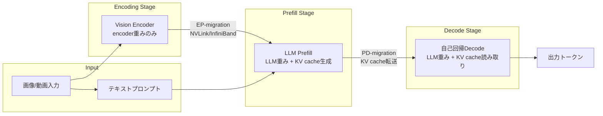
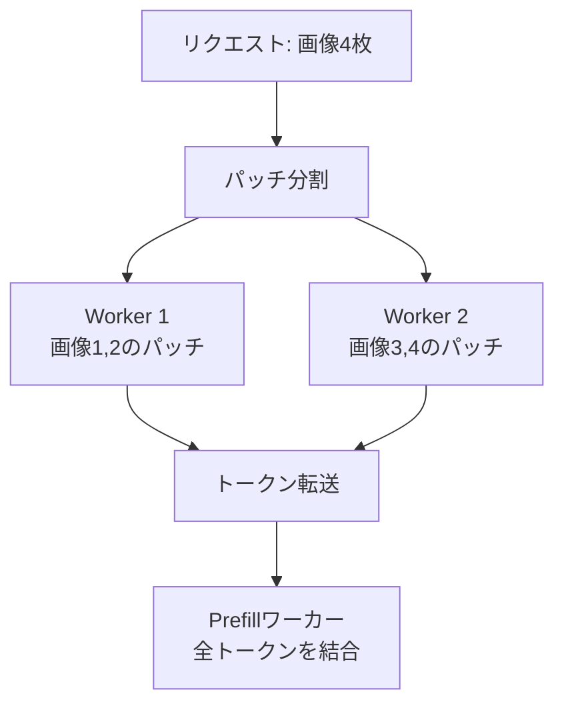

## 論文概要

本記事は、ICML 2025に採択された論文「Efficiently Serving Large Multimodal Models Using EPD Disaggregation」（Singh et al.）の解説記事です。著者自身が実験を行ったわけではなく、論文の内容を引用・解説しています。

Large Multimodal Model（LMM）はテキストに加えて画像・動画・音声を処理できるが、マルチモーダル入力のエンコーディングが計算・メモリの両面でボトルネックとなる。著者らは推論パイプラインを**Encoding（E）・Prefill（P）・Decode（D）**の3ステージに分離し、それぞれを専用GPUリソースに配置するEPDフレームワークを提案している。論文Table 1およびFigure 8-12の実験結果によれば、従来の一体型システム（vLLM）や2段階分離（DistServe）と比較して、ピークメモリ使用率を最大15倍削減、バッチサイズを最大22倍拡大、TTFTを最大71%短縮したと報告されている。

この記事は [Zenn記事: Gemini 2.5 Flash×Cloud Runでマルチモーダル推論APIを構築しコールドスタートを削減する](https://zenn.dev/0h_n0/articles/3797901f9b04a9) の深掘りです。

## 情報源

- **会議名**: ICML 2025（42nd International Conference on Machine Learning）
- **開催地**: Vancouver Convention Center, Vancouver, BC, Canada
- **開催日**: 2025年7月13日-19日
- **arXiv ID**: 2501.05460
- **URL**: [https://arxiv.org/abs/2501.05460](https://arxiv.org/abs/2501.05460)
- **著者**: Gursimran Singh, Xinglu Wang, Yifan Hu, Timothy Yu, Linzi Xing et al.
- **発表形式**: Poster（PMLR volume 267に収録）
- **コード**: [https://github.com/vbdi/epdserve](https://github.com/vbdi/epdserve)（CC BY-NC 4.0ライセンス）

## カンファレンス情報

**ICMLについて**: ICML（International Conference on Machine Learning）は、機械学習分野における最も権威ある国際会議の1つであり、NeurIPS・ICLRと並ぶトップカンファレンスとして位置づけられている。ICML 2025では12,107件の投稿に対して3,260件が採択され、採択率は26.9%であった（前年ICML 2024の27.5%からやや低下）。本論文はPoster発表として採択されている。

## 技術的詳細

### 背景: なぜ3ステージ分離が必要か

従来のLLMサービングでは、Prefill（プロンプト処理）とDecode（トークン生成）の2段階に分離するアプローチ（DistServeなど）が提案されてきた。しかしマルチモーダルモデルでは、画像・動画のエンコーディングステージが追加されることで新たな問題が生じる。

エンコーディング処理はLLM本体の重みを必要としないにもかかわらず、従来システムではPrefillと同一GPU上で実行されるため、以下の非効率が発生する:

1. **メモリの浪費**: エンコーディングワーカーがLLMの全重みをロードする必要があり、KV cacheに割り当て可能なメモリが圧迫される
2. **バッチサイズの制限**: 重み+KV cache+エンコーディング中間状態が同一GPUメモリを共有するため、バッチサイズが制約される
3. **TTFTの悪化**: エンコーディングの計算負荷がPrefillの開始を遅延させる

### EPDアーキテクチャ

EPDは推論パイプラインをEncoding・Prefill・Decodeの3つの独立したステージに分離し、各ステージに専用のスケジューラ・ブロックマネージャ・ワーカーを配置する。



各ステージの役割は以下の通りである:

- **Encoding**: Vision Encoderの重みのみをロードし、画像・動画パッチをトークン表現に変換する。LLM重みが不要なため、エンコーディングワーカーのピークメモリ使用率が大幅に低下する
- **Prefill**: テキストプロンプトとエンコーディング済みトークンを結合し、LLMのKV cacheを生成する。エンコーディング処理から解放されるため、Prefillのスループットが向上する
- **Decode**: KV cacheを参照しながら自己回帰的にトークンを生成する

### トークンキャッシングとMMBlockManager

ステージ間のトークン転送を効率化するため、EPDは**MMBlockManager**と呼ばれるキャッシュ管理モジュールを導入している。

処理の流れは以下の通りである:

1. 新規リクエスト到着時、MMBlockManagerがエンコーディング出力トークンのためのキャッシュブロックを事前確保する
2. エンコーディングワーカーが画像パッチを処理し、トークン表現を生成する
3. 生成されたトークンをNVLinkまたはInfiniBand経由でPrefillワーカーへ非同期転送する
4. 転送完了をイベントループで監視し、確認後にエンコーディング側のキャッシュエントリを解放する
5. エンコーディングワーカーは転送完了を待たずに次のリクエストの処理を開始できる

この非同期転送パイプラインにより、エンコーディングとPrefillの処理がオーバーラップし、全体のスループットが向上する。

### Intra-Request Parallelism（IRP）

複数画像を含むリクエスト（例: 動画フレーム64枚）では、エンコーディング処理がTTFTの支配的要因となる。IRPはこの問題を解決するため、単一リクエスト内の画像パッチを複数のエンコーディングワーカーにデータ並列で分配する。



各画像パッチは独立にエンコード可能であるため、ワーカー間の通信は不要である。各ワーカーが部分的なトークン表現を生成し、非同期にPrefillワーカーへ転送する。全パッチのトークンが到着した時点でアラインメント・プロジェクション処理を行い、完全なマルチモーダルトークン列を構成する。

著者らのアブレーション実験（論文Section 5.4）によれば、IRPを無効化するとTTFTが1.6倍-2.9倍悪化したと報告されている。

### Dynamic Role Switching

ワークロードの変動に応じて、GPUワーカーを異なるステージ間で動的に再割り当てするメカニズムである。例えば、エンコーディングキューが空でPrefillキューが混雑している場合、エンコーディングワーカーをPrefillワーカーに切り替える。

切り替えは3つのフェーズで実行される:

1. **Offload**: 元のステージのインスタンスが新規リクエストの受付を停止し、キュー内のタスクを他のワーカーに再分配する
2. **Migration**: 対象のステージ向けにモデル重みやキャッシュタイプを再構成する
3. **Onload**: 切り替え先のステージで処理を再開する

著者らによれば、この切り替えプロセスは通常0.7秒未満で完了する（論文Section 4.4）。PrefillとDecode間の切り替えはLLM重みが共通のため高速であり、エンコーディングが関与する切り替えはモデル変更を伴うためやや遅い。処理中のリクエストは中断されない。

### リソース配分の最適化

EPDは各ステージへのGPU配分を最適化するため、以下の目的関数を用いたベイズ最適化を適用している:

$$
\max_{\mathbf{p}, \mathbf{b}, \mathbf{s}} f(\mathbf{p}, \mathbf{b}, \mathbf{s}) - \beta \cdot \text{cost}(\mathbf{p})
$$

ここで、
- $\mathbf{p}$: 各ステージの並列化構成（テンソル並列度、パイプライン並列度）
- $\mathbf{b}$: 各ステージの最大バッチサイズ
- $\mathbf{s}$: スケジューリング戦略
- $f(\cdot)$: goodput（SLO達成率に基づくスループット指標）
- $\text{cost}(\mathbf{p})$: GPU使用量
- $\beta$: コスト-性能トレードオフパラメータ

このベイズ最適化は、DistServeのシミュレータを拡張して3ステージ構成に対応させたものである。

## 実装のポイント

EPDServeの参照実装（[GitHub: vbdi/epdserve](https://github.com/vbdi/epdserve)）はPython + C++/CUDAで構成されており、vLLM 0.6.1.post2をベースとしている。

**実装上の要件と注意点**:

- **GPU要件**: 最低4 GPU（推奨8 GPU以上）。NVIDIA A100 82GBで検証されている
- **CUDA環境**: CUDA Toolkit 12.1、CUDA Driver 525.105.17以上、Flash Attention-2対応
- **ステージ間通信**: NVLinkまたはInfiniBand経由のCUDA IPC（Inter-Process Communication）を使用。`csrc/`配下のC++/CUDAユーティリティをビルドする必要がある
- **精度**: FP16推論を前提としている
- **ライセンス**: CC BY-NC 4.0（非商用利用限定）

vLLMのImage Processor設定を変更する必要があり、エンコーディングワーカーとPrefill/Decodeワーカーでロードするモデル重みを分離する処理がカスタマイズの中核となる。

Huawei Ascend NPU（910B3、64GBメモリ）への適用も報告されており、エンコーディングがTTFTの大部分を占める環境ではvLLMベースラインに対してさらに10%の改善が確認されたと論文Section 5.5で述べられている。

## Production Deployment Guide

EPDの3ステージ分離アーキテクチャをAWS上で実現するためのデプロイメントガイドを示す。マルチモーダルモデルの推論サービングでは、エンコーディング・Prefill・Decodeそれぞれに異なるGPUリソースを配分する必要があるため、通常のLLMサービングよりもインフラ設計が複雑になる。

### AWS実装パターン（コスト最適化重視）

EPDアーキテクチャのステージ分離をAWS上で実現する場合、トラフィック量に応じて以下の構成を推奨する。コスト試算は2026年5月時点のap-northeast-1（東京）リージョン料金に基づく概算値であり、実際のコストはトラフィックパターン・リージョン・バースト使用量により変動する。最新料金はAWS料金計算ツールで確認を推奨する。

| 構成 | トラフィック | GPU構成 | 月額概算 |
|------|-------------|---------|---------|
| Small | ~100 req/日 | g5.xlarge x2（Encoding+Prefill共有, Decode） | $1,500-2,500 |
| Medium | ~1,000 req/日 | g5.2xlarge x4（E:1, P:2, D:1） | $5,000-8,000 |
| Large | 10,000+ req/日 | p4d.24xlarge x2（A100 x16、EPD分離） | $40,000-60,000 |

**Small構成の内訳**:
- g5.xlarge（NVIDIA A10G 24GB）x2: $1,006/月 x2 = $2,012
- Application Load Balancer: ~$20/月
- CloudWatch監視: ~$15/月
- S3モデルストレージ: ~$5/月

**コスト削減テクニック**:
- **Spot Instances活用**: エンコーディングワーカーはステートレスのためSpot中断に耐性がある。Spot価格はg5.xlarge On-Demandの最大70%削減
- **Reserved Instances**: Decode用GPUは常時稼働のためRI購入で最大72%削減
- **Savings Plans**: 1年コミットで最大40%削減
- **動的スケーリング**: 夜間・早朝のトラフィック低下時にエンコーディングワーカーをスケールダウン

### Terraformインフラコード

**Small構成（GPU x2、EPD簡易分離）** の主要リソース:

```hcl
# EPD Small構成: g5.xlarge x2
# Encoding+Prefill共有インスタンス + Decodeインスタンス
# Terraform >= 1.9, AWS Provider ~> 5.80

# --- GPUインスタンス（EPDステージ分離） ---
resource "aws_instance" "encode_prefill" {
  ami                  = "ami-0abcdef1234567890" # Deep Learning AMI (Ubuntu)
  instance_type        = "g5.xlarge"             # A10G 24GB
  subnet_id            = aws_subnet.private[0].id
  iam_instance_profile = aws_iam_instance_profile.epd.name
  root_block_device {
    volume_size = 200  # モデル重み格納用
    volume_type = "gp3"
    encrypted   = true # KMS暗号化
  }
  tags = { Name = "epd-encode-prefill", Role = "encoding,prefill" }
}

resource "aws_instance" "decode" {
  ami           = "ami-0abcdef1234567890"
  instance_type = "g5.xlarge"
  subnet_id     = aws_subnet.private[1].id
  root_block_device { volume_size = 200, volume_type = "gp3", encrypted = true }
  tags = { Name = "epd-decode", Role = "decode" }
}
```

**Large構成（EKS + Karpenter、Spot優先）** の主要リソース:

```hcl
# EKS 1.31 + terraform-aws-modules/eks/aws ~> 20.31
module "eks" {
  source          = "terraform-aws-modules/eks/aws"
  version         = "~> 20.31"
  cluster_name    = "epd-serving-cluster"
  cluster_version = "1.31"
  cluster_endpoint_public_access = false  # プライベートのみ

  eks_managed_node_groups = {
    decode = {
      instance_types = ["g5.2xlarge"]  # Decode: On-Demand（常時稼働）
      capacity_type  = "ON_DEMAND"
      min_size = 2, max_size = 4, desired_size = 2
      labels = { "epd-role" = "decode" }
    }
  }
}

# Karpenter NodePool: Encodingワーカー用Spot優先
# g5.xlarge/g5.2xlarge Spot, consolidateAfter = 60s
# Budgets: $50,000/月、80%で通知
```

セキュリティ要件として、IAMロールは最小権限（S3モデル読み取りのみ）、EBSはKMS暗号化、EKSはプライベートエンドポイントのみを設定する。

### 運用・監視設定

**CloudWatch Logs Insights クエリ**:

```
# TTFT異常検知（P95が閾値を超えた場合）
fields @timestamp, request_id, ttft_ms, stage
| filter stage = "prefill"
| stats percentile(ttft_ms, 95) as p95_ttft by bin(1h)
| filter p95_ttft > 2000

# ステージ別スループット分析
fields @timestamp, stage, batch_size, throughput_tokens_per_sec
| stats avg(throughput_tokens_per_sec) as avg_throughput,
        max(batch_size) as max_batch
  by stage, bin(5m)
```

**CloudWatchアラーム設定（Python）**:

```python
import boto3

cloudwatch = boto3.client("cloudwatch", region_name="ap-northeast-1")

def create_ttft_alarm(threshold_ms: float = 3000.0) -> None:
    """TTFT異常検知アラームを作成する（P95、5分間隔x3評価）。"""
    cloudwatch.put_metric_alarm(
        AlarmName="epd-ttft-high",
        MetricName="TTFT", Namespace="EPDServing",
        Statistic="p95", Period=300, EvaluationPeriods=3,
        Threshold=threshold_ms,
        ComparisonOperator="GreaterThanThreshold",
        AlarmActions=["arn:aws:sns:ap-northeast-1:ACCOUNT:epd-alerts"],
        Dimensions=[{"Name": "Stage", "Value": "prefill"}],
    )
```

**X-Rayトレーシング**: `aws_xray_sdk.core`の`patch_all()`でboto3を自動計装し、`stage`（encoding/prefill/decode）と`request_id`をアノテーションとして記録する。

**Cost Explorer日次レポート（Python）**:

```python
import boto3
from datetime import date, timedelta

def daily_cost_report() -> dict:
    """日次コストを取得し$100超でSNS通知。"""
    ce = boto3.client("ce", region_name="us-east-1")
    today, yesterday = date.today(), date.today() - timedelta(days=1)
    resp = ce.get_cost_and_usage(
        TimePeriod={"Start": yesterday.isoformat(), "End": today.isoformat()},
        Granularity="DAILY", Metrics=["UnblendedCost"],
        GroupBy=[{"Type": "DIMENSION", "Key": "SERVICE"}],
    )
    costs = {g["Keys"][0]: float(g["Metrics"]["UnblendedCost"]["Amount"])
             for g in resp["ResultsByTime"][0]["Groups"]
             if float(g["Metrics"]["UnblendedCost"]["Amount"]) > 0}
    if sum(costs.values()) > 100.0:
        boto3.client("sns", region_name="ap-northeast-1").publish(
            TopicArn="arn:aws:sns:ap-northeast-1:ACCOUNT:epd-cost-alert",
            Subject=f"EPD Cost Alert: ${sum(costs.values()):.2f}",
            Message=str(costs))
    return costs
```

### コスト最適化チェックリスト

**アーキテクチャ選択**:
- [ ] トラフィック量に応じた構成選択（Small/Medium/Large）
- [ ] ステージ別GPU要件の見積もり（Encodingは小型GPU可、Decode/Prefillは大型GPU推奨）
- [ ] マルチモーダル入力比率に応じたEncoding/Prefill/Decode比率の設定

**リソース最適化**:
- [ ] Encodingワーカー: Spot Instances優先（ステートレスのため中断耐性あり）
- [ ] Decodeワーカー: Reserved Instances（1年コミット、最大72%削減）
- [ ] Savings Plans検討（Compute Savings Plans）
- [ ] 夜間・早朝のスケールダウン設定
- [ ] GPU使用率に応じたインスタンスタイプ選択（A10G vs A100）

**推論コスト削減**:
- [ ] Dynamic Role SwitchingによるアイドルGPU削減
- [ ] IRPによるEncoding並列化でTTFT短縮・スループット向上
- [ ] トークンキャッシングによるメモリ効率化
- [ ] バッチサイズ最大化による単位リクエストあたりコスト削減

**監視・アラート**:
- [ ] AWS Budgets設定（月額上限アラート）
- [ ] CloudWatch TTFT/TPOTアラーム
- [ ] Cost Anomaly Detection有効化
- [ ] 日次コストレポート自動送信
- [ ] GPU使用率ダッシュボード

**リソース管理**:
- [ ] 未使用GPUインスタンス自動停止
- [ ] タグ戦略（ステージ別、環境別）
- [ ] EBSスナップショットライフサイクルポリシー
- [ ] 開発環境の夜間停止スケジュール
- [ ] モデル重みのS3 Intelligent-Tiering

## 実験結果

著者らはNVIDIA A100 GPU（82GB）x8の環境で、MiniCPM-V 2.6（8B）、InternVL2-8B、InternVL2-26Bの3モデルについて評価を実施している。

### メモリ・容量の改善

論文Table 1より、EPDによるエンコーディングワーカーの改善は以下の通りである:

| 指標 | 改善内容 | 数値 |
|------|---------|------|
| ピークメモリ使用率 | LLM重み不要による削減 | 最大15倍削減 |
| バッチサイズ | KV cache用メモリ確保 | 最大22倍拡大（InternVL2-26B） |
| リクエスト当たり画像数 | 高解像度対応 | 10倍増加 |
| KV cacheサイズ | メモリ再配分 | 2.2倍拡大（80% vs 36%） |

エンコーディングワーカーの重みメモリ削減率は、MiniCPM-V 2.6で約95%、InternVL2-8Bで約96.2%、InternVL2-26Bで約78.3%と報告されている（論文Table 1）。

### レイテンシの改善

論文Figure 8-12の実験結果に基づくレイテンシ改善:

| 指標 | ベースライン | EPD | 改善率 |
|------|-------------|-----|--------|
| TTFT（Video-MME、64フレーム） | DistServe基準 | EPD | 68.2%削減 |
| TTFT（最大改善） | DistServe基準 | EPD | 71%削減 |
| SLO達成率 | vLLM/DistServe基準 | EPD | 90-100%改善 |

### ベースライン比較

著者らは以下の3システムと比較実験を行っている:

- **vLLM（monolithic）**: 全ステージを同一GPU上で実行。EPDは全テストモデル・全指標で優位
- **DistServe（PD分離）**: Prefill-Decode分離のみ。エンコーディングはPrefillと同一GPUで処理。EPDはTTFTで最大71%の改善
- **Aggregated EP**: エンコーディングとPrefillを同一GPUで処理し、Decodeのみ分離。EPDはメモリ効率とバッチサイズで優位

NextQAおよびVideo-MMEデータセットでの評価でも安定した性能が確認されている。

## 実運用への応用

EPDの3ステージ分離は、関連Zenn記事で取り上げたGemini 2.5 FlashとCloud Runによるマルチモーダル推論API構築と密接に関連する。

**Cloud Run環境との対応関係**: Cloud Runのコールドスタート問題はEPDにおけるエンコーディングステージの遅延と構造的に類似している。Zenn記事で述べられているコンテナの最小起動インスタンス設定は、EPDのDynamic Role Switchingと同様に「待機リソースをどこに配置するか」という問題を解決するアプローチである。

**実運用での適用シナリオ**:

1. **動画解析API**: 防犯カメラ映像や医療画像の解析で、複数フレームを同時にエンコードするIRPが有効。TTFTの短縮はリアルタイム応答が求められるアプリケーションで重要となる
2. **マルチモーダルRAG**: ドキュメント画像とテキストを組み合わせた検索拡張生成で、エンコーディングとPrefillの分離によりバッチ処理の効率が向上する
3. **コスト効率**: エンコーディングワーカーにはLLM重みが不要なため、小型GPUで運用可能。ステージ分離によりリソースの適材適所配置が実現する

ただし、EPDServeの参照実装はCC BY-NC 4.0ライセンス（非商用）である点に注意が必要である。商用利用には別途ライセンス交渉または独自実装が求められる。

## 関連研究

- **DistServe**（Zhong et al., OSDI 2024）: Prefill-Decode分離によるLLMサービングの先駆的研究。EPDはこのPD分離をマルチモーダル文脈に拡張し、エンコーディングステージを追加で分離した位置づけにある
- **vLLM**（Kwon et al., SOSP 2023）: PagedAttentionによるメモリ効率的なLLMサービング。EPDはvLLMをベースラインとして比較しており、vLLM 0.6.1.post2上にEPDServeの参照実装が構築されている
- **Cornserve**（Ma et al., 2024）: Any-to-Anyマルチモーダルモデル向けの効率的サービングシステム。EPDと同様にマルチモーダルエンコーディングの分離に取り組んでいるが、対象とするモデルアーキテクチャの範囲が異なる
- **vLLM-Omni**（2026）: vLLMを拡張した完全分離型マルチモーダルサービング。EPDの研究を受けて、エンコーディング分離を標準機能として組み込む方向で開発が進んでいる

## まとめ

EPD Disaggregationは、マルチモーダルモデルの推論パイプラインをEncoding・Prefill・Decodeの3ステージに分離することで、メモリ効率・バッチサイズ・レイテンシの3指標を同時に改善するフレームワークである。著者らの報告によれば、ピークメモリ15倍削減・バッチサイズ22倍拡大・TTFT 71%短縮という改善を実現している。

IRPによる画像パッチのデータ並列処理とDynamic Role Switchingによる動的リソース再配分は、ワークロードの変動が大きい実運用環境で有効な設計である。ICML 2025に採択されたことからも、マルチモーダルLLMサービングにおけるステージ分離が学術的にも認められたアプローチであることが確認できる。今後はvLLM-Omniなどの後続研究によって、Any-to-Anyモデルへの拡張や、より多様なハードウェア（NPU、TPU等）への適用が進むと考えられる。

## 参考文献

- **arXiv**: [https://arxiv.org/abs/2501.05460](https://arxiv.org/abs/2501.05460)
- **ICML 2025 Poster**: [https://icml.cc/virtual/2025/poster/44120](https://icml.cc/virtual/2025/poster/44120)
- **Code**: [https://github.com/vbdi/epdserve](https://github.com/vbdi/epdserve)
- **OpenReview**: [https://openreview.net/forum?id=n7VLFYNoCb](https://openreview.net/forum?id=n7VLFYNoCb)
- **DistServe**: [https://arxiv.org/abs/2401.09670](https://arxiv.org/abs/2401.09670)
- **Related Zenn article**: [https://zenn.dev/0h_n0/articles/3797901f9b04a9](https://zenn.dev/0h_n0/articles/3797901f9b04a9)
