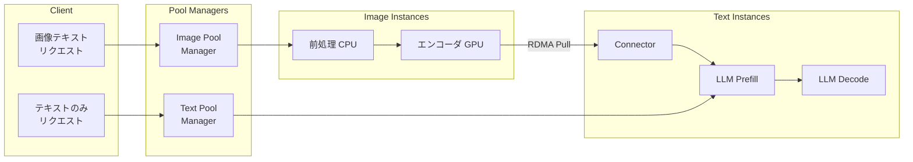

## 論文概要

本記事は [ModServe: Modality- and Stage-Aware Resource Disaggregation for Scalable Multimodal Model Serving](https://arxiv.org/abs/2502.00937) (Qiu et al., ACM SoCC 2025) の解説記事です。本記事は引用・解説であり、筆者が独自に実験を行ったものではありません。

ModServeは、大規模マルチモーダルモデル (Large Multimodal Model; LMM) の推論サービングにおいて、画像エンコーディング・LLM Prefill・Decodeの3ステージをリソースレベルで分離し、モダリティを考慮したスケジューリングとオートスケーリングを導入するシステムです。著者らは、128 GPUクラスタ上でAzureの本番トレースを用いた評価において、モノリシックなvLLMと比較して3.3〜5.5倍のスループット向上と25〜41.3%のGPUコスト削減を達成したと報告しています。

関連するZenn記事「[Gemini 2.5 Flash×Cloud Runでマルチモーダル推論APIを構築しコールドスタートを削減する](https://zenn.dev/0h_n0/articles/3797901f9b04a9)」では、サーバーレス環境でのマルチモーダル推論APIの実運用について解説しています。本論文で明らかにされたマルチモーダル推論のボトルネック構造は、Cloud Runのようなサーバーレス環境においてもリソース最適化の指針となります。

## 情報源

- **論文**: [ModServe: Modality- and Stage-Aware Resource Disaggregation for Scalable Multimodal Model Serving](https://arxiv.org/abs/2502.00937) (arXiv:2502.00937)
- **会議**: ACM Symposium on Cloud Computing (SoCC) 2025
- **著者所属**: Microsoft Research, University of Virginia 他
- **公開日**: 2025年2月2日 (初版)、2025年10月22日 (v3)

## 背景と動機

GPT-4o、Gemini、LLaMAなどの大規模マルチモーダルモデルは、テキストに加えて画像・音声・動画を入力として受け付ける。しかし、これらのモデルを本番環境で効率的にサービングすることには固有の困難がある。

第一に、マルチモーダル推論は複数のステージ（画像前処理、エンコーディング、LLM Prefill、Decode）から構成され、各ステージのリソース特性が大きく異なる。画像エンコーダとLLMバックエンドでは最適なテンソル並列度が異なり、バッチ効率もステージごとに異なる。著者らの分析によれば、CroAttn（Cross-Attention）モデルでは画像エンコーディングがTTFT（Time To First Token）の79%を占めるにもかかわらず、従来のモノリシックなサービングではこれらが同一GPU上で共存し、リソースの競合が発生する。

第二に、本番環境のトラフィックパターンは画像を含むリクエストとテキストのみのリクエストが独立したバースト特性を示す。著者らがAzureの本番トレースを分析した結果、画像テキストリクエストはテキストのみのリクエストと比較して5倍高いプロンプトトークンレートを示し、これらのバーストが時間的に独立して発生することが明らかになっている。この非対称なトラフィック特性に対して、従来の均一なスケーリングでは過剰プロビジョニングか性能劣化のいずれかを招く。

## 主要な貢献

著者らが主張する本論文の貢献は以下の通りである。

- **包括的なシステム分析**: Decoder-Only（InternVLなど）とCross-Attention（Llama 3.2など）の2つのLMMアーキテクチャについて、6つのオープンソースモデルで初の体系的なシステム特性分析を実施し、7つの設計知見を導出
- **本番トレース分析**: Azureの本番LMM推論トレースを分析し、可変で裾の重い（heavy-tailed）リクエスト分布とバースト的なトラフィックパターンを明らかにした
- **ステージ分離アーキテクチャ**: 画像エンコーディングとLLM推論をImage InstancesとText Instancesに分離し、独立した最適化・スケーリングを可能にする設計
- **モダリティ対応スケジューリング**: 画像トークン負荷とテキストトークン負荷に基づくルーティング、およびSLO駆動の優先度スケジューリング
- **トークン認識オートスケーリング**: モダリティ固有の負荷メトリクスに基づく独立したスケーリング機構

## 技術的詳細

### アーキテクチャ概要

ModServeの中核は、マルチモーダル推論パイプラインをImage InstancesとText Instancesの2種類の計算インスタンスに分離する設計にある。



**Image Instances** は画像の前処理（CPU上でのリサイズ・正規化）とエンコーディング（GPU上でのViTなどによるトークン化）を担当する。画像前処理は画像間の依存関係がないため、リクエスト内の複数画像を複数エンコーダに分散して並列処理できる（リクエストレベル並列化）。

**Text Instances** はLLMのPrefillとDecodeを担当する。Connectorモジュール（画像トークンをLLMの入力空間に射影する層）はLLMバックエンドと同一GPUに配置される。著者らの測定によれば、ConnectorのレイテンシはTTFT全体の0.4%未満であり、分離によるオーバーヘッドを正当化しないためである。

### Pull-based RDMAトークン転送

Image InstancesからText Instancesへの画像トークン転送には、Pull-based RDMA（Remote Direct Memory Access）が採用されている。この設計では、画像エンコーディングが完了した後にText InstancesがImage Instancesからトークンをプルする。この方式の利点は、Text Instances側でルーティング判断に必要な全情報（画像トークン数、リクエストサイズ）が揃った状態でスケジューリングできることにある。

著者らの測定では、InfiniBand上のRDMA転送はP99で5msであり、TTFTへの影響はCroAttnモデルで0.5%未満、DecOnlyモデルで0.3%未満と報告されている。一方、TCPを用いた転送ではP50で100ms、P99で180msのレイテンシが発生し、RDMAの優位性が明確である。

### モダリティ対応スケジューリング

スケジューリングは以下の3つの要素で構成される。

**画像ルーティング**: 画像テキストリクエストを、画像トークン負荷が最も低いImage Instanceにルーティングする。大きなリクエスト（多数の画像を含む）は複数のエンコーダに画像を分散させるリクエストレベル並列化を適用する。

**テキストルーティング**: テキストリクエストを、保留中のテキストトークンが最も少ないText Instanceにルーティングする。ここで重要なのは、DecOnlyモデルとCroAttnモデルでルーティング基準が異なることである。DecOnlyモデルでは画像トークンもテキストトークンも等しくPrefillレイテンシに寄与するため、総トークン数でルーティングする。一方、CroAttnモデルでは画像トークンがCross-Attention層で処理されるためPrefillへの影響が限定的であり、テキストトークン数のみでルーティングする。

**SLO駆動インスタンスレベルスケジューリング**: 従来のFIFOスケジューリングを、SLO（Service Level Objective）を考慮した優先度スケジューリングに置き換える。短いリクエストを優先することで、Head-of-Line Blockingを軽減する。

### オートスケーリング

ModServeのオートスケーリングは、モダリティ固有の負荷メトリクスに基づいて各インスタンスタイプを独立にスケーリングする。必要なレプリカ数は以下の式で算出される。

$$
\text{replicas} = \left\lceil \frac{M_L}{M_C} \right\rceil
$$

ここで、$$M_L$$ はモダリティ固有の負荷（Image Instancesでは image tokens/sec、Text Instancesでは prompt tokens/sec）、$$M_C$$ はオフラインプロファイリングで決定されたSLO違反なしでの最大容量である。

画像トークン数は、モデルごとに固定された画像サイズ-トークン数マッピングから事前計算される。SLO達成率が閾値（デフォルト0.99）を下回った場合にスケーリングが発動し、5分間隔で再構成が実行される。

## 実装のポイント

ModServeは約5,000行のPythonで実装されており、Text InstancesのベースにはvLLM v0.7.2、Image InstancesにはHuggingFace Transformersが使用されている。

**Pool Managers** は各インスタンスプール（Image Pool、Text Pool）を管理する軽量なgRPCサーバーであり、専用VMにデプロイされる。リクエストのルーティングとインスタンスの負荷監視を担当する。

**GPU間通信** にはPyTorchのNCCLバックエンドとGPU Direct RDMAが使用される。同一サーバー内ではNVLINK 3.0による高速通信が可能であり、サーバー間ではInfiniBandを介したRDMA転送が行われる。

**障害検出** にはHeartbeatベースのメンバーシップ管理が実装されている。著者らは、この機構がRaftプロトコルに拡張可能であると述べている。

**コロケーション戦略**: テキスト処理が全GPUを消費しない場合、同一サーバー上にImage InstancesとText Instancesを配置することで転送オーバーヘッドを回避できる。例えば、8 GPUサーバー上でTP-4のText Instance 1つとTP-2のImage Instance 2つを配置する構成が示されている。

## Production Deployment Guide

本セクションでは、ModServeの設計原理を実運用環境に適用するための実践的なガイドを提供する。論文の知見とvLLMエコシステムの最新動向を踏まえ、段階的な導入アプローチを解説する。

### ステップ1: ワークロード特性の分析

実運用への適用にあたり、まず自身のワークロードの特性を把握することが不可欠である。ModServeの著者らが導出した7つの設計知見に基づき、以下の点を分析する。

**モダリティ比率の把握**: トラフィックに占める画像テキストリクエストとテキストのみリクエストの比率を計測する。著者らの分析では、本番トラフィックにおいて画像テキストリクエストはテキストのみのリクエストと比較して5倍高いプロンプトトークンレートを示すと報告されている。この比率によって、Image InstancesとText Instancesの最適な割り当て比率が大きく変わる。

**TTFTボトルネックの特定**: 使用するモデルアーキテクチャに応じてボトルネックが異なる。CroAttnモデル（Llama 3.2等）では画像エンコーディングがTTFTの65〜79%を占める一方、DecOnlyモデル（InternVL等）では25〜54%である。この差異はリソース配分戦略に直接影響する。

**バースト特性の確認**: 画像バーストとテキストバーストが独立して発生するかを確認する。独立している場合、モダリティ別の独立スケーリングの恩恵が大きい。

```python
# ワークロード分析のためのメトリクス収集例
from dataclasses import dataclass
from collections import deque
import time

@dataclass
class RequestMetrics:
    """リクエストごとのメトリクスを記録する構造体."""

    timestamp: float
    has_images: bool
    num_images: int
    image_tokens: int
    text_tokens: int
    ttft_ms: float
    encode_time_ms: float
    prefill_time_ms: float


class WorkloadAnalyzer:
    """ModServe導入判断のためのワークロード分析器.

    直近のリクエストメトリクスを保持し、
    モダリティ比率やTTFTボトルネックを分析する。
    """

    def __init__(self, window_size: int = 10000) -> None:
        self._metrics: deque[RequestMetrics] = deque(maxlen=window_size)

    def record(self, metrics: RequestMetrics) -> None:
        """メトリクスを記録する."""
        self._metrics.append(metrics)

    def modality_ratio(self) -> dict[str, float]:
        """画像テキストリクエストとテキストのみリクエストの比率を返す."""
        if not self._metrics:
            return {"image_text": 0.0, "text_only": 0.0}
        image_text = sum(1 for m in self._metrics if m.has_images)
        total = len(self._metrics)
        return {
            "image_text": image_text / total,
            "text_only": (total - image_text) / total,
        }

    def ttft_breakdown(self) -> dict[str, float]:
        """TTFTに占めるエンコーディング時間の平均比率を返す."""
        image_requests = [m for m in self._metrics if m.has_images]
        if not image_requests:
            return {"encode_ratio": 0.0, "prefill_ratio": 0.0}
        avg_encode_ratio = sum(
            m.encode_time_ms / m.ttft_ms for m in image_requests
        ) / len(image_requests)
        return {
            "encode_ratio": avg_encode_ratio,
            "prefill_ratio": 1.0 - avg_encode_ratio,
        }
```

### ステップ2: モデルアーキテクチャの選定と分離戦略

ModServeの知見に基づくモデルアーキテクチャ別の推奨構成を以下に示す。

| 特性 | CroAttn (Llama 3.2等) | DecOnly (InternVL等) |
|------|----------------------|---------------------|
| 画像エンコーディングのTTFT寄与率 | 65-79% | 25-54% |
| LLM Prefillレイテンシ (相対) | 1x | 10x |
| 推奨Image:Text比率 | 高め (2:1以上) | 低め (1:1程度) |
| ルーティング基準 | テキストトークン数のみ | 総トークン数 |
| 分離による改善幅 | 大 | 中 |

著者らの感度分析によれば、Image:Text Instanceの最適比率は2.4:1を超える場合にスループットが安定する傾向が示されている（画像テキストリクエスト比率10-90%の範囲）。

### ステップ3: vLLM EPDによる段階的導入

ModServeの設計原理は、vLLM v0.11.1以降でネイティブサポートされたEPD（Encoder-Prefill-Decode）分離機能として利用可能となっている。以下に段階的な導入手順を示す。

**フェーズ1: ベースライン計測（モノリシック構成）**

```bash
# vLLMモノリシック構成でのベースライン計測
# 全ステージが同一GPU上で動作する
python -m vllm.entrypoints.openai.api_server \
    --model meta-llama/Llama-3.2-11B-Vision-Instruct \
    --tensor-parallel-size 4 \
    --max-model-len 8192 \
    --port 8000
```

**フェーズ2: エンコーダ分離の導入**

```bash
# Image Instance: エンコーダ専用サーバー
# データ並列でエンコーダを複数GPU上に展開
python -m vllm.entrypoints.openai.api_server \
    --model meta-llama/Llama-3.2-11B-Vision-Instruct \
    --role encoder \
    --data-parallel-size 4 \
    --port 8001

# Text Instance: LLMバックエンド専用サーバー
# テンソル並列でPrefill/Decodeを実行
python -m vllm.entrypoints.openai.api_server \
    --model meta-llama/Llama-3.2-11B-Vision-Instruct \
    --role decoder \
    --tensor-parallel-size 4 \
    --port 8002
```

**フェーズ3: モダリティ対応ルーティングの実装**

```python
import hashlib
from dataclasses import dataclass


@dataclass
class InstanceLoad:
    """インスタンスの現在の負荷情報."""

    instance_id: str
    pending_image_tokens: int
    pending_text_tokens: int
    pending_total_tokens: int


class ModalityAwareRouter:
    """ModServeのモダリティ対応ルーティングを簡略化した実装.

    画像リクエストは画像トークン負荷が最小のImage Instanceへ、
    テキストリクエストは保留テキストトークンが最小のText Instanceへ
    ルーティングする。
    """

    def __init__(
        self,
        image_instances: list[str],
        text_instances: list[str],
        model_type: str = "cross_attention",
    ) -> None:
        self._image_instances = image_instances
        self._text_instances = text_instances
        self._model_type = model_type
        self._loads: dict[str, InstanceLoad] = {}

    def route_image_request(
        self,
        image_token_count: int,
    ) -> str:
        """画像テキストリクエストのルーティング先を決定する.

        最も画像トークン負荷の低いImage Instanceを選択する。
        """
        candidates = [
            self._loads.get(
                iid,
                InstanceLoad(iid, 0, 0, 0),
            )
            for iid in self._image_instances
        ]
        return min(
            candidates,
            key=lambda l: l.pending_image_tokens,
        ).instance_id

    def route_text_request(self) -> str:
        """テキストリクエストのルーティング先を決定する.

        CroAttnモデル: テキストトークン数のみで判断
        DecOnlyモデル: 総トークン数で判断
        """
        candidates = [
            self._loads.get(
                tid,
                InstanceLoad(tid, 0, 0, 0),
            )
            for tid in self._text_instances
        ]
        if self._model_type == "cross_attention":
            return min(
                candidates,
                key=lambda l: l.pending_text_tokens,
            ).instance_id
        else:
            return min(
                candidates,
                key=lambda l: l.pending_total_tokens,
            ).instance_id

    def update_load(self, load: InstanceLoad) -> None:
        """インスタンスの負荷情報を更新する."""
        self._loads[load.instance_id] = load
```

### ステップ4: トークン認識オートスケーリングの実装

Kubernetes環境でModServeのオートスケーリング原理を適用する場合、カスタムメトリクスに基づくHPA（Horizontal Pod Autoscaler）を構成する。

```python
import math
from dataclasses import dataclass


@dataclass
class ScalingConfig:
    """オートスケーリングの設定パラメータ."""

    slo_threshold: float = 0.99
    reconfigure_interval_sec: int = 300  # 5分
    image_capacity_tokens_per_sec: float = 50000.0
    text_capacity_tokens_per_sec: float = 30000.0


def compute_replicas(
    modality_load: float,
    max_capacity: float,
) -> int:
    """ModServeのオートスケーリング式に基づくレプリカ数の算出.

    replicas = ceil(M_L / M_C)

    Args:
        modality_load: モダリティ固有の負荷 (tokens/sec)
        max_capacity: SLO違反なしでの最大容量 (tokens/sec)

    Returns:
        必要なレプリカ数

    """
    if max_capacity <= 0:
        raise ValueError("max_capacity must be positive")
    return max(1, math.ceil(modality_load / max_capacity))


class TokenAwareAutoscaler:
    """トークン認識オートスケーリングの実装.

    Image InstancesとText Instancesを独立にスケーリングする。
    """

    def __init__(self, config: ScalingConfig) -> None:
        self._config = config
        self._current_slo_attainment: float = 1.0

    def should_scale(self) -> bool:
        """SLO達成率が閾値を下回った場合にスケーリングを発動する."""
        return self._current_slo_attainment < self._config.slo_threshold

    def compute_image_replicas(
        self,
        image_tokens_per_sec: float,
    ) -> int:
        """Image Instancesの必要レプリカ数を算出する."""
        return compute_replicas(
            image_tokens_per_sec,
            self._config.image_capacity_tokens_per_sec,
        )

    def compute_text_replicas(
        self,
        prompt_tokens_per_sec: float,
    ) -> int:
        """Text Instancesの必要レプリカ数を算出する."""
        return compute_replicas(
            prompt_tokens_per_sec,
            self._config.text_capacity_tokens_per_sec,
        )

    def update_slo_attainment(self, attainment: float) -> None:
        """SLO達成率を更新する."""
        self._current_slo_attainment = attainment
```

### ステップ5: コロケーション戦略と転送最適化

同一サーバー内にImage InstancesとText Instancesを配置することで、ネットワーク転送のオーバーヘッドを回避できる。著者らが示した構成例を以下に示す。

```
8 GPU サーバーの構成例:
┌─────────────────────────────────────────┐
│  GPU 0-3: Text Instance (TP-4, LLM)    │
│  GPU 4-5: Image Instance 1 (TP-2, ViT) │
│  GPU 6-7: Image Instance 2 (TP-2, ViT) │
│                                         │
│  GPU 0-3 <-> GPU 4-7: NVLINK 3.0       │
│  サーバー間: InfiniBand RDMA            │
└─────────────────────────────────────────┘
```

この構成では、サーバー内のトークン転送にNVLINK 3.0を使用でき、サーバー間転送と比較してレイテンシを大幅に削減できる。著者らによれば、RDMA転送のP99レイテンシは5msであり、TTFTへの影響は0.5%未満に抑えられるとのことである。

### ステップ6: SLO駆動スケジューリングの適用

FIFOスケジューリングからSLO駆動スケジューリングへの移行は、Head-of-Line Blockingの軽減に有効である。特に、リクエストサイズの分散が大きい本番環境において効果を発揮する。

```python
from dataclasses import dataclass, field
import heapq


@dataclass(order=True)
class PrioritizedRequest:
    """SLO駆動優先度付きリクエスト.

    短いリクエストを優先し、Head-of-Line Blockingを軽減する。
    """

    priority: float
    request_id: str = field(compare=False)
    total_tokens: int = field(compare=False)
    deadline_ms: float = field(compare=False)


class SLODrivenScheduler:
    """SLO駆動のインスタンスレベルスケジューラ.

    FIFOを置き換え、リクエストの推定処理時間と
    SLOデッドラインに基づいて優先度を決定する。
    """

    def __init__(self) -> None:
        self._queue: list[PrioritizedRequest] = []

    def enqueue(
        self,
        request_id: str,
        total_tokens: int,
        slo_deadline_ms: float,
    ) -> None:
        """リクエストをキューに追加する.

        優先度 = 推定処理時間 / 残りSLO猶予
        値が小さいほど高優先度（短いリクエストが優先される）
        """
        priority = total_tokens / max(slo_deadline_ms, 1.0)
        req = PrioritizedRequest(
            priority=priority,
            request_id=request_id,
            total_tokens=total_tokens,
            deadline_ms=slo_deadline_ms,
        )
        heapq.heappush(self._queue, req)

    def dequeue(self) -> PrioritizedRequest | None:
        """最も優先度の高いリクエストを取り出す."""
        if self._queue:
            return heapq.heappop(self._queue)
        return None

    def __len__(self) -> int:
        return len(self._queue)
```

### ステップ7: モニタリングとアラート

ModServeの運用には、モダリティ別のメトリクス収集が不可欠である。以下のメトリクスを監視することが推奨される。

| メトリクス | 対象 | 閾値例 |
|-----------|------|--------|
| Image tokens/sec | Image Instances | $M_C$ の80%で警告 |
| Prompt tokens/sec | Text Instances | $M_C$ の80%で警告 |
| SLO attainment | 全体 | 0.99未満でスケーリング発動 |
| RDMA transfer P99 | インスタンス間 | 5ms超で調査 |
| Queue depth | 各Instance | 急増でバースト検知 |
| Encode time / TTFT | Image Instances | ベースラインの1.5倍で調査 |

## 実験結果

### 実験環境

著者らは16台のDGX-A100サーバー（各8基のNVIDIA A100 80GB GPU、計128 GPU）で評価を実施している。サーバー内はNVLINK 3.0、サーバー間はInfiniBandで接続されている。評価モデルはCroAttnアーキテクチャのLlama 3.2-11BおよびDecOnlyアーキテクチャのInternVL-26Bであり、Azureの本番LMMトレースが使用されている。

### スループット比較

| 構成 | Llama 3.2-11B (CroAttn) | InternVL-26B (DecOnly) |
|------|------------------------|----------------------|
| vLLM モノリシック (ベースライン) | 1.0x | 1.0x |
| ModServe | 3.3x | 5.5x |

### レイテンシ改善

| メトリクス | Llama 3.2-11B | InternVL-26B |
|-----------|--------------|-------------|
| 平均TTFT削減率 | 27% | 46% |
| P99 TTFT改善率 | 42% | 47% |

### アブレーション分析

各コンポーネントの寄与を分離した結果は以下の通りである。

| コンポーネント | TTFT追加削減幅 |
|-------------|-------------|
| ステージ分離のみ (ModServe-Decoup) | 27-46% (ベースラインとの差) |
| + モダリティ対応スケジューリング | +12-25% |
| + ルーティング最適化 | +14-32% |

このアブレーション結果は、分離アーキテクチャ自体が最も大きな改善をもたらし、スケジューリングとルーティングがそれぞれ追加的な改善を提供することを示している。

### オートスケーリング効果

本番トレースを用いたオートスケーリング評価では、SLOを維持しながらGPU使用量を削減できることが示されている。

| モデル | GPU削減率 |
|-------|---------|
| Llama 3.2-11B (CroAttn) | 41.3% |
| InternVL-26B (DecOnly) | 25% |

CroAttnモデルでの削減率がより大きいのは、画像エンコーディングの負荷が高く、独立スケーリングの恩恵が大きいためであると著者らは説明している。

## 実運用への応用

### Gemini 2.5 Flashとの関連

関連するZenn記事で解説しているGemini 2.5 Flash × Cloud Runの構成では、サーバーレス環境でのマルチモーダル推論APIを実装している。ModServeの知見は、このような環境において以下の示唆を与える。

**コールドスタート最適化への応用**: ModServeが明らかにした「画像エンコーディングがTTFTの大部分を占める」という知見は、Cloud Runのコールドスタート問題にも関連する。画像処理パイプラインとLLM推論を分離することで、軽量な画像前処理コンテナを常時起動しておき、重いLLMコンテナのスケーリングを独立に制御する戦略が考えられる。

**トラフィックバーストへの対応**: ModServeの分析で示された画像バーストとテキストバーストの独立性は、Cloud Runの最小インスタンス数設定やCPU/メモリ割り当てをモダリティ別に最適化する根拠となりうる。

**API設計への示唆**: ModServeのモダリティ対応ルーティングの考え方は、API Gateway層でのリクエスト分類と、バックエンドサービスの使い分けにも応用できる。画像を含むリクエストと含まないリクエストで異なるCloud Runサービスにルーティングすることで、リソース効率を改善できる可能性がある。

### 自社環境への適用判断

ModServeの導入効果が大きいのは以下の条件を満たす場合である。

- 画像テキストリクエストが全体の20%以上を占める
- トラフィックにバースト特性がある（均一でない）
- TTFT SLOが厳しく設定されている
- GPU利用効率の改善がコスト目標に含まれている

逆に、テキストのみのリクエストが支配的な場合や、バッチサイズが小さい少量推論の場合には、モノリシック構成の方がシンプルかつ十分な性能を発揮する場合もある。

## 関連研究

**DistServe** (Zhong et al., OSDI 2024): LLM推論のPrefillとDecodeを別GPUに分離する手法であり、2〜7倍のスループット向上が報告されている。ModServeはこのPrefill-Decode分離をマルチモーダルの文脈に拡張し、画像エンコーディングステージの分離を追加した上位互換的な位置づけにある。著者らはModServeがPD分離と組み合わせ可能であることも示しており、PD-ModServe構成では平均TTFTが最大2.8倍、P90 TTFTが3.2倍改善したと報告している。

**Mooncake** (Qin et al., FAST 2025 Best Paper): Moonshot AIのKimiサービス基盤であり、KVCacheを中心とした分離アーキテクチャを採用している。PrefillとDecodeクラスタを分離し、CPU/DRAM/SSDリソースを活用したKVCacheの分散管理を行う。ModServeとは対照的に、Mooncakeはテキストのみのモデルに焦点を当てている。

**vLLM EPD** (vLLM Blog, 2025年12月): ModServeのEncoder-Prefill-Decode分離の概念をvLLMにネイティブ実装したもの。vLLM v0.11.1以降で利用可能であり、エンコーダのデータ並列化とLLMのテンソル並列化を組み合わせたハイブリッド並列戦略を提供している。4画像リクエストでグッドプットが2倍、P99 TTFTが20〜50%改善したと報告されている。

**Splitwise** (Patel et al., ISCA 2024): DistServeと同時期に提案されたPrefill-Decode分離手法であり、機械間のKVCache転送を最適化することに焦点を当てている。

## まとめと今後の展望

ModServeは、マルチモーダルモデルの推論パイプラインを体系的に分析し、「モダリティとステージを考慮したリソース分離」という設計原理を提案した研究である。128 GPUクラスタでの評価において、最大5.5倍のスループット向上と41.3%のGPUコスト削減という成果が報告されている。

特に重要な知見は、(1) 画像エンコーディングがTTFTのボトルネックであること、(2) モデルアーキテクチャ（CroAttn vs DecOnly）によって最適な分離戦略が異なること、(3) 本番トラフィックの画像バーストとテキストバーストが独立であること、の3点である。これらの知見はモデルやフレームワークに依存しない普遍的な設計指針として価値がある。

今後の展望としては、以下の発展が考えられる。

- **音声・動画への拡張**: 現在のModServeは画像とテキストの2モダリティに焦点を当てているが、音声や動画を含む多モダリティモデルへの拡張が今後の課題となる。vLLM-Omniプロジェクトではこの方向の研究が進んでいる。
- **サーバーレス環境への適用**: Cloud RunやAWS Lambdaなどのサーバーレス環境では、インスタンスの起動・停止のオーバーヘッドが異なるため、ModServeのオートスケーリング戦略の適応が必要となる。
- **KVCacheとの統合**: MooncakeのようなKVCache中心のアーキテクチャとModServeのモダリティ対応分離を統合することで、さらなる効率化が期待される。

## 参考文献

1. Qiu, H., Biswas, A., Zhao, Z., et al. (2025). "ModServe: Modality- and Stage-Aware Resource Disaggregation for Scalable Multimodal Model Serving." *Proceedings of the 16th ACM Symposium on Cloud Computing (SoCC 2025)*. [https://arxiv.org/abs/2502.00937](https://arxiv.org/abs/2502.00937)
2. Zhong, Y., Liu, S., Chen, J., et al. (2024). "DistServe: Disaggregating Prefill and Decoding for Goodput-optimized Large Language Model Serving." *OSDI 2024*. [https://arxiv.org/abs/2401.09670](https://arxiv.org/abs/2401.09670)
3. Qin, R., et al. (2025). "Mooncake: A KVCache-centric Disaggregated Architecture for LLM Serving." *FAST 2025 Best Paper*. [https://arxiv.org/abs/2407.00079](https://arxiv.org/abs/2407.00079)
4. vLLM Team. (2025). "Encoder Disaggregation for Scalable Multimodal Model Serving." *vLLM Blog*. [https://blog.vllm.ai/2025/12/15/vllm-epd.html](https://blog.vllm.ai/2025/12/15/vllm-epd.html)
5. Patel, P., et al. (2024). "Splitwise: Efficient Generative LLM Inference Using Phase Splitting." *ISCA 2024*.
