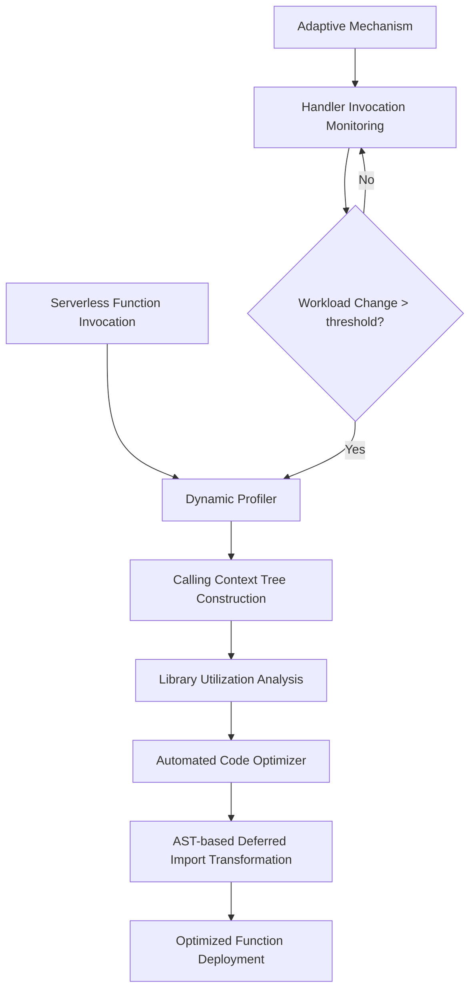
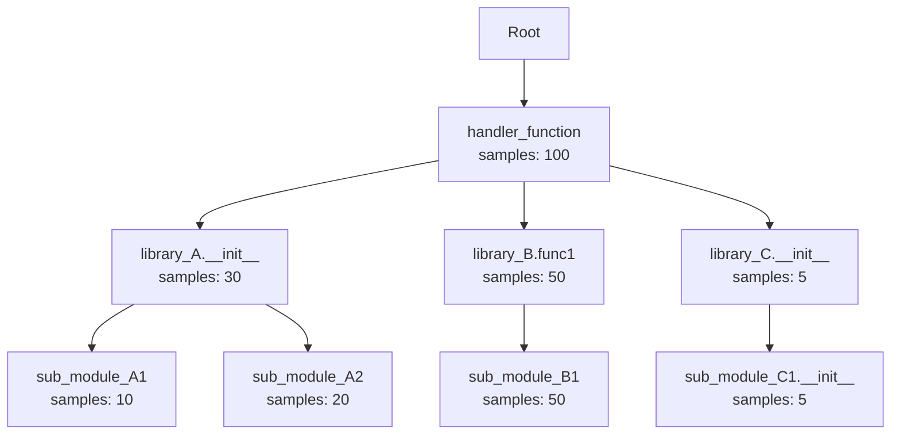

## 論文概要

本記事は、ICDCS 2025（45th IEEE International Conference on Distributed Computing Systems）に採択された論文 "Efficient Serverless Cold Start: Reducing Library Loading Overhead by Profile-guided Optimization" の解説記事です。本記事の著者は論文の実験を独自に実施したわけではなく、論文の内容を引用・解説しています。

サーバーレス関数のコールドスタートにおいて、ライブラリの初期化処理がend-to-endレイテンシの70%以上を占めることが知られている。著者らはSlimStartというプロファイルガイド最適化ツールを提案し、ランタイムのライブラリ利用状況をサンプリングベースでプロファイリングした上で、使用されていないライブラリのグローバルimportをdeferred import（遅延読み込み）に自動変換する手法を示している。著者らの報告によれば、初期化レイテンシで最大2.30倍の高速化、end-to-endレイテンシで2.26倍の改善、メモリ使用量で1.51倍の削減を達成している（論文Table II）。

この記事は [Zenn記事: Gemini 2.5 Flash×Cloud Runでマルチモーダル推論APIを構築しコールドスタートを削減する](https://zenn.dev/0h_n0/articles/3797901f9b04a9) の深掘りです。Zenn記事ではCloud Runにおけるコールドスタート対策をアプリケーション設計の観点から扱っていますが、本記事ではより根本的なレイヤー、すなわちライブラリ初期化そのものの最適化に焦点を当てます。

## 情報源

- **会議名**: ICDCS 2025（45th IEEE International Conference on Distributed Computing Systems）
- **年**: 2025
- **URL**: [https://arxiv.org/abs/2504.19283](https://arxiv.org/abs/2504.19283)
- **IEEE Xplore**: [https://ieeexplore.ieee.org/document/11183822/](https://ieeexplore.ieee.org/document/11183822/)
- **著者**: Syed Salauddin Mohammad Tariq, Ali Al Zein, Soumya Sripad Vaidya, Arati Khanolkar, Zheng Song, Probir Roy（University of Michigan Dearborn）
- **発表日**: 2025年7月20-23日（Glasgow, Scotland）

## カンファレンス情報

**ICDCSについて**: IEEE ICDCSは分散コンピューティングシステムに関するトップカンファレンスの1つであり、2025年で45回目の開催となる。ICDCS 2025はスコットランド・グラスゴーのRadisson Blu Hotelで開催され、40か国以上から350名以上の参加者が集まり、240以上の論文が32のテクニカルセッションで発表された。分散システム、クラウドコンピューティング、分散AIなど幅広いトピックをカバーしている。

## 技術的詳細

### 問題の定式化: なぜライブラリ初期化が問題なのか

サーバーレス関数では、コールドスタート時にコンテナの起動、ランタイムの初期化、アプリケーションコードのロードが発生する。著者らは、この中でもライブラリの初期化（`import`文の実行）がボトルネックとなっていることを定量的に示している。

既存の静的解析手法（FaaSLightなど）は、到達不能なコードパスに含まれるimportを除去するアプローチを取る。しかし、静的解析ではワークロード依存の非効率性を捉えることができない。例えば、あるライブラリが`import`されていてもコード上は到達可能だが、実際のワークロードでは極めて低い頻度でしか使用されない場合、静的解析では最適化対象として検出できない。

SlimStartは、この課題に対してランタイムプロファイリングに基づくアプローチで取り組む。

### SlimStartの3コンポーネントアーキテクチャ



#### コンポーネント1: Dynamic Profiler

Dynamic Profilerは、サンプリングベースのcall-pathプロファイリングを実行する。具体的には、設定可能な周期でタイマーを設定し、シグナルハンドラを登録する。各サンプリングポイントでコールスタックを取得し、Calling Context Tree（CCT）を構築する。

CCTは関数呼び出しのcaller-callee関係を木構造で保持するデータ構造である。各ノードは関数を表し、エッジは呼び出し関係を表す。ノードにはサンプルカウントが蓄積される。



プロファイリングデータは、ネットワーク転送のオーバーヘッドを最小化するため、ローカルに蓄積した後にバッチで非同期的にAWS DynamoDBまたはS3などの外部ストレージに転送される。

#### コンポーネント2: Automated Code Optimizer

コード最適化は、PythonのAST（Abstract Syntax Tree）を利用した静的コード変換で実現される。プロファイリング結果から非効率と判定されたライブラリについて、以下の変換を自動的に適用する。

**変換前（グローバルimport）**:

```python
import numpy as np      # コールドスタート時に初期化される
import pandas as pd     # コールドスタート時に初期化される
import scipy            # コールドスタート時に初期化される

def handler(event, context):
    # この関数ではnumpyのみ使用
    data = np.array(event["data"])
    return {"result": data.mean()}
```

**変換後（deferred import）**:

```python
# import numpy as np    # SlimStart: deferred
# import pandas as pd   # SlimStart: deferred (utilization: 0.0%)
# import scipy          # SlimStart: deferred (utilization: 0.2%)

def handler(event, context):
    import numpy as np   # 初回呼び出し時にのみ初期化
    data = np.array(event["data"])
    return {"result": data.mean()}
```

この変換により、pandasとscipyはhandler関数から呼ばれない限り初期化されず、コールドスタート時のレイテンシが削減される。

#### コンポーネント3: Adaptive Mechanism

ワークロードは時間とともに変化するため、一度のプロファイリングで最適化を固定するのは不適切である。Adaptive Mechanismは、ハンドラ関数の呼び出しパターンをモニタリングし、ワークロードの変動が閾値を超えた場合に再プロファイリングをトリガーする。

### ライブラリ利用率の定式化

著者らは、ライブラリ利用率を以下のように定義している。

$$
U(L) = \frac{\sum_{f \in L} S(f)}{\sum_{f \in F} S(f)}
$$

ここで、

- $U(L)$: ライブラリ$L$の利用率
- $S(f)$: 関数$f$のサンプルカウント（プロファイリング期間中に観測された回数）
- $f \in L$: ライブラリ$L$に属する関数の集合
- $f \in F$: アプリケーション全体の関数の集合

この指標は、あるライブラリがアプリケーション全体の実行時間のうちどの程度の割合を占めているかを推定する。初期化時のサンプル（`__init__`由来）とランタイム使用時のサンプルを区別することで、「importされるが実際にはほとんど使われていない」ライブラリを検出する。

### サンプル伝播（Sample Escalation）によるカスケード依存関係の処理

ライブラリ間には依存関係がある。例えば、`pandas`が内部で`numpy`を使用している場合、`numpy`のサンプルの一部は間接的に`pandas`に帰属すべきである。著者らはCCTの階層構造を利用したサンプル伝播（Sample Escalation）でこの問題に対処している。

CCTの各ノードのサンプルカウントを親ノードに向かって伝播させることで、間接的なライブラリ使用を正確に帰属させる。この仕組みにより、直接呼び出しだけでなく、依存関係を通じた間接的な使用パターンも考慮した最適化判断が可能となる。

### Adaptive Mechanismの閾値

再プロファイリングのトリガー条件は以下の不等式で定義される。

$$
\sum_{i=1}^{n} |\Delta p_i(t)| > \epsilon
$$

ここで、

- $n$: ハンドラ関数の数
- $\Delta p_i(t)$: 時刻$t$におけるハンドラ関数$i$の呼び出し確率の変化量
- $\epsilon$: 閾値（論文では$\epsilon = 0.002$を使用）

著者らは12時間のモニタリング間隔（$\Delta t$）を設定しており、この間隔内でハンドラ関数の呼び出し分布が閾値以上変化した場合に再プロファイリングを実行する。

## 実装のポイント

### Deferred Importパターンの設計上の注意

deferred import変換において、著者らは以下の点に留意している。

1. **モジュールレベルの副作用**: 一部のライブラリは`import`時にグローバルな状態を変更する（例: ロガーの設定、環境変数の読み込み）。このようなライブラリの遅延読み込みは副作用の発生タイミングを変えるため、注意が必要である。

2. **サブモジュールの選択的遅延**: 論文Table IVでは、nltkのようなライブラリについて、`sem`, `stem`, `parse`, `tag`といったサブモジュール単位での遅延読み込みを適用した例が示されている。ライブラリ全体ではなくサブモジュール単位で判断することで、より細粒度の最適化が可能となる。

3. **関数スコープでのimport**: Pythonでは関数内で`import`文を記述すると、その関数が初めて呼ばれた時点でモジュールがロードされる。2回目以降の呼び出しでは`sys.modules`のキャッシュが使われるため、繰り返しのオーバーヘッドは無視できる程度に小さい。

### プロファイリングのオーバーヘッド

著者らの報告によれば、プロファイリングのオーバーヘッドはほとんどのサーバーレスアプリケーションで最大10%程度にとどまる（論文Figure 9）。サンプリングベースの手法を採用し、データ転送をバッチ化・非同期化することで、プロダクション環境でも実用的なレベルのオーバーヘッドに抑えている。

## Production Deployment Guide

SlimStartの手法はPythonのサーバーレス関数を対象としており、AWS LambdaやGoogle Cloud Runなどのプラットフォームに直接適用可能である。ここでは、SlimStartのプロファイルガイド最適化の考え方をAWS Lambda環境に適用するパターンを示す。

### AWS実装パターン（コスト最適化重視）

SlimStartのdeferred importアプローチは、AWS Lambda上のPython関数に対して直接適用できる。トラフィック量に応じた推奨構成を以下に示す。

| 構成 | トラフィック | アーキテクチャ | 月額コスト概算 |
|------|-------------|---------------|---------------|
| Small | ~100 req/日 | Lambda + S3 + DynamoDB | $10-50 |
| Medium | ~1,000 req/日 | Lambda + S3 + DynamoDB + Step Functions | $50-200 |
| Large | 10,000+ req/日 | ECS Fargate + ECR + ALB | $300-1,500 |

**注意**: 上記コスト試算は2026年5月時点のAWS ap-northeast-1（東京）リージョンの料金に基づく概算値です。実際のコストはトラフィックパターン、リージョン、バースト使用量により変動します。最新料金は[AWS料金計算ツール](https://calculator.aws/)で確認してください。

**Small構成の詳細**:
- Lambda: Python 3.12ランタイム、メモリ512MB、タイムアウト30秒
- DynamoDB: On-Demandモード（プロファイリングデータ保存用）
- S3: プロファイリングレポート・最適化済みコード保存
- CloudWatch: ログ監視、コールドスタートレイテンシアラーム

**コスト削減テクニック**:
- Lambda Provisioned Concurrency: コールドスタート回避（ただしSlimStart適用後はコールドスタート自体が高速化されるため費用対効果を検討）
- Lambda SnapStart（Java対象）: 初期化スナップショットによる高速化（Pythonでは2026年5月時点で未対応）
- ARM64アーキテクチャ（Graviton2）: x86比で20%のコスト削減、Lambda関数でも利用可能
- DynamoDB On-Demand: 低トラフィック時のコスト最適化（Provisioned Capacityより安価）

**Large構成でのSpot活用**:
- ECS FargateではSpot容量プロバイダを設定可能であり、最大70%のコスト削減が見込める
- ただし、Spotの中断に備えてグレースフルシャットダウンを実装する必要がある

### Terraformインフラコード

#### Small構成（Lambda + DynamoDB）

```hcl
# SlimStart PGO Pipeline - Small構成（主要リソースのみ抜粋）
resource "aws_lambda_function" "optimized_function" {
  function_name = "slimstart-optimized-handler"
  role          = aws_iam_role.lambda_role.arn
  handler       = "handler.lambda_handler"
  runtime       = "python3.12"
  architectures = ["arm64"] # Graviton2: x86比20%コスト削減
  memory_size   = 512
  timeout       = 30
  filename      = "lambda_package.zip"

  environment {
    variables = {
      PROFILING_TABLE = aws_dynamodb_table.profiling_data.name
      REPORT_BUCKET   = aws_s3_bucket.profiling_reports.id
    }
  }
  tracing_config { mode = "Active" } # X-Ray有効化
}

resource "aws_dynamodb_table" "profiling_data" {
  name         = "slimstart-profiling-data"
  billing_mode = "PAY_PER_REQUEST" # On-Demand: 低トラフィック時にコスト最適
  hash_key     = "function_name"
  range_key    = "timestamp"

  attribute { name = "function_name"; type = "S" }
  attribute { name = "timestamp";     type = "N" }

  server_side_encryption { enabled = true } # KMS暗号化
  ttl { attribute_name = "ttl"; enabled = true } # 古いデータ自動削除
}

resource "aws_cloudwatch_metric_alarm" "cold_start_duration" {
  alarm_name          = "slimstart-cold-start-high-latency"
  comparison_operator = "GreaterThanThreshold"
  evaluation_periods  = 3
  metric_name         = "Duration"
  namespace           = "AWS/Lambda"
  period              = 300
  statistic           = "p99"
  threshold           = 5000 # 5秒超過で通知
  dimensions = { FunctionName = aws_lambda_function.optimized_function.function_name }
}
```

#### Large構成（ECS Fargate + Spot）

```hcl
# SlimStart PGO Pipeline - Large構成（主要リソースのみ抜粋）
resource "aws_ecs_cluster_capacity_providers" "main" {
  cluster_name       = aws_ecs_cluster.main.name
  capacity_providers = ["FARGATE", "FARGATE_SPOT"]

  default_capacity_provider_strategy {
    capacity_provider = "FARGATE_SPOT"
    weight = 80; base = 0  # Spot優先: 最大70%コスト削減
  }
  default_capacity_provider_strategy {
    capacity_provider = "FARGATE"
    weight = 20; base = 1  # 最低1タスクはOn-Demand
  }
}

resource "aws_appautoscaling_policy" "cpu" {
  name        = "slimstart-cpu-scaling"
  policy_type = "TargetTrackingScaling"
  # ... (scalable_dimension, service_namespace等は省略)

  target_tracking_scaling_policy_configuration {
    predefined_metric_specification {
      predefined_metric_type = "ECSServiceAverageCPUUtilization"
    }
    target_value       = 60.0
    scale_in_cooldown  = 300
    scale_out_cooldown = 60
  }
}

resource "aws_budgets_budget" "monthly" {
  name         = "slimstart-monthly-budget"
  budget_type  = "COST"
  limit_amount = "1500"
  limit_unit   = "USD"
  time_unit    = "MONTHLY"

  notification {
    comparison_operator        = "GREATER_THAN"
    threshold                  = 80
    threshold_type             = "PERCENTAGE"
    notification_type          = "ACTUAL"
    subscriber_email_addresses = ["ops-team@example.com"]
  }
}
```

### 運用・監視設定

**CloudWatch Logs Insights: コールドスタートレイテンシ分析**

```
# Lambda関数のコールドスタートを検出し、INIT Duration分布を分析
filter @type = "REPORT"
| fields @requestId, @initDuration, @duration, @memorySize, @maxMemoryUsed
| filter ispresent(@initDuration)
| stats count() as coldStarts,
        avg(@initDuration) as avgInitMs,
        pct(@initDuration, 95) as p95InitMs,
        pct(@initDuration, 99) as p99InitMs,
        avg(@duration) as avgDurationMs
  by bin(1h)
| sort @timestamp desc
```

**CloudWatch アラーム設定（Python）**:

```python
"""SlimStart最適化効果のモニタリング: コールドスタートレイテンシ監視"""
import boto3

cloudwatch = boto3.client("cloudwatch", region_name="ap-northeast-1")

def create_cold_start_alarm(function_name: str, threshold_ms: float = 3000.0) -> dict:
    """コールドスタートレイテンシが閾値を超えた場合のアラームを設定する。

    Args:
        function_name: Lambda関数名
        threshold_ms: アラーム閾値（ミリ秒）

    Returns:
        CloudWatch API レスポンス
    """
    return cloudwatch.put_metric_alarm(
        AlarmName=f"slimstart-{function_name}-init-latency",
        MetricName="InitDuration",
        Namespace="AWS/Lambda",
        Statistic="p99",
        Period=300,
        EvaluationPeriods=3,
        Threshold=threshold_ms,
        ComparisonOperator="GreaterThanThreshold",
        Dimensions=[{"Name": "FunctionName", "Value": function_name}],
        AlarmActions=["arn:aws:sns:ap-northeast-1:ACCOUNT_ID:ops-alerts"],
    )
```

**X-Ray トレーシング設定**:

```python
"""Lambda関数内でのX-Rayトレーシング: import時間の可視化"""
from aws_xray_sdk.core import xray_recorder, patch_all

patch_all()  # boto3等の自動計装

@xray_recorder.capture("handler")
def lambda_handler(event: dict, context) -> dict:
    """SlimStart最適化済みハンドラ。

    Args:
        event: Lambda イベント
        context: Lambda コンテキスト
    """
    subsegment = xray_recorder.begin_subsegment("deferred_imports")
    import numpy as np  # deferred import
    xray_recorder.end_subsegment()

    subsegment = xray_recorder.begin_subsegment("processing")
    result = np.array(event["data"]).mean()
    xray_recorder.end_subsegment()

    return {"statusCode": 200, "body": str(result)}
```

**Cost Explorer 日次レポート**:

```python
"""日次コストレポート: Lambda・ECSコストの異常検知"""
import boto3
from datetime import date, timedelta

ce = boto3.client("ce", region_name="us-east-1")
sns = boto3.client("sns", region_name="ap-northeast-1")

def check_daily_cost(threshold_usd: float = 100.0) -> None:
    """前日のLambda・ECSコストを取得し、閾値超過時にSNS通知する。

    Args:
        threshold_usd: 通知閾値（USD/日）
    """
    yesterday = (date.today() - timedelta(days=1)).isoformat()
    today = date.today().isoformat()

    response = ce.get_cost_and_usage(
        TimePeriod={"Start": yesterday, "End": today},
        Granularity="DAILY",
        Metrics=["BlendedCost"],
        Filter={
            "Or": [
                {"Dimensions": {"Key": "SERVICE", "Values": ["AWS Lambda"]}},
                {"Dimensions": {"Key": "SERVICE", "Values": ["Amazon Elastic Container Service"]}},
            ]
        },
    )

    total = float(response["ResultsByTime"][0]["Total"]["BlendedCost"]["Amount"])
    if total > threshold_usd:
        sns.publish(
            TopicArn="arn:aws:sns:ap-northeast-1:ACCOUNT_ID:cost-alerts",
            Subject=f"SlimStart Cost Alert: ${total:.2f}/day",
            Message=f"Daily compute cost ${total:.2f} exceeded ${threshold_usd} threshold.",
        )
```

### コスト最適化チェックリスト

**アーキテクチャ選択**:
- [ ] トラフィック量に応じた構成を選択（~100 req/日: Lambda、~1000: Lambda+Step Functions、10000+: ECS Fargate）
- [ ] SlimStart適用後のコールドスタート改善により、Provisioned Concurrencyの必要性を再評価

**リソース最適化**:
- [ ] Lambda: ARM64（Graviton2）アーキテクチャで20%コスト削減
- [ ] Lambda: メモリサイズをPower Tuningで最適化（CPU性能はメモリに比例）
- [ ] ECS: Fargate Spotを80%配分に設定（最大70%削減）
- [ ] ECS: タスク数のAuto Scalingを設定（CPU使用率60%ターゲット）
- [ ] DynamoDB: On-Demandモードで低トラフィック時のコスト最適化
- [ ] S3: ライフサイクルポリシーで古いプロファイリングデータを自動削除

**SlimStart固有の最適化**:
- [ ] deferred import適用後の初期化レイテンシをX-Rayで継続監視
- [ ] Adaptive Mechanismの閾値($\epsilon$)をワークロードパターンに合わせて調整
- [ ] プロファイリングデータのDynamoDB TTLを設定（例: 30日）
- [ ] CI/CDパイプラインにSlimStart最適化ステップを組み込み

**監視・アラート**:
- [ ] AWS Budgets: 月次予算アラート設定（80%/100%で通知）
- [ ] CloudWatch: コールドスタートレイテンシP99アラーム
- [ ] CloudWatch: Lambda InitDuration異常検知
- [ ] Cost Anomaly Detection: 自動異常検知有効化
- [ ] 日次コストレポート: SNS通知で閾値超過を検知

**リソース管理**:
- [ ] 未使用Lambda関数の定期的な棚卸し・削除
- [ ] ECRイメージのライフサイクルポリシー（古いイメージの自動削除）
- [ ] タグ戦略: `Project=slimstart`, `Environment=prod/dev`で一貫したタグ付け
- [ ] 開発環境: 夜間・週末のECSタスク数を0にスケールダウン
- [ ] CloudWatch Logs: 保持期間を設定（例: 90日）

## 実験結果

著者らは3つのベンチマークスイートと4つの実運用アプリケーション、計22のサーバーレスアプリケーションで評価を実施している（論文Table II）。以下に主要な結果を示す。

### ベンチマーク別の性能改善（論文Table IIより抜粋）

| アプリケーション | ベンチマーク | 対象ライブラリ | Init高速化 | E2E高速化 |
|---|---|---|---|---|
| Dna-visualisation | RainbowCake | NumPy | 2.30x | 2.26x |
| Graph-bfs | RainbowCake | igraph | 1.71x | 1.66x |
| Graph-mst | RainbowCake | igraph | 1.74x | 1.70x |
| Sentiment-analysis | RainbowCake | nltk/TextBlob | 1.35x | 1.33x |
| Predict-wine-ml | FaaSLight | pandas | 1.76x | 1.68x |
| Sentiment-analysis | FaaSLight | pandas/SciPy | 2.01x | 2.01x |
| Chameleon | FaaSWorkbench | pkg_resources | 1.17x | 1.05x |
| OCRmyPDF | 実運用 | pdfminer | 1.42x | 1.19x |
| CVE-bin-tool | 実運用 | xmlschema | 1.27x | 1.20x |
| Sensor-telemetry | 実運用 | Prophet | 1.99x | 1.09x |

最も大きな改善はRainbowCakeベンチマークのDna-visualisationアプリケーション（NumPy対象）で確認されており、初期化レイテンシで2.30倍、end-to-endレイテンシで2.26倍の高速化が報告されている。

### FaaSLightとの比較（論文Table IIIより）

著者らは静的解析ベースの既存手法であるFaaSLightとの比較も行っている。

| アプリケーション | FaaSLight E2E | SlimStart E2E | 改善率 |
|---|---|---|---|
| App4 (scikit assign) | 1.13x | 1.30x | +15.0% |
| App9 (train wine ml) | 1.21x | 1.68x | +38.8% |
| App9 (predict wine ml) | 1.17x | 1.50x | +28.2% |
| App11 (sentiment analysis) | 1.41x | 2.01x | +42.6% |

著者らは、SlimStartがFaaSLightと比較して平均14.29%のend-to-endレイテンシ削減、27.72%のメモリ削減を達成したと報告している（論文Section V-D）。ただし、App7（skimage lambda）ではFaaSLightの方が21.4%良い結果となっており、静的解析が有効なケースも存在する。

### メモリ使用量の削減

メモリ使用量については最大1.51倍の削減が確認されている（論文Figure 8）。使用されていないライブラリの初期化を回避することで、不要なオブジェクトのメモリ確保が発生しなくなるためである。

## 実運用への応用

### Cloud Runとの関連

関連Zenn記事で扱っているGoogle Cloud Runは、コンテナベースのサーバーレスプラットフォームである。SlimStartの手法はCloud Runにも適用可能であり、特に以下の点で相性が良い。

- **Pythonアプリケーション**: Cloud Run上のFastAPIやFlaskアプリケーションでも、`import`の最適化は直接的にコールドスタートの改善に寄与する。著者らの調査によれば、サーバーレスアプリケーションの58%がPythonで記述されている。
- **最小インスタンス数との組み合わせ**: Cloud Runでは`min-instances`を設定することでコールドスタートを回避できるが、これはコスト増を伴う。SlimStartによるコールドスタートの高速化と組み合わせることで、`min-instances`の設定値を低く抑えつつ許容可能なレイテンシを維持できる可能性がある。
- **CI/CD統合**: Cloud BuildやGitHub ActionsのパイプラインにSlimStartのプロファイリング・最適化ステップを組み込むことで、デプロイのたびに自動的に最適化が適用される。

### AWS Lambdaでの適用

AWS Lambdaでは、Pythonランタイムの関数に対してSlimStartの手法を直接適用できる。特にデータサイエンス系のライブラリ（NumPy、pandas、SciPy等）を使用する関数では、初期化レイテンシの大幅な削減が期待できる。Lambda Layersを使用している場合でも、ハンドラコード内のimport文をdeferred importに変換することで同様の効果が得られる。

## まとめ

SlimStartは、サーバーレスコールドスタートの主要なボトルネックであるライブラリ初期化を、プロファイルガイド最適化によって削減する手法である。静的解析では捉えられないワークロード依存の非効率性を、サンプリングベースのランタイムプロファイリングとCCTによるライブラリ帰属分析で検出し、ASTベースのコード変換で自動的にdeferred importに変換する。

著者らの報告では、22のアプリケーションに対して初期化レイテンシで最大2.30倍、end-to-endレイテンシで2.26倍の改善を達成しており、既存の静的解析手法と比較しても平均14.29%の追加的な改善が確認されている。Adaptive Mechanismによりワークロード変動にも追従可能であり、CI/CDパイプラインへの統合も想定されている。

Cloud RunやAWS Lambdaなどのプラットフォームを利用するPythonアプリケーション開発者にとって、コールドスタート対策の選択肢として検討に値する手法である。

## 参考文献

- **Conference URL**: [https://arxiv.org/abs/2504.19283](https://arxiv.org/abs/2504.19283)
- **IEEE Xplore**: [https://ieeexplore.ieee.org/document/11183822/](https://ieeexplore.ieee.org/document/11183822/)
- **ICDCS 2025 公式サイト**: [https://icdcs2025.icdcs.org/](https://icdcs2025.icdcs.org/)
- **Related Zenn article**: [https://zenn.dev/0h_n0/articles/3797901f9b04a9](https://zenn.dev/0h_n0/articles/3797901f9b04a9)
