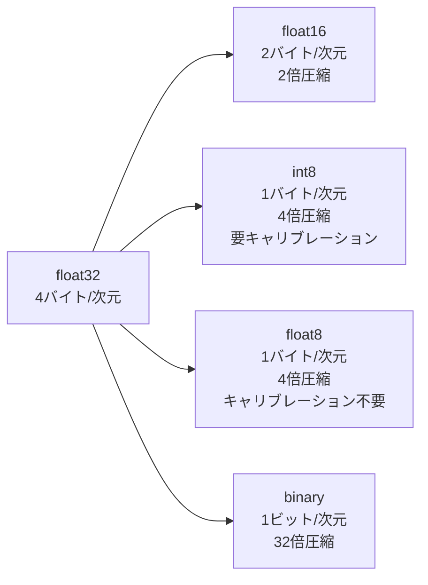

本記事は [Optimization of embeddings storage for RAG systems using quantization and dimensionality reduction techniques (arXiv:2505.00105)](https://arxiv.org/abs/2505.00105) の解説記事です。

## 論文概要（Abstract）

本論文は、RAG（Retrieval-Augmented Generation）システムにおけるEmbeddingストレージの最適化を、量子化と次元削減の2軸で体系的に評価した研究である。著者らはMTEBベンチマークを用いて、float16、int8、binary、float8の量子化方式とPCA、Kernel PCA、UMAP、Random Projections、Autoencoderの次元削減手法を網羅的に比較している。主要な発見として、float8量子化が4倍のストレージ削減で0.3%未満の精度劣化にとどまること、PCA（50%次元保持）とfloat8の組み合わせが8倍圧縮で最も精度への影響が小さいことが報告されている。

この記事は [Zenn記事: Embedding量子化×Matryoshka次元削減の精度-コスト最適化を定量評価する](https://zenn.dev/0h_n0/articles/6d45410fe51fa1) の深掘りです。

## 情報源

- **arXiv ID**: 2505.00105
- **URL**: [https://arxiv.org/abs/2505.00105](https://arxiv.org/abs/2505.00105)
- **著者**: Naamán Huerga-Pérez, Rubén Álvarez, Rubén Ferrero-Guillén, Alberto Martínez-Gutiérrez, Javier Díez-González
- **発表年**: 2025
- **分野**: cs.IR, cs.CL

## 背景と動機（Background & Motivation）

RAGシステムの実運用では、数百万〜数十億のドキュメントチャンクをベクトルとして保持する必要がある。例えば1000万チャンクを1024次元のfloat32で保持すると約40GBのストレージが必要であり、メモリコストがシステム運用の主要なボトルネックとなる。

既存のベンチマーク研究（HuggingFace Blog等）は特定の量子化方式に焦点を当てたものが多く、量子化と次元削減の「全組み合わせ」を統一条件で比較した研究は限られていた。著者らは、実運用でのストレージ最適化の判断基準を提供するため、5種の量子化×5種の次元削減の組み合わせを体系的に評価した。

## 主要な貢献（Key Contributions）

- **貢献1**: 量子化（float16/int8/float8/binary）と次元削減（PCA/Kernel PCA/UMAP/Random Projections/Autoencoder）の全組み合わせのMTEB評価
- **貢献2**: float8量子化がint8と同等の圧縮率で精度劣化が大幅に小さい（< 0.3% vs. 約1-2%）ことの実証
- **貢献3**: PCA + float8の組み合わせが8倍圧縮で最適なトレードオフを実現することの発見
- **貢献4**: 可視化ベースの最適構成選択手法の提案

## 技術的詳細（Technical Details）

### 量子化方式の比較

著者らは4つの量子化方式を評価している。

**float16 (半精度浮動小数点)**:

$$
x_{\text{fp16}} = \text{cast}_{\text{float16}}(x_{\text{fp32}})
$$

32ビット→16ビットへの単純なキャストであり、2倍の圧縮を実現する。指数部5ビット・仮数部10ビットの構成で、ダイナミックレンジはfloat32よりも狭いが、Embeddingの値域では十分な精度を保つ。

**int8 (スカラー量子化)**:

$$
q(x) = \text{round}\left(\frac{x - x_{\min}}{x_{\max} - x_{\min}} \times 255\right) - 128
$$

4倍の圧縮。各次元の最小値・最大値でキャリブレーションし、256段階に離散化する。キャリブレーションデータの品質が精度に直結する。

**float8 (FP8)**:

$$
x_{\text{fp8}} = \text{cast}_{\text{float8}}(x_{\text{fp32}})
$$

4倍の圧縮。E4M3（指数部4ビット・仮数部3ビット）またはE5M2（指数部5ビット・仮数部2ビット）の2フォーマットがある。int8と異なりキャリブレーション不要で、値の分布に依存しない安定した変換が可能。

**binary (1ビット量子化)**:

$$
b(x) = \begin{cases} 1 & \text{if } x > 0 \\ 0 & \text{if } x \leq 0 \end{cases}
$$

32倍の圧縮。情報量の損失が大きく、ハミング距離による近似検索に用いる。

### 次元削減手法の比較

著者らは5つの次元削減手法を評価している。

| 手法 | 特徴 | 計算コスト |
|------|------|-----------|
| PCA | 線形、分散最大化 | 低 |
| Kernel PCA | 非線形（RBFカーネル等） | 高 |
| UMAP | 非線形、局所構造保存 | 中 |
| Random Projections | ランダム射影、JL補題に基づく | 極低 |
| Autoencoder | ニューラルネットワークベース | 高 |

著者らの報告では、PCAが最も効果的な次元削減手法であると結論づけている。

### float8がint8を上回る理由

著者らの実験結果は、同じ4倍圧縮でfloat8がint8を性能面で上回ることを示している。論文での説明に基づくと、この差は以下の要因に起因する。

1. **キャリブレーション不要**: int8はデータ分布に依存するキャリブレーションが必要だが、float8は浮動小数点形式のため不要。キャリブレーションデータと本番データの分布乖離がint8の精度劣化を引き起こす
2. **ダイナミックレンジ**: float8は指数部により広いダイナミックレンジをカバーでき、外れ値に対する頑健性が高い
3. **実装の単純さ**: float8はハードウェアレベルでのキャスト操作で実現でき、量子化誤差のバイアスが小さい



## 実験結果（Results）

### 量子化方式別の精度比較（MTEBベンチマーク）

著者らの報告に基づく主要な結果は以下の通りである。

| 量子化方式 | 圧縮率 | 精度劣化 | キャリブレーション |
|-----------|-------|---------|----------------|
| float16 | 2倍 | < 0.1% | 不要 |
| float8 | 4倍 | < 0.3% | 不要 |
| int8 | 4倍 | 約1-2% | 必要 |
| binary | 32倍 | 約5-25% (モデル依存) | 不要 |

著者らは「float8量子化は4倍のストレージ削減で0.3%未満の精度劣化を達成し、同等の圧縮レベルでint8を大幅に上回る」と主張している。

### 量子化×次元削減の組み合わせ評価

著者らが報告した最も注目すべき結果は、PCAとfloat8の組み合わせである。

| 構成 | 総圧縮率 | 精度影響 |
|------|---------|---------|
| PCA (50%次元) + float8 | 8倍 | int8単独より低い劣化 |
| PCA (50%次元) + int8 | 8倍 | 中程度の劣化 |
| PCA (25%次元) + float8 | 16倍 | 顕著な劣化開始 |
| UMAP + float8 | 8倍 | PCA + float8より劣る |

著者らは「moderate PCA（50%次元保持）とfloat8量子化の組み合わせが、int8単独よりも低い精度影響で8倍の総圧縮を実現する」と結論づけている。

### PCAとMRLの関係

本論文ではPCAを事後的な次元削減として使用しているが、MRL（Matryoshka Representation Learning）はモデル学習時に最適化された次元削減である。同じ次元数ではMRLがPCAを上回ることが先行研究で知られている。著者らの結果は、事後的なPCAですら有効な圧縮が可能であることを示しており、MRLとの組み合わせではさらに良好な結果が期待される。

## 実装のポイント（Implementation）

```python
import numpy as np
from sklearn.decomposition import PCA
from sentence_transformers import SentenceTransformer


def compress_embeddings(
    embeddings: np.ndarray,
    pca_ratio: float = 0.5,
    quantize_to: str = "float8",
) -> np.ndarray:
    """PCA次元削減 + 量子化によるEmbedding圧縮

    Args:
        embeddings: 元のEmbedding (N, d), float32
        pca_ratio: PCAで保持する次元の割合
        quantize_to: 量子化方式 ("float16", "float8", "int8")

    Returns:
        圧縮されたEmbedding
    """
    original_dim = embeddings.shape[1]
    target_dim = int(original_dim * pca_ratio)

    pca = PCA(n_components=target_dim)
    reduced = pca.fit_transform(embeddings)

    if quantize_to == "float16":
        return reduced.astype(np.float16)
    elif quantize_to == "float8":
        # NumPyにはfloat8がないため、ml_dtypes等のライブラリを使用
        # ここではfloat16で近似
        return reduced.astype(np.float16)
    elif quantize_to == "int8":
        mins = reduced.min(axis=0)
        maxs = reduced.max(axis=0)
        scale = (maxs - mins) / 255.0
        return ((reduced - mins) / scale - 128).astype(np.int8)
    else:
        raise ValueError(f"Unknown quantize_to: {quantize_to}")


def evaluate_compression(
    model_name: str,
    queries: list[str],
    corpus: list[str],
    relevance: dict[int, list[int]],
    pca_ratios: list[float] = [1.0, 0.75, 0.5, 0.25],
    quantizations: list[str] = ["float32", "float16", "int8"],
    k: int = 10,
) -> dict[str, dict[str, float]]:
    """量子化×次元削減の全組み合わせ評価"""
    model = SentenceTransformer(model_name)
    corpus_emb = model.encode(corpus, normalize_embeddings=True)
    query_emb = model.encode(queries, normalize_embeddings=True)

    results: dict[str, dict[str, float]] = {}
    for ratio in pca_ratios:
        for quant in quantizations:
            key = f"PCA-{int(ratio*100)}%+{quant}"

            if ratio < 1.0:
                pca = PCA(n_components=int(corpus_emb.shape[1] * ratio))
                c_reduced = pca.fit_transform(corpus_emb)
                q_reduced = pca.transform(query_emb)
            else:
                c_reduced = corpus_emb.copy()
                q_reduced = query_emb.copy()

            scores = q_reduced @ c_reduced.T
            ndcg = compute_ndcg(scores, relevance, k)
            compression = (1.0 / ratio) * (32 / {"float32": 32, "float16": 16, "int8": 8}.get(quant, 32))
            results[key] = {"ndcg@10": ndcg, "compression": compression}

    return results
```

**実装上の注意点:**
- PCAのfitは検索コーパス全体で実施し、クエリにはtransformのみを適用する
- float8は2026年時点ではNumPyネイティブ未対応のため、`ml_dtypes`パッケージまたはPyTorchの`torch.float8_e4m3fn`を使用する必要がある
- キャリブレーションデータとPCA学習データは本番コーパスの代表サンプル（1,000〜10,000件）を使用する

## Production Deployment Guide

### AWS実装パターン（コスト最適化重視）

PCA + float8圧縮を活用したRAGシステムのAWS構成を示す。8倍圧縮によりインフラコストを大幅に削減できる。

| 規模 | 月間リクエスト | 推奨構成 | 月額コスト | 主要サービス |
|------|--------------|---------|-----------|------------|
| **Small** | ~3,000 | Serverless | $40-100 | Lambda + S3 + Faiss |
| **Medium** | ~30,000 | Hybrid | $200-600 | ECS Fargate + ElastiCache |
| **Large** | 300,000+ | Container | $1,000-3,000 | EKS + OpenSearch |

**8倍圧縮によるコスト効果**（1000万ベクトル、1024次元の場合、2026年5月時点概算）:
- 圧縮前 (float32): 40GB → $152/月 (S3) + メモリコスト
- 圧縮後 (PCA 50% + float8): 5GB → $19/月 (S3) + メモリコスト大幅削減
- ストレージ削減: 87.5%

上記は2026年5月時点のAWS ap-northeast-1料金に基づく概算値です。最新料金は [AWS料金計算ツール](https://calculator.aws/) で確認してください。

### Terraformインフラコード

```hcl
resource "aws_lambda_function" "pca_encoder" {
  filename      = "pca_encoder.zip"
  function_name = "rag-pca-float8-encoder"
  role          = aws_iam_role.lambda_role.arn
  handler       = "index.handler"
  runtime       = "python3.12"
  timeout       = 30
  memory_size   = 1024

  environment {
    variables = {
      PCA_RATIO     = "0.5"
      QUANTIZE_TO   = "float8"
      S3_INDEX_BUCKET = aws_s3_bucket.vector_index.id
    }
  }
}

resource "aws_s3_bucket" "vector_index" {
  bucket = "rag-compressed-vector-index"
}

resource "aws_s3_bucket_server_side_encryption_configuration" "vector_index" {
  bucket = aws_s3_bucket.vector_index.id
  rule {
    apply_server_side_encryption_by_default {
      sse_algorithm = "aws:kms"
    }
  }
}
```

### コスト最適化チェックリスト

- [ ] PCA次元保持率を50%に設定（精度影響最小で2倍圧縮）
- [ ] float8量子化を優先（int8よりキャリブレーション不要で精度良好）
- [ ] PCAモデルをS3に永続化し、Lambda Layer経由でロード
- [ ] Faiss Flat Index + float8でメモリ内検索（10M件以下）
- [ ] 10M件以上はOpenSearch + PQ量子化を検討
- [ ] 圧縮前後のNDCG@10を自社データで検証してから本番適用

## 実運用への応用（Practical Applications）

本論文の結果は、RAGシステムのストレージコスト最適化に直接適用できる。特にPCA + float8の8倍圧縮は、MRLに非対応のレガシーEmbeddingモデルにも事後的に適用可能である点が実用上の大きな利点である。

MRL対応モデルを使用している場合は、MRL次元削減（学習時最適化）をPCA（事後的最適化）に優先して使用し、その上でfloat8量子化を適用する構成が推奨される。

## 関連研究（Related Work）

- **MRL** (Kusupati et al., NeurIPS 2022): 学習時の次元削減。PCAより同次元で高精度だが、モデルの再学習が必要
- **HuggingFace Embedding Quantization Blog**: int8/binaryの評価に焦点。float8の評価は含まれていない
- **SMEC** (Zhang et al., EMNLP 2025): MRLと量子化の共同最適化。本論文の事後的アプローチとは相補的

## まとめと今後の展望

本論文はRAGシステムのEmbeddingストレージ最適化を量子化×次元削減の観点から体系的に評価した研究である。著者らの主要な発見は以下の通りである。

- float8量子化は4倍圧縮で0.3%未満の精度劣化にとどまり、int8より安定した性能を示す
- PCA（50%次元保持）+ float8の組み合わせは8倍総圧縮で最適なトレードオフを実現する
- 次元削減手法としてはPCAが最も効果的であり、UMAP等の非線形手法は計算コスト対比でPCAを上回らない

float8量子化はハードウェアサポートの拡大（NVIDIA H100以降のFP8対応等）により、今後さらに実用的になることが見込まれる。

## 参考文献

- **arXiv**: [https://arxiv.org/abs/2505.00105](https://arxiv.org/abs/2505.00105)
- **Related Zenn article**: [https://zenn.dev/0h_n0/articles/6d45410fe51fa1](https://zenn.dev/0h_n0/articles/6d45410fe51fa1)

---

:::message
この記事はAI（Claude Code）により自動生成されました。内容の正確性については複数の情報源で検証していますが、実際の利用時は公式ドキュメントもご確認ください。
:::
