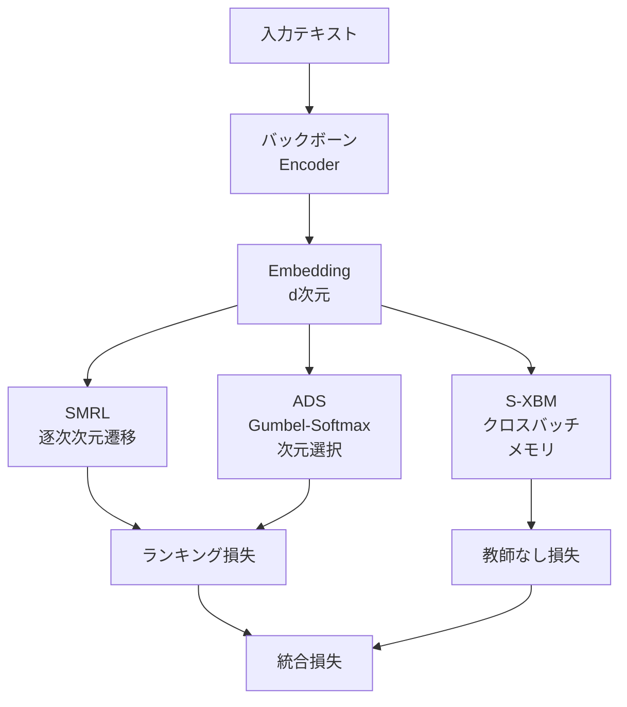

本記事は [SMEC: Rethinking Matryoshka Representation Learning for Retrieval Embedding Compression (arXiv:2510.12474)](https://arxiv.org/abs/2510.12474) の解説記事です。

## 論文概要（Abstract）

SMEC（Sequential Matryoshka Embedding Compression）は、Matryoshka Representation Learning（MRL）と量子化を統合的に学習するフレームワークである。著者らは、MRLの次元削減と量子化（int8/binary）を別々に適用するのではなく、共同最適化することで圧縮率と精度のPareto曲線を改善できると主張している。BEIRベンチマークにおいて、LLM2Vecベースのモデルで14倍のロスレス圧縮を達成し、既存手法（Matryoshka-Adaptor、Search-Adaptor）を1.1〜2.7ポイント上回ると報告されている。

この記事は [Zenn記事: Embedding量子化×Matryoshka次元削減の精度-コスト最適化を定量評価する](https://zenn.dev/0h_n0/articles/6d45410fe51fa1) の深掘りです。

## 情報源

- **会議名**: EMNLP 2025（Empirical Methods in Natural Language Processing）
- **arXiv ID**: 2510.12474
- **URL**: [https://arxiv.org/abs/2510.12474](https://arxiv.org/abs/2510.12474)
- **著者**: Biao Zhang, Lixin Chen, Tong Liu, Bo Zheng
- **発表年**: 2025

## カンファレンス情報

EMNLP（Empirical Methods in Natural Language Processing）は自然言語処理分野の主要国際会議であり、ACLと並ぶトップ会議の1つである。SMEC論文はEMNLP 2025に採択されており、Embeddingの圧縮手法として2025年時点の最新研究に位置づけられる。

## 背景と動機（Background & Motivation）

MRL（Kusupati et al., NeurIPS 2022）は次元削減の手法として広く普及したが、量子化との組み合わせには2つの問題がある。第一に、MRLで次元削減した後に量子化を適用すると、情報量が二重に削減されるため精度劣化が累積する。第二に、MRLの学習時に量子化後の精度を考慮していないため、量子化に対して脆弱な表現が学習される可能性がある。

著者らはこれらの問題に対し、MRLの学習プロセス自体に量子化を組み込む3つのコンポーネント（SMRL、ADS、S-XBM）を提案した。

## 主要な貢献（Key Contributions）

- **貢献1**: Sequential Matryoshka Representation Learning (SMRL) — MRLの勾配分散問題を解決し、安定した学習を実現
- **貢献2**: Adaptive Dimension Selection (ADS) — Gumbel-Softmax近似による微分可能な次元選択で、重要な次元を自動的に残す
- **貢献3**: Selectable Cross-batch Memory (S-XBM) — バッチ間で凍結特徴量を再利用し、教師なし学習の効率を向上
- **貢献4**: テキスト・画像・マルチモーダルの3領域でBEIR、MTEB等のベンチマークにおいて既存手法を上回る結果

## 技術的詳細（Technical Details）

### SMRLの勾配分散問題と解決策

通常のMRLでは、全ての次元$m \in \mathcal{M}$に対して同時に損失を計算する。著者らは、この並列最適化がパラメータ群間の勾配分散を引き起こすことを指摘している。具体的には、次元$d$に対する勾配の大きさが以下の関係を持つ。

$$
\frac{\partial \mathcal{L}^d}{\partial w_i} \propto \frac{1}{\delta(d)^2}
$$

ここで$\delta(d)$は次元$d$に対応する特徴量のスケールである。異なる次元の勾配が大きく異なるスケールを持つため、学習が不安定になる。

SMRLでは、全次元の同時最適化ではなく、隣接する次元間の逐次的な遷移を学習する。すなわち$D/2^{n-1} \to D/2^n$の遷移を順番に最適化することで、勾配のスケール差を緩和する。

### Adaptive Dimension Selection (ADS)

ADSは、MRLの単純な先頭次元切り捨て（truncation）を、学習可能な次元選択に置き換える。Gumbel-Softmax近似を用いて微分可能な離散選択を実現する。

$$
z = \text{softmax}_\tau(\hat{z} + G)
$$

ここで$\hat{z}$は学習可能な重要度パラメータ、$G$はGumbel分布からのサンプル、$\tau$は温度パラメータである。この機構により、先頭次元以外にも情報量の多い次元を自動的に選択できる。

著者らの報告によると、1536次元から圧縮する場合、ADSは重要度の高い上位次元の94.3%を正しく選択できるのに対し、MRLの単純な切り捨てでは50.3%にとどまる。

### S-XBM (Selectable Cross-batch Memory)

S-XBMはFIFOキュー構造のメモリバッファであり、過去のバッチから凍結された特徴量を保持する。現在のバッチのサンプルと最も類似度の高いサンプルをメモリから取得し、教師なし学習の対比ペアとして活用する。

学習可能なFC層（Fine-tuning層）の特徴量ではなく、凍結されたバックボーンの特徴量を格納することで、特徴量ドリフトの問題を回避している。

### 統合損失関数

全体の損失関数は教師あり損失と教師なし損失の重み付き和で構成される。

$$
\mathcal{L}_{\text{total}} = \mathcal{L}_{\text{rank}} + \alpha \cdot \mathcal{L}_{\text{un-sup}}
$$

ここで$\alpha = 1.0$（固定ハイパーパラメータ）である。

ランキング損失$\mathcal{L}_{\text{rank}}$は以下で定義される。

$$
\mathcal{L}_{\text{rank}} = \sum_i \sum_j \sum_k \sum_{m} \mathbb{I}(y_{ij} > y_{ik})(y_{ij} - y_{ik})\log(1 + \exp(s_{ik}[:m] - s_{ij}[:m]))
$$

ここで$s_{ij}[:m]$はクエリ$i$とドキュメント$j$の先頭$m$次元でのスコアであり、各次元で正解ドキュメントが負例より高いスコアを持つように学習する。



## 実験結果（Results）

### BEIR ベンチマーク (NDCG@10)

著者らはOpenAI text-embedding-3-large（3072次元）とLLM2Vec（3584次元）を基盤モデルとして使用し、以下の結果を報告している。

**OpenAI text-embedding-3-large での結果（論文より）:**

| 次元 | SMEC | Matryoshka-Adaptor | 差分 |
|------|------|-------------------|------|
| 128 | 約0.42 | 約0.40 | +0.02 |
| 256 | 約0.44 | 約0.42 | +0.019 |
| 512 | 約0.46 | 約0.45 | +0.01 |

**LLM2Vec での結果（論文より）:**

| 次元 | SMEC | Matryoshka-Adaptor | 差分 |
|------|------|-------------------|------|
| 128 | 約0.48 | 約0.47 | +0.01 |
| 256 | 約0.49 | 約0.48 | +0.011 |

著者らは特に極端な圧縮時（128次元）でSMECの優位性が顕著であると主張している。

### サブデータセット別の結果

BEIRの個別データセットでの結果（論文Appendix Bより）は以下の通りである。

| データセット | 128次元 | 256次元 | 512次元 | 1536次元 |
|-------------|--------|--------|--------|---------|
| SciFact | 0.841 | 0.874 | 0.879 | 0.885 |
| FiQA | 0.521 | 0.533 | 0.540 | 0.549 |
| Quora | 0.794 | 0.818 | 0.839 | 0.862 |
| NFCorpus | 0.389 | 0.402 | 0.418 | 0.430 |

Quoraデータセットでは14倍のロスレス圧縮（3584→256次元）を達成している。

### アブレーション実験

著者らは各コンポーネントの寄与を8つのBEIRデータセット（128次元）で検証している（論文Table 1より）。

| 手法 | NDCG@10 |
|------|---------|
| MRL Baseline | 0.4534 |
| + SMRL | 0.4621 (+0.87pt) |
| + ADS | 0.4583 (+0.49pt) |
| + S-XBM | 0.4583 (+0.49pt) |
| Full SMEC | 0.4848 (+3.14pt) |

3つのコンポーネントを組み合わせた場合の改善（+3.14pt）は個別効果の単純和（+1.85pt）を上回っており、コンポーネント間のシナジー効果が示唆される。

### 圧縮率とスループット

- LLM2Vec-7B: 14倍のロスレス圧縮（3584→256次元）
- LLM2Vec-1B: 12倍のロスレス圧縮（1536→128次元）
- 128次元binary量子化時: 基線（1024次元fp32）比で約300倍のコサイン類似度計算高速化（CPU測定）

## 実装のポイント（Implementation）

```python
import torch
import torch.nn.functional as F


def smrl_loss(
    embeddings: torch.Tensor,
    labels: torch.Tensor,
    nesting_dims: list[int],
) -> torch.Tensor:
    """Sequential MRL: 隣接次元間の遷移を逐次最適化"""
    total_loss = torch.tensor(0.0, device=embeddings.device)
    sorted_dims = sorted(nesting_dims, reverse=True)

    for i in range(len(sorted_dims) - 1):
        d_large = sorted_dims[i]
        d_small = sorted_dims[i + 1]
        emb_large = F.normalize(embeddings[:, :d_large], dim=-1)
        emb_small = F.normalize(embeddings[:, :d_small], dim=-1)
        sim_large = emb_large @ emb_large.T
        sim_small = emb_small @ emb_small.T
        total_loss += F.mse_loss(sim_small, sim_large.detach())

    return total_loss / max(len(sorted_dims) - 1, 1)


def gumbel_softmax_selection(
    importance: torch.Tensor,
    k: int,
    tau: float = 1.0,
) -> torch.Tensor:
    """ADS: Gumbel-Softmax近似による微分可能な次元選択"""
    gumbel_noise = -torch.log(-torch.log(torch.rand_like(importance) + 1e-8) + 1e-8)
    logits = (importance + gumbel_noise) / tau
    weights = F.softmax(logits, dim=-1)
    _, topk_indices = torch.topk(weights, k)
    return topk_indices
```

**実装上の注意点:**
- S-XBMのメモリサイズは5000が最適とされる。1000では対比ペアの多様性不足、15000では順伝播時間が0.06秒→0.21秒に増加
- ADSの温度パラメータ$\tau$は学習初期に高く設定し、徐々に下げるスケジュールが推奨される
- ベースモデルにはFaissのint8スカラー量子化との互換性がある。binaryの場合はFaiss BinaryFlatまたはBinaryIVFを使用

## Production Deployment Guide

### AWS実装パターン（コスト最適化重視）

SMECの圧縮率を活かしたベクトル検索のAWS構成を示す。SMEC圧縮済みEmbeddingは従来比14倍のストレージ削減が可能であり、インフラコストに直結する。

| 規模 | 月間リクエスト | 推奨構成 | 月額コスト | 主要サービス |
|------|--------------|---------|-----------|------------|
| **Small** | ~3,000 | Serverless | $40-120 | Lambda + OpenSearch Serverless |
| **Medium** | ~30,000 | Hybrid | $250-700 | ECS Fargate + ElastiCache Redis |
| **Large** | 300,000+ | Container | $1,500-4,000 | EKS + OpenSearch Managed |

**SMECによるコスト削減効果**（1億ベクトル規模の試算、2026年5月時点概算）:
- 従来 (1024d, fp32): 約400GB → OpenSearch 3ノード ($2,400/月)
- SMEC (256d, int8): 約25GB → OpenSearch 1ノード ($800/月)
- 削減率: 約67%

上記は2026年5月時点のAWS ap-northeast-1料金に基づく概算値です。最新料金は [AWS料金計算ツール](https://calculator.aws/) で確認してください。

### Terraformインフラコード

```hcl
resource "aws_iam_role" "smec_inference" {
  name = "smec-inference-role"
  assume_role_policy = jsonencode({
    Version = "2012-10-17"
    Statement = [{
      Action    = "sts:AssumeRole"
      Effect    = "Allow"
      Principal = { Service = "lambda.amazonaws.com" }
    }]
  })
}

resource "aws_lambda_function" "smec_encoder" {
  filename      = "smec_encoder.zip"
  function_name = "smec-embedding-encoder"
  role          = aws_iam_role.smec_inference.arn
  handler       = "index.handler"
  runtime       = "python3.12"
  timeout       = 60
  memory_size   = 2048

  environment {
    variables = {
      MODEL_NAME       = "smec-compressed-256d"
      TARGET_DIMENSION = "256"
      QUANTIZE_TO      = "int8"
    }
  }
}
```

### コスト最適化チェックリスト

- [ ] SMEC圧縮次元を256d以下に設定（14倍圧縮）
- [ ] int8量子化を併用（さらに4倍ストレージ削減）
- [ ] Faiss BinaryIVFでbinary量子化インデックスを構築（300倍高速化）
- [ ] S3にフル精度ベクトルを保存し、Rescoringに使用
- [ ] Lambda関数のメモリを2GBに設定（モデルロード対応）
- [ ] OpenSearch ノード数を圧縮率に応じて削減

## 関連研究（Related Work）

- **MRL** (Kusupati et al., NeurIPS 2022): SMECの基盤手法。次元削減のみで量子化は扱わない
- **Search-Adaptor** (Yoon et al., 2023): 検索タスクに特化したアダプタ学習。SMECはAdaptorなしで同等以上の性能
- **Matryoshka-Adaptor** (Yoon et al., 2024): MRLにアダプタを追加した手法。SMECは128次元でこれを2ポイント以上上回る

## まとめと今後の展望

SMECは、MRLと量子化の共同最適化により、個別適用よりも優れた圧縮率-精度のトレードオフを実現するフレームワークである。著者らが報告した主要な成果は以下の通りである。

- LLM2Vec-7Bで14倍のロスレス圧縮をBEIRベンチマークで達成
- 3つのコンポーネント（SMRL、ADS、S-XBM）のシナジーにより、ベースラインから3.14ポイントの改善
- テキスト・画像・マルチモーダルの3領域で有効性を実証

MRLと量子化を「直交する最適化」として別々に適用するのではなく、学習時に統合することの重要性を示した研究として、今後のEmbeddingモデル設計に影響を与えると考えられる。

## 参考文献

- **arXiv**: [https://arxiv.org/abs/2510.12474](https://arxiv.org/abs/2510.12474)
- **Related Zenn article**: [https://zenn.dev/0h_n0/articles/6d45410fe51fa1](https://zenn.dev/0h_n0/articles/6d45410fe51fa1)

---

:::message
この記事はAI（Claude Code）により自動生成されました。内容の正確性については複数の情報源で検証していますが、実際の利用時は公式ドキュメントもご確認ください。
:::
