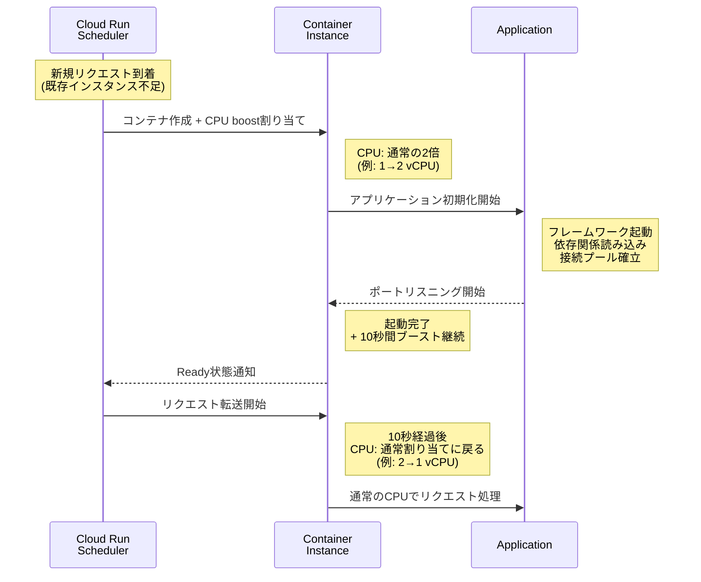
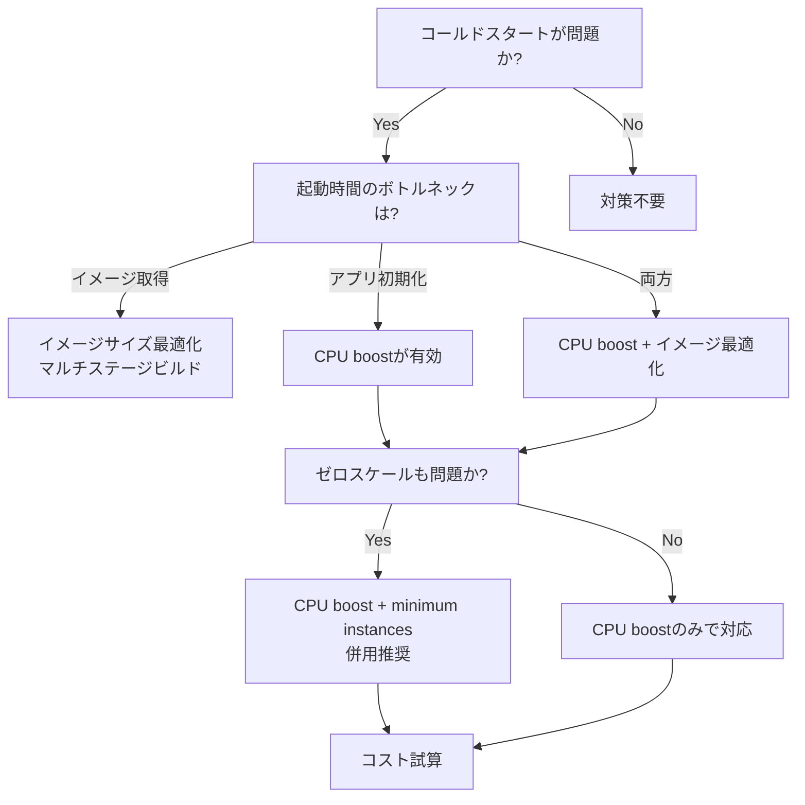

## 本記事について

本記事は、Google Cloudの公式ブログ記事 [New startup CPU boost improves cold starts in Cloud Run, Cloud Functions](https://cloud.google.com/blog/products/serverless/announcing-startup-cpu-boost-for-cloud-run--cloud-functions)（著者: Steren Giannini氏、Google Cloud Director of Product Management、2022年9月27日公開）の技術解説記事です。本記事の筆者が独自に実験を行ったものではなく、原典ブログおよびGoogle Cloudの公式ドキュメントに記載された情報に基づく解説です。

関連するZenn記事「[Gemini 2.5 Flash×Cloud Runでマルチモーダル推論APIを構築しコールドスタートを削減する](https://zenn.dev/0h_n0/articles/3797901f9b04a9)」では、Cloud Run上でGemini推論APIを構築する際のコールドスタート対策を実践的に扱っています。本記事では、その背景にあるstartup CPU boost機能の技術的な仕組みとベンチマーク結果を掘り下げます。

## 情報源

| 項目 | 内容 |
|------|------|
| タイトル | New startup CPU boost improves cold starts in Cloud Run, Cloud Functions |
| 著者 | Steren Giannini (Director of Product Management, Google Cloud) |
| 発表日 | 2022年9月27日 |
| URL | [cloud.google.com/blog/...](https://cloud.google.com/blog/products/serverless/announcing-startup-cpu-boost-for-cloud-run--cloud-functions) |
| 公式ドキュメント | [Configure CPU limits for services](https://cloud.google.com/run/docs/configuring/services/cpu) |

## 技術的背景: なぜstartup CPU boostが必要か

### コールドスタートの構造

サーバーレスプラットフォームにおけるコールドスタートとは、新しいコンテナインスタンスの起動から最初のリクエスト処理開始までに発生する遅延のことである。Cloud Runでは、以下の3つのシナリオでコールドスタートが発生する。Giannini氏のブログでは、これらを明確に区分している。

1. **ゼロインスタンスからのスケールアップ**: トラフィックがない状態から最初のリクエストが到着したとき
2. **単一同時リクエスト設定のサービス**: 各インスタンスが1つのリクエストしか処理しない設定の場合、新規リクエストごとに新インスタンスが必要となる
3. **トラフィックスケーリング**: 急激な負荷増加により、オートスケーラーが新しいインスタンスを追加する場合

コールドスタートの内部では、複数のフェーズが順次実行される。Cloud Runの公式ドキュメントおよび関連研究によれば、起動プロセスは大きく以下のように分解される。

- **コンテナイメージの取得**: レジストリからのpull（キャッシュがある場合は省略）
- **コンテナの起動**: ランタイム環境の初期化
- **アプリケーションの初期化**: フレームワークの起動、依存関係の読み込み、接続プールの確立
- **ヘルスチェックの通過**: 指定ポートでのリスニング開始（4分以内に完了する必要がある）

これらのフェーズのうち、特にアプリケーション初期化はCPUバウンドな処理を多く含む。クラスローディング（Java）、モジュールの読み込み（Node.js）、依存性注入コンテナの構築（Spring等）といった処理は、CPU資源が制約されている場合に大幅に遅延する。startup CPU boostは、この初期化フェーズに対してCPU割り当てを一時的に引き上げることで、コールドスタート時間を短縮する機能である。

### minimum instancesとの違い

Cloud Runには`--min-instances`オプションが存在し、常に一定数のインスタンスをウォーム状態に保つことでゼロからのスケールアップによるコールドスタートを排除できる。しかし、Giannini氏が指摘するとおり、minimum instancesはゼロからのスケールアップのみを対象としており、トラフィック増加に伴うスケールアウト時のコールドスタートには対応できない。startup CPU boostはスケールアウト時を含むすべてのコールドスタートに対して効果を発揮するという点で、complementary（補完的）な関係にある。

## 実装アーキテクチャ: CPU boostの内部動作

### 起動フェーズにおけるCPU割り当ての変化

startup CPU boostを有効にすると、Cloud Runはコンテナの起動フェーズ中および起動完了後10秒間にわたり、通常の設定を超えるCPU割り当てを行う。Google Cloudの公式ドキュメントによれば、ブースト時のCPU割り当ては以下のとおりである。

| 通常のCPU上限 | ブースト時のCPU割り当て | 倍率 |
|:---:|:---:|:---:|
| 1 vCPU以下 | 2 vCPU | 2倍以上 |
| 2 vCPU | 4 vCPU | 2倍 |
| 4 vCPU | 8 vCPU | 2倍 |
| 6 vCPU以上 | 8 vCPU | 最大8 vCPUで頭打ち |

注目すべき点は、6 vCPU以上の設定ではブーストの上限が8 vCPUに制限される点である。これは、ブースト用に確保できるCPUリソースにはプラットフォーム側の上限があることを示唆している。

### 起動ライフサイクルの全体像

以下のMermaid図は、startup CPU boostが有効な場合のCloud Runインスタンスのライフサイクルを示す。



### 各フェーズの詳細

起動プロセスを時間軸で分解すると、CPU boostが効果を発揮するフェーズが明確になる。

```mermaid
gantt
    title Cloud Run起動フェーズとCPU boost効果
    dateFormat X
    axisFormat %s秒

    section インフラ層
    コンテナイメージ取得    :infra1, 0, 3
    ネットワーク設定        :infra2, 3, 4

    section アプリケーション層(CPU boost効果大)
    ランタイム初期化        :app1, 4, 6
    フレームワーク起動      :app2, 6, 10
    依存関係読み込み        :app3, 10, 13

    section Ready状態
    ポートリスニング開始    :ready, 13, 14
    ブースト継続(+10秒)     :boost, 14, 24
    通常CPU割り当て         :normal, 24, 30
```



上図のうち「アプリケーション層」に属するフェーズはCPUバウンドな処理が中心であり、startup CPU boostによる高速化の恩恵が大きい。一方、コンテナイメージの取得はネットワークI/Oが支配的であるため、CPU boostの効果は限定的である。この構造的な違いが、言語・フレームワークごとのベンチマーク結果の差異を生む主要因と考えられる。

### サイドカーコンテナへの影響

Cloud Runはサイドカーコンテナのデプロイをサポートしており、startup CPU boostが有効な場合、サイドカーを含むすべてのコンテナが個別のCPU上限に基づいてブーストを受ける。これは、Envoyプロキシやログ収集エージェントなどをサイドカーとしてデプロイしている場合に、メインコンテナだけでなくサイドカーの初期化も高速化されることを意味する。

## Production Deployment Guide

### Cloud Runでの有効化

startup CPU boostの有効化は、以下のいずれかの方法で行う。

**gcloud CLI**

```bash
# 新規サービスのデプロイ時に有効化
gcloud run deploy my-service \
  --image gcr.io/my-project/my-image \
  --cpu-boost

# 既存サービスの更新
gcloud run services update my-service --cpu-boost

# 無効化する場合
gcloud run services update my-service --no-cpu-boost
```

**YAML（service.yaml）**

```yaml
apiVersion: serving.knative.dev/v1
kind: Service
metadata:
  name: my-service
  annotations:
    run.googleapis.com/startup-cpu-boost: 'true'
spec:
  template:
    spec:
      containers:
        - image: gcr.io/my-project/my-image
          resources:
            limits:
              cpu: '1'
              memory: 512Mi
```

**Terraform**

```hcl
resource "google_cloud_run_v2_service" "default" {
  name     = "my-service"
  location = "asia-northeast1"

  template {
    containers {
      image = "gcr.io/my-project/my-image"
      resources {
        limits = {
          cpu    = "1"
          memory = "512Mi"
        }
        startup_cpu_boost = true
      }
    }
  }
}
```

Cloud Functions 2nd genの場合は、Giannini氏のブログによればstartup CPU boostがデフォルトで有効化されており、追加の設定は不要である。

### 課金への影響

startup CPU boostを有効化すると、起動期間中のCPU課金はブースト後の値（通常の2倍）に基づいて計算される。Google Cloudの公式ドキュメントには以下の例が記載されている。

> 通常のCPU上限が2 vCPU、起動時間が15秒の場合、ブースト中は4 vCPUとして課金される。この4 vCPU課金は起動完了後さらに10秒間継続し、その後通常の2 vCPU課金に戻る。

したがって、コスト増加の計算式は以下のようになる。

$$
\Delta C = (C_{\text{boost}} - C_{\text{normal}}) \times (T_{\text{startup}} + 10)
$$

ここで、$C_{\text{boost}}$はブースト時のvCPU数、$C_{\text{normal}}$は通常のvCPU数、$T_{\text{startup}}$は起動にかかった秒数である。この追加コストが、起動時間短縮による応答性向上と比較して許容範囲かどうかを判断する必要がある。

### AWS上での類似パターン

Cloud Runのstartup CPU boostに直接対応する機能はAWSには存在しない（2026年5月時点）。ただし、コールドスタートの影響を軽減するための類似戦略はいくつかのサービスで提供されている。

#### AWS Lambda: Provisioned Concurrency

AWS LambdaのProvisioned Concurrencyは、事前に実行環境を初期化済みの状態で保持する機能である。Cloud Runのminimum instancesに近い概念であり、startup CPU boostとは異なるアプローチでコールドスタートを排除する。

```bash
# Provisioned Concurrencyの設定
aws lambda put-provisioned-concurrency-config \
  --function-name my-function \
  --qualifier my-alias \
  --provisioned-concurrent-executions 10
```

重要な違いとして、Provisioned Concurrencyは実行環境を常時ウォーム状態に維持するため、スケールアウト時の新規環境にはコールドスタートが発生する。この点はCloud Runのminimum instancesと同様であり、startup CPU boostのような起動フェーズのCPU増強による高速化は提供されていない。

#### Amazon ECS: Warm Pool

ECSでは、Auto Scaling Groupに対してWarm Poolを構成することで、事前に初期化済みのEC2インスタンスをプールしておくことが可能である。

```bash
# ECSエージェント設定でWarm Pool対応を有効化
# Launch Templateのユーザーデータに設定
cat << 'EOF' > /etc/ecs/ecs.config
ECS_WARM_POOLS_CHECK=true
ECS_CLUSTER=my-cluster
EOF
```

Warm Poolは、ギガバイト級のデータプリロードや大規模コンテナイメージを扱うワークロードに適しているとAWSのドキュメントで説明されている。しかし、これはインスタンスレベルの最適化であり、個別コンテナの起動フェーズにおけるCPU割り当て増強とは異なる粒度の対策である。

#### AWS Fargate: Seekable OCI (SOCI)

AWS FargateではSeekable OCI (SOCI)を用いた遅延読み込みにより、コンテナイメージ全体のpull完了を待たずにタスクを開始できる。AWSの公式ドキュメントによれば、10GBのDeep Learning Containerイメージで約60%のpull時間改善が報告されている。これはCloud Runのstartup CPU boostとは補完的な関係にあり、イメージ取得フェーズ（ネットワークI/O）を最適化するものである。

#### 各プラットフォームのコールドスタート対策比較

| 機能 | プラットフォーム | 対象フェーズ | アプローチ |
|------|:---:|:---:|------|
| startup CPU boost | Cloud Run | アプリ初期化 | 起動時のCPU一時増強 |
| minimum instances | Cloud Run | ゼロスケール | インスタンス常時維持 |
| Provisioned Concurrency | Lambda | ゼロスケール | 実行環境の事前初期化 |
| Warm Pool | ECS/EC2 | インスタンス起動 | EC2の事前初期化 |
| SOCI lazy loading | Fargate | イメージ取得 | 遅延読み込み |

上表のとおり、startup CPU boostは「アプリケーション初期化フェーズにおけるCPU増強」という独自のアプローチを取る点で、他の戦略とは対象フェーズと手法が異なる。

### 実践的な設計指針: startup CPU boostの導入判断

以下のフローチャートは、startup CPU boostの導入を検討する際の判断基準を整理したものである。



## パフォーマンス最適化: ベンチマーク結果の分析

### 言語・フレームワーク別の効果

Giannini氏のブログに掲載されたベンチマーク結果を以下にまとめる。

| 言語/フレームワーク | 起動時間の改善幅 | 備考 |
|:---|:---:|:---|
| Java (Spring PetClinic) | 最大50%高速化 | マルチスレッド + 重量級フレームワーク |
| Java (Native Spring / GraalVM) | 最大47%高速化 | AOTコンパイルによる最適化済み |
| Java (Plain Cloud Functions) | 最大23%高速化 | 軽量な関数 |
| Node.js | 最大30%削減 | シングルスレッドのため改善幅は小さい |

これらの数値はGiannini氏が「一部のワークロードでは起動時間が半減した（startup time was cut in half）」と述べた根拠となるデータである。

### 言語による効果差の技術的背景

Javaアプリケーションで効果が顕著である理由は、JVMの起動プロセスの特性に起因する。

- **クラスローディング**: JVMはアプリケーション起動時に大量のクラスファイルをロード・検証・リンクする。Spring Frameworkでは数千のクラスがロードされる場合がある
- **JITコンパイル**: 初期化時にホットスポットコンパイラが動作し、CPU負荷が高まる
- **マルチスレッド初期化**: Springのコンポーネントスキャンやbean生成は複数スレッドで並列実行されるため、追加CPUコアの恩恵を直接受ける

一方、Node.jsではV8エンジンがシングルスレッドでモジュールを読み込むため、CPUコア数の増加による並列化の恩恵が限定的である。Giannini氏もブログ内でこの点を指摘しており、「Node.jsはシングルスレッドの性質のため改善幅はJavaより小さい」と述べている。

GraalVM Native Imageの場合、AOT（Ahead-of-Time）コンパイルにより起動時のクラスローディングとJITコンパイルが排除されているにもかかわらず47%の改善が見られたことは注目に値する。これは、Native Image生成後もアプリケーションレベルの初期化処理（Spring DIコンテナの構築、設定ファイルの読み込み等）がCPUバウンドであることを示している。

## 運用での学び: minimum instances vs startup CPU boostの使い分け

### ユースケース別の選択指針

Giannini氏はブログ内で、minimum instancesとstartup CPU boostは排他的ではなく補完的な機能であると位置づけている。以下は運用での使い分けの指針である。

**startup CPU boostが適するケース**:
- トラフィックパターンが予測困難で、頻繁にスケールアウトが発生する
- 起動時間の主要ボトルネックがCPUバウンドな初期化処理である
- コストを抑えつつコールドスタートの影響を軽減したい

**minimum instancesが適するケース**:
- 最初のリクエストの応答時間が事業要件上で厳密に定められている
- 安定したベースライントラフィックが存在する
- ゼロスケールからの起動遅延を完全に排除する必要がある

**両者の併用が適するケース**:
- ベーストラフィック対応にminimum instancesを使いつつ、スケールアウト時の新規インスタンスの起動を高速化したい場合。これはGemini推論APIのような、起動コストが高く負荷変動も大きいワークロードに該当する

### コスト影響の定量的把握

startup CPU boostの追加コストは、ブースト時間に比例するため、起動が高速化されるほどブースト期間も短縮され、結果的に追加コストも抑制されるという自己調整的な性質を持つ。一方、minimum instancesは常時課金されるため、トラフィックが少ない時間帯でもコストが発生し続ける。両者のコスト構造の違いを理解したうえで、ワークロードの特性に合わせて選択する必要がある。

## 学術研究との関連

startup CPU boostの設計思想は、サーバーレスコンピューティングにおけるコールドスタート問題に関する学術研究と密接に関連している。

Joosen et al. (2024) の論文 "Serverless Cold Starts and Where to Find Them"（[arXiv:2410.06145](https://arxiv.org/abs/2410.06145)、EuroSys '25採択）は、Huaweiのサーバーレスプラットフォームにおける85億リクエスト・1190万件のコールドスタートを分析した大規模実証研究である。同論文はコールドスタートの構成要素をpod割り当て時間、コード・依存関係のデプロイ時間、スケジューリング遅延に分解しており、リージョンによっては7秒に達するコールドスタートが観測されたと報告している。startup CPU boostはこのうち「コード・依存関係のデプロイ時間」および「アプリケーション初期化」フェーズを高速化する手法として位置づけられる。

また、Tariq et al. (2025) の "Efficient Serverless Cold Start: Reducing Library Loading Overhead by Profile-guided Optimization"（[arXiv:2504.19283](https://arxiv.org/abs/2504.19283)、ICDCS 2025採択）は、サーバーレス関数が起動時に実際には使用されないライブラリを読み込むことによるオーバーヘッドに着目し、プロファイルガイド最適化ツールSLIMSTARTを提案している。同ツールにより初期化レイテンシの最大2.30倍の高速化が報告されている。startup CPU boostが「CPUリソースの増強」というインフラ側のアプローチであるのに対し、SLIMSTARTは「不要な初期化処理の削減」というアプリケーション側のアプローチであり、両者は直交する最適化戦略と言える。

## まとめと実践への示唆

本記事では、Google Cloudが提供するCloud Runのstartup CPU boost機能について、公式ブログおよびドキュメントに基づき技術的詳細を解説した。要点を以下にまとめる。

1. **仕組み**: startup CPU boostはコンテナ起動時に通常の最大2倍のCPUを一時的に割り当て、起動完了後10秒間ブーストを継続する機能である

2. **効果**: Giannini氏のブログによれば、Java (Spring PetClinic) で最大50%、Node.jsで最大30%の起動時間短縮が報告されている。効果の大きさはアプリケーションの初期化処理のCPUバウンド度合いに依存する

3. **導入の容易さ**: `--cpu-boost`フラグの追加のみで有効化でき、アプリケーションコードの変更は不要。Cloud Functions 2nd genではデフォルトで有効

4. **設計上の位置づけ**: minimum instancesがゼロスケールの回避に特化するのに対し、startup CPU boostはスケールアウト時を含むすべてのコールドスタートに効果を発揮する。両者は補完的であり、併用が推奨されるケースも多い

5. **コスト**: ブースト期間中はCPU課金が増加するが、起動高速化によりブースト期間自体が短縮されるため、追加コストは限定的である

実践的には、Cloud Run上でGemini推論APIのようなMLモデルサービングを行う場合、モデルのロードやフレームワーク初期化がCPUバウンドな処理の大部分を占めるため、startup CPU boostの恩恵は大きいと考えられる。minimum instancesとの併用、コンテナイメージの最適化（マルチステージビルドによるサイズ削減）、およびアプリケーションレベルでの遅延初期化（lazy initialization）を組み合わせることで、コールドスタートの影響を多層的に軽減する設計が望ましい。

## 参考文献

- Steren Giannini, "New startup CPU boost improves cold starts in Cloud Run, Cloud Functions," Google Cloud Blog, 2022年9月27日. [https://cloud.google.com/blog/products/serverless/announcing-startup-cpu-boost-for-cloud-run--cloud-functions](https://cloud.google.com/blog/products/serverless/announcing-startup-cpu-boost-for-cloud-run--cloud-functions)
- Google Cloud, "Configure CPU limits for services," Cloud Run Documentation. [https://cloud.google.com/run/docs/configuring/services/cpu](https://cloud.google.com/run/docs/configuring/services/cpu)
- Google Cloud, "Container runtime contract," Cloud Run Documentation. [https://cloud.google.com/run/docs/container-contract](https://cloud.google.com/run/docs/container-contract)
- A. Joosen et al., "Serverless Cold Starts and Where to Find Them," arXiv:2410.06145, 2024 (EuroSys '25). [https://arxiv.org/abs/2410.06145](https://arxiv.org/abs/2410.06145)
- S. S. M. Tariq et al., "Efficient Serverless Cold Start: Reducing Library Loading Overhead by Profile-guided Optimization," arXiv:2504.19283, 2025 (ICDCS 2025). [https://arxiv.org/abs/2504.19283](https://arxiv.org/abs/2504.19283)
- AWS, "Configuring provisioned concurrency for a function," AWS Lambda Documentation. [https://docs.aws.amazon.com/lambda/latest/dg/provisioned-concurrency.html](https://docs.aws.amazon.com/lambda/latest/dg/provisioned-concurrency.html)
- AWS, "Configuring pre-initialized instances for your Amazon ECS Auto Scaling group," Amazon ECS Documentation. [https://docs.aws.amazon.com/AmazonECS/latest/developerguide/using-warm-pool.html](https://docs.aws.amazon.com/AmazonECS/latest/developerguide/using-warm-pool.html)
