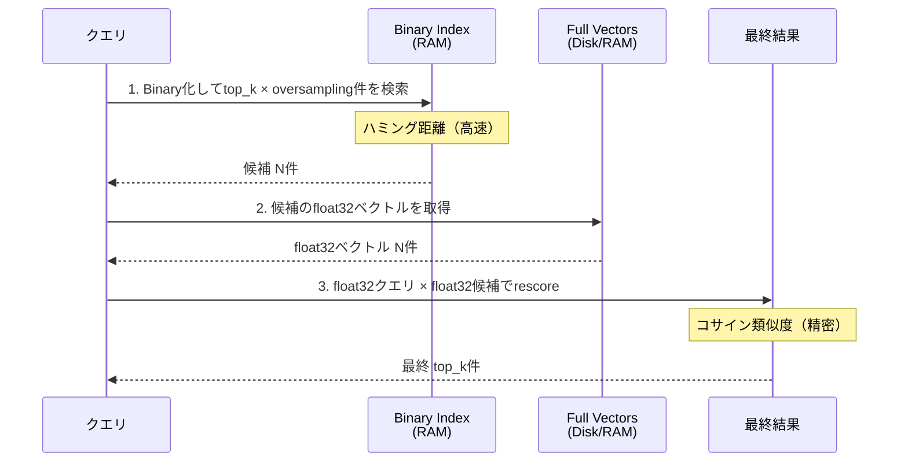

本記事は [Qdrant公式ブログ: Binary Quantization — Vector Search, 40x Faster](https://qdrant.tech/articles/binary-quantization/) の解説記事です。

## ブログ概要（Summary）

Qdrant社のNirant Kasliwal氏による本ブログ記事は、Binary Quantization（BQ）をQdrantベクトルDBに実装した際の技術的詳細とベンチマーク結果を報告している。BQはfloat32の各次元を1ビット（0/1）に変換し、ハミング距離による検索を行うことで最大40倍の検索高速化を実現する。一方で精度の劣化を補償するため、oversampling（候補の過剰取得）とrescoringの2段階パイプラインを採用している。100Kベクトルでの実測において、OpenAI text-embedding-3-small（1536次元）で0.9847のRecallを達成したと報告されている。

この記事は [Zenn記事: Embedding量子化×Matryoshka次元削減の精度-コスト最適化を定量評価する](https://zenn.dev/0h_n0/articles/6d45410fe51fa1) の深掘りです。

## 情報源

- **種別**: 企業テックブログ
- **URL**: [https://qdrant.tech/articles/binary-quantization/](https://qdrant.tech/articles/binary-quantization/)
- **組織**: Qdrant（オープンソースベクトルDB）
- **著者**: Nirant Kasliwal
- **発表日**: 2023年9月18日

## 技術的背景（Technical Background）

ベクトル検索システムの性能ボトルネックは、大量のベクトル間の距離計算にある。float32で1024次元のベクトル1対の内積計算には1024回の浮動小数点乗算と1023回の加算が必要である。binary量子化では、この計算をビット単位のXOR演算とpopcnt（ビットカウント）命令に置き換えることで、CPU命令数を大幅に削減する。

### Binary Quantizationの基本原理

各次元の値を閾値0で二値化する。

$$
b(x_i) = \begin{cases} 1 & \text{if } x_i > 0 \\ 0 & \text{if } x_i \leq 0 \end{cases}
$$

2つのbinaryベクトル$\mathbf{a}, \mathbf{b}$間の類似度はハミング距離で計算される。

$$
d_H(\mathbf{a}, \mathbf{b}) = \sum_{i=1}^{d/8} \text{popcount}(\mathbf{a}_i \oplus \mathbf{b}_i)
$$

ここで$\oplus$はXOR演算、popcntは1のビット数をカウントする命令である。この計算は最新CPUのSIMD命令（AVX-512 VPOPCNTDQ等）により極めて高速に実行できる。

1024次元のfloat32ベクトル（4096バイト）が128バイトのbinaryベクトルに変換され、32倍の圧縮と大幅な計算高速化を同時に達成する。

### Oversampling + Rescoring パイプライン

Binary量子化単独では精度が不十分なため、Qdrantは2段階のパイプラインを採用している。



**oversamplingの考え方**: 最終的にtop 10を返したい場合、BQ検索でtop 40（oversampling = 4.0）を取得し、float32でrescoreして上位10件を選ぶ。BQの近似検索で取りこぼした真の上位結果を、候補数を増やすことで回収する戦略である。

## 実装アーキテクチャ（Architecture）

### Qdrantでの設定

```python
from qdrant_client import QdrantClient
from qdrant_client.models import (
    VectorParams,
    Distance,
    BinaryQuantization,
    BinaryQuantizationConfig,
    QuantizationSearchParams,
)

client = QdrantClient(url="http://localhost:6333")

# BQ有効のコレクション作成
client.create_collection(
    collection_name="bq_documents",
    vectors_config=VectorParams(
        size=1536,
        distance=Distance.COSINE,
    ),
    quantization_config=BinaryQuantization(
        binary=BinaryQuantizationConfig(
            always_ram=True,  # BQインデックスは常にRAMに保持
        )
    ),
)

# Oversampling + Rescoring付き検索
results = client.query_points(
    collection_name="bq_documents",
    query=[0.1] * 1536,
    limit=10,
    search_params={
        "quantization": QuantizationSearchParams(
            rescore=True,         # float32でrescore
            oversampling=3.0,     # 3倍の候補を取得
        )
    },
)
```

**設定のポイント:**
- `always_ram=True`: BQインデックスをRAMに保持し、最大速度を確保。full vectorsはディスクに格納してストレージ削減
- `oversampling`: モデルと次元数に依存。1536次元モデルでは3.0で十分、768次元以下では4.0以上が推奨される
- `rescore=True`: 精度回復に必須。これを無効にするとRecallが大幅に低下する

### メモリ使用量の変化

ブログで報告されている100K OpenAI Embeddings（1536次元）での実測値は以下の通りである。

| 構成 | メモリ使用量 | 倍率 |
|------|------------|------|
| float32（量子化なし） | 900 MB | 1x |
| BQ + full vectors on disk | 128 MB | 7x削減 |

## パフォーマンス最適化（Performance）

### ベンチマーク結果（100Kベクトル）

ブログで報告されているモデル別のRecall値は以下の通りである（rescore有効時）。

| モデル | 次元数 | Recall@50 | Oversampling |
|--------|--------|-----------|-------------|
| OpenAI text-embedding-3-small | 1536 | 0.9847 | 3x |
| OpenAI text-embedding-ada-002 | 1536 | 0.98 | 4x |
| Gemini Embedding | 768 | 0.9563 | 3x |

**次元数の影響**: 1536次元モデルでは0.98以上のRecallを達成しているが、768次元のGemini Embeddingでは0.9563にとどまる。ブログの著者は「1024次元未満のEmbeddingではBQは推奨しない」と明言している。これは低次元ベクトルでは各ビットが担う情報量が大きく、1ビットへの量子化による情報損失が相対的に大きくなるためである。

### 検索速度

ブログの報告によると、BQによる検索速度向上は最大40倍とされている。これは以下の要因の組み合わせによる。

1. **計算量の削減**: float32の乗算・加算からビットXOR + popcntへの置換
2. **メモリ帯域の改善**: ベクトルサイズが32分の1になるためキャッシュ効率が向上
3. **SIMD命令の活用**: 256ビットAVX2命令1回で2048ビット（2048次元分）のハミング距離を計算可能

ただし、rescoring段階でfloat32ベクトルのディスク読み取りが発生するため、end-to-endの高速化は40倍よりも低くなる。レイテンシ要件に応じてoversamplingを調整する必要がある。

## 運用での学び（Production Lessons）

### モデル選択ガイドライン

ブログの著者が報告している、BQに適したモデルの条件は以下の通りである。

1. **次元数1024以上**: BQの情報損失に対する冗長性が十分ある
2. **正規化済みEmbedding**: コサイン類似度での学習が前提
3. **BQ対応を意図した学習**: Cohere embed-v3、mxbai-embed-large-v1等

**BQ非推奨のモデル:**
- all-MiniLM-L6-v2（384次元）: 次元数不足
- e5-base-v2（768次元）: 精度維持率74.8%（HuggingFace Blog報告値）まで低下

### 運用時の注意事項

- **キャリブレーション不要**: BQは閾値0での二値化であり、int8のようなキャリブレーションデータは不要
- **インデックス再構築**: 量子化設定を変更する場合、コレクション全体の再インデックスが必要
- **ディスクI/O**: rescore時にfull vectorsを読み込むため、NVMe SSD推奨。HDDではレイテンシが大幅に悪化する

## 学術研究との関連（Academic Connection）

Qdrantの実装は、以下の学術研究に基づいている。

- **ハミング距離検索**: Norouzi et al. (2012) のMulti-Index Hashingの考え方を応用
- **Oversampling戦略**: Yamada et al. (2021) のRescoring手法を実装に反映
- **MRL対応モデルとの組み合わせ**: Kusupati et al. (NeurIPS 2022) のMRLで次元削減した後にBQを適用する構成が、ストレージ最小化の観点で推奨される

## Production Deployment Guide

### AWS実装パターン（コスト最適化重視）

Qdrant + BQを用いたベクトル検索のAWS構成を示す。BQによるメモリ7倍削減を活かし、インスタンスサイズを小さくすることがコスト最適化の核心である。

| 規模 | 月間リクエスト | 推奨構成 | 月額コスト | 主要サービス |
|------|--------------|---------|-----------|------------|
| **Small** | ~3,000 | Single Node | $50-150 | EC2 t3.medium + EBS |
| **Medium** | ~30,000 | Cluster | $300-800 | EC2 r6g.large × 2 + ALB |
| **Large** | 300,000+ | Managed | $2,000-5,000 | EKS + Qdrant Cluster |

**Small構成の詳細** (月額$50-150、2026年5月時点概算):
- **EC2 t3.medium**: 2 vCPU, 4GB RAM ($30/月、BQにより4GBで1M vectors対応)
- **EBS gp3**: 100GB ($8/月、full vectors保存)
- **Qdrant**: Docker コンテナ (OSS版、無料)

**BQによるインスタンスサイズ縮小効果**:
- BQなし (float32, 1536d): 1M vectors → 6GB RAM → r6g.large必須 ($100/月)
- BQ有効: 1M vectors → 0.8GB RAM → t3.medium で対応可 ($30/月)
- 削減率: 約70%

上記は2026年5月時点のAWS ap-northeast-1料金に基づく概算値です。最新料金は [AWS料金計算ツール](https://calculator.aws/) で確認してください。

### Terraformインフラコード

```hcl
resource "aws_instance" "qdrant_bq" {
  ami           = "ami-0abcdef1234567890"  # Amazon Linux 2023
  instance_type = "t3.medium"

  root_block_device {
    volume_size = 20
    volume_type = "gp3"
  }

  ebs_block_device {
    device_name = "/dev/sdf"
    volume_size = 100
    volume_type = "gp3"
    iops        = 3000
    throughput  = 125
  }

  user_data = <<-EOF
    #!/bin/bash
    yum install -y docker
    systemctl start docker
    docker run -d -p 6333:6333 -p 6334:6334 \
      -v /mnt/qdrant:/qdrant/storage \
      qdrant/qdrant:latest
  EOF

  tags = {
    Name = "qdrant-bq-server"
  }
}

resource "aws_security_group" "qdrant" {
  name = "qdrant-bq-sg"

  ingress {
    from_port   = 6333
    to_port     = 6334
    protocol    = "tcp"
    cidr_blocks = ["10.0.0.0/16"]  # VPC内アクセスのみ
  }

  egress {
    from_port   = 0
    to_port     = 0
    protocol    = "-1"
    cidr_blocks = ["0.0.0.0/0"]
  }
}
```

### 運用・監視設定

```python
import boto3

cloudwatch = boto3.client('cloudwatch')

cloudwatch.put_metric_alarm(
    AlarmName='qdrant-memory-usage',
    ComparisonOperator='GreaterThanThreshold',
    EvaluationPeriods=2,
    MetricName='MemoryUtilization',
    Namespace='CWAgent',
    Period=300,
    Statistic='Average',
    Threshold=80,
    AlarmDescription='Qdrant BQメモリ使用率80%超過'
)
```

### コスト最適化チェックリスト

- [ ] BQ有効化でメモリ使用量を7倍削減
- [ ] full vectorsをEBS gp3（ディスク）に配置（RAM不要）
- [ ] oversampling倍率は3.0〜4.0（精度と速度のバランス）
- [ ] 1024次元以上のモデルでBQを使用（それ以下はScalar量子化を推奨）
- [ ] NVMe SSD（i3/i4i系）をrescore用ストレージに使用（HDDは非推奨）
- [ ] CloudWatch Agentでメモリ・ディスクI/Oを監視

## まとめと実践への示唆

QdrantのBinary Quantization実装は、1536次元以上のEmbeddingモデルにおいてメモリ7倍削減・検索40倍高速化を実現する実用的な最適化手法である。oversampling + rescoring パイプラインにより、Recallを0.98以上に維持できることがベンチマークで示されている。

ただし、768次元以下のモデルでは精度劣化が顕著であり、その場合はScalar量子化（int8）を選択すべきである。MRLによる次元削減後にBQを適用する構成は、ストレージ最小化の観点では有力だが、次元削減で1024次元を下回る場合はBQの適用を慎重に検討する必要がある。

## 参考文献

- **Blog URL**: [https://qdrant.tech/articles/binary-quantization/](https://qdrant.tech/articles/binary-quantization/)
- **Qdrant Quantization Docs**: [https://qdrant.tech/documentation/manage-data/quantization/](https://qdrant.tech/documentation/manage-data/quantization/)
- **Related Zenn article**: [https://zenn.dev/0h_n0/articles/6d45410fe51fa1](https://zenn.dev/0h_n0/articles/6d45410fe51fa1)

---

:::message
この記事はAI（Claude Code）により自動生成されました。内容の正確性については複数の情報源で検証していますが、実際の利用時は公式ドキュメントもご確認ください。
:::
