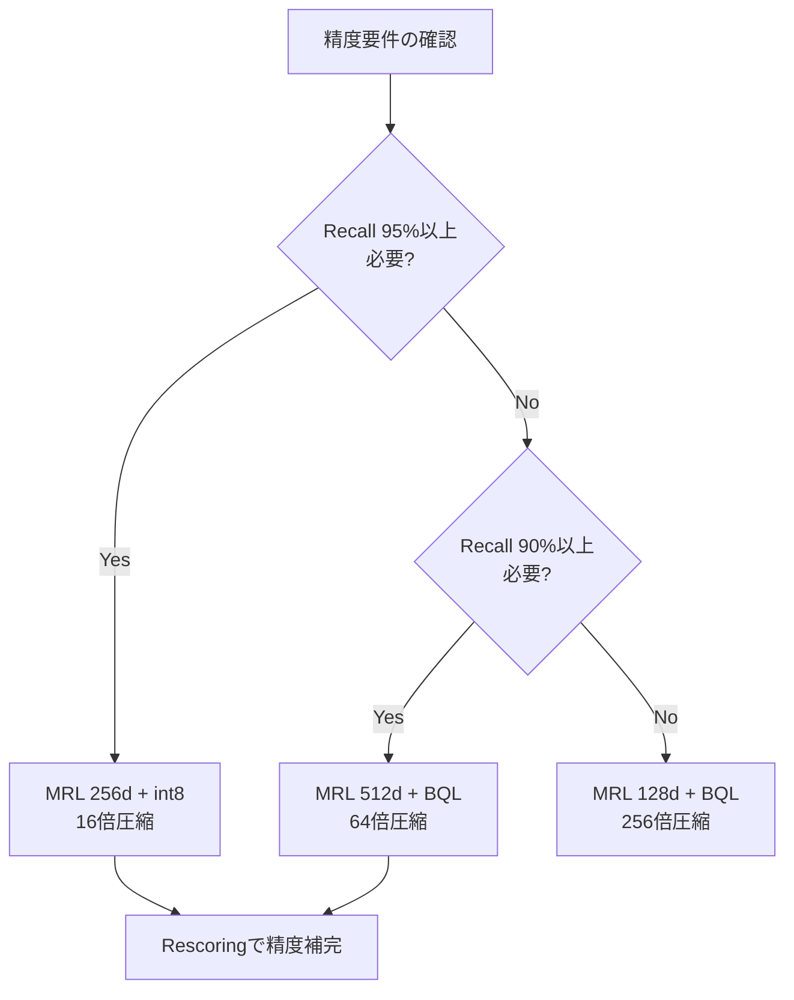

本記事は [Vespa公式ブログ: Matryoshka + Binary vectors: Slash vector search costs with Vespa](https://blog.vespa.ai/combining-matryoshka-with-binary-quantization-using-embedder/) の解説記事です。

## ブログ概要（Summary）

Vespa社のChief ScientistであるJo Kristian Bergum氏による本ブログ記事は、Matryoshka Representation Learning（MRL）とBinary Quantization Learning（BQL）を組み合わせてベクトル検索コストを大幅に削減する実装手法を報告している。Vespa v8.332.5以降でこの組み合わせがネイティブサポートされ、1024次元float32ベクトル（4096バイト）を64バイトまで圧縮しつつ、MTEB Retrievalタスクで90%の精度を維持できるとされている。著者は10億ベクトル規模での時間あたりコストを$38.14から$0.59に削減できると試算している。

この記事は [Zenn記事: Embedding量子化×Matryoshka次元削減の精度-コスト最適化を定量評価する](https://zenn.dev/0h_n0/articles/6d45410fe51fa1) の深掘りです。

## 情報源

- **種別**: 企業テックブログ
- **URL**: [https://blog.vespa.ai/combining-matryoshka-with-binary-quantization-using-embedder/](https://blog.vespa.ai/combining-matryoshka-with-binary-quantization-using-embedder/)
- **組織**: Vespa（Yahoo!/Verizon Media発のオープンソース検索エンジン）
- **著者**: Jo Kristian Bergum（Chief Scientist）
- **発表日**: 2024年4月22日

## 技術的背景（Technical Background）

ベクトル検索のコスト構造は、大部分がベクトルストレージのメモリコストで決まる。Vespaの基本プラン（$0.01/GB/hour memory）を基準にすると、10億ベクトルの1024次元float32表現は約3.8TBのメモリを必要とし、時間あたり$38.14のコストが発生する。

MRLとBQLは「直交する2つの圧縮軸」として機能する。MRLはベクトルの次元数を削減（次元軸の圧縮）し、BQLは各次元の精度を削減（ビット軸の圧縮）する。両者を組み合わせることで、乗算的な圧縮が可能になる。

### 圧縮の計算

1024次元float32ベクトルのサイズ:

$$
\text{Size}_{\text{original}} = 1024 \times 4\text{ bytes} = 4096\text{ bytes}
$$

MRL（512次元に削減）+ BQL（1ビット化）後のサイズ:

$$
\text{Size}_{\text{compressed}} = \frac{512}{8}\text{ bytes} = 64\text{ bytes}
$$

圧縮率:

$$
\text{Compression ratio} = \frac{4096}{64} = 64\times
$$

### MRLとBQLの相補性

ブログの著者は、MRLとBQLがそれぞれ異なる軸で圧縮を行う点を強調している。

- **MRL**: 「次元数の柔軟性」を提供。先頭$k$次元を切り取るだけで低次元表現が得られる
- **BQL**: 「各次元の精度の柔軟性」を提供。各次元を1ビットに量子化する

重要な点として、両者はモデル推論後の事後処理として適用される。すなわち、1回の推論から複数の解像度の表現を同時に取得できるため、「モデル推論は主要なコストドライバー」であるという制約の下で効率的な運用が可能である。

## 実装アーキテクチャ（Architecture）

### Vespaでの設定

**Embedderの定義（services.xml）:**

```xml
<component id="mxbai" type="hugging-face-embedder">
  <transformer-model url="https://huggingface.co/mixedbread-ai/mxbai-embed-large-v1/resolve/main/onnx/model_fp16.onnx"/>
  <tokenizer-model url="https://huggingface.co/mixedbread-ai/mxbai-embed-large-v1/raw/main/tokenizer.json"/>
  <pooling-strategy>cls</pooling-strategy>
  <normalize>true</normalize>
</component>
```

**スキーマ定義（全精度 1024次元 float）:**

```
field embedding type tensor<float>(x[1024]) {
    indexing: input text | embed mxbai | attribute | index
    attribute {
        distance-metric: prenormalized-angular
    }
}
```

**スキーマ定義（MRL 256次元に削減）:**

```
field mrl_embedding type tensor<float>(x[256]) {
    indexing: input text | embed mxbai | attribute | index
    attribute {
        distance-metric: prenormalized-angular
    }
}
```

Vespaの`tensor<float>(x[256])`指定により、1024次元のEmbeddingから先頭256次元が自動的に切り出される。モデル側の変更は不要である。

**スキーマ定義（BQL 1024ビット → 128バイト int8）:**

```
field bq_embedding type tensor<int8>(x[128]) {
    indexing: input text | embed mxbai | attribute | index
    attribute {
        distance-metric: hamming
    }
}
```

128次元のint8テンソルは、1024次元の各float値を1ビット化してパックした結果（1024ビット = 128バイト）を表す。

**スキーマ定義（MRL + BQL 最大圧縮: 512ビット → 64バイト）:**

```
field mrl_bq_embedding type tensor<int8>(x[64]) {
    indexing: input text | embed mxbai | attribute | index
    attribute {
        distance-metric: hamming
    }
}
```

先頭512次元のfloat値を1ビット化してパックした結果（512ビット = 64バイト）。これが64倍圧縮の構成である。

### 単一推論からの複数表現取得

Vespaでは同一のembedder IDとinput textを指定した複数フィールドに対して、推論は1回だけ実行される。

```
field mrl_embedding type tensor<bfloat16>(x[256]) {
    indexing: input text | embed mxbai | attribute | index
    attribute {
        distance-metric: prenormalized-angular
    }
}

field embedding type tensor<bfloat16>(x[1024]) {
    indexing: input text | embed mxbai | attribute
    attribute {
        paged
        distance-metric: prenormalized-angular
    }
}
```

`paged`属性を持つフィールドはディスクに配置される。これにより、粗い検索用の低次元ベクトルをRAMに、rescore用の全次元ベクトルをディスクに配置する2層構成が実現できる。

### Adaptive Rescoringパイプライン

Vespaのランキング機能を使った2段階のrescoringパイプラインの実装例を以下に示す。

```
function unpack_to_float() {
    expression: 2*unpack_bits(attribute(embedding), float)-1
}

first-phase {
    expression: closeness(field, embedding)
}

second-phase {
    expression: sum(query(q) * unpack_to_float)
}
```

1段階目でハミング距離による粗い検索を行い、2段階目でbinaryベクトルをfloatに展開（unpack）して内積で再スコアリングする。ブログの著者によると、この2段階パイプラインにより「オリジナルのfloat表現の95-96%の精度」に回復するとされている。

## パフォーマンス最適化（Performance）

### レイテンシベンチマーク（Exact Nearest Neighbor Search, targetHits=100）

ブログで報告されているMRL次元削減のレイテンシ効果は以下の通りである。

| 次元数 | 速度向上 |
|--------|---------|
| 1024 (ベースライン) | 1x |
| 512 (MRL) | 2x |
| 256 (MRL) | 4x |

### ハミング距離の性能

- ハミング距離計算はfloat内積と比較して約**20倍高速**
- 512次元binaryベクトル検索の平均レイテンシ: 約**2ミリ秒**
- 100Kベクトルでのスループット: 約**10,000 QPS**
- 1秒あたり約**10億回のハミング距離計算**が可能

この高速性はCPUのpopcount命令の効率に依存しており、XOR演算とビットカウントが浮動小数点演算よりも大幅に少ないCPU命令数で完了するためである。

## コスト比較（10億ベクトル規模）

ブログの著者が報告しているVespa基本プラン（$0.01/GB/hour memory）でのコスト比較は以下の通りである。

| ベクトル形式 | 次元 | バイト/ベクトル | 10億ベクトルの時間コスト |
|-------------|------|---------------|---------------------|
| Float | 1024 | 4,096 | $38.14/hour |
| Bfloat16 | 1024 | 2,048 | $19.07/hour |
| Int8 (scalar) | 1024 | 1,024 | $9.54/hour |
| Int8 (binary) | 128 | 128 | $1.19/hour |
| **Int8 (MRL + BQL)** | **64** | **64** | **$0.59/hour** |

MRL + BQLの組み合わせにより、float32比で**約64倍のコスト削減**が実現される。さらにVespaのvector streaming search機能を使うと、追加の25倍の削減（$0.0004/hour）が可能とされている。

### 精度とコストのトレードオフ

ブログで参照されているmixedbread.ai（mxbai-embed-large-v1）の実装結果は以下の通りである。

- **構成**: 512次元float → 64次元int8（BQL）
- **精度維持率**: MTEB Retrievalタスクで90%
- **ストレージ**: 64バイト/ベクトル
- **圧縮率**: 64倍

ブログの著者は、90%の精度維持率は多くのユースケースで許容可能であり、コスト64倍削減のインパクトが精度10%低下を上回るケースが多いと主張している。精度が不足する場合は、MRL次元数を増やす（512→768）か、rescoringでfull precisionを使用する2段階パイプラインが推奨される。

## 運用での学び（Production Lessons）

### MRL + BQLの適用判断フロー



### コスト削減の新しいユースケース

ブログの著者は、MRL + BQLによるコスト削減がこれまで不可能だったユースケースを実現すると指摘している。

- **長文ドキュメントの細粒度チャンキング**: 1ドキュメントを100チャンクに分割しても、64バイト/ベクトルならストレージコストが許容範囲
- **マルチベクトルインデックス**: ColBERT型の全トークンベクトル検索が現実的なコストで実現可能
- **ハイブリッド検索**: セマンティック検索とBM25の併用時に、ベクトルストレージコストがボトルネックにならない

## 学術研究との関連（Academic Connection）

Vespaの実装は以下の学術研究を基盤としている。

- **MRL** (Kusupati et al., NeurIPS 2022): 次元削減の基盤手法。Vespaでは先頭$k$次元の切り出しとして実装
- **Binary Quantization Learning**: 正規化済みベクトルの閾値0での二値化は、Embedding空間の幾何学的性質に基づく
- **Hamming距離検索**: Indyk & Motwani (1998) のLocality-Sensitive Hashingの考え方を応用

## Production Deployment Guide

### AWS実装パターン（コスト最適化重視）

Vespa + MRL + BQLをAWSにデプロイする構成を示す。64倍のストレージ削減を活かし、小規模インスタンスで大規模データを処理する。

| 規模 | 月間リクエスト | 推奨構成 | 月額コスト | 主要サービス |
|------|--------------|---------|-----------|------------|
| **Small** | ~3,000 | Single Node | $80-200 | EC2 c6g.large + EBS |
| **Medium** | ~30,000 | Cluster | $400-1,000 | EC2 c6g.xlarge × 2 + ALB |
| **Large** | 300,000+ | Vespa Cloud | $2,000-6,000 | Vespa Cloud Managed |

**Small構成の詳細** (月額$80-200、2026年5月時点概算):
- **EC2 c6g.large**: 2 vCPU ARM, 4GB RAM ($50/月)。MRL+BQLにより10M vectorsが640MBに収まる
- **EBS gp3**: 200GB ($16/月)。full precision vectors + Vespa状態
- **Vespa OSS**: Docker コンテナ (無料)

上記は2026年5月時点のAWS ap-northeast-1料金に基づく概算値です。最新料金は [AWS料金計算ツール](https://calculator.aws/) で確認してください。

### Terraformインフラコード

```hcl
resource "aws_instance" "vespa_node" {
  ami           = "ami-0abcdef1234567890"  # Amazon Linux 2023 ARM
  instance_type = "c6g.large"              # ARM: コスト効率が良い

  root_block_device {
    volume_size = 30
    volume_type = "gp3"
  }

  ebs_block_device {
    device_name = "/dev/sdf"
    volume_size = 200
    volume_type = "gp3"
    iops        = 3000
    throughput  = 125
  }

  user_data = <<-EOF
    #!/bin/bash
    # Vespa OSS installation (ARM64)
    yum install -y docker
    systemctl start docker
    docker run -d --name vespa \
      -p 8080:8080 -p 19071:19071 \
      -v /mnt/vespa:/opt/vespa/var \
      vespaengine/vespa:latest
  EOF

  tags = {
    Name = "vespa-mrl-bql-node"
  }
}
```

### コスト最適化チェックリスト

- [ ] MRL次元を512以下に設定（精度90%維持で16-64倍圧縮）
- [ ] BQLを有効化（`tensor<int8>(x[64])` 形式）
- [ ] rescore用full vectorsを`paged`属性でディスク配置
- [ ] 単一推論から複数解像度表現を取得（推論コスト不変）
- [ ] ARM インスタンス（c6g系）を使用（x86比で約20%コスト削減）
- [ ] vector streaming searchを検討（さらに25倍コスト削減）

## まとめと実践への示唆

VespaのMRL + BQL統合は、ベクトル検索のストレージコストを最大64倍削減しつつ90%の精度を維持する実用的な手法である。ブログの著者が報告した主要な成果は以下の通りである。

- 1ベクトル64バイト（SHA-512ハッシュと同等サイズ）で表現可能
- 10億ベクトル規模で時間コストを$38.14→$0.59に削減
- ハミング距離検索でfloat内積比20倍の高速化
- 単一推論から複数解像度の表現を同時取得

MRLとBQLの組み合わせは、個別適用の乗算的な効果をもたらす。コスト制約が厳しいプロダクション環境や、大規模なマルチベクトル検索において、この手法は有力な選択肢となる。

## 参考文献

- **Blog URL**: [https://blog.vespa.ai/combining-matryoshka-with-binary-quantization-using-embedder/](https://blog.vespa.ai/combining-matryoshka-with-binary-quantization-using-embedder/)
- **Vespa Documentation**: [https://docs.vespa.ai/](https://docs.vespa.ai/)
- **mxbai-embed-large-v1**: [https://huggingface.co/mixedbread-ai/mxbai-embed-large-v1](https://huggingface.co/mixedbread-ai/mxbai-embed-large-v1)
- **Related Zenn article**: [https://zenn.dev/0h_n0/articles/6d45410fe51fa1](https://zenn.dev/0h_n0/articles/6d45410fe51fa1)

---

:::message
この記事はAI（Claude Code）により自動生成されました。内容の正確性については複数の情報源で検証していますが、実際の利用時は公式ドキュメントもご確認ください。
:::
