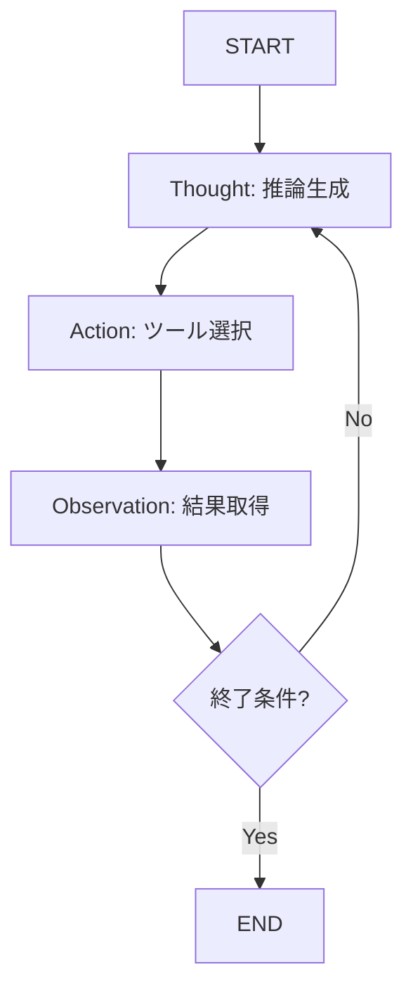

## 論文概要（Abstract）

本記事は [ReAct: Synergizing Reasoning and Acting in Language Models](https://arxiv.org/abs/2210.03629)（Yao et al., 2022）の解説記事です。

ReActは、大規模言語モデル（LLM）に**推論トレース（Thought）**と**タスク固有の行動（Action）**を交互に生成させるプロンプトフレームワークである。従来のChain-of-Thought（CoT）が推論のみを行い、行動ベースの手法（Act）が推論なしに行動のみを実行していたのに対し、ReActは両者を統合する。著者らはHotpotQA、FEVER、ALFWorld、WebShopの4ベンチマークで評価を行い、推論単体・行動単体を上回る性能を報告している。ICLR 2023にてOral発表として採択された。

この記事は [Zenn記事: LangGraph 1.2でステートマシン設計：条件分岐・並列実行・本番運用パターン](https://zenn.dev/0h_n0/articles/68254f67c81a10) の深掘りです。

## 情報源

- **arXiv ID**: 2210.03629
- **URL**: [https://arxiv.org/abs/2210.03629](https://arxiv.org/abs/2210.03629)
- **著者**: Shunyu Yao, Jeffrey Zhao, Dian Yu, Nan Du, Izhak Shafran, Karthik Narasimhan, Yuan Cao
- **発表年**: 2022（ICLR 2023 Oral）
- **分野**: cs.CL, cs.AI, cs.LG

## 背景と動機（Background & Motivation）

2022年時点で、LLMの能力活用には2つの独立したアプローチが存在していた：

1. **推論（Reasoning）**: Chain-of-Thought（Wei et al., 2022）に代表される、思考過程を明示的に生成するアプローチ。内部知識のみで推論するため、事実確認や環境操作ができない
2. **行動（Acting）**: WebGPT（Nakano et al., 2021）等の、外部ツールを呼び出すアプローチ。行動の根拠が不透明で、誤った推論に基づく行動を制御できない

著者らはこの分離が非効率であると指摘している。人間の認知プロセスでは推論と行動は相互に影響し合う。ReActはこの認知的統合をLLMで再現する試みである。

## 主要な貢献（Key Contributions）

- **貢献1**: Thought/Action/Observationの交互生成パターンを形式化し、推論と行動の統合が相乗効果を生むことを実証
- **貢献2**: HotpotQA（QA）とFEVER（事実検証）で、CoT単体・Act単体を上回る性能を達成
- **貢献3**: ALFWorld（具身化環境）とWebShop（Web操作）で、行動の成功率と解釈可能性の両立を実証
- **貢献4**: LLMエージェントの「思考→行動→観察」ループの標準設計パターンを確立

## 技術的詳細（Technical Details）

### ReActのプロンプト構造

ReActでは、LLMの生成空間を以下の3種類のトークン列で構成する：

$$
\tau = (t_1, a_1, o_1, t_2, a_2, o_2, \ldots, t_n, a_n, o_n)
$$

ここで、
- $t_i$: Thought（推論トレース）— 行動の根拠、計画、中間推論を含む自由形式テキスト
- $a_i$: Action（行動）— 事前定義されたアクション空間 $\mathcal{A}$ から選択される操作
- $o_i$: Observation（観察）— 環境からのフィードバック

LLMのポリシーは以下の条件付き生成として定式化される：

$$
t_i \sim p_\theta(t \mid c_i), \quad a_i \sim p_\theta(a \mid c_i, t_i)
$$

ここで $c_i = (t_1, a_1, o_1, \ldots, t_{i-1}, a_{i-1}, o_{i-1})$ はステップ $i$ 時点のコンテキストである。

### LangGraph 1.2のステートマシンとの対応

| ReAct要素 | LangGraph 1.2の対応 |
|-----------|-------------------|
| Thought $t_i$ | ノード関数内のLLM呼び出し |
| Action $a_i$ | ノード関数の返却値（状態更新） |
| Observation $o_i$ | 次ノードへの入力（ツール実行結果） |
| コンテキスト $c_i$ | `AgentState.messages`（Annotatedリデューサで蓄積） |
| 終了条件 | `add_conditional_edges`のルーター関数 |



### アクション空間の設計

**HotpotQA**: $\mathcal{A} = \{\text{Search}[entity], \text{Lookup}[string], \text{Finish}[answer]\}$

**ALFWorld**: $\mathcal{A} = \{\text{go to}[loc], \text{pick up}[obj], \text{put}[obj][loc], \text{open}[obj], \ldots\}$

著者らは「アクション空間が不十分な場合、Thoughtで推論できても実行手段がなく性能が頭打ちになる」と報告している（論文Section 3.2）。

### アルゴリズム

```python
from typing import Literal

def react_loop(
    llm: LLM,
    tools: dict[str, callable],
    query: str,
    max_steps: int = 6,
) -> str:
    """ReActループの擬似実装"""
    context = f"Question: {query}\n"

    for step in range(1, max_steps + 1):
        thought = llm.generate(context + f"Thought {step}:")
        context += f"Thought {step}: {thought}\n"

        action = llm.generate(context + f"Action {step}:")
        context += f"Action {step}: {action}\n"

        if action.startswith("Finish"):
            return extract_answer(action)

        tool_name, tool_input = parse_action(action)
        observation = tools[tool_name](tool_input)
        context += f"Observation {step}: {observation}\n"

    return "Max steps reached"
```

## 実装のポイント（Implementation）

### Few-shot例示の重要性

ReActの性能はプロンプト内の例示に強く依存する。著者らは各ベンチマークに対して3-6個のデモンストレーション例を手動で作成している。

### ステップ数制限

ReActループには明示的な終了条件が必要だが、LLMがFinishを生成しない場合に無限ループに陥る。著者らは`max_steps=6`を推奨。LangGraph 1.2では`retry_count`フィールドとルーター関数で実装する。

### LangGraphでのReAct実装

```python
from langgraph.graph import StateGraph, START, END

builder = StateGraph(AgentState)
builder.add_node("think_and_act", call_llm_with_tools)
builder.add_node("observe", execute_tool)

builder.add_edge(START, "think_and_act")
builder.add_conditional_edges("think_and_act", should_continue, {
    "continue": "observe",
    "end": END,
})
builder.add_edge("observe", "think_and_act")
```

## 実験結果（Results）

### 知識推論タスク（論文Table 1, 2より）

| 手法 | HotpotQA (EM) | FEVER (Accuracy) |
|------|---------------|-----------------|
| Standard prompting | 25.7 | 57.1 |
| CoT | 29.4 | 56.3 |
| Act | 25.0 | 58.9 |
| **ReAct** | **28.7** | **60.9** |
| ReAct + CoT-SC | **35.1** | **64.6** |

### 具身化タスク（論文Table 3より）

| 手法 | ALFWorld (Success) | WebShop (Success) |
|------|-------------------|------------------|
| Act | 45% | 30.1% |
| **ReAct** | **71%** | **40.0%** |

著者らは「ReActの真の価値は精度だけでなく解釈可能性にある」と論じている。

## 実運用への応用（Practical Applications）

ReActパターンはLangGraph 1.2で以下の形で運用される：

1. **カスタマーサポート**: 質問分類→DB検索→結果確認→追加質問判定ループ
2. **コーディングエージェント**: 計画→コード生成/テスト→テスト結果→修正判定
3. **リサーチエージェント**: 検索戦略→Web検索→結果要約→追加検索判定

**本番運用の課題**: レイテンシ累積、コンテキスト膨張（$O(n^2)$）、生成の確率性。LangGraph 1.2のCheckpointerで中間状態を永続化し障害時に再開可能。

## 関連研究（Related Work）

- **Chain-of-Thought (Wei et al., 2022)**: 推論トレース生成の基礎
- **WebGPT (Nakano et al., 2021)**: Web検索ツール使用LLM
- **Toolformer (Schick et al., 2023)**: ツール使用の自己学習

## まとめと今後の展望

ReActは「推論と行動の統合」を確立し、LangGraph等の設計基盤となった。LangGraph 1.2のStateGraphはReActのThought/Action/Observationループをノード・エッジ・状態の3プリミティブで明示的にモデル化する。

## Production Deployment Guide

### AWS実装パターン

| 規模 | 月間リクエスト | 推奨構成 | 月額コスト |
|------|--------------|---------|-----------|
| **Small** | ~3,000 | Lambda + Bedrock + DynamoDB | $100-250 |
| **Medium** | ~30,000 | ECS Fargate + ElastiCache | $500-1,200 |
| **Large** | 300,000+ | EKS + Karpenter + Spot | $3,000-7,000 |

上記は2026年6月時点のAWS ap-northeast-1料金概算。最新は [AWS料金計算ツール](https://calculator.aws/) で確認。

### Terraformインフラコード

```hcl
resource "aws_lambda_function" "react_agent" {
  filename      = "react_agent.zip"
  function_name = "react-agent-loop"
  role          = aws_iam_role.react_agent.arn
  handler       = "index.handler"
  runtime       = "python3.12"
  timeout       = 120
  memory_size   = 1024

  environment {
    variables = {
      THOUGHT_MODEL  = "anthropic.claude-3-5-haiku-20241022-v1:0"
      MAX_STEPS      = "6"
      DYNAMODB_TABLE = aws_dynamodb_table.react_state.name
    }
  }
}

resource "aws_dynamodb_table" "react_state" {
  name         = "react-agent-state"
  billing_mode = "PAY_PER_REQUEST"
  hash_key     = "session_id"
  range_key    = "step_number"

  attribute { name = "session_id"; type = "S" }
  attribute { name = "step_number"; type = "N" }

  ttl { attribute_name = "expire_at"; enabled = true }
}
```

### コスト最適化チェックリスト

- [ ] max_steps=6設定（無限ループ防止）
- [ ] Thought生成にHaiku使用（$0.25/MTok）
- [ ] Prompt Caching有効化（ツール定義固定）
- [ ] DynamoDB TTL: 24h自動削除
- [ ] AWS Budgets: 月額予算80%警告

## 参考文献

- **arXiv**: [https://arxiv.org/abs/2210.03629](https://arxiv.org/abs/2210.03629)
- **Code**: [https://github.com/ysymyth/ReAct](https://github.com/ysymyth/ReAct)
- **Related Zenn article**: [https://zenn.dev/0h_n0/articles/68254f67c81a10](https://zenn.dev/0h_n0/articles/68254f67c81a10)
