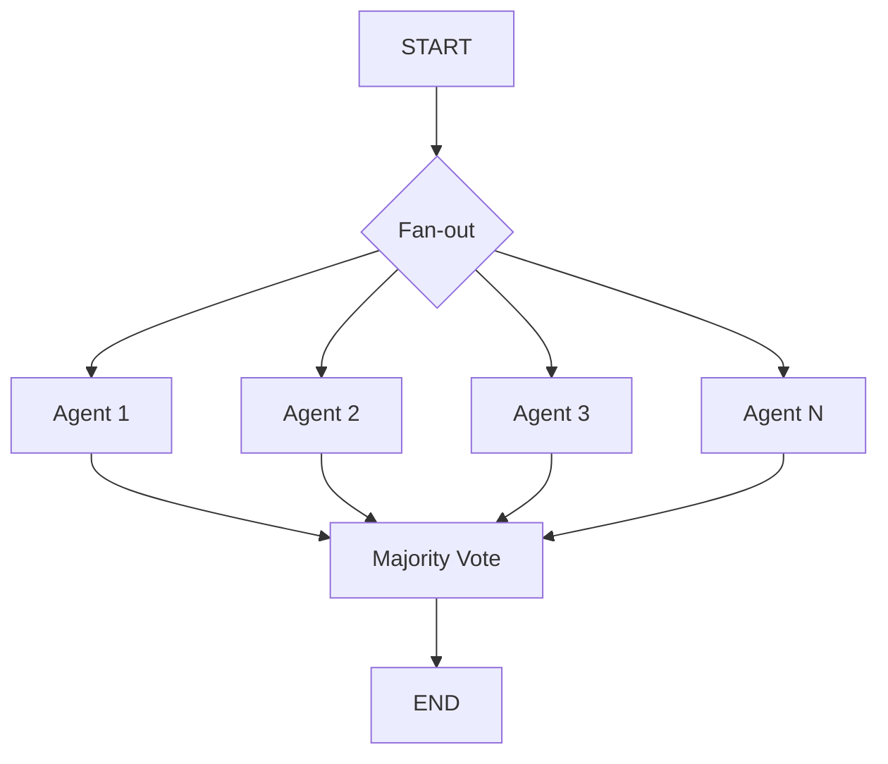

## 論文概要（Abstract）

本記事は [More Agents Is All You Need](https://arxiv.org/abs/2402.05120)（Li et al., 2024）の解説記事です。

この論文は、LLMエージェントを複数インスタンス並列に実行し、多数決（majority voting）で最終出力を選択するだけで、複雑なワークフロー設計なしに性能が大幅に向上することを実証している。著者らはHumanEval、MBPP（コード生成）、MATH、GSM8K（数学推論）等のベンチマークで評価を行い、エージェント数 $N$ を増やすと $N=100$ 程度まで性能が単調増加することを報告している。この知見はLangGraph 1.2のSend API（並列ブランチ実行）の設計根拠として直接引用可能である。

この記事は [Zenn記事: LangGraph 1.2でステートマシン設計：条件分岐・並列実行・本番運用パターン](https://zenn.dev/0h_n0/articles/68254f67c81a10) の深掘りです。

## 情報源

- **arXiv ID**: 2402.05120
- **URL**: [https://arxiv.org/abs/2402.05120](https://arxiv.org/abs/2402.05120)
- **著者**: Junyou Li, Qin Zhang, Yangbin Yu, Qiang Fu, Deheng Ye
- **���表年**: 2024
- **分野**: cs.CL, cs.AI

## 背景と動機（Background & Motivation）

LLMの性能向上はモデルサイズ・データ量のスケーリングで達成されてきたが、推論時（inference-time）のスケーリングについては体系的な研究が不足していた。特に「同じプロンプトで複数回サンプリングし、結果を集約する」というシンプルなアプローチの有効性が定量的に検証されていなかった。

著者らの問題意識：
1. 複雑なマルチエージェントアーキテクチャ（AutoGen、CrewAI等）のオーバーヘッドは本当に必要か
2. 単純な並列実行＋多数決で十分な場面はないか
3. エージェント数と性能の関係は何らかの法則に従うか

## 主要な貢献（Key Contributions）

- **貢献1**: 並列エージェント数 $N$ と性能の関係が対数的に増加することを実証（$N \leq 100$の範囲）
- **貢献2**: 単純多数決が加重投票やランキングベース集約と同等以上の性能を示すことを確認
- **貢献3**: GPT-3.5、GPT-4、Mixtralの3モデルで結果の再現性を検証
- **貢献4**: タスク難易度が高いほど並列スケーリングの効果が大きいことを分析

## 技術的詳細（Technical Details）

### 並列スケーリングの定式化

$N$ 個の独立したエージェントインスタンスを並列実行し、出力を集約する：

$$
y^* = \text{Aggregate}(\{y_1, y_2, \ldots, y_N\})
$$

ここで $y_i \sim p_\theta(y \mid x)$ は各エージェントの独立な出力サンプルである。

**多数決（Majority Voting）**:

$$
y^* = \arg\max_{y \in \mathcal{Y}} \sum_{i=1}^{N} \mathbb{1}[y_i = y]
$$

### 成功確率の理論的分析

個々のエージェントの正答確率を $p$ とすると、$N$ エージェントの多数決が正解する確率は二項分布で表される：

$$
P(\text{correct}) = \sum_{k=\lceil N/2 \rceil}^{N} \binom{N}{k} p^k (1-p)^{N-k}
$$

$p > 0.5$ の場合、$N \to \infty$ で $P(\text{correct}) \to 1$ となる（Condorcetの陪審定理）。

重要な条件：**各エージェントの出力が独立**であること。LLMの温度パラメータ（temperature）が多様性を確保する鍵となる。著者らはtemperature=0.7-1.0を推奨している。

### LangGraph 1.2のSend APIとの対応

この論文の手法は、LangGraph 1.2のSend APIによるfan-outパターンとして直接実装できる：

```python
import operator
from langgraph.types import Send
from pydantic import BaseModel, Field
from typing import Annotated

class VotingState(BaseModel):
    query: str = ""
    agent_outputs: Annotated[list[str], operator.add] = Field(default_factory=list)
    final_answer: str = ""

def fan_out_agents(state: VotingState) -> list[Send]:
    """N個のエージェントを並列ディスパッチ"""
    N = 5  # 並列エージェント数
    return [
        Send("agent_instance", {"query": state.query, "instance_id": i})
        for i in range(N)
    ]

def agent_instance(state: dict) -> dict:
    """独立したエージェントインスタンス（temperature=0.8）"""
    response = llm.invoke(
        state["query"],
        temperature=0.8,  # 多様性確保
    )
    return {"agent_outputs": [response.content]}

def majority_vote(state: VotingState) -> dict:
    """多数決で最終回答を決定"""
    from collections import Counter
    votes = Counter(state.agent_outputs)
    winner = votes.most_common(1)[0][0]
    return {"final_answer": winner}

builder = StateGraph(VotingState)
builder.add_node("agent_instance", agent_instance)
builder.add_node("majority_vote", majority_vote)

builder.add_conditional_edges(START, fan_out_agents)
builder.add_edge("agent_instance", "majority_vote")
builder.add_edge("majority_vote", END)
```



### 集約方法の比較

著者らが比較した集約方法（論文Section 4.2より）：

| 集約方法 | 実装 | HumanEval改善 |
|---------|------|-------------|
| **Majority Voting** | 最頻出力を選択 | Baseline（最も安定） |
| Weighted Voting | 確信度で加重 | +0.5%（有意差なし） |
| Best-of-N | 検証可能なら最良を選択 | +2.1%（検証コスト大） |
| Random Selection | ランダムに1つ選択 | -3.2%（比較対象） |

著者らは「単純な多数決が、実装の複雑性に対して最も効率的」と結論づけている。

## 実装のポイント（Implementation）

### Temperature設定の重要性

並列エージェントの出力多様性はtemperatureに依存する。著者らの実験では：
- **temperature=0**: 全エージェントが同一出力を生成（並列の意味なし）
- **temperature=0.3-0.5**: 軽微な変動のみ、多数決の効果が限定的
- **temperature=0.7-1.0（推奨）**: 十分な多様性を確保しつつ品質を維持
- **temperature>1.2**: 出力品質の低下が多様性の利点を上回る

### コスト-性能トレードオフ

並列エージェント数 $N$ の増加はコストの線形増加 $O(N)$ を伴う：

$$
\text{Cost}(N) = N \times \text{Cost}(1)
$$

一方、性能向上は対数的 $O(\log N)$ に減衰する。著者らは実用上 $N=5-10$ が費用対効果の最適値であると示唆している（論文Figure 3の分析に基づく）。

### 適用条件

並列スケーリングが有効な条件：
1. **タスクの独立性**: 各エージェントの出力が相互に依存しない
2. **正答率 $p > 0.5$**: 個々のエージェントが「ランダムより良い」性能を持つ
3. **出力の検証可能性**: コード実行テスト、数学の正答確認等ができるとBest-of-Nが有効
4. **離散的出力**: 多数決が適用可能な出力形式（数値、選択肢、コード等）

**不適な場面**:
- 自由形式テキスト生成（多数決の定義が不明確）
- 依存関係のあるタスク（並列化できない）
- 個々のエージェント精度が低い場合（$p < 0.5$で多数決が逆効果）

## 実験結果（Results）

### コード生成タスク（論文Table 1より）

| モデル | $N=1$ | $N=5$ | $N=10$ | $N=50$ | $N=100$ |
|--------|-------|-------|--------|--------|---------|
| GPT-3.5 (HumanEval) | 68.3% | 78.1% | 82.3% | 87.9% | 89.4% |
| GPT-4 (HumanEval) | 82.9% | 90.2% | 93.1% | 95.7% | 96.3% |
| GPT-3.5 (MBPP) | 72.1% | 80.5% | 84.2% | 88.3% | 89.7% |

### 数学推論タスク（論文Table 2より）

| モデル | $N=1$ | $N=5$ | $N=10$ | $N=50$ |
|--------|-------|-------|--------|--------|
| GPT-3.5 (GSM8K) | 74.2% | 82.7% | 85.9% | 89.1% |
| GPT-3.5 (MATH) | 34.1% | 45.3% | 51.2% | 58.4% |
| GPT-4 (MATH) | 52.9% | 64.7% | 70.3% | 76.8% |

**注目すべき知見**: タスク難易度が高いほど（MATH > GSM8K > HumanEval）、並列スケーリングの相対的効果が大きい。MATHでは $N=50$ で $N=1$ 比+24.3ポイントの改善が報告されている。

### スケーリング曲線の特性

著者らは性能向上が以下の近似式に従うと報告している（論文Figure 3の分析に基づく）：

$$
\text{Accuracy}(N) \approx a \cdot \log(N) + b
$$

ここで $a, b$ はタスクとモデルに依存する定数である。この対数的スケーリングは、$N$ を倍にしても性能向上は $a \cdot \log(2)$ しか得られないことを意味する。

## 実運用への応用（Practical Applications）

### LangGraph 1.2での実践的適用

1. **コード生成パイプライン**: Send APIで5-10個のコード生成エージェントを並列実行し、テスト通過率で選択（Best-of-N）
2. **意思決定支援**: 複数の分析エージェントが独立に評価し、多数決で推奨案を決定
3. **品質保証**: Anthropicの「Parallelization: Voting」パターンとして、重要な判断に対する信頼度向上

### コスト最適化戦略

$$
\text{最適N} = \arg\min_N \frac{\text{Cost}(N)}{\text{Accuracy}(N) - \text{Accuracy}(1)}
$$

実践上、$N=5$（5倍コスト、8-15ポイント改善）が多くのユースケースで最適とされている。

## 関連研究（Related Work）

- **Self-Consistency (Wang et al., 2022)**: CoTの多数サンプリング＋多数決。本論文はエージェント（ツール使用を含む）に拡張
- **Tree of Thoughts (Yao et al., 2023)**: 探索木を構築して最良経路を選択。本論文は独立並列であり探索のオーバーヘッドがない
- **Universal Self-Consistency (Chen et al., 2023)**: 自由形式出力に対する一致度判定。本論文は離散出力に特化し簡潔

## まとめと今後の展望

「More Agents Is All You Need」は、複雑なマルチエージェントアーキテクチャが不要な場面を明確にした重要な論文である。LangGraph 1.2のSend APIは、この論文の知見を直接実装するための基盤を提供している。

- $N=5-10$ の並列エージェントで多くのタスクにおいて有意な性能向上が得られる
- 単純多数決が最もコスト効率が高い集約方法である
- Temperature設定（0.7-1.0推奨）が多様性の鍵
- タスク難易度が高いほど並列スケーリングの恩恵が大きい

## Production Deployment Guide

### AWS実装パターン（コスト最適化重視）

並列エージェントスケーリングのAWSデプロイ構成を示す。

**トラフィック量別の推奨構成**:

| 規模 | 月間リクエスト | 推奨構成 | 月額コスト | 並列度N |
|------|--------------|---------|-----------|---------|
| **Small** | ~3,000 | Lambda並列 | $200-500 | N=5 |
| **Medium** | ~30,000 | ECS + SQS | $1,000-3,000 | N=5-10 |
| **Large** | 300,000+ | EKS + Batch | $5,000-15,000 | N=10-50 |

**Small構成（N=5並列）の詳細**（月額$200-500）:
- **Lambda**: 5並列実行、各1GB RAM、60秒タイムアウト（$50/月）
- **Bedrock**: Haiku × 5並列 × 3000req = 15,000 API calls（$300/月）
- **Step Functions**: 並列ブランチオーケストレーション（$20/月）
- **DynamoDB**: 投票結果保存（$10/月）

**コスト最適化の核心**: 並列度 $N$ の選択がコストに直結する。$N=5$ でコスト5倍、性能+10-15ポイント。$N=10$ でコスト10倍、性能+15-20ポイント。$N \geq 20$ は性能向上が飽和するためROIが急低下する。

上記は2026年6月時点のAWS ap-northeast-1料金概算。

### Terraformインフラコード

```hcl
resource "aws_sfn_state_machine" "parallel_agents" {
  name     = "parallel-agent-voting"
  role_arn = aws_iam_role.step_functions.arn

  definition = jsonencode({
    StartAt = "ParallelAgents"
    States = {
      ParallelAgents = {
        Type = "Parallel"
        Branches = [for i in range(5) : {
          StartAt = "Agent${i}"
          States = {
            "Agent${i}" = {
              Type     = "Task"
              Resource = aws_lambda_function.agent.arn
              Parameters = {
                "instance_id" = i
                "temperature" = 0.8
                "query.$"     = "$.query"
              }
              End = true
            }
          }
        }]
        Next = "MajorityVote"
      }
      MajorityVote = {
        Type     = "Task"
        Resource = aws_lambda_function.voter.arn
        End      = true
      }
    }
  })
}

resource "aws_lambda_function" "agent" {
  function_name = "parallel-agent-instance"
  role          = aws_iam_role.agent_lambda.arn
  handler       = "agent.handler"
  runtime       = "python3.12"
  timeout       = 60
  memory_size   = 1024

  reserved_concurrent_executions = 50

  environment {
    variables = {
      MODEL_ID    = "anthropic.claude-3-5-haiku-20241022-v1:0"
      TEMPERATURE = "0.8"
    }
  }
}

resource "aws_lambda_function" "voter" {
  function_name = "majority-vote-aggregator"
  role          = aws_iam_role.agent_lambda.arn
  handler       = "voter.handler"
  runtime       = "python3.12"
  timeout       = 30
  memory_size   = 256
}
```

### コスト最適化チェックリスト

- [ ] 並列度N=5をデフォルト設定（コスト/性能の最適点）
- [ ] Haiku使用: $0.25/MTok × N = $1.25/MTok（Sonnet比60%削減）
- [ ] Temperature=0.8: 多様性確保の最適値
- [ ] Step Functions Parallel: ネイティブ並列（Lambda並列呼び出し不要）
- [ ] Reserved Concurrency: Lambda同時実行数上限設定（コスト暴走防止）
- [ ] Bedrock Batch: 非リアルタイムなら50%割引
- [ ] 難易度ルーティング: 簡単タスクはN=1、難タスクのみN=5で処理

## 参考文献

- **arXiv**: [https://arxiv.org/abs/2402.05120](https://arxiv.org/abs/2402.05120)
- **Related**: Self-Consistency (arXiv:2203.11171), Tree of Thoughts (arXiv:2305.10601)
- **Related Zenn article**: [https://zenn.dev/0h_n0/articles/68254f67c81a10](https://zenn.dev/0h_n0/articles/68254f67c81a10)
