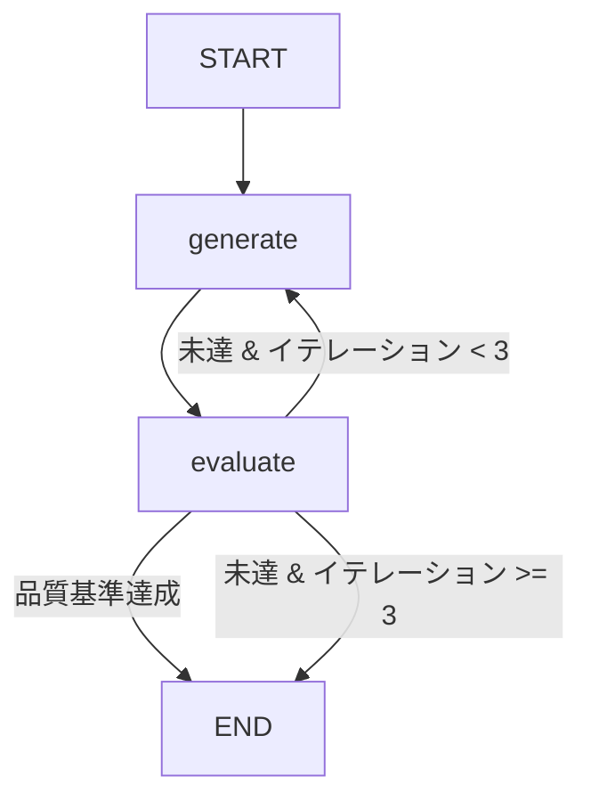

本記事は [Anthropic公式ブログ: Building Effective AI Agents](https://www.anthropic.com/research/building-effective-agents)（2024年12月19日公開）の解説記事です。

## ブログ概要（Summary）

Anthropicは2024年12月、AIエージェント構築に関する包括的なガイド「Building Effective Agents」を公開した。このブログ記事では、LLMを用いたシステムを「ワークフロー」と「エージェント」の2種類に分類し、ワークフロー設計における5つの基本パターンを提示している。著者らは「最も成功した実装は、複雑なフレームワークではなく、シンプルで組み合わせ可能なパターンを使用している」と主張しており、過度な抽象化を避けた設計原則を推奨している。

この記事は [Zenn記事: LangGraph 1.2でステートマシン設計：条件分岐・並列実行・本番運用パターン](https://zenn.dev/0h_n0/articles/68254f67c81a10) の深掘りです。

## 情報源

- **種別**: 企業テックブログ（Anthropic Research）
- **URL**: [https://www.anthropic.com/research/building-effective-agents](https://www.anthropic.com/research/building-effective-agents)
- **組織**: Anthropic
- **発表日**: 2024年12月19日

## 技術的背景（Technical Background）

LLMアプリケーションの設計において、単純なプロンプト呼び出しから複雑なマルチエージェントシステムまで、幅広いアーキテクチャが存在する。Anthropicはこれらを体系的に整理し、開発者が適切なパターンを選択するための指針を提供している。

Anthropicが提示する核心的な区分は以下の通りである：

- **ワークフロー（Workflows）**: 「LLMとツールが事前定義されたコードパスによってオーケストレーションされる」システム
- **エージェント（Agents）**: 「LLMが自らのプロセスとツール使用を動的に制御し、主導権を維持する」システム

この区分はLangGraph 1.2の設計思想と直接対応する。LangGraphのStateGraphは「ワークフロー」をグラフ構造で定義する仕組みであり、ノード内にLLM呼び出しを配置することで「エージェント」的振る舞いもグラフの一部として組み込める。

## 5つのワークフローパターンとLangGraph 1.2の対応

### パターン1: Prompt Chaining（直列連鎖）

タスクを固定的なサブタスクの列に分解し、各ステップのLLM出力を次のステップへの入力とするパターンである。中間にプログラム的な検証ゲートを挟むことで品質を担保する。

**LangGraph 1.2での対応**: `add_edge()`による線形ノード接続そのものである。

```python
from langgraph.graph import StateGraph, START, END

builder = StateGraph(State)
builder.add_node("step1", extract_entities)
builder.add_node("gate", validate_entities)
builder.add_node("step2", generate_response)

builder.add_edge(START, "step1")
builder.add_edge("step1", "gate")
builder.add_edge("gate", "step2")
builder.add_edge("step2", END)
```

Anthropicのブログによると、このパターンは「精度が速度より重要で、固定的なサブタスクに分解可能な場合」に最適とされている。

### パターン2: Routing（条件分岐）

入力を分類し、専門化されたハンドラへ振り分けるパターンである。カスタマーサポートの階層分け、モデル選択（簡単な質問にはHaiku、複雑な質問にはOpus）などが典型例として挙げられている。

**LangGraph 1.2での対応**: `add_conditional_edges()`によるルーター関数の実装である。

```python
def route_by_complexity(state: AgentState) -> str:
    """入力の複雑さに基づいてルーティング"""
    if state.complexity == "simple":
        return "fast_handler"
    elif state.complexity == "complex":
        return "deep_handler"
    return "fallback_handler"

builder.add_conditional_edges("classify", route_by_complexity)
```

Anthropicは「関心の分離（Separation of Concerns）を可能にし、タスク固有の最適化を実現する」とRoutingの価値を説明している。LangGraphでは、ルーター関数が純粋関数であるため単体テストが容易であり、各ハンドラノードを独立して開発・テストできる。

### パターン3: Parallelization（並列実行）

2つの変種が存在する：

- **Sectioning（セクション分割）**: 独立したサブタスクを同時実行する
- **Voting（投票）**: 同一タスクを複数回実行して信頼度を高める

**LangGraph 1.2での対応**: **Send API**による並列ブランチ実行である。

```python
from langgraph.types import Send

def fan_out_parallel(state: ResearchState) -> list[Send]:
    """独立タスクを並列ディスパッチ"""
    return [
        Send("guardrail_check", {"input": state.query}),
        Send("generate_response", {"input": state.query}),
    ]

builder.add_conditional_edges(START, fan_out_parallel)
```

Anthropicが示す具体例として「ガードレール実装（入力検証と生成を並列実行し、検証が失敗すれば生成結果を破棄）」がある。LangGraphのSend APIでは、Annotatedリデューサにより並列ノードからの結果を自動的にマージできる。

### パターン4: Orchestrator-Workers（指揮者-作業者）

中央のLLM（オーケストレーター）がタスクを動的に分解し、ワーカーLLMに委譲した後、結果を統合するパターンである。パターン3（Parallelization）との違いは、サブタスクが事前に決定されておらず、オーケストレーターが入力に応じて動的に決定する点にある。

**LangGraph 1.2での対応**: **サブグラフ（Subgraph）** + **Send API**の組み合わせである。

```python
def orchestrate(state: OrchestratorState) -> list[Send]:
    """LLMがサブタスクを動的に決定し、ワーカーへ委譲"""
    subtasks = llm_decompose(state.task)
    return [Send("worker", {"subtask": t}) for t in subtasks]

# ワーカーはサブグラフとして定義
worker_graph = StateGraph(WorkerState)
worker_graph.add_node("execute", execute_subtask)
worker_graph.add_edge(START, "execute")
worker_graph.add_edge("execute", END)
```

Anthropicのブログによると、このパターンはコーディングタスク（「影響を受けるファイルの特定」→「各ファイルの修正」→「統合テスト」）で有効性が高いとされている。

### パターン5: Evaluator-Optimizer（評価者-最適化者）

一方のLLMが応答を生成し、他方のLLMが評価を行う反復的フィードバックループである。「明確な評価基準」と「測定可能な改善ポテンシャル」が前提条件とされている。

**LangGraph 1.2での対応**: 条件分岐付きループ（リトライパターン）として実装される。

```python
def evaluate_output(state: AgentState) -> str:
    """評価ノード: 品質基準を満たすかチェック"""
    if state.quality_score >= 0.8:
        return "accept"
    if state.iteration_count >= 3:
        return "accept"  # 上限到達
    return "regenerate"

builder.add_conditional_edges("evaluate", evaluate_output, {
    "accept": END,
    "regenerate": "generate",
})
```



## 実装アーキテクチャ（Architecture）

Anthropicが推奨するアーキテクチャの核心は「シンプルさの維持」である。ブログ内で以下の3原則が繰り返し強調されている：

1. **シンプルさ（Simplicity）**: 不要な複雑性を避ける。単純なLLM呼び出し＋検索＋インコンテキスト例示から始め、必要に応じて複雑化する
2. **透明性（Transparency）**: 計画ステップを明示的に表示し、デバッグを容易にする
3. **ツール設計（Tool Documentation）**: Agent-Computer Interface（ACI）の仕様を徹底的にテストする

**システム構成の推奨**:

| 複雑度 | 推奨アプローチ | LangGraph対応 |
|--------|--------------|--------------|
| 低 | 単純LLM呼び出し + RAG | 不要（直接API呼び出し） |
| 中 | ワークフロー（上記5パターン） | StateGraph + 条件分岐 |
| 高 | 自律エージェント | StateGraph + Human-in-the-Loop |

Anthropicは「フレームワークは初期段階では有用だが、本番環境では抽象化レイヤを減らすべき」と明確に述べている。LangGraphはこの助言に沿った設計であり、低レベルのグラフ構築APIを直接提供している。

## パフォーマンス最適化（Performance）

Anthropicのブログでは、SWE-benchの実装を例に挙げ、以下の最適化知見を共有している：

- **ツール設計への投資**: プロンプト全体よりもツール定義の最適化に時間を割く
- **ポカヨケ原則**: ユーザー（LLM）が誤りにくいインターフェース設計
- **テスト駆動**: ワークベンチでのツール呼び出しパターン分析

**実測例**（ブログ内の示唆に基づく）:
- SWE-bench ResolvesはClaude 3.5 Sonnetで実行
- ツールインターフェースの改善だけで数ポイントの精度向上を達成

## 運用での学び（Production Lessons）

ブログから抽出できる本番運用上の教訓：

1. **段階的複雑化**: 単純なパターンで開始し、測定結果に基づいて複雑化する。最初からマルチエージェントを構築しない
2. **ガードレールの並列実装**: セキュリティチェックは生成と並列実行し、レイテンシを増加させない
3. **ストップ条件の明示化**: 自律エージェントには必ず停止条件と人間チェックポイントを組み込む
4. **サンドボックステスト**: 本番デプロイ前に広範なサンドボックス環境でのテストが必須

**障害対応パターン**:
- 無限ループ回避: LangGraphの`retry_count`フィールド + 条件分岐で上限設定
- タイムアウト: LangGraph 1.2のper-nodeタイムアウト機能で対応
- エラーフォールバック: `error_handler`による`Command`でのルーティング

## 学術研究との関連（Academic Connection）

Anthropicのブログで示される5パターンは、以下の学術研究と対応関係にある：

- **Prompt Chaining**: Chain-of-Thought推論（Wei et al., 2022）の構造化
- **Routing**: 分類ベースのディスパッチ（Mixture of Experts的アプローチ）
- **Parallelization**: アンサンブル手法（Boosting/Bagging）のLLM版
- **Orchestrator-Workers**: 階層型計画（HTN: Hierarchical Task Network）のLLM適用
- **Evaluator-Optimizer**: 自己改善（Self-Refine; Madaan et al., 2023）の外部化

ReAct（Yao et al., 2022）はこれらのパターンの基礎となるThought/Action/Observationループを提案しており、LangGraphはReActパターンをStateGraphのノードとして直接実装している。

## まとめと実践への示唆

Anthropicの「Building Effective Agents」ブログは、LLMエージェント設計において「シンプルさ」を最優先する設計哲学を提示している。5つのワークフローパターンはLangGraph 1.2の機能セット（条件分岐・Send API・サブグラフ・Human-in-the-Loop・Checkpointer）と1対1に対応しており、LangGraph 1.2はこれらのパターンを実装するための適切な抽象化レベルを提供していると言える。

本番環境への適用においては、「測定→パターン選択→段階的複雑化」のサイクルを守ることが成功の鍵であり、初期段階での過度なアーキテクチャ設計は逆効果となる。

## Production Deployment Guide

### AWS実装パターン（コスト最適化重視）

Anthropicのワークフローパターンを活用したLLMエージェントシステムをAWSにデプロイする構成を示す。

**トラフィック量別の推奨構成**:

| 規模 | 月間リクエスト | 推奨構成 | 月額コスト | 主要サービス |
|------|--------------|---------|-----------|------------|
| **Small** | ~3,000 (100/日) | Serverless | $80-200 | Lambda + Bedrock + DynamoDB |
| **Medium** | ~30,000 (1,000/日) | Hybrid | $400-1,000 | Lambda + ECS Fargate + ElastiCache |
| **Large** | 300,000+ (10,000/日) | Container | $2,500-6,000 | EKS + Karpenter + EC2 Spot |

**Small構成の詳細**（月額$80-200）:
- **Lambda**: 1GB RAM, 60秒タイムアウト（$25/月）
- **Bedrock**: Claude 3.5 Haiku, Prompt Caching有効（$100/月）
- **DynamoDB**: On-Demand, TTL付きセッション保存（$10/月）
- **Step Functions**: ワークフローオーケストレーション（$25/月）
- **CloudWatch**: 基本監視（$5/月）

**Medium構成の詳細**（月額$400-1,000）:
- **ECS Fargate**: 0.5 vCPU, 1GB RAM × 2タスク（$130/月）
- **Bedrock**: Claude 3.5 Sonnet, Batch API活用（$500/月）
- **ElastiCache Redis**: cache.t3.micro, チェックポイント保存（$15/月）
- **Application Load Balancer**: （$20/月）
- **Step Functions Express**: 高スループットワークフロー（$50/月）

**Large構成の詳細**（月額$2,500-6,000）:
- **EKS**: コントロールプレーン（$72/月）
- **EC2 Spot**: g5.xlarge × 2-4台（平均$800/月）
- **Karpenter**: 自動スケーリング（追加コストなし）
- **Bedrock Batch**: 50%割引活用（$2,500/月）
- **ElastiCache Redis**: cache.r6g.large, チェックポイント永続化（$150/月）

**コスト試算の注意事項**:
- 上記は2026年6月時点のAWS ap-northeast-1（東京）リージョン料金に基づく概算値
- 実際のコストはトラフィックパターン、リージョン、バースト使用量により変動
- 最新料金は [AWS料金計算ツール](https://calculator.aws/) で確認推奨

### Terraformインフラコード

**Small構成（Serverless）: Lambda + Bedrock + Step Functions**

```hcl
module "vpc" {
  source  = "terraform-aws-modules/vpc/aws"
  version = "~> 5.0"

  name = "agent-workflow-vpc"
  cidr = "10.0.0.0/16"
  azs  = ["ap-northeast-1a", "ap-northeast-1c"]
  private_subnets = ["10.0.1.0/24", "10.0.2.0/24"]

  enable_nat_gateway   = false
  enable_dns_hostnames = true
}

resource "aws_iam_role" "lambda_agent" {
  name = "lambda-agent-workflow-role"

  assume_role_policy = jsonencode({
    Version = "2012-10-17"
    Statement = [{
      Action = "sts:AssumeRole"
      Effect = "Allow"
      Principal = { Service = "lambda.amazonaws.com" }
    }]
  })
}

resource "aws_iam_role_policy" "bedrock_invoke" {
  role = aws_iam_role.lambda_agent.id
  policy = jsonencode({
    Version = "2012-10-17"
    Statement = [{
      Effect   = "Allow"
      Action   = ["bedrock:InvokeModel", "bedrock:InvokeModelWithResponseStream"]
      Resource = "arn:aws:bedrock:ap-northeast-1::foundation-model/anthropic.claude-*"
    }]
  })
}

resource "aws_lambda_function" "agent_router" {
  filename      = "router.zip"
  function_name = "agent-workflow-router"
  role          = aws_iam_role.lambda_agent.arn
  handler       = "index.handler"
  runtime       = "python3.12"
  timeout       = 60
  memory_size   = 1024

  environment {
    variables = {
      BEDROCK_MODEL_ID    = "anthropic.claude-3-5-haiku-20241022-v1:0"
      DYNAMODB_TABLE      = aws_dynamodb_table.sessions.name
      ENABLE_PROMPT_CACHE = "true"
    }
  }
}

resource "aws_dynamodb_table" "sessions" {
  name         = "agent-workflow-sessions"
  billing_mode = "PAY_PER_REQUEST"
  hash_key     = "session_id"

  attribute {
    name = "session_id"
    type = "S"
  }

  ttl {
    attribute_name = "expire_at"
    enabled        = true
  }
}

resource "aws_sfn_state_machine" "agent_workflow" {
  name     = "agent-routing-workflow"
  role_arn = aws_iam_role.step_functions.arn

  definition = jsonencode({
    StartAt = "Classify"
    States = {
      Classify = {
        Type     = "Task"
        Resource = aws_lambda_function.agent_router.arn
        Next     = "Route"
      }
      Route = {
        Type = "Choice"
        Choices = [
          { Variable = "$.intent", StringEquals = "simple", Next = "FastHandler" },
          { Variable = "$.intent", StringEquals = "complex", Next = "DeepHandler" }
        ]
        Default = "FallbackHandler"
      }
      FastHandler  = { Type = "Task", Resource = "arn:aws:lambda:...", End = true }
      DeepHandler  = { Type = "Task", Resource = "arn:aws:lambda:...", End = true }
      FallbackHandler = { Type = "Task", Resource = "arn:aws:lambda:...", End = true }
    }
  })
}
```

**Large構成（Container）: EKS + Karpenter**

```hcl
module "eks" {
  source  = "terraform-aws-modules/eks/aws"
  version = "~> 20.0"

  cluster_name    = "agent-workflow-cluster"
  cluster_version = "1.30"

  vpc_id     = module.vpc.vpc_id
  subnet_ids = module.vpc.private_subnets

  cluster_endpoint_public_access = true
  enable_cluster_creator_admin_permissions = true
}

resource "kubectl_manifest" "karpenter_provisioner" {
  yaml_body = <<-YAML
    apiVersion: karpenter.sh/v1
    kind: NodePool
    metadata:
      name: agent-workers
    spec:
      template:
        spec:
          requirements:
            - key: karpenter.sh/capacity-type
              operator: In
              values: ["spot"]
            - key: node.kubernetes.io/instance-type
              operator: In
              values: ["m5.xlarge", "m5.2xlarge"]
          limits:
            cpu: "64"
            memory: "256Gi"
      disruption:
        consolidationPolicy: WhenEmptyOrUnderutilized
        consolidateAfter: 30s
  YAML
}

resource "aws_elasticache_replication_group" "checkpoint_store" {
  replication_group_id = "agent-checkpoints"
  description          = "Checkpoint store for agent state persistence"
  node_type            = "cache.r6g.large"
  num_cache_clusters   = 2
  engine               = "redis"
  engine_version       = "7.1"

  at_rest_encryption_enabled = true
  transit_encryption_enabled = true
}

resource "aws_budgets_budget" "agent_monthly" {
  name         = "agent-workflow-monthly"
  budget_type  = "COST"
  limit_amount = "6000"
  limit_unit   = "USD"
  time_unit    = "MONTHLY"

  notification {
    comparison_operator       = "GREATER_THAN"
    threshold                 = 80
    threshold_type            = "PERCENTAGE"
    notification_type         = "ACTUAL"
    subscriber_email_addresses = ["ops@example.com"]
  }
}
```

### セキュリティベストプラクティス

1. **ネットワーク**: Lambda VPC内配置、EKS cluster_endpoint_public_access = false推奨
2. **認証・認可**: IAM最小権限、Bedrock呼び出しはモデルARN単位で制限
3. **シークレット管理**: Secrets Manager使用、Lambda環境変数へのハードコード禁止
4. **監査**: CloudTrail全リージョン有効化、Config有効化
5. **データ保護**: DynamoDB KMS暗号化、ElastiCache転送中+保管中暗号化

### 運用・監視設定

**CloudWatch Logs Insights クエリ**:

```sql
fields @timestamp, workflow_pattern, duration_ms, token_count
| stats avg(duration_ms) as avg_latency, sum(token_count) as total_tokens by workflow_pattern, bin(1h)
| filter total_tokens > 50000
```

**CloudWatch アラーム（Python）**:

```python
import boto3

cloudwatch = boto3.client('cloudwatch')

cloudwatch.put_metric_alarm(
    AlarmName='bedrock-token-spike',
    ComparisonOperator='GreaterThanThreshold',
    EvaluationPeriods=1,
    MetricName='TokenUsage',
    Namespace='AgentWorkflow/Bedrock',
    Period=3600,
    Statistic='Sum',
    Threshold=500000,
    ActionsEnabled=True,
    AlarmActions=['arn:aws:sns:ap-northeast-1:123456789:cost-alerts'],
    AlarmDescription='Bedrockトークン使用量異常検知'
)
```

**X-Ray トレーシング**:

```python
from aws_xray_sdk.core import xray_recorder, patch_all

patch_all()

@xray_recorder.capture('workflow_routing')
def route_request(state: dict) -> str:
    xray_recorder.put_annotation('pattern', state.get('workflow_pattern', 'unknown'))
    xray_recorder.put_metadata('input_length', len(str(state.get('input', ''))))
    return classify_and_route(state)
```

### コスト最適化チェックリスト

**アーキテクチャ選択**:
- [ ] ~100 req/日 → Lambda + Step Functions（Serverless）$80-200/月
- [ ] ~1000 req/日 → ECS Fargate + ElastiCache（Hybrid）$400-1,000/月
- [ ] 10000+ req/日 → EKS + Spot + Karpenter（Container）$2,500-6,000/月

**リソース最適化**:
- [ ] Spot Instances優先（Karpenter自動管理、最大90%削減）
- [ ] Reserved Instances: 1年コミットで最大72%削減
- [ ] Lambda: Power Tuning Toolでメモリサイズ最適化
- [ ] ECS/EKS: 夜間スケールダウン（0台設定）
- [ ] Step Functions: Express Workflowsで高頻度処理（Standard比80%削減）

**LLMコスト削減**:
- [ ] Bedrock Batch API: 50%割引（非リアルタイム処理）
- [ ] Prompt Caching: 30-90%削減（Routingパターンのシステムプロンプト固定）
- [ ] モデル選択ロジック: Simple→Haiku($0.25/MTok)、Complex→Sonnet($3/MTok)
- [ ] max_tokens設定: 過剰生成防止（Routingで最適値を動的設定）
- [ ] Parallelization時のトークン重複排除

**監視・アラート**:
- [ ] AWS Budgets: 月額予算80%警告、100%アラート
- [ ] CloudWatch: パターン別トークン消費量トラッキング
- [ ] Cost Anomaly Detection: ML ベース異常検知
- [ ] 日次コストレポート: SNS/Slackへ自動送信

**リソース管理**:
- [ ] DynamoDBセッションTTL: 24時間で自動削除
- [ ] CloudWatch Logs: 保持期間30日設定
- [ ] Lambda Layers: 共通依存ライブラリの一元管理
- [ ] ECR: 未使用イメージのライフサイクルポリシー

## 参考文献

- **Blog URL**: [https://www.anthropic.com/research/building-effective-agents](https://www.anthropic.com/research/building-effective-agents)
- **Related Papers**: ReAct (arXiv:2210.03629), Self-Refine (arXiv:2303.17651)
- **Related Zenn article**: [https://zenn.dev/0h_n0/articles/68254f67c81a10](https://zenn.dev/0h_n0/articles/68254f67c81a10)
