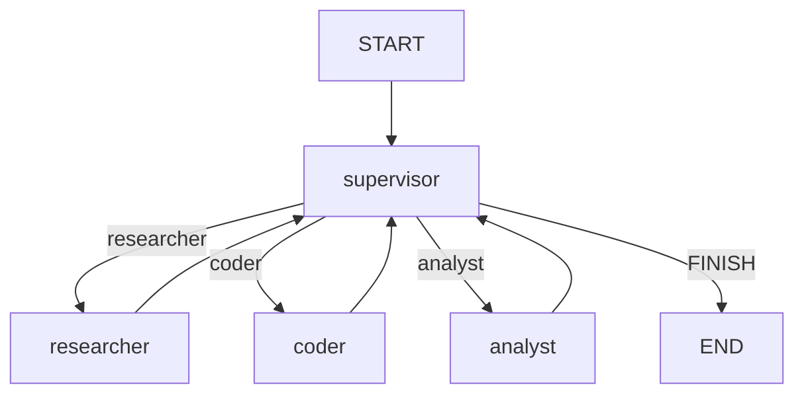

本記事は [LangChain公式ブログ: LangGraph Multi-Agent Workflows](https://blog.langchain.dev/langgraph-multi-agent-workflows)（2024年1月23日公開）の解説記事です。

## ブログ概要（Summary）

LangChainチームは2024年1月、LangGraphを用いたマルチエージェントシステムの設計パターンを3種類に分類したブログ記事を公開した。著者らはマルチエージェントシステムを「言語モデルで駆動される複数の独立したアクターが特定の方法で接続されたシステム」と定義し、エージェントワークフローをラベル付き有向グラフとして形式化している。独立したエージェントノードがステートマシンの状態、エージェント間の接続が遷移行列として表現される。

この記事は [Zenn記事: LangGraph 1.2でステートマシン設計：条件分岐・並列実行・本番運用パターン](https://zenn.dev/0h_n0/articles/68254f67c81a10) の深掘りです。

## 情報源

- **種別**: 企業テックブログ（LangChain公式）
- **URL**: [https://blog.langchain.dev/langgraph-multi-agent-workflows](https://blog.langchain.dev/langgraph-multi-agent-workflows)
- **組織**: LangChain
- **発表日**: 2024年1月23日

## 技術的背景（Technical Background）

単一エージェントでは、利用可能なツール数が増加するにつれてプロンプトが長大化し、性能が低下する問題がある。ブログによると、「専門化されたエージェントは、数十のツールから選択する汎用エージェントよりも優れた性能を示す」とされている。

マルチエージェント設計の動機は以下の3点に集約される：
1. **専門化による性能向上**: 各エージェントが限定されたツールセットに集中できる
2. **モジュラー開発**: 個別のプロンプト・モデル・ツールセットを独立して最適化
3. **評価の分離**: システム全体を再テストせずに個別エージェントを評価・改善可能

## 3つのマルチエージェントパターン

### パターン1: Multi-Agent Collaboration（協調型）

複数のエージェントが**統一されたメッセージスクラッチパッド**を共有し、すべての中間ステップが全エージェントから可視となるパターンである。

**LangGraph 1.2での実装**:

```python
from langgraph.graph import StateGraph, START, END
from typing import Annotated
from langgraph.graph.message import add_messages

class CollaborationState(BaseModel):
    messages: Annotated[list, add_messages] = Field(default_factory=list)
    current_agent: str = "researcher"

def researcher(state: CollaborationState) -> dict:
    """リサーチエージェント: 情報収集を担当"""
    response = llm_with_search_tools.invoke(state.messages)
    return {"messages": [response], "current_agent": "writer"}

def writer(state: CollaborationState) -> dict:
    """ライターエージェント: 文章生成を担当"""
    response = llm_with_writing_tools.invoke(state.messages)
    return {"messages": [response], "current_agent": "reviewer"}

def reviewer(state: CollaborationState) -> dict:
    """レビューエージェント: 品質チェックを担当"""
    response = llm_with_critique_tools.invoke(state.messages)
    return {"messages": [response]}

builder = StateGraph(CollaborationState)
builder.add_node("researcher", researcher)
builder.add_node("writer", writer)
builder.add_node("reviewer", reviewer)

builder.add_edge(START, "researcher")
builder.add_edge("researcher", "writer")
builder.add_edge("writer", "reviewer")
builder.add_edge("reviewer", END)
```

**特徴**: 全エージェントがmessages履歴全体を参照できるため、文脈の共有が容易。一方で、メッセージ数の増加に伴いコンテキスト長が膨張するリスクがある。

### パターン2: Agent Supervisor（監督者型）

中央の**スーパーバイザーエージェント**がタスクを専門エージェントにルーティングし、各エージェントは独立したスクラッチパッドを持つパターンである。スーパーバイザーが最終応答を統合する。

**LangGraph 1.2での実装**:

```python
def supervisor(state: SupervisorState) -> dict:
    """スーパーバイザー: タスク振り分けと結果統合"""
    response = llm.invoke([
        SystemMessage(content="以下のエージェントにタスクを委譲してください: researcher, coder, analyst"),
        *state.messages
    ])
    next_agent = parse_delegation(response)
    return {"next": next_agent, "messages": [response]}

def route_to_agent(state: SupervisorState) -> str:
    """スーパーバイザーの判断に基づきルーティング"""
    if state.next == "FINISH":
        return END
    return state.next

builder = StateGraph(SupervisorState)
builder.add_node("supervisor", supervisor)
builder.add_node("researcher", researcher_agent)
builder.add_node("coder", coder_agent)
builder.add_node("analyst", analyst_agent)

builder.add_edge(START, "supervisor")
builder.add_conditional_edges("supervisor", route_to_agent)
builder.add_edge("researcher", "supervisor")
builder.add_edge("coder", "supervisor")
builder.add_edge("analyst", "supervisor")
```



**特徴**: スーパーバイザーがボトルネックになるリスクがあるが、タスクの進捗管理と最終品質の統制が容易。LangGraph 1.2の`add_conditional_edges`による条件分岐で自然に実装できる。

### パターン3: Hierarchical Agent Teams（階層型）

複数のサブグラフ（チーム）を構成し、上位のスーパーバイザーがチーム単位で委譲するパターンである。各チーム内にもローカルスーパーバイザーが存在し、再帰的な階層構造を形成する。

**LangGraph 1.2での実装（サブグラフ活用）**:

```python
# チーム1: リサーチチーム（サブグラフ）
research_builder = StateGraph(TeamState)
research_builder.add_node("search_agent", search_agent)
research_builder.add_node("summarize_agent", summarize_agent)
research_builder.add_node("team_lead", research_team_lead)
research_builder.add_edge(START, "team_lead")
research_builder.add_conditional_edges("team_lead", route_research_task)
research_team = research_builder.compile()

# チーム2: 開発チーム（サブグラフ）
dev_builder = StateGraph(TeamState)
dev_builder.add_node("coder", coder_agent)
dev_builder.add_node("tester", tester_agent)
dev_builder.add_node("team_lead", dev_team_lead)
dev_builder.add_edge(START, "team_lead")
dev_builder.add_conditional_edges("team_lead", route_dev_task)
dev_team = dev_builder.compile()

# トップレベル: チーム間オーケストレーション
top_builder = StateGraph(OrchestratorState)
top_builder.add_node("orchestrator", top_level_supervisor)
top_builder.add_node("research_team", research_team_node)
top_builder.add_node("dev_team", dev_team_node)

top_builder.add_edge(START, "orchestrator")
top_builder.add_conditional_edges("orchestrator", route_to_team)
top_builder.add_edge("research_team", "orchestrator")
top_builder.add_edge("dev_team", "orchestrator")
```

**特徴**: 大規模組織のチーム構造をそのままグラフ構造に反映できる。各サブグラフが独立してテスト・デプロイ可能であり、チーム間の責任分界が明確。

## 実装アーキテクチャ（Architecture）

ブログで強調されている設計原則は以下の通り：

| 観点 | Collaboration | Supervisor | Hierarchical |
|------|--------------|-----------|-------------|
| 通信方式 | 共有メッセージ | ハブ&スポーク | 階層的委譲 |
| スケーラビリティ | 低（全履歴共有） | 中（中央ボトルネック） | 高（チーム分割） |
| デバッグ容易性 | 高（全ステップ可視） | 中 | 低（深い階層） |
| 適用規模 | 2-3エージェント | 3-10エージェント | 10+エージェント |
| LangGraph機能 | add_edge | add_conditional_edges | サブグラフ |

ブログではLangGraphの差別化ポイントとして「明示的なグラフベースの制御フロー」を挙げており、AutoGen（会話モデル）やCrewAI（高レベル抽象化）との違いを「低レベルの制御可能性」にあるとしている。

## パフォーマンス最適化（Performance）

ブログ内では定量的なベンチマーク結果は示されていないが、以下の設計指針が推奨されている：

- **専門化**: 各エージェントのツール数を5-7個以下に制限し、プロンプト長を短縮
- **スクラッチパッド分離**: Supervisorパターンでは各エージェントが独立したメッセージ空間を持ち、不要な文脈を排除
- **早期終了**: スーパーバイザーが「十分な回答が得られた」と判断した時点で即座にFINISHを返す

## 運用での学び（Production Lessons）

ブログおよびLangGraphコミュニティから得られる本番運用の知見：

1. **モデル選択の分離**: スーパーバイザーには高性能モデル（Opus/Sonnet）、ワーカーには軽量モデル（Haiku）を割り当てることでコスト最適化
2. **タイムアウト設計**: 階層型では各チームにタイムアウトを設定し、特定チームの遅延が全体をブロックしないようにする
3. **フォールバック**: サブグラフの失敗時に親グラフのスーパーバイザーが代替戦略を選択するエラーハンドリング
4. **LangSmith統合**: ノードごとの実行トレースにより、どのエージェントがボトルネックかを可視化

## 学術研究との関連（Academic Connection）

LangChainが提示する3パターンは以下の学術的枠組みに対応する：

- **Collaboration**: Blackboard System（Nii, 1986）— 共有知識ベースへの書き込みによる協調
- **Supervisor**: Hierarchical Task Network（Erol et al., 1994）— タスク分解と委譲
- **Hierarchical Teams**: Organization Theory in MAS（Horling & Lesser, 2004）— エージェント組織の構造化

ReAct（Yao et al., 2022）は各エージェントノード内部の動作ループとして機能し、Anthropicの5パターン（特にOrchestrator-Workers）はSupervisorパターンの拡張として位置づけられる。

## まとめと実践への示唆

LangChainのブログは、マルチエージェント設計を「協調型」「監督者型」「階層型」の3パターンに体系化し、LangGraphのStateGraph APIで直接実装可能であることを示した。

実践的には、**2-3エージェントの小さな協調型から始め**、スケールに応じてSupervisorパターンへ移行し、10エージェントを超える場合に階層型を採用するのが推奨される。LangGraph 1.2のサブグラフ機能とSend APIの組み合わせにより、これらのパターン間の移行がコードレベルで段階的に行える。

## Production Deployment Guide

### AWS実装パターン（コスト最適化重視）

マルチエージェントシステムのAWSデプロイ構成を示す。

**トラフィック量別の推奨構成**:

| 規模 | 月間リクエスト | 推奨構成 | 月額コスト | 主要サービス |
|------|--------------|---------|-----------|------------|
| **Small** | ~3,000 | Serverless | $120-300 | Lambda + Step Functions + Bedrock |
| **Medium** | ~30,000 | Hybrid | $600-1,500 | ECS Fargate + ElastiCache + Bedrock |
| **Large** | 300,000+ | Container | $3,500-8,000 | EKS + Karpenter + Redis Cluster |

**Small構成**: Step Functionsでエージェント間遷移を管理、各エージェントはLambda関数として実装
**Medium構成**: ECS Fargate上のコンテナとしてエージェントを実行、ElastiCacheで状態共有
**Large構成**: EKS上でエージェントPodを動的スケーリング、Redis Clusterでチーム間状態同期

上記は2026年6月時点のAWS ap-northeast-1料金概算。最新は [AWS料金計算ツール](https://calculator.aws/) で確認。

### Terraformインフラコード

```hcl
resource "aws_sfn_state_machine" "multi_agent_supervisor" {
  name     = "multi-agent-supervisor-workflow"
  role_arn = aws_iam_role.step_functions.arn

  definition = jsonencode({
    StartAt = "Supervisor"
    States = {
      Supervisor = {
        Type     = "Task"
        Resource = aws_lambda_function.supervisor.arn
        Next     = "RouteToAgent"
      }
      RouteToAgent = {
        Type = "Choice"
        Choices = [
          { Variable = "$.next_agent", StringEquals = "researcher", Next = "Researcher" },
          { Variable = "$.next_agent", StringEquals = "coder", Next = "Coder" },
          { Variable = "$.next_agent", StringEquals = "FINISH", Next = "Done" }
        ]
        Default = "Supervisor"
      }
      Researcher = {
        Type     = "Task"
        Resource = aws_lambda_function.researcher.arn
        Next     = "Supervisor"
        TimeoutSeconds = 120
      }
      Coder = {
        Type     = "Task"
        Resource = aws_lambda_function.coder.arn
        Next     = "Supervisor"
        TimeoutSeconds = 180
      }
      Done = { Type = "Succeed" }
    }
  })
}

resource "aws_lambda_function" "supervisor" {
  function_name = "agent-supervisor"
  role          = aws_iam_role.agent_lambda.arn
  handler       = "supervisor.handler"
  runtime       = "python3.12"
  timeout       = 60
  memory_size   = 512
  environment {
    variables = {
      MODEL_ID = "anthropic.claude-3-5-sonnet-20241022-v2:0"
    }
  }
}

resource "aws_lambda_function" "researcher" {
  function_name = "agent-researcher"
  role          = aws_iam_role.agent_lambda.arn
  handler       = "researcher.handler"
  runtime       = "python3.12"
  timeout       = 120
  memory_size   = 1024
  environment {
    variables = {
      MODEL_ID = "anthropic.claude-3-5-haiku-20241022-v1:0"
    }
  }
}
```

### コスト最適化チェックリスト

- [ ] Supervisor: Sonnet、Workers: Haiku（モデル使い分け）
- [ ] Step Functions Express: 高頻度ワークフロー向け（80%削減）
- [ ] Lambda Provisioned Concurrency: コールドスタート回避（Supervisor用）
- [ ] エージェント間メッセージ圧縮: 要約ノード挿入で文脈長削減
- [ ] チーム単位のスケーリング: 低負荷チームは0台にスケールダウン
- [ ] AWS Budgets: エージェント別コスト可視化（タグ戦略）

## 参考文献

- **Blog URL**: [https://blog.langchain.dev/langgraph-multi-agent-workflows](https://blog.langchain.dev/langgraph-multi-agent-workflows)
- **LangGraph Docs**: [https://docs.langchain.com/oss/python/langgraph/overview](https://docs.langchain.com/oss/python/langgraph/overview)
- **Related Zenn article**: [https://zenn.dev/0h_n0/articles/68254f67c81a10](https://zenn.dev/0h_n0/articles/68254f67c81a10)
