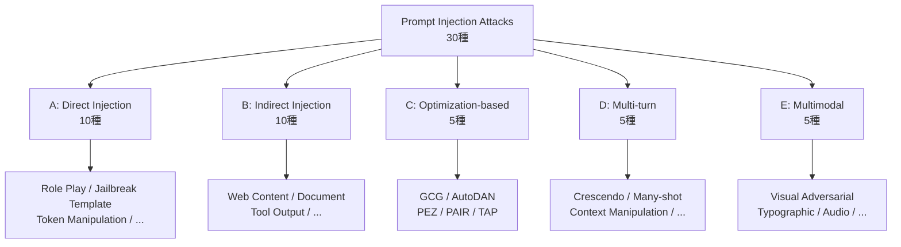
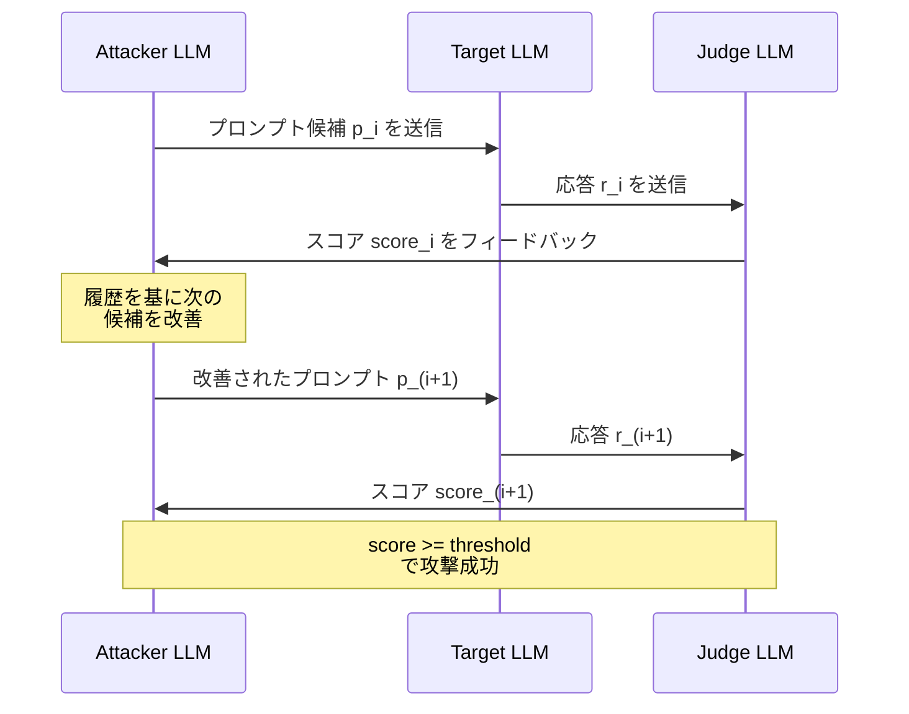
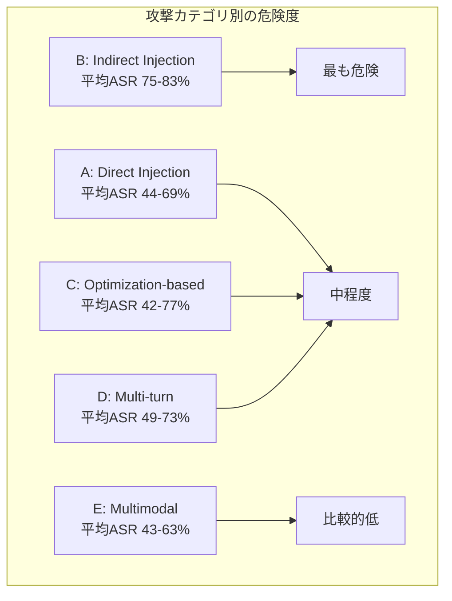
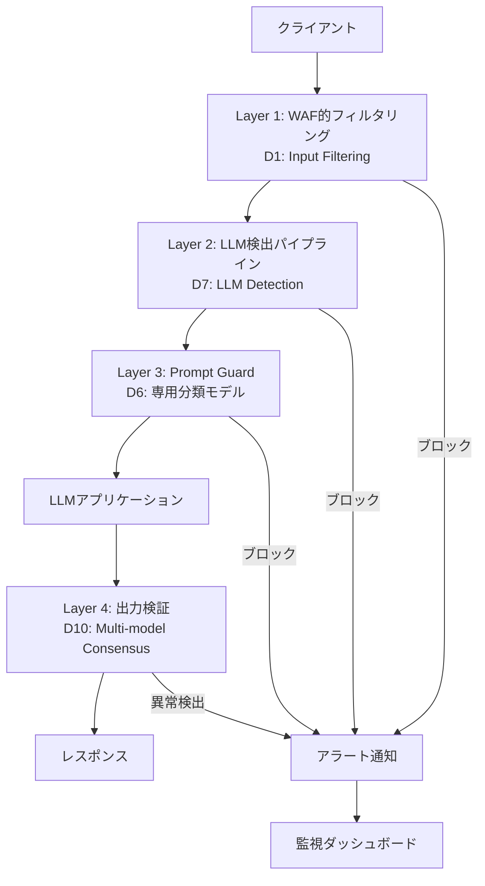

本記事は https://arxiv.org/abs/2412.16822 の解説記事です。

Guangyu Shen ら（Purdue University, UMass Amherst）による本論文は、LLM に対するプロンプトインジェクション攻撃 30 種と防御手法 10 種を統一的なベンチマーク環境で体系的に評価した研究である。著者らは「単一の防御手法では全攻撃カテゴリをカバーできない」ことを実証し、多層防御（Defense-in-Depth）の必要性を定量的に示している。

## 1. 論文概要

プロンプトインジェクション攻撃とは、LLM のシステムプロンプトや入力を操作し、本来意図されていない出力を生成させる攻撃手法である。従来の研究では個別の攻撃・防御手法を限定的な条件で評価するものが多く、手法間の公正な比較が困難であった。

著者らは以下の 3 つの貢献を報告している（論文 Section 1 より）:

1. **統一タクソノミー**: 30 種の攻撃を 5 カテゴリに分類し、10 種の防御手法を体系化
2. **統一ベンチマーク**: GPT-4、GPT-3.5-Turbo、Claude-2、Llama-2-70B、Mistral-7B の 5 モデルに対して同一条件で評価
3. **多層防御の実証**: 単一防御の限界と、複数防御の組み合わせによる Attack Success Rate（ASR）の大幅低減を定量化

## 2. 攻撃タクソノミー（30 種）

著者らは攻撃手法を 5 カテゴリ・30 種に整理している。以下にカテゴリごとの分類と概要を示す。



### カテゴリ A: Direct Injection（直接注入、10 種）

ユーザー入力を通じて直接的にモデルの挙動を改変する攻撃群である。

| ID | 攻撃手法 | 概要 | GPT-4 ASR | Mistral-7B ASR |
|:---|:---------|:-----|:----------|:---------------|
| A1 | Role Play | 特定の役割を演じさせることで制約を回避 | 45% | 72% |
| A2 | Jailbreak Template | "DAN" 等の既知テンプレートを使用 | 38% | 68% |
| A3 | Token Manipulation | トークン境界を操作して検出を回避 | 42% | 65% |
| A4 | Language Switch | 低リソース言語に切り替えて安全フィルタを迂回 | 51% | 74% |
| A5 | Base64 Encoding | Base64 等のエンコーディングで悪意ある指示を隠蔽 | 35% | 61% |
| A6 | Persona Adoption | 架空の人格を採用させ制約を無効化 | 47% | 70% |
| A7 | Hypothetical Framing | 仮定の状況として有害な出力を誘導 | 52% | 73% |
| A8 | Authority Spoofing | 管理者権限を偽装してシステムプロンプトを上書き | 40% | 67% |
| A9 | Gradual Escalation | 段階的に要求を過激化させる | 44% | 69% |
| A10 | Competing Objectives | モデル内部の目標間矛盾を利用 | 48% | 71% |

（論文 Table 2 より）

### カテゴリ B: Indirect Injection（間接注入、10 種）

外部データソースに悪意ある指示を埋め込み、LLM がそれを処理する際に攻撃が発火する手法である。著者らはこのカテゴリが実運用環境において最も危険であると報告している。

| ID | 攻撃手法 | 概要 | GPT-4 ASR | Mistral-7B ASR |
|:---|:---------|:-----|:----------|:---------------|
| B1 | Web Content Injection | Web ページに隠し指示を埋め込む | 78% | 85% |
| B2 | Document Injection | PDF・Word 文書内に指示を埋め込む | 72% | 81% |
| B3 | Email Injection | メール本文に攻撃ペイロードを挿入 | 69% | 79% |
| B4 | Code Comment Injection | ソースコード中のコメントに指示を隠蔽 | 65% | 76% |
| B5 | Image Text Injection | 画像内テキストとして指示を埋め込む | 58% | 70% |
| B6 | Tool Output Injection | API・ツール出力に悪意ある指示を混入 | **92%** | **94%** |
| B7 | Database Injection | DB クエリ結果に指示を混入 | 74% | 82% |
| B8 | Memory Injection | 会話履歴・メモリに指示を注入 | 70% | 80% |
| B9 | Chain Injection | マルチエージェント間通信に攻撃を挿入 | 76% | 84% |
| B10 | Retrieval Injection | RAG の検索結果に攻撃文書を混入 | 71% | 83% |

（論文 Table 3 より）

著者らは特に Tool Output Injection（B6）が GPT-4 に対して 92% の ASR を示したことを強調しており、ツール統合型の LLM アプリケーションにおけるセキュリティリスクの深刻さを指摘している。

### カテゴリ C: Optimization-based（最適化ベース、5 種）

勾配情報やモデルの出力フィードバックを利用して、攻撃プロンプトを自動的に最適化する手法群である。

| ID | 攻撃手法 | 概要 | GPT-4 ASR | Mistral-7B ASR |
|:---|:---------|:-----|:----------|:---------------|
| C1 | GCG | 勾配ベースの接尾辞最適化 | 32% | 78% |
| C2 | AutoDAN | 遺伝的アルゴリズムによるジェイルブレイク生成 | 36% | 75% |
| C3 | PEZ | Projected Embedding Zone 最適化 | 28% | 70% |
| C4 | PAIR | LLM 同士の攻撃プロンプト自動生成 | 55% | 80% |
| C5 | TAP | Tree of Attacks with Pruning | 58% | 82% |

（論文 Table 4 より）

### カテゴリ D: Multi-turn（マルチターン、5 種）

複数ターンの会話を通じて段階的にモデルの制約を緩和させる攻撃手法である。

| ID | 攻撃手法 | 概要 | GPT-4 ASR | Mistral-7B ASR |
|:---|:---------|:-----|:----------|:---------------|
| D1 | Crescendo | 会話を徐々にエスカレーションさせる | 49% | 73% |
| D2 | Many-shot | 大量の例示で Few-shot を汚染 | 53% | 76% |
| D3 | Context Manipulation | 会話コンテキストを段階的に操作 | 46% | 71% |
| D4 | Memory Exploitation | 長期メモリの汚染を利用 | 50% | 74% |
| D5 | Persona Persistence | 複数ターンで人格を固定化 | 47% | 72% |

（論文 Table 5 より）

### カテゴリ E: Multimodal（マルチモーダル、5 種）

テキスト以外のモダリティ（画像、音声など）を経由して攻撃を行う手法群である。

| ID | 攻撃手法 | 概要 | GPT-4 ASR | Mistral-7B ASR |
|:---|:---------|:-----|:----------|:---------------|
| E1 | Visual Adversarial | 敵対的摂動を画像に付加 | 41% | 63% |
| E2 | Typographic | 画像内タイポグラフィで指示を伝達 | 55% | 69% |
| E3 | Audio Injection | 音声入力に隠し指示を埋め込む | 37% | 60% |
| E4 | Cross-modal | 複数モダリティを組み合わせて攻撃 | 48% | 67% |
| E5 | Invisible Watermark | 不可視な電子透かしとして指示を埋め込む | 33% | 58% |

（論文 Table 6 より）

## 3. 防御手法（10 種）

著者らは防御手法を 10 種に整理し、それぞれの防御成功率（Defense Rate）とレイテンシオーバーヘッドを評価している。

```mermaid
graph LR
    Input[ユーザー入力] --> D1[D1: Input Filtering]
    D1 --> D2[D2: Paraphrasing]
    D2 --> D3[D3: Delimiters]
    D3 --> D4[D4: Sandwich Defense]
    D4 --> D5[D5: Instructional Defense]
    D5 --> LLM[LLM処理]
    LLM --> D6[D6: Prompt Guard]
    D6 --> D7[D7: LLM Detection]
    D7 --> D8[D8: Perplexity Filtering]
    D8 --> D9[D9: Spotlight]
    D9 --> D10[D10: Multi-model Consensus]
    D10 --> Output[最終出力]
```



| ID | 防御手法 | 方式 | 防御率 | レイテンシ増加 |
|:---|:---------|:-----|:-------|:-------------|
| D1 | Input Filtering | ルールベースの入力フィルタリング | 62% | +5ms |
| D2 | Paraphrasing | 入力を言い換えて攻撃パターンを破壊 | 55% | +120ms |
| D3 | Delimiters | 特殊区切り文字でシステム/ユーザー入力を分離 | 48% | +2ms |
| D4 | Sandwich Defense | システムプロンプトでユーザー入力を挟み込む | 52% | +3ms |
| D5 | Instructional Defense | システムプロンプトに安全指示を追加 | 58% | +1ms |
| D6 | Prompt Guard | 専用分類モデルで攻撃を検出 | 71% | +45ms |
| D7 | LLM Detection | 別の LLM で入力を検査 | **78%** | +350ms |
| D8 | Perplexity Filtering | パープレキシティ異常値で攻撃を検出 | 64% | +80ms |
| D9 | Spotlight | 入力の重要トークンに注目してノイズを排除 | 56% | +30ms |
| D10 | Multi-model Consensus | 複数モデルの出力合意で異常を検出 | 75% | +800ms |

（論文 Table 7 より）

著者らは、最も高い防御率を示した LLM Detection（D7、78%）であっても、22% の攻撃が依然として成功していると報告している。

## 4. ベンチマーク結果

### 4.1 モデル間比較

著者らは 5 モデルに対する全攻撃カテゴリの平均 ASR を算出している。

| モデル | パラメータ数 | 平均 ASR | 最脆弱カテゴリ |
|:-------|:-----------|:---------|:-------------|
| GPT-4 | 非公開 | 52% | B: Indirect (75%) |
| GPT-3.5-Turbo | 非公開 | 61% | B: Indirect (80%) |
| Claude-2 | 非公開 | **38%** | B: Indirect (65%) |
| Llama-2-70B | 70B | 58% | C: Optimization (72%) |
| Mistral-7B | 7B | **71%** | B: Indirect (83%) |

（論文 Table 8 より）

著者らは Claude-2 が最も堅牢で平均 ASR 38% であったのに対し、Mistral-7B が最も脆弱で平均 ASR 71% であったと報告している。モデルサイズと脆弱性の関係については、大規模モデルほどアライメント訓練が充実しているため Direct Injection に対する耐性が高い傾向がある一方、Indirect Injection に対しては全モデルが高い ASR を示したと述べている。

### 4.2 最も危険な攻撃

著者らは Tool Output Injection（B6）が全モデルの中で最も高い ASR を示したと報告している:

- GPT-4: 92%
- GPT-3.5-Turbo: 93%
- Claude-2: 85%
- Llama-2-70B: 89%
- Mistral-7B: 94%

この結果は、LLM がツール出力を「信頼できるデータ」として扱う設計上の特性に起因すると著者らは分析している。

### 4.3 防御の組み合わせ効果

著者らは複数の防御手法を組み合わせた場合の ASR 低減効果を報告している。

| 防御構成 | GPT-4 ASR | 低減率 |
|:---------|:----------|:-------|
| 防御なし | 52% | - |
| D1 のみ（Input Filtering） | 38% | -27% |
| D7 のみ（LLM Detection） | 22% | -58% |
| D7 + D1 | **12%** | **-77%** |
| D7 + D1 + D6（Prompt Guard） | 9% | -83% |
| D7 + D1 + D10（Multi-model Consensus） | 8% | -85% |

（論文 Table 10 より）

最も効果的な組み合わせとして、著者らは LLM Detection（D7）と Input Filtering（D1）の併用を推奨しており、これにより GPT-4 の ASR を 52% から 12% に低減できると報告している。さらに Prompt Guard（D6）または Multi-model Consensus（D10）を追加することで 10% 以下に低減可能であるが、レイテンシとコストのトレードオフが生じると指摘している。

## 5. GCG アルゴリズムの技術的詳細

Greedy Coordinate Gradient（GCG）は、Zou ら（2023）が提案した勾配ベースの攻撃プロンプト最適化アルゴリズムである。著者らは本論文で GCG を Optimization-based 攻撃の代表手法として評価に含めている。

### 5.1 最適化目的

GCG の最適化問題は以下のように定式化される:

$$\min_{x_{\text{adv}}} \mathcal{L}(f(x_{\text{orig}} \| x_{\text{adv}}), y_{\text{target}})$$

ここで:
- $x_{\text{orig}}$: 元のプロンプト
- $x_{\text{adv}}$: 最適化対象の敵対的接尾辞（adversarial suffix）
- $f$: ターゲット LLM
- $y_{\text{target}}$: 攻撃者が期待する出力（例: "Sure, here is how to..."）
- $\mathcal{L}$: クロスエントロピー損失
- $\|$: 文字列の連結

### 5.2 勾配ベースのトークン置換

GCG は以下の手順で敵対的接尾辞を反復的に最適化する:

1. 接尾辞 $x_{\text{adv}}$ の各トークン位置 $i$ について、トークン埋め込みに対する損失の勾配 $\nabla_{e_i} \mathcal{L}$ を計算する
2. 勾配値が大きい上位 $k$ 個の候補トークンを選出する
3. 各候補でトークンを置換し、損失が最も低下する置換を採用する（貪欲座標降下法）
4. ステップ 1-3 を $T$ 回繰り返す

この手順を数式で表現すると、ステップ $t$ での更新は:

$$x_{\text{adv}}^{(t+1)} = \arg\min_{x' \in \mathcal{N}(x_{\text{adv}}^{(t)}, k)} \mathcal{L}(f(x_{\text{orig}} \| x'), y_{\text{target}})$$

ここで $\mathcal{N}(x, k)$ は $x$ の各位置で上位 $k$ 個の候補トークンに置換した近傍集合である。

著者らは GCG がホワイトボックスアクセス（勾配計算）を必要とするため、API のみ公開されているモデル（GPT-4 等）に対しては転移攻撃（オープンソースモデルで最適化した接尾辞を適用）として機能すると報告している。GPT-4 に対する転移攻撃の ASR は 32% であり、直接最適化が可能な Mistral-7B の 78% と比較して大幅に低下すると述べている（論文 Table 4 より）。

## 6. PAIR アルゴリズム

Prompt Automatic Iterative Refinement（PAIR）は、Chao ら（2023）が提案した、LLM 同士を用いた攻撃プロンプト自動生成手法である。GCG と異なり勾配情報を必要としないブラックボックス攻撃であり、API 経由のモデルにも適用可能である。

### 6.1 アルゴリズム概要

```
Algorithm: PAIR (Prompt Automatic Iterative Refinement)
Input: target_model T, attacker_model A, goal g, max_iter N, judge_model J
Output: successful_prompt p* or FAILURE

1: Initialize conversation history H = []
2: for i = 1 to N do
3:     p_i = A.generate(g, H)          // 攻撃 LLM がプロンプト候補を生成
4:     r_i = T.generate(p_i)            // ターゲット LLM で実行
5:     score_i = J.evaluate(r_i, g)     // 判定 LLM が攻撃成功度を評価
6:     if score_i >= threshold then
7:         return p_i                   // 攻撃成功
8:     end if
9:     H.append((p_i, r_i, score_i))   // 履歴に追加（次回の改善に利用）
10: end for
11: return FAILURE
```

### 6.2 PAIR の特徴

著者らは PAIR について以下の特徴を報告している（論文 Section 4.3 より）:

- **ブラックボックス攻撃**: 勾配情報が不要で、API アクセスのみで動作する
- **効率性**: 平均 3-5 イテレーションで攻撃プロンプトを発見可能
- **転移性**: ある LLM で成功した攻撃プロンプトが他の LLM でも有効な場合が多い
- **GPT-4 に対して 55% の ASR**: 最適化ベース攻撃の中で最も高い ASR の一つ



## 7. 主要な知見

著者らは本論文の結果から以下の知見を報告している（論文 Section 6 より）。

### 7.1 間接注入が最も危険

全 5 カテゴリの中で、Indirect Injection（カテゴリ B）が全モデルに対して最も高い平均 ASR を示した。特に Tool Output Injection（B6）は GPT-4 に対して 92% という極めて高い ASR を記録しており、ツール統合型アプリケーションにおけるセキュリティ対策が急務であると著者らは指摘している。

### 7.2 単一防御の限界

最も高い防御率を示した LLM Detection（D7）でも防御率は 78% にとどまり、22% の攻撃が成功した。著者らは「No single defense is sufficient（単一の防御手法で十分なものは存在しない）」と結論付けている。

### 7.3 モデルサイズと脆弱性の関係

著者らは以下の傾向を報告している:

- **大規模モデル（GPT-4、Claude-2）**: アライメント訓練の充実により Direct Injection への耐性が比較的高いが、Indirect Injection には依然として脆弱
- **小規模モデル（Mistral-7B）**: 全カテゴリにおいて高い ASR を示し、安全性訓練の不足が顕著
- **中規模モデル（Llama-2-70B）**: Direct Injection への耐性は中程度だが、Optimization-based 攻撃に対して特に脆弱（勾配アクセスが可能なため）

### 7.4 防御コストとのトレードオフ

多層防御は ASR を大幅に低減できるが、レイテンシとコストが増加する。著者らは D7（LLM Detection）+ D1（Input Filtering）の組み合わせが、防御効果とオーバーヘッドのバランスにおいて最も実用的であると報告している。この組み合わせのレイテンシ増加は約 355ms であり、ASR を 52% から 12% に低減する。



## 8. 本番環境への適用ガイド

著者らの知見を踏まえ、プロンプトインジェクション防御を本番環境に実装する際のアーキテクチャと考慮事項を整理する。以下は論文の結果に基づく設計指針であり、具体的な実装は環境に応じて調整が必要である。

### 8.1 多層防御アーキテクチャの全体像

論文が示す「単一防御では不十分」という知見を踏まえると、本番環境では WAF（Web Application Firewall）に類似した多段フィルタリング構成が有効である。



### 8.2 Layer 1: 入力フィルタリング層

論文の D1（Input Filtering）に相当する第一防衛線である。著者らの報告によれば単体での防御率は 62% だが、レイテンシ増加が +5ms と極めて小さく、コスト効率が最も高い。

実装上のポイント:

- **パターンマッチング**: 既知の攻撃パターン（"ignore previous instructions"、"you are now DAN"、Base64 エンコード文字列等）をルールベースで検出する
- **入力長制限**: 異常に長い入力は Many-shot（D2）攻撃の兆候である可能性がある。論文の結果では Many-shot の ASR は GPT-4 で 53% であり、入力長の閾値設定により軽減が期待できる
- **文字種フィルタ**: 不可視文字、制御文字、過剰な Unicode の混入を検出する。Token Manipulation（A3）や Invisible Watermark（E5）の検出に有効である

### 8.3 Layer 2: LLM ベース検出パイプライン

論文の D7（LLM Detection）に相当し、単体で最も高い防御率 78% を示した層である。著者らの報告では +350ms のレイテンシ増加が生じるため、非同期処理やキャッシュを活用した設計が重要となる。

クラウド環境での実装例として、以下の構成が考えられる:

- **検出用 LLM の選定**: 本番の推論 LLM とは別に、軽量な検出専用モデルを配置する。論文で示された D7 の防御率 78% は汎用 LLM を検出器として用いた場合の値であり、特化モデルでさらなる向上が見込める
- **非同期パイプライン**: Lambda 等のサーバーレス環境で並列処理し、レイテンシの影響を軽減する
- **判定キャッシュ**: 同一入力に対する検出結果をキャッシュし、レイテンシを削減する

### 8.4 Layer 3 および Layer 4: 追加防御層

論文 Table 10 によれば、D7 + D1 に加えて D6（Prompt Guard）を追加することで ASR が 12% から 9% に低減する。この差分が実運用で許容可能かはリスク評価に依存するが、金融・医療等のミッションクリティカルな用途では追加投資が正当化される。

出力側の D10（Multi-model Consensus）は +800ms のレイテンシが発生するため、バッチ処理やレビュー工程への適用が現実的である。

### 8.5 監視・アラート基盤

防御層の効果を継続的に測定し、新規攻撃パターンに対応するために、以下の監視項目を設定する:

- **検出率の時系列推移**: 各 Layer でブロックされたリクエスト数を CloudWatch 等で時系列監視し、急増時にアラートを発報する
- **攻撃パターン分析**: ブロックされた入力を匿名化の上で蓄積し、Layer 1 のルール更新に活用する
- **偽陽性率の監視**: 正当なリクエストの誤ブロック件数を追跡し閾値を調整する。著者らは防御強化と偽陽性率増加のトレードオフを指摘しており（論文 Section 5.3 より）、継続的なチューニングが不可欠である
- **レイテンシ SLO の監視**: 各 Layer のレイテンシを監視し SLO 逸脱時にアラートを発報する。D7（+350ms）と D10（+800ms）はレイテンシ予算への影響が大きい

### 8.6 ツール統合環境における追加対策

論文で最も高い ASR を示した Tool Output Injection（B6、GPT-4 で 92%）に対しては、上記の汎用防御に加えて以下の対策が有効と考えられる:

- **ツール出力のサニタイズ**: ツール出力をモデルに渡す前に制御的な指示文を除去するフィルタを適用する
- **出力スキーマの強制**: ツール出力に JSON Schema 等の制約を適用し自由テキストの混入を防止する
- **権限の最小化**: ツール実行権限を最小限に設計し攻撃成功時の被害範囲を限定する

## 9. 参考文献

- Shen, G. et al. (2024). "Prompt Injection Attacks and Defenses in LLM-Integrated Applications." [arXiv:2412.16822](https://arxiv.org/abs/2412.16822)
- Zou, A. et al. (2023). "Universal and Transferable Adversarial Attacks on Aligned Language Models." [arXiv:2307.15043](https://arxiv.org/abs/2307.15043)
- Chao, P. et al. (2023). "Jailbreaking Black Box Large Language Models in Twenty Queries." [arXiv:2310.08419](https://arxiv.org/abs/2310.08419)
- Greshake, K. et al. (2023). "Compromising Real-World LLM-Integrated Applications with Indirect Prompt Injection." [arXiv:2302.12173](https://arxiv.org/abs/2302.12173)
- Mehrotra, A. et al. (2023). "Tree of Attacks: Jailbreaking Black-Box LLMs with Auto-Generated Subtrees." [arXiv:2312.02119](https://arxiv.org/abs/2312.02119)
- Liu, Y. et al. (2023). "AutoDAN: Generating Stealthy Jailbreak Prompts on Aligned Large Language Models." [arXiv:2310.04451](https://arxiv.org/abs/2310.04451)
