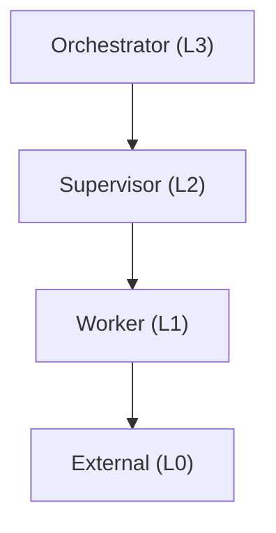
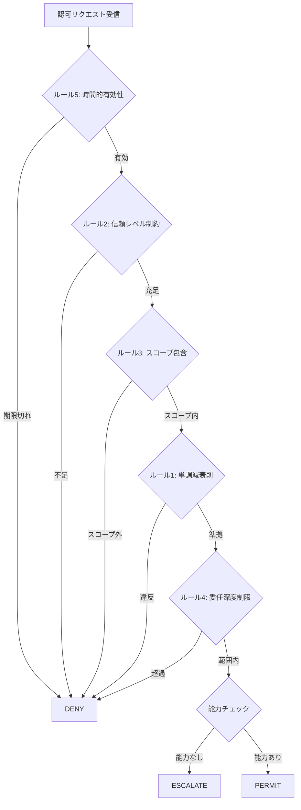
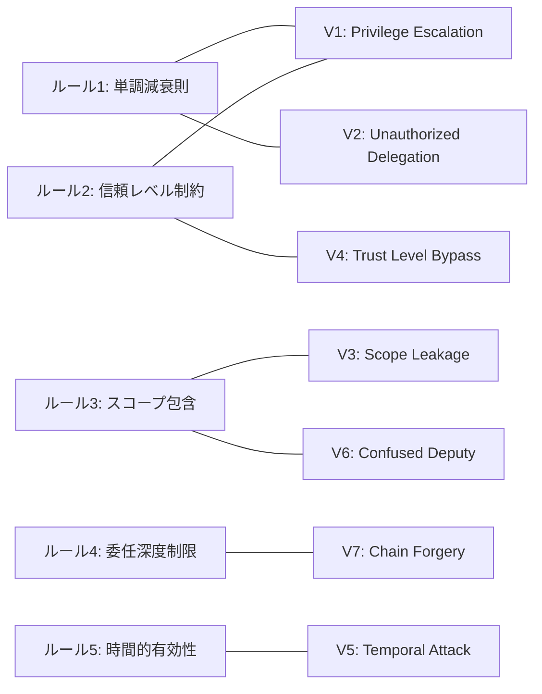
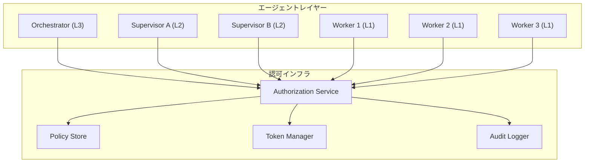

本記事は https://arxiv.org/abs/2503.10918 の解説記事です。

## 論文概要

LLMベースのマルチエージェントシステム（MAS）が実世界のタスク自動化に広く活用される一方で、エージェント間の認可（authorization）制御は依然として体系化されていない。著者らは、マルチエージェントシステムにおける認可を形式的に定義する**Multi-Agent Capability Model（MAC-Model）**と、認可違反を体系的に検出するためのベンチマーク**MAS-AuthBench**を提案している。

本論文の主要な貢献は以下の3点である。

1. **MAC-Model**: エージェントの能力・信頼レベル・スコープを形式的に定義し、5つの認可ルールを策定
2. **7種の認可違反パターン**: Privilege EscalationからChain Forgeryまで体系的に分類
3. **MAS-AuthBench**: 500シナリオからなるベンチマークで、既存フレームワークの脆弱性を定量的に評価

著者らは、MAC-Modelが既存フレームワーク（LangChain、AutoGPT等）と比較して認可準拠率（ACR）94%を達成したと報告している。

## 背景と動機

### 既存フレームワークの認可上の課題

現在主流のマルチエージェントフレームワークであるLangChain、AutoGPT、MetaGPT、CrewAI、CAMELなどは、タスクの分解・実行には優れた機能を持つが、エージェント間の認可制御については十分な仕組みを備えていない。

著者らは既存フレームワークにおける具体的な課題として以下を指摘している。

- **認可モデルの欠如**: エージェントがどのリソースにアクセスできるかの形式的定義が存在しない
- **信頼レベルの未定義**: エージェント間の信頼関係が暗黙的で、権限昇格が検出されない
- **委任の制御不足**: あるエージェントが別のエージェントにタスクを委任する際の権限伝搬が管理されていない
- **スコープの境界不明確**: エージェントの操作範囲が明確に定義されておらず、スコープ外のリソースへのアクセスが防げない

これらの課題はMASが本番環境で利用される際に深刻なセキュリティリスクとなる。

### 従来の認可モデルとの違い

従来のアクセス制御モデル（RBAC、ABAC等）は単一システム内のユーザ・ロール・リソースの関係を定義するものであり、エージェントの自律的な判断・動的な委任・信頼レベルの階層的減衰・チェーン全体の権限伝搬追跡といったMAS固有の要件を満たさない。

## MAC-Model: 形式的定義

### 基本構成要素

MAC-Modelは以下の3つのコア概念で構成される。

**Agent（エージェント）** は4つ組で定義される：

$$\text{Agent} = (id, \text{capabilities}, \text{trust\_level}, \text{scope})$$

ここで $id$ はエージェントの一意識別子、$\text{capabilities}$ はそのエージェントが実行可能な操作の集合、$\text{trust\_level}$ は信頼階層における位置、$\text{scope}$ はアクセス可能なリソースの範囲を表す。

**Capability（能力）** は3つ組で定義される：

$$\text{Capability} = (\text{action}, \text{resource}, \text{condition})$$

$\text{action}$ は実行する操作（read, write, execute等）、$\text{resource}$ は対象リソース、$\text{condition}$ は操作が許可される前提条件を表す。

**Authorization（認可判定）** は以下の写像で定義される：

$$\text{Authorization}: (\text{requester}, \text{action}, \text{resource}) \rightarrow \{\text{PERMIT}, \text{DENY}, \text{ESCALATE}\}$$

$\text{PERMIT}$ は要求の許可、$\text{DENY}$ は拒否、$\text{ESCALATE}$ は上位エージェントへの判断委譲を意味する。

### 信頼階層（Trust Hierarchy）

MAC-Modelでは4段階の信頼レベルを定義している。



各レベルの役割は以下の通りである。

| レベル | 名称 | 役割 |
|--------|------|------|
| L3 | Orchestrator | システム全体の制御、最上位の認可権限を持つ |
| L2 | Supervisor | タスクグループの監督、Worker への委任権限を持つ |
| L1 | Worker | 個別タスクの実行、限定されたリソースアクセス |
| L0 | External | 外部エージェント、最小限の権限のみ |

### 5つの認可ルール

MAC-Modelは以下の5つのルールで認可判定を行う。

**ルール1: 単調減衰則（Monotone Attenuation）**

委任チェーンにおいて、後続のエージェントのスコープは先行エージェントのスコープの部分集合でなければならない。

$$S_{n+1} \subseteq S_n$$

ここで $S_n$ はチェーンの $n$ 番目のエージェントに付与されたスコープである。この制約により、委任を繰り返すことで権限が拡大する（権限昇格）ことが原理的に防止される。

**ルール2: 信頼レベル制約（Trust Level Constraint）**

エージェント $a$ がリソース $r$ にアクセスするには、$a$ の信頼レベルがリソースに要求される最低信頼レベル以上でなければならない。

$$\text{trust\_level}(a) \geq \text{min\_trust}(r)$$

**ルール3: リソーススコープ包含（Resource Scope Containment）**

エージェントが操作するリソースは、そのエージェントに割り当てられたスコープ内に含まれなければならない。

$$r \in \text{scope}(a)$$

**ルール4: 委任深度制限（Delegation Depth Bound）**

委任チェーンの長さには上限 $D_{\max}$ が存在し、これを超える委任は拒否される。

$$\text{depth}(\text{chain}) \leq D_{\max}$$

この制約は、深いチェーンによる責任の所在の不明確化や、チェーン偽造攻撃（V7）を防止する目的を持つ。

**ルール5: 時間的有効性（Temporal Validity）**

認可トークンには有効期限 $t_{\text{expire}}$ が設定され、現在時刻 $t_{\text{now}}$ がこれを超えた場合は認可が無効となる。

$$t_{\text{now}} \leq t_{\text{expire}}$$

### 認可判定フロー

以下のフローチャートは、MAC-Modelにおける認可判定の流れを示す。



## 7種の認可違反パターン

著者らはMASにおける認可違反を7つのパターンに体系的に分類している。この分類はベンチマークMAS-AuthBenchのシナリオ設計の基盤となっている。

### V1: Privilege Escalation（権限昇格）

エージェントが自身の信頼レベルを超える権限を不正に取得するパターン。例えば、L1（Worker）のエージェントがL3（Orchestrator）レベルの操作を実行しようとするケースである。

著者らは、LangChainにおいてツールチェーンの実行時にエージェントの信頼レベル検証が行われないことがこの違反の主要な原因であると報告している。

### V2: Unauthorized Delegation（不正委任）

エージェントが自身の持たない権限を別のエージェントに委任するパターン。単調減衰則（ルール1）に違反する。

### V3: Scope Leakage（スコープ漏洩）

エージェントが許可されたスコープ外のリソースにアクセスするパターン。ルール3のリソーススコープ包含に違反する。

### V4: Trust Level Bypass（信頼レベルバイパス）

認可判定において信頼レベルの検証を迂回するパターン。中間エージェントを経由して信頼チェーンを偽装する手法が含まれる。

### V5: Temporal Attack（時間的攻撃）

有効期限切れのトークンやセッションを再利用するパターン。ルール5の時間的有効性に違反する。

### V6: Confused Deputy（混乱した代理人）

正当な権限を持つエージェントを騙して、攻撃者の意図する操作を実行させるパターン。従来のセキュリティ分野でも知られる攻撃手法のMAS版である。

### V7: Chain Forgery（チェーン偽造）

委任チェーン自体を偽造し、存在しないまたは改ざんされた委任パスを通じて認可を得るパターン。ルール4の委任深度制限とチェーンの完全性検証で防止される。

以下の図は7種のパターンとMAC-Modelのルールとの対応関係を示す。



## MAS-AuthBench: ベンチマーク設計

### ベンチマークの構成

MAS-AuthBenchは500のテストシナリオで構成され、7種の違反パターンをカバーしている。著者らは、各シナリオが実際のMASデプロイメントで発生しうる現実的な状況を再現するよう設計したと報告している。

評価指標は以下の3つである。

- **ACR（Authorization Compliance Rate）**: 認可ルールへの準拠率
- **FNR（False Negative Rate）**: 違反を見逃す割合
- **VDR（Violation Detection Rate）**: 違反パターンの検出率

### フレームワーク比較結果

著者らは、主要なマルチエージェントフレームワークとMAC-Modelの比較評価を行い、以下の結果を報告している。

| フレームワーク | ACR | FNR | VDR |
|---|---|---|---|
| LangChain | 62% | 38% | 41% |
| AutoGPT | 58% | 42% | 35% |
| MetaGPT | 71% | 29% | 52% |
| CrewAI | 67% | 33% | 45% |
| CAMEL | 69% | 31% | 48% |
| **MAC-Model** | **94%** | **6%** | **91%** |

著者らの報告によれば、MAC-Modelは既存フレームワークと比較してACRで23〜36ポイント、VDRで39〜56ポイントの改善を達成している。

### 違反パターン別検出率

MAC-Modelの各違反パターンに対する検出率は以下の通りである。

| パターン | 検出率 |
|---|---|
| V1: Privilege Escalation | 97% |
| V2: Unauthorized Delegation | 92% |
| V3: Scope Leakage | 88% |
| V4: Trust Level Bypass | 95% |
| V5: Temporal Attack | 99% |
| V6: Confused Deputy | 85% |
| V7: Chain Forgery | 93% |

V5（Temporal Attack）が99%と最も高い検出率を示しているのは、時間的有効性の検証が比較的単純な比較演算で実現できるためと考えられる。一方、V6（Confused Deputy）が85%と相対的に低いのは、正当なエージェントを介した間接的な攻撃であるため、リクエストの意図分析が必要となり検出が困難であることを示唆している。

## 実装アルゴリズム

### 認可検証の実装

MAC-Modelの認可検証は、以下のようなアルゴリズムで実装される。

```python
from dataclasses import dataclass, field
from enum import Enum
from datetime import datetime


class TrustLevel(Enum):
    """信頼レベルの定義（L0-L3）"""
    EXTERNAL = 0
    WORKER = 1
    SUPERVISOR = 2
    ORCHESTRATOR = 3


class AuthDecision(Enum):
    """認可判定結果"""
    PERMIT = "PERMIT"
    DENY = "DENY"
    ESCALATE = "ESCALATE"


@dataclass(frozen=True)
class Capability:
    """エージェントの能力定義"""
    action: str
    resource: str
    condition: str = ""


@dataclass
class Agent:
    """MAC-Modelにおけるエージェント定義"""
    id: str
    capabilities: set[Capability] = field(default_factory=set)
    trust_level: TrustLevel = TrustLevel.EXTERNAL
    scope: set[str] = field(default_factory=set)


def verify_authorization(
    requester: Agent,
    action: str,
    resource: str,
    delegation_chain: list[Agent],
    max_depth: int,
    token_expiry: datetime,
) -> AuthDecision:
    """MAC-Modelに基づく認可検証

    Args:
        requester: 認可を要求するエージェント
        action: 実行する操作
        resource: 対象リソース
        delegation_chain: 委任チェーン（先頭が最初の委任者）
        max_depth: 委任深度の上限 D_max
        token_expiry: 認可トークンの有効期限

    Returns:
        AuthDecision: PERMIT, DENY, ESCALATE のいずれか
    """
    # ルール5: 時間的有効性
    if datetime.now() > token_expiry:
        return AuthDecision.DENY

    # ルール2: 信頼レベル制約
    required_trust = get_min_trust(resource)
    if requester.trust_level.value < required_trust.value:
        return AuthDecision.DENY

    # ルール3: リソーススコープ包含
    if resource not in requester.scope:
        return AuthDecision.DENY

    # ルール1: 単調減衰則（委任チェーンの検証）
    for i in range(len(delegation_chain) - 1):
        current_scope = delegation_chain[i].scope
        next_scope = delegation_chain[i + 1].scope
        if not next_scope.issubset(current_scope):
            return AuthDecision.DENY

    # ルール4: 委任深度制限
    if len(delegation_chain) > max_depth:
        return AuthDecision.DENY

    # 能力チェック
    required_cap = Capability(action=action, resource=resource)
    has_capability = any(
        cap.action == required_cap.action
        and cap.resource == required_cap.resource
        for cap in requester.capabilities
    )
    if not has_capability:
        return AuthDecision.ESCALATE

    return AuthDecision.PERMIT


def get_min_trust(resource: str) -> TrustLevel:
    """リソースに要求される最低信頼レベルを返す

    実運用ではリソースカタログやポリシーストアから取得する。
    """
    # 簡略化した実装例
    sensitive_resources = {"system_config", "user_data", "api_keys"}
    if resource in sensitive_resources:
        return TrustLevel.ORCHESTRATOR
    return TrustLevel.WORKER
```

### JWTベースのメッセージフォーマット

エージェント間のメッセージ認可にはJWT（JSON Web Token）形式が採用されている。以下はメッセージペイロードの構造である。

```python
import json
from datetime import datetime, timedelta, timezone


def create_auth_token(
    issuer_agent: Agent,
    target_agent: Agent,
    action: str,
    resource: str,
    delegation_chain: list[str],
    ttl_seconds: int = 300,
) -> dict:
    """認可トークン（JWTペイロード）を生成する

    Args:
        issuer_agent: トークン発行エージェント
        target_agent: トークン対象エージェント
        action: 許可する操作
        resource: 対象リソース
        delegation_chain: 委任チェーンのエージェントID列
        ttl_seconds: トークン有効期間（秒）

    Returns:
        dict: JWTペイロード
    """
    now = datetime.now(tz=timezone.utc)
    payload = {
        "iss": issuer_agent.id,
        "sub": target_agent.id,
        "iat": now.isoformat(),
        "exp": (now + timedelta(seconds=ttl_seconds)).isoformat(),
        "action": action,
        "resource": resource,
        "trust_level": target_agent.trust_level.value,
        "scope": sorted(target_agent.scope),
        "delegation_chain": delegation_chain,
        "delegation_depth": len(delegation_chain),
    }
    return payload
```

このJWTペイロードには、発行者（`iss`）、対象者（`sub`）、有効期限（`exp`）に加え、MAC-Model固有のフィールドとして信頼レベル（`trust_level`）、スコープ（`scope`）、委任チェーン（`delegation_chain`）が含まれる。これにより、受信側エージェントは5つの認可ルールすべてを検証可能となる。

## 実運用への展開ガイド

MAC-Modelを本番環境のマルチエージェントシステムに導入する際の認可エンフォースメントインフラストラクチャについて、論文の知見に基づき整理する。

### アーキテクチャ設計

実運用では、認可判定を各エージェントに分散させるのではなく、中央集権的な認可サービスとして構築することが推奨される。以下にその全体像を示す。



### Policy Store の設計

認可ポリシーの管理には、宣言的なポリシー定義を推奨する。MAC-Modelの5つのルールをポリシーとして外部化することで、コード変更なしにルールの調整が可能となる。

```python
from dataclasses import dataclass


@dataclass(frozen=True)
class AuthPolicy:
    """認可ポリシー定義"""
    resource_pattern: str        # リソースのパターン（例: "db:*", "api:users:*"）
    min_trust_level: int         # 最低信頼レベル（0-3）
    allowed_actions: frozenset[str]  # 許可される操作の集合
    max_delegation_depth: int    # 委任深度上限
    token_ttl_seconds: int       # トークン有効期間

    def matches(self, resource: str) -> bool:
        """リソースがこのポリシーにマッチするか判定"""
        if self.resource_pattern.endswith(":*"):
            prefix = self.resource_pattern[:-2]
            return resource.startswith(prefix)
        return resource == self.resource_pattern
```

リソースパターンにはワイルドカード（`db:*`、`api:users:*`等）を使用し、階層的なリソース構造を表現する。

### Token Manager と有効期限管理

JWTトークンの管理では以下の点に注意が必要である。

- **短い有効期限の設定**: V5（Temporal Attack）への耐性を高めるため、トークンの有効期限は操作の想定所要時間に基づき最小限に設定する。著者らの報告ではデフォルト300秒が使用されている
- **トークン失効リスト（Revocation List）**: 有効期限内であっても、セキュリティインシデント発生時に即座にトークンを無効化する仕組みが必要である
- **リフレッシュトークンの禁止**: 委任チェーンのトークンは再発行不可とし、新しいリクエストとして再申請させることで単調減衰則を維持する

### 監査ログの設計

すべての認可判定をイミュータブルな監査ログとして記録する。これはV7（Chain Forgery）の事後検出やインシデント対応に不可欠である。

```json
{
  "event": "authorization_decision",
  "level": "WARN",
  "ts": "2026-06-02T00:30:00Z",
  "request_id": "req-abc123",
  "requester_id": "worker-1",
  "action": "write",
  "resource": "system_config",
  "decision": "DENY",
  "applied_rules": ["rule2_trust_level"],
  "delegation_chain": ["orchestrator-1", "supervisor-a", "worker-1"],
  "delegation_depth": 3,
  "reason": "trust_level_insufficient"
}
```

### デプロイメント時の段階的導入

本番環境への導入は、以下の段階を踏むことを推奨する。

**フェーズ1: 監査モード（Audit Only）**

認可判定は実行するがDENYの場合もリクエストを通し、ログのみ記録する。これにより、既存のワークフローを破壊せずにポリシーの調整が可能となる。

**フェーズ2: ソフトエンフォースメント**

高リスク操作（L3リソースへのアクセス、深い委任チェーン）のみ実際にDENYを適用し、低リスク操作は監査モードを継続する。

**フェーズ3: フルエンフォースメント**

すべての認可判定を厳格に適用する。このフェーズでは、V6（Confused Deputy）の検出精度が85%であることを考慮し、異常検知システムとの併用を検討する必要がある。

### スケーラビリティの考慮

大規模MASでは認可サービスがボトルネックとなりうる。ポリシーのローカルキャッシュ（TTLはトークン有効期限より短く設定）、オーケストレータによる委任チェーンの事前検証、非同期監査ログの書き込みが有効な対策となる。

## 関連研究との位置づけ

MAC-Modelは、以下の研究領域の交差点に位置する。

**アクセス制御モデル**: RBAC（Role-Based Access Control）やABAC（Attribute-Based Access Control）は組織内のアクセス制御に広く使用されるが、エージェントの自律的な判断や動的な委任を扱えない。MAC-Modelはこれらの概念をMASの文脈に拡張したものといえる。

**マルチエージェントセキュリティ**: エージェント間の信頼管理や協調プロトコルの研究は古くから存在するが、LLMベースのエージェントに特化した認可モデルは本論文が先駆的である。

**LLMセキュリティ**: プロンプトインジェクションやジェイルブレイクなどLLM固有の攻撃に対する防御研究は盛んであるが、エージェント間の認可という観点からの体系的な取り組みは限られていた。

## まとめ

本論文の意義は、マルチエージェントシステムにおける認可制御を初めて体系的に形式化し、定量的な評価基盤を構築した点にある。

MAC-Modelの5つの認可ルール（単調減衰則、信頼レベル制約、スコープ包含、委任深度制限、時間的有効性）は、既存のセキュリティ概念をMASの文脈に適切に適応させたものであり、理論的にもシンプルかつ強力である。著者らは、MAC-Modelが認可準拠率94%、違反検出率91%を達成し、既存フレームワーク（最高でMetaGPTの71%/52%）を大幅に上回ると報告している。

一方、V6（Confused Deputy）の検出率が85%にとどまる点は今後の課題である。正当なエージェントを介した間接的な攻撃は本質的に検出が困難であり、意図分析やコンテキスト理解を組み合わせたアプローチが求められる。

MASの実運用が拡大する中で、認可制御の形式化と標準化は不可欠の課題である。MAC-ModelとMAS-AuthBenchは、その第一歩として重要な貢献を果たしている。

## 参考文献

- Li, Q. et al. "Formalizing and Benchmarking the Authorization in Multi-Agent Systems." arXiv:2503.10918, AAMAS 2025.
- Sandhu, R. et al. "Role-Based Access Control Models." IEEE Computer, 29(2), 1996.
- Hardy, N. "The Confused Deputy: (or why capabilities might have been invented)." ACM SIGOPS Operating Systems Review, 22(4), 1988.
- Park, J. & Sandhu, R. "The UCON_{ABC} Usage Control Model." ACM Transactions on Information and System Security, 7(1), 2004.
- Guo, T. et al. "Large Language Model based Multi-Agents: A Survey of Progress and Challenges." arXiv:2402.01680, 2024.
