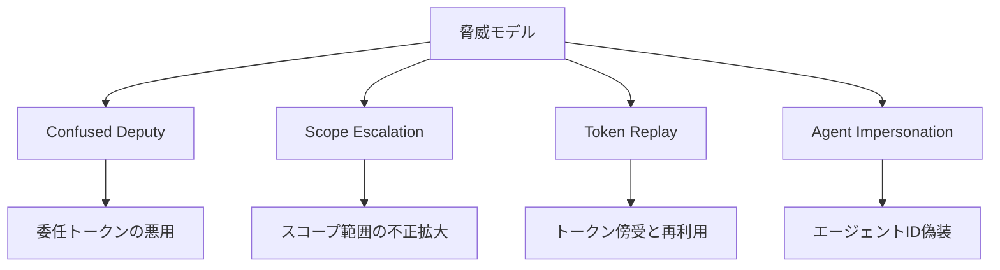
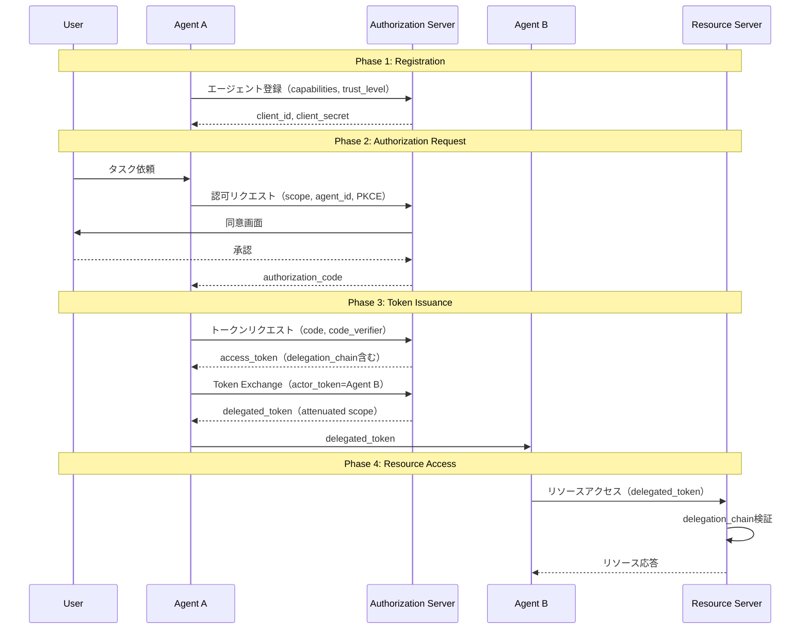
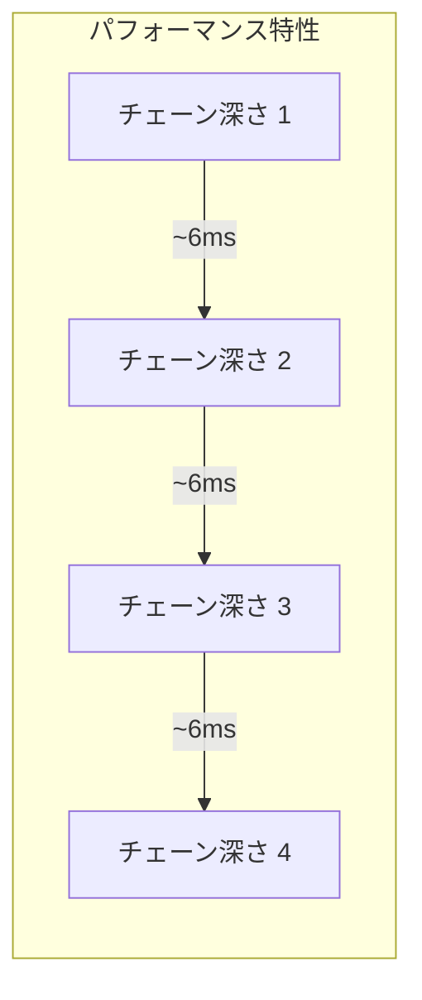
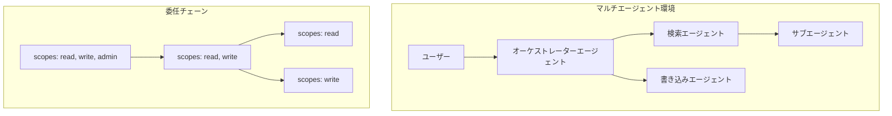

本記事は https://arxiv.org/abs/2504.05765 の解説記事です。

## 論文概要

本論文は、Rany Hany、Vijayanand Banahatti、Sachin Lodha（TCS Research）による研究であり、OAuth 2.0およびRFC 8693 Token Exchangeをエージェント委任認可に拡張するフレームワークを提案している。著者らは、既存のOAuth 2.0がLLMエージェントの動的な権限委任を想定していないことを指摘し、新しいグラントタイプの定義、委任チェーン（Delegation Chain）の形式化、および段階的認可（Progressive Authorization）の仕組みを導入している（論文Section 1より）。

LLMエージェントが他のエージェントにタスクを委任し、さらにそのエージェントが別のエージェントに再委任するマルチエージェント環境では、スコープ管理、トークンの有効期限伝播、監査可能性において根本的な課題が生じる。本論文はこれらの課題に対する体系的な解決策を提示している。

## 背景と動機

### 既存OAuth 2.0の限界

OAuth 2.0（RFC 6749）は、リソースオーナーがクライアントアプリケーションに対して限定的なアクセス権を付与するための標準プロトコルである。しかし、著者らはLLMエージェント環境において以下の課題が存在すると報告している（論文Section 2より）。

**スコープ管理の課題**: 従来のOAuthではスコープは静的に決定されるが、LLMエージェントは実行時に動的なリソースアクセスが必要になるため、事前列挙が困難である。

**委任の多段階化**: エージェントAからB、BからCへの再委任において、元のユーザーの意図したアクセス範囲が適切に制約されているかを検証する仕組みが存在しない。

**監査の欠如**: どのエージェントがどの権限で何のリソースにアクセスしたかを追跡する標準的な手段がない。

### RFC 8693 Token Exchange

RFC 8693は、あるトークンを別のトークンに交換するためのプロトコルを定義している。著者らはこのToken Exchangeメカニズムを委任認可の基盤として活用し、`actor_token`と`may_act`クレームを用いてエージェント間の委任関係を表現する方式を提案している。

## 脅威モデル

著者らは、エージェント環境に固有の4つの主要な脅威を定義している（論文Section 3より）。

**1. Confused Deputy（混乱した代理人）**: 悪意のあるエージェントが正当なエージェントの権限を利用して意図しないリソースにアクセスする攻撃である。

**2. Scope Escalation（スコープ昇格）**: 委任トークンのスコープが元のユーザーの意図した範囲を超えて拡大される攻撃である。例えば`read`のみの委任で`write`を取得するケースが該当する。

**3. Token Replay（トークン再生）**: 傍受されたトークンが再利用される攻撃である。エージェント間でトークンが受け渡されるため、傍受リスクが増大する。

**4. Agent Impersonation（エージェントなりすまし）**: 悪意のあるエージェントが正当なエージェントのIDを偽装してリソースにアクセスする攻撃である。



## 主要な貢献

### Agentic OAuth 4フェーズフロー

著者らは、エージェント環境向けのOAuthフローを4つのフェーズに分割している（論文Section 4より）。



**Phase 1（登録）**では各エージェントが認可サーバーに登録される。**Phase 2（認可リクエスト）**ではユーザー承認のもとPKCEを用いて認可リクエストを送信する。**Phase 3（トークン発行）**では認可コードをアクセストークンに交換し、RFC 8693 Token Exchangeにより下流エージェントへの委任トークンを発行する。**Phase 4（リソースアクセス）**では委任トークンを使用してリソースにアクセスし、サーバー側で委任チェーンの検証が行われる。

### 委任チェーン（Delegation Chain）の形式化

著者らは、委任チェーンを以下のように形式的に定義している（論文Section 4より）。

委任チェーンは、各リンクが発行者（issuer）、主体（subject）、スコープ（scopes）、有効期限（expiry）の組からなる順序付きリストとして定義される。

$$
\text{DelegationChain} = [(issuer_1, subject_1, S_1, T_1), (issuer_2, subject_2, S_2, T_2), \ldots, (issuer_n, subject_n, S_n, T_n)]
$$

ここで、$S_i$はステップ$i$でのスコープ集合、$T_i$は有効期限を表す。

この定義において、以下の2つの制約が課される。

**スコープの単調減衰（Monotone Attenuation）**:

$$
S_{n+1} \subseteq S_n \quad \forall n \geq 1
$$

すなわち、委任チェーンの下流に進むにつれて、スコープは単調に減少しなければならない。上流のエージェントが持つスコープを超えるスコープを下流のエージェントが取得することはできない。

**有効期限の単調減少**:

$$
T_{n+1} \leq T_n \quad \forall n \geq 1
$$

下流のエージェントのトークン有効期限は、上流のエージェントの有効期限を超えてはならない。

### スコープ代数（Scope Algebra）

著者らはスコープ操作を代数的に定義している（論文Section 4より）。4つの基本操作が形式化されている。

- **和集合（Union）**: $S_{\text{union}} = S_a \cup S_b$
- **積集合（Intersection）**: $S_{\text{intersection}} = S_a \cap S_b$（委任時のスコープ共通部分計算に使用）
- **差集合（Difference）**: $S_{\text{difference}} = S_a \setminus S_b$（特定スコープの明示的除外）
- **減衰（Attenuation）**: $S_{\text{attenuated}} \subseteq S_{\text{parent}}$（委任チェーンの単調減衰を実現）

### 段階的認可（Progressive Authorization）

著者らは、Just-In-Time（JIT）パーミッションリクエストとして段階的認可を提案している。エージェントが実行時に追加のスコープが必要になった場合、元のユーザーの承認した範囲内で段階的にスコープを追加リクエストできる仕組みである。これにより、最小権限の原則を維持しつつ、エージェントの動的な要求に対応する。

## 技術的詳細

### JWT委任チェーンクレーム構造

著者らは、JWTの`delegation_chain`カスタムクレームとして委任チェーンを格納する方式を定義している。各リンクは、発行者、主体、スコープ、有効期限、およびタイムスタンプを含む。

```json
{
  "iss": "auth-server.example.com",
  "sub": "agent-b-id",
  "delegation_chain": [
    {"issuer": "auth-server.example.com", "subject": "user-123",
     "scopes": ["read:documents", "write:documents", "admin:settings"],
     "expiry": "2026-12-31T23:59:59Z"},
    {"issuer": "agent-a-id", "subject": "agent-b-id",
     "scopes": ["read:documents", "write:documents"],
     "expiry": "2026-06-02T00:00:00Z"},
    {"issuer": "agent-b-id", "subject": "agent-c-id",
     "scopes": ["read:documents"],
     "expiry": "2026-06-01T12:00:00Z"}
  ],
  "may_act": {"sub": "agent-b-id"}
}
```

リソースサーバーは`delegation_chain`を走査し、各ステップでスコープの単調減衰を検証する。

### RFC 8693 Token Exchange統合

Token Exchangeでは`actor_token`により委任先の識別情報を渡し、`may_act`クレームで代理行動の権限を示す。PKCEはエージェントフローでも必須であり、認可コード傍受を防止する。リフレッシュトークンはローテーション時にエージェントIDへバインドされ、使用ごとに新トークンが発行される。

## 実装のポイント

以下は、委任チェーン検証の実装例である。スコープの単調減衰と有効期限の単調減少を検証するロジックを示す。

```python
from dataclasses import dataclass
from datetime import datetime


@dataclass(frozen=True)
class DelegationLink:
    """委任チェーンの1リンクを表すデータクラス。

    Attributes:
        issuer: トークン発行者の識別子
        subject: 委任先エージェントの識別子
        scopes: 付与されたスコープの集合
        expiry: トークンの有効期限
    """

    issuer: str
    subject: str
    scopes: frozenset[str]
    expiry: datetime


def validate_delegation_chain(
    chain: list[DelegationLink],
) -> tuple[bool, str]:
    """委任チェーン全体の整合性を検証する。

    スコープの単調減衰（S_{n+1} ⊆ S_n）と
    有効期限の単調減少（T_{n+1} ≤ T_n）を検査する。

    Args:
        chain: 検証対象の委任チェーン

    Returns:
        (検証結果, エラーメッセージ) のタプル。
        検証成功時はエラーメッセージは空文字列。
    """
    if len(chain) < 2:
        return True, ""

    for i in range(1, len(chain)):
        parent = chain[i - 1]
        child = chain[i]

        # スコープの単調減衰チェック
        if not child.scopes.issubset(parent.scopes):
            escalated = child.scopes - parent.scopes
            return False, (
                f"Scope escalation at link {i}: "
                f"{escalated} not in parent scopes"
            )

        # 有効期限の単調減少チェック
        if child.expiry > parent.expiry:
            return False, (
                f"Expiry violation at link {i}: "
                f"child={child.expiry} > parent={parent.expiry}"
            )

        # 発行者-主体の連鎖チェック
        if child.issuer != parent.subject:
            return False, (
                f"Chain broken at link {i}: "
                f"issuer={child.issuer} != parent subject={parent.subject}"
            )

    return True, ""


def attenuate_scopes(
    parent_scopes: frozenset[str],
    requested_scopes: frozenset[str],
) -> frozenset[str]:
    """親スコープの範囲内で要求スコープを減衰させる。

    Scope Algebraの Attenuation 操作に対応し、
    S_attenuated = S_parent ∩ S_requested を計算する。

    Args:
        parent_scopes: 上流エージェントのスコープ集合
        requested_scopes: 下流エージェントの要求スコープ集合

    Returns:
        減衰後のスコープ集合（親スコープの部分集合）
    """
    return parent_scopes & requested_scopes
```

上記の`validate_delegation_chain`関数は、委任チェーンの各リンクに対してスコープの包含関係、有効期限の順序、および発行者-主体の連鎖を検証する。`attenuate_scopes`関数は、Scope Algebraの積集合操作を用いて、下流エージェントのスコープを上流の範囲内に制約する。

## 実験結果

### ProVerif形式検証

著者らは、ProVerifを用いてプロトコルの安全性を形式的に検証している（論文Section 5より）。以下の3つの性質がすべて証明されたと報告している。

| 検証項目 | 結果 | 説明 |
|----------|------|------|
| 秘匿性（Secrecy） | 証明済 | アクセストークンおよび委任トークンが攻撃者に漏洩しないこと |
| 認証（Authentication） | 証明済 | エージェントの身元が正しく検証されること |
| 否認不可能性（Non-repudiation） | 証明済 | 委任チェーンの各ステップが記録され、否認できないこと |

### パフォーマンス評価

著者らは、プロトコルのオーバーヘッドを測定した結果を報告している（論文Section 5より）。

**委任チェーン検証の追加レイテンシ**: チェーン長が3の場合、従来のOAuth 2.0トークン検証に対して+12〜18msの追加レイテンシが発生すると報告されている。

**Token Exchangeのレイテンシ**: RFC 8693 Token Exchange処理に約+40msの追加コストが発生すると報告されている。

**チェーン深さに対する線形増加**: 委任チェーンの深さが1段増えるごとに、検証レイテンシが約6ms線形に増加すると報告されている。



チェーン深さ3でもレイテンシ増加は20ms以下であり、実用的なシステムにおいて許容可能なオーバーヘッドである。

### 既存手法との比較

著者らは、本提案手法を既存の認可メカニズムと比較している（論文Section 5より）。

| 特性 | Standard OAuth 2.0 | SPIFFE/SPIRE | Macaroons | 本提案手法 |
|------|-------------------|-------------|-----------|----------|
| 委任チェーン | 非対応 | 部分的 | 制限付き | 完全対応 |
| スコープ減衰 | 非対応 | 非対応 | Caveat | 形式化済 |
| 段階的認可 | 非対応 | 非対応 | 非対応 | 対応 |
| 形式検証 | なし | なし | なし | ProVerif |
| エージェント識別 | クライアントID | SPIFFE ID | なし | Agent ID+PKCE |

Standard OAuth 2.0は委任チェーンの概念を持たず、SPIFFE/SPIREは多段階の委任管理に非対応である。Macaroonsはcaveatによるスコープ制限が可能だが、形式的な検証メカニズムを欠いている。

## 実運用への応用

### OAuth 2.1 + DPoPとの関連

OAuth 2.1のDPoP（Demonstrating Proof-of-Possession）と組み合わせることで、各エージェントのトークンが暗号鍵に紐づけられ、Token Replay攻撃への耐性が強化される。

### マルチエージェントシステムでの適用

LangChainやAutoGenなどのマルチエージェントフレームワークに本論文のフレームワークを統合することで、以下の利点が得られる。

- 各エージェントのアクセス権が自動的に制約され、最小権限の原則が構造的に保証される
- 委任チェーンの監査ログにより、インシデント発生時のトレーサビリティが確保される
- 段階的認可により、ユーザー体験を損なわずにセキュリティを維持できる



## Production Deployment Guide

### AWSにおける実装パターン

本論文のフレームワークをAWS上で実装する場合の構成パターンを、規模別に整理する。

| 項目 | Small（PoC） | Medium（本番小規模） | Large（本番大規模） |
|------|-------------|-------------------|-------------------|
| 認可サーバー | Cognito + Lambda | Cognito + ECS Fargate | Cognito + EKS |
| Token Exchange | Lambda（Node.js） | ECS Fargate（コンテナ） | EKS + Istio sidecar |
| 委任チェーン保存 | DynamoDB On-Demand | DynamoDB Provisioned | DynamoDB + DAX |
| 監査ログ | CloudWatch Logs | CloudWatch + S3 | OpenSearch + S3 |
| キャッシュ | Lambda内メモリ | ElastiCache Redis | ElastiCache Cluster |
| WAF | API Gateway組み込み | AWS WAF v2 | AWS WAF + Shield Advanced |
| 月額概算 | ~$50 | ~$500-1,500 | ~$3,000-10,000 |
| 想定エージェント数 | ~10 | ~100 | ~1,000+ |

### Small構成: Terraform実装例

PoC環境向けのSmall構成では、Lambda + API Gateway + Cognitoの組み合わせで、最小限のコストで委任認可基盤を構築できる。

```hcl
# terraform/main.tf - Small構成（Lambda + API Gateway + Cognito）

resource "aws_cognito_user_pool" "agents" {
  name = "agentic-oauth-agents"
  password_policy {
    minimum_length = 12
    require_uppercase = true
    require_numbers = true
    require_symbols = true
  }
}

resource "aws_cognito_user_pool_client" "agent_client" {
  name         = "agent-delegation-client"
  user_pool_id = aws_cognito_user_pool.agents.id
  generate_secret              = true
  allowed_oauth_flows          = ["code"]
  allowed_oauth_scopes         = ["openid", "profile"]
  # PKCE必須
  allowed_oauth_flows_user_pool_client = true
}

resource "aws_dynamodb_table" "delegation_chains" {
  name         = "delegation-chains"
  billing_mode = "PAY_PER_REQUEST"
  hash_key     = "chain_id"
  range_key    = "link_index"
  attribute { name = "chain_id"; type = "S" }
  attribute { name = "link_index"; type = "N" }
  ttl { attribute_name = "expiry_epoch"; enabled = true }
}

resource "aws_lambda_function" "token_exchange" {
  function_name = "agentic-oauth-token-exchange"
  runtime       = "python3.12"
  handler       = "handler.lambda_handler"
  memory_size   = 256
  timeout       = 30
  environment {
    variables = {
      DYNAMODB_TABLE       = aws_dynamodb_table.delegation_chains.name
      COGNITO_USER_POOL_ID = aws_cognito_user_pool.agents.id
      MAX_DELEGATION_DEPTH = "5"
    }
  }
}
```

### モニタリング設定

委任認可基盤のモニタリングでは、以下のメトリクスを重点的に監視する。

| メトリクス | 閾値 | アラート条件 |
|-----------|------|------------|
| Token Exchange レイテンシ (p99) | 200ms | 3回連続超過 |
| 委任チェーン検証失敗率 | 5% | 5分間で超過 |
| Scope Escalation 検出 | 0 | 1回でも発生 |
| DynamoDB スロットリング | 0 | 1回でも発生 |
| Lambda コールドスタート率 | 10% | 15分平均で超過 |

Scope Escalation検出は最重要メトリクスであり、1回でも発生した場合は即座にアラートを発する必要がある。

### コスト最適化チェックリスト

- DynamoDB TTLで有効期限切れの委任チェーンデータを自動削除する
- Lambda Provisioned Concurrencyは本番環境でのみ有効化する
- CloudWatch Logsの保持期間を環境に応じて設定する（開発: 7日、本番: 90日）
- API GatewayキャッシュをToken Introspection応答に有効化し、リクエストを削減する
- 委任チェーンの最大深さを業務要件に基づいて制限する（推奨: 5以下）

## 関連研究

本論文の位置づけを理解するために、関連する研究を概観する。

**AIP: Agent Identity Protocol（arXiv:2603.24775）**: Sunil Prakashによる研究であり、Invocation-Bound Capability Tokens（IBCTs）を提案している。Rustでの実装では0.049msのオーバーヘッドが報告されている。本論文がOAuth 2.0フロー拡張に焦点を当てるのに対し、AIPはトークン構造に注力している。

**OpenClaw（arXiv:2603.13424）**: Darren ChengとWen-Kwang Tsaoによるプロンプトインジェクション攻撃に対するエージェント権限分離の研究であり、649件の攻撃に対して攻撃成功率0%を達成したと報告されている。

**Authorization Propagation（arXiv:2605.05440）**: マルチエージェント環境における認可伝播の課題を扱い、本論文の委任チェーン形式化と補完的な関係にある。

## まとめと今後の展望

本論文は、OAuth 2.0をLLMエージェントの委任認可に拡張する体系的なフレームワークを提示した。主な貢献は以下の通りである。

1. エージェント環境固有の脅威モデル（Confused Deputy、Scope Escalation、Token Replay、Agent Impersonation）の定義
2. 4フェーズのAgentic OAuthフローの設計
3. 委任チェーンの形式化とスコープ代数の定義
4. ProVerifによる安全性の形式検証
5. 実用的なパフォーマンスオーバーヘッド（チェーン深さ3で+12〜18ms）の実証

著者らは今後の研究方向として以下を挙げている。

**W3C Verifiable Credentials（VC）統合**: エージェントIDをVCとして発行し、分散型ID基盤との統合を実現する方向性が示されている。

**ゼロ知識証明（ZKP）**: エージェントがスコープを明かさずに権限を証明する仕組みの導入が検討されている。

**MCP統合**: Model Context Protocol（MCP）のツール呼び出しにおける認可メカニズムとしての統合が示唆されている。

## 参考文献

1. Hany, R., Banahatti, V., & Lodha, S. (2025). OAuth for LLMs: Delegated Authorization for Agentic Applications. arXiv:2504.05765.
2. Hardt, D. (2012). The OAuth 2.0 Authorization Framework. RFC 6749.
3. Jones, M., et al. (2020). OAuth 2.0 Token Exchange. RFC 8693.
4. Sakimura, N., et al. (2015). Proof Key for Code Exchange by OAuth Public Clients. RFC 7636.
5. Blanchet, B. (2001). An Efficient Cryptographic Protocol Verifier Based on Prolog Rules. ProVerif.
6. Prakash, S. (2025). AIP: Agent Identity Protocol for Verifiable Delegation Across MCP and A2A. arXiv:2603.24775.
7. Cheng, D., & Tsao, W.-K. (2025). Agent Privilege Separation in OpenClaw: A Structural Defense Against Prompt Injection. arXiv:2603.13424.
8. arXiv:2605.05440. Authorization Propagation in Multi-Agent Systems.
9. Goswami, A. (2025). Agentic JWT: A Secure Delegation Protocol for Autonomous AI Agents. arXiv:2509.13597.
10. Birgisson, A., et al. (2014). Macaroons: Cookies with Contextual Caveats for Decentralized Authorization in the Cloud. NDSS.
11. Hewitt, M., et al. (2024). SPIFFE: Secure Production Identity Framework for Everyone. CNCF.
