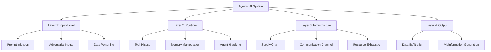
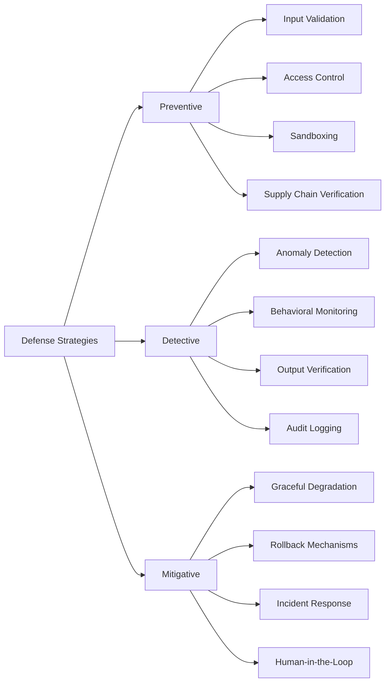
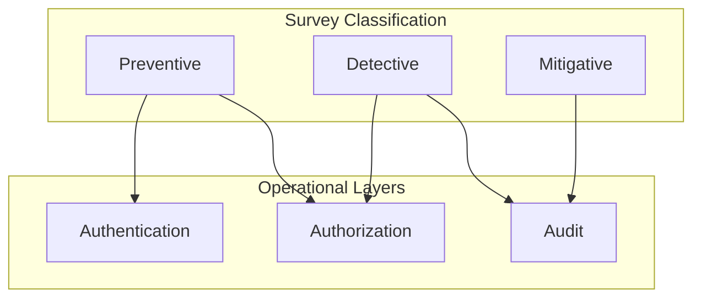
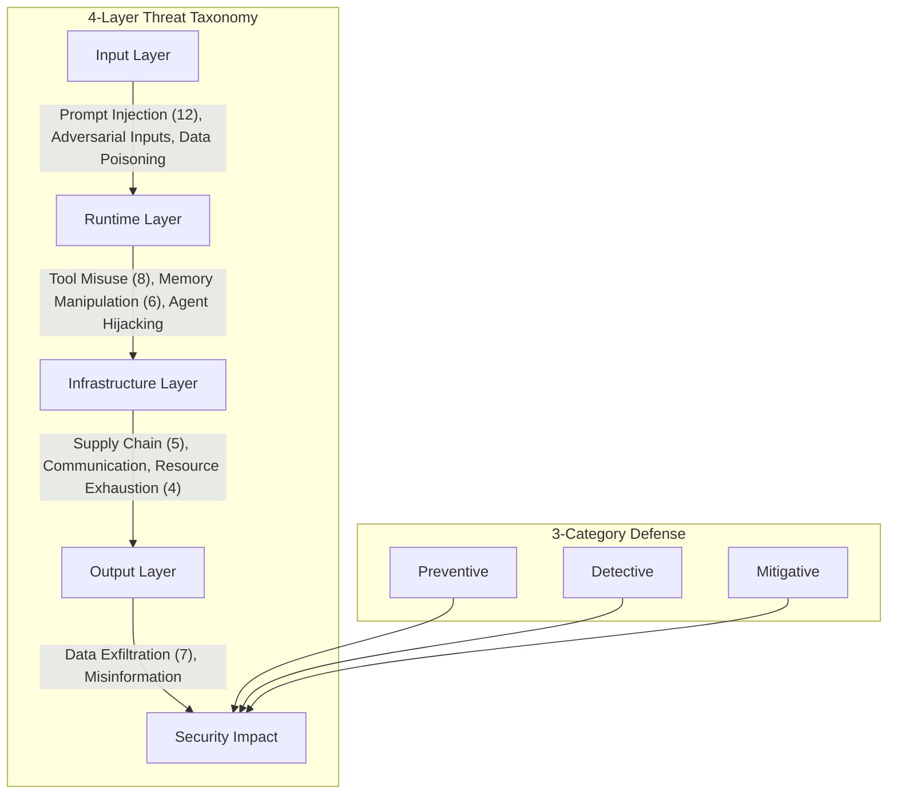

本記事は https://arxiv.org/abs/2506.00130 の解説記事です。

## 論文概要

エージェントAI（Agentic AI）は、LLMに計画・ツール利用・記憶・長期的インタラクション機能を統合したシステムとして急速に普及している。しかし、その自律性の高さゆえにセキュリティリスクも従来のAIシステムとは質的に異なるものとなっている。本サーベイ論文「Towards Agentic AI Security: A Comprehensive Survey, Taxonomy, and Future Directions」は、200件以上の関連論文を体系的に統合し、エージェントAIに特有の攻撃ベクターと防御手法を包括的に分類した研究である。

著者らは、既存研究が個別の攻撃手法や防御手法に焦点を当てており、エージェントAIのセキュリティを統一的に俯瞰するフレームワークが存在しなかったと報告している。この問題意識のもと、4層の脅威タクソノミー（Input / Runtime / Infrastructure / Output）と3カテゴリの防御分類（Preventive / Detective / Mitigative）を提案し、さらに12の未解決研究ギャップを特定している。

## 背景と動機

### エージェントAIの台頭

2024年から2025年にかけて、エージェントAIの実運用導入が加速している。コード生成エージェント、カスタマーサポートエージェント、研究支援エージェントなど、多様なドメインでの展開が報告されている。著者らは、こうしたエージェントの特徴として以下の3点を挙げている。

1. **自律的な意思決定**: 人間の逐次的な指示なしにタスクを遂行する
2. **外部ツールとの連携**: API呼び出し、ファイル操作、Web検索など、実世界への作用を伴う
3. **長期記憶の保持**: 過去のインタラクション履歴をもとに振る舞いを適応させる

これらの特徴は、従来のLLM単体利用と比較して攻撃面（Attack Surface）を大幅に拡大させる。

### セキュリティ研究の断片化

著者らは、エージェントAIセキュリティに関する既存研究の多くが、Prompt Injectionやjailbreakなど個別の攻撃手法に限定されており、エージェントのアーキテクチャ全体を通じた脅威の連鎖や、複数レイヤーにまたがる攻撃パターンが十分に分析されていないと指摘している。特にマルチエージェントシステムにおける攻撃伝搬や、インフラ層での脅威は体系的な整理が不足していたと報告している。

## 主要な貢献

本サーベイの主要な貢献は以下の3点に集約される。

### 貢献1: 4層脅威タクソノミー

エージェントAIに対する攻撃を、データフローに沿った4つのレイヤーに分類する体系を提案している。各レイヤーは独立した攻撃ベクターを含みつつ、レイヤー間の攻撃連鎖も分析の対象としている。

### 貢献2: 3カテゴリ防御分類

防御手法を「予防（Preventive）」「検知（Detective）」「緩和（Mitigative）」の3カテゴリに整理し、各攻撃レイヤーに対してどの防御カテゴリが有効かをマッピングしている。

### 貢献3: 12の未解決研究ギャップ

現在の研究で十分にカバーされていない領域を12項目にわたり特定し、今後の研究方向性を提示している。

## 技術的詳細: 4層脅威タクソノミー

本サーベイの中核をなすのが、エージェントAIの処理パイプラインに沿った4層の脅威分類である。以下にその全体構造をmermaidで示す。

### Layer 1: Input-Level Attacks

入力レイヤーはエージェントが最初に外部データを受け取る段階であり、最も攻撃研究が進んでいる領域である。

**Prompt Injection（12種の攻撃ベクター）**

著者らは、Prompt Injectionを12種の亜型に分類している。代表的なものとして以下が挙げられる。

- **Direct Prompt Injection**: ユーザー入力に直接悪意ある命令を埋め込む手法。システムプロンプトの上書きを試みる
- **Indirect Prompt Injection**: エージェントが参照する外部データ（Webページ、メール、ドキュメント等）に攻撃命令を埋め込む手法。エージェントが自律的にデータを取得する特性を悪用する
- **Multi-turn Injection**: 複数回の対話を通じて徐々にエージェントの制約を緩和させる手法
- **Cross-agent Injection**: マルチエージェント環境において、あるエージェントの出力を通じて別のエージェントを操作する手法

著者らは、Prompt Injectionの攻撃成功率が防御手法の有無や種類によって60-95%の範囲で変動すると報告している。特にIndirect Prompt Injectionについては、エージェントが外部データソースを自律的に参照するため、攻撃面が極めて広いと指摘している。

**Adversarial Inputs**

画像・音声・テキストなどの入力に人間には知覚困難な摂動を加え、エージェントの判断を誤誘導する攻撃である。マルチモーダルエージェントの普及に伴い、この攻撃の実用的脅威度が上昇していると報告されている。

**Data Poisoning**

エージェントの学習データやRAG（Retrieval-Augmented Generation）のナレッジベースに悪意あるデータを混入させる攻撃である。エージェントがリアルタイムで外部知識を取得する場合、ポイズニングされたデータが即座に行動に反映される危険性がある。

### Layer 2: Runtime Attacks

ランタイムレイヤーは、エージェントが計画を立て、ツールを呼び出し、記憶を参照する実行段階における攻撃を対象とする。

**Tool Misuse（8種の攻撃ベクター）**

エージェントに付与されたツール（API呼び出し、ファイル操作、コード実行等）を本来意図されていない方法で使用させる攻撃である。著者らは8種の攻撃ベクターを特定しており、攻撃成功率は40-70%と報告している。

具体的には、以下のようなシナリオが示されている。

- 正当なツール呼び出しに見せかけて、権限昇格を伴うAPI操作を実行させる
- ツールの引数に悪意あるペイロードを注入し、バックエンドシステムを攻撃する
- ツールチェーンの実行順序を操作し、意図しない副作用を引き起こす

**Memory Manipulation（6種の攻撃ベクター）**

エージェントの長期記憶や短期的なコンテキストウィンドウを改ざんする攻撃である。著者らは6種の攻撃ベクターを報告しており、攻撃成功率は30-60%としている。この比較的低い成功率は、記憶システムへのアクセスが入力層と比べて制約されることに起因すると分析されている。

攻撃シナリオとしては、過去の対話履歴に偽の情報を挿入して将来の判断を歪める「Memory Poisoning」や、重要なコンテキスト情報を意図的に消去させる「Context Erasure」などが挙げられている。

**Agent Hijacking**

エージェントの目標そのものを書き換え、攻撃者の意図に従って行動させる攻撃である。Prompt Injectionと異なり、エージェントのプランニングレイヤーに直接作用する点が特徴的であると報告されている。

### Layer 3: Infrastructure Attacks

インフラレイヤーは、エージェントが依存するソフトウェアサプライチェーン、通信チャネル、計算リソースに対する攻撃を対象とする。

**Supply Chain Attacks（5種の攻撃ベクター）**

エージェントが利用するライブラリ、モデルウェイト、プラグインなどに悪意あるコードを混入させる攻撃である。著者らは5種の攻撃ベクターを報告しており、攻撃成功率は20-50%としている。

エージェントAI特有のリスクとして、サードパーティ製のツールプラグインやMCPサーバーを介した攻撃が指摘されている。エージェントがプラグインを動的にロードする場合、プラグインの信頼性検証が不十分であれば、サプライチェーン全体が攻撃面となる。

**Communication Channel Attacks**

マルチエージェントシステムにおけるエージェント間通信を傍受・改ざんする攻撃である。エージェント間のメッセージングプロトコルにおける認証・暗号化の不備を突く。

**Resource Exhaustion（4種の攻撃ベクター）**

エージェントに過剰な計算負荷をかけ、サービス拒否（DoS）状態を引き起こす攻撃である。著者らは4種の攻撃ベクターを報告しており、攻撃成功率は70-95%と極めて高いと報告している。この高い成功率は、多くのエージェントシステムがリソース制限機構を十分に実装していないことに起因すると分析されている。

具体的には、無限ループを誘発するプロンプト、大量のツール呼び出しを連鎖させるリクエスト、メモリを枯渇させる長大なコンテキスト注入などが報告されている。

### Layer 4: Output Manipulation

出力レイヤーは、エージェントが生成・送出するデータに関する攻撃を対象とする。

**Data Exfiltration（7種の攻撃ベクター）**

エージェントが保持するユーザーの機密情報やシステム内部のデータを外部に漏洩させる攻撃である。著者らは7種の攻撃ベクターを報告しており、攻撃成功率は50-85%としている。

代表的な手法として、エージェントの出力にエンコードされた機密情報を埋め込み、外部サーバーへのリクエストに含ませる手法（例：URLパラメータへのデータ埋め込み）が挙げられている。

**Misinformation Generation**

エージェントに意図的に誤った情報を生成させる攻撃である。エージェントが信頼される情報源として扱われる場合、その影響は広範に及ぶ。

### 脅威ベクターの全体像

以下に、各攻撃カテゴリの主要な特性を整理する。著者らが報告している数値をもとに表にまとめる。

| 攻撃カテゴリ | ベクター数 | 既存防御 | 攻撃成功率 |
|---|---|---|---|
| Prompt Injection | 12 | 部分的 | 60-95% |
| Tool Misuse | 8 | 限定的 | 40-70% |
| Memory Manipulation | 6 | 研究段階 | 30-60% |
| Supply Chain | 5 | 一部実用 | 20-50% |
| Data Exfiltration | 7 | 部分的 | 50-85% |
| Resource Exhaustion | 4 | 実用的 | 70-95% |

この表から読み取れる重要な傾向は、Resource ExhaustionとPrompt Injectionの攻撃成功率が突出して高い点である。前者はリソース制御の実装不足、後者は入力検証の原理的な困難さに起因している。

## 防御手法分類

著者らは、エージェントAIに対する防御手法を以下の3カテゴリに分類している。

### Preventive（予防的防御）

攻撃の発生そのものを防ぐことを目的とした防御手法群である。

**Input Validation（入力検証）**

エージェントへの入力をフィルタリング・サニタイズする手法。具体的には以下が報告されている。

- **Prompt Guard**: LLMベースの分類器を用いてPrompt Injectionを検出する手法。著者らは、既知のパターンに対しては高い検出率を示す一方、新規の攻撃パターンへの汎化性に課題があると報告している
- **Instruction Hierarchy**: システムプロンプトとユーザー入力の間に明示的な優先度階層を設け、低優先度の入力がシステム指示を上書きすることを防ぐアプローチ
- **Delimiting**: システムプロンプト、ユーザー入力、外部データを構造的に分離するマーキング手法

**Access Control（アクセス制御）**

エージェントが利用可能なツールやリソースに対して最小権限原則（Principle of Least Privilege）を適用する手法。ツール呼び出しに対する権限管理や、エージェントのスコープ制限が含まれる。

**Sandboxing（サンドボックス化）**

エージェントの実行環境を隔離し、悪意ある操作がシステム全体に波及することを防ぐ手法。コード実行エージェントにおけるコンテナ化や、ファイルシステムアクセスの制限などが含まれる。

**Supply Chain Verification（サプライチェーン検証）**

プラグイン、ツール、モデルウェイトなどの外部依存物の整合性を検証する手法。署名検証やハッシュチェック、信頼されたレジストリの利用などが報告されている。

### Detective（検知的防御）

攻撃の発生をリアルタイムまたは事後的に検知することを目的とした防御手法群である。

**Anomaly Detection（異常検知）**

エージェントの通常の振る舞いからの逸脱を統計的に検知する手法。ツール呼び出しパターン、出力の分布、リソース消費量などの特徴量を監視する。

エージェントの正常な振る舞いのベースラインを構築し、実行時の逸脱度を定量化するアプローチが提案されている。逸脱度は以下のように形式化される。

$$D(a_t) = \sum_{i=1}^{n} w_i \cdot \|f_i(a_t) - \mu_i\|^2$$

ここで $a_t$ は時刻 $t$ におけるエージェントのアクション、$f_i$ は各特徴量の抽出関数、$\mu_i$ はベースラインの平均値、$w_i$ は各特徴量の重みである。閾値 $\theta$ を超えた場合にアラートを発行する。

**Behavioral Monitoring（行動監視）**

エージェントの計画・実行の各ステップをトレースし、期待される行動シーケンスとの整合性を検証する手法。特にツール呼び出しの連鎖パターンやエージェントの目標の一貫性を監視する。

**Output Verification（出力検証）**

エージェントの出力に機密情報が含まれていないか、また出力が事実に基づいているかを検証する手法。Data Exfiltration対策として出力フィルタリングが含まれる。

**Audit Logging（監査ログ）**

エージェントの全アクションを構造化ログとして記録し、事後分析を可能にする手法。インシデント対応やフォレンジック分析の基盤となる。

### Mitigative（緩和的防御）

攻撃が成功した場合に、その影響を最小化することを目的とした防御手法群である。

**Graceful Degradation（優雅な劣化）**

攻撃検知時にエージェントの機能を段階的に制限し、完全な停止を回避しつつ被害を抑制する手法。例えば、外部ツール呼び出しの一時停止や、読み取り専用モードへの移行などが報告されている。

**Rollback Mechanisms（ロールバック機構）**

エージェントが実行した操作を取り消し、安全な状態に復帰させる手法。ファイルシステム操作やデータベース変更を対象としたトランザクション的なロールバックが含まれる。

**Incident Response（インシデント対応）**

攻撃検知後の自動対応フローを定義する手法。人間のセキュリティチームへの通知、影響範囲の自動評価、被害の封じ込め操作などが含まれる。

**Human-in-the-Loop（人間介在）**

高リスクな操作に対して人間の承認を要求する手法。エージェントの自律性と安全性のバランスを調整する重要な手段として報告されている。著者らは、過度なHuman-in-the-Loopはエージェントの効率を大幅に低下させるため、リスクベースのエスカレーションポリシーが必要であると指摘している。

## 実運用への応用

### 3層防御アーキテクチャとの対応

本サーベイの防御分類は、実運用で一般的な3層防御（認証・認可・監査）と以下のように対応づけることができる。

- **認証（Authentication）**: Preventive防御の一部。エージェントの身元確認、ツールプラグインの署名検証
- **認可（Authorization）**: Preventive防御のAccess Controlに対応。最小権限原則、スコープ制限
- **監査（Audit）**: Detective防御のAudit Loggingに対応。全アクションのトレーサビリティ確保

### エージェント開発者への実装指針

本サーベイの知見をもとに、エージェント開発時に考慮すべきセキュリティ対策を各レイヤーに対応させると以下のようになる。

**Input Layer対策**:
- 入力のサニタイゼーションパイプラインの実装
- システムプロンプトとユーザー入力の構造的分離
- 外部データソースの信頼性評価機構

**Runtime Layer対策**:
- ツール呼び出しへの最小権限適用
- 記憶システムの整合性検証
- アクション実行前の計画レビュー

**Infrastructure Layer対策**:
- プラグインの署名検証と更新管理
- エージェント間通信の暗号化
- リソース使用量のレートリミット

**Output Layer対策**:
- 出力内容の機密情報フィルタリング
- 事実性検証チェック
- ユーザーへの出力前の最終レビュー

## 研究ギャップ: 7つの未解決問題

著者らは、エージェントAIセキュリティにおける主要な未解決問題を以下のように特定している。

### 1. Formal Security Models（形式的セキュリティモデル）

エージェントAIのセキュリティ特性を形式的に定義・証明するための理論的基盤が未確立である。従来のソフトウェアセキュリティにおけるアクセス制御モデル（BLPモデル、Clark-Wilsonモデル等）に相当する、エージェント固有の形式モデルが存在しない。著者らは、エージェントの自律性・適応性を形式化する新たなフレームワークの必要性を報告している。

### 2. Standardized Benchmarks（標準化されたベンチマーク）

エージェントAIのセキュリティを客観的に評価するためのベンチマークが標準化されていない。個別の攻撃手法に対する防御率は測定されているが、エージェントシステム全体のセキュリティポスチャを統合的に評価する手法が不足していると報告されている。

### 3. Multi-agent Threats（マルチエージェント脅威）

複数のエージェントが協調するマルチエージェントシステムにおける脅威分析が不十分である。著者らは、あるエージェントの脆弱性が他のエージェントに伝搬する「攻撃連鎖」パターンの研究が初期段階にあると指摘している。特に、共有メモリや共有ツールを介した横方向移動（Lateral Movement）が懸念される。

### 4. Real-world Gap（実世界とのギャップ）

学術的なセキュリティ研究と実運用環境での脅威の間にギャップが存在する。実験室環境での攻撃成功率と実運用環境での攻撃成功率は大きく異なる可能性があり、実世界でのセキュリティ評価が不足していると報告されている。

### 5. Adaptive Adversaries（適応的攻撃者）

防御手法の導入に応じて攻撃手法を進化させる適応的攻撃者への対策が不十分である。静的な防御ルールでは、攻撃者の戦術変更に追随できない。著者らは、防御手法自体が適応的に進化するフレームワークの必要性を報告している。

### 6. Privacy-Security Trade-off（プライバシーとセキュリティのトレードオフ）

エージェントの行動監視を強化するとセキュリティは向上するが、ユーザーのプライバシーが損なわれる。著者らは、差分プライバシーや連合学習などの技術をエージェント監視に適用する研究が初期段階にあると報告している。

### 7. Regulatory Compliance（規制対応）

AI規制（EU AI Act等）へのエージェントAIの適合性に関する研究が不十分である。エージェントの自律的な意思決定における説明責任や、人間の監督要件との整合性が未解決であると報告されている。

## 関連研究

本サーベイは、エージェントAIセキュリティの広範な関連研究を整理している。以下に主要なものを挙げる。

**AIP（Agent Infrastructure Protocol）**: エージェントとツールの間のインターフェースを標準化するプロトコル。セキュリティの観点からは、ツール呼び出しの認証・認可をプロトコルレベルで規定する基盤となる。

**OpenClaw**: エージェントのセキュリティ評価を目的としたオープンソースフレームワーク。攻撃シナリオの再現と防御手法の比較評価を支援する。

**OAuth for LLMs**: LLMエージェントに対するOAuthベースの認証・認可フレームワーク。従来のOAuthフローをエージェントの非同期的なツール利用に適応させる拡張が提案されている。

**その他の関連サーベイ**: 著者らは、USENIX Security 2026に採録された「The Attack and Defense Landscape of Agentic AI」（Kim et al.）や、「Towards trustworthy agentic AI」（Qi et al., arXiv:2605.23989）など、同時期に発表された関連サーベイとの差異も議論している。本サーベイの独自性は、4層×3カテゴリの統一タクソノミーによる網羅的な分類と、12の研究ギャップの体系的な特定にあるとしている。

## まとめ

本サーベイは、急速に拡大するエージェントAIのセキュリティ課題を、200件以上の文献をもとに体系的に整理した包括的な研究である。提案された4層脅威タクソノミーは、エージェントのデータフローに沿って攻撃ベクターを構造化し、実務者がセキュリティ対策を設計する際の有用なフレームワークを提供している。

著者らが特定した12の研究ギャップは、今後のエージェントAIセキュリティ研究の方向性を示している。特に、形式的セキュリティモデルの確立、標準ベンチマークの整備、マルチエージェント環境における攻撃伝搬の分析は、実運用のエージェントAIシステムの安全性を確保するうえで喫緊の課題である。

エージェントAIの普及は今後も加速すると予想され、セキュリティ研究との間の「ギャップ」が拡大するリスクがある。本サーベイが提供する統一的な脅威分類と防御分類は、この「ギャップ」を埋めるための重要な基盤となるものである。
