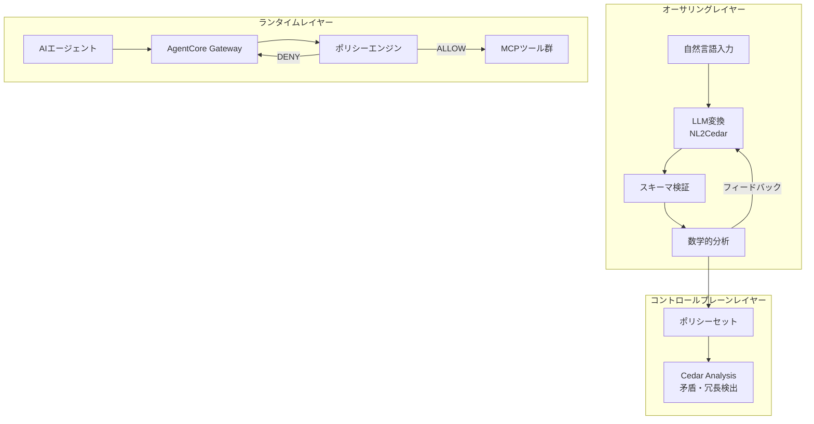
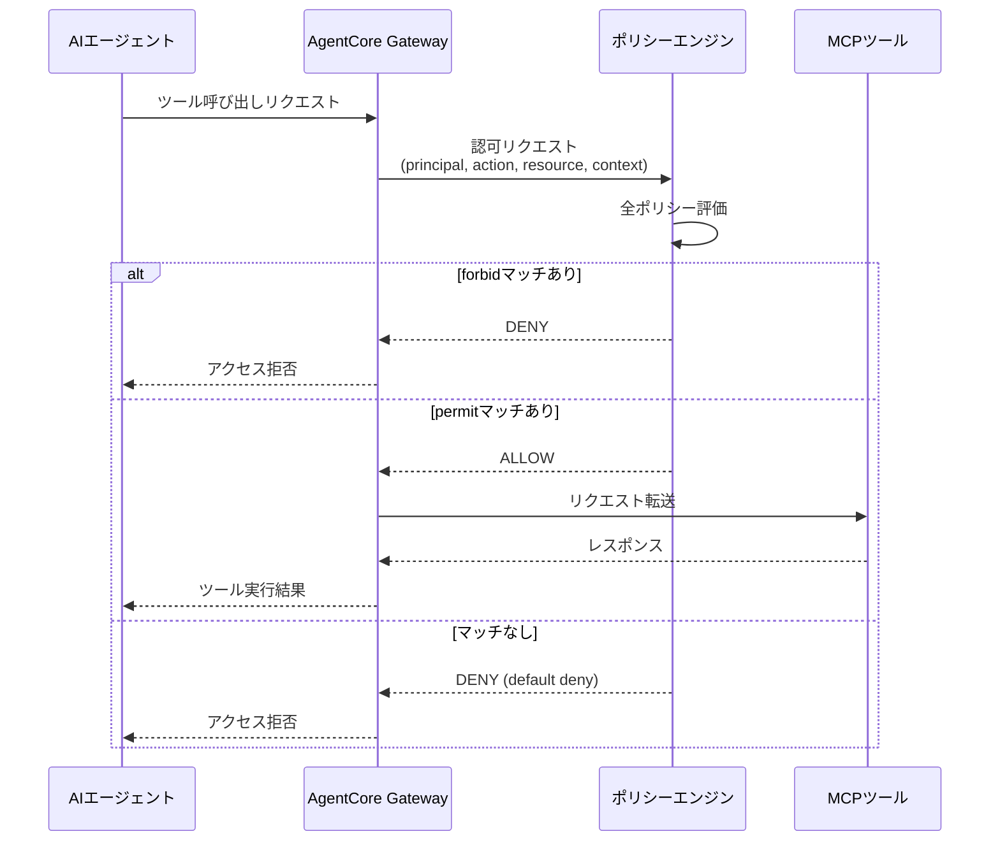
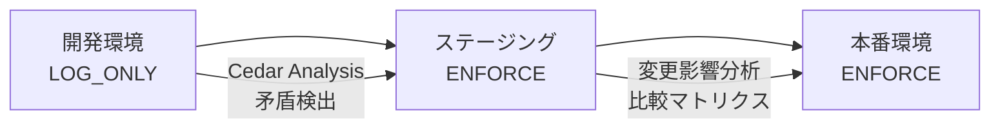
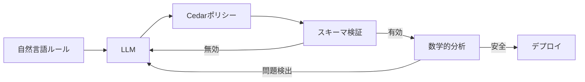

本記事は https://aws.amazon.com/blogs/security/why-policy-in-amazon-bedrock-agentcore-chose-cedar-for-securing-agentic-workflows/ の解説記事です。

2026年5月20日にAWS Security Blogで公開された本記事は、Liana Hadarean氏とJean-Baptiste Tristan氏によるもので、Amazon Bedrock AgentCoreが認可ポリシー言語としてCedarを選んだ技術的根拠と、3層エンフォースメントアーキテクチャの詳細を解説している。LLMエージェントが動的にツールを呼び出す時代において、「何を許可し、何を拒否するか」を決定論的に制御するための設計判断が体系的に述べられている。

## LLMエージェントの非決定性問題

LLMエージェントは、従来のソフトウェアと異なり、同じ入力に対して異なるツール呼び出しを行う非決定性を持つ。著者らは、この特性がセキュリティ上の新たな課題を生むと述べている。エージェントがビジネスルールを誤解したり、意図されていない権限範囲で行動したりするリスクがあるためだ。

従来のアプローチには以下の限界がある。

- **ハードコードされたワークフロー**: エージェントの柔軟性を犠牲にする。ツール呼び出し順序を固定すると、LLMの推論能力を活用できない
- **Human-in-the-loop のみ**: すべての判断に人間の承認を要求すると、スケーラビリティが破綻する

著者らは、これらの代替手段ではなく、エージェントのコード外部にポリシーエンジンを配置する「決定論的エンフォースメント」が必要だと述べている。

## Cedarが選ばれた3つの理由

著者らは、Cedarを選択した理由として3つの特性を挙げている。

### 1. 分析可能性（Analyzability）

Cedarポリシーは数学的な論理式としてエンコードできる。SMTソルバーを用いた形式検証により、ポリシーの矛盾検出、過度な許可の検出、変更影響分析が自動化される。

著者らは、Cedarが「シンボリックエンコーダ」を使ってポリシーを数学的公式に変換し、自動推論技術で分析すると述べている。これにより、デプロイ前にポリシーの安全性を証明できる。

### 2. 可読性（Readability）

Cedarのポリシーは構造化された自然言語に近い形式で記述される。著者らは、セキュリティチームやコンプライアンス担当者が深い技術的背景なしでもポリシーを理解できると述べている。以下はブログで紹介されているポリシーの例だ。

```cedar
permit (
  principal is AgentCore::OAuthUser,
  action == AgentCore::Action::"ApplyBulkDiscount",
  resource
)
when
{
  principal.hasTag("customer_tier") &&
  principal.getTag("customer_tier") == "Platinum" &&
  context.input.orderQuantity >= 50
}
unless
{
  context.input
    .productTypes
    .containsAny(["limited_edition", "seasonal_specials"])
};
```

このポリシーは「Platinumティアの顧客が50個以上注文した場合にバルクディスカウントを許可するが、限定版・季節限定商品は除外する」という意味を、Cedar構文で直接的に表現している。`permit`/`when`/`unless`の3要素による構造が可読性を高めている。

### 3. 性能（Performance）

著者らは、Cedarがループや状態を持つ操作を排除しており、ポリシー評価が一般的なケースで$O(n)$時間で終了すると述べている。ここで$n$はポリシー数を指す。実行時間の上限が保証されるため、認可判定がエージェントワークフローを遅延させるリスクがない。

この設計は、Cedar言語の意図的な制約によるものだ。チューリング完全な言語を避け、認可判定に特化した表現力のみを提供することで、評価の有界性を保証している。

## 3層エンフォースメントアーキテクチャ

著者らは、AgentCoreにおけるCedarポリシーの適用を3つのレイヤーで構成していると述べている。



### オーサリングレイヤー

自然言語からCedarポリシーへの変換を行う。著者らはこれを「ニューロシンボリックフィードバックループ」と呼んでいる。

1. **LLM変換（NL2Cedar）**: 自然言語で記述されたルールをLLMがCedarポリシーに変換
2. **スキーマ検証**: MCPツール定義からCedarスキーマを自動生成し、ポリシーが有効なツール・パラメータを参照しているか検証
3. **数学的分析**: 変換されたポリシーを数学的公式としてエンコードし、過度に許可的な条件や到達不能な条件を検出

このアプローチは、機械学習の柔軟性と自動推論の証明可能な正確性を組み合わせたものだ。

### コントロールプレーンレイヤー

ポリシーセット全体のホリスティック分析を行う。Cedar Analysisが、ポリシー間の矛盾、冗長なルール、意図しない認可結果を検出する。この分析はデプロイ前に実行される。

### ランタイムレイヤー

各MCPツール呼び出しがCedarポリシーに対して評価される。AgentCore Gatewayがすべてのエージェントトラフィックをインターセプトし、ポリシーエンジンが認可判定を下す。

## Cedar検証機能の詳細

著者らは、Cedarの形式検証機能として4つの能力を紹介している。

### 論理エラー検出

矛盾した条件を含むポリシーを検出する。以下はブログで示されている例だ。

```cedar
permit (
  principal is AgentCore::OAuthUser,
  action == AgentCore::Action::"ProcessRefund",
  resource
)
when
{
  principal.hasTag("customer_tier") &&
  principal.getTag("customer_tier") == "Gold" &&
  principal.getTag("customer_tier") == "Platinum"
}
unless { context.input.refundAmount > 1000 };
```

`customer_tier`が`"Gold"`かつ`"Platinum"`という条件は論理的に満たされることがない。Cedar Analysisはこのような「常にfalseとなる条件」を検出し、ポリシー作成者に警告する。

同様に、常にtrueとなる条件（過度に許可的なポリシー）も検出される。

```cedar
permit (
  principal is AgentCore::OAuthUser,
  action == AgentCore::Action::"ApplyBulkDiscount",
  resource
)
when
{
  context.input.orderQuantity >= 100 ||
  context.input.orderQuantity < 100 ||
  (principal.hasTag("customer_tier") &&
   principal.getTag("customer_tier") == "Platinum")
};
```

`orderQuantity >= 100 || orderQuantity < 100`はすべての数値で真となるため、条件が実質的に無効化されている。

### ポリシー競合検出

`permit`と`forbid`の相互作用を分析する。以下のポリシーペアでは、`forbid`の条件（`refundAmount < 500`）が`permit`の条件（`refundAmount < 100`）を包含している。

```cedar
// ポリシーA: Goldティアに100ドル未満の返金を許可
permit (
  principal is AgentCore::OAuthUser,
  action == AgentCore::Action::"ProcessRefund",
  resource
)
when
{
  principal.hasTag("customer_tier") &&
  principal.getTag("customer_tier") == "Gold" &&
  context.input.refundAmount < 100
};

// ポリシーB: Gold/Platinumティアの500ドル未満返金を禁止
forbid (
  principal is AgentCore::OAuthUser,
  action == AgentCore::Action::"ProcessRefund",
  resource
)
when
{
  principal.hasTag("customer_tier") &&
  ["Gold", "Platinum"].contains(principal.getTag("customer_tier")) &&
  context.input.refundAmount < 500
};
```

Cedarの「forbid wins」セマンティクスにより、ポリシーAの`permit`はポリシーBの`forbid`によって常にオーバーライドされる。Cedar Analysisはこの競合を検出し、ポリシーAが実質的に無効であることを報告する。

### 変更影響分析

ポリシー更新時に、変更前後の認可結果を比較する比較マトリクスを生成する。著者らは、変更が「より許可的になるか」「同等か」を判定できると述べている。

### MCPツールフィルタリング

Cedarの部分評価（partial evaluation）機能を活用し、常に拒否されるアクションを事前に判定する。これにより、エージェントのツールリストからアクセス不可能なツールが除外される。エージェントが「ブロックされたツールの存在自体を知らない」状態を実現する。

## ガバナンス原則

著者らは、AgentCoreのポリシー評価における3つの原則を述べている。

### デフォルト拒否（Default Deny）

明示的に許可されていないすべてのアクションは拒否される。`permit`ポリシーがマッチしない場合、結果は常にDENYとなる。

### 禁止優先（Forbid Wins）

`forbid`ポリシーは`permit`ポリシーをオーバーライドする。あるリクエストに対して`permit`と`forbid`の両方がマッチした場合、結果はDENYとなる。

### 順序非依存（No Ordering Dependency）

ポリシーの評価順序は認可判定に影響しない。著者らは、同一のリクエストに対して常に同一の結果が得られることが保証されると述べている。

以下の擬似コードでこの評価アルゴリズムを表現できる。

```python
from dataclasses import dataclass
from enum import Enum
from typing import Any


class Decision(Enum):
    ALLOW = "ALLOW"
    DENY = "DENY"


class Effect(Enum):
    PERMIT = "permit"
    FORBID = "forbid"


@dataclass(frozen=True)
class Policy:
    effect: Effect
    matches: bool  # 事前にスコープ・条件が評価済み


def evaluate_cedar_policies(policies: list[Policy]) -> Decision:
    """Cedarポリシー評価アルゴリズム.

    1. forbidがマッチ → DENY
    2. permitがマッチかつforbidなし → ALLOW
    3. どちらもマッチしない → DENY（デフォルト拒否）
    """
    has_matching_forbid = any(
        p.matches for p in policies if p.effect == Effect.FORBID
    )
    if has_matching_forbid:
        return Decision.DENY

    has_matching_permit = any(
        p.matches for p in policies if p.effect == Effect.PERMIT
    )
    if has_matching_permit:
        return Decision.ALLOW

    return Decision.DENY  # default deny
```

## AgentCoreの認可フロー

エージェントがツールを呼び出す際の認可フロー全体を以下に示す。



## 実践的なCedarポリシー例

ブログで紹介されているものに加え、AgentCoreドキュメントに記載されている実践的なポリシーパターンをいくつか紹介する。

### 複数アクションの一括許可

```cedar
permit(
  principal is AgentCore::OAuthUser,
  action in [
    AgentCore::Action::"InsuranceAPI___get_policy",
    AgentCore::Action::"InsuranceAPI___get_claim_status"
  ],
  resource == AgentCore::Gateway::"arn:aws:bedrock-agentcore:us-west-2:123456789012:gateway/insurance"
);
```

`in`演算子で複数アクションをまとめて許可できる。読み取り専用操作のグルーピングに適している。

### OAuthスコープベースの認可

```cedar
permit(
  principal is AgentCore::OAuthUser,
  action == AgentCore::Action::"InsuranceAPI___file_claim",
  resource == AgentCore::Gateway::"arn:aws:bedrock-agentcore:us-west-2:123456789012:gateway/insurance"
)
when {
  principal.hasTag("scope") &&
  principal.getTag("scope") like "*insurance:claim*"
};
```

`like`演算子のワイルドカードによるパターンマッチで、OAuthスコープの柔軟な検証が可能だ。

### forbid/unlessパターンによるロールベース制御

```cedar
forbid(
  principal is AgentCore::OAuthUser,
  action == AgentCore::Action::"InsuranceAPI___update_coverage",
  resource == AgentCore::Gateway::"arn:aws:bedrock-agentcore:us-west-2:123456789012:gateway/insurance"
)
unless {
  principal.hasTag("role") &&
  (principal.getTag("role") == "senior-adjuster" ||
   principal.getTag("role") == "manager")
};
```

`forbid`/`unless`の組み合わせにより、「特定のロール以外はすべて拒否」というパターンを表現している。`unless`句の条件が偽の場合にforbidが適用される。

### IAMエンティティベースの認可

AgentCore GatewayでAWS\_IAM認証を使用する場合、`AgentCore::IamEntity`をprincipalとして指定する。

```cedar
permit(
  principal == AgentCore::IamEntity::"arn:aws:sts::111122223333:assumed-role/RefundProcessorRole",
  action == AgentCore::Action::"RefundAPI___process_refund",
  resource == AgentCore::Gateway::"arn:aws:bedrock-agentcore:us-west-2:123456789012:gateway/refund-gateway"
)
when {
  context.input has amount &&
  context.input.amount < 1000
};
```

IAMロールの正確なマッチングとツール入力パラメータの検証を組み合わせている。

## 本番デプロイガイド: Cedar + AgentCore Gateway on AWS

ここでは、AgentCoreのポリシーエンジンを本番環境にデプロイするための構成要素を解説する。

### Terraformによるインフラストラクチャ構成

2026年6月時点で、AgentCore Gatewayは`aws_bedrockagentcore_gateway`としてTerraformプロバイダがサポートされている。一方、ポリシーエンジンの設定にはCLIベースのワークアラウンドが必要な部分がある。

```hcl
# AgentCore Gatewayの定義
resource "aws_bedrockagentcore_gateway" "main" {
  name        = "production-gateway"
  description = "Production AgentCore Gateway with Cedar policy"

  protocol_configuration {
    mcp {
      # MCP設定
    }
  }

  lifecycle {
    ignore_changes = [description, protocol_configuration]
  }
}

# AgentCore Agent Runtimeの定義
resource "aws_bedrockagentcore_agent_runtime" "main" {
  agent_runtime_name = "production-agent"

  environment_variables = {
    GATEWAY_URL = aws_bedrockagentcore_gateway.main.gateway_url
  }
}

# ポリシーエンジンのセットアップ（CLIワークアラウンド）
resource "null_resource" "policy_setup" {
  triggers = {
    policy_hash = filesha256("${path.module}/policies/production.cedar")
    gateway_id  = aws_bedrockagentcore_gateway.main.gateway_id
  }

  provisioner "local-exec" {
    command = <<-EOT
      # ポリシーエンジンの作成
      aws bedrock-agentcore create-policy-engine \
        --name "production-policy-engine"

      # Cedarポリシーの追加
      aws bedrock-agentcore add-policy \
        --policy-engine-id $POLICY_ENGINE_ID \
        --policy-file file://policies/production.cedar

      # Gatewayへの関連付け
      aws bedrock-agentcore associate-policy-engine \
        --gateway-id ${aws_bedrockagentcore_gateway.main.gateway_id} \
        --policy-engine-id $POLICY_ENGINE_ID \
        --mode ENFORCE
    EOT
  }

  lifecycle {
    replace_triggered_by = [
      aws_bedrockagentcore_gateway.main,
    ]
  }
}

# CloudWatchロググループ（ポリシー監視用）
resource "aws_cloudwatch_log_group" "policy_logs" {
  name              = "/aws/bedrock-agentcore/policy-evaluations"
  retention_in_days = 90

  tags = {
    Environment = "production"
    Service     = "agentcore-policy"
  }
}
```

### CloudWatch監視の設定

AgentCoreは`AWS/Bedrock-AgentCore`名前空間にポリシー評価メトリクスを自動発行する。主要なメトリクスは以下の通りだ。

| メトリクス | 説明 | 用途 |
|---|---|---|
| `AllowDecisions` | ALLOW判定の件数 | 正常な認可フローの監視 |
| `DenyDecisions` | DENY判定の件数 | 不正アクセス試行の検出 |
| `Latency` | ポリシー評価のレイテンシ | パフォーマンス監視 |
| `TotalMismatchedPolicies` | 型不一致によるポリシー失敗数 | ポリシー品質の監視 |
| `NoDeterminingPolicies` | 決定ポリシーなしによるDENY数 | ポリシーカバレッジの確認 |

CloudWatchアラームの設定例として、DENY率の急増検知を示す。

```python
import boto3

cloudwatch = boto3.client("cloudwatch")


def create_deny_rate_alarm(gateway_id: str, sns_topic_arn: str) -> None:
    """DENY判定の急増を検知するアラームを作成する."""
    cloudwatch.put_metric_alarm(
        AlarmName=f"agentcore-high-deny-rate-{gateway_id}",
        Namespace="AWS/Bedrock-AgentCore",
        MetricName="DenyDecisions",
        Dimensions=[
            {"Name": "TargetResource", "Value": gateway_id},
            {"Name": "Mode", "Value": "ENFORCE"},
        ],
        Statistic="Sum",
        Period=300,
        EvaluationPeriods=2,
        Threshold=100,
        ComparisonOperator="GreaterThanThreshold",
        AlarmActions=[sns_topic_arn],
        AlarmDescription="ポリシーDENY判定が5分間で100件を超過",
    )
```

同様のパターンで`Latency`（p99レイテンシ監視）や`MismatchErrors`（ポリシー型不一致検出）のアラームも設定できる。

### コスト最適化

AgentCoreのポリシー評価コストを最適化するためのポイントを示す。

1. **LOG\_ONLYモードでの検証**: ポリシーを本番投入する前に`LOG_ONLY`モードで動作を検証する。ポリシーエンジンをGatewayに関連付ける際にモードを指定でき、ログ出力のみで実際のアクセス制御は行わない
2. **ポリシー数の最適化**: 評価コストは$O(n)$であるため、不要なポリシーの削除やマルチアクション`in`演算子による統合でポリシー数を削減する
3. **部分評価の活用**: `PartiallyAuthorizeActions`オペレーションを使用して、ツールリスト取得時にアクセス不可能なツールを事前にフィルタリングする。これにより、拒否されるツール呼び出しの試行自体を削減できる

### デプロイ段階



各段階で以下を確認する。

- **開発環境（LOG\_ONLY）**: ポリシーの論理エラー検出、意図した認可結果のテスト
- **ステージング（ENFORCE）**: 実際のエンフォースメントでの動作確認、CloudWatchメトリクスの検証
- **本番環境（ENFORCE）**: 変更影響分析による安全なポリシー更新、継続的な監視

## ニューロシンボリックアプローチの意義

著者らが述べているNL2Cedar（自然言語からCedarへの変換）は、単なるLLMによるコード生成ではない。以下のフィードバックループにより、生成されたポリシーの正確性を保証している。



このアプローチの要点は以下の通りだ。

1. **スキーマ検証**: MCPツール定義からCedarスキーマを自動生成する。ポリシーが存在しないツールやパラメータを参照していないか検証する
2. **数学的分析**: 生成されたポリシーをSMTソルバーで検証する。「常にtrueとなる条件」や「到達不能な条件」を検出し、LLMにフィードバックする
3. **反復的修正**: 検証で問題が検出された場合、LLMが修正を試みるループが繰り返される

著者らは、このアプローチが「機械学習の柔軟性と自動推論の証明可能な正確性」を組み合わせたものだと述べている。

## まとめ

Amazon Bedrock AgentCoreがCedarを選んだ理由は、エージェントワークフローのセキュリティに求められる3つの要件 — 分析可能性、可読性、性能 — をCedarが同時に満たすためである。

著者らのアプローチの核心は、LLMエージェントの非決定性をポリシーエンジンで制御するという設計思想にある。エージェントのコード内部にセキュリティロジックを埋め込むのではなく、外部の決定論的なポリシーレイヤーで制御することで、エージェントの柔軟性とセキュリティの両立を実現している。

特に、ニューロシンボリックアプローチによるNL2Cedar変換と、デプロイ前のCedar Analysis検証の組み合わせは、ポリシー管理の自動化と安全性担保の両面で注目に値する設計だ。

## 参考文献

- [Why Policy in Amazon Bedrock AgentCore chose Cedar for securing agentic workflows](https://aws.amazon.com/blogs/security/why-policy-in-amazon-bedrock-agentcore-chose-cedar-for-securing-agentic-workflows/) — AWS Security Blog, 2026年5月20日
- [Policy in Amazon Bedrock AgentCore](https://docs.aws.amazon.com/bedrock-agentcore/latest/devguide/policy.html) — AWS公式ドキュメント
- [Understanding Cedar policies - Amazon Bedrock AgentCore](https://docs.aws.amazon.com/bedrock-agentcore/latest/devguide/policy-understanding-cedar.html)
- [Example policies - Amazon Bedrock AgentCore](https://docs.aws.amazon.com/bedrock-agentcore/latest/devguide/example-policies.html)
- [AgentCore generated Policy observability data](https://docs.aws.amazon.com/bedrock-agentcore/latest/devguide/observability-policy-metrics.html)
- [Cedar Policy Language Reference Guide](https://docs.cedarpolicy.com/)
- [関連Zenn記事](https://zenn.dev/0h_n0/articles/e4c646e011515e)
