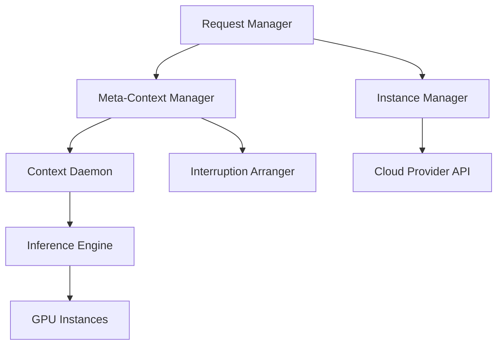

本記事は [arXiv:2311.15566 (SpotServe)](https://arxiv.org/abs/2311.15566) の解説記事です。

## 論文概要（Abstract）

SpotServeは、プリエンプティブル（Spot）GPUインスタンス上で大規模言語モデル（LLM）の推論サービスを提供する分散システムである。著者らは、Spotインスタンスの突然のプリエンプション（強制終了）に対処するため、動的並列化構成の再調整、Kuhn-Munkresアルゴリズムによるコスト最小移行、KVキャッシュのCPU退避によるステートフル推論復旧の3技術を提案している。AWS EC2 Spot上での評価において、P99テイルレイテンシを既存手法比で2.4〜9.1倍改善し、オンデマンドインスタンス比で54%のコスト削減を達成したと報告されている。

この記事は [Zenn記事: EC2 SpotインスタンスでLLM推論コストを最大70%削減する実践構成](https://zenn.dev/0h_n0/articles/235b3a2819146e) の深掘りです。

## 情報源

- **会議名**: ASPLOS 2024（29th ACM International Conference on Architectural Support for Programming Languages and Operating Systems）
- **URL**: [https://arxiv.org/abs/2311.15566](https://arxiv.org/abs/2311.15566)
- **著者**: Xupeng Miao, Chunan Shi, Jiangfei Duan, Xiaoli Xi, Dahua Lin, Bin Cui, Zhihao Jia
- **採択率**: 約18.4%（922件中約170件採択、Major Revision含めると約21-22%）
- **GitHub**: [https://github.com/Hsword/SpotServe](https://github.com/Hsword/SpotServe)

## カンファレンス情報

ASPLOS（International Conference on Architectural Support for Programming Languages and Operating Systems）は、コンピュータアーキテクチャ、プログラミング言語、オペレーティングシステムの交差領域を扱うトップ会議である。2024年は922件の投稿に対し採択率18.4%と高い選択性を持ち、システム分野でACM SIGPLAN/SIGOPS/SIGARCHの3 SIGが共同運営する希少な学会として知られている。

## 背景と動機（Background & Motivation）

LLMの推論サービングは、モデルサイズの増大に伴いGPUコストが急騰している。たとえばLLaMA-30Bの推論には最低16基のGPUが必要であり、オンデマンドインスタンスでの運用は中小規模の組織にとって現実的でない。

クラウドプロバイダが提供するSpot（プリエンプティブル）インスタンスはオンデマンド比で最大90%安価だが、いつでもプリエンプション（強制終了）される可能性がある。従来のSpotインスタンス活用手法は画像分類などの小規模DNNを対象としており、LLMの推論サービングには以下の理由で適用が困難であった。

- **自己回帰生成の逐次性**: LLMの推論はトークンごとに逐次実行されるため、途中で中断されると全トークンの再計算が必要になる
- **分散並列処理の複雑性**: 大型モデルはテンソル並列・パイプライン並列で複数GPUに分散されるため、一部のインスタンスが消失すると並列構成全体を再設計する必要がある
- **リクエストリルーティングの不十分さ**: 小規模DNN向けの冗長構成やリルーティング手法は、GPUメモリが巨大なLLMには不経済である

著者らは、これらの課題を統合的に解決するシステムとしてSpotServeを提案している。

## 主要な貢献（Key Contributions）

1. **動的並列化構成の再調整**: インスタンス数の変動に応じて、データ並列度 $D$、パイプライン並列度 $P$、テンソル並列度 $M$ を動的に最適化するオンラインアルゴリズムを提案
2. **Kuhn-Munkresアルゴリズムによるコスト最小移行**: インスタンス移行を二部グラフマッチング問題として定式化し、コンテキスト（モデルパラメータ + KVキャッシュ）の転送コストを最小化
3. **ステートフル推論復旧**: トークンレベルの細粒度でKVキャッシュをCPUメモリに退避し、プリエンプション後に安価に推論を再開する機構
4. **プリエンプティブルインスタンス上初の分散LLMサービングシステム**: 上記3技術を統合した実用的なシステムの設計・実装・評価

## 技術的詳細（Technical Details）

### システムアーキテクチャ

SpotServeは以下のコンポーネントで構成される。



- **Request Manager**: リクエストの受付、バッチ分割、推論インスタンスへの割り当て、出力収集を担当
- **Instance Manager**: クラウドプロバイダと連携し、プリエンプション通知・新規インスタンス取得通知を処理
- **Meta-Context Manager**: 並列構成の決定と移行指示を発行。Device MapperとMigration Plannerを内包
- **Context Daemon**: 各GPUインスタンス上でモデルパラメータとKVキャッシュを管理
- **Interruption Arranger**: プリエンプション通知受信時にJust-In-Time方式で完了すべきトークン反復数を決定

推論エンジンはNVIDIA FasterTransformerを基盤としている。

### 動的並列化構成の最適化

SpotServeは並列構成を $C = (D, P, M, B)$ の4つ組で管理する。ここで各変数は以下の通りである。

- $D$: データ並列度（独立な推論パイプライン数）
- $P$: パイプライン並列度（モデルを縦方向に分割するステージ数）
- $M$: テンソル並列度（各レイヤーを横方向に分割するシャード数）
- $B$: バッチサイズ

時刻 $t$ における利用可能インスタンス数を $N_t$、リクエスト到着率を $\alpha_t$、構成 $C$ でのスループットを $\phi(C)$、エンドツーエンド推論レイテンシを $l_{\text{req}}(C)$ とすると、最適化問題は以下のように定式化される。

$$
\min_{C} l_{\text{req}}(C) \quad \text{subject to} \quad \phi(C) \geq \alpha_t, \quad D \times P \times M \leq N_t
$$

スループットが到着率を満たす構成が存在しない場合は、フォールバックとしてスループット最大化に切り替える。

$$
\max_{C} \phi(C) \quad \text{subject to} \quad D \times P \times M \leq N_t
$$

著者らはオフラインで各構成のレイテンシを事前測定し、オンラインでは列挙探索により最適構成を決定している。構成空間は小さい（$D, P, M$ の組み合わせ）ため、探索のオーバーヘッドは1秒未満であると報告されている。

### 二部グラフマッチングによるコスト最小移行

並列構成が $C_{\text{old}}$ から $C_{\text{new}}$ に変更される際、各GPUデバイスを新しいトポロジ位置 $(d, p, m)$ に再割り当てする必要がある。ここで $d \in [1, D]$ はパイプラインインデックス、$p \in [1, P]$ はステージインデックス、$m \in [1, M]$ はシャードインデックスである。

著者らはこの割り当て問題を二部グラフ $G = (V_a, V_t, E)$ として定式化している。

- **左分割 $V_a$**: 利用可能なGPUデバイス集合
- **右分割 $V_t$**: 新しいトポロジ位置 $(d, p, m)$ の集合
- **辺重み $e_{uv}$**: GPUデバイス $u$ を位置 $v$ に割り当てた際に再利用可能なコンテキスト量（モデルパラメータ + KVキャッシュ）

最大重みマッチングを求めることで、データ転送量を最小化する最適な再割り当てが得られる。著者らはKuhn-Munkres（ハンガリアン）アルゴリズムを用いて多項式時間で最適解を求めている。

```python
from scipy.optimize import linear_sum_assignment
import numpy as np


def compute_optimal_migration(
    available_gpus: list[str],
    target_positions: list[tuple[int, int, int]],
    context_overlap: np.ndarray,
) -> list[tuple[str, tuple[int, int, int]]]:
    """Kuhn-Munkresアルゴリズムによる最適デバイス移行計画の算出

    Args:
        available_gpus: 利用可能なGPUデバイスのID一覧
        target_positions: 新トポロジ位置 (d, p, m) の一覧
        context_overlap: コンテキスト再利用量の行列
            context_overlap[i][j] = GPU i を位置 j に配置した際の再利用可能データ量

    Returns:
        (GPU ID, 割り当て先位置) のペア一覧
    """
    # Kuhn-Munkresは最小コストマッチングを解くため、負値に変換
    cost_matrix = -context_overlap
    row_indices, col_indices = linear_sum_assignment(cost_matrix)

    assignments = []
    for row, col in zip(row_indices, col_indices):
        assignments.append((available_gpus[row], target_positions[col]))

    return assignments
```

さらに、マルチGPUインスタンス（例: g4dn.12xlargeの4基T4）では、インスタンス内GPUはNVLinkによる高帯域通信が可能であるため、著者らは階層的2段階マッチングを導入している。第1段階でインスタンス間の割り当てを決定し、第2段階でインスタンス内GPUの配置を最適化する。

### KVキャッシュのCPU退避とステートフル推論復旧

LLMの自己回帰生成では、過去トークンのKey-Valueキャッシュを保持することで再計算を回避する。SpotServeはプリエンプション通知を受信すると、KVキャッシュをGPUメモリからCPUメモリに退避させる。

退避のタイミングはInterruption Arrangerが決定する。プリエンプション通知受信時の残り猶予期間を $T^{-}$、移行コストを $T_{\text{mig}}$ とすると、猶予期間内に完了させるトークン反復数 $S_t$ は以下で決定される。

$$
S_t = \arg\max_{0 \leq S \leq S_{\text{out}}} \{ l_{\text{exe}}(S | C_t) < T^{-} - T_{\text{mig}} \}
$$

ここで $l_{\text{exe}}(S | C_t)$ は構成 $C_t$ で $S$ トークン生成するのに要する時間、$S_{\text{out}}$ は残りの生成トークン数である。猶予期間内で可能な限りトークン生成を進めた後、未完了リクエストのKVキャッシュをCPUに退避し、新しいインスタンスで推論を再開する。

この方式により、従来手法のように全トークンの再計算を行うことなく、中断時点からの推論再開が可能となる。

### Migration Plannerのメモリ最適化

コンテキスト移行時にはGPUメモリのピーク使用量が問題となる。送信元GPUは旧構成のパラメータと新構成のパラメータを一時的に同時保持する必要があるためだ。著者らはレイヤー単位の移行順序をmin-max最適化で決定し、ピークメモリ使用量が物理メモリを超えないようにしている。新構成で処理できる同時リクエスト数が減る場合は、一部バッチのキャッシュを破棄する判断も自動的に行われる。

## 実装のポイント（Implementation）

SpotServeの実装において著者らが注力した点は以下の通りである。

**推論エンジン**: NVIDIA FasterTransformerを基盤とし、NCCLプリミティブによるGPU間通信を利用している。コンテキスト移行時もNCCLのAllGatherやSend/Recvを活用してパラメータとKVキャッシュを転送する。

**Grace Period（猶予期間）の活用**: AWSではSpotインスタンスのプリエンプション2分前に通知が届く。SpotServeはこの猶予期間を最大限活用し、（1）進行中のトークン生成を可能な限り進める、（2）KVキャッシュをCPUに退避する、（3）新インスタンスへのコンテキスト移行を開始する、という3つの処理を並行実行する。

**構成空間の事前評価**: 各並列構成 $(D, P, M, B)$ のレイテンシを事前にオフラインプロファイリングし、テーブルとして保持する。これによりオンラインでの構成切り替え判断が1秒未満で完了する。

**制約事項**: PCIe帯域がKVキャッシュのCPU退避におけるボトルネックとなる。特にLLaMA-30Bクラスの大型モデルではKVキャッシュサイズが大きく、猶予期間内に完全な退避が困難な場合がある。この場合、一部のリクエストのキャッシュを破棄し、モデルパラメータのみを移行するフォールバック戦略が取られる。

## Production Deployment Guide

SpotServeの論文で示された3技術（動的並列化、Kuhn-Munkres移行、ステートフル復旧）は、実運用のSpot GPU推論基盤に直接応用できる。以下では、AWS上での実装パターンを規模別に示す。

### AWS実装パターン（コスト最適化重視）

SpotServeのアプローチは、GPUインスタンス上でLLM推論を行うシステムに適用される。規模に応じた推奨構成を以下に示す。

| 規模 | 月間リクエスト | 推奨構成 | 月額コスト目安 | 主要サービス |
|------|--------------|---------|-------------|------------|
| **Small** | ~3,000 (100/日) | Serverless + Spot GPU | $200-500 | Lambda (API) + g4dn.xlarge Spot (推論) |
| **Medium** | ~30,000 (1,000/日) | ECS + Spot GPU Pool | $1,500-3,000 | ECS Fargate (API) + g5.xlarge Spot x2 (推論) |
| **Large** | 300,000+ (10,000/日) | EKS + Karpenter + Spot | $5,000-12,000 | EKS + g5.2xlarge Spot x4-8 + Karpenter |

**Small構成の詳細**（月額$200-500）:
- **Lambda**: API受付・キュー管理 ($20/月)
- **g4dn.xlarge Spot**: T4 GPU 1基、7Bクラスモデル推論 ($80-150/月、オンデマンド$0.71/h に対しSpot $0.21-0.35/h)
- **SQS + DynamoDB**: リクエストキュー・KVキャッシュメタデータ管理 ($15/月)
- **S3**: KVキャッシュ退避先（CPUメモリフォールバック） ($5/月)
- **CloudWatch**: 基本監視 + Spotプリエンプションアラート ($10/月)

**SpotServe由来のコスト削減効果**: 論文の報告では、Spotインスタンス活用によりオンデマンド比54%のコスト削減が実現されている。Karpenter + インスタンスタイプ多様化によりSpotの可用性を向上させ、プリエンプション頻度を低減させることが鍵となる。

**コスト試算の注意事項**: 上記は2026年6月時点のAWS ap-northeast-1（東京）リージョン料金に基づく概算値です。Spotインスタンスの価格は需給に応じて変動するため、最新料金は [AWS料金計算ツール](https://calculator.aws/) および [Spot Price History](https://docs.aws.amazon.com/AWSEC2/latest/UserGuide/using-spot-instances-history.html) で確認してください。

### Terraformインフラコード

#### Small構成（Lambda + Spot GPU）

```hcl
module "vpc" {
  source  = "terraform-aws-modules/vpc/aws"
  version = "~> 5.0"

  name = "spotserve-vpc"
  cidr = "10.0.0.0/16"
  azs  = ["ap-northeast-1a", "ap-northeast-1c"]

  private_subnets = ["10.0.1.0/24", "10.0.2.0/24"]
  public_subnets  = ["10.0.101.0/24", "10.0.102.0/24"]

  enable_nat_gateway   = true
  single_nat_gateway   = true
  enable_dns_hostnames = true
}

resource "aws_launch_template" "gpu_spot" {
  name_prefix   = "spotserve-gpu-"
  image_id      = data.aws_ami.deep_learning.id
  instance_type = "g4dn.xlarge"

  instance_market_options {
    market_type = "spot"
    spot_options {
      max_price                      = "0.40"
      instance_interruption_behavior = "stop"
      spot_instance_type             = "persistent"
    }
  }

  metadata_options {
    http_endpoint = "enabled"
    http_tokens   = "required"
  }

  tag_specifications {
    resource_type = "instance"
    tags = { Name = "spotserve-inference" }
  }
}

resource "aws_sqs_queue" "inference_requests" {
  name                       = "spotserve-requests"
  visibility_timeout_seconds = 120
  message_retention_seconds  = 3600

  redrive_policy = jsonencode({
    deadLetterTargetArn = aws_sqs_queue.dlq.arn
    maxReceiveCount     = 3
  })
}

resource "aws_sqs_queue" "dlq" {
  name                      = "spotserve-requests-dlq"
  message_retention_seconds = 86400
}

resource "aws_lambda_function" "api_handler" {
  filename      = "api_handler.zip"
  function_name = "spotserve-api"
  role          = aws_iam_role.lambda_spotserve.arn
  handler       = "index.handler"
  runtime       = "python3.12"
  timeout       = 30
  memory_size   = 256

  environment {
    variables = {
      SQS_QUEUE_URL = aws_sqs_queue.inference_requests.url
    }
  }
}
```

#### Large構成（EKS + Karpenter + Spot）

```hcl
module "eks" {
  source  = "terraform-aws-modules/eks/aws"
  version = "~> 20.0"

  cluster_name    = "spotserve-cluster"
  cluster_version = "1.31"
  subnet_ids      = module.vpc.private_subnets
  vpc_id          = module.vpc.vpc_id

  cluster_addons = {
    coredns    = { most_recent = true }
    kube-proxy = { most_recent = true }
    vpc-cni    = { most_recent = true }
  }
}

resource "helm_release" "karpenter" {
  name       = "karpenter"
  repository = "oci://public.ecr.aws/karpenter"
  chart      = "karpenter"
  version    = "1.3.0"
  namespace  = "kube-system"

  set {
    name  = "settings.clusterName"
    value = module.eks.cluster_name
  }

  set {
    name  = "settings.clusterEndpoint"
    value = module.eks.cluster_endpoint
  }
}

# Karpenter NodePool: Spot GPU優先、多様なインスタンスタイプ
resource "kubectl_manifest" "gpu_nodepool" {
  yaml_body = <<-YAML
    apiVersion: karpenter.sh/v1
    kind: NodePool
    metadata:
      name: gpu-spot
    spec:
      template:
        spec:
          requirements:
            - key: karpenter.sh/capacity-type
              operator: In
              values: ["spot"]
            - key: karpenter.k8s.aws/instance-category
              operator: In
              values: ["g", "p"]
            - key: karpenter.k8s.aws/instance-generation
              operator: Gt
              values: ["4"]
            - key: node.kubernetes.io/instance-type
              operator: In
              values:
                - g4dn.xlarge
                - g4dn.2xlarge
                - g4dn.12xlarge
                - g5.xlarge
                - g5.2xlarge
                - g5.12xlarge
                - g6.xlarge
                - g6.2xlarge
                - p3.2xlarge
          nodeClassRef:
            group: karpenter.k8s.aws
            kind: EC2NodeClass
            name: gpu-nodes
      limits:
        cpu: 128
        memory: 512Gi
        nvidia.com/gpu: 32
      disruption:
        consolidationPolicy: WhenEmptyOrUnderutilized
        consolidateAfter: 60s
  YAML
}

resource "kubectl_manifest" "gpu_nodeclass" {
  yaml_body = <<-YAML
    apiVersion: karpenter.k8s.aws/v1
    kind: EC2NodeClass
    metadata:
      name: gpu-nodes
    spec:
      amiSelectorTerms:
        - alias: bottlerocket@v1.31
      subnetSelectorTerms:
        - tags:
            karpenter.sh/discovery: spotserve-cluster
      securityGroupSelectorTerms:
        - tags:
            karpenter.sh/discovery: spotserve-cluster
      instanceStorePolicy: RAID0
      blockDeviceMappings:
        - deviceName: /dev/xvda
          ebs:
            volumeSize: 200Gi
            volumeType: gp3
            iops: 5000
            throughput: 250
  YAML
}
```

### 運用・監視設定

**CloudWatch Logs Insightsクエリ（Spotプリエンプション分析）**:

```
fields @timestamp, @message
| filter @message like /preemption|interruption|spot/
| stats count() as preemption_count by bin(1h)
| sort @timestamp desc
```

**CloudWatchアラーム設定**:

```hcl
resource "aws_cloudwatch_metric_alarm" "spot_interruption_rate" {
  alarm_name          = "spotserve-high-interruption-rate"
  comparison_operator = "GreaterThanThreshold"
  evaluation_periods  = 2
  metric_name         = "SpotInterruptionCount"
  namespace           = "SpotServe/Custom"
  period              = 300
  statistic           = "Sum"
  threshold           = 5
  alarm_description   = "5分間に5回以上のSpotプリエンプション発生"
  alarm_actions       = [aws_sns_topic.alerts.arn]
}

resource "aws_cloudwatch_metric_alarm" "p99_latency" {
  alarm_name          = "spotserve-p99-latency-breach"
  comparison_operator = "GreaterThanThreshold"
  evaluation_periods  = 3
  metric_name         = "InferenceP99Latency"
  namespace           = "SpotServe/Custom"
  period              = 60
  statistic           = "p99"
  threshold           = 30000
  alarm_description   = "P99推論レイテンシが30秒超過"
  alarm_actions       = [aws_sns_topic.alerts.arn]
}
```

**X-Rayトレーシング設定**:

```python
from aws_xray_sdk.core import xray_recorder, patch_all

patch_all()

xray_recorder.configure(
    sampling=True,
    context_missing="LOG_ERROR",
    plugins=("EC2Plugin", "ECSPlugin"),
    daemon_address="127.0.0.1:2000",
)


@xray_recorder.capture("inference_request")
def handle_inference(request_id: str, prompt: str) -> dict:
    """推論リクエストのトレーシング

    Args:
        request_id: リクエストID
        prompt: 入力プロンプト

    Returns:
        推論結果とメタデータ
    """
    subsegment = xray_recorder.current_subsegment()
    subsegment.put_annotation("request_id", request_id)
    subsegment.put_metadata("prompt_length", len(prompt))

    # 推論実行...
    return {"request_id": request_id, "status": "completed"}
```

**Cost Explorer自動レポート**:

```hcl
resource "aws_ce_anomaly_monitor" "spot_cost" {
  name              = "spotserve-cost-monitor"
  monitor_type      = "DIMENSIONAL"
  monitor_dimension = "SERVICE"
}

resource "aws_ce_anomaly_subscription" "alert" {
  name      = "spotserve-cost-alert"
  frequency = "DAILY"

  monitor_arn_list = [aws_ce_anomaly_monitor.spot_cost.arn]

  subscriber {
    type    = "EMAIL"
    address = "ops-team@example.com"
  }

  threshold_expression {
    dimension {
      key           = "ANOMALY_TOTAL_IMPACT_ABSOLUTE"
      values        = ["100"]
      match_options = ["GREATER_THAN_OR_EQUAL"]
    }
  }
}
```

### コスト最適化チェックリスト

**アーキテクチャ選択**:
- [ ] ~100 req/日 → Lambda + Spot GPU（$200-500/月）
- [ ] ~1,000 req/日 → ECS + Spot GPU Pool（$1,500-3,000/月）
- [ ] 10,000+ req/日 → EKS + Karpenter + Spot（$5,000-12,000/月）
- [ ] Karpenter NodePoolで15種以上のインスタンスタイプを指定（Spot可用性向上）
- [ ] Bottlerocket AMI使用でGPU Cold Start削減

**Spot戦略（SpotServe知見の適用）**:
- [ ] インスタンスタイプ多様化: g4dn, g5, g6, p3を混在
- [ ] Capacity-type Flexible: Spot優先、On-Demand Fallback
- [ ] AWS Node Termination Handler導入（2分前通知の処理）
- [ ] KVキャッシュ退避先: CPUメモリ（高速）またはS3（大容量フォールバック）
- [ ] プリエンプション時の推論状態保存・復旧パイプライン構築

**GPU最適化**:
- [ ] NVIDIA Driver バージョン固定（Karpenter AMIエイリアスに`@latest`を使わない）
- [ ] GPU Time-slicing: 低負荷時の複数ワークロード共有
- [ ] Kueue / KAI Scheduler: Gang Schedulingで部分割当を防止
- [ ] vLLM PagedAttention: KVキャッシュのメモリ効率化

**監視・アラート**:
- [ ] AWS Budgets: 月額予算アラート設定（Spotコスト含む）
- [ ] CloudWatch: Spotプリエンプション頻度、P99レイテンシ、GPU使用率
- [ ] Cost Anomaly Detection: 日次レポート + $100超過時アラート
- [ ] X-Ray: 推論リクエストのEnd-to-Endトレーシング

**リソース管理**:
- [ ] Karpenter `consolidateAfter: 60s` で未使用ノード自動回収
- [ ] EBS gp3ボリューム: IOPSとスループットを明示指定（gp2比で最大20%安価）
- [ ] コスト配分タグ: `team`, `environment`, `model` タグ付け
- [ ] 開発環境の夜間・週末自動停止

## 実験結果（Results）

著者らはAWS EC2 g4dn.12xlarge（4基 NVIDIA T4 GPU）上で評価を実施している。対象モデルはOPT-6.7B、GPT-20B、LLaMA-30Bの3種類で、実際のAWS Spotインスタンスの12時間可用性トレースを使用している。入力512トークン、出力128トークンの設定でベンチマークを行っている。

ベースラインは以下の2手法である。
- **Rerouting**: 固定並列構成のまま、中断されたリクエストを他パイプラインにリルーティング
- **Reparallelization**: 並列構成を変更するが、コンテキスト移行なしで全インスタンスを再初期化

| モデル | 手法 | P99レイテンシ改善比 | 備考 |
|--------|------|-------------------|------|
| LLaMA-30B | SpotServe vs. Rerouting | 2.14-9.13x | トレースBS（高頻度プリエンプション）で最大 |
| LLaMA-30B | SpotServe vs. Reparallelization | 1.34-2.43x | コンテキスト移行の効果 |
| GPT-20B | SpotServe (Full) | 3.41x vs. Reparallelization | トレースBS |

アブレーション実験（GPT-20B）では、並列化コントローラの除去で179%のP99レイテンシ増加、Device Mapper/Migration Plannerの除去で1.4〜3.1倍の増加が観測されている。Interruption Arrangerは単独で29%のP99改善に寄与している。

コスト面では、Spotインスタンスの使用によりオンデマンド比で54%の削減を達成しつつ、平均レイテンシ増加は18%未満、P99レイテンシ増加は90%に抑えられている。

## 実運用への応用（Practical Applications）

SpotServeが提案する3技術は、Zenn記事「EC2 SpotインスタンスでLLM推論コストを最大70%削減する実践構成」で紹介されている実践的なSpot活用戦略と密接に関連する。

**動的並列化構成**: Zenn記事で推奨されているKarpenterによるSpotノードの自動スケーリングと組み合わせることで、インスタンス数の変動に対して並列構成を自動調整できる。vLLMのtensor parallel設定を動的に変更する仕組みが実装の鍵となる。

**KVキャッシュ退避**: vLLMのPagedAttentionとSpotServeのKVキャッシュCPU退避を組み合わせることで、プリエンプション時の推論状態保存が実現できる。ただし、PCIe帯域がボトルネックとなるため、30B以上のモデルではキャッシュの選択的退避が必要となる。

**コスト最適化の実際**: 論文の54%コスト削減はAWS Spot割引率（最大90%）とプリエンプション時のオーバーヘッドのトレードオフである。Zenn記事で述べられている「70%削減」の目標に対し、SpotServeの技術を適用することでプリエンプション時のレイテンシ劣化を最小限に抑えつつ、高いコスト削減率を維持できる可能性がある。

## 関連研究（Related Work）

- **Orca / FasterTransformer / DeepSpeed**: オンデマンドインスタンス上のLLM推論システム。プリエンプション対応を持たないため、Spotインスタンスでの運用には別途対策が必要
- **MArk / Cocktail**: 小規模DNN向けのSpotインスタンス活用手法。冗長構成やリクエストリルーティングを用いるが、GPUメモリが巨大なLLMには不経済
- **Varuna**: 分散学習向けの動的並列化手法。学習時のチェックポイントを活用するが、推論時のKVキャッシュ管理は対象外
- **Bamboo**: 冗長計算による学習耐障害性。推論サービングへの適用はコスト面で非現実的
- **AlpaServe**: リソース多重化によるLLMサービング。著者らの評価ではFasterTransformer比で約3倍低い性能と報告されている

## まとめと今後の展望

SpotServeは、プリエンプティブルGPUインスタンス上でLLMサービングを実現する初の分散システムとして、動的並列化構成、Kuhn-Munkresアルゴリズムによるコスト最小移行、KVキャッシュのステートフル復旧という3技術を統合している。P99レイテンシを2.4〜9.1倍改善しつつ54%のコスト削減を達成した結果は、LLM推論のコスト問題に対する実用的な解決策を示している。著者らは今後の課題として、異種GPUインスタンスへの対応、SLOベースの最適化目標への拡張、ワークロード予測によるプロアクティブな構成変更を挙げている。

## 参考文献

- **arXiv**: [https://arxiv.org/abs/2311.15566](https://arxiv.org/abs/2311.15566)
- **Code**: [https://github.com/Hsword/SpotServe](https://github.com/Hsword/SpotServe)
- **Conference**: [ASPLOS 2024 Proceedings](https://dl.acm.org/doi/proceedings/10.1145/3620666)
- **Related Zenn article**: [https://zenn.dev/0h_n0/articles/235b3a2819146e](https://zenn.dev/0h_n0/articles/235b3a2819146e)
