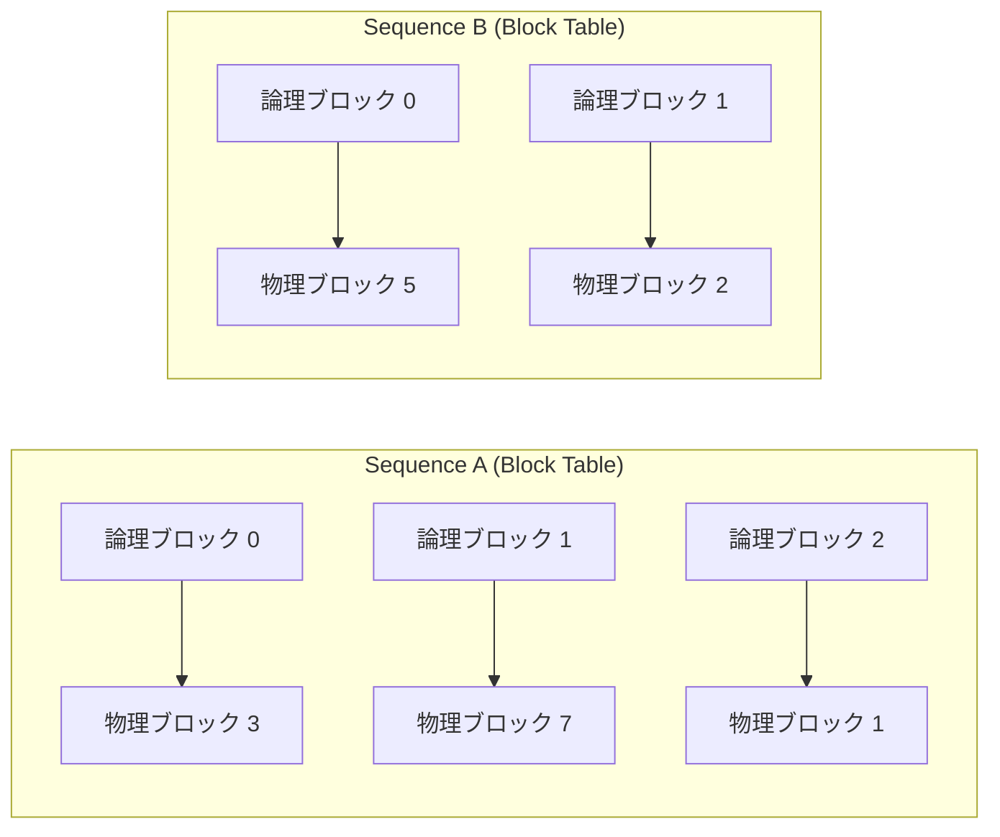

本記事は [arXiv:2309.06180](https://arxiv.org/abs/2309.06180) の解説記事です。

## 論文概要（Abstract）

LLMの高スループットサービングには、多数のリクエストを同時にバッチ処理する必要がある。しかし、リクエストごとに必要なKVキャッシュのメモリは巨大かつ動的に増減するため、従来のシステムではメモリの断片化や重複確保によりバッチサイズが制限されていた。著者らはOSの仮想メモリとページング機構に着想を得た「PagedAttention」を提案し、これを実装したvLLMにより、FasterTransformerやOrcaと比較して同一レイテンシで2--4倍のスループット向上を達成したと報告している。

この記事は [Zenn記事: EC2 SpotインスタンスでLLM推論コストを最大70%削減する実践構成](https://zenn.dev/0h_n0/articles/235b3a2819146e) の深掘りです。

## 情報源

- **arXiv ID**: 2309.06180
- **URL**: [https://arxiv.org/abs/2309.06180](https://arxiv.org/abs/2309.06180)
- **著者**: Woosuk Kwon, Zhuohan Li, Siyuan Zhuang, Ying Sheng, Lianmin Zheng, Cody Hao Yu, Joseph E. Gonzalez, Hao Zhang, Ion Stoica（UC Berkeley, Stanford University）
- **発表年**: 2023（SOSP 2023 -- ACM SIGOPS 29th Symposium on Operating Systems Principles）
- **分野**: cs.CL, cs.OS
- **GitHub**: [https://github.com/vllm-project/vllm](https://github.com/vllm-project/vllm)（Apache 2.0）

## 背景と動機（Background & Motivation）

LLMの推論サービングでは、Transformerのself-attention計算に必要なKey-Valueキャッシュ（KVキャッシュ）のメモリ管理が主要なボトルネックとなっている。例えば、LLaMA-13Bで1シーケンスあたりのKVキャッシュは最大1.7GBに達する。GPUメモリの内訳として、モデルウェイトが静的に確保される一方、KVキャッシュは動的に増減し、全体の最大30%を占める。

従来のシステムでは、生成開始時に最大シーケンス長（例: 2048トークン）分のメモリを一括確保する方式が採用されていた。この方式には3つの問題がある。(1) 実際の出力長が最大長を下回る場合の**内部断片化**（例: 4トークンの出力に2048トークン分のメモリを確保すると99.8%が無駄になる）、(2) メモリアロケータによる**外部断片化**（確保・解放を繰り返すことで生じる利用不可能な隙間領域）、(3) 並列サンプリングやビームサーチでの共有可能なプレフィックスの**重複確保**である。著者らの分析によれば、従来システムでは実際のKVキャッシュメモリの60--80%が無駄になっていたとされる。

## 主要な貢献（Key Contributions）

- **PagedAttentionアルゴリズム**: OSの仮想メモリにおけるページング機構に着想を得て、KVキャッシュを固定サイズのブロックに分割し非連続メモリ上に格納するattentionアルゴリズムを提案
- **vLLMシステム**: PagedAttentionをコアとするLLMサービングエンジンを実装。KVキャッシュのメモリ浪費をほぼゼロ（4%未満）に削減
- **メモリ共有機構**: リクエスト間・リクエスト内でのKVキャッシュ共有をcopy-on-writeで実現し、並列サンプリングでメモリ使用量を最大55%削減
- **高スループット実現**: OPT-13B/66B/175BおよびLLaMA-13Bにおいて、既存システム比で2--4倍、HuggingFace Transformers比で最大24倍のスループット向上を報告

## 技術的詳細（Technical Details）

### PagedAttentionの仕組み

PagedAttentionは、KVキャッシュを固定サイズの**KVブロック**に分割する。各ブロックは$B$トークン分のKeyとValueのベクトルを格納する（デフォルト$B=16$）。OSの仮想メモリと同様に、各シーケンスは**論理ブロック**の列を持ち、ブロックマネージャが**物理ブロック**へのマッピングを管理する。



### ブロックテーブルの構造

各シーケンスの**ブロックテーブル**は、論理ブロック番号から物理ブロック番号への対応を記録する。新しいトークンが生成されるたびに、現在のブロックに空きがあれば追記し、ブロックが満杯になれば新たな物理ブロックをフリープールから割り当てる。シーケンス完了時にはブロックをフリープールに返却する。この動的割り当てにより、外部断片化がゼロとなり、内部断片化は最終ブロックの未使用スロットのみに限定される。

### Attention計算のブロック分割

標準的なself-attentionは以下の通りである。

$$
\text{Attention}(Q, K, V) = \text{softmax}\left(\frac{QK^T}{\sqrt{d_k}}\right) V
$$

ここで、$Q \in \mathbb{R}^{1 \times d_k}$はクエリベクトル（生成中のトークン）、$K \in \mathbb{R}^{n \times d_k}$はキー行列、$V \in \mathbb{R}^{n \times d_v}$はバリュー行列、$d_k$はキーの次元数、$n$はシーケンス長である。

PagedAttentionでは、$K$と$V$がブロック単位で非連続メモリに格納されるため、attention計算をブロックごとに分割して実行する。$N = \lceil n/B \rceil$をブロック数とし、$j$番目のブロックに含まれるKeyを$K_j \in \mathbb{R}^{B \times d_k}$、Valueを$V_j \in \mathbb{R}^{B \times d_v}$と書くと、各ブロックのattentionスコアは以下のように計算される。

$$
A_j = \frac{Q K_j^T}{\sqrt{d_k}} \in \mathbb{R}^{1 \times B}
$$

全ブロックのスコアを結合した後、softmaxを適用して重み付き和を求める。

$$
\text{output} = \sum_{j=1}^{N} \text{softmax}(A_1, \ldots, A_N)_j \cdot V_j
$$

この分割によりKVキャッシュは物理メモリ上で連続している必要がなく、カスタムGPUカーネルがブロックテーブルを参照して各ブロックのデータをフェッチする。

### Copy-on-Writeの仕組み

並列サンプリング（1つのプロンプトから複数の応答を生成）やビームサーチでは、複数のシーケンスが同一のプレフィックス（プロンプト部分）を共有する。PagedAttentionでは、共有されるブロックに**参照カウント**を付与し、複数のシーケンスが同一の物理ブロックを参照できるようにする。あるシーケンスがブロックの内容を変更する必要が生じた場合（分岐が発生した場合）のみ、該当ブロックをコピーして新たな物理ブロックとして割り当てる（copy-on-write）。著者らによれば、この機構により並列サンプリングでのメモリ使用量が最大55%削減され、スループットが最大2.2倍向上したと報告されている。

### Continuous Batchingとの統合

vLLMはOrcaで提案された**iteration-level scheduling**（continuous batching）を採用している。従来のstatic batchingでは、バッチ内の全シーケンスが完了するまで新しいリクエストを受け付けられなかったが、iteration-level schedulingでは各イテレーション（1トークン生成）ごとにスケジューリングを行い、完了したシーケンスを即座にバッチから除外し、新しいリクエストを追加できる。PagedAttentionの動的メモリ管理と組み合わせることで、GPUメモリの利用率を最大化している。

## 実装のポイント

vLLMはOpenAI互換のAPIサーバーとして動作し、以下のコードで利用できる。

```python
from vllm import LLM, SamplingParams

def run_inference(
    model_name: str,
    prompts: list[str],
    max_tokens: int = 256,
    temperature: float = 0.8,
) -> list[str]:
    """vLLMによるバッチ推論を実行する。

    Args:
        model_name: HuggingFace形式のモデル名
        prompts: 入力プロンプトのリスト
        max_tokens: 最大生成トークン数
        temperature: サンプリング温度

    Returns:
        生成テキストのリスト
    """
    llm = LLM(
        model=model_name,
        gpu_memory_utilization=0.90,  # KVキャッシュ用のGPUメモリ割合
        max_model_len=4096,
        block_size=16,  # PagedAttentionのブロックサイズ
    )
    sampling_params = SamplingParams(
        temperature=temperature,
        max_tokens=max_tokens,
    )
    outputs = llm.generate(prompts, sampling_params)
    return [output.outputs[0].text for output in outputs]
```

スケジューラはFCFS（First-Come-First-Serve）を基本とし、GPUメモリが不足した場合にはシーケンスを**preemption**（一時退避）する。退避方式として、KVキャッシュをCPUメモリにスワップする方式と、KVキャッシュを破棄して後から再計算する方式の2つをサポートしている。ブロックサイズ$B$はトレードオフを伴い、大きいブロックはカーネル効率が高いがメモリ効率が低下し、小さいブロックはその逆となる。デフォルトの$B=16$は、著者らの実験においてスループットとメモリ効率のバランスが取れた値とされている。

## Production Deployment Guide

vLLMは実装が公開されたオープンソースプロジェクトであり、2025年にはPyTorch Foundationに加入、NVIDIA・AWS・Google Cloudからの公式サポートを受けている。以下では、Zenn記事で解説したEC2 Spotインスタンス構成と組み合わせた本番デプロイメントの設計を示す。

### AWS実装パターン（コスト最適化重視）

vLLMの本番デプロイメントは、トラフィック量に応じて3段階の構成が考えられる。

| 構成 | トラフィック | サービス構成 | 月額概算 |
|------|-------------|-------------|---------|
| Small | ~100 req/日 | Lambda + Bedrock (Claude/Llama) | $50--150 |
| Medium | ~1,000 req/日 | ECS Fargate + g5.xlarge (1 GPU) | $300--800 |
| Large | 10,000+ req/日 | EKS + Karpenter + Spot (multi-GPU) | $2,000--5,000 |

**注意**: 上記は2026年6月時点のAWS ap-northeast-1（東京）リージョンの概算値であり、実際のコストはトラフィックパターン、リージョン、バースト使用量により変動する。最新料金はAWS料金計算ツールで確認を推奨する。

**Small構成**: Bedrockのマネージドモデル（Claude 4 Sonnet等）を利用し、Lambda経由でAPIを呼び出す。vLLMのセルフホスティングは不要で運用負荷が低い。月額$50--150（Bedrockのトークン課金が主）。

**Medium構成**: ECS Fargate上でvLLMコンテナを1台のg5.xlarge（NVIDIA A10G, 24GB VRAM）で稼働させる。7B--13Bクラスのモデルに適する。On-Demand月額約$800、Spot利用で$300--500に削減可能。

**Large構成**: EKSクラスタでKarpenterによるGPUノードの自動スケーリングを行い、g5.12xlargeまたはp4d.24xlarge（A100 x8）をSpotインスタンスで確保する。vLLMのtensor parallelismで複数GPUに分散し、66B--175Bクラスのモデルをサービングする。Spot活用で最大70%のコスト削減を実現する。

**コスト削減テクニック**:
- Spot Instances活用で最大90%削減（GPU系は60--70%が現実的）
- Reserved Instances 1年コミットで最大40%削減（GPUインスタンス）
- Savings Plans 3年で最大72%削減
- PagedAttentionによるメモリ効率向上でGPU台数削減

### Terraformインフラコード

#### Small構成（Serverless: Lambda + Bedrock）

```hcl
# small_serverless/main.tf — Lambda + Bedrock構成
terraform {
  required_version = ">= 1.9"
  required_providers {
    aws = { source = "hashicorp/aws", version = "~> 5.80" }
  }
}
provider "aws" { region = "ap-northeast-1" }

resource "aws_iam_role" "lambda_role" {
  name = "vllm-inference-lambda-role"
  assume_role_policy = jsonencode({
    Version = "2012-10-17"
    Statement = [{ Action = "sts:AssumeRole", Effect = "Allow",
      Principal = { Service = "lambda.amazonaws.com" } }]
  })
}

resource "aws_iam_role_policy" "bedrock_invoke" {
  name = "bedrock-invoke"
  role = aws_iam_role.lambda_role.id
  policy = jsonencode({
    Version = "2012-10-17"
    Statement = [{ Effect = "Allow", Action = ["bedrock:InvokeModel"],
      Resource = "arn:aws:bedrock:ap-northeast-1::foundation-model/*" }]
  })
}

resource "aws_lambda_function" "inference" {
  function_name = "vllm-inference"
  runtime       = "python3.12"
  handler       = "handler.lambda_handler"
  role          = aws_iam_role.lambda_role.arn
  timeout       = 120   # Bedrock応答待ち
  memory_size   = 512
  filename      = "lambda.zip"
  environment {
    variables = { MODEL_ID = "anthropic.claude-sonnet-4-20250514", MAX_TOKENS = "1024" }
  }
}
```

#### Large構成（EKS + Karpenter + Spot）

```hcl
# large_eks/main.tf — EKS + Karpenter + Spot (GPU)
# vLLMのPagedAttention: Spot中断時もKVキャッシュ再構築が高速
terraform {
  required_version = ">= 1.9"
  required_providers {
    aws  = { source = "hashicorp/aws", version = "~> 5.80" }
    helm = { source = "hashicorp/helm", version = "~> 2.17" }
  }
}
provider "aws" { region = "ap-northeast-1" }

module "eks" {
  source  = "terraform-aws-modules/eks/aws"
  version = "~> 20.31"
  cluster_name    = "vllm-serving"
  cluster_version = "1.32"
  vpc_id     = var.vpc_id
  subnet_ids = var.private_subnet_ids
  enable_cluster_creator_admin_permissions = true
}

module "karpenter" {
  source  = "terraform-aws-modules/eks/aws//modules/karpenter"
  version = "~> 20.31"
  cluster_name           = module.eks.cluster_name
  enable_spot_termination = true  # Spot中断ハンドリング
}

# Karpenter NodePool: Spot優先でGPUノードを自動プロビジョニング
resource "kubectl_manifest" "gpu_nodepool" {
  yaml_body = yamlencode({
    apiVersion = "karpenter.sh/v1"
    kind       = "NodePool"
    metadata   = { name = "gpu-spot" }
    spec = {
      template = { spec = {
        requirements = [
          { key = "karpenter.sh/capacity-type", operator = "In",
            values = ["spot", "on-demand"] },
          { key = "node.kubernetes.io/instance-type", operator = "In",
            values = ["g5.xlarge", "g5.2xlarge", "g5.12xlarge"] },
        ]
        nodeClassRef = { group = "karpenter.k8s.aws",
          kind = "EC2NodeClass", name = "gpu" }
      }}
      limits     = { "nvidia.com/gpu" = "16" }
      disruption = { consolidationPolicy = "WhenEmptyOrUnderutilized",
                     consolidateAfter = "60s" }
    }
  })
}

resource "aws_budgets_budget" "monthly" {
  name         = "vllm-monthly-budget"
  budget_type  = "COST"
  limit_amount = "5000"
  limit_unit   = "USD"
  time_unit    = "MONTHLY"
  notification {
    comparison_operator        = "GREATER_THAN"
    threshold                  = 80
    threshold_type             = "PERCENTAGE"
    notification_type          = "ACTUAL"
    subscriber_email_addresses = [var.alert_email]
  }
}
```

### 運用・監視設定

#### CloudWatch Logs Insights クエリ

```
# KVキャッシュ使用率異常検知（1時間ごと）
fields @timestamp, @message
| filter @message like /gpu_cache_usage/
| stats avg(gpu_cache_usage_perc) as avg_cache, max(gpu_cache_usage_perc) as max_cache by bin(1h)
| filter max_cache > 95

# レイテンシ分析（P95, P99）
fields @timestamp, latency_ms
| stats percentile(latency_ms, 95) as p95, percentile(latency_ms, 99) as p99 by bin(5m)
| filter p99 > 5000
```

#### CloudWatch アラーム設定

```python
import boto3

def create_vllm_alarms(service_name: str, sns_topic_arn: str) -> None:
    """vLLM推論サービス用のCloudWatchアラームを作成する。"""
    cw = boto3.client("cloudwatch", region_name="ap-northeast-1")
    cw.put_metric_alarm(
        AlarmName=f"{service_name}-kv-cache-spike",
        MetricName="GPUCacheUsagePercent",
        Namespace="vLLM/Inference",
        Statistic="Maximum", Period=300, EvaluationPeriods=2,
        Threshold=95.0, ComparisonOperator="GreaterThanThreshold",
        AlarmActions=[sns_topic_arn],
    )
```

#### X-Ray トレーシング設定

```python
from aws_xray_sdk.core import xray_recorder, patch_all

def configure_xray_tracing(service_name: str = "vllm-inference") -> None:
    """AWS X-Rayのトレーシングを設定する。"""
    xray_recorder.configure(service=service_name)
    patch_all()  # boto3等のライブラリを自動計装

@xray_recorder.capture("inference_request")
def traced_inference(prompt: str, model_id: str) -> dict:
    """X-Rayトレース付きの推論リクエスト。"""
    subsegment = xray_recorder.current_subsegment()
    subsegment.put_annotation("model_id", model_id)
    subsegment.put_metadata("prompt_length", len(prompt))
    return {"status": "ok"}  # 実際の推論処理を実装
```

#### Cost Explorer 自動レポート

```python
import boto3
from datetime import datetime, timedelta

def get_daily_cost_report() -> dict:
    """EKS/EC2/Bedrockの日次コストレポートを取得する。"""
    ce = boto3.client("ce", region_name="us-east-1")
    end = datetime.utcnow().strftime("%Y-%m-%d")
    start = (datetime.utcnow() - timedelta(days=7)).strftime("%Y-%m-%d")
    response = ce.get_cost_and_usage(
        TimePeriod={"Start": start, "End": end},
        Granularity="DAILY",
        Metrics=["UnblendedCost"],
        Filter={"Dimensions": {"Key": "SERVICE",
            "Values": ["Amazon Elastic Kubernetes Service", "Amazon EC2", "Amazon Bedrock"]}},
    )
    return {r["TimePeriod"]["Start"]: float(r["Total"]["UnblendedCost"]["Amount"])
            for r in response["ResultsByTime"]}
```

### コスト最適化チェックリスト

**アーキテクチャ選択**:
- [ ] トラフィック量に応じた適切な構成を選択（~100 req/日: Serverless、~1,000: Hybrid、10,000+: Container）
- [ ] vLLMのPagedAttentionによりGPUメモリ効率を最大化（メモリ浪費4%未満）
- [ ] モデルサイズに応じたインスタンスタイプを選定（7B: g5.xlarge、13B: g5.2xlarge、66B+: p4d.24xlarge）

**リソース最適化**:
- [ ] EC2: Spot Instances優先（GPU Spotで60--70%削減）
- [ ] Reserved Instances: 1年コミット（ベースロード用GPU）
- [ ] Savings Plans: 3年コミットで最大72%削減
- [ ] Karpenter: consolidationPolicy設定でアイドルノードを自動回収
- [ ] EKS: Pod Disruption Budget設定でSpot中断時のサービス継続を確保

**LLMコスト削減**:
- [ ] PagedAttentionのgpu_memory_utilization設定を最適化（デフォルト0.90）
- [ ] vLLMのcontinuous batchingでGPU稼働率を最大化
- [ ] KVキャッシュ共有（共通プレフィックスの再利用）で重複計算を削減
- [ ] 適切なブロックサイズの選択（デフォルト16で大半のユースケースに適合）
- [ ] max_model_lenの適切な設定で過剰なメモリ確保を防止

**監視・アラート**:
- [ ] AWS Budgets設定（月次予算アラート、80%・100%の2段階）
- [ ] CloudWatch アラーム（KVキャッシュ使用率、レイテンシP99）
- [ ] Cost Anomaly Detection有効化（日次異常検知）
- [ ] 日次コストレポート自動送信（SNS通知）

**リソース管理**:
- [ ] 未使用GPUノードの自動削除（Karpenter consolidation）
- [ ] タグ戦略（Environment, Team, Model, CostCenter）
- [ ] ECRイメージのライフサイクルポリシー（古いvLLMイメージを自動削除）
- [ ] 開発環境の夜間・休日停止スケジュール設定
- [ ] Spotインスタンスの中断ハンドリング（graceful shutdown + preStop hook）

## 実験結果（Results）

著者らはA100 80GB GPU上で、OPT-13B、OPT-66B、OPT-175B、LLaMA-13Bの4モデルを用いた評価を報告している。ワークロードとしてShareGPTデータセット（実際のチャットログに基づく入出力長分布）とAlpacaデータセット（短いプロンプトからの長い出力）を使用している。

**スループット比較（論文の評価セクションより）**:

| モデル | 比較対象 | スループット改善 |
|--------|---------|-----------------|
| OPT-13B | FasterTransformer | 約2倍 |
| OPT-13B | Orca | 約2倍 |
| LLaMA-13B | HuggingFace TGI | 最大3.5倍 |
| OPT-175B | FasterTransformer | 最大24倍 |

著者らによれば、改善幅はシーケンス長が長いほど、モデルが大きいほど、デコードアルゴリズムが複雑（ビームサーチ、並列サンプリング）なほど大きくなるとされている。これは、PagedAttentionがメモリ断片化の影響を受けやすい条件で特に効果を発揮するためである。メモリ浪費率は従来システムの60--80%に対し、vLLMでは4%未満に抑えられたと報告されている。

## 実運用への応用（Practical Applications）

PagedAttentionの設計は、EC2 Spotインスタンスとの相性が良い。Spotインスタンスは2分前の中断通知を受けてシャットダウンする必要があるが、vLLMのKVキャッシュはブロック単位で管理されるため、中断時にKVキャッシュを破棄しても再計算コストが限定的である。Karpenterのspot-termination-handlerと組み合わせることで、中断通知を受けたノードをcordonし、新しいSpotノードが90秒以内にプロビジョニングされる構成が実現できる。

また、PagedAttentionの動的メモリ割り当ては、トラフィックの波がある本番環境で有効である。ピーク時にはKVキャッシュがGPUメモリの大部分を使用し、閑散期にはメモリを解放してバッチサイズの余裕を確保できる。Zenn記事で解説したSpot構成と組み合わせることで、インフラコスト（Spot割引）とGPUメモリ効率（PagedAttention）の両面からコスト最適化を図ることが可能となる。

## 関連研究（Related Work）

- **Orca** (Yu et al., OSDI 2022): iteration-level scheduling（continuous batching）を提案し、LLMサービングのスループットを向上させた。vLLMはOrcaのスケジューリング手法を採用しつつ、メモリ管理をPagedAttentionで置き換えている
- **FasterTransformer** (NVIDIA): NVIDIAが提供する高速推論ライブラリ。カーネルレベルの最適化に注力しているが、メモリ管理は連続確保方式のため断片化の問題があり、vLLMはこの点で優位とされている
- **FlashAttention** (Dao et al., NeurIPS 2022 / 2023): attentionのIOを最適化するアルゴリズム。PagedAttentionとは直交する技術であり、vLLMではFlashAttentionカーネルと組み合わせて使用可能である
- **vAttention** (Prabhu et al., 2024): PagedAttentionのカスタムカーネルオーバーヘッドを回避するため、NVIDIA GPUの仮想メモリAPIを直接利用する手法を提案。連続仮想メモリ上にKVキャッシュを配置しつつ、物理メモリの動的割り当てを実現している

## まとめと今後の展望

PagedAttentionは、OSの仮想メモリ管理という成熟した概念をLLMサービングのKVキャッシュ管理に適用することで、メモリ浪費を4%未満に抑え、スループットを2--4倍向上させた。vLLMは2025年時点でPyTorch Foundationに加入し、NVIDIA・AWS・Google Cloudからのサポートを受けるなど、LLMサービングのデファクトスタンダードとしての地位を確立しつつある。今後は、vAttentionのようなハードウェアネイティブな仮想メモリ管理や、KVキャッシュ圧縮・量子化との組み合わせにより、さらなるメモリ効率の向上が期待される。

## 参考文献

- **arXiv**: [https://arxiv.org/abs/2309.06180](https://arxiv.org/abs/2309.06180)
- **Code**: [https://github.com/vllm-project/vllm](https://github.com/vllm-project/vllm)（Apache 2.0）
- **vLLM Blog**: [https://vllm.ai/blog/2023-06-20-vllm](https://vllm.ai/blog/2023-06-20-vllm)
- **SOSP 2023 Proceedings**: [https://dl.acm.org/doi/10.1145/3600006.3613165](https://dl.acm.org/doi/10.1145/3600006.3613165)
- **Related Zenn article**: [https://zenn.dev/0h_n0/articles/235b3a2819146e](https://zenn.dev/0h_n0/articles/235b3a2819146e)

---

*本記事はAI（Claude）による論文解説記事であり、著者自身が実験を行ったものではありません。内容の正確性については原論文をご確認ください。*
