本記事は [arXiv:2403.02310 (Sarathi-Serve)](https://arxiv.org/abs/2403.02310) の解説記事です。

## 論文概要（Abstract）

LLM推論の各リクエストはPrefill（入力プロンプトの一括処理）とDecode（出力トークンの逐次生成）という2つのフェーズから構成される。PrefillはGPU計算を飽和させるがレイテンシが高く、Decodeはレイテンシが低いがGPU利用率も低い。この非対称性がスループットとレイテンシのトレードオフを生む。Sarathi-Serveは、Prefillリクエストを均一サイズのチャンクに分割する**Chunked Prefills**と、進行中のDecodeを停止させずに新規リクエストをバッチに追加する**Stall-free Scheduling**を導入し、このトレードオフを解消する推論スケジューラである。著者らは、Mistral-7Bで2.6倍、Yi-34Bで3.7倍、Falcon-180Bで最大5.6倍のサービング容量改善を報告している。

この記事は [Zenn記事: EC2 SpotインスタンスでLLM推論コストを最大70%削減する実践構成](https://zenn.dev/0h_n0/articles/235b3a2819146e) の深掘りです。

## 情報源

- **arXiv ID**: 2403.02310
- **URL**: [https://arxiv.org/abs/2403.02310](https://arxiv.org/abs/2403.02310)
- **著者**: Amey Agrawal, Nitin Kedia, Ashish Panwar, Jayashree Mohan et al.（Microsoft Research, Georgia Tech）
- **発表年**: 2024（OSDI 2024: 18th USENIX Symposium on Operating Systems Design and Implementation）
- **分野**: cs.LG, cs.DC
- **コード**: [https://github.com/microsoft/sarathi-serve](https://github.com/microsoft/sarathi-serve)

## 背景と動機（Background & Motivation）

LLM推論サービングにおいて、PrefillフェーズとDecodeフェーズの計算特性の非対称性は根本的な課題である。Prefillはプロンプト全体を並列に処理するため、少数のリクエストでもGPUの演算ユニット（FLOPS）を飽和させる**compute-bound**な処理となる。一方、Decodeは1リクエストあたり1トークンずつしか生成しないため、GPU演算の利用率が低い**memory-bound**な処理となる。

従来のcontinuous batching（Orca, OSDI 2022）では、PrefillとDecodeが同一バッチ内で混在する。この場合、長いPrefillが含まれるイテレーションでは、同一バッチ内のDecode処理が数百ミリ秒停止（stall）してしまい、Decodeトークンの出力間隔（Time Between Tokens, TBT）が悪化する。バッチサイズを大きくすればスループットは向上するが、TBTレイテンシも比例して悪化するというトレードオフが発生する。

さらに、パイプライン並列構成では、PrefillとDecodeの計算負荷の差が各ステージ間の不均衡を生み、GPUが計算待ち状態となる**パイプラインバブル**が頻発する。Sarathi-Serveは、これらの課題を2つの手法で同時に解決することを目指した研究である。

## 主要な貢献（Key Contributions）

- **Chunked Prefills**: Prefillリクエストを均一サイズのチャンクに分割し、複数イテレーションにわたって処理する手法。各チャンクにDecodeトークンをピギーバック（同乗）させることで、GPU計算資源の無駄を削減する
- **Stall-free Scheduling**: 進行中のDecodeを一切停止させることなく、新規リクエストをバッチに追加するスケジューリングアルゴリズム。Decodeのレイテンシ悪化を防ぎつつ、大きなバッチサイズを実現する
- **パイプラインバブルの削減**: 均一なバッチ構成により、パイプライン並列時のステージ間不均衡を解消し、GPU idle時間を最小化する
- **vLLMへの統合**: 本論文の手法はvLLM v0.4以降に`--enable-chunked-prefill`として統合され、V1ではデフォルト有効となっている

## 技術的詳細（Technical Details）

### Prefill vs Decodeの計算特性

LLM推論における各オペレーションの実行時間は、以下の近似式で表される。

$$
T = \max(T_{\text{math}}, T_{\text{mem}})
$$

ここで、
- $T_{\text{math}}$: 演算（FLOPS）に要する時間
- $T_{\text{mem}}$: メモリアクセス（帯域幅）に要する時間

**Arithmetic Intensity**（演算強度）を$I = \frac{\text{FLOPs}}{\text{Bytes}}$と定義すると、$I$が高い場合はcompute-bound、低い場合はmemory-boundとなる。Prefillは入力トークン数$n_p$に比例してFLOPsが増加するため$I$が高く、Decodeは1トークンずつ処理するため$I$が低い。

具体的には、Self-Attentionの計算量は以下の通りである。

$$
\text{FLOPs}_{\text{prefill}} = O(n_p \cdot d \cdot h + n_p^2 \cdot h)
$$

$$
\text{FLOPs}_{\text{decode}} = O(d \cdot h + s \cdot h)
$$

ここで、
- $n_p$: Prefillトークン数
- $d$: モデルの隠れ次元数
- $h$: アテンションヘッド数
- $s$: 現在のシーケンス長

Prefillは$n_p$が数百〜数千となるため演算量が大きく、Decodeは$n_p = 1$なので演算量が小さい。

### Chunked Prefillsの仕組み

Sarathi-Serveの中核手法であるChunked Prefillsは、1つのPrefillリクエストのトークン列を**チャンクサイズ$C$**で分割し、複数イテレーションに分散して処理する。各イテレーションでは、1つのPrefillチャンク（$C$トークン）と複数のDecodeトークンを同一バッチにまとめる。

バッチの総トークン数$B$（トークンバジェット）は以下の制約を満たす。

$$
B = C + n_d
$$

ここで、
- $C$: Prefillチャンクサイズ（典型的には256〜2048トークン）
- $n_d$: 同一バッチ内のDecodeトークン数

Prefillチャンクはcompute-boundであり、GPU演算ユニットを飽和させる。この間、Decodeトークンの処理は追加的な演算コストがほとんど発生しない（ピギーバック効果）。著者らは原論文（SARATHI, arXiv:2308.16369）で、Decodeトークンがcompute-boundなPrefillチャンクに同乗することで、Decodeのみのバッチと比較して最大10倍のスループット向上を報告している。

チャンクサイズ$C$の選択にはトレードオフが存在する。

| チャンクサイズ | TTFT（Time To First Token） | TBT（Time Between Tokens） | GPU利用率 |
|---------------|----------------------------|---------------------------|----------|
| 小（256） | 増加（多くのイテレーションが必要） | 低減（Decodeへの干渉が小さい） | やや低下 |
| 大（2048） | 低減（少ないイテレーションで完了） | 増加（Decodeが長時間待機） | 高い |

著者らは、チャンクサイズがGPUのtile量子化に揃っていることの重要性も報告している。例えば、チャンクサイズ257は256と比較してPrefill時間が32%増加する（Table 5）。これは、GPU演算カーネルがタイルサイズ（通常256の倍数）に最適化されているためである。

### Stall-free Schedulingのアルゴリズム

従来のcontinuous batchingでは、新規Prefillリクエストがバッチに追加される際、そのPrefill全体が完了するまで同一バッチ内のDecode処理が停止する。Stall-free Schedulingはこの問題を以下のアルゴリズムで解決する。

**スケジューリング手順**（論文Algorithm 3に基づく）:

1. **Decode優先パッキング**: まず、進行中のすべてのDecodeトークンをバッチに追加する
2. **部分Prefillの継続**: 前回のイテレーションで途中まで処理されたPrefillの次のチャンクを追加する
3. **新規リクエストの追加**: トークンバジェット$B$の残り枠内で、新規Prefillリクエストのチャンクを追加する

```python
def stall_free_schedule(
    running_decodes: list[Request],
    partial_prefills: list[Request],
    waiting_queue: list[Request],
    token_budget: int,
) -> Batch:
    """Stall-free Schedulingの擬似コード

    Args:
        running_decodes: 進行中のDecodeリクエスト
        partial_prefills: 処理途中のPrefillリクエスト
        waiting_queue: 新規Prefillリクエストのキュー
        token_budget: 1イテレーションあたりの最大トークン数

    Returns:
        構成されたバッチ
    """
    batch = Batch()
    remaining_budget = token_budget

    # Step 1: Decode優先 — 進行中のDecodeを全て追加
    for req in running_decodes:
        batch.add_decode(req)
        remaining_budget -= 1  # Decodeは1トークン/リクエスト

    # Step 2: 部分Prefillの継続
    for req in partial_prefills:
        chunk_size = min(remaining_budget, req.remaining_prefill_tokens)
        batch.add_prefill_chunk(req, chunk_size)
        remaining_budget -= chunk_size

    # Step 3: 新規リクエストの追加（バジェット内）
    while remaining_budget > 0 and waiting_queue:
        req = waiting_queue.pop()
        chunk_size = min(remaining_budget, req.prompt_length)
        batch.add_prefill_chunk(req, chunk_size)
        remaining_budget -= chunk_size

    return batch
```

### Prefill/Decodeのインターリーブ

以下のMermaid図は、従来方式とSarathi-Serveの処理フローの違いを示す。

```mermaid
gantt
    title 従来方式（Continuous Batching）
    dateFormat X
    axisFormat %s

    section GPU
    Prefill A (2048 tokens)  :a1, 0, 4
    Decode A+B               :a2, 4, 5
    Prefill C (1024 tokens)  :a3, 5, 7
    Decode A+B+C             :a4, 7, 8
```

```mermaid
gantt
    title Sarathi-Serve（Chunked Prefills + Stall-free）
    dateFormat X
    axisFormat %s

    section GPU
    Prefill A chunk1 + Decode B      :a1, 0, 1
    Prefill A chunk2 + Decode A+B    :a2, 1, 2
    Prefill A chunk3 + Decode A+B    :a3, 2, 3
    Prefill A chunk4 + Decode A+B    :a4, 3, 4
    Prefill C chunk1 + Decode A+B    :a5, 4, 5
    Prefill C chunk2 + Decode A+B+C  :a6, 5, 6
```





従来方式では、Prefill Aの処理中にDecode Bが4単位時間にわたり停止する。Sarathi-Serveでは、Prefillをチャンクに分割してDecodeと毎イテレーション同時処理することで、Decodeの停止（stall）を回避している。

### パイプラインバブルの定量分析

パイプライン並列構成（例: TP4-PP2）では、各ステージの計算負荷が不均一な場合にバブルが発生する。従来方式では、Prefillのみのイテレーションは各ステージで処理時間が長く、Decodeのみのイテレーションは短い。この差異がパイプライン全体のstall時間を生む。

Sarathi-Serveでは、全イテレーションのトークン構成を均一化することで、各ステージの処理時間を一定に保つ。著者らは、Falcon-180B（TP4-PP2, 8x A100）の実験において、この均一化によりパイプラインバブルが大幅に削減され、最大6.9倍のサービング容量改善を達成したと報告している（論文Figure 10）。

## 実装のポイント（Implementation）

### vLLMへの統合

Sarathi-Serveの手法はvLLMに統合されており、以下のように利用できる。

**vLLM V0（v0.4〜v0.6）**: 明示的に有効化が必要。

```bash
python -m vllm.entrypoints.openai.api_server \
    --model meta-llama/Llama-3.1-8B-Instruct \
    --enable-chunked-prefill \
    --max-num-batched-tokens 2048
```

**vLLM V1（v0.8以降）**: デフォルトで有効。`max_num_batched_tokens`で間接的にチャンクサイズを制御する。

```python
from vllm import LLM

llm = LLM(
    model="meta-llama/Llama-3.1-8B-Instruct",
    max_num_batched_tokens=2048,  # 小さい値 → ITL改善
)
```

### チャンクサイズの選定ガイドライン

| ユースケース | 推奨`max_num_batched_tokens` | 理由 |
|------------|---------------------------|------|
| チャットボット（低TBT重視） | 2048 | Decodeへの干渉を最小化 |
| バッチ処理（高スループット重視） | 8192〜16384 | TTFT改善とGPU飽和 |
| 長文入力（翻訳・要約） | 4096 | TTFTとTBTのバランス |

チャンクサイズは必ず256の倍数に揃えること。GPUカーネルのtile量子化により、端数が発生すると最大32%の性能劣化が生じる（論文Table 5）。

## Production Deployment Guide

### AWS実装パターン（コスト最適化重視）

Sarathi-Serveの知見を活用したvLLM推論基盤のAWS構成を、トラフィック量別に提示する。Chunked Prefillの最適化により、同一GPU数でより多くのリクエストを処理でき、コスト効率が向上する。

**コスト試算の注意事項**: 以下は2026年6月時点のAWS ap-northeast-1（東京）リージョン料金に基づく概算値である。実際のコストはトラフィックパターン、リージョン、バースト使用量により変動する。最新料金はAWS料金計算ツールで確認を推奨する。

| 構成 | トラフィック | インフラ | 月額概算 |
|------|-----------|---------|---------|
| Small | ~100 req/日 | Lambda + Bedrock | $50-150 |
| Medium | ~1000 req/日 | ECS Fargate + g5.xlarge Spot | $300-800 |
| Large | 10000+ req/日 | EKS + g5.12xlarge Spot + Karpenter | $2,000-5,000 |

**Small構成（~100 req/日）**:
- Amazon Bedrock（Claude/Llama系モデル）: 入出力トークン課金のみ
- Lambda: リクエスト仲介、前処理・後処理
- DynamoDB: キャッシュ・セッション管理
- 月額内訳: Bedrock $30-100、Lambda $5-10、DynamoDB $5-20

**Medium構成（~1000 req/日）**:
- ECS Fargate + g5.xlarge Spot Instance（1x A10G, 24GB VRAM）
- vLLM v1.x（chunked prefill有効、`max_num_batched_tokens=4096`）
- ALB + Auto Scaling（Spot中断時のフォールバック）
- 月額内訳: Spot g5.xlarge $180-350、Fargate $50-100、ALB $30-50

**Large構成（10000+ req/日）**:
- EKS + Karpenter（Spot優先、On-demand フォールバック）
- g5.12xlarge Spot Instance（4x A10G）または p4d.24xlarge（8x A100）
- vLLM v1.x（chunked prefill有効、`max_num_batched_tokens=8192`）
- 月額内訳: Spot GPU $1,200-3,000、EKS $73、NAT/ALB $150-300

**コスト削減テクニック**:
- Spot Instances活用: On-demand比で最大70-90%削減（中断リスクあり）
- Chunked Prefill最適化: GPU利用率向上で同一台数のスループット2-5倍
- KVキャッシュ共有（Prefix Caching）: 類似プロンプトのPrefill計算を再利用

### Terraformインフラコード

**Small構成（Serverless: Lambda + Bedrock）**:

```hcl
# --- Small構成: Lambda + Bedrock ---
# コスト最適化: サーバーレスで固定費ゼロ

terraform {
  required_version = ">= 1.9"
  required_providers {
    aws = { source = "hashicorp/aws", version = "~> 5.80" }
  }
}

provider "aws" { region = "ap-northeast-1" }

# IAMロール（最小権限）
resource "aws_iam_role" "llm_lambda" {
  name = "llm-inference-lambda"
  assume_role_policy = jsonencode({
    Version = "2012-10-17"
    Statement = [{
      Action = "sts:AssumeRole"
      Effect = "Allow"
      Principal = { Service = "lambda.amazonaws.com" }
    }]
  })
}

resource "aws_iam_role_policy" "bedrock_invoke" {
  name = "bedrock-invoke"
  role = aws_iam_role.llm_lambda.id
  policy = jsonencode({
    Version = "2012-10-17"
    Statement = [{
      Effect   = "Allow"
      Action   = ["bedrock:InvokeModel", "bedrock:InvokeModelWithResponseStream"]
      Resource = "arn:aws:bedrock:ap-northeast-1::foundation-model/*"
    }]
  })
}

# DynamoDB（On-Demand、KMS暗号化）
resource "aws_dynamodb_table" "cache" {
  name         = "llm-inference-cache"
  billing_mode = "PAY_PER_REQUEST"
  hash_key     = "request_hash"

  attribute { name = "request_hash"; type = "S" }

  server_side_encryption { enabled = true }
  point_in_time_recovery { enabled = true }

  ttl {
    attribute_name = "expires_at"
    enabled        = true
  }
}

# Lambda関数
resource "aws_lambda_function" "inference" {
  function_name = "llm-inference"
  runtime       = "python3.12"
  handler       = "handler.lambda_handler"
  role          = aws_iam_role.llm_lambda.arn
  timeout       = 120
  memory_size   = 512
  filename      = "lambda.zip"

  environment {
    variables = {
      CACHE_TABLE = aws_dynamodb_table.cache.name
      MODEL_ID    = "anthropic.claude-3-5-sonnet-20241022-v2:0"
    }
  }

  tracing_config { mode = "Active" }  # X-Ray有効化
}

# CloudWatchアラーム（コスト監視）
resource "aws_cloudwatch_metric_alarm" "lambda_duration" {
  alarm_name          = "llm-lambda-high-duration"
  comparison_operator = "GreaterThanThreshold"
  evaluation_periods  = 3
  metric_name         = "Duration"
  namespace           = "AWS/Lambda"
  period              = 300
  statistic           = "p99"
  threshold           = 90000  # 90秒
  alarm_actions       = []     # SNS ARNを設定

  dimensions = {
    FunctionName = aws_lambda_function.inference.function_name
  }
}
```

**Large構成（Container: EKS + Karpenter + Spot）**:

```hcl
# --- Large構成: EKS + Karpenter + Spot ---
# Chunked Prefill最適化でGPU利用率最大化

module "eks" {
  source  = "terraform-aws-modules/eks/aws"
  version = "~> 20.31"

  cluster_name    = "llm-serving"
  cluster_version = "1.31"

  vpc_id     = module.vpc.vpc_id
  subnet_ids = module.vpc.private_subnets

  # パブリックアクセス最小化
  cluster_endpoint_public_access  = true
  cluster_endpoint_private_access = true

  # Karpenter用IAM
  enable_cluster_creator_admin_permissions = true
}

# Karpenter Provisioner（Spot優先、GPU最適化）
resource "kubectl_manifest" "karpenter_nodepool" {
  yaml_body = yamlencode({
    apiVersion = "karpenter.sh/v1"
    kind       = "NodePool"
    metadata   = { name = "gpu-spot" }
    spec = {
      template = {
        spec = {
          requirements = [
            { key = "karpenter.sh/capacity-type", operator = "In", values = ["spot", "on-demand"] },
            { key = "node.kubernetes.io/instance-type", operator = "In",
              values = ["g5.12xlarge", "g5.48xlarge", "p4d.24xlarge"] },
          ]
          nodeClassRef = { group = "karpenter.k8s.aws", kind = "EC2NodeClass", name = "gpu" }
        }
      }
      limits   = { cpu = "256", "nvidia.com/gpu" = "32" }
      disruption = {
        consolidationPolicy = "WhenEmptyOrUnderutilized"
        consolidateAfter    = "30s"
      }
    }
  })
}

# Secrets Manager（vLLM設定）
resource "aws_secretsmanager_secret" "vllm_config" {
  name = "llm-serving/vllm-config"
}

resource "aws_secretsmanager_secret_version" "vllm_config" {
  secret_id = aws_secretsmanager_secret.vllm_config.id
  secret_string = jsonencode({
    model                  = "meta-llama/Llama-3.1-70B-Instruct"
    max_num_batched_tokens = 8192  # Chunked Prefill最適化
    tensor_parallel_size   = 4
    gpu_memory_utilization = 0.92
  })
}

# AWS Budgets（月次予算アラート）
resource "aws_budgets_budget" "llm_monthly" {
  name         = "llm-serving-monthly"
  budget_type  = "COST"
  limit_amount = "5000"
  limit_unit   = "USD"
  time_unit    = "MONTHLY"

  notification {
    comparison_operator       = "GREATER_THAN"
    threshold                 = 80
    threshold_type            = "PERCENTAGE"
    notification_type         = "FORECASTED"
    subscriber_email_addresses = ["ops-team@example.com"]
  }
}
```

### 運用・監視設定

**CloudWatch Logs Insights クエリ（vLLM推論メトリクス）**:

```
# 1時間あたりの推論スループットとレイテンシ
fields @timestamp, @message
| filter @message like /metrics/
| stats avg(ttft_ms) as avg_ttft,
        pct(ttft_ms, 95) as p95_ttft,
        avg(tbt_ms) as avg_tbt,
        pct(tbt_ms, 99) as p99_tbt,
        count(*) as total_requests
  by bin(1h) as time_bucket
| sort time_bucket desc
```

**CloudWatchアラーム設定（Python）**:

```python
import boto3

cloudwatch = boto3.client("cloudwatch", region_name="ap-northeast-1")

def create_gpu_utilization_alarm(cluster_name: str, threshold: float = 30.0) -> None:
    """GPU利用率低下アラーム — Chunked Prefill無効化の検知

    Args:
        cluster_name: EKSクラスタ名
        threshold: GPU利用率の下限閾値（%）
    """
    cloudwatch.put_metric_alarm(
        AlarmName=f"{cluster_name}-low-gpu-utilization",
        MetricName="GPU_Utilization",
        Namespace="ContainerInsights/GPU",
        Statistic="Average",
        Period=300,
        EvaluationPeriods=3,
        Threshold=threshold,
        ComparisonOperator="LessThanThreshold",
        AlarmActions=[],  # SNS ARN
        Dimensions=[{"Name": "ClusterName", "Value": cluster_name}],
    )
```

**X-Rayトレーシング設定（Python）**:

```python
from aws_xray_sdk.core import xray_recorder, patch_all

# boto3自動計装
patch_all()

@xray_recorder.capture("llm_inference")
def invoke_vllm(prompt: str, max_tokens: int = 512) -> dict:
    """vLLMへの推論リクエストにトレーシングを付与

    Args:
        prompt: 入力プロンプト
        max_tokens: 最大出力トークン数

    Returns:
        推論結果
    """
    subsegment = xray_recorder.current_subsegment()
    subsegment.put_annotation("model", "llama-3.1-70b")
    subsegment.put_metadata("prompt_tokens", len(prompt.split()))
    # ... 推論ロジック
```

**Cost Explorer日次レポート（Python）**:

```python
import boto3
from datetime import datetime, timedelta

ce = boto3.client("ce", region_name="us-east-1")

def get_daily_gpu_cost(days_back: int = 1) -> dict:
    """直近のGPUインスタンスコストを取得

    Args:
        days_back: 遡る日数

    Returns:
        サービス別コスト辞書
    """
    end = datetime.utcnow().strftime("%Y-%m-%d")
    start = (datetime.utcnow() - timedelta(days=days_back)).strftime("%Y-%m-%d")

    response = ce.get_cost_and_usage(
        TimePeriod={"Start": start, "End": end},
        Granularity="DAILY",
        Metrics=["UnblendedCost"],
        Filter={
            "Dimensions": {
                "Key": "INSTANCE_TYPE_FAMILY",
                "Values": ["g5", "p4d", "p5"],
            }
        },
        GroupBy=[{"Type": "DIMENSION", "Key": "SERVICE"}],
    )
    return response["ResultsByTime"]
```

### コスト最適化チェックリスト

**アーキテクチャ選択**:
- [ ] トラフィック量で構成を判断（100 req/日以下 → Serverless、1000+ → Container）
- [ ] Chunked Prefillの`max_num_batched_tokens`をワークロードに応じて調整

**リソース最適化**:
- [ ] EC2: Spot Instances優先（g5/p4d系、Capacity-Optimized配分戦略）
- [ ] Reserved Instances: 安定ベースロード分は1年コミットで最大72%削減
- [ ] Savings Plans: Compute Savings Plansで柔軟にカバー
- [ ] Karpenter: `consolidationPolicy: WhenEmptyOrUnderutilized`で未使用ノード即回収
- [ ] GPU選択: 7Bモデル → g5.xlarge（1x A10G）、70Bモデル → g5.12xlarge（4x A10G）

**LLMコスト削減**:
- [ ] Chunked Prefill有効化でGPU利用率向上（同一台数でスループット2-5倍）
- [ ] Prefix Caching有効化で類似プロンプトのPrefill計算を再利用
- [ ] バッチ推論（Ray Data + vLLM）でオフライン処理のスループット最大化
- [ ] トークン数制限（`max_tokens`パラメータ）で無駄な生成を抑制

**監視・アラート**:
- [ ] AWS Budgets: 月次予算の80%到達で予測アラート
- [ ] CloudWatch: GPU利用率低下アラーム（Chunked Prefill効果の監視）
- [ ] Cost Anomaly Detection: 日次コスト異常の自動検知
- [ ] TTFT/TBTメトリクス: P95/P99の継続監視

**リソース管理**:
- [ ] 未使用GPUノードの自動回収（Karpenter consolidation）
- [ ] タグ戦略: `Environment`, `Team`, `Model`タグで部門別コスト配分
- [ ] 開発環境の夜間・週末自動停止
- [ ] ECR イメージのライフサイクルポリシー（古いvLLMイメージの自動削除）
- [ ] CloudWatch Logsの保持期間設定（推論ログは30日、メトリクスは90日）

## 実験結果（Results）

著者らは、複数のモデル・ハードウェア構成でSarathi-Serveの有効性を検証している。ベースラインはvLLM（v0.3系、continuous batching）であり、同一のTBT SLO（Service Level Objective）制約下でのサービング容量（最大QPS）を比較している。

| モデル | GPU構成 | 並列方式 | vLLM容量 | Sarathi-Serve容量 | 改善倍率 |
|--------|---------|---------|---------|-----------------|---------|
| Mistral-7B | A100 x1 | なし | 1.0x | 2.6x | 2.6倍 |
| Yi-34B | A100 x2 | TP2 | 1.0x | 3.7x | 3.7倍 |
| Falcon-180B | A100 x8 | TP4-PP2 | 1.0x | 5.6x | 5.6倍 |

（出典: 論文Figure 9, Figure 10）

特筆すべきは、パイプライン並列を使用するFalcon-180Bで最大の改善が得られている点である。これは、Chunked Prefillsによるバッチの均一化が、パイプラインバブルの削減に大きく寄与するためである。パイプライン並列構成では、ステージ間の処理時間差が最もパフォーマンスに影響するため、均一バッチの効果が顕著に表れる。

また、アブレーション実験（論文Table 4, Yi-34B, A100 x2）では、Chunked PrefillsのみではTBTは改善するがTTFTが悪化し、Stall-free Schedulingとの組み合わせで両者を同時に改善できることが示されている。

## 実運用への応用（Practical Applications）

Sarathi-Serveの手法は、Zenn記事で解説されているEC2 Spot + vLLM構成と直結する。Spot Instancesはコスト削減に有効だが、中断リスクがあるため限られたGPUリソースを最大限活用する必要がある。Chunked Prefillにより同一GPU台数でのサービング容量が数倍に向上するため、Spot構成の費用対効果がさらに高まる。

**バッチ推論での活用**: Ray Data + vLLMによるオフラインバッチ推論では、`max_num_batched_tokens`を大きく設定（8192〜16384）することで、TTFTを気にせずスループットを最大化できる。Spotの中断に備えてチェックポイントを併用すれば、大量の推論ジョブを低コストで処理できる。

**マルチモデルサービング**: 複数のモデルを同一クラスタで提供する場合、モデルごとにチャンクサイズを調整することで、チャットボット（低TBT）と要約API（高スループット）を同一GPUプールで効率的に共存させられる。

## 関連研究（Related Work）

- **Orca**（Yu et al., OSDI 2022）: Iteration-level schedulingとcontinuous batchingを提案し、リクエスト単位ではなくイテレーション単位でスケジューリングすることで最大36.9倍のスループット向上を実現した。Sarathi-Serveはこのcontinuous batchingを前提としつつ、PrefillとDecodeの混在による性能低下を解決する
- **vLLM / PagedAttention**（Kwon et al., SOSP 2023）: KVキャッシュをページ単位で管理するPagedAttentionにより、メモリ断片化を解消し2-4倍のスループット向上を達成した。Sarathi-Serveはメモリ管理ではなくスケジューリングの最適化に焦点を当てており、vLLMと相補的な関係にある
- **SARATHI（原論文）**（Agrawal et al., arXiv:2308.16369, 2023）: Chunked PrefillsとDecode-maximal batchingの概念を初めて提案した。Sarathi-Serveはこれを発展させ、Stall-free Schedulingの追加とパイプライン並列への対応を行った
- **SpotServe**（Miao et al., ASPLOS 2024）: Spot Instance上でのLLMサービングに特化し、動的な並列度変更とステートフルな推論再開を実装した。Sarathi-Serveのスケジューリング最適化とSpotServeの中断耐性は組み合わせて利用可能であり、Zenn記事のSpot構成においても両者の知見が活用できる

## まとめと今後の展望

Sarathi-Serveは、LLM推論におけるPrefillとDecodeの非対称性という根本課題に対し、Chunked PrefillsとStall-free Schedulingという2つの手法で実用的な解決策を示した。特にパイプライン並列構成での最大5.6倍のサービング容量改善は、大規模モデルの本番運用において大きなコスト削減効果をもたらす。vLLM V1ではChunked Prefillがデフォルト有効となっており、本論文の貢献は既に広く実用化されている。今後は、Speculative DecodingやPrefix Cachingなど他の最適化手法との組み合わせ、および異種GPU混在環境でのスケジューリング最適化が研究課題として挙げられる。

## 参考文献

- **arXiv**: [https://arxiv.org/abs/2403.02310](https://arxiv.org/abs/2403.02310)
- **OSDI 2024**: [https://www.usenix.org/conference/osdi24/presentation/agrawal](https://www.usenix.org/conference/osdi24/presentation/agrawal)
- **Code**: [https://github.com/microsoft/sarathi-serve](https://github.com/microsoft/sarathi-serve)
- **SARATHI（原論文）**: [https://arxiv.org/abs/2308.16369](https://arxiv.org/abs/2308.16369)
- **vLLM Chunked Prefill設定**: [https://docs.vllm.ai/en/stable/configuration/optimization/](https://docs.vllm.ai/en/stable/configuration/optimization/)
- **Related Zenn article**: [https://zenn.dev/0h_n0/articles/235b3a2819146e](https://zenn.dev/0h_n0/articles/235b3a2819146e)
