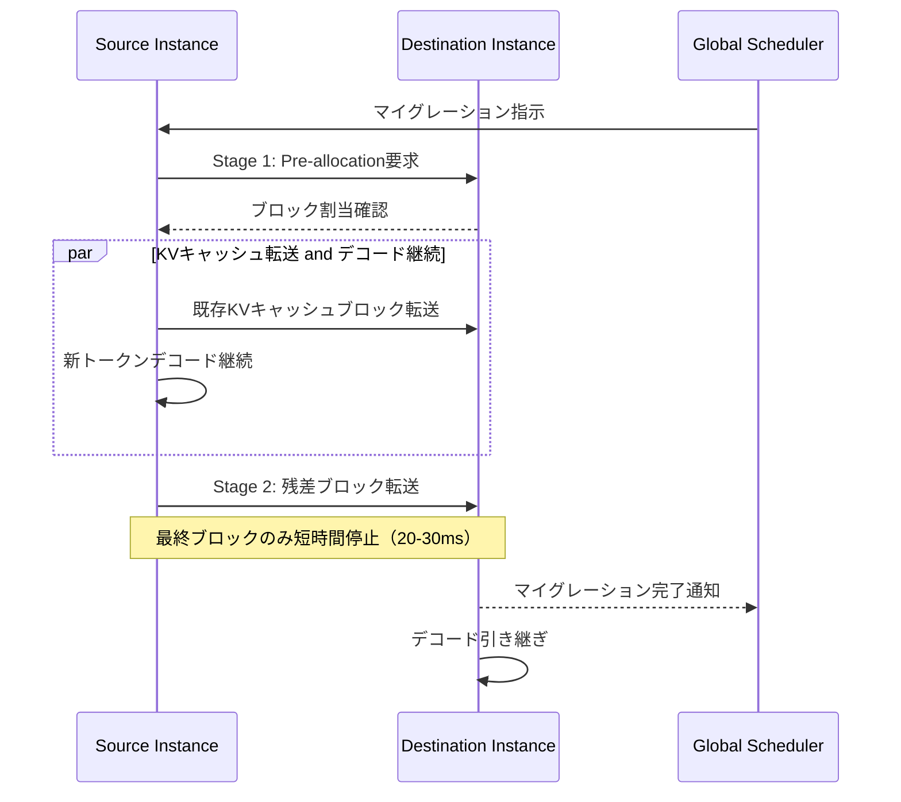
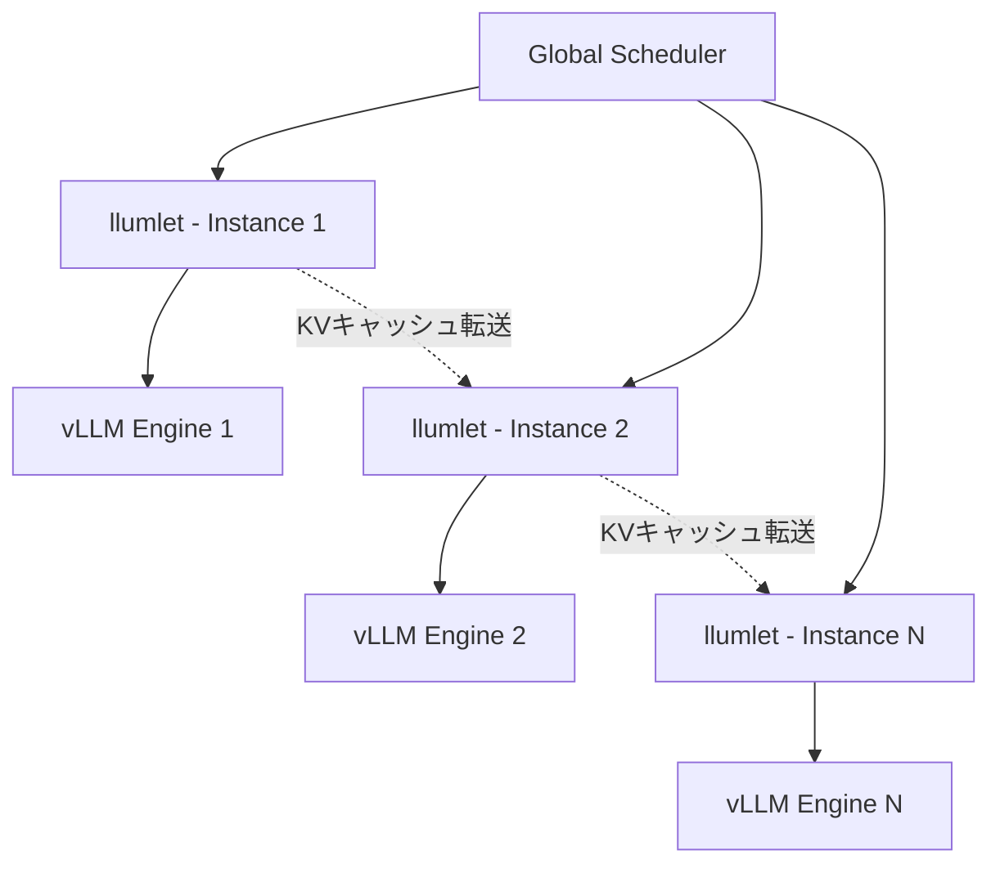
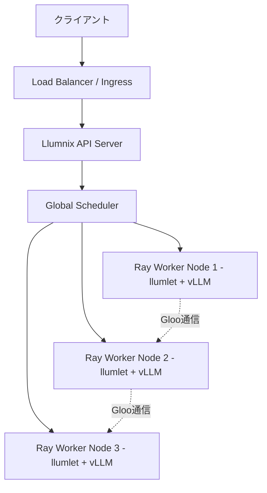

本記事は [arXiv:2406.03243 (Llumnix)](https://arxiv.org/abs/2406.03243) の解説記事です。

## 論文概要（Abstract）

Llumnixは、Alibaba Groupの研究チームが提案したLLMサービングのための動的リクエストリスケジューリングシステムである。LLMへのリクエストはアプリケーションの多様性やモデル実行の動的な性質により、リソース要求やレイテンシ要件が本質的に不均一であるという課題に対し、OSのCPUコンテキストスイッチに着想を得たライブマイグレーション機構を導入している。著者らは、テイルレイテンシを1桁（最大15倍）改善し、高優先リクエストを最大1.5倍高速化、同等のテイルレイテンシで最大36%のコスト削減を達成したと報告している。OSDI 2024（18th USENIX Symposium on Operating Systems Design and Implementation）に採択されている。

この記事は [Zenn記事: EC2 SpotインスタンスでLLM推論コストを最大70%削減する実践構成](https://zenn.dev/0h_n0/articles/235b3a2819146e) の深掘りです。

## 情報源

- **arXiv ID**: 2406.03243
- **URL**: [https://arxiv.org/abs/2406.03243](https://arxiv.org/abs/2406.03243)
- **著者**: Biao Sun, Ziming Huang, Hanyu Zhao, Wencong Xiao, Xinyi Zhang, Yong Li, Wei Lin（Alibaba Group）
- **会議**: OSDI 2024（USENIX）
- **分野**: Systems / Machine Learning Serving
- **GitHub**: [https://github.com/AlibabaPAI/llumnix](https://github.com/AlibabaPAI/llumnix)（Apache 2.0ライセンス）

## 背景と動機

LLMサービングにおいて、リクエストの不均一性は深刻な運用課題を引き起こす。チャットボットでは数トークンの短い応答から数千トークンの長文生成まで多様なリクエストが混在し、RAGやコード生成では入力プロンプト長が大きく異なる。この不均一性により、以下の3つの問題が発生する。

第一に、**負荷の不均衡**である。短いリクエストが集中するインスタンスは早期に処理を完了する一方、長いリクエストを抱えるインスタンスはキューイング遅延を蓄積する。静的なラウンドロビンやランダム分配では、この偏りを解消できない。

第二に、**KVキャッシュの断片化**である。vLLMのPagedAttentionはページ単位でGPUメモリを管理するが、リクエストの完了・中断により空きブロックが分散し、連続した大きなメモリ領域が確保できなくなる。著者らの測定では、クラスタ全体の空きメモリのうち最大7.9%が断片化により利用不能な状態となっていた。

第三に、**優先度の欠如**である。従来のLLMサービングシステムでは、課金プランやSLO要件の異なるリクエストを区別する仕組みがなく、高優先リクエストが低優先リクエストの背後で待機させられる問題があった。

Llumnixは、これら3つの課題をリクエストのライブマイグレーションという単一の機構で統一的に解決する。

## 主要な貢献

著者らは以下の4つの貢献を報告している。

- **ライブマイグレーション機構**: LLMリクエストのKVキャッシュを含むインメモリ状態を、推論を中断することなく別のモデルインスタンスへ転送する仕組みを実現。ダウンタイムはシーケンス長に依存せず、約20-30msに抑えられている
- **Virtual Usage抽象**: 物理メモリ使用量ではなく、スケジューリング目的に応じた仮想的なメモリ使用量を各リクエストに割り当てることで、負荷分散・断片化解消・優先度制御・オートスケーリングを単一のポリシーで統一
- **2階層スケジューリングアーキテクチャ**: クラスタ全体を管理するGlobal Schedulerと、各インスタンスのローカル管理を行うllumlet（ローカルスケジューラ）による分散設計
- **実運用環境での評価**: Alibaba Cloud GPUクラスタ（NVIDIA A10 x 16）でLLaMA-7B/30Bモデルを用い、ShareGPTおよびBurstGPTデータセットで評価

## 技術的詳細

### OSコンテキストスイッチとのアナロジー

Llumnixの中核アイデアは、OSのプロセススケジューリングからの類推である。OSはCPU上で実行中のプロセスのコンテキスト（レジスタ、スタック）を保存し、別のCPUコアへ移行できる。同様に、Llumnixは推論中のリクエストのコンテキスト（KVキャッシュ）を保存し、別のGPUインスタンスへ移行する。この「コンテキストスイッチ」により、リクエストの実行場所を動的に変更できるようになる。

### ライブマイグレーションのメカニズム

ライブマイグレーションの鍵は、KVキャッシュが**append-only**であるという性質の活用にある。各デコードステップで新しいトークンのKey/Valueがキャッシュに追加されるが、既存のエントリは変更されない。この性質により、VMマイグレーションで必要なダーティページ追跡が不要となる。

マイグレーションはマルチステージで実行され、典型的には2ステージで完了する。各ステージでは、ソースインスタンスが新トークンのデコードを継続しながら、既存のKVキャッシュブロックをデスティネーションインスタンスへ並行転送する。データ転送にはGloo集合通信ライブラリのSend/Recvプリミティブを使用し、GPUメモリとCPUメモリ間の転送は専用のCUDAストリームで推論をブロックしないよう設計されている。



ステージ間のハンドシェイクプロトコルにより正確性が保証される。ソースインスタンスは各ステージの開始前にデスティネーションへブロックのプリアロケーションを要求し、割当の成否を確認する。また、各ステージ完了後に対象リクエストが完了済みまたはプリエンプトされていないかを検証し、必要に応じてマイグレーションを中断する。

### Virtual Usageによる統一スケジューリング

Llumnixのスケジューリングポリシーの中核は、**Virtual Usage**（仮想使用量）の概念である。各リクエストに対して、実際の物理メモリ使用量ではなく、スケジューリング目的に応じた仮想的なメモリ使用量 $V$ を割り当てる。

インスタンスの**Freeness**（余裕度）は以下の式で計算される。

$$
F = \frac{M - \sum V}{B}
$$

ここで、$M$ はインスタンスの総GPUメモリ容量、$\sum V$ は全リクエストのVirtual Usageの合計、$B$ は現在のバッチサイズである。$F$ が大きいほどインスタンスに余裕があり、リクエストを受け入れる候補となる。

Virtual Usageの値は、スケジューリングシナリオに応じて以下のように設定される。

| シナリオ | Virtual Usage $V$ の設定 |
|---|---|
| 通常リクエスト | 実際の物理メモリ使用量 |
| キューイング中リクエスト | 要求メモリ量全体（実際にはまだ未使用） |
| 高優先リクエスト | 物理使用量 + ヘッドルームマージン |
| 終了予定インスタンス | $\infty$（無限大：全リクエストを排出） |

キューイング中のリクエストに将来の要求メモリを仮想的に割り当てることで、そのインスタンスは「過負荷」に見え、ロードバランシングポリシーが自動的にマイグレーションをトリガーする。これにより、明示的な断片化解消ロジックを書くことなく、通常のロードバランシングの延長で断片化が解消される。

### 2階層アーキテクチャ



**Global Scheduler**はクラスタ全体のリクエストディスパッチとマイグレーション判断を担当する。個々のリクエストの状態は追跡せず、各インスタンスの負荷（Freeness）のみを参照するため、スケーラビリティを確保している。

**llumlet**は各モデルインスタンスに配置されるローカルスケジューラであり、ローカルスケジューラとマイグレーションコーディネータで構成される。リクエストのVirtual Usageの計算、マイグレーション対象リクエストの選定、マイグレーションの実行協調を担当する。

## 実装のポイント

Llumnixは約3,300行のPythonコードで実装されており、vLLM上に構築されている。vLLMの連続バッチング（continuous batching）、PagedAttention、テンソル並列推論の機能をそのまま活用しつつ、マルチインスタンス間のリクエスト移動機能を追加している。

分散実行基盤としてRayを採用しており、各llumletはRay Actorとして実装されている。Ray Actorモデルにより、インスタンス間の非同期通信やマイグレーションの協調が簡潔に記述できる。

vLLMとの統合においては、以下の変更が加えられている。

- **スケジューラ拡張**: vLLMのシングルインスタンススケジューラに、マイグレーション受信・送信のフックを追加
- **メモリマネージャ拡張**: KVキャッシュブロックのリモート転送用APIを追加
- **APIサーバー互換**: vLLMのOpenAI互換APIエンドポイントをそのまま維持し、`vllm serve`コマンドをLlumnixの`llumnix serve`に置き換えるだけでデプロイ可能

## Production Deployment Guide

### 前提条件とアーキテクチャ概要

Llumnixを本番環境にデプロイする際の典型的なアーキテクチャは、EKS（Amazon Elastic Kubernetes Service）上にRayクラスタを構築し、その上でLlumnixの各コンポーネントを実行する構成である。



### Helmチャートによるデプロイ

以下はEKS上でLlumnixをデプロイするためのHelmチャートの主要設定例である。

```yaml
# values.yaml
replicaCount: 4
image:
  repository: ghcr.io/alibabapai/llumnix
  tag: "0.2.0"

model:
  name: "meta-llama/Meta-Llama-3-8B-Instruct"
  tensorParallelSize: 1
  maxModelLen: 8192

resources:
  limits:
    nvidia.com/gpu: 1
    memory: "32Gi"
  requests:
    nvidia.com/gpu: 1
    memory: "24Gi"

llumnix:
  enableMigration: true
  migrationBackend: "gloo"          # KVキャッシュ転送バックエンド
  migrationCacheBlocks: 32          # マイグレーション用バッファブロック数
  enableScaling: true               # オートスケーリング有効化
  scalingInterval: 10               # スケーリング判定間隔(秒)
  dispatchPolicy: "balanced"        # ディスパッチポリシー

ray:
  headGroupSpec:
    resources:
      cpu: "4"
      memory: "8Gi"
  workerGroupSpecs:
    - replicas: 4
      resources:
        cpu: "8"
        memory: "32Gi"
        nvidia.com/gpu: 1
```

### Karpenter NodePoolの設定

AWS Spotインスタンスを活用する場合、Karpenterで適切なNodePoolを構成する。GPUワークロード向けにはSpotインスタンスタイプのプール分散が重要である。

```yaml
apiVersion: karpenter.sh/v1
kind: NodePool
metadata:
  name: llumnix-gpu-spot
spec:
  template:
    spec:
      requirements:
        - key: karpenter.sh/capacity-type
          operator: In
          values: ["spot"]
        - key: node.kubernetes.io/instance-type
          operator: In
          values:
            - "g5.xlarge"      # A10G x 1
            - "g5.2xlarge"     # A10G x 1 + 追加CPU/メモリ
            - "g6.xlarge"      # L4 x 1
            - "g6.2xlarge"     # L4 x 1 + 追加CPU/メモリ
        - key: kubernetes.io/arch
          operator: In
          values: ["amd64"]
      nodeClassRef:
        group: karpenter.k8s.aws
        kind: EC2NodeClass
        name: gpu-nodes
  disruption:
    consolidationPolicy: WhenEmptyOrUnderutilized
    consolidateAfter: 60s
  limits:
    nvidia.com/gpu: "16"
---
apiVersion: karpenter.k8s.aws/v1
kind: EC2NodeClass
metadata:
  name: gpu-nodes
spec:
  amiSelectorTerms:
    - alias: al2023@latest
  subnetSelectorTerms:
    - tags:
        karpenter.sh/discovery: "llm-cluster"
  securityGroupSelectorTerms:
    - tags:
        karpenter.sh/discovery: "llm-cluster"
  blockDeviceMappings:
    - deviceName: /dev/xvda
      ebs:
        volumeSize: 200Gi        # モデル重み + KVキャッシュ用
        volumeType: gp3
        iops: 6000
        throughput: 400
```

### Spot中断時のドレイン戦略

Spotインスタンスの中断通知は通常2分前に発行される。Llumnixのライブマイグレーション（ダウンタイム20-30ms、マルチステージ転送を含めても数秒以内）は、この2分間の猶予時間内で十分完了可能である。

Karpenterのネイティブ中断ハンドリングと連携する設計は以下の通りである。

```yaml
# Pod Disruption Budget
apiVersion: policy/v1
kind: PodDisruptionBudget
metadata:
  name: llumnix-pdb
spec:
  maxUnavailable: 1
  selector:
    matchLabels:
      app: llumnix-worker
---
# Deployment（抜粋）
apiVersion: apps/v1
kind: Deployment
metadata:
  name: llumnix-worker
spec:
  template:
    spec:
      terminationGracePeriodSeconds: 120  # Spot 2分猶予に合わせる
      containers:
        - name: llumnix
          lifecycle:
            preStop:
              exec:
                command:
                  - "/bin/sh"
                  - "-c"
                  - |
                    # Llumnixのオートスケーリング機能を利用:
                    # Virtual Usageを無限大に設定し、
                    # 全リクエストを他インスタンスへ排出
                    curl -X POST localhost:8080/admin/drain
                    sleep 90  # マイグレーション完了を待機
```

Llumnixの設計上、終了予定インスタンスのVirtual Usageを$\infty$に設定するだけで、ロードバランシングポリシーが自動的に全リクエストを他の健全なインスタンスへマイグレーションする。これはSpotインスタンスのドレインと概念的に一致する。

### モニタリングとオブザーバビリティ

本番運用では以下のメトリクスを監視することが推奨される。

```yaml
# Prometheus ServiceMonitor
apiVersion: monitoring.coreos.com/v1
kind: ServiceMonitor
metadata:
  name: llumnix-metrics
spec:
  selector:
    matchLabels:
      app: llumnix
  endpoints:
    - port: metrics
      interval: 15s
```

監視すべき主要メトリクスは以下の通りである。

| メトリクス | 説明 | アラート閾値の目安 |
|---|---|---|
| `llumnix_request_p99_latency_seconds` | P99レイテンシ | SLO依存（例: 5秒） |
| `llumnix_migration_count_total` | マイグレーション実行回数 | 急激な増加時に要調査 |
| `llumnix_migration_downtime_ms` | マイグレーションダウンタイム | 50ms超で警告 |
| `llumnix_instance_freeness` | 各インスタンスのFreeness | 0に近づくとメモリ逼迫 |
| `llumnix_kv_cache_fragmentation_ratio` | KVキャッシュ断片化率 | 5%超で警告 |
| `llumnix_queue_depth` | 未処理リクエスト数 | スケールアウト判断基準 |

### 負荷テストの実施

デプロイ後は、ShareGPTデータセットを用いた負荷テストで性能ベースラインを確認する。

```bash
# vLLM benchmarkツールを利用した負荷テスト
python -m vllm.entrypoints.openai.api_server \
  --model meta-llama/Meta-Llama-3-8B-Instruct \
  --port 8000

# ShareGPTデータセットでベンチマーク
python benchmark_serving.py \
  --backend openai \
  --base-url http://localhost:8000 \
  --dataset-name sharegpt \
  --dataset-path ShareGPT_V3_unfiltered_cleaned_split.json \
  --model meta-llama/Meta-Llama-3-8B-Instruct \
  --num-prompts 1000 \
  --request-rate 10
```

### コスト試算

著者らの実験構成（A10 x 16）をAWS Spot価格で概算すると、以下のようになる。

| 項目 | On-Demand | Spot（推定） |
|---|---|---|
| g5.xlarge 単価/時間 | $1.006 | $0.30-0.50 |
| 16 GPU クラスタ/月 | 約$11,589 | 約$3,477-5,795 |
| Llumnixによる追加削減 | - | 最大36%削減 |
| **最終コスト見積もり** | $11,589 | **$2,225-3,709** |

Spot割引（50-70%）とLlumnixの効率化（最大36%）を組み合わせることで、On-Demand比で最大80%のコスト削減が理論上可能である。ただし、Spot中断頻度やマイグレーションオーバーヘッドにより実際の削減率は変動する点に留意が必要である。

## 実験結果

著者らはNVIDIA A10 GPU（24GB）を4基搭載したマシン4台（計16 GPU）のクラスタで評価を行っている。モデルはLLaMA-7B（単一GPU）とLLaMA-30B（テンソル並列4 GPU）を使用し、ShareGPTおよびBurstGPTの実トレースデータで評価している。

主要な実験結果は以下の通りである。

- **テイルレイテンシ**: P99 First-Token Latencyを最大15倍改善（INFaaS比）、P99 Decode Latencyを最大2倍改善
- **優先度制御**: 高優先リクエストの処理速度を最大1.5倍高速化
- **コスト効率**: 同等のテイルレイテンシで最大36%のコスト削減
- **断片化解消**: KVキャッシュの断片化率を7.9%から0.7%へ削減（92%改善）
- **プリエンプション損失**: ラウンドロビン比で平均84%削減
- **マイグレーションダウンタイム**: シーケンス長に依存せず約20-30ms（一定）

マイグレーションダウンタイムがシーケンス長に依存しないという結果は、KVキャッシュのappend-only特性を活用したパイプライン転送の有効性を示している。

## 実運用への応用

### Karpenter + Spotとの組み合わせ

Llumnixのライブマイグレーション機構は、AWS Spotインスタンスの中断ハンドリングと相性がよい。Karpenterは中断通知を受信すると自動的にノードをcordon・drainするが、通常のPodの場合、進行中のリクエストは失われる。Llumnixを組み合わせることで、中断対象インスタンス上のリクエストを他の健全なインスタンスへKVキャッシュごとマイグレーションでき、リクエストの損失を回避できる。

Virtual Usageの$\infty$設定による自動ドレインは、Spotの2分間猶予時間に対してマイグレーション（数秒）が十分短いため、実用的に機能すると考えられる。

### マルチテナント環境での活用

SaaS型のLLMサービスでは、テナントごとに異なるSLO要件を持つケースが多い。Llumnixの優先度制御機能により、Premium顧客のリクエストにメモリヘッドルームを確保し、Free Tier顧客のリクエストの影響を受けにくくする運用が可能である。

### vLLM Production Stackとの統合

2025年1月にリリースされたvLLM Production Stackは、KubernetesネイティブなマルチインスタンスvLLMデプロイメントを提供している。Llumnixはvllm serveコマンドをllumnix serveに置き換えるだけで利用可能であり、既存のvLLMベースのデプロイメントへの導入障壁は低い。

## 関連研究

### SpotServe（ASPLOS 2024）

SpotServeは、プリエンプティブルインスタンス上でLLMを提供するための最初の分散サービングシステムである（[arXiv:2311.15566](https://arxiv.org/abs/2311.15566)）。動的な並列化構成の再構成、Kuhn-Munkresアルゴリズムによる最適マイグレーション計画、ステートフル推論リカバリを特徴とする。P99テイルレイテンシを2.4-9.1倍改善し、On-Demand比54%のコスト削減を達成したと報告されている。Llumnixとの違いは、SpotServeがインスタンスの増減（水平スケーリング）に焦点を当てるのに対し、Llumnixは固定クラスタ内でのリクエスト再配置に焦点を当てている点である。

### vLLM / PagedAttention（SOSP 2023）

vLLMは、OSの仮想メモリとページングに着想を得たPagedAttentionによりKVキャッシュメモリの断片化を解消するLLM推論エンジンである（[arXiv:2309.06180](https://arxiv.org/abs/2309.06180)）。メモリの無駄を4%以下に削減し、スループットを2-4倍向上させた。LlumnixはvLLM上に構築されており、PagedAttentionによるブロック管理をマイグレーションのデータ転送単位としても活用している。

### Orca（OSDI 2022）

Orcaは、イテレーションレベルスケジューリング（連続バッチング）を導入したLLMサービングシステムである。リクエスト単位ではなくイテレーション単位でスケジューリングすることで、GPT-3 175Bモデルで36.9倍のスループット向上を達成したと報告されている。Llumnixは連続バッチングを前提としつつ、さらにマルチインスタンス間でのリクエスト再配置を加えた上位レイヤーとして位置づけられる。

### llm-d（2025）

Red Hat、Google Cloud、IBM Research、NVIDIA、CoreWeaveが共同で開発するllm-dは、Kubernetesネイティブな分散LLMサービングフレームワークである。Prefill/Decodeの分離（Disaggregated Serving）を特徴としており、Llumnixのマイグレーション機構と相補的な関係にある。

## まとめと今後の展望

Llumnixは、LLMサービングにおけるリクエストの不均一性という根本的な課題に対し、OSのコンテキストスイッチに着想を得たライブマイグレーション機構と、Virtual Usageによる統一スケジューリングポリシーで解決した。3,300行のPythonコードという比較的小さな実装でありながら、テイルレイテンシ15倍改善、コスト36%削減という実用的な成果を示している。

今後の展望としては、Disaggregated Serving（Prefill/Decode分離）との統合、GPU間の高速インターコネクト（NVLink、NVSwitch）を活用したマイグレーション高速化、およびSpotインスタンスの中断予測と組み合わせたプロアクティブなマイグレーションが考えられる。

## 参考文献

1. Biao Sun et al., "Llumnix: Dynamic Scheduling for Large Language Model Serving," OSDI 2024. [arXiv:2406.03243](https://arxiv.org/abs/2406.03243)
2. Miao et al., "SpotServe: Serving Generative Large Language Models on Preemptible Instances," ASPLOS 2024. [arXiv:2311.15566](https://arxiv.org/abs/2311.15566)
3. Kwon et al., "Efficient Memory Management for Large Language Model Serving with PagedAttention," SOSP 2023. [arXiv:2309.06180](https://arxiv.org/abs/2309.06180)
4. Yu et al., "Orca: A Distributed Serving System for Transformer-Based Generative Models," OSDI 2022. [USENIX](https://www.usenix.org/conference/osdi22/presentation/yu)
5. Llumnix GitHub Repository. [https://github.com/AlibabaPAI/llumnix](https://github.com/AlibabaPAI/llumnix)
6. vLLM Production Stack. [https://github.com/vllm-project/production-stack](https://github.com/vllm-project/production-stack)

---

*本記事はAIによって生成されました。内容の正確性については原論文をご確認ください。*
