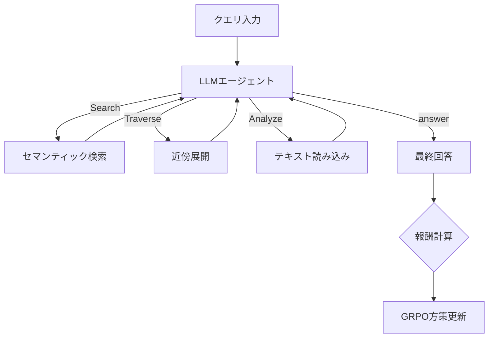

本記事は [arXiv:2507.21892 (Graph-R1)](https://arxiv.org/abs/2507.21892) の解説記事です。

## 論文概要（Abstract）

Graph-R1は、LLMエージェントをGRPO（Group Relative Policy Optimization）で訓練し、知識グラフ上のインタラクティブな動的探索を通じて多ホップ質問応答を行うEnd-to-Endフレームワークである。著者らは、従来のGraphRAGが持つ静的パイプラインの硬直性・エラー伝播・人手設計のサブグラフ構築という限界に対し、Search/Traverse/Analyzeの3アクションによるエージェント型探索を提案している。Qwen2.5-7Bをベースモデルとして、2WikiMultiHopQA・HotpotQA・MuSiQueの3データセットで従来手法を上回る性能を報告している。

この記事は [Zenn記事: Graph-RAG×強化学習で社内文書検索の想起率を最適化する実装手法](https://zenn.dev/0h_n0/articles/1d8af4cd009662) の深掘りです。

## 情報源

- **arXiv ID**: 2507.21892
- **URL**: [https://arxiv.org/abs/2507.21892](https://arxiv.org/abs/2507.21892)
- **著者**: Zichen Chen, Jiaxing Huang, Wei Lu（Singapore University of Technology and Design）
- **発表年**: 2025年7月
- **分野**: cs.AI, cs.IR, cs.CL

## 背景と動機（Background & Motivation）

従来のGraphRAGは「固定パイプライン型」のアーキテクチャを採用している。Entity Extraction → Graph Construction → Community Detection → Answer Generationという順序で処理を行うが、各ステージは独立に最適化されるためエラーが伝播する。例えば、エンティティ抽出段階で重要なエンティティを見落とすと、後段のグラフ構築・回答生成の精度が連鎖的に低下する。

また、従来手法は部分グラフの構築方法が人手で設計されており（固定ホップ数、固定サイズなど）、クエリの複雑度に応じた適応が困難である。Graph-R1は、これらの問題をMDP（マルコフ決定過程）として定式化し、エージェントがグラフ上で自律的に探索行動を決定できるようにする。

## 主要な貢献（Key Contributions）

- **MDP定式化**: グラフ探索を状態・アクション・報酬のMDPとして再定義
- **3アクション設計**: Search（セマンティック検索）、Traverse（近傍展開）、Analyze（テキスト読み込み）の3種で柔軟な探索を実現
- **Cold Start SFT**: RL学習の前にデモンストレーションデータでの教師あり微調整を行い、探索の安定性を向上
- **Cross-Graph Generalization**: アクション空間を介したグラフインタラクションにより、訓練データと異なるグラフへのゼロショット転移が可能

## 技術的詳細（Technical Details）

### MDP定式化

Graph-R1はグラフ探索をMDPとして定式化する。

- **状態** $s_t$: 現在のノード集合、これまでの探索軌跡、質問
- **アクション** $a_t \in \{\text{Search}, \text{Traverse}, \text{Analyze}\}$
- **報酬** $r$: 最終回答の正確性に基づくスパース報酬

エージェントは3アクションを任意の順序・回数で繰り返し、`<answer>` タグで回答を出力するまで探索を継続する。

### 3アクションの設計

| アクション | 入力 | 動作 | 出力 |
|---|---|---|---|
| **Search(query)** | テキストクエリ | グラフ内のセマンティック検索 | 候補ノード集合 |
| **Traverse(node_id)** | ノードID | 指定ノードの近傍を展開 | 隣接ノード・エッジ情報 |
| **Analyze(node_ids)** | ノードID集合 | 選択ノードのテキスト内容を読み込む | 詳細テキスト |

この設計により、エージェントは以下のような戦略を学習できる。

1. まずSearchで候補エンティティを特定する
2. Traverseで関連エンティティの周辺を探索する
3. Analyzeで重要なノードの詳細テキストを確認する
4. 十分な情報が集まったら回答を生成する



### GRPOによるEnd-to-End学習

Graph-R1はGRPOを採用している。同一プロンプトに対してグループサイズ $G$ のサンプル軌跡を生成し、グループ内の相対的なアドバンテージで方策を更新する。

$$
\hat{A}_{i,t} = \frac{r_i - \text{mean}(\{r_j\}_{j=1}^G)}{\text{std}(\{r_j\}_{j=1}^G)}
$$

GRPO目的関数は以下のように定義される。

$$
\mathcal{L}_{\text{GRPO}}(\theta) = -\mathbb{E}\left[\frac{1}{G}\sum_{i=1}^{G}\frac{1}{|o_i|}\sum_{t=1}^{|o_i|}\min\left(\frac{\pi_\theta(o_{i,t}|q, o_{i,<t})}{\pi_{\theta_{\text{old}}}(o_{i,t}|q, o_{i,<t})}\hat{A}_{i,t},\ \text{clip}(\cdot, 1-\epsilon, 1+\epsilon)\hat{A}_{i,t}\right) - \beta D_{\text{KL}}(\pi_\theta \| \pi_{\text{ref}})\right]
$$

ここで $o_i$ は $i$ 番目のサンプル軌跡、$o_{i,t}$ はそのトークン $t$、$\epsilon$ はクリッピング閾値、$\beta$ はKL正則化係数である。PPOのようにクリティックネットワークを必要としないため、計算コストが低い。

### 報酬関数

報酬は正確性報酬とフォーマット報酬の和で構成される。

$$
r = r_{\text{acc}} + \lambda \cdot r_{\text{fmt}}
$$

- $r_{\text{acc}}$: 最終回答が正解と一致するか（F1またはexact matchベース）
- $r_{\text{fmt}}$: 出力が `<think>...</think><answer>...</answer>` の指定フォーマットに従っているか（0 or 1）
- $\lambda \approx 0.1$: バランス係数

### Cold Start SFT戦略

RL学習を安定化するため、Graph-R1はDeepSeek-R1のCold Start戦略に倣い、少量のデモンストレーションデータ（正しいアクション列）でSFTを行ってからGRPOに移行する。

この段階で、モデルは3つのアクションの使い方と `<think>...<answer>...` フォーマットを学習する。Cold Start SFTを省略した場合、アブレーション分析（論文中の実験）で-6〜8% F1の性能低下が報告されており、RL探索の初期安定性に寄与している。

### グラフ構築

テキストコーパスからの知識グラフ構築は以下の手順で行う。

1. テキストをチャンク分割（デフォルト1200トークン、オーバーラップ100トークン）
2. LLMでエンティティ・関係を抽出
3. ノード: テキストチャンク + 抽出済みエンティティの両方
4. エッジ: エンティティ間関係 + チャンク間の共起関係

### アルゴリズム

```python
from dataclasses import dataclass, field
from typing import Literal

@dataclass
class GraphR1State:
    """Graph-R1のエージェント状態"""
    query: str
    current_nodes: set[str] = field(default_factory=set)
    trajectory: list[dict] = field(default_factory=list)
    search_results: list[dict] = field(default_factory=list)
    analyzed_texts: list[str] = field(default_factory=list)
    max_steps: int = 10
    current_step: int = 0

ActionType = Literal["search", "traverse", "analyze", "answer"]

def graph_r1_step(
    state: GraphR1State,
    action: ActionType,
    action_input: str | list[str],
    graph_env: dict,
) -> GraphR1State:
    """Graph-R1の1ステップ実行

    Args:
        state: 現在のエージェント状態
        action: 実行するアクション（search/traverse/analyze/answer）
        action_input: アクションの入力（クエリ文字列 or ノードIDリスト）
        graph_env: グラフ環境（ノード・エッジ情報）
    Returns:
        更新されたエージェント状態
    """
    state.current_step += 1

    if action == "search":
        results = semantic_search(graph_env, action_input, top_k=10)
        state.search_results.extend(results)
        state.current_nodes.update(r["node_id"] for r in results)

    elif action == "traverse":
        for node_id in ([action_input] if isinstance(action_input, str) else action_input):
            neighbors = get_neighbors(graph_env, node_id)
            state.current_nodes.update(n["node_id"] for n in neighbors)

    elif action == "analyze":
        node_ids = [action_input] if isinstance(action_input, str) else action_input
        for node_id in node_ids:
            text = get_node_text(graph_env, node_id)
            state.analyzed_texts.append(text)

    state.trajectory.append({"action": action, "input": action_input, "step": state.current_step})
    return state

def compute_graph_r1_reward(
    predicted_answer: str,
    gold_answer: str,
    format_valid: bool,
    lambda_fmt: float = 0.1,
) -> float:
    """Graph-R1の報酬計算

    Args:
        predicted_answer: モデルの予測回答
        gold_answer: 正解回答
        format_valid: 出力フォーマットが正しいか
        lambda_fmt: フォーマット報酬の重み
    Returns:
        総合報酬スコア
    """
    f1 = compute_f1(predicted_answer, gold_answer)
    fmt = 1.0 if format_valid else 0.0
    return f1 + lambda_fmt * fmt
```

## 実装のポイント（Implementation）

- **ベースモデル**: Qwen2.5-7B-Instruct
- **チャンクサイズ**: 1200トークン（オーバーラップ100トークン）
- **最大ステップ数**: 探索ステップの上限設定が必要。長すぎるとコンテキスト長制限に到達する

アブレーション分析（論文中の実験結果）によると、Analyzeアクションの除去が最も性能低下が大きく（-12〜15% F1）、グラフ構造だけでなくテキスト内容の読み込みが最重要であることを示している。Searchの除去が-8〜10%、Traverseの除去が-5〜7%と報告されている。

## Production Deployment Guide

### AWS実装パターン（コスト最適化重視）

Graph-R1はグラフ環境とのマルチステップインタラクションが必要であり、推論レイテンシがやや高い。

| 規模 | 月間リクエスト | 推奨構成 | 月額コスト目安 | 主要サービス |
|------|--------------|---------|-------------|------------|
| **Small** | ~3,000 (100/日) | Serverless | $80-200 | Lambda + Neptune Serverless + Bedrock |
| **Medium** | ~30,000 (1,000/日) | Hybrid | $500-1,200 | ECS Fargate + Neptune + OpenSearch |
| **Large** | 300,000+ (10,000/日) | Container | $3,500-7,000 | EKS + Neptune + GPU (g5.xlarge) |

**コスト削減テクニック**:
- エージェントの最大ステップ数を制限（推奨: 10ステップ以下）
- Analyzeで取得するテキスト量の上限設定
- 類似クエリの探索軌跡キャッシング（DynamoDB TTL付き）
- Neptune Serverlessでアイドル時コスト最小化

**コスト試算の注意事項**: 上記は2026年6月時点のAWS ap-northeast-1（東京）リージョン料金に基づく概算値です。最新料金は [AWS料金計算ツール](https://calculator.aws/) で確認してください。

### Terraformインフラコード

```hcl
module "vpc" {
  source  = "terraform-aws-modules/vpc/aws"
  version = "~> 5.0"

  name = "graph-r1-vpc"
  cidr = "10.0.0.0/16"
  azs  = ["ap-northeast-1a", "ap-northeast-1c"]
  private_subnets = ["10.0.1.0/24", "10.0.2.0/24"]

  enable_nat_gateway   = false
  enable_dns_hostnames = true
}

resource "aws_lambda_function" "graph_r1_handler" {
  filename      = "lambda.zip"
  function_name = "graph-r1-handler"
  role          = aws_iam_role.lambda_graph_r1.arn
  handler       = "index.handler"
  runtime       = "python3.12"
  timeout       = 120
  memory_size   = 2048

  environment {
    variables = {
      BEDROCK_MODEL_ID  = "anthropic.claude-3-5-haiku-20241022-v1:0"
      NEPTUNE_ENDPOINT  = aws_neptune_cluster.kg.endpoint
      MAX_AGENT_STEPS   = "10"
      CHUNK_SIZE        = "1200"
      CHUNK_OVERLAP     = "100"
    }
  }
}

resource "aws_neptune_cluster" "kg" {
  cluster_identifier = "graph-r1-kg"
  engine             = "neptune"
  serverless_v2_scaling_configuration {
    min_capacity = 1.0
    max_capacity = 8.0
  }
  skip_final_snapshot = true
}
```

### コスト最適化チェックリスト

- [ ] エージェント最大ステップ数: 10以下に制限
- [ ] Analyzeテキスト上限: ノードあたり500トークン
- [ ] Neptune Serverless: アイドル時自動スケールダウン
- [ ] 探索軌跡キャッシュ: DynamoDB TTL 24時間
- [ ] Lambda タイムアウト: 120秒（マルチステップ探索に対応）
- [ ] Bedrock Batch API: 非リアルタイム処理で50%割引
- [ ] AWS Budgets: 月額予算アラート設定
- [ ] CloudWatch: Lambda Duration P95監視

## 実験結果（Results）

論文のメイン比較表（Table 1相当）より、Graph-R1の性能を示す。数値は論文テキストからの読み取り値。

| データセット | Naive RAG | GraphRAG (Microsoft) | LightRAG | **Graph-R1** |
|------------|-----------|---------------------|----------|-------------|
| 2WikiMultiHopQA (F1) | ~45-50% | ~52% | ~58% | **~72-75%** |
| HotpotQA (F1) | ~55% | ~58% | ~62% | **~74-76%** |
| MuSiQue (F1) | ~30-40% | — | — | **~50-55%** |

LightRAGに対して2WikiMultiHopQAで約+13〜15 F1ポイントの改善が報告されている。

Cross-Graph Generalization実験では、2WikiMultiHopQAで訓練したモデルをHotpotQAのグラフに転移してもベースラインを上回る性能を維持しており、特定グラフへの過適合が起きていないことが確認されている。

アブレーション（論文中の実験）から、各コンポーネントの貢献度は以下の通りである。

| 設定 | F1変化 |
|------|--------|
| w/o Search | -8〜10% |
| w/o Traverse | -5〜7% |
| w/o Analyze | -12〜15% |
| w/o Cold Start SFT | -6〜8% |
| w/o RL (SFT only) | -10〜12% |

## 実運用への応用（Practical Applications）

Graph-R1のアクション空間（Search/Traverse/Analyze）は、社内文書検索システムに直接マッピングできる。Searchは全文検索API、TraverseはKGのリレーション探索、Analyzeは文書の詳細読み込みに対応する。

ただし以下の制約がある。第一に、グラフ構築の前処理コストが高い（LLMによるエンティティ・関係抽出が必要）。第二に、アクション空間がSearch/Traverse/Analyzeの3種に限定されており、より複雑なオペレーション（例: SQLクエリ実行、API呼び出し）は表現できない。第三に、Analyzeアクションで大量のテキストを取得するとLLMのコンテキスト長制限に到達する可能性がある。

## 関連研究（Related Work）

- **LightRAG (arXiv:2410.05779)**: 軽量なGraphRAG。Graph-R1はRL訓練により動的探索を実現し、F1で+13〜15ポイント改善
- **GraphRAG-R1 (arXiv:2507.23581)**: 同時期のプロセス制約付きRL GraphRAG。CoTベースで構造化された出力を生成する点がGraph-R1のアクションベースアプローチと異なる
- **HippoRAG (arXiv:2405.14831)**: 長期記憶を模倣したRAGフレームワーク。グラフ構造を使う点は共通だが、RL訓練は行わない

## まとめと今後の展望

Graph-R1は、Search/Traverse/Analyzeの3アクションによるエージェント型探索と、GRPOによるEnd-to-End RL訓練を組み合わせることで、従来のGraphRAGを大幅に上回る性能を報告している。特にAnalyzeアクション（テキスト読み込み）が最重要であるというアブレーション結果は、グラフ構造だけでなく原文テキストへのアクセスが不可欠であることを示唆しており、実装時の設計判断に有用な知見である。Cross-Graph Generalizationの実証も、ドメイン横断的な適用可能性を示している。

## 参考文献

- **arXiv**: [https://arxiv.org/abs/2507.21892](https://arxiv.org/abs/2507.21892)
- **Related Zenn article**: [https://zenn.dev/0h_n0/articles/1d8af4cd009662](https://zenn.dev/0h_n0/articles/1d8af4cd009662)
