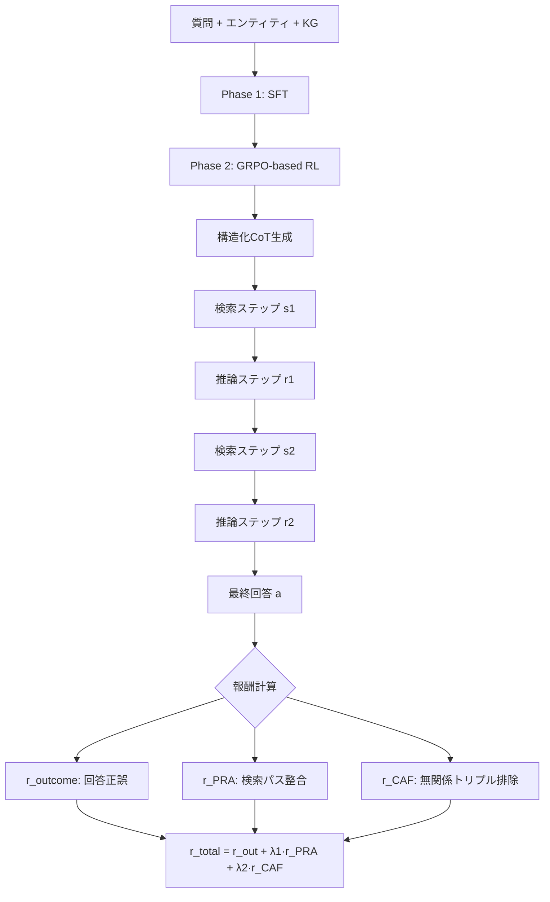

本記事は [arXiv:2507.23581 (GraphRAG-R1)](https://arxiv.org/abs/2507.23581) の解説記事です。

## 論文概要（Abstract）

GraphRAG-R1は、知識グラフ（KG）上での検索と推論を強化学習（RL）で結合最適化するフレームワークである。著者らは既存GraphRAGの3つの限界 — 固定検索パイプライン、結果のみに基づく報酬、密部分グラフによるノイズ — に対し、プロセス制約付きRLを提案している。2つのプロセス認識型報酬関数 PRA（Progressive Retrieval Alignment）とCAF（Context-Aware Filtering）をGRPOフレームワークに統合し、3つの実世界ベンチマークでSOTAを達成したと報告されている。WWW 2026に採択。

この記事は [Zenn記事: Graph-RAG×強化学習で社内文書検索の想起率を最適化する実装手法](https://zenn.dev/0h_n0/articles/1d8af4cd009662) の深掘りです。

## 情報源

- **会議名**: ACM Web Conference 2026 (WWW '26)
- **arXiv ID**: 2507.23581
- **URL**: [https://arxiv.org/abs/2507.23581](https://arxiv.org/abs/2507.23581)
- **著者**: Yuxuan Liang, Jiawei Liu, Yuchen Shi et al.（計10名、Squall Lab Singapore / UW-Madison / UC Davis / Microsoft Research）
- **DOI**: 10.1145/3696410.3714825
- **コード**: [https://github.com/HKUDS/GraphRAG-R1](https://github.com/HKUDS/GraphRAG-R1)

## カンファレンス情報

WWW（The Web Conference）はWeb技術・情報検索分野のトップ会議の1つである。GraphRAG-R1は12ページの査読論文として採択されている。

## 背景と動機（Background & Motivation）

既存のGraphRAGアプローチには3つの構造的な限界がある。

第一に、**固定検索パイプライン**の問題である。ToG（Think-on-Graph）やSubgraphRAGなどの既存手法は、事前に定義された静的な検索プロセスに依存しており、推論の途中で検索戦略を調整できない。

第二に、**結果のみに基づく報酬**の問題である。RoG（Reasoning on Graphs）のようなRLベースの手法は最終回答の正誤のみを報酬として使用するため、中間検索ステップの品質を制御できない。最終回答が偶然正解しても、検索プロセスが非効率な場合がある。

第三に、**密部分グラフによるノイズ**の問題である。SubgraphRAGのように大きな部分グラフを取得する手法は、無関係なエンティティや関係を含んでしまい、LLMの推論を妨げる。

## 主要な貢献（Key Contributions）

- **PRA報酬**: 中間検索ステップを正解推論パスに整合させるプロセスレベルの報酬
- **CAF報酬**: 検索部分グラフ内の無関係トリプルにペナルティを課し、精密な部分グラフ構築を促進
- **プロセスレベルのトレーニングデータ**: ステップバイステップの検索・推論アノテーション付き学習データセットの構築
- **7Bモデルで大規模モデルに匹敵**: Qwen2.5-7BベースでGPT-4oベースのGraphRAGシステムと同等以上の性能

## 技術的詳細（Technical Details）

### タスク定式化と構造化CoT

入力は3つ組 $(q, e_q, G)$ — 質問 $q$、質問エンティティ $e_q$、知識グラフ $G = (E, R, T)$ である。モデルは検索ステップ $s_i$ と推論ステップ $r_i$ を交互に繰り返す構造化CoT（Chain of Thought）を生成し、最終回答 $a$ を出力する。

$$
\text{CoT} = \{(s_1, r_1), (s_2, r_2), \ldots, (s_n, r_n), a\}
$$

各検索ステップでモデルはKGからトリプルを選択し、各推論ステップで取得した情報に基づいて理解を更新する。これにより、検索と推論が密に連携した動的な探索が可能になる。

### GRPO（Group Relative Policy Optimization）

GraphRAG-R1はDeepSeek-R1で提案されたGRPOフレームワークを採用している。同一入力 $x$ に対してグループサイズ $G$ のサンプルを生成し、相対的なアドバンテージを計算する。

$$
A_i = \frac{r_i - \text{mean}(\mathbf{r})}{\text{std}(\mathbf{r})}
$$

ここで $r_i$ は $i$ 番目の出力に対するスカラー報酬、$\mathbf{r} = \{r_1, \ldots, r_G\}$ はグループ全体の報酬ベクトルである。

GRPO目的関数はクリッピング付きサロゲート目的関数とKL正則化で構成される。

$$
\mathcal{L}_{\text{GRPO}}(\theta) = \mathbb{E}\left[\frac{1}{G}\sum_{i=1}^{G}\min\left(\frac{\pi_\theta(o_i|x)}{\pi_{\theta_{\text{old}}}(o_i|x)}A_i,\ \text{clip}\left(\cdot,\ 1-\epsilon,\ 1+\epsilon\right)A_i\right) - \beta D_{\text{KL}}(\pi_\theta \| \pi_{\text{ref}})\right]
$$

ここで $\epsilon$ はクリッピング閾値、$\beta$ はKL正則化の強度、$\pi_{\text{ref}}$ は参照方策である。PPOと異なりクリティックネットワークが不要なため、計算コストが低い。

### PRA報酬（Progressive Retrieval Alignment）

PRA報酬は、各検索ステップ $i$ で取得したトリプル集合 $s_i$ が、正解推論パスの $i$ 番目のトリプル $p_i^*$ とどの程度整合しているかを測定する。

$$
r_{\text{PRA}}^i = \frac{|s_i \cap p_i^*|}{|p_i^*|}
$$

全ステップの平均が全体PRA報酬となる。

$$
r_{\text{PRA}} = \frac{1}{n}\sum_{i=1}^{n} r_{\text{PRA}}^i
$$

この報酬により、最終回答が正解であっても非効率な検索を行った場合は低い報酬となり、検索プロセス自体の質が制御される。

### CAF報酬（Context-Aware Filtering）

CAF報酬は、検索した部分グラフ内の無関係トリプルの割合にペナルティを課す。

$$
r_{\text{CAF}} = 1 - \frac{|\text{検索部分グラフ内の無関係トリプル}|}{|\text{検索部分グラフ内の全トリプル}|}
$$

ここで「無関係トリプル」は、正解推論パス上にないトリプルと定義される。この報酬により、モデルは必要最小限のトリプルのみを含む精密な部分グラフを構築するように学習する。

### 総合報酬関数

3つの報酬を線形結合して最終報酬とする。

$$
r_{\text{total}} = r_{\text{outcome}} + \lambda_1 r_{\text{PRA}} + \lambda_2 r_{\text{CAF}}
$$

$r_{\text{outcome}}$ は最終回答の正誤（正解で1、不正解で0）、$\lambda_1, \lambda_2$ はプロセス報酬の重みパラメータである。



### トレーニングパイプライン

GraphRAG-R1は2段階で学習する。

**Phase 1: SFT（Supervised Fine-Tuning）**ではプロセスレベルのデータセットで構造化CoTのフォーマットを学習する。トレーニングデータは、KGからground-truth推論パス（質問エンティティから回答エンティティへのトリプルチェーン）を抽出し、各ステップに検索・推論のアノテーションを付与して構築する。

**Phase 2: GRPO-based RL**では、SFTで初期化したモデルに対してGRPOを適用し、$r_{\text{total}}$ を最大化するように方策を更新する。

### アルゴリズム

```python
from dataclasses import dataclass, field

@dataclass
class GraphRAGR1State:
    """GraphRAG-R1の構造化CoT状態"""
    question: str
    question_entity: str
    retrieval_steps: list[list[dict]] = field(default_factory=list)
    reasoning_steps: list[str] = field(default_factory=list)
    answer: str = ""

def compute_pra_reward(
    retrieval_steps: list[list[dict]],
    ground_truth_path: list[dict],
) -> float:
    """Progressive Retrieval Alignment報酬

    各検索ステップが正解推論パスとどの程度整合しているかを計算する。
    """
    if not retrieval_steps or not ground_truth_path:
        return 0.0

    n = min(len(retrieval_steps), len(ground_truth_path))
    total = 0.0
    for i in range(n):
        retrieved = set(tuple(t.items()) for t in retrieval_steps[i])
        gt = set(tuple(t.items()) for t in [ground_truth_path[i]])
        if gt:
            total += len(retrieved & gt) / len(gt)
    return total / n

def compute_caf_reward(
    retrieved_subgraph: list[dict],
    ground_truth_paths: set,
) -> float:
    """Context-Aware Filtering報酬

    検索部分グラフ内の無関係トリプルの割合にペナルティを課す。
    """
    if not retrieved_subgraph:
        return 0.0

    irrelevant = sum(
        1 for t in retrieved_subgraph
        if tuple(t.items()) not in ground_truth_paths
    )
    return 1.0 - irrelevant / len(retrieved_subgraph)

def compute_total_reward(
    answer_correct: bool,
    retrieval_steps: list[list[dict]],
    ground_truth_path: list[dict],
    retrieved_subgraph: list[dict],
    ground_truth_paths: set,
    lambda_1: float = 0.5,
    lambda_2: float = 0.3,
) -> float:
    """GraphRAG-R1の総合報酬"""
    r_outcome = 1.0 if answer_correct else 0.0
    r_pra = compute_pra_reward(retrieval_steps, ground_truth_path)
    r_caf = compute_caf_reward(retrieved_subgraph, ground_truth_paths)
    return r_outcome + lambda_1 * r_pra + lambda_2 * r_caf
```

## 実装のポイント（Implementation）

- **ベースモデル**: Qwen2.5-7B（主実験）。7Bパラメータの比較的小さなモデルでGPT-4oベースシステムに匹敵する性能を達成
- **KG**: Freebase（WebQSP, CWQ, GrailQA全て）
- **トレーニング**: SFT → GRPO の2段階。SFT段階でground-truthパスのアノテーション付きデータが必要
- **PRA報酬の制約**: ground-truth推論パスが必要であり、パスが抽出できないドメインでは直接適用が困難

PRA報酬のground-truthパス要件は実運用上の大きな制約である。社内文書検索など、正解パスを事前に定義できないドメインでは、LLM-as-Judgeによる疑似ラベリングや、ユーザーフィードバックからの弱教師あり学習が代替手段として考えられる。

## Production Deployment Guide

### AWS実装パターン（コスト最適化重視）

GraphRAG-R1はKG上のマルチステップ推論を行うため、KGストレージと推論用GPUが必要になる。

| 規模 | 月間リクエスト | 推奨構成 | 月額コスト目安 | 主要サービス |
|------|--------------|---------|-------------|------------|
| **Small** | ~3,000 (100/日) | Serverless | $100-250 | Lambda + Bedrock + Neptune Serverless |
| **Medium** | ~30,000 (1,000/日) | Hybrid | $600-1,500 | ECS Fargate + Neptune + ElastiCache |
| **Large** | 300,000+ (10,000/日) | Container | $4,000-8,000 | EKS + Neptune + GPU推論 (g5.xlarge) |

**Small構成の詳細**（月額$100-250）:
- **Lambda**: 2GB RAM, 90秒タイムアウト（マルチステップCoT生成のため長め）($30/月)
- **Bedrock**: Claude 3.5 Haiku ($100/月)
- **Neptune Serverless**: Freebase規模KG格納 ($50/月)
- **S3**: CoTキャッシュストレージ ($5/月)
- **CloudWatch**: 基本監視 ($5/月)

**コスト削減テクニック**:
- CAF報酬の学習効果で推論時の部分グラフサイズが縮小 → Neptuneクエリコスト削減
- 構造化CoTのキャッシング（類似クエリで再利用）
- Bedrock Batch APIで非リアルタイム処理を50%割引
- Neptune Serverlessのアイドル時自動スケールダウン

**コスト試算の注意事項**: 上記は2026年6月時点のAWS ap-northeast-1（東京）リージョン料金に基づく概算値です。最新料金は [AWS料金計算ツール](https://calculator.aws/) で確認してください。

### Terraformインフラコード

```hcl
module "vpc" {
  source  = "terraform-aws-modules/vpc/aws"
  version = "~> 5.0"

  name = "graphrag-r1-vpc"
  cidr = "10.0.0.0/16"
  azs  = ["ap-northeast-1a", "ap-northeast-1c"]
  private_subnets = ["10.0.1.0/24", "10.0.2.0/24"]

  enable_nat_gateway   = false
  enable_dns_hostnames = true
}

resource "aws_iam_role" "lambda_graphrag" {
  name = "lambda-graphrag-r1-role"

  assume_role_policy = jsonencode({
    Version = "2012-10-17"
    Statement = [{
      Action    = "sts:AssumeRole"
      Effect    = "Allow"
      Principal = { Service = "lambda.amazonaws.com" }
    }]
  })
}

resource "aws_lambda_function" "graphrag_handler" {
  filename      = "lambda.zip"
  function_name = "graphrag-r1-handler"
  role          = aws_iam_role.lambda_graphrag.arn
  handler       = "index.handler"
  runtime       = "python3.12"
  timeout       = 90
  memory_size   = 2048

  environment {
    variables = {
      BEDROCK_MODEL_ID = "anthropic.claude-3-5-haiku-20241022-v1:0"
      NEPTUNE_ENDPOINT = aws_neptune_cluster.kg.endpoint
      MAX_COT_STEPS    = "5"
    }
  }
}

resource "aws_neptune_cluster" "kg" {
  cluster_identifier = "graphrag-r1-kg"
  engine             = "neptune"
  serverless_v2_scaling_configuration {
    min_capacity = 1.0
    max_capacity = 16.0
  }
  skip_final_snapshot = true
}
```

### コスト最適化チェックリスト

- [ ] ~100 req/日 → Lambda + Neptune Serverless（$100-250/月）
- [ ] ~1,000 req/日 → ECS Fargate + Neptune（$600-1,500/月）
- [ ] 10,000+ req/日 → EKS + Neptune + GPU（$4,000-8,000/月）
- [ ] CAF報酬の学習効果で部分グラフサイズ最小化
- [ ] 構造化CoTキャッシュ（Redis/DynamoDB）
- [ ] Bedrock Batch APIで非リアルタイム処理50%割引
- [ ] Neptune Serverlessアイドル時自動スケールダウン
- [ ] AWS Budgets月額予算設定（80%/100%アラート）
- [ ] CloudWatch: Neptune/Lambda監視
- [ ] Lambda タイムアウト: 90秒（マルチステップCoTに対応）

## 実験結果（Results）

論文のメイン比較表（Table相当）より、GraphRAG-R1の性能を示す。ベースモデルはQwen2.5-7B。

| データセット | SubgraphRAG+GPT-4o | RoG | ToG | **GraphRAG-R1** | 改善幅 |
|------------|-------------------|-----|-----|----------------|-------|
| WebQSP (Hit@1) | ~84.8% | — | — | **90.4%** | +5.6% |
| CWQ (Hit@1) | ~70.8% | — | — | **76.2%** | +5.4% |
| GrailQA (Hit@1) | ~55.2% | — | — | **81.3%** | +26.1% |

アブレーション（論文Table相当）では、各報酬の貢献度が定量化されている。

| バリアント | WebQSP | CWQ | GrailQA |
|-----------|--------|-----|---------|
| Full (GraphRAG-R1) | 90.4 | 76.2 | 81.3 |
| w/o PRA reward | 87.6 | 74.1 | 75.4 |
| w/o CAF reward | 88.9 | 75.3 | 78.2 |
| w/o RL (SFT only) | 86.3 | 72.8 | 71.6 |
| w/o both process rewards | 85.1 | 71.4 | 69.5 |

PRA報酬の除去でGrailQAが-5.9%低下しており、複雑な多段推論でのプロセス報酬の重要性が示唆されている。SFTのみ（RL無し）でも85.1〜86.3のベースラインを達成しており、SFTステージの有効性も確認されている。

## 実運用への応用（Practical Applications）

GraphRAG-R1は以下の点で実運用に有用であると考えられる。第一に、7Bパラメータのモデルで大規模プロプライエタリモデル（GPT-4o）に匹敵する性能を達成しており、推論コストを大幅に削減できる。第二に、CAF報酬の学習効果で推論時の部分グラフが精密になり、LLMに渡すコンテキスト長が短縮される。

ただし制約もある。PRA報酬にground-truth推論パスが必要なため、正解パスを事前定義できないドメインでは追加の工夫が必要である。また、現在の評価はFreebaseのKGQAタスクに限定されており、異なるKGや文書ベースのRAGへの汎化は未検証である。

## 関連研究（Related Work）

- **RoG (Reasoning on Graphs)**: KG上のRLベース検索。結果報酬のみで検索プロセスを制御しない点がGraphRAG-R1との主な差異
- **SubgraphRAG**: 密部分グラフ検索 + LLM生成。大きな部分グラフを取得するためノイズが混入する問題をGraphRAG-R1のCAF報酬が解決
- **Graph-R1 (arXiv:2507.21892)**: 同時期のEnd-to-End RL GraphRAGフレームワーク。Search/Traverse/Analyzeのアクション空間を使用する点でGraphRAG-R1のCoTベースアプローチと異なる

## まとめと今後の展望

GraphRAG-R1は、PRA報酬（検索パス整合）とCAF報酬（無関係トリプル排除）という2つのプロセス認識型報酬をGRPOに統合することで、KGQAの検索・推論結合最適化に成功している。特にGrailQAでの+26.1%改善は、複雑な構成的質問に対するプロセスレベル報酬の有効性を示している。著者らはコードとデータをGitHubで公開しており、再現性の高い研究である。

## 参考文献

- **Conference URL**: [https://doi.org/10.1145/3696410.3714825](https://doi.org/10.1145/3696410.3714825)
- **arXiv**: [https://arxiv.org/abs/2507.23581](https://arxiv.org/abs/2507.23581)
- **Code**: [https://github.com/HKUDS/GraphRAG-R1](https://github.com/HKUDS/GraphRAG-R1)
- **Related Zenn article**: [https://zenn.dev/0h_n0/articles/1d8af4cd009662](https://zenn.dev/0h_n0/articles/1d8af4cd009662)
