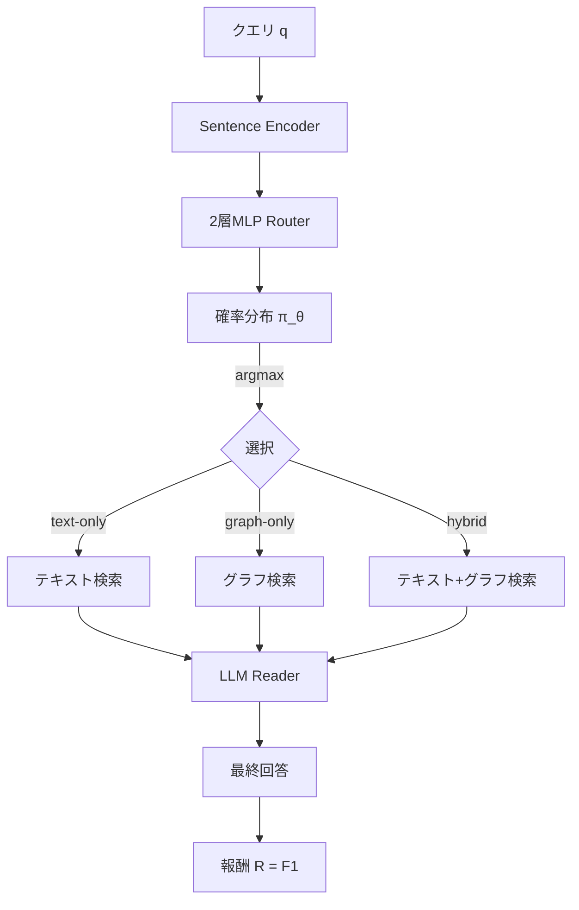

本記事は [arXiv:2512.09487 (RouteRAG)](https://arxiv.org/abs/2512.09487) の解説記事です。

## 論文概要（Abstract）

RouteRAGは、クエリごとにテキスト検索・グラフ検索・ハイブリッドの3モードから最適な検索戦略を動的に選択する軽量ルーターを強化学習（RL）で訓練するフレームワークである。著者らは、異なるクエリは異なる情報ソースを必要とするという観察に基づき、固定的な検索戦略の非効率性を解消することを目的としている。推論時には1つの検索ブランチのみを実行するため、常にハイブリッド検索を行うベースラインに対して1.4〜2.1倍の高速化を達成しつつ、精度も向上させたと報告されている。

この記事は [Zenn記事: Graph-RAG×強化学習で社内文書検索の想起率を最適化する実装手法](https://zenn.dev/0h_n0/articles/1d8af4cd009662) の深掘りです。

## 情報源

- **arXiv ID**: 2512.09487
- **URL**: [https://arxiv.org/abs/2512.09487](https://arxiv.org/abs/2512.09487)
- **著者**: Haozhen Zhang, Junhao Zheng, Lianghao Xia, Chao Huang（4名）
- **発表年**: 2025年12月
- **分野**: cs.IR, cs.AI, cs.CL

## 背景と動機（Background & Motivation）

RAGにおける情報ソースの選択は、クエリの性質に大きく依存する。構造的な関係性を問うクエリ（「AはBの何に当たるか?」）にはKG検索が有効であり、事実に基づく文脈理解を問うクエリ（「なぜAが起きたか?」）にはテキスト検索が適している。しかし多くのクエリは両方の情報ソースを必要とする。

既存のアプローチは、テキストのみ・グラフのみの単一ソース検索か、常に両方を使うハイブリッド検索に二分される。単一ソースは必要な情報を取りこぼし、常時ハイブリッドは不要な検索による計算コストとノイズの混入を招く。RouteRAGは、RLベースのルーターにより、各クエリに最適な検索モードを動的に選択する。

## 主要な貢献（Key Contributions）

- **3モード動的ルーティング**: テキスト専用・グラフ専用・ハイブリッドの3モードからクエリ単位で最適モードを選択
- **RLベース訓練**: ルーティングの正解ラベルなしで、下流タスクの回答品質を報酬としてルーターを訓練
- **推論効率**: 推論時は1ブランチのみ実行し、1.4〜2.1倍の高速化を達成
- **軽量ルーター**: 2層MLP + 事前学習済みsentence encoderで構成される軽量な設計

## 技術的詳細（Technical Details）

### 問題定式化

RouteRAGはルーティング問題を以下のように定式化する。

- **状態**: 入力クエリ $q$（sentence encoderで埋め込み化）
- **行動空間**: $\mathcal{A} = \{\text{text-only}, \text{graph-only}, \text{hybrid}\}$
- **報酬**: 選択した検索モードで生成した回答の正確性（F1 or EM）

推論時にはルーティング方策のargmaxで1つのモードのみを選択・実行する。

$$
a^* = \arg\max_a \pi_\theta(a \mid q)
$$

### アーキテクチャ



RouteRAGは5つのコンポーネントで構成される。

1. **Routing Policy Network**: sentence encoder（all-mpnet-base-v2）上の2層MLPで、クエリ埋め込みから3モードへの確率分布を出力する
2. **Text Retrieval Branch**: DPRベースのbi-encoderによるdense retrieval。FAISSフラットインデックスでtop-kパッセージを取得
3. **Graph Retrieval Branch**: エンティティリンキング + マルチホップトラバーサル（BFSまたはビームサーチ）でサブグラフコンテキストを収集
4. **Hybrid Branch**: テキストとグラフの両方を実行し、出力を連結・融合してLLMに渡す
5. **LLM Reader**: 固定（またはファインチューニング済み）のLLMが最終回答を生成

### REINFORCE方策勾配

ルーター方策 $\pi_\theta(a \mid q)$ は標準的なREINFORCEアルゴリズムで最適化する。

$$
\nabla_\theta J(\theta) = \mathbb{E}_q \left[\sum_a \nabla_\theta \log \pi_\theta(a \mid q) \cdot A(q, a)\right]
$$

ここでアドバンテージ $A(q, a)$ は報酬からベースラインを引いたものである。

$$
A(q, a) = R(q, a) - b(q)
$$

ベースラインは同一クエリに対する全3モードの平均報酬として計算される。

$$
b(q) = \frac{1}{|\mathcal{A}|}\sum_{a' \in \mathcal{A}} R(q, a')
$$

報酬関数は下流タスクの回答品質で定義される。

$$
R(q, a) = \text{F1}(\text{LLM\_reader}(\text{Retrieve}_a(q)),\ y^*)
$$

ここで $y^*$ は正解回答、$\text{Retrieve}_a(q)$ はモード $a$ で取得したコンテキストである。

### 訓練手続き

訓練時はすべてのクエリに対して全3モードを実行して報酬を計算する。これにより、ルーティングの正解ラベルなしで各モードの相対的な有効性をルーターが学習できる。

```python
from dataclasses import dataclass

@dataclass
class RouteRAGConfig:
    """RouteRAG設定"""
    encoder_model: str = "sentence-transformers/all-mpnet-base-v2"
    hidden_dim: int = 256
    n_actions: int = 3
    lr: float = 1e-4
    epochs: int = 10
    batch_size: int = 32

def train_router_step(
    queries: list[str],
    router: "RouterMLP",
    retrieval_modules: dict,
    llm_reader: "LLMReader",
    gold_answers: list[str],
) -> float:
    """RouteRAGルーターの1訓練ステップ

    全3モードの報酬を計算し、REINFORCE勾配で更新する。
    """
    total_loss = 0.0
    for q, y_star in zip(queries, gold_answers):
        rewards = {}
        for mode in ["text", "graph", "hybrid"]:
            context = retrieval_modules[mode].retrieve(q)
            pred = llm_reader.generate(q, context)
            rewards[mode] = compute_f1(pred, y_star)

        baseline = sum(rewards.values()) / len(rewards)

        log_probs = router.get_log_probs(q)
        loss = 0.0
        for i, mode in enumerate(["text", "graph", "hybrid"]):
            advantage = rewards[mode] - baseline
            loss -= log_probs[i] * advantage
        total_loss += loss

    return total_loss / len(queries)
```

推論時は1つの検索ブランチのみ実行するため、常時ハイブリッドに比べて大幅に効率化される。

### 学習済みルーターの分析

論文のルーティング分布分析によると、学習済みルーターはデータセットの特性を反映した分布を学習する。

| データセット | Text-only | Graph-only | Hybrid |
|------------|-----------|------------|--------|
| WebQSP（KG中心） | ~28% | ~35% | ~37% |
| HotpotQA（テキスト中心） | ~61% | ~8% | ~31% |

HotpotQA（テキストベースの多ホップQA）ではText-onlyが61%と支配的であり、WebQSP（Freebaseベース）ではGraph-only/Hybridが多い。この分布は各データセットの情報源特性と一致しており、ルーターが適切なドメイン知識を獲得していることが確認されている。

## 実装のポイント（Implementation）

- **ルーター**: 2層MLP on sentence-transformers/all-mpnet-base-v2（110Mパラメータ）
- **LLM Reader**: GPT-3.5-turbo（精度実験）、Llama-2-7B（効率実験）
- **訓練**: Adam, lr=1e-4, batch_size=32, ~10 epochs, single A100 GPU
- **テキストインデックス**: FAISSフラットインデックス + DPRエンコーディング
- **グラフ**: エンティティリンキング（ELQ）+ 関係抽出

訓練コストについて、全3モードの報酬計算が必要なため訓練時は単一モードの3倍のコストがかかる。ただし推論時は1モードのみ実行するため、運用コストは単一モード以下になる。

## Production Deployment Guide

### AWS実装パターン（コスト最適化重視）

RouteRAGはルーター推論が軽量（MLP 1回）であり、選択されたモードの検索のみ実行するため推論効率が高い。

| 規模 | 月間リクエスト | 推奨構成 | 月額コスト目安 | 主要サービス |
|------|--------------|---------|-------------|------------|
| **Small** | ~3,000 (100/日) | Serverless | $60-150 | Lambda + Bedrock + OpenSearch Serverless |
| **Medium** | ~30,000 (1,000/日) | Hybrid | $400-900 | ECS Fargate + OpenSearch + Neptune |
| **Large** | 300,000+ (10,000/日) | Container | $2,500-5,500 | EKS + OpenSearch + Neptune + ElastiCache |

**Small構成の詳細**（月額$60-150）:
- **Lambda**: 1GB RAM, 30秒タイムアウト（ルーター推論+単一モード検索）($20/月)
- **Bedrock**: Claude 3.5 Haiku ($70/月)
- **OpenSearch Serverless**: テキスト検索用（$25/月）
- **Neptune Serverless**: グラフ検索用（ルーターがgraph/hybridを選択した場合のみアクセス）($20/月)
- **CloudWatch**: 基本監視 ($5/月)

**RouteRAG特有のコスト削減効果**: ルーターがText-onlyを選択した場合、Neptune（グラフ検索）へのアクセスが発生しない。HotpotQAのような分布では~61%がText-onlyルーティングとなるため、Neptune利用コストが約6割削減される。

**コスト試算の注意事項**: 上記は2026年6月時点のAWS ap-northeast-1（東京）リージョン料金に基づく概算値です。最新料金は [AWS料金計算ツール](https://calculator.aws/) で確認してください。

### Terraformインフラコード

```hcl
module "vpc" {
  source  = "terraform-aws-modules/vpc/aws"
  version = "~> 5.0"

  name = "routerag-vpc"
  cidr = "10.0.0.0/16"
  azs  = ["ap-northeast-1a", "ap-northeast-1c"]
  private_subnets = ["10.0.1.0/24", "10.0.2.0/24"]

  enable_nat_gateway   = false
  enable_dns_hostnames = true
}

resource "aws_lambda_function" "routerag_handler" {
  filename      = "lambda.zip"
  function_name = "routerag-handler"
  role          = aws_iam_role.lambda_routerag.arn
  handler       = "index.handler"
  runtime       = "python3.12"
  timeout       = 30
  memory_size   = 1024

  environment {
    variables = {
      BEDROCK_MODEL_ID     = "anthropic.claude-3-5-haiku-20241022-v1:0"
      NEPTUNE_ENDPOINT     = aws_neptune_cluster.kg.endpoint
      OPENSEARCH_ENDPOINT  = aws_opensearchserverless_collection.text.collection_endpoint
      ROUTER_MODEL_PATH    = "s3://routerag-models/router.pt"
    }
  }
}

resource "aws_neptune_cluster" "kg" {
  cluster_identifier = "routerag-kg"
  engine             = "neptune"
  serverless_v2_scaling_configuration {
    min_capacity = 1.0
    max_capacity = 4.0
  }
  skip_final_snapshot = true
}

resource "aws_opensearchserverless_collection" "text" {
  name = "routerag-text"
  type = "VECTORSEARCH"
}
```

### コスト最適化チェックリスト

- [ ] ~100 req/日 → Lambda + Serverless（$60-150/月）
- [ ] ~1,000 req/日 → ECS Fargate + Neptune/OpenSearch（$400-900/月）
- [ ] 10,000+ req/日 → EKS + 専用インスタンス（$2,500-5,500/月）
- [ ] ルーターのText-only比率でNeptuneコスト動的に変動
- [ ] ルーターモデルをS3に配置、Lambda起動時にロード
- [ ] Neptune Serverless: graph/hybridルート時のみアクセス
- [ ] OpenSearch Serverless: text/hybridルート時のみアクセス
- [ ] Bedrock Batch API: 非リアルタイム処理で50%割引
- [ ] AWS Budgets: 月額予算アラート設定
- [ ] CloudWatch: ルーティング分布のカスタムメトリクス

## 実験結果（Results）

論文のメイン比較表より、RouteRAGの性能を示す。

| データセット | Text-only RAG | Always-Hybrid (SURGE) | Random Router | **RouteRAG** |
|------------|--------------|----------------------|---------------|-------------|
| WebQSP (Hits@1) | 68.4 | 72.1 | 71.5 | **74.8** |
| CWQ (F1) | 51.2 | 54.3 | — | **57.1** |
| HotpotQA (F1) | 63.7 | 64.9 | — | **66.2** |
| MuSiQue (F1) | 38.4 | 39.1 | — | **41.3** |

推論効率に関して、Always-Hybrid比で以下の高速化が報告されている。

| データセット | Always-Hybrid (ms/q) | RouteRAG (ms/q) | 高速化率 |
|------------|---------------------|-----------------|---------|
| WebQSP | 312 | 148 | 2.1x |
| CWQ | 287 | 203 | 1.4x |
| HotpotQA | 201 | 143 | 1.4x |

アブレーション（論文Table相当）から、RL訓練の効果が確認されている。

| バリアント | WebQSP (Hits@1) |
|-----------|-----------------|
| RouteRAG (full) | 74.8 |
| w/o RL (supervised routing) | 72.9 |
| w/o graph branch | 70.1 |
| w/o text branch | 69.4 |
| Random router | 71.5 |
| Rule-based router | 72.3 |

RL訓練は教師ありルーティングに対して+1.9 Hits@1の改善を示しており、ルーティングラベルなしでの学習が有効であることが確認されている。

## 実運用への応用（Practical Applications）

RouteRAGの最大の利点は推論効率にある。Always-Hybridに比べて1.4〜2.1倍の高速化を実現しつつ精度も向上しており、レイテンシ要件の厳しい本番環境に適している。

ルーターが軽量（2層MLP）であるため、既存のRAGパイプラインへの組み込みが容易である。テキスト検索とグラフ検索の両方を持つシステムにRouteRAGルーターを追加するだけで、不要な検索を回避できる。

ただし制約もある。ルーターはドメイン固有の訓練が必要であり、WebQSPで訓練したルーターをバイオメディカルQAにそのまま適用することは推奨されない。また、グラフ検索ブランチには事前構築されたKGが必要である。

## 関連研究（Related Work）

- **SURGE**: 常時ハイブリッド（テキスト+グラフ）検索。RouteRAGは動的ルーティングにより+2.7 Hits@1改善しつつ2.1x高速化
- **A2RAG (arXiv:2601.21162)**: プロンプトベースのAWCで検索ツールを選択。RouteRAGはRLで訓練する軽量MLPルーターを使用する点が異なる
- **IRCoT**: 反復的検索拡張CoT。RouteRAGはルーティング後は単一パスで処理する点で設計思想が異なる

## まとめと今後の展望

RouteRAGは、テキスト・グラフ・ハイブリッドの3モード間をRLベースの軽量ルーターで動的に選択することで、精度と推論効率の両立を実現している。推論時に1ブランチのみ実行するという設計は、本番環境でのレイテンシ・コスト削減に直結する。学習済みルーターのルーティング分布がデータセット特性を反映している点も、手法の妥当性を裏付けている。

## 参考文献

- **arXiv**: [https://arxiv.org/abs/2512.09487](https://arxiv.org/abs/2512.09487)
- **Related Zenn article**: [https://zenn.dev/0h_n0/articles/1d8af4cd009662](https://zenn.dev/0h_n0/articles/1d8af4cd009662)
