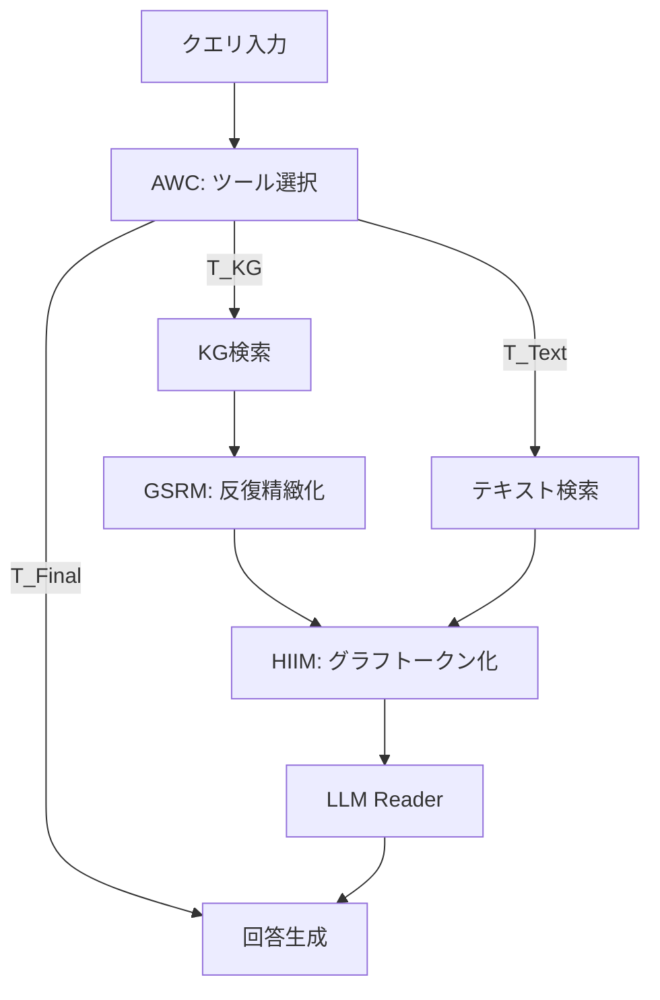

本記事は [arXiv:2601.21162 (A2RAG)](https://arxiv.org/abs/2601.21162) の解説記事です。

## 論文概要（Abstract）

A2RAG (Adaptive Agentic Graph Retrieval Augmented Generation) は、バイオメディカル質問応答（QA）における検索精度向上を目的としたフレームワークである。構造化知識グラフ（KG）と非構造化テキストという異種情報ソースに対して、LLMエージェントが検索戦略を動的にプランニングする。著者らは3つのモジュール — Agentic Workflow Controller（AWC）、Graph Self-Refinement Module（GSRM）、Heterogeneous Information Integration Module（HIIM）— を提案し、5つのバイオメディカルQAベンチマーク中4つでSOTAを達成したと報告している。

この記事は [Zenn記事: Graph-RAG×強化学習で社内文書検索の想起率を最適化する実装手法](https://zenn.dev/0h_n0/articles/1d8af4cd009662) の深掘りです。

## 情報源

- **arXiv ID**: 2601.21162
- **URL**: [https://arxiv.org/abs/2601.21162](https://arxiv.org/abs/2601.21162)
- **著者**: Hongjian Zhou, Boyang Gu, Guangyu Wang, Fenglin Liu, Zheng Li et al.（計14名）
- **発表年**: 2026年1月
- **分野**: cs.IR, cs.AI, cs.CL

## 背景と動機（Background & Motivation）

バイオメディカルQAでは、LLMがハルシネーションを起こすリスクがあり、外部知識による根拠付け（grounding）が不可欠である。従来のRAGアプローチは、テキスト検索のみ、またはKG検索のみに依存しており、クエリの性質に応じた検索戦略の切り替えができなかった。

著者らは3つの課題を指摘している。第一に、既存手法はKGかテキストのいずれか一方に固定された検索パイプラインを使用しており、検索の柔軟性に欠ける。第二に、KGから検索した情報の関連度が低い場合にも、そのまま使用してしまう検索品質の問題がある。第三に、KGとテキストの統合方法が単純な連結にとどまっており、構造情報が失われるという知識統合の課題がある。

## 主要な貢献（Key Contributions）

- **AWC（Agentic Workflow Controller）**: ReActスタイルのLLMエージェントが、クエリごとにKG検索・テキスト検索・回答生成のどのツールを使うかを動的に決定する
- **GSRM（Graph Self-Refinement Module）**: KG検索結果をコサイン類似度ベースのフィードバックで反復的に精緻化し、Recall@10を62.3%→75.8%に改善
- **HIIM（Heterogeneous Information Integration Module）**: GNNベースのグラフトークン化により、KGの構造情報を保持したままLLMの入力に統合する

## 技術的詳細（Technical Details）

### Agentic Workflow Controller（AWC）

AWCはReActパターンに基づくLLMエージェントであり、各ステップで3種のツールから次のアクションを選択する。

$$
a_t = \arg\max P_{\text{LLM}}(a \mid q, H_{t-1}, \text{Tools})
$$

ここで $q$ はクエリ、$H_{t-1}$ はそれまでの履歴（Thought-Action-Observationの系列）、$\text{Tools} = \{T_{\text{KG}}, T_{\text{Text}}, T_{\text{Final}}\}$ は利用可能なツール集合である。

論文のTable 5（AWCルーティング統計）によると、データセットの特性に応じてルーティング分布が変化する。PubMedQA（文献ベース）ではText-onlyが47.3%と高く、BioASQ（構造化知識が重要）ではKG+Textが58.5%を占める。AWCはファインチューニングなしのプロンプトベースで動作するため、追加の学習コストがかからない点が実用的である。

### Graph Self-Refinement Module（GSRM）

GSRMはKG検索品質を反復的に改善するモジュールである。

**ステップ1: 初期サブグラフ構築**

クエリ $q$ と選択肢 $o$ からエンティティ集合 $E_q$ を抽出し、各エンティティの1-hopサブグラフを取得する。

$$
G_e = \{(h, r, t) \in G \mid h = e \text{ or } t = e\}
$$

$$
G_{\text{init}} = \bigcup_{e \in E_q} G_e
$$

**ステップ2: 関連度スコアリング**

各トリプル $(h, r, t)$ とクエリ $q$ の類似度をMedCPT（バイオメディカルドメイン適応BERT）で計算する。

$$
s(h, r, t) = \text{sim}(\text{emb}(h, r, t), \text{emb}(q))
$$

**ステップ3: 反復的展開**

閾値 $\tau = 0.5$ を超えるエンティティを展開対象とし、その近傍を追加する。

$$
E_{\text{expand}} = \{e \in V(G_{\text{init}}) \mid \max_{(h,r,t): e \in \{h,t\}} s(h,r,t) \geq \tau\}
$$

$$
G^{(k)} = G^{(k-1)} \cup \bigcup_{e \in E_{\text{expand}}^{(k-1)}} G_e^1
$$

論文の実験（Table相当の検索品質分析）によると、$K=2$ 回の反復でRecall@10が62.3%→75.8%に向上し、$K=3$ではほぼ横ばい（75.9%）であったため、$K=2$ が推奨される。

### Heterogeneous Information Integration Module（HIIM）

HIIMは2層Graph Attention Network（GAT）を使い、KGトリプルをグラフトークンに変換する。

$$
z_{h,r,t} = \text{GNN}([\text{emb}(h); \text{emb}(r); \text{emb}(t)])
$$

このグラフトークンを線形射影でLLMの埋め込み空間にマッピングする。

$$
v_{h,r,t} = W_{\text{proj}} \cdot z_{h,r,t} \quad (W_{\text{proj}} \in \mathbb{R}^{d_{\text{LLM}} \times d_{\text{GNN}}})
$$

最終的なコンテキストはテキストトークンとグラフトークンを連結して構成する。

$$
C = [t_1, \ldots, t_L, v_1, \ldots, v_M]
$$



### アルゴリズム

```python
from dataclasses import dataclass, field

@dataclass
class A2RAGState:
    """A2RAGのエージェント状態"""
    query: str
    history: list[dict] = field(default_factory=list)
    kg_results: list[dict] = field(default_factory=list)
    text_results: list[str] = field(default_factory=list)
    graph_tokens: list = field(default_factory=list)

def gsrm_refine(
    graph: dict,
    query_entities: list[str],
    query_embedding: list[float],
    tau: float = 0.5,
    k_iterations: int = 2,
    top_n: int = 50,
) -> list[dict]:
    """Graph Self-Refinement Module の擬似実装

    Args:
        graph: 知識グラフ（トリプル集合）
        query_entities: クエリから抽出したエンティティ
        query_embedding: クエリの埋め込みベクトル
        tau: 展開閾値
        k_iterations: 反復回数
        top_n: 最終選択トリプル数
    Returns:
        精緻化されたTop-Nトリプル
    """
    subgraph = get_one_hop(graph, query_entities)

    for _ in range(k_iterations):
        scored = [
            (triple, cosine_sim(embed_triple(triple), query_embedding))
            for triple in subgraph
        ]
        expand_entities = [
            e for triple, score in scored
            for e in [triple["head"], triple["tail"]]
            if score >= tau
        ]
        new_triples = get_one_hop(graph, expand_entities)
        subgraph = subgraph | new_triples

    scored_final = [
        (triple, cosine_sim(embed_triple(triple), query_embedding))
        for triple in subgraph
    ]
    scored_final.sort(key=lambda x: x[1], reverse=True)
    return [triple for triple, _ in scored_final[:top_n]]
```

## 実装のポイント（Implementation）

著者らの実装では以下の構成が使用されている。

- **ハードウェア**: 4× NVIDIA A100 80GB
- **Generator LLM**: LLaMA-3.1-8B-Instruct（プロンプトベース、ファインチューニングなし）
- **埋め込みモデル**: MedCPT（110Mパラメータ、バイオメディカルドメイン適応BERT）
- **GNN**: 2層GAT（UMLSトリプレット分類タスクで事前学習）
- **KG**: UMLS（約6.9Mコンセプト、54Mトリプレット）
- **GSRMパラメータ**: 閾値 $\tau = 0.5$、反復回数 $K = 2$、Top-N = 50

実装時の注意点として、GSRMの閾値 $\tau$ はデータセットごとに検証セットでチューニングする必要がある。また、AWCのプランナーLLMが小さいモデルの場合、ルーティング精度が低下する可能性がある。

## Production Deployment Guide

### AWS実装パターン（コスト最適化重視）

A2RAGは知識グラフとテキスト検索のハイブリッドシステムであり、KGストレージとベクトル検索の両方が必要になる。

| 規模 | 月間リクエスト | 推奨構成 | 月額コスト目安 | 主要サービス |
|------|--------------|---------|-------------|------------|
| **Small** | ~3,000 (100/日) | Serverless | $80-200 | Lambda + Bedrock + Neptune Serverless |
| **Medium** | ~30,000 (1,000/日) | Hybrid | $500-1,200 | ECS Fargate + Neptune + OpenSearch |
| **Large** | 300,000+ (10,000/日) | Container | $3,000-7,000 | EKS + Neptune + OpenSearch + ElastiCache |

**Small構成の詳細**（月額$80-200）:
- **Lambda**: 2GB RAM, 60秒タイムアウト（GSRM反復処理のため長め）($30/月)
- **Bedrock**: Claude 3.5 Haiku, Prompt Caching有効 ($80/月)
- **Neptune Serverless**: KG格納・クエリ（UMLS規模で$40/月）
- **OpenSearch Serverless**: テキスト検索用ベクトルDB ($30/月)
- **CloudWatch**: 基本監視 ($5/月)

**コスト削減テクニック**:
- Neptune Serverlessで使用量に応じた課金（アイドル時コスト最小化）
- Bedrock Batch APIで非リアルタイム処理を50%割引
- GSRMの反復回数を $K=2$ に固定してLambda実行時間を抑制
- AWCルーティングでKG-only/Text-only判定を行い、不要な検索を回避

**コスト試算の注意事項**: 上記は2026年6月時点のAWS ap-northeast-1（東京）リージョン料金に基づく概算値です。実際のコストはトラフィックパターンやKG規模により変動します。最新料金は [AWS料金計算ツール](https://calculator.aws/) で確認してください。

### Terraformインフラコード

**Small構成 (Serverless): Lambda + Bedrock + Neptune Serverless**

```hcl
module "vpc" {
  source  = "terraform-aws-modules/vpc/aws"
  version = "~> 5.0"

  name = "a2rag-vpc"
  cidr = "10.0.0.0/16"
  azs  = ["ap-northeast-1a", "ap-northeast-1c"]
  private_subnets = ["10.0.1.0/24", "10.0.2.0/24"]

  enable_nat_gateway   = false
  enable_dns_hostnames = true
}

resource "aws_iam_role" "lambda_a2rag" {
  name = "lambda-a2rag-role"

  assume_role_policy = jsonencode({
    Version = "2012-10-17"
    Statement = [{
      Action    = "sts:AssumeRole"
      Effect    = "Allow"
      Principal = { Service = "lambda.amazonaws.com" }
    }]
  })
}

resource "aws_iam_role_policy" "bedrock_neptune" {
  role = aws_iam_role.lambda_a2rag.id

  policy = jsonencode({
    Version = "2012-10-17"
    Statement = [
      {
        Effect   = "Allow"
        Action   = ["bedrock:InvokeModel", "bedrock:InvokeModelWithResponseStream"]
        Resource = "arn:aws:bedrock:ap-northeast-1::foundation-model/anthropic.claude-3-5-haiku*"
      },
      {
        Effect   = "Allow"
        Action   = ["neptune-db:ReadDataViaQuery", "neptune-db:WriteDataViaQuery"]
        Resource = "arn:aws:neptune-db:ap-northeast-1:*:*/database"
      }
    ]
  })
}

resource "aws_lambda_function" "a2rag_handler" {
  filename      = "lambda.zip"
  function_name = "a2rag-handler"
  role          = aws_iam_role.lambda_a2rag.arn
  handler       = "index.handler"
  runtime       = "python3.12"
  timeout       = 60
  memory_size   = 2048

  environment {
    variables = {
      BEDROCK_MODEL_ID   = "anthropic.claude-3-5-haiku-20241022-v1:0"
      NEPTUNE_ENDPOINT   = aws_neptune_cluster.kg.endpoint
      GSRM_THRESHOLD     = "0.5"
      GSRM_ITERATIONS    = "2"
      GSRM_TOP_N         = "50"
    }
  }
}

resource "aws_neptune_cluster" "kg" {
  cluster_identifier = "a2rag-kg"
  engine             = "neptune"
  serverless_v2_scaling_configuration {
    min_capacity = 1.0
    max_capacity = 8.0
  }
  skip_final_snapshot = true
}

resource "aws_cloudwatch_metric_alarm" "lambda_duration" {
  alarm_name          = "a2rag-lambda-duration"
  comparison_operator = "GreaterThanThreshold"
  evaluation_periods  = 2
  metric_name         = "Duration"
  namespace           = "AWS/Lambda"
  period              = 300
  statistic           = "Average"
  threshold           = 45000
  alarm_description   = "GSRM反復でLambdaタイムアウトの可能性"

  dimensions = {
    FunctionName = aws_lambda_function.a2rag_handler.function_name
  }
}
```

### セキュリティベストプラクティス

- **Neptune**: VPC内配置必須、パブリックアクセス禁止
- **IAM**: 最小権限（Bedrock InvokeModel + Neptune ReadData のみ）
- **Secrets Manager**: APIキー・DB認証情報はハードコード禁止
- **暗号化**: Neptune保管時暗号化 + TLS 1.2以上の転送暗号化

### 運用・監視設定

```python
import boto3

cloudwatch = boto3.client('cloudwatch')

cloudwatch.put_metric_alarm(
    AlarmName='a2rag-gsrm-latency',
    ComparisonOperator='GreaterThanThreshold',
    EvaluationPeriods=2,
    MetricName='Duration',
    Namespace='AWS/Lambda',
    Period=300,
    Statistic='p95',
    Threshold=50000,
    AlarmDescription='GSRM反復処理のP95レイテンシ異常'
)

cloudwatch.put_metric_alarm(
    AlarmName='a2rag-neptune-cpu',
    ComparisonOperator='GreaterThanThreshold',
    EvaluationPeriods=2,
    MetricName='CPUUtilization',
    Namespace='AWS/Neptune',
    Period=300,
    Statistic='Average',
    Threshold=80,
    AlarmDescription='Neptune CPU使用率が高く、スケールアップが必要'
)
```

### コスト最適化チェックリスト

- [ ] ~100 req/日 → Lambda + Neptune Serverless（$80-200/月）
- [ ] ~1,000 req/日 → ECS Fargate + Neptune（$500-1,200/月）
- [ ] 10,000+ req/日 → EKS + Neptune + OpenSearch（$3,000-7,000/月）
- [ ] Neptune Serverless: アイドル時自動スケールダウン
- [ ] Bedrock Batch API: 非リアルタイム処理で50%割引
- [ ] GSRMの反復回数: $K=2$ 固定で計算コスト抑制
- [ ] AWCルーティング: 不要な検索を回避してAPI呼び出し削減
- [ ] Lambda メモリ: 2GB（MedCPTエンベディング処理に必要）
- [ ] CloudWatch: Neptune CPUとLambda Duration を監視
- [ ] AWS Budgets: 月額予算設定（80%/100%アラート）

## 実験結果（Results）

論文のメイン比較表より、A2RAGの性能を示す。ベースモデルはLLaMA-3.1-8B-Instruct。

| データセット | LLaMA-3.1-8B base | RAG (text-only) | MedGraphRAG | DragonPlus | **A2RAG** |
|------------|-------------------|-----------------|-------------|------------|-----------|
| MedQA | 58.2% | 61.4% | 64.5% | 66.2% | **70.1%** |
| MedMCQA | 56.8% | 59.3% | 62.8% | 64.1% | **67.4%** |
| PubMedQA | 72.4% | 74.2% | 75.3% | 76.9% | 77.2% |
| BioASQ | 78.3% | 80.1% | 82.4% | 84.3% | **86.5%** |
| DDXPlus | 55.6% | 58.4% | 61.9% | 63.8% | **65.3%** |

GPT-4oバックボーンでは、MedQAで84.3%を達成し、MedGraphRAG + GPT-4o（82.1%）を上回ったと報告されている。

アブレーション分析（論文Table相当）では、各モジュールの貢献度が定量化されている。MedQA基準で、AWC除去で-1.8%、GSRM除去で-2.6%、HIIM除去で-3.2%の精度低下が確認された。特にKGとテキストの両方を除去した場合の精度低下が最も大きく、ハイブリッド検索の重要性が示唆されている。

## 実運用への応用（Practical Applications）

A2RAGのアーキテクチャは、バイオメディカルQA以外の領域にも適用可能であると考えられる。特にAWCの動的ルーティング機構は、社内文書検索において「構造化データ（社内Wiki、設定DB）」と「非構造化データ（Slack、メール）」を使い分けるユースケースに転用できる。

ただし以下の制約を考慮する必要がある。推論レイテンシがstandard RAGの2〜4倍になる点、KGのカバレッジに性能が依存する点、閾値 $\tau$ のドメインごとのチューニングが必要な点である。また、現在の評価はすべて英語の選択式QAであり、日本語やオープンエンド生成への汎化は未検証である。

## 関連研究（Related Work）

- **MedGraphRAG**: バイオメディカルKGを使った固定パイプラインRAG。A2RAGはこれに対して動的ルーティングで+5.6%改善（MedQA）
- **DragonPlus**: LLMとGNNの統合モデル。A2RAGはGSRMの反復精緻化で検索品質を改善
- **RouteRAG (arXiv:2512.09487)**: テキスト/グラフ/ハイブリッドの3モード間のRLベースルーティング。A2RAGのAWCは類似の発想だが、RL不要のプロンプトベースで動作する点が異なる

## まとめと今後の展望

A2RAGは、AWC（動的ルーティング）・GSRM（反復的KG精緻化）・HIIM（グラフトークン統合）の3モジュールにより、バイオメディカルQAで5ベンチマーク中4つのSOTAを報告している。特にGSRMのRecall改善（62.3%→75.8%）は、Graph-RAGの検索品質向上において実践的な示唆を持つ。今後の課題として、著者らは多言語対応、オープンエンド生成への拡張、推論レイテンシの削減を挙げている。

## 参考文献

- **arXiv**: [https://arxiv.org/abs/2601.21162](https://arxiv.org/abs/2601.21162)
- **Related Zenn article**: [https://zenn.dev/0h_n0/articles/1d8af4cd009662](https://zenn.dev/0h_n0/articles/1d8af4cd009662)
