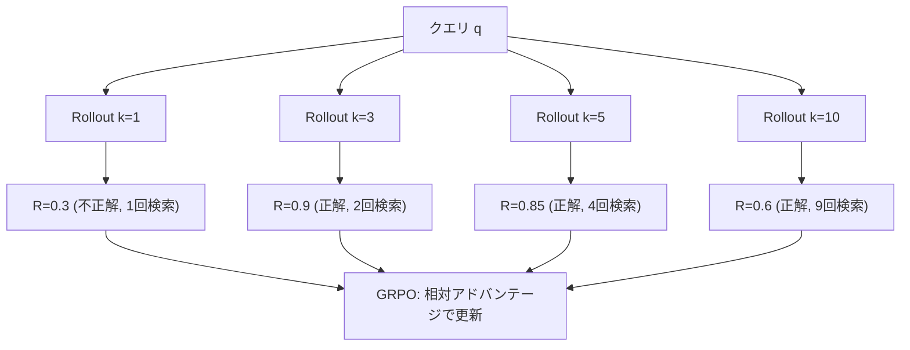

本記事は [arXiv:2604.17337 (AutoSearch)](https://arxiv.org/abs/2604.17337) の解説記事です。

## 論文概要（Abstract）

AutoSearchは、Agentic RAGにおける「過剰検索（over-searching）」問題を強化学習で解決するフレームワークである。著者らはSearch Budget Token（SBT）と呼ばれる特殊トークン機構を導入し、LLMが「いつ検索を止めるか」を自律的に学習できるようにしている。GRPOベースのRL訓練により、精度を維持しつつ検索回数を30〜40%削減したと報告されている。Penn State UniversityとAmazonの共同研究。

この記事は [Zenn記事: Graph-RAG×強化学習で社内文書検索の想起率を最適化する実装手法](https://zenn.dev/0h_n0/articles/1d8af4cd009662) の深掘りです。

## 情報源

- **arXiv ID**: 2604.17337
- **URL**: [https://arxiv.org/abs/2604.17337](https://arxiv.org/abs/2604.17337)
- **著者**: Minhua Lin, Zhiwei Liu, Juntao Tan, Suhang Wang, Chen Luo, Zhengzhong Liu, Haoming Jiang（Penn State University / Amazon）
- **発表年**: 2026年4月
- **分野**: cs.CL, cs.IR, cs.LG

## 背景と動機（Background & Motivation）

Agentic RAG（LLMエージェントが自律的にマルチステップ検索・推論を行うRAG）は複雑な質問応答に有効であるが、過剰検索（over-searching）という実践的な問題を抱えている。Search-o1のような既存手法は、固定ステップ数または「検索が必要だと思ったら検索する」というnaiveな戦略を採用しており、不要な検索呼び出しが多発する。

著者らの分析によると、単一ホップQAでは約1回の検索で十分であるのに対し、マルチホップQAでは最大3ステップが必要とされる。固定深度のアプローチでは、ベースラインで2〜37%の過剰検索が発生していたと報告されている。過剰検索はAPIコストの増大、レイテンシの増加、さらには検索ノイズによる精度低下を招く。

## 主要な貢献（Key Contributions）

- **Search Budget Token（SBT）**: 各推論ステップに検索予算を示す特殊トークンを導入し、モデルが検索残量を自己管理する機構
- **正確性+効率性の2成分報酬**: 回答の正確性と検索回数削減を同時に最適化する報酬設計
- **SBT-Aware Rollout**: 同一クエリに異なるSBTでロールアウトを生成し、検索効率を効率的に学習
- **テスト時の柔軟性**: ユーザーがコスト制約に応じてSBT上限を調整可能

## 技術的詳細（Technical Details）

### Over-Searchingの定式化

AutoSearchは過剰検索を「適応的検索深度をRLで学習する問題」として定式化する。各クエリ $q$ に対して、最適な検索回数 $N^*$ が存在するが、固定深度 $N_{\text{fixed}}$ では $N_{\text{fixed}} > N^*$ となるケースが頻発する。AutoSearchはモデル自身にこの $N^*$ を推定・制御させる。

### Search Budget Token（SBT）機構

SBTは各推論ステップに検索予算を示す特殊トークン `<budget_k>` （$k = 1, 2, \ldots, K$）である。モデルは検索前にSBTを出力し、「残り何回検索できるか」を自己管理する。

```
<system>You are a search agent. You have <budget_k> search calls remaining.</system>
<question>{query}</question>
→ モデルが <search>...</search> または <answer>...</answer> を出力
→ 検索実行のたびに budget を減算して再入力
```

SBTはソフトな制約として機能する。モデルが `<budget_0>` の状態でも検索を実行することは可能だが、効率報酬が低下するため、訓練を通じて予算内で探索を完了する方策が強化される。

### 2成分報酬関数

報酬は正確性報酬と効率報酬の線形結合で定義される。

$$
R_{\text{total}} = R_{\text{correctness}} + \lambda \cdot R_{\text{efficiency}}
$$

**正確性報酬**: 最終回答の正誤（Exact Matchまたは部分点としてのF1）

$$
R_{\text{correctness}} = \text{EM}(\text{answer}, \text{gold})
$$

**効率報酬**: SBTで指定した予算 $N_{\text{budget}}$ に対して実際の検索回数 $N_{\text{actual}}$ がどの程度削減されたか

$$
R_{\text{efficiency}} = \max\left(0,\ \frac{N_{\text{budget}} - N_{\text{actual}}}{N_{\text{budget}}}\right)
$$

$\lambda$ はトレードオフパラメータである。論文のアブレーション（Table相当）によると、$\lambda = 0.3$ が推奨値であり、精度をほぼ維持しつつ検索を35%削減する最適なバランスが得られている。

| $\lambda$ | EM (HotpotQA) | 検索削減率 |
|-----------|---------------|-----------|
| 0 | 59.1 | 0% |
| 0.1 | 58.7 | ~20% |
| 0.3（推奨） | 58.5 | ~35% |
| 1.0 | 54.1 | ~60% |

### GRPOベースのRL訓練

AutoSearchはGRPO（Group Relative Policy Optimization）を採用している。

$$
J_{\text{GRPO}}(\theta) = \mathbb{E}_{q, \{o_i\}_{i=1}^{G}} \left[\frac{1}{G}\sum_i \min\left(\frac{\pi_\theta(o_i|q)}{\pi_{\theta_{\text{old}}}(o_i|q)} A_i,\ \text{clip}(\cdot, 1-\epsilon, 1+\epsilon) A_i\right) - \beta D_{\text{KL}}(\pi_\theta \| \pi_{\text{ref}})\right]
$$

アドバンテージはグループ内の相対報酬で計算される。

$$
A_i = \frac{r_i - \text{mean}(\mathbf{r})}{\text{std}(\mathbf{r})}
$$

### SBT-Aware Rollout

訓練時の鍵となるメカニズムはSBT-Aware Rolloutである。同一クエリに対して異なるSBT値（$k = 1, 2, \ldots, K$）でロールアウトを生成する。同一グループ内で「正解 + 少ない検索」の軌跡が高報酬を得るため、モデルは自然に検索効率を学習する。



上図の例では、k=3のロールアウト（正解かつ2回検索）が最高報酬を得る。このように、GRPOのグループ相対評価により「少ない検索で正解を出す」方策が自然に強化される。

### テスト時の柔軟性

テスト時にはSBTに最大予算 $K$ を設定し、モデルが自律的に必要な検索回数を決定する。ユーザーはコスト制約に応じて $K$ を調整できる。

論文のアブレーション結果から、$K$ と性能の関係は以下の通りである。

| $K$ (最大予算) | EM (HotpotQA) | 平均検索回数 |
|------|---------------|-------------|
| $K=2$ | 54.1 | 1.8 |
| $K=5$（推奨） | 58.7 | 3.2 |
| $K=10$ | 59.0 | 5.1 |
| $K=\infty$ | 59.1 | 8.1 |

$K=5$ でほぼ最高精度に到達しつつ検索回数を大幅に削減できるため、著者らは $K=5$ を推奨初期値としている。

### アルゴリズム

```python
from dataclasses import dataclass, field

@dataclass
class AutoSearchState:
    """AutoSearchのエージェント状態"""
    query: str
    budget_remaining: int
    search_history: list[dict] = field(default_factory=list)
    intermediate_answers: list[str] = field(default_factory=list)
    search_count: int = 0

def autosearch_step(
    state: AutoSearchState,
    model_output: str,
    search_fn: callable,
) -> AutoSearchState:
    """AutoSearchの1ステップ実行

    モデル出力に<search>タグがあれば検索を実行し、
    <answer>タグがあれば回答として処理する。
    """
    if "<search>" in model_output:
        query = extract_search_query(model_output)
        results = search_fn(query)
        state.search_history.append({"query": query, "results": results})
        state.search_count += 1
        state.budget_remaining -= 1
    elif "<answer>" in model_output:
        answer = extract_answer(model_output)
        state.intermediate_answers.append(answer)
    return state

def compute_autosearch_reward(
    answer_correct: bool,
    n_budget: int,
    n_actual: int,
    lambda_eff: float = 0.3,
) -> float:
    """AutoSearchの報酬計算

    Args:
        answer_correct: 最終回答が正解か
        n_budget: SBTで設定した予算
        n_actual: 実際の検索回数
        lambda_eff: 効率報酬の重み（推奨0.3）
    Returns:
        総合報酬
    """
    r_correctness = 1.0 if answer_correct else 0.0
    r_efficiency = max(0.0, (n_budget - n_actual) / n_budget)
    return r_correctness + lambda_eff * r_efficiency

def should_continue_search(
    current_answer: str,
    previous_answer: str,
    budget_remaining: int,
    convergence_threshold: float = 0.85,
) -> bool:
    """検索継続判定（AutoSearchの補助ヒューリスティック）

    中間回答の類似度が閾値を超えたら検索を打ち切る。
    """
    if budget_remaining <= 0:
        return False
    if not previous_answer:
        return True
    tokens_curr = set(current_answer.split())
    tokens_prev = set(previous_answer.split())
    if not tokens_curr or not tokens_prev:
        return True
    jaccard = len(tokens_curr & tokens_prev) / len(tokens_curr | tokens_prev)
    return jaccard < convergence_threshold
```

## 実装のポイント（Implementation）

- **ベースモデル**: Qwen2.5-7B/14B/32B（主実験）、QwQ-32B
- **SBT実装**: プロンプトへの特殊トークン追加で実装可能（モデルアーキテクチャの変更不要）
- **推奨パラメータ**: $\lambda = 0.3$、$K = 5$

実装上の注意点として、SBTはモデルアーキテクチャではなくプロンプト設計として実装される。これは既存のLLMにも後付けで適用可能であるが、SBTを理解して適切に使用できるようGRPO訓練が必要である。訓練なしのゼロショットでは効果が限定的と考えられる。

RLトレーニングの計算コストは、GRPOのロールアウト生成に多数のGPUが必要であり、小規模チームへの適用が困難な場合がある。著者らはQwen2.5-7Bでの検証を推奨している。

## Production Deployment Guide

### AWS実装パターン（コスト最適化重視）

AutoSearchの最大の特徴は検索APIコストの削減であり、本番環境でのコスト最適化に直結する。

| 規模 | 月間リクエスト | 推奨構成 | 月額コスト目安 | 主要サービス |
|------|--------------|---------|-------------|------------|
| **Small** | ~3,000 (100/日) | Serverless | $50-130 | Lambda + Bedrock + DynamoDB |
| **Medium** | ~30,000 (1,000/日) | Hybrid | $300-700 | ECS Fargate + ElastiCache + Bedrock |
| **Large** | 300,000+ (10,000/日) | Container | $2,000-4,500 | EKS + Bedrock + ElastiCache |

**Small構成の詳細**（月額$50-130）:
- **Lambda**: 1GB RAM, 45秒タイムアウト ($20/月)
- **Bedrock**: Claude 3.5 Haiku, SBTプロンプト統合 ($70/月)
- **DynamoDB**: 検索結果キャッシュ ($10/月)
- **CloudWatch**: 基本監視 + 検索回数メトリクス ($5/月)

**AutoSearch特有のコスト削減効果**: 検索API呼び出しを30〜40%削減するため、検索APIコストが高い環境（外部検索エンジン使用時）で特に効果的である。$K=5$ 設定で平均3.2回の検索に抑制されるため、従来の8.1回に比べて約60%のAPI呼び出し削減が期待できる。

**コスト試算の注意事項**: 上記は2026年6月時点のAWS ap-northeast-1（東京）リージョン料金に基づく概算値です。最新料金は [AWS料金計算ツール](https://calculator.aws/) で確認してください。

### Terraformインフラコード

```hcl
module "vpc" {
  source  = "terraform-aws-modules/vpc/aws"
  version = "~> 5.0"

  name = "autosearch-vpc"
  cidr = "10.0.0.0/16"
  azs  = ["ap-northeast-1a", "ap-northeast-1c"]
  private_subnets = ["10.0.1.0/24", "10.0.2.0/24"]

  enable_nat_gateway   = false
  enable_dns_hostnames = true
}

resource "aws_lambda_function" "autosearch_handler" {
  filename      = "lambda.zip"
  function_name = "autosearch-handler"
  role          = aws_iam_role.lambda_autosearch.arn
  handler       = "index.handler"
  runtime       = "python3.12"
  timeout       = 45
  memory_size   = 1024

  environment {
    variables = {
      BEDROCK_MODEL_ID    = "anthropic.claude-3-5-haiku-20241022-v1:0"
      SBT_MAX_BUDGET      = "5"
      LAMBDA_EFFICIENCY   = "0.3"
      DYNAMODB_CACHE_TABLE = aws_dynamodb_table.search_cache.name
    }
  }
}

resource "aws_dynamodb_table" "search_cache" {
  name         = "autosearch-cache"
  billing_mode = "PAY_PER_REQUEST"
  hash_key     = "query_hash"

  attribute {
    name = "query_hash"
    type = "S"
  }

  ttl {
    attribute_name = "expire_at"
    enabled        = true
  }
}
```

### コスト最適化チェックリスト

- [ ] ~100 req/日 → Lambda + Serverless（$50-130/月）
- [ ] ~1,000 req/日 → ECS Fargate + ElastiCache（$300-700/月）
- [ ] 10,000+ req/日 → EKS + Bedrock（$2,000-4,500/月）
- [ ] SBT $K=5$ でAPI呼び出し60%削減
- [ ] $\lambda=0.3$ で精度・効率の最適バランス
- [ ] DynamoDB TTL付きキャッシュで重複検索排除
- [ ] Bedrock Batch API: 非リアルタイム処理で50%割引
- [ ] CloudWatch: 検索回数カスタムメトリクス
- [ ] AWS Budgets: 月額予算アラート設定
- [ ] Lambda タイムアウト: 45秒（SBT制御により短縮可能）

## 実験結果（Results）

論文のメイン比較表（Table 1相当）より、AutoSearchの性能を示す。

| モデル | 手法 | HotpotQA (EM) | 2WikiMQA (EM) | MuSiQue (EM) | 平均検索回数 |
|--------|------|---------------|---------------|--------------|-------------|
| Qwen2.5-7B | Search-o1 | 56.2 | 48.3 | 31.4 | 8.3 |
| Qwen2.5-7B | **AutoSearch** | **58.7** | **51.2** | **33.8** | **5.1** |
| Qwen2.5-32B | Search-o1 | 61.5 | 53.1 | 35.2 | — |
| Qwen2.5-32B | **AutoSearch** | **63.4** | **55.8** | **37.6** | — |

AutoSearchはSearch-o1に対して精度で+2〜3ポイント改善しつつ、検索回数を約38%削減（8.3回→5.1回、HotpotQA）している。

$K$（最大予算）のアブレーションでは、$K=5$ で精度58.7（$K=\infty$の59.1とほぼ同等）を達成しつつ平均3.2回の検索に抑制されている。これは過剰検索を排除することで、検索ノイズの減少が精度向上にも寄与していることを示唆している。

## 実運用への応用（Practical Applications）

AutoSearchは検索APIコストが問題となる本番RAGシステムに直接適用できる。SBTは「検索予算」というビジネス制約をモデルに直接エンコードする仕組みであり、コスト管理が容易である。$K$ をユーザーやリクエストの優先度に応じて動的に変更することで、コスト・精度のトレードオフを細かく制御できる。

ただし制約もある。GRPOによるRL訓練が高コストであり、小規模チームでの導入障壁が高い。$\lambda$ の最適値がタスクによって異なるため、ドメインごとのチューニングが必要である。また、評価は英語の多ホップQAデータセットに限定されており、他言語やドメイン特化タスクへの汎化は未検証である。

## 関連研究（Related Work）

- **Search-o1**: 固定的な検索戦略を持つAgentic RAG。AutoSearchはこれに対してSBTを追加し、検索深度を適応化
- **GraphRAG-R1 (arXiv:2507.23581)**: プロセスレベル報酬でKG検索を最適化。AutoSearchはSBTによるソフトな予算制御が特徴
- **Graph-R1 (arXiv:2507.21892)**: エージェント型GraphRAG。AutoSearchはグラフに限らず汎用的な検索APIに適用可能な点が異なる

## まとめと今後の展望

AutoSearchは、SBT（検索予算トークン）とGRPOの組み合わせにより、LLMが「いつ検索を止めるか」を自律的に学習する仕組みを実現している。$K=5$, $\lambda=0.3$ の設定で精度をほぼ維持しつつ検索回数を約60%削減できるという結果は、実運用でのコスト削減に直結する。SBTはプロンプト設計として実装できるため、既存LLMへの適用も容易である。著者らは今後の課題として、$\lambda$ の自動調整機構と多言語への拡張を挙げている。

## 参考文献

- **arXiv**: [https://arxiv.org/abs/2604.17337](https://arxiv.org/abs/2604.17337)
- **Related Zenn article**: [https://zenn.dev/0h_n0/articles/1d8af4cd009662](https://zenn.dev/0h_n0/articles/1d8af4cd009662)
