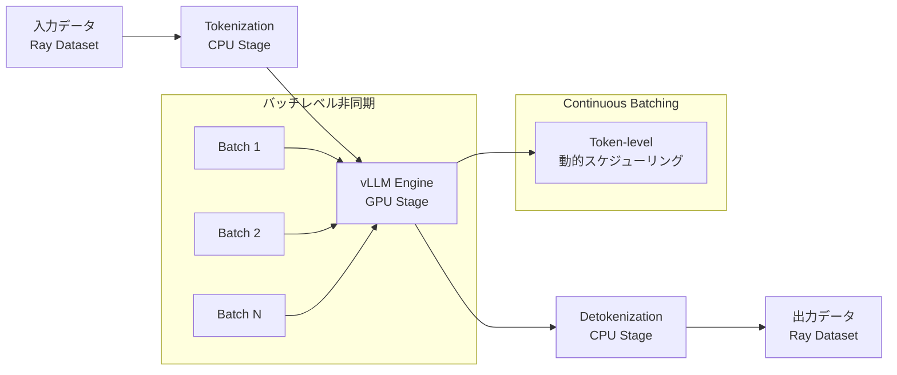

本記事は [Anyscale公式ブログ: Ray Data LLM enables 2x throughput over vLLM's synchronous LLM engine at production-scale](https://www.anyscale.com/blog/ray-data-llm-2x-throughput-vs-vllm) の解説記事です。

## ブログ概要（Summary）

Anyscaleが公開したRay Data LLMは、vLLMの同期LLMエンジンと比較してプロダクションスケールで2倍のスループットを達成するバッチ推論フレームワークである。Ray 2.44で導入されたvLLMとのネイティブ統合により、バッチレベルの並行実行・エンジンレベルのcontinuous batching・パイプラインステージの分離という3層の非同期実行モデルを実現している。特にデコード長が長い推論タスク（reasoning trace等）において、同期エンジンで発生するパイプラインバブルを排除し、GPU利用率を大幅に向上させる。

この記事は [Zenn記事: EC2 SpotインスタンスでLLM推論コストを最大70%削減する実践構成](https://zenn.dev/0h_n0/articles/235b3a2819146e) の深掘りです。

## 情報源

- **種別**: 企業テックブログ（Anyscale）
- **URL**: [Ray Data LLM enables 2x throughput over vLLM's synchronous LLM engine at production-scale](https://www.anyscale.com/blog/ray-data-llm-2x-throughput-vs-vllm)
- **組織**: Anyscale（Jeffrey Wang, Kourosh Hakhamaneshi, Richard Liaw）
- **関連バージョン**: Ray 2.44（vLLM統合）、Ray 2.45（SGLang統合）

## 技術的背景

### オンライン推論 vs バッチ推論のコスト構造

LLM推論には大きく分けてオンライン推論とバッチ推論の2つのパターンが存在する。オンライン推論はリアルタイムの応答が求められるチャットやAPI呼び出しに使われ、低レイテンシが最優先となる。一方、バッチ推論はデータセット全体に対する一括処理であり、スループット最大化が目標となる。

Anyscaleは、バッチ推論がオンライン推論と比較して**5-10倍のコスト効率**を実現できると報告している。これは、バッチ処理ではGPUの稼働率を最大化でき、リクエスト間のアイドル時間を排除できるためである。しかし、従来のvLLM同期エンジンをバッチ推論に使用した場合、デコード長の異なるリクエストが混在すると「パイプラインバブル」が発生し、短いデコードのリクエストが長いリクエストの完了を待つ無駄が生じていた。

## 実装アーキテクチャ

### 3層非同期実行モデルの詳細

Ray Data LLMのアーキテクチャは、3つのレベルで非同期実行を実現する階層的な設計となっている。

#### 第1層: バッチレベル非同期（Ray Data）

Ray Dataが複数のバッチを並行に管理する。従来の同期エンジンでは、1つのバッチが完了するまで次のバッチの処理を開始できなかった。Ray Data LLMでは、複数のバッチを同時にvLLMエンジンに投入し、長時間実行されるバッチが後続のバッチをブロックしない設計となっている。

#### 第2層: エンジンレベルcontinuous batching（vLLM）

vLLMのcontinuous batchingにより、トークンレベルで動的なバッチングが行われる。デコード長が短いリクエストが完了すると、そのスロットに新しいリクエストが即座に投入される。これにより、デコード長の異なるリクエストが混在する場合でも、GPUの計算リソースが遊ぶことなく活用される。

#### 第3層: パイプライン分離（Tokenization / Engine / Detokenization）

推論パイプラインをTokenization・Engine・Detokenizationの3ステージに分離し、それぞれに独立したリソースを割り当てる。TokenizationとDetokenizationはCPU集約的な処理であり、Engine（モデル推論）はGPU集約的である。これらを分離することで、CPUとGPUのリソースを独立に最適化でき、一方がボトルネックになることを防ぐ。



### 同期エンジンとの比較

同期エンジンでは、バッチ内の全リクエストが完了するまで次の処理に進めない。例えば、50トークンで完了するリクエストと2,000トークンのreasoningトレースが同一バッチに含まれる場合、50トークンのリクエスト分のGPUリソースは1,950トークン分の時間だけ遊んでしまう。Anyscaleのベンチマークでは、この「パイプラインバブル」の影響はデコード長が長くなるほど顕著になり、改善幅は対数的に増大すると報告されている。

## Production Deployment Guide

### AWS実装パターン（コスト最適化重視）

Ray Data LLMによるバッチ推論パイプラインをAWS上に構築する場合、トラフィック量に応じた3つの構成を推奨する。

**コスト試算の注意事項**: 以下は2026年6月時点のAWS ap-northeast-1（東京）リージョン料金に基づく概算値である。実際のコストはトラフィックパターン、リージョン、バースト使用量により変動する。最新料金はAWS料金計算ツールで確認を推奨する。

| 構成 | トラフィック | インフラ | 月額概算 |
|------|-------------|---------|---------|
| Small | ~1,000バッチ/日 | EC2 Spot (g5.xlarge) + Ray | $200-400 |
| Medium | ~10,000バッチ/日 | EKS + Spot (g5.2xlarge x2) + Ray Cluster | $1,000-2,500 |
| Large | 100,000+バッチ/日 | EKS + Spot (p4d.24xlarge) + Ray Cluster + Karpenter | $5,000-15,000 |

**Small構成 (~1,000バッチ/日)**:
- EC2 Spot Instance (g5.xlarge): NVIDIA A10G GPU 1基、24GB VRAM
- Ray単一ノード構成、vLLM Engine 1プロセス
- S3バケットによる入出力データ管理
- EventBridge + Step Functionsによるスケジューリング
- 月額内訳: Spot g5.xlarge ($0.38/h x 8h = $91/月) + S3 ($10) + その他 ($50-100)

**Medium構成 (~10,000バッチ/日)**:
- EKS上のRay Clusterデプロイメント（KubeRay Operator使用）
- GPU Worker: g5.2xlarge Spot x 2ノード（各NVIDIA A10G 1基）
- Head Node: m5.xlarge On-Demand 1台
- `concurrency=16`, `batch_size=64` で並行処理最適化
- 月額内訳: Spot g5.2xlarge x2 ($0.76/h x 24h x 30 = $1,094) + Head ($150) + EKS ($72) + S3/Network ($200)

**Large構成 (100,000+バッチ/日)**:
- EKS + Karpenterによる自動スケーリング
- GPU Worker: p4d.24xlarge Spot（NVIDIA A100 x8）+ g5.xlarge Spot混在
- Multi-nodeのRay Cluster（ヘッドノード + オートスケーリングワーカー）
- パイプライン分離によるCPU/GPUリソース独立最適化
- 月額内訳: p4d Spot ($10,000-12,000) + g5 Spot ($500-1,000) + EKS ($72) + Networking ($500)

**コスト削減テクニック**:
- **Spot Instances活用**: On-Demand比で最大90%削減。Ray Data LLMの耐障害性（自動アクターリプレース・バッチリトライ）と組み合わせることで、Spot中断時もパイプライン継続
- **Reserved Instances**: Head Nodeなど常時稼働ノードは1年RIで最大72%削減
- **バッチスケジューリング**: 夜間・低需要時間帯にバッチ推論を集中させ、Spotの可用性が高い時間帯を活用
- **パイプライン分離**: Tokenization/DetokenizationをCPUインスタンス（c5系）にオフロードし、高額なGPUインスタンスの使用時間を削減

### Terraformインフラコード

#### Small構成（EC2 Spot + Ray単一ノード）

```hcl
# Ray Data LLM - Small構成 (Spot EC2 + Ray)
# 前提: VPC, サブネット, セキュリティグループは既存のものを使用

terraform {
  required_version = ">= 1.5"
  required_providers {
    aws = {
      source  = "hashicorp/aws"
      version = "~> 5.50"
    }
  }
}

provider "aws" {
  region = "ap-northeast-1"
}

# --- IAM Role (最小権限) ---
resource "aws_iam_role" "ray_batch" {
  name = "ray-data-llm-batch-role"
  assume_role_policy = jsonencode({
    Version = "2012-10-17"
    Statement = [{
      Action = "sts:AssumeRole"
      Effect = "Allow"
      Principal = { Service = "ec2.amazonaws.com" }
    }]
  })
}

resource "aws_iam_role_policy" "ray_batch_s3" {
  name = "ray-batch-s3-access"
  role = aws_iam_role.ray_batch.id
  policy = jsonencode({
    Version = "2012-10-17"
    Statement = [{
      Effect   = "Allow"
      Action   = ["s3:GetObject", "s3:PutObject", "s3:ListBucket"]
      Resource = [
        aws_s3_bucket.batch_data.arn,
        "${aws_s3_bucket.batch_data.arn}/*"
      ]
    }]
  })
}

resource "aws_iam_instance_profile" "ray_batch" {
  name = "ray-data-llm-batch-profile"
  role = aws_iam_role.ray_batch.name
}

# --- S3 Bucket (入出力データ、KMS暗号化) ---
resource "aws_s3_bucket" "batch_data" {
  bucket = "ray-data-llm-batch-${data.aws_caller_identity.current.account_id}"
}

resource "aws_s3_bucket_server_side_encryption_configuration" "batch_data" {
  bucket = aws_s3_bucket.batch_data.id
  rule {
    apply_server_side_encryption_by_default {
      sse_algorithm = "aws:kms"
    }
  }
}

resource "aws_s3_bucket_public_access_block" "batch_data" {
  bucket                  = aws_s3_bucket.batch_data.id
  block_public_acls       = true
  block_public_policy     = true
  ignore_public_acls      = true
  restrict_public_buckets = true
}

data "aws_caller_identity" "current" {}

# --- EC2 Spot Instance (GPU) ---
resource "aws_spot_instance_request" "ray_worker" {
  ami                    = "ami-0abcdef1234567890" # Deep Learning AMI (Ubuntu)
  instance_type          = "g5.xlarge"             # NVIDIA A10G, 24GB VRAM
  spot_type              = "persistent"
  wait_for_fulfillment   = true
  iam_instance_profile   = aws_iam_instance_profile.ray_batch.name
  subnet_id              = var.subnet_id
  vpc_security_group_ids = [var.sg_id]

  root_block_device {
    volume_size = 200  # モデルキャッシュ用
    volume_type = "gp3"
    encrypted   = true
  }

  tags = {
    Name        = "ray-data-llm-worker"
    Environment = "production"
    CostCenter  = "ml-batch-inference"
  }
}

# --- CloudWatch Alarm (コスト監視) ---
resource "aws_cloudwatch_metric_alarm" "spot_cost" {
  alarm_name          = "ray-batch-spot-cost-high"
  comparison_operator = "GreaterThanThreshold"
  evaluation_periods  = 1
  metric_name         = "EstimatedCharges"
  namespace           = "AWS/Billing"
  period              = 86400
  statistic           = "Maximum"
  threshold           = 500  # $500/日超過でアラート
  alarm_actions       = [var.sns_topic_arn]

  dimensions = {
    Currency = "USD"
  }
}

variable "subnet_id" {
  description = "Subnet ID for EC2 instance"
  type        = string
}

variable "sg_id" {
  description = "Security group ID"
  type        = string
}

variable "sns_topic_arn" {
  description = "SNS topic ARN for alerts"
  type        = string
}
```

#### Large構成（EKS + KubeRay + Karpenter）

```hcl
# Ray Data LLM - Large構成 (EKS + KubeRay + Karpenter)

# --- EKS Cluster ---
module "eks" {
  source          = "terraform-aws-modules/eks/aws"
  version         = "~> 20.0"
  cluster_name    = "ray-data-llm-cluster"
  cluster_version = "1.30"
  vpc_id          = var.vpc_id
  subnet_ids      = var.private_subnet_ids

  # Karpenter用のIAM設定
  enable_cluster_creator_admin_permissions = true

  cluster_endpoint_public_access = false  # プライベートエンドポイントのみ
}

# --- Karpenter Provisioner (Spot優先、GPU自動スケーリング) ---
resource "kubectl_manifest" "karpenter_nodepool_gpu" {
  yaml_body = <<-YAML
    apiVersion: karpenter.sh/v1
    kind: NodePool
    metadata:
      name: gpu-spot-pool
    spec:
      template:
        spec:
          requirements:
            - key: "karpenter.sh/capacity-type"
              operator: In
              values: ["spot"]         # Spot優先でコスト削減
            - key: "node.kubernetes.io/instance-type"
              operator: In
              values:
                - "g5.xlarge"          # A10G x1 (24GB)
                - "g5.2xlarge"         # A10G x1 (24GB) + 追加CPU
                - "p4d.24xlarge"       # A100 x8 (320GB)
            - key: "kubernetes.io/arch"
              operator: In
              values: ["amd64"]
          nodeClassRef:
            group: karpenter.k8s.aws
            kind: EC2NodeClass
            name: gpu-nodes
      limits:
        cpu: "256"
        memory: "1024Gi"
        nvidia.com/gpu: "16"           # 最大GPU数を制限
      disruption:
        consolidationPolicy: WhenEmptyOrUnderutilized
        consolidateAfter: 300s         # 5分アイドルで縮退
  YAML
}

# --- KubeRay Operator ---
resource "helm_release" "kuberay" {
  name       = "kuberay-operator"
  repository = "https://ray-project.github.io/kuberay-helm/"
  chart      = "kuberay-operator"
  version    = "1.2.0"
  namespace  = "ray-system"

  create_namespace = true
}

# --- Ray Cluster (vLLM統合) ---
resource "kubectl_manifest" "ray_cluster" {
  yaml_body = <<-YAML
    apiVersion: ray.io/v1
    kind: RayCluster
    metadata:
      name: ray-data-llm-cluster
      namespace: ray-system
    spec:
      headGroupSpec:
        rayStartParams:
          dashboard-host: "0.0.0.0"
        template:
          spec:
            containers:
              - name: ray-head
                image: rayproject/ray-ml:2.44.0-py311-gpu
                resources:
                  requests:
                    cpu: "4"
                    memory: "16Gi"
      workerGroupSpecs:
        - groupName: gpu-workers
          replicas: 2
          minReplicas: 1
          maxReplicas: 8
          rayStartParams: {}
          template:
            spec:
              containers:
                - name: ray-worker
                  image: rayproject/ray-ml:2.44.0-py311-gpu
                  resources:
                    requests:
                      cpu: "8"
                      memory: "32Gi"
                      nvidia.com/gpu: "1"
                    limits:
                      nvidia.com/gpu: "1"
              tolerations:
                - key: "nvidia.com/gpu"
                  operator: "Exists"
                  effect: "NoSchedule"
  YAML
}

# --- AWS Budgets (予算アラート) ---
resource "aws_budgets_budget" "ray_monthly" {
  name         = "ray-data-llm-monthly"
  budget_type  = "COST"
  limit_amount = "15000"
  limit_unit   = "USD"
  time_unit    = "MONTHLY"

  notification {
    comparison_operator       = "GREATER_THAN"
    threshold                 = 80
    threshold_type            = "PERCENTAGE"
    notification_type         = "ACTUAL"
    subscriber_email_addresses = [var.alert_email]
  }
}

# --- Secrets Manager (モデル設定) ---
resource "aws_secretsmanager_secret" "model_config" {
  name       = "ray-data-llm/model-config"
  kms_key_id = var.kms_key_id
}

variable "vpc_id" {
  description = "VPC ID"
  type        = string
}

variable "private_subnet_ids" {
  description = "Private subnet IDs"
  type        = list(string)
}

variable "alert_email" {
  description = "Email for budget alerts"
  type        = string
}

variable "kms_key_id" {
  description = "KMS key ID for encryption"
  type        = string
}
```

### 運用・監視設定

#### CloudWatch Logs Insights クエリ

```
# バッチ推論スループット分析（1時間ごと）
fields @timestamp, @message
| filter @message like /batch_complete/
| stats count() as batch_count,
        avg(duration_ms) as avg_duration,
        pct(duration_ms, 95) as p95_duration,
        sum(total_tokens) as total_tokens
| by bin(1h) as time_bucket
| sort time_bucket desc
```

```
# GPU利用率低下の検知
fields @timestamp, gpu_utilization, instance_id
| filter gpu_utilization < 50
| stats count() as low_util_count, avg(gpu_utilization) as avg_util
| by instance_id
| sort low_util_count desc
```

#### CloudWatch アラーム設定（Python）

```python
"""Ray Data LLMバッチ推論のCloudWatchアラーム設定"""
import boto3

def setup_batch_inference_alarms(sns_topic_arn: str) -> list[str]:
    """バッチ推論パイプライン用のアラームを作成する。

    Args:
        sns_topic_arn: アラート送信先のSNS Topic ARN

    Returns:
        作成したアラーム名のリスト
    """
    cloudwatch = boto3.client("cloudwatch", region_name="ap-northeast-1")
    alarm_names: list[str] = []

    # GPU利用率低下アラーム（Spot中断の兆候）
    cloudwatch.put_metric_alarm(
        AlarmName="ray-batch-gpu-utilization-low",
        MetricName="GPUUtilization",
        Namespace="RayDataLLM/BatchInference",
        Statistic="Average",
        Period=300,  # 5分間隔
        EvaluationPeriods=3,
        Threshold=30.0,
        ComparisonOperator="LessThanThreshold",
        AlarmActions=[sns_topic_arn],
        AlarmDescription="GPU利用率が30%未満: Spotインスタンス中断 or パイプライン停滞の可能性",
    )
    alarm_names.append("ray-batch-gpu-utilization-low")

    # バッチ処理遅延アラーム
    cloudwatch.put_metric_alarm(
        AlarmName="ray-batch-latency-p95-high",
        MetricName="BatchLatencyP95",
        Namespace="RayDataLLM/BatchInference",
        Statistic="p95",
        Period=600,
        EvaluationPeriods=2,
        Threshold=120000.0,  # 120秒
        ComparisonOperator="GreaterThanThreshold",
        AlarmActions=[sns_topic_arn],
        AlarmDescription="バッチP95レイテンシが120秒超過",
    )
    alarm_names.append("ray-batch-latency-p95-high")

    return alarm_names
```

#### Cost Explorer自動レポート（Python）

```python
"""日次コストレポート: Ray Data LLMインフラのコスト監視"""
import boto3
from datetime import datetime, timedelta


def get_daily_cost_report() -> dict[str, float]:
    """前日のRay Data LLM関連コストを取得する。

    Returns:
        サービス別コスト辞書 (例: {"Amazon EC2": 123.45, "Amazon EKS": 2.40})
    """
    ce = boto3.client("ce", region_name="us-east-1")
    yesterday = (datetime.utcnow() - timedelta(days=1)).strftime("%Y-%m-%d")
    today = datetime.utcnow().strftime("%Y-%m-%d")

    response = ce.get_cost_and_usage(
        TimePeriod={"Start": yesterday, "End": today},
        Granularity="DAILY",
        Metrics=["UnblendedCost"],
        Filter={
            "Tags": {
                "Key": "CostCenter",
                "Values": ["ml-batch-inference"],
            }
        },
        GroupBy=[{"Type": "DIMENSION", "Key": "SERVICE"}],
    )

    costs: dict[str, float] = {}
    for group in response["ResultsByTime"][0]["Groups"]:
        service = group["Keys"][0]
        amount = float(group["Metrics"]["UnblendedCost"]["Amount"])
        if amount > 0:
            costs[service] = round(amount, 2)

    # 閾値超過でSNS通知
    total = sum(costs.values())
    if total > 500:  # $500/日超過
        sns = boto3.client("sns", region_name="ap-northeast-1")
        sns.publish(
            TopicArn="arn:aws:sns:ap-northeast-1:ACCOUNT_ID:cost-alert",
            Subject=f"Ray Data LLM日次コスト超過: ${total:.2f}",
            Message=f"日次コスト: ${total:.2f}\n内訳: {costs}",
        )

    return costs
```

### コスト最適化チェックリスト

**アーキテクチャ選択**:
- [ ] バッチ量に応じた構成選択（Small: EC2 Spot単体 / Medium: EKS 2ノード / Large: EKS + Karpenter）
- [ ] バッチ処理のスケジュール設計（夜間バッチでSpot可用性向上）

**リソース最適化**:
- [ ] EC2: Spot Instances優先（On-Demand比最大90%削減）
- [ ] Head Node: Reserved Instances 1年コミット（最大72%削減）
- [ ] Savings Plans: Compute Savings Plans検討（柔軟なコミットメント）
- [ ] Karpenter: `consolidationPolicy: WhenEmptyOrUnderutilized`でアイドルノード自動縮退
- [ ] GPU選択: ワークロードに応じたインスタンスタイプ（g5 vs p4d）

**LLMバッチ推論コスト削減**:
- [ ] パイプライン分離（`tokenize_stage=True`）でGPU占有時間削減
- [ ] `concurrency`パラメータ最適化（GPU VRAM使用量とのバランス）
- [ ] `batch_size`チューニング（大きすぎるとメモリ不足、小さすぎるとオーバーヘッド）
- [ ] モデルの量子化（AWQ/GPTQ）でGPUメモリ削減 → 小型インスタンス使用可

**監視・アラート**:
- [ ] AWS Budgets: 月次予算アラート（80%到達で通知）
- [ ] CloudWatch: GPU利用率・バッチレイテンシ・エラー率
- [ ] Cost Anomaly Detection: 異常コスト検知の有効化
- [ ] 日次コストレポート: Cost Explorer API + SNS通知
- [ ] Spot中断通知: EC2 Spot interruption notice監視

**リソース管理**:
- [ ] 未使用GPUインスタンスの自動停止（EventBridge + Lambda）
- [ ] タグ戦略: `CostCenter=ml-batch-inference`で全リソースにタグ付け
- [ ] S3ライフサイクルポリシー: 処理済みバッチデータの自動アーカイブ（30日後Glacier）
- [ ] 開発環境: 夜間・週末の自動停止

## パフォーマンス最適化

### 2倍スループットの根拠

Anyscaleのベンチマークでは、Qwen-4Bモデルを使用し、reasoning trace（100-2,000トークン）と非reasoning応答（平均50トークン）のバイモーダル分布を持つデコードパターンで検証が行われている。`ignore_eos`フラグを有効にすることで、デコード長を精密に制御した実験環境が構築されている。

Anyscaleは、スループット改善幅がデコード長に対して対数的に増大すると報告している。平均50トークンの短いデコードでは約5%の改善にとどまるが、長いデコード（reasoning traceやコード生成）では100%以上の改善、すなわち2倍以上のスループットが達成される。

この改善の主因は、同期エンジンで発生する「パイプラインバブル」の排除にある。同期エンジンでは、バッチ内の全リクエストが完了するまで次のバッチを処理できない。Ray Data LLMの非同期実行モデルでは、完了したリクエストのスロットに即座に新しいリクエストが投入されるため、GPUの遊休時間が大幅に削減される。

### Ray Data LLMの設定例

```python
"""Ray Data LLMによるプロダクションバッチ推論パイプライン"""
import ray
from ray.data.llm import vLLMEngineProcessorConfig, build_processor


def create_batch_pipeline(
    model_name: str = "Qwen/Qwen2.5-7B-Instruct",
    concurrency: int = 16,
    batch_size: int = 64,
) -> None:
    """Ray Data LLMバッチ推論パイプラインを構築・実行する。

    Args:
        model_name: HuggingFaceモデル名またはローカルパス
        concurrency: vLLMエンジンへの同時リクエスト数
        batch_size: 1バッチあたりのリクエスト数
    """
    # vLLMエンジン設定（パイプライン分離を有効化）
    config = vLLMEngineProcessorConfig(
        model_source=model_name,
        concurrency=concurrency,
        batch_size=batch_size,
        tokenize_stage=True,    # Tokenizationを分離（CPU）
        detokenize_stage=True,  # Detokenizationを分離（CPU）
        engine_kwargs={
            "max_model_len": 4096,
            "gpu_memory_utilization": 0.90,
        },
    )

    # プロセッサ構築（前処理・後処理をカスタマイズ可能）
    processor = build_processor(
        config,
        preprocess=lambda row: {
            "prompt": row["input_text"],
            "sampling_params": {
                "temperature": 0.0,
                "max_tokens": 2048,
            },
        },
        postprocess=lambda row: {
            "input": row["input_text"],
            "output": row["generated_text"],
        },
    )

    # Ray Datasetから読み込んで一括推論
    ds = ray.data.read_json("s3://batch-data/inputs/")
    result_ds = processor(ds)

    # 結果をS3に書き出し
    result_ds.write_json("s3://batch-data/outputs/")


if __name__ == "__main__":
    ray.init()
    create_batch_pipeline()
```

主要パラメータの設計指針を以下に示す。

| パラメータ | 推奨値 | 説明 |
|-----------|--------|------|
| `concurrency` | 8-32 | GPU VRAMに応じて調整。A10G(24GB)なら16、A100(80GB)なら32 |
| `batch_size` | 32-128 | データパイプラインのバッチサイズ。大きいほどスループット向上だがメモリ増 |
| `tokenize_stage` | `True` | CPU/GPUリソース分離。プロダクションでは常にTrue推奨 |
| `detokenize_stage` | `True` | 同上 |
| `gpu_memory_utilization` | 0.85-0.95 | 高いほどスループット向上だがOOM risk増 |

## 運用での学び

### 耐障害性と行レベルエラーハンドリング

Ray Data LLMは、プロダクション環境での運用を前提とした耐障害性設計を備えている。Anyscaleは以下の3つのメカニズムを報告している。

**自動アクターリプレース**: vLLMエンジンがクラッシュした場合、Rayが自動的に新しいアクターを起動してエンジンを再開する。Spot Instanceの中断時にも、新しいノードが確保され次第エンジンが復旧する。

**自動バッチリトライ**: エンジンの障害によりバッチ全体が失敗した場合、当該バッチが自動的に再スケジュールされる。これにより、一時的な障害でパイプライン全体をやり直す必要がなくなる。

**行レベルエラーハンドリング**: 個々のリクエスト（行）が失敗した場合でも、パイプライン全体は継続して実行される。失敗した行にはエラー情報が記録され、後から確認・再処理が可能となる。この設計により、数百万行のバッチ処理で数行の入力異常があっても、全体を停止せずに処理を完了できる。

加えて、リクエスト単位のレイテンシ可観測性が提供されており、性能劣化やボトルネックの特定が容易になっている。

## 学術研究との関連

Ray Data LLMのアーキテクチャは、以下の学術研究の成果を実装レベルで統合している。

- **vLLM (Kwon et al., 2023)**: PagedAttentionによるメモリ効率化とcontinuous batchingの基盤。Ray Data LLMはvLLMのAsyncLLMEngineをネイティブに統合し、トークンレベルの動的バッチングを活用している。
- **Sarathi-Serve (Agrawal et al., 2024)**: chunked-prefillとstall-freeスケジューリングによるTTFT最適化。バッチ推論におけるprefillとdecodeの干渉軽減は、Ray Data LLMのパイプライン分離設計と共通する課題意識を持つ。
- **Orca (Yu et al., 2022)**: iteration-levelスケジューリングの先駆的研究。continuous batchingの概念を提唱し、vLLMやRay Data LLMの基盤となっている。

## まとめと実践への示唆

Ray Data LLMは、バッチレベル非同期・エンジンレベルcontinuous batching・パイプライン分離の3層構造により、vLLM同期エンジン比で2倍のスループットを達成する。特にreasoningやコード生成など長いデコードを含むワークロードで効果が大きい。AWS Spot Instancesと組み合わせることで、Ray Data LLMの耐障害性がSpot中断のリスクを吸収し、コスト効率の高いバッチ推論基盤を構築できる。Zenn記事で紹介したSpotインスタンス構成にRay Data LLMを組み込むことで、スループットとコスト効率の両面で改善が期待できる。

## 参考文献

- **Blog URL**: [Ray Data LLM enables 2x throughput over vLLM's synchronous LLM engine at production-scale](https://www.anyscale.com/blog/ray-data-llm-2x-throughput-vs-vllm)
- **vLLM論文**: Kwon, W., et al. (2023). "Efficient Memory Management for Large Language Model Serving with PagedAttention." [arXiv:2309.06180](https://arxiv.org/abs/2309.06180)
- **Sarathi-Serve**: Agrawal, A., et al. (2024). "Taming Throughput-Latency Tradeoff in LLM Inference with Sarathi-Serve." [arXiv:2403.02310](https://arxiv.org/abs/2403.02310)
- **Orca**: Yu, G., et al. (2022). "Orca: A Distributed Serving System for Transformer-Based Generative Models." OSDI '22.
- **Ray Data**: [Ray Data Documentation](https://docs.ray.io/en/latest/data/data.html)
- **Related Zenn article**: [EC2 SpotインスタンスでLLM推論コストを最大70%削減する実践構成](https://zenn.dev/0h_n0/articles/235b3a2819146e)
