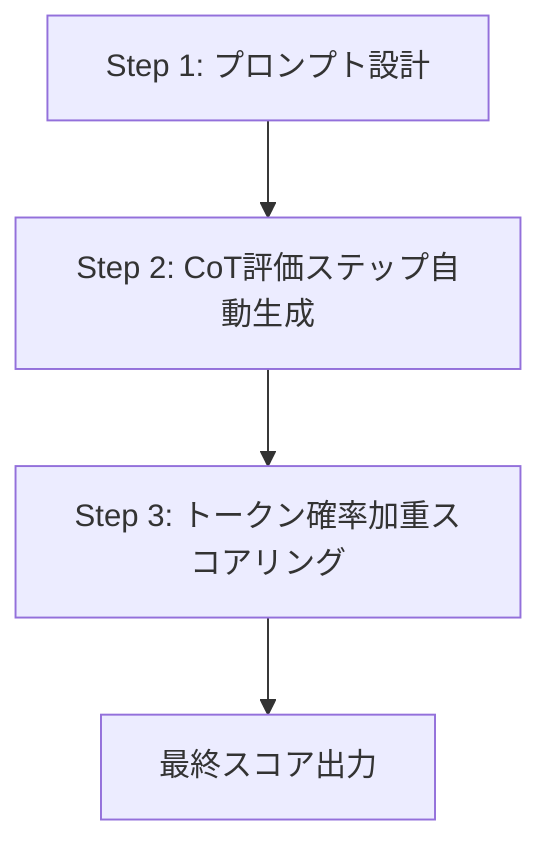

本記事は [G-Eval: NLG Evaluation using GPT-4 with Better Human Alignment](https://arxiv.org/abs/2303.16634) の解説記事です。

## 論文概要（Abstract）

自然言語生成（NLG）タスクの自動評価は、BLEU・ROUGEなどの従来指標では人手評価との相関が低いという長年の課題がある。著者らは、LLMのChain-of-Thought（CoT）能力を活用して評価ステップを自動生成し、さらにトークン確率の加重平均でスコアを安定化させるフレームワーク**G-Eval**を提案している。要約タスク（SummEval）においてSpearman相関0.514を達成し、BERTScoreの0.209を大幅に上回ったと報告されている。

この記事は [Zenn記事: LangSmith Datasets×Experimentsでエージェント品質を自動テストする](https://zenn.dev/0h_n0/articles/6d33daf25f3dc7) の深掘りです。Zenn記事のカスタム評価関数でLLMに「数値のみ返答」を指示する手法は、G-EvalのForm-fillingアプローチに基づいています。

## 情報源

- **arXiv ID**: 2303.16634
- **URL**: [https://arxiv.org/abs/2303.16634](https://arxiv.org/abs/2303.16634)
- **著者**: Yang Liu, Dan Iter, Yichong Xu, et al.（Microsoft Research）
- **発表年**: 2023年（EMNLP 2023に採択）
- **分野**: cs.CL
- **実装**: [github.com/nlpyang/geval](https://github.com/nlpyang/geval)

## 背景と動機（Background & Motivation）

NLG（自然言語生成）の評価は、テキスト品質の多面性（流暢さ、一貫性、関連性、事実整合性など）から自動化が困難である。BLEUやROUGEは参照テキストとのn-gram一致を測定するが、言い換えや要約スタイルの違いを適切に捉えられない。BERTScoreは文脈埋め込みを使うが、それでも人手評価との相関は限定的である。

著者らは、「LLMの推論能力を評価プロセスに組み込むことで、人手評価に近い自動評価を実現できる」という仮説のもと、CoTベースの評価フレームワークを設計している。単にスコアを出力させるのではなく、評価の手順を段階的に生成させることで、より構造化された判断を引き出す狙いがある。

## 主要な貢献（Key Contributions）

- **CoT評価ステップの自動生成**: 評価タスクと基準を入力として、LLMに評価手順を自動生成させるアプローチ。人手で評価ステップを設計する必要がない
- **トークン確率加重スコアリング**: LLMが出力するスコアトークンの確率分布を利用し、加重平均でスコアを算出する手法。単一トークンの出力よりも安定したスコアを得られる
- **Form-fillingパラダイム**: 従来のopen-ended生成ではなく、構造化されたフォーマットに沿って評価を出力させる設計
- **従来指標を大幅に上回る相関**: SummEvalでSpearman相関0.514（vs BERTScore 0.209）、TopicalChatで0.573（vs BERTScore 0.126）を達成

## 技術的詳細（Technical Details）

### G-Evalの3ステップアーキテクチャ

G-Evalは以下の3つのステップで構成される。



**Step 1: プロンプト設計**

評価タスクと評価基準を定義するプロンプトを構成する。

```
You will be given a summary written for a news article.
Your task is to rate the summary on one metric.
Please make sure you read and understand these instructions carefully.

Evaluation Criteria:
Coherence (1-5) - The collective quality of all sentences.
The summary should be well-structured and well-organized.
```

**Step 2: CoT評価ステップの自動生成**

プロンプトをLLMに入力し、評価を行うための具体的なステップを自動生成させる。

```
Evaluation Steps:
1. Read the news article carefully and identify the main topic and key points.
2. Read the summary and compare it to the news article.
3. Check if the summary covers the main topic and key points.
4. Check if the summary is well-organized and follows a logical flow.
5. Assign a score for coherence on a scale of 1 to 5.
```

**Step 3: トークン確率加重スコアリング**

LLMがスコアトークン（1〜5）を出力する際の確率分布を取得し、加重平均でスコアを算出する。

$$
s = \sum_{i=1}^{5} i \cdot p(i)
$$

ここで、$p(i)$はLLMがスコア$i$を出力する確率（softmax後のトークン確率）である。

**具体例**: あるサンプルに対してLLMのトークン確率が $p(1)=0.01, p(2)=0.05, p(3)=0.20, p(4)=0.50, p(5)=0.24$ の場合:

$$
s = 1 \times 0.01 + 2 \times 0.05 + 3 \times 0.20 + 4 \times 0.50 + 5 \times 0.24 = 3.91
$$

この加重スコアリングにより、単一トークン出力（例: "4"）よりも微細な差分を捉えられる。

### 4つの評価次元

著者らは要約タスクに対して以下の4次元を評価している（論文Table 1より）。

| 次元 | 定義 | 評価対象 |
|------|------|---------|
| **Fluency** | 文法的正しさと読みやすさ | 各文の品質 |
| **Coherence** | 構造と論理的流れ | 全文の一貫性 |
| **Consistency** | 原文との事実整合性 | 事実の正確さ |
| **Relevance** | 重要情報の網羅度 | 要点の包含 |

各次元は独立したプロンプト（個別のCoTステップ付き）で評価される。これにより、1つの次元の評価が他の次元に影響するのを防いでいる。

### temperature=0 vs トークン確率加重

著者らは両アプローチを比較した実験を報告している。

| 手法 | SummEval Spearman | TopicalChat Spearman |
|------|-------------------|---------------------|
| temperature=0 + 単一トークン | 0.457 | 0.531 |
| **トークン確率加重** | **0.514** | **0.573** |

トークン確率加重により、全次元で相関が向上している。著者らは、temperature=0ではスコアが離散的になり同順位が多発するのに対し、確率加重では連続値となり人手評価との順序相関が改善すると分析している。

## 実装のポイント（Implementation）

**トークン確率の取得**: G-Evalの確率加重スコアリングにはLLMのlogprobs出力が必要である。OpenAI APIでは`logprobs=True`パラメータで取得可能だが、一部のAPIやモデルでは確率出力がサポートされていない点に注意が必要である。

```python
from openai import OpenAI

client = OpenAI()

def g_eval_score(prompt: str, document: str, summary: str) -> float:
    """G-Evalによるトークン確率加重スコアリング"""
    response = client.chat.completions.create(
        model="gpt-4.1-mini",
        messages=[
            {"role": "system", "content": prompt},
            {"role": "user", "content": f"Document: {document}\nSummary: {summary}"},
        ],
        temperature=1,
        max_tokens=1,
        logprobs=True,
        top_logprobs=5,
    )

    token_logprobs = response.choices[0].logprobs.content[0].top_logprobs
    import math
    score = 0.0
    total_prob = 0.0
    for logprob_entry in token_logprobs:
        token = logprob_entry.token.strip()
        if token in {"1", "2", "3", "4", "5"}:
            prob = math.exp(logprob_entry.logprob)
            score += int(token) * prob
            total_prob += prob

    if total_prob > 0:
        score /= total_prob
    return score
```

**LangSmithとの統合**: 上記の`g_eval_score`関数をLangSmithのpytestテスト内で`t.trace_feedback()`と組み合わせて使用することで、CoTベースの構造化評価をCI/CDパイプラインに組み込める。

**CoTステップの再利用**: 一度生成した評価ステップは同じ評価基準のタスクに再利用できる。ステップをコードとして保存し、バージョン管理することが推奨される。

## Production Deployment Guide

### AWS実装パターン（コスト最適化重視）

G-Eval評価パイプラインは外部LLM APIを利用するため、GPU不要のServerless構成が最もコスト効率が高い。

| 規模 | 月間評価数 | 推奨構成 | 月額コスト | 主要サービス |
|------|----------|---------|-----------|------------|
| **Small** | ~3,000 | Serverless | $30-100 | Lambda + API Gateway + DynamoDB |
| **Medium** | ~30,000 | Hybrid | $200-600 | Lambda + SQS + ElastiCache |
| **Large** | 300,000+ | Container | $1,500-4,000 | ECS Fargate + SQS + ElastiCache |

**Small構成の詳細**（月額$30-100）:
- **Lambda**: 512MB RAM, 30秒タイムアウト（$5/月）
- **外部LLM API**: gpt-4.1-mini（$0.40/1M input + $1.60/1M output）、3,000件×2Kトークン ≈ $10-20/月
- **DynamoDB**: On-Demand、スコアキャッシュ（$5/月）

**コスト削減テクニック**:
- 確率加重スコアリング: `max_tokens=1`により出力トークン数を最小化
- CoTステップキャッシュ: 同一評価基準のステップを再利用
- バッチ処理: OpenAI Batch APIで50%割引
- 評価次元の選択的実行: 全4次元ではなく必要な次元のみ評価

**コスト試算の注意事項**: 上記は2026年6月時点の料金に基づく概算値です。LLM APIの料金は頻繁に変更されるため、最新料金を確認してください。

### Terraformインフラコード

**Small構成: Lambda + DynamoDB**

```hcl
resource "aws_iam_role" "lambda_geval" {
  name = "lambda-geval-role"

  assume_role_policy = jsonencode({
    Version = "2012-10-17"
    Statement = [{
      Action    = "sts:AssumeRole"
      Effect    = "Allow"
      Principal = { Service = "lambda.amazonaws.com" }
    }]
  })
}

resource "aws_iam_role_policy" "secrets_access" {
  role = aws_iam_role.lambda_geval.id

  policy = jsonencode({
    Version = "2012-10-17"
    Statement = [{
      Effect   = "Allow"
      Action   = ["secretsmanager:GetSecretValue"]
      Resource = aws_secretsmanager_secret.openai_key.arn
    }]
  })
}

resource "aws_secretsmanager_secret" "openai_key" {
  name = "geval-openai-api-key"
}

resource "aws_lambda_function" "geval" {
  filename      = "geval_lambda.zip"
  function_name = "g-eval-scorer"
  role          = aws_iam_role.lambda_geval.arn
  handler       = "index.handler"
  runtime       = "python3.12"
  timeout       = 30
  memory_size   = 512

  environment {
    variables = {
      DYNAMODB_TABLE = aws_dynamodb_table.geval_cache.name
      SECRET_ARN     = aws_secretsmanager_secret.openai_key.arn
      MODEL_ID       = "gpt-4.1-mini"
    }
  }
}

resource "aws_dynamodb_table" "geval_cache" {
  name         = "geval-score-cache"
  billing_mode = "PAY_PER_REQUEST"
  hash_key     = "eval_hash"

  attribute {
    name = "eval_hash"
    type = "S"
  }

  ttl {
    attribute_name = "expire_at"
    enabled        = true
  }
}
```

### 運用・監視設定

**CloudWatch Logs Insights クエリ**:

```sql
-- 評価次元別のスコア分布
fields @timestamp, dimension, weighted_score
| stats avg(weighted_score) as avg, stddev(weighted_score) as std by dimension

-- API呼び出しコスト追跡
fields @timestamp, input_tokens, output_tokens
| stats sum(input_tokens) as total_input, sum(output_tokens) as total_output by bin(1d)
```

### コスト最適化チェックリスト

**API呼び出し最適化**:
- [ ] `max_tokens=1`で出力トークン最小化
- [ ] CoTステップをキャッシュして再生成を回避
- [ ] Batch API利用で50%割引
- [ ] 評価次元の選択的実行（全次元必要でない場合）

**インフラ最適化**:
- [ ] Lambda: メモリ512MBで十分（CPU集約でなくI/O待ち）
- [ ] DynamoDB: TTL設定で古いキャッシュを自動削除
- [ ] SQS: 大量評価時のバッファリング

**品質管理**:
- [ ] logprobs非対応モデルのフォールバック処理
- [ ] スコア分布の定期モニタリング（バイアス検知）
- [ ] 人手評価との定期的な相関検証

## 実験結果（Results）

### 主要ベンチマークでの比較

論文Table 3より、SummEvalベンチマークでの各手法のSpearman相関を以下に示す。

| 手法 | Fluency | Coherence | Consistency | Relevance | 平均 |
|------|---------|-----------|-------------|-----------|------|
| BLEU | 0.115 | 0.130 | 0.096 | 0.176 | 0.129 |
| ROUGE-L | 0.115 | 0.128 | 0.130 | 0.219 | 0.148 |
| BERTScore | 0.157 | 0.175 | 0.166 | 0.337 | 0.209 |
| GPT-3.5 (CoT無し) | 0.302 | 0.361 | 0.322 | 0.386 | 0.343 |
| **G-Eval (GPT-4)** | **0.462** | **0.546** | **0.504** | **0.543** | **0.514** |

著者らは、G-Eval（GPT-4）がBERTScoreの約2.5倍の相関を達成したと報告している。特にCoherence（一貫性）とConsistency（事実整合性）で改善幅が大きく、これらの評価がLLMの推論能力によって大幅に向上することを示している。

### TopicalChatベンチマークでの結果

対話生成タスク（TopicalChat、8モデル比較）でも同様の傾向が確認されている。G-Eval（GPT-4）はSpearman相関0.573を達成し、BERTScoreの0.126を大幅に上回ったと報告されている。

## 実運用への応用（Practical Applications）

**LangSmithとの統合**: G-Evalの4次元評価はLangSmithのpytestテストで以下のように実装できる。各次元を独立した`t.log_feedback()`として記録し、LangSmith UIのExperiment比較ビューで次元別のスコア変化を追跡する設計が有効である。

**CI/CDでの活用**: G-Evalのコスト効率の高さ（`max_tokens=1`）はCI/CDパイプラインに適している。PRごとの回帰テストでは全次元を評価し、ナイトリービルドでは詳細なCoTステップを含む精密評価を実行する使い分けが考えられる。

**制約**: 確率加重スコアリングはlogprobs出力をサポートするAPIに限定される。Amazon Bedrock等のlogprobs非対応サービスではtemperature=0による単一トークン出力にフォールバックする必要がある。

## 関連研究（Related Work）

- **Judging LLM-as-a-Judge**（Zheng et al., 2023）: LLM-as-Judge手法の基盤論文。G-EvalはSingle-Answer Gradingモードに相当するが、CoTステップと確率加重で精度を向上させている
- **PROMETHEUS**（Kim et al., 2023）: オープンソースジャッジモデル。G-Evalとは異なりプロプライエタリAPIに依存しないが、ルーブリック設計が必要
- **UniEval**（Zhong et al., 2022）: Boolean QA形式での評価。G-Eval以前のLLMベース評価の先駆け

## まとめと今後の展望

G-Evalは、CoTによる評価ステップ自動生成とトークン確率加重スコアリングの組み合わせにより、NLG評価における人手評価との相関を大幅に向上させた。実装が比較的容易であり（`max_tokens=1` + `logprobs=True`のみ）、LangSmithのCI/CDパイプラインに組み込みやすい点が実用上の利点である。ただし、数学やコード生成など、NLG以外のタスクへの適用は未検証であり、タスク特性に応じた評価手法の選択が必要である。

## 参考文献

- **arXiv**: [https://arxiv.org/abs/2303.16634](https://arxiv.org/abs/2303.16634)
- **Code**: [https://github.com/nlpyang/geval](https://github.com/nlpyang/geval)
- **Related Zenn article**: [https://zenn.dev/0h_n0/articles/6d33daf25f3dc7](https://zenn.dev/0h_n0/articles/6d33daf25f3dc7)

---

:::message
この記事はAI（Claude Code）により自動生成されました。内容の正確性については原論文と照合していますが、最新の情報は公式ドキュメントもご確認ください。
:::
