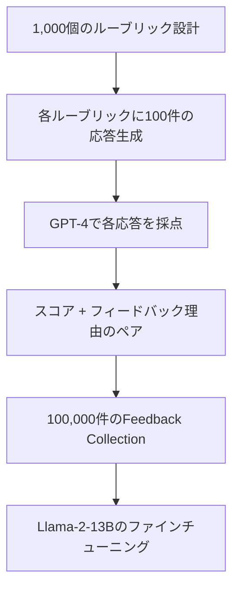

本記事は [PROMETHEUS: Inducing Fine-grained Evaluation Capability in Language Models](https://arxiv.org/abs/2310.07641) の解説記事です。

## 論文概要（Abstract）

GPT-4などのプロプライエタリLLMを評価器として使う手法が一般化しているが、透明性の欠如、コスト、API依存性などの問題がある。著者らは、カスタムルーブリック（評価基準）を入力として受け取り、1-5のスコアと理由を出力するオープンソースのジャッジモデル**PROMETHEUS**を提案している。100,000件のフィードバックデータ（Feedback Collection）でLlama-2-13Bをファインチューニングし、GPT-4ジャッジと同等の人手評価との相関を達成したと報告されている。

この記事は [Zenn記事: LangSmith Datasets×Experimentsでエージェント品質を自動テストする](https://zenn.dev/0h_n0/articles/6d33daf25f3dc7) の深掘りです。Zenn記事ではOpenAI APIのLLM-as-Judgeを使ったカスタム評価関数が紹介されていますが、PROMETHEUSはそのオープンソース代替を提供する研究です。

## 情報源

- **arXiv ID**: 2310.07641
- **URL**: [https://arxiv.org/abs/2310.07641](https://arxiv.org/abs/2310.07641)
- **著者**: Seungone Kim, Jamin Shin, Yejin Cho, et al.（KAIST AI）
- **発表年**: 2023年（ICLR 2024に採択）
- **分野**: cs.CL, cs.AI
- **実装**: [github.com/kaistAI/prometheus](https://github.com/kaistAI/prometheus)（Apache 2.0）
- **モデル**: [HuggingFace kaist-ai/prometheus-13b-v1.0](https://huggingface.co/kaist-ai/prometheus-13b-v1.0)

## 背景と動機（Background & Motivation）

LLMの出力評価において、GPT-4を評価器として使う手法が事実上の標準となっているが、以下の問題がある。(1) クローズドソースAPIへの依存によりコストが予測困難、(2) モデル更新により評価結果が変動するリスク、(3) 機密データの外部送信に関するセキュリティ懸念、(4) 評価ロジックの透明性が低い。

著者らはこれらの課題に対し、「オープンソースのLLMでGPT-4レベルの評価精度を実現できるか」という研究課題を設定している。従来のオープンソースモデル（Llama-2、Vicuna等）は、評価タスクではGPT-4に大幅に劣後していたため、この問題の解決は実用上大きな意義を持つ。

## 主要な貢献（Key Contributions）

- **PROMETHEUS**: ルーブリックを入力として受け取り、細粒度の1-5スコアと詳細なフィードバック（理由説明）を出力するオープンソースジャッジモデル
- **Feedback Collection**: GPT-4を使って生成した100,000件の高品質フィードバックデータセット。1,000個のルーブリック×100件の応答で構成
- **Feedback Benchmark**: 29タスクにわたるジャッジモデル評価ベンチマーク。Absolute grading（1-5スコア）とRelative grading（A/B比較）の両方をカバー
- **人手評価との同等性実証**: Human-PROMETHEUS間のPearson相関が0.880であり、Human-GPT4間の0.882とほぼ同等であることを示した

## 技術的詳細（Technical Details）

### アーキテクチャ

PROMETHEUSはLlama-2-13Bをベースモデルとし、Feedback Collectionでファインチューニングされている。入力は以下の4つの要素で構成される。

```
[Instruction] + [Response] + [Reference Answer] + [Score Rubric] → [Score] + [Feedback]
```

**入力フォーマット**:

```
###Task Description:
An instruction (might include an Input inside it), a response to evaluate,
a reference answer that gets a score of 5, and a score rubric representing
a evaluation criteria are given.
1. Write a detailed feedback that assess the quality of the response strictly
   based on the given score rubric, not evaluating in general.
2. After writing a feedback, write a score that is an integer between 1 and 5.

###The instruction to evaluate:
{instruction}

###Response to evaluate:
{response}

###Reference Answer (Score 5):
{reference_answer}

###Score Rubrics:
[{criteria_description}]
Score 1: {score_1_description}
Score 2: {score_2_description}
Score 3: {score_3_description}
Score 4: {score_4_description}
Score 5: {score_5_description}

###Feedback:
```

### ルーブリック設計

ルーブリックは評価品質を決定する最重要要素である。著者らは以下の設計原則を示している。

1. **評価基準の明確化**: 何を評価するかを1文で明確に定義する（例: "回答の事実的正確性"）
2. **スコアレンジの詳細定義**: 1-5の各スコアに対して具体的な条件を記述する
3. **参照回答の提供**: スコア5に対応する理想的な回答例を提供する

$$
\text{Eval Quality} = f(\text{Rubric Clarity}, \text{Reference Quality}, \text{Model Capability})
$$

著者らの実験では、ルーブリックが曖昧な場合、PROMETHEUSの評価精度が顕著に低下することが確認されている。

### Feedback Collectionの構築

著者らはGPT-4を使って100,000件のフィードバックデータを以下の手順で生成したと報告している。



**品質管理**: 生成されたフィードバックはルーブリックとの整合性を自動チェックし、不整合なサンプルは除外されている。最終的なデータセットはHuggingFaceで公開されている。

### 訓練の詳細

- **ベースモデル**: Llama-2-13B-Chat
- **訓練データ**: Feedback Collection（100,000件）
- **学習率**: 2e-5
- **バッチサイズ**: 128
- **エポック数**: 3
- **推論速度**: A100 GPUで約2秒/サンプル

## 実装のポイント（Implementation）

PROMETHEUSをプロダクションに導入する際の注意点をまとめる。

**ルーブリック設計の重要性**: 評価品質の大部分はルーブリックの質に依存する。汎用的なルーブリック（"回答の質を評価せよ"）ではなく、タスク固有の具体的な基準を定義する必要がある。Zenn記事の`RELEVANCE_THRESHOLD`のような閾値管理と組み合わせる場合、ルーブリックのスコア定義と閾値の整合性を保つことが重要である。

**GPT-4との使い分け**: 著者らの実験では、創造的タスクやオープンエンドな評価ではGPT-4がPROMETHEUSを上回る傾向がある。一方、事実確認や構造化された基準に基づく評価ではPROMETHEUSが同等以上の精度を達成している。コストと精度のトレードオフに基づく判断が必要である。

**推論コスト**: PROMETHEUS-13Bは1評価あたり約2秒（A100）。GPT-4 APIの1評価あたり約$0.05と比較して、GPUホスティング費用が月$2,000程度の場合、月間約130万件以上の評価でオープンソースモデルのほうがコスト効率が高くなる計算となる。

**多言語対応の制約**: PROMETHEUSは英語中心で訓練されている。日本語のエージェント評価に使用する場合、ルーブリックとフィードバックの言語混在によるスコア変動に注意が必要である。

## Production Deployment Guide

### AWS実装パターン（コスト最適化重視）

PROMETHEUSをセルフホストする場合のAWS構成を以下に示す。

| 規模 | 月間評価数 | 推奨構成 | 月額コスト | 主要サービス |
|------|----------|---------|-----------|------------|
| **Small** | ~3,000 | Serverless + API | $50-150 | Lambda + Bedrock（Haiku代替）+ DynamoDB |
| **Medium** | ~30,000 | GPU推論 | $800-2,000 | ECS Fargate + g5.xlarge Spot + ElastiCache |
| **Large** | 300,000+ | クラスタ推論 | $3,000-8,000 | EKS + Karpenter + g5.xlarge×2-4台 Spot |

**Small構成の補足**: 月間3,000件以下の評価であればPROMETHEUSのセルフホストよりBedrock Claude Haiku（API利用）のほうがコスト効率が高い。PROMETHEUSの利点はデータプライバシーとAPI依存排除にある。

**Medium構成の詳細**（月額$800-2,000）:
- **ECS Fargate**: g5.xlarge Spot（1 GPU, 16GB VRAM）1台（$300-600/月）
- **推論サーバー**: vLLMまたはTGI（$0/月、OSSライセンス）
- **ElastiCache Redis**: 評価結果キャッシュ（$15/月）
- **Application Load Balancer**: ヘルスチェック付き（$20/月）

**コスト削減テクニック**:
- Spot Instancesで最大90%削減（g5.xlarge: On-Demand $1.006/h → Spot ~$0.30/h）
- バッチ処理による推論効率化（動的バッチサイズ最大32）
- 同一ルーブリックの評価結果をRedisでキャッシュ

**コスト試算の注意事項**: 上記は2026年6月時点のAWS ap-northeast-1（東京）リージョン料金に基づく概算値です。GPU Spot Instancesの料金は変動が大きいため、最新料金は [AWS料金計算ツール](https://calculator.aws/) で確認してください。

### Terraformインフラコード

**Medium構成: ECS + GPU Spot Instance**

```hcl
module "vpc" {
  source  = "terraform-aws-modules/vpc/aws"
  version = "~> 5.0"

  name = "prometheus-judge-vpc"
  cidr = "10.0.0.0/16"
  azs  = ["ap-northeast-1a", "ap-northeast-1c"]
  private_subnets = ["10.0.1.0/24", "10.0.2.0/24"]
  public_subnets  = ["10.0.101.0/24", "10.0.102.0/24"]

  enable_nat_gateway = true
  single_nat_gateway = true
}

resource "aws_ecs_cluster" "prometheus" {
  name = "prometheus-judge-cluster"

  setting {
    name  = "containerInsights"
    value = "enabled"
  }
}

resource "aws_ecs_capacity_provider" "gpu_spot" {
  name = "gpu-spot-provider"

  auto_scaling_group_provider {
    auto_scaling_group_arn         = aws_autoscaling_group.gpu.arn
    managed_termination_protection = "DISABLED"

    managed_scaling {
      status          = "ENABLED"
      target_capacity = 80
    }
  }
}

resource "aws_launch_template" "gpu_instance" {
  name_prefix   = "prometheus-gpu-"
  image_id      = data.aws_ami.ecs_gpu.id
  instance_type = "g5.xlarge"

  instance_market_options {
    market_type = "spot"
    spot_options {
      max_price = "0.50"
    }
  }
}

resource "aws_ecs_task_definition" "prometheus_inference" {
  family                   = "prometheus-judge"
  requires_compatibilities = ["EC2"]
  network_mode             = "awsvpc"

  container_definitions = jsonencode([{
    name  = "prometheus-inference"
    image = "ghcr.io/huggingface/text-generation-inference:latest"
    gpu   = 1

    environment = [
      { name = "MODEL_ID", value = "kaist-ai/prometheus-13b-v1.0" },
      { name = "MAX_BATCH_SIZE", value = "32" },
      { name = "MAX_INPUT_LENGTH", value = "4096" },
    ]

    portMappings = [{
      containerPort = 8080
      protocol      = "tcp"
    }]

    logConfiguration = {
      logDriver = "awslogs"
      options = {
        "awslogs-group"  = "/ecs/prometheus-judge"
        "awslogs-region" = "ap-northeast-1"
      }
    }
  }])
}
```

### 運用・監視設定

**CloudWatch Logs Insights クエリ**:

```sql
-- 評価スコア分布（ルーブリック別）
fields @timestamp, rubric_id, score, feedback_length
| stats avg(score) as avg_score, count(*) as eval_count by rubric_id
| sort eval_count desc

-- 推論レイテンシ分析
fields @timestamp, inference_time_ms
| stats pct(inference_time_ms, 50) as p50, pct(inference_time_ms, 95) as p95,
        pct(inference_time_ms, 99) as p99 by bin(5m)
```

### コスト最適化チェックリスト

**モデル選択判断**:
- [ ] 月間3,000件未満 → Bedrock Haiku推奨（セルフホスト不要）
- [ ] 月間3,000-130万件 → コスト比較してBedrock vs セルフホスト判断
- [ ] 月間130万件超 → セルフホスト（PROMETHEUS）推奨
- [ ] データプライバシー要件あり → セルフホスト必須

**GPU最適化**:
- [ ] Spot Instances優先（最大90%削減）
- [ ] 動的バッチサイズ設定（最大32）
- [ ] 夜間・週末のスケールダウン（0台）
- [ ] vLLMのPagedAttention有効化（メモリ効率向上）

**監視**:
- [ ] GPU使用率モニタリング（CloudWatch）
- [ ] 推論レイテンシP95/P99追跡
- [ ] Spot中断アラート設定
- [ ] 月次コストレポート自動送信

## 実験結果（Results）

### Feedback Benchmarkでの評価

論文Table 2より、各モデルの評価精度を以下に示す。

| モデル | Pearson相関（Human） | Spearman相関（Human） | Kendall相関（Human） |
|--------|---------------------|---------------------|---------------------|
| GPT-4 | 0.882 | 0.870 | 0.751 |
| **PROMETHEUS-13B** | **0.880** | **0.868** | **0.745** |
| GPT-3.5-Turbo | 0.753 | 0.735 | 0.612 |
| Llama-2-Chat-13B | 0.412 | 0.390 | 0.310 |

著者らは、PROMETHEUS-13BがGPT-4とほぼ同等のPearson相関（0.880 vs 0.882）を達成したと報告している。ファインチューニング前のLlama-2-Chat-13Bの相関が0.412であることから、Feedback Collectionによる訓練が評価能力を大幅に向上させたことが分かる。

### Absolute Grading vs Relative Grading

著者らは2つの評価モードでの精度も報告している。

- **Absolute Grading**（1-5スコア）: PROMETHEUSはGPT-4の85%の精度を達成
- **Relative Grading**（A/B比較）: PROMETHEUSはGPT-4の82%の精度を達成

Absolute Gradingのほうが相対的に精度が高い結果となっており、ルーブリックが明確に定義されている場合に特に有効であると著者らは分析している。

## 実運用への応用（Practical Applications）

**LangSmithとの統合**: Zenn記事のカスタム評価関数をPROMETHEUSで置き換えることで、API依存を排除できる。ただし、推論サーバーの運用コストとレイテンシのトレードオフを考慮する必要がある。

**セルフホスト評価サーバー**: 機密データを扱うエージェント（医療、法務、金融等）の評価では、外部APIへのデータ送信を避けるためにPROMETHEUSのセルフホストが有効な選択肢となる。

**ルーブリックのバージョン管理**: 評価基準をコードとして管理し、PRごとにルーブリックの変更をレビューする運用が推奨される。これはZenn記事のDataset管理と同じ設計思想である。

## 関連研究（Related Work）

- **Judging LLM-as-a-Judge**（Zheng et al., 2023）: LLM-as-Judge手法の基盤論文。PROMETHEUSはこのアプローチをオープンソース化した位置づけである
- **G-Eval**（Liu et al., 2023）: CoTベースの自動評価フレームワーク。PROMETHEUSとは異なりプロプライエタリAPI依存だが、トークン確率を活用したスコアリングを行う
- **Auto-J**（Li et al., 2024）: PROMETHEUS以後に登場したオープンソースジャッジモデル。13Bから70Bまでのバリエーションを提供

## まとめと今後の展望

PROMETHEUSは、オープンソースのLLMでGPT-4レベルの評価精度を実現できることを示した重要な研究である。ルーブリック設計の質が評価精度を大きく左右するため、LangSmithのpytest統合で活用する場合は、タスク固有の具体的なルーブリックを設計することが成功の鍵となる。後続研究のPROMETHEUS-2（Kim et al., 2024）では70Bモデルへのスケールアップと多言語対応が進められている。

## 参考文献

- **arXiv**: [https://arxiv.org/abs/2310.07641](https://arxiv.org/abs/2310.07641)
- **Code**: [https://github.com/kaistAI/prometheus](https://github.com/kaistAI/prometheus)（Apache 2.0）
- **Model**: [https://huggingface.co/kaist-ai/prometheus-13b-v1.0](https://huggingface.co/kaist-ai/prometheus-13b-v1.0)
- **Related Zenn article**: [https://zenn.dev/0h_n0/articles/6d33daf25f3dc7](https://zenn.dev/0h_n0/articles/6d33daf25f3dc7)

---

:::message
この記事はAI（Claude Code）により自動生成されました。内容の正確性については原論文と照合していますが、最新の情報は公式ドキュメントもご確認ください。
:::
