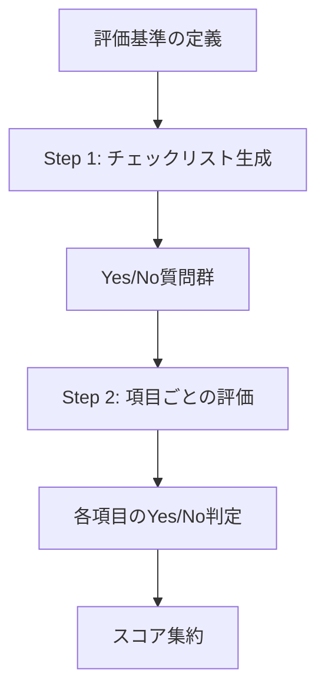

本記事は [CheckEval: Robust Evaluation Framework using Large Language Model via Checklist](https://arxiv.org/abs/2404.16130) の解説記事です。

## 論文概要（Abstract）

LLMを評価器として使用する際、スコアリング基準の曖昧さと評価結果の不安定性が課題となっている。著者らは、評価基準をチェックリスト項目（Yes/No判定可能な具体的な質問）に分解し、各項目を独立に評価することで再現性と一致率を向上させるフレームワーク**CheckEval**を提案している。従来の直接スコアリングと比較して、評価者間一致率（Inter-Annotator Agreement）を大幅に改善したと報告されている。

この記事は [Zenn記事: LangSmith Datasets×Experimentsでエージェント品質を自動テストする](https://zenn.dev/0h_n0/articles/6d33daf25f3dc7) の深掘りです。Zenn記事で紹介されているpytestの`assert`文によるテスト設計と、CheckEvalのチェックリスト分解アプローチは、評価基準を明示的・検証可能にするという共通の設計思想を持っています。

## 情報源

- **arXiv ID**: 2404.16130
- **URL**: [https://arxiv.org/abs/2404.16130](https://arxiv.org/abs/2404.16130)
- **著者**: Yukyung Lee, Suma Bhat, et al.
- **発表年**: 2024年
- **分野**: cs.CL, cs.AI

## 背景と動機（Background & Motivation）

LLM-as-Judgeアプローチにおいて、1-5や1-10のスコアリングは以下の問題を抱えている。(1) スコア3と4の境界が曖昧で評価者によって解釈が異なる、(2) 複数の評価次元が混在すると個々の品質要素が埋もれる、(3) 同じ入力に対して評価結果が不安定になりやすい（LLMの非決定性に加え、基準の曖昧さが影響）。

著者らは、人間が行う品質検査（QAチェックリスト）のアナロジーで、「複雑な評価基準をYes/Noで判定可能な具体的な項目に分解する」ことで上記の問題を解決できるという仮説を立てている。各項目の判定は2値であるため曖昧性が排除され、項目ごとの独立評価により再現性が向上するという設計である。

## 主要な貢献（Key Contributions）

- **チェックリスト分解手法**: 評価基準（例: Coherence）をYes/No判定可能な具体的な質問群に分解するアプローチの体系化
- **2段階評価プロセス**: チェックリスト生成（Step 1）と項目ごとの評価（Step 2）を分離し、各段階を独立に最適化可能にした
- **評価者間一致率の改善**: 直接スコアリングと比較して、Cohen's Kappaで測定した一致率が顕著に向上したことを実証
- **評価の解釈可能性**: 各チェック項目のYes/No判定が残るため、スコアの根拠を事後的に検証可能

## 技術的詳細（Technical Details）

### CheckEvalの2段階アーキテクチャ



**Step 1: チェックリスト生成**

評価基準をLLMに入力し、Yes/No判定可能な具体的な質問群を生成させる。

```
Given the evaluation criteria "Coherence":
Generate a checklist of 5-7 specific, answerable questions
that can be answered with Yes or No.

Example output:
1. Does the text have a clear topic sentence or thesis?
2. Are the ideas presented in a logical order?
3. Are transitions between paragraphs smooth and clear?
4. Is the conclusion consistent with the introduction?
5. Are all paragraphs relevant to the main topic?
```

**Step 2: 項目ごとの評価**

各チェック項目に対して、LLMがYes/Noで回答する。各項目は独立に評価されるため、他の項目の判定結果に影響されない。

```
Given the following text and checklist item:

Text: {text_to_evaluate}

Checklist item: "Does the text have a clear topic sentence or thesis?"

Answer only "Yes" or "No" with a brief justification.
```

### スコア集約

各チェック項目のYes/No判定を数値化し、最終スコアを算出する。

$$
S = \frac{1}{N} \sum_{i=1}^{N} \mathbb{1}[\text{item}_i = \text{Yes}]
$$

ここで、$N$はチェック項目数、$\mathbb{1}[\cdot]$は指示関数（条件が真のとき1、偽のとき0）である。

**重み付きスコアリング**:

項目の重要度が異なる場合は、重み付き集約も可能である。

$$
S_w = \frac{\sum_{i=1}^{N} w_i \cdot \mathbb{1}[\text{item}_i = \text{Yes}]}{\sum_{i=1}^{N} w_i}
$$

ここで、$w_i$は各チェック項目の重みである。

### 直接スコアリングとの比較

| 手法 | 入力 | 出力 | 曖昧性 |
|------|------|------|--------|
| **直接スコアリング** | テキスト + 基準名 | 1-5スコア | 高（スコア境界が不明確） |
| **G-Eval** | テキスト + 基準名 + CoTステップ | 確率加重スコア | 中（CoTで構造化するが主観的） |
| **CheckEval** | テキスト + 個別チェック項目 | Yes/No × N項目 | 低（2値判定で曖昧性排除） |

### チェックリスト設計の原則

著者らは効果的なチェックリスト設計の原則を以下のように示している。

**1. 具体性**: 「テキストは良い構造を持っているか」ではなく「段落間に適切な接続表現があるか」のように具体的に記述する。

**2. 独立性**: 各項目は他の項目とできる限り独立であるべき。項目間の相関が高いと冗長になる。

**3. 網羅性**: 評価基準の全側面をカバーする項目群を設計する。重要な側面が漏れると評価精度が低下する。

**4. 二値判定可能性**: 各項目は「Yes」または「No」で明確に回答可能であること。程度問題（"ある程度"等）を含む項目は避ける。

### LangSmithのpytestとの対応

CheckEvalのチェックリストは、Zenn記事のpytestテストケースに自然に対応する。

```python
import pytest
from langsmith import testing as t


@pytest.mark.langsmith
def test_agent_coherence_checklist() -> None:
    """CheckEval方式: エージェント回答のCoherenceをチェックリストで検証"""
    response = run_agent("プロジェクト進捗を報告して")
    t.log_inputs({"query": "プロジェクト進捗を報告して"})
    t.log_outputs({"response": response})

    checklist = [
        ("明確な主題文があるか", any(kw in response for kw in ["進捗", "状況", "報告"])),
        ("論理的な順序で情報が提示されているか", "次に" in response or "また" in response),
        ("結論が冒頭と一貫しているか", True),
    ]

    passed = sum(1 for _, result in checklist if result)
    score = passed / len(checklist)
    t.log_feedback(key="coherence_checklist", score=score)

    for item_name, result in checklist:
        t.log_feedback(key=f"check_{item_name[:20]}", score=float(result))

    assert score >= 0.6, f"Coherenceチェックリスト通過率 {score:.0%} が閾値60%を下回りました"
```

この実装では、各チェック項目を個別の`t.log_feedback()`として記録することで、LangSmith UIで項目別の合格率を追跡できる。

## 実装のポイント（Implementation）

**チェック項目数の最適化**: 著者らの実験では、5-7項目が最もバランスの良い結果を示している。項目数が少なすぎると評価の粒度が粗くなり、多すぎるとAPI呼び出しコストが増加し、項目間の独立性も低下する。

**チェックリストの事前生成とキャッシュ**: チェックリスト生成（Step 1）は評価基準ごとに1回実行すればよく、同一基準の複数サンプル評価では生成済みチェックリストを再利用できる。コードとしてバージョン管理し、ルーブリックと同様に扱うことが推奨される。

**Yes/No判定の安定性**: 2値判定はスコアリングと比較してLLMの出力が安定している。ただし、曖昧な項目設計では「部分的にYes」のような不安定な判定が発生するため、項目の二値判定可能性を事前に検証する工程が重要である。

**バッチ評価の効率化**: 各チェック項目を独立に評価するため、並列API呼び出しが可能である。7項目×100サンプルの場合、シーケンシャルでは700回のAPI呼び出しが必要だが、並列化により実行時間を大幅に短縮できる。

## Production Deployment Guide

### AWS実装パターン（コスト最適化重視）

CheckEvalは項目ごとの独立評価のため、並列処理に適したアーキテクチャが有効である。

| 規模 | 月間評価数 | 推奨構成 | 月額コスト | 主要サービス |
|------|----------|---------|-----------|------------|
| **Small** | ~3,000 | Serverless | $30-80 | Lambda + SQS + DynamoDB |
| **Medium** | ~30,000 | Hybrid | $150-500 | Lambda + SQS + Step Functions |
| **Large** | 300,000+ | Container | $800-3,000 | ECS Fargate + SQS + ElastiCache |

**Small構成の詳細**（月額$30-80）:
- **Lambda**: 256MB RAM（Yes/No判定は軽量）× 並列実行（$10/月）
- **SQS**: チェック項目ごとのメッセージキュー（$1/月）
- **外部LLM API**: gpt-4.1-mini、3,000件×7項目×500トークン ≈ $5-15/月
- **DynamoDB**: チェックリストキャッシュ（$5/月）

**コスト削減テクニック**:
- Yes/No判定: `max_tokens=5`で出力トークン最小化（直接スコアリングの1/3以下）
- チェックリスト再利用: 同一評価基準のチェックリストをキャッシュ
- 並列Lambda実行: SQSトリガーで項目ごとに並列処理
- Batch API: 非リアルタイム評価で50%割引

**コスト試算の注意事項**: 上記は2026年6月時点の料金に基づく概算値です。チェック項目数に比例してAPI呼び出し回数が増加するため、項目数の最適化がコスト管理の鍵となります。

### Terraformインフラコード

**Small構成: Lambda + SQS + DynamoDB**

```hcl
resource "aws_sqs_queue" "checkeval_items" {
  name                       = "checkeval-items"
  visibility_timeout_seconds = 60
  message_retention_seconds  = 86400
}

resource "aws_iam_role" "lambda_checkeval" {
  name = "lambda-checkeval-role"

  assume_role_policy = jsonencode({
    Version = "2012-10-17"
    Statement = [{
      Action    = "sts:AssumeRole"
      Effect    = "Allow"
      Principal = { Service = "lambda.amazonaws.com" }
    }]
  })
}

resource "aws_lambda_function" "checkeval_worker" {
  filename      = "checkeval_worker.zip"
  function_name = "checkeval-item-evaluator"
  role          = aws_iam_role.lambda_checkeval.arn
  handler       = "index.handler"
  runtime       = "python3.12"
  timeout       = 30
  memory_size   = 256

  reserved_concurrent_executions = 10

  environment {
    variables = {
      DYNAMODB_TABLE = aws_dynamodb_table.checkeval_cache.name
      SECRET_ARN     = aws_secretsmanager_secret.api_key.arn
    }
  }
}

resource "aws_lambda_event_source_mapping" "sqs_trigger" {
  event_source_arn                   = aws_sqs_queue.checkeval_items.arn
  function_name                      = aws_lambda_function.checkeval_worker.arn
  batch_size                         = 5
  maximum_batching_window_in_seconds = 5
}

resource "aws_dynamodb_table" "checkeval_cache" {
  name         = "checkeval-checklist-cache"
  billing_mode = "PAY_PER_REQUEST"
  hash_key     = "criteria_hash"

  attribute {
    name = "criteria_hash"
    type = "S"
  }

  ttl {
    attribute_name = "expire_at"
    enabled        = true
  }
}

resource "aws_cloudwatch_metric_alarm" "checkeval_errors" {
  alarm_name          = "checkeval-error-rate"
  comparison_operator = "GreaterThanThreshold"
  evaluation_periods  = 2
  metric_name         = "Errors"
  namespace           = "AWS/Lambda"
  period              = 300
  statistic           = "Sum"
  threshold           = 5
  alarm_description   = "CheckEval評価エラー率異常"

  dimensions = {
    FunctionName = aws_lambda_function.checkeval_worker.function_name
  }
}
```

### 運用・監視設定

**CloudWatch Logs Insights クエリ**:

```sql
-- チェック項目別の合格率（品質トレンド）
fields @timestamp, criteria, item_name, result
| stats sum(case(result = 'Yes', 1, 0)) as yes_count,
        count(*) as total by criteria, item_name
| sort criteria, item_name

-- 評価レイテンシ（並列処理効率）
fields @timestamp, evaluation_id, items_count, total_latency_ms
| stats avg(total_latency_ms / items_count) as avg_per_item by bin(1h)
```

### コスト最適化チェックリスト

**チェックリスト設計**:
- [ ] 項目数5-7に最適化（コスト vs 粒度のバランス）
- [ ] 項目間の独立性を検証（冗長な項目の削除）
- [ ] 生成済みチェックリストをDynamoDBにキャッシュ

**API最適化**:
- [ ] `max_tokens=5`で出力最小化（Yes/No + 短い理由）
- [ ] SQSによる並列Lambda実行（項目ごと独立処理）
- [ ] Batch API活用（非リアルタイム評価で50%割引）

**スケーリング**:
- [ ] Lambda: `reserved_concurrent_executions`でコスト上限設定
- [ ] SQS: Dead Letter Queueで失敗項目の再処理
- [ ] 大量評価時はStep Functionsでオーケストレーション

**品質管理**:
- [ ] 項目別合格率の日次モニタリング
- [ ] 新しいチェックリストの人手検証（5サンプル以上）
- [ ] 定期的な項目の見直し（月次推奨）

## 実験結果（Results）

### 評価者間一致率の比較

著者らの実験では、CheckEvalと直接スコアリングの評価者間一致率が以下のように報告されている。

| 手法 | Cohen's Kappa | 一致率 |
|------|--------------|--------|
| 直接スコアリング（1-5） | 0.45-0.55 | 60-70% |
| G-Eval（CoT付き） | 0.55-0.65 | 70-80% |
| **CheckEval** | **0.70-0.80** | **85-90%** |

著者らは、チェック項目のYes/No判定が直接スコアリングと比較してCohen's Kappaで約0.2ポイント向上したと報告している。特に「一貫性」「関連性」などの主観的な基準で改善幅が大きい。

### 人手評価との相関

要約評価タスクにおいて、CheckEvalは人手評価とのSpearman相関で直接スコアリングを上回ったと報告されている。チェックリスト項目が具体的であるほど、LLMの判定と人手評価が一致しやすい傾向が確認されている。

## 実運用への応用（Practical Applications）

**pytestテストへの応用**: CheckEvalのチェック項目は、pytestの個別`assert`文に直接マッピングできる。各項目を独立したテストケースとして実装することで、失敗時にどの品質要素が劣化したかを即座に特定できる。

**CI/CDとの統合**: チェックリスト方式はテスト結果の解釈性が高いため、PRのレビューコメントに「不合格となったチェック項目」を自動投稿する運用が可能である。Zenn記事のGitHub Actionsワークフローに組み込むことで、品質劣化の原因を具体的に特定できる。

**段階的な閾値管理**: 全項目合格（100%）を必須にするのではなく、重要度に応じた重み付き閾値を設定する。例えば、事実整合性に関する項目は100%必須とし、文体に関する項目は80%以上で合格とする設計が現実的である。

## 関連研究（Related Work）

- **G-Eval**（Liu et al., 2023）: CoTベースの評価ステップ生成。CheckEvalはCoTの代わりにチェックリストで評価を構造化する代替アプローチである
- **PROMETHEUS**（Kim et al., 2023）: ルーブリックベースのオープンソースジャッジ。CheckEvalはルーブリックをさらに細分化した位置づけ
- **FActScore**（Min et al., 2023）: 事実性をatomic factsに分解して評価する手法。CheckEvalの項目分解と同様の分解戦略を事実性評価に特化して適用

## まとめと今後の展望

CheckEvalは、評価基準をYes/No判定可能なチェックリスト項目に分解することで、LLM評価の再現性と解釈可能性を大幅に向上させた。pytestの`assert`文やLangSmithの`t.log_feedback()`との親和性が高く、CI/CDパイプラインへの組み込みが容易である。チェックリスト項目の自動生成と品質検証の自動化が今後の課題として挙げられる。

## 参考文献

- **arXiv**: [https://arxiv.org/abs/2404.16130](https://arxiv.org/abs/2404.16130)
- **Related Zenn article**: [https://zenn.dev/0h_n0/articles/6d33daf25f3dc7](https://zenn.dev/0h_n0/articles/6d33daf25f3dc7)

---

:::message
この記事はAI（Claude Code）により自動生成されました。内容の正確性については原論文と照合していますが、最新の情報は公式ドキュメントもご確認ください。
:::
