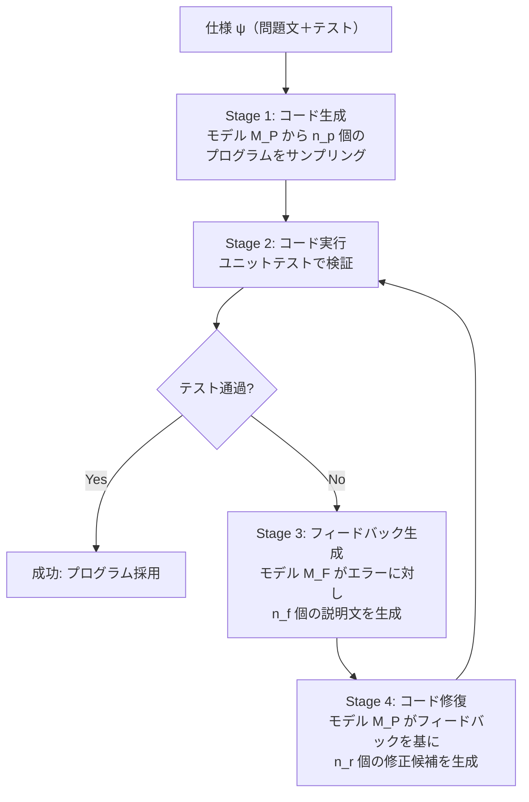

## 論文概要

本記事は [Is Self-Repair a Silver Bullet for Code Generation?](https://arxiv.org/abs/2306.09896)（arXiv:2306.09896）の解説記事です。

本論文は、LLMが自ら生成したコードのバグを自己修復（self-repair）できるかを体系的に評価した研究である。CodeLlama-13b、GPT-3.5、GPT-4の3モデルをHumanEvalとAPPSの2ベンチマークで検証し、「修復のコストを考慮すると性能改善は控えめであり、データのサブセットによって大きくばらつき、場合によっては改善が見られないこともある」と報告している。自己修復の効果はモデル自身のフィードバック生成能力がボトルネックであることを実験的に示し、人間レベルのデバッグフィードバックとの差を定量的に明らかにした。ICLR 2024に採択された。

## 情報源

| 項目 | 内容 |
|------|------|
| **タイトル** | Is Self-Repair a Silver Bullet for Code Generation? |
| **arXiv ID** | [2306.09896](https://arxiv.org/abs/2306.09896) |
| **著者** | Theo X. Olausson, Jeevana Priya Inala, Chenglong Wang, Jianfeng Gao, Armando Solar-Lezama |
| **所属** | MIT CSAIL, Microsoft Research |
| **発表** | ICLR 2024（2023年6月初版投稿、2024年2月最終版） |
| **分野** | cs.SE, cs.AI, cs.LG |
| **被引用数** | 205件（2026年6月時点、Semantic Scholar） |
| **コード** | [github.com/theoxo/self-repair](https://github.com/theoxo/self-repair) |

## 背景と動機

2022年以降、LLMによるコード生成は急速に進歩したが、複雑なタスクでは依然として正しいコードを一発で生成することが難しい。この課題に対し、**自己修復（self-repair）**というアプローチが注目を集めた。自己修復とは、LLMが生成したコードをテスト実行し、失敗した場合にエラーメッセージをフィードバックとして与え、LLM自身にコードを修正させるパイプラインである。

直感的には「試行→失敗→修正」のサイクルは人間のプログラミングプロセスに近く、性能向上が期待される。しかし著者らは、既存研究が自己修復の効果を過大評価している可能性を指摘する。具体的には、修復に使う計算コスト（追加のLLM呼び出し回数）を考慮した公平な比較が行われていなかったことが問題であった。同じ計算予算を「修復ループ」に使う代わりに「最初のコード生成を増やす」ことに使った場合と比較して、自己修復は本当に優れているのか。この問いが本研究の出発点である。

## 主要な貢献

著者らの主要な貢献は以下の通りである。

- **コスト公平な評価フレームワークの提案**: 修復に要するLLM呼び出し回数を考慮した「repair tree」の概念を導入し、同一計算予算での公平な比較を可能にした
- **自己修復の効果の定量評価**: CodeLlama-13b、GPT-3.5、GPT-4の3モデルでHumanEvalとAPPSの2ベンチマークを用いて体系的に評価し、効果がデータセット・難易度・モデルによって大きく異なることを示した
- **フィードバック品質のボトルネック特定**: 自己修復の成否はフィードバック（デバッグ説明文）の品質に依存しており、より強力なモデルや人間のフィードバックに置き換えると性能が大幅に向上することを実験的に示した
- **人間フィードバックとの比較**: 16名の被験者によるフィードバックを用いた実験で、GPT-4の自己フィードバック（修復成功率33.3%）に対し、人間フィードバック（52.6%）が1.58倍の改善をもたらすことを報告した
- **初期サンプル多様性の重要性**: 修復ループの回数を増やすより、初期コード生成の多様性を高める方がコスト効率が高いことを示した

## 技術的詳細

### 自己修復パイプラインの設計

著者らが分析する自己修復パイプラインは4段階で構成される。



このパイプラインの特徴は、コード生成モデル $$M_P$$ とフィードバック生成モデル $$M_F$$ を分離して分析できる点にある。自己修復の典型的な設定では $$M_P = M_F$$（同一モデル）だが、著者らは $$M_F$$ を別のモデルや人間に置き換える実験も行っている。

### Repair Treeによるコスト公平な評価

著者らは**repair tree** $$T$$ という概念を導入し、自己修復の計算コストを正確に評価した。repair treeは仕様 $$\psi$$ を根とする木構造で、以下のように分岐する。

$$
\text{programs}(T) = n_p + n_p \cdot n_f \cdot n_r
$$

ここで、$$n_p$$ は初期生成プログラム数、$$n_f$$ は各失敗プログラムに対するフィードバック数、$$n_r$$ は各フィードバックに対する修復候補数である。

公平な比較のため、自己修復の結果を $$k = \lvert\text{programs}(T)\rvert$$ 個のi.i.d.サンプル（修復なし）のpass@kと比較する。例えば、初期サンプル10個 + 各1回の修復（最大20サンプル）を生成する自己修復パイプラインは、20個のi.i.d.サンプルと比較される。

### テストフィードバックの種類と効果

本論文で分析されるフィードバックは以下の3種類である。

1. **実行フィードバック（execution feedback）**: テスト実行時のエラーメッセージ（アサーションエラー、例外スタックトレースなど）
2. **自己生成フィードバック（self-generated feedback）**: LLM自身がエラーの原因を自然言語で説明したテキスト
3. **人間フィードバック（human feedback）**: 人間のプログラマがエラーの原因と修正方針を記述したテキスト

著者らの実験では、実行フィードバック単体よりも、自己生成フィードバックを組み合わせた方が修復成功率が高い。しかし、自己生成フィードバックの品質がボトルネックとなっている。80件のフィードバックを定性分析した結果、GPT-4のフィードバックは80件中32件が不正確であったのに対し、人間のフィードバックは7件のみが不正確であった。

### 修復ループ回数と精度の関係

著者らは、初期サンプル数 $$n_p$$ と修復回数 $$n_{fr} = n_f \cdot n_r$$ のバランスを体系的に検証した。主要な発見は以下の通りである。

**初期サンプル数の増加は一貫して有効**: $$n_{fr}$$ を固定して $$n_p$$ を増やすと、ベースラインに対する相対性能が一貫して向上する。

**修復回数の増加は非効率**: $$n_p$$ を固定して $$n_{fr}$$ を増やしても、追加コストに見合う改善が得られない。大きな計算予算では微小な改善にとどまり、小さな計算予算ではむしろ性能が低下する場合もある。

GPT-4のAPPSベンチマークにおける具体例として、著者らは以下を報告している。初期サンプル10個 + 各1回修復（最大20サンプル）の構成ではpass@20に対し1.05倍の改善が得られたが、初期サンプル2個 + 各10回修復（最大22サンプル）の構成ではpass@22に対し0.97倍、すなわちベースライン以下に低下した。

この結果から、修復の繰り返しより初期生成の多様性確保がコスト効率上重要であることが分かる。

### 修復成功率の定式化

自己修復の有効性は、以下の相対改善率で評価される。

$$
\text{Relative Improvement} = \frac{\text{pass@}k_{\text{repair}}}{\text{pass@}k_{\text{baseline}}}
$$

ここで $$k = \lvert\text{programs}(T)\rvert$$ であり、1.0を超えれば自己修復が有効、1.0未満であれば同じ計算予算を初期生成に使った方が良いことを意味する。

著者らはブートストラップ推定（1000個のrepair treeをサンプリング）により、各構成の信頼区間を算出している。大規模なデータセット（$$N_p = 50, N_f = 25, N_r \geq 1$$）から部分集合をサンプリングすることで、多様なハイパーパラメータ構成を効率的に評価する手法を採用した。

## アルゴリズム

以下は、本論文で分析される自己修復パイプラインの実装イメージである。

```python
from dataclasses import dataclass
from typing import Optional


@dataclass
class RepairResult:
    """自己修復パイプラインの実行結果を保持するデータクラス。

    Attributes:
        code: 最終的なコード（修復済みまたは初期生成のまま）
        passed: テストに通過したかどうか
        repair_round: 修復が成功したラウンド番号（0は初期生成で成功）
        total_samples: 消費した総サンプル数（コスト指標）
    """

    code: str
    passed: bool
    repair_round: int
    total_samples: int


def self_repair_pipeline(
    specification: str,
    test_cases: list[str],
    n_initial: int = 10,
    n_feedback: int = 1,
    n_repair: int = 1,
    max_rounds: int = 1,
) -> list[RepairResult]:
    """自己修復パイプラインの概念的な実装。

    Olausson et al. (2024) の repair tree 構造に基づく。
    同一計算予算での公平比較のため、総サンプル数を追跡する。

    Args:
        specification: 問題仕様（プロンプト）
        test_cases: ユニットテストのリスト
        n_initial: 初期コード生成のサンプル数 (n_p)
        n_feedback: 各失敗プログラムに対するフィードバック数 (n_f)
        n_repair: 各フィードバックに対する修復候補数 (n_r)
        max_rounds: 最大修復ラウンド数

    Returns:
        全候補プログラムの RepairResult リスト

    Note:
        総サンプル数 = n_initial + n_initial * n_feedback * n_repair * max_rounds
        この値が、修復なしベースラインの pass@k における k に対応する。
    """
    results: list[RepairResult] = []
    total_samples = 0

    # Stage 1: 初期コード生成
    initial_programs = generate_code(specification, n=n_initial)
    total_samples += n_initial

    for program in initial_programs:
        # Stage 2: テスト実行
        passed, error_msg = execute_tests(program, test_cases)

        if passed:
            results.append(
                RepairResult(
                    code=program,
                    passed=True,
                    repair_round=0,
                    total_samples=total_samples,
                )
            )
            continue

        # 修復ループ
        current_code = program
        current_error = error_msg

        for round_idx in range(1, max_rounds + 1):
            # Stage 3: フィードバック生成
            feedbacks = generate_feedback(
                specification, current_code, current_error, n=n_feedback
            )

            repair_found = False
            for feedback in feedbacks:
                # Stage 4: コード修復
                repair_candidates = repair_code(
                    specification, current_code, feedback, n=n_repair
                )
                total_samples += n_repair

                for candidate in repair_candidates:
                    passed, new_error = execute_tests(candidate, test_cases)
                    if passed:
                        results.append(
                            RepairResult(
                                code=candidate,
                                passed=True,
                                repair_round=round_idx,
                                total_samples=total_samples,
                            )
                        )
                        repair_found = True
                        break

                if repair_found:
                    break

                # 修復失敗: 次のフィードバックまたは次のラウンドへ
                current_code = repair_candidates[0]
                current_error = new_error

            if repair_found:
                break

        if not repair_found:
            results.append(
                RepairResult(
                    code=current_code,
                    passed=False,
                    repair_round=max_rounds,
                    total_samples=total_samples,
                )
            )

    return results


def compute_cost_fair_comparison(
    n_initial: int, n_feedback: int, n_repair: int
) -> int:
    """修復パイプラインの総コスト（サンプル数）を計算する。

    公平な比較のため、この値を k として pass@k ベースラインと比較する。

    Args:
        n_initial: 初期生成サンプル数
        n_feedback: フィードバック数
        n_repair: 修復候補数

    Returns:
        総サンプル数 |programs(T)|
    """
    return n_initial + n_initial * n_feedback * n_repair


# --- 以下はプレースホルダ（実際にはLLM APIを呼び出す） ---


def generate_code(specification: str, n: int) -> list[str]:
    """仕様からコードを生成する（LLM API呼び出し）。"""
    raise NotImplementedError


def execute_tests(
    code: str, test_cases: list[str]
) -> tuple[bool, Optional[str]]:
    """コードをテスト実行し、結果とエラーメッセージを返す。"""
    raise NotImplementedError


def generate_feedback(
    specification: str, code: str, error: Optional[str], n: int
) -> list[str]:
    """コードのエラーに対する自然言語フィードバックを生成する。"""
    raise NotImplementedError


def repair_code(
    specification: str, code: str, feedback: str, n: int
) -> list[str]:
    """フィードバックに基づいてコードを修復する。"""
    raise NotImplementedError
```

## 実装のポイント

本論文から得られる実装上の知見を整理する。

**初期サンプル多様性の優先**: 修復ループの回数を増やすより、初期コード生成時の temperature を適切に設定し（著者らは0.8を使用）、多様なアプローチのコードを生成することがコスト効率上重要である。$$n_p$$ を大きくし、$$n_{fr}$$ を小さく保つ構成が推奨される。

**フィードバックモデルの分離**: 生成モデル $$M_P$$ とフィードバックモデル $$M_F$$ を分離し、$$M_F$$ により強力なモデルを使用することで、弱い生成モデルでも修復成功率を大幅に改善できる。例えばCodeLlama（生成）+ GPT-4（フィードバック）の組み合わせは、CodeLlama単体の自己修復を大きく上回った。

**フィードバックの品質指標**: 著者らの定性分析に基づけば、良質なフィードバックの条件は (1) 正確なエラー原因の特定、(2) 大規模な構造変更の提案能力、(3) 不確実性の表明（誤った確信を避ける）の3点である。GPT-4はこの3点すべてにおいて人間に劣っていた。

**ブートストラップ評価手法**: 大規模なサンプルプールから部分集合をサンプリングし、1000個のrepair treeを構築するブートストラップ手法は、多様なハイパーパラメータ構成を効率的に評価する実用的な手法であり、類似の評価研究に応用可能である。

## 実験結果

### ベンチマーク別の結果

以下の表は、各モデルの自己修復による相対改善率（ベースラインpass@kに対する比率）を示す。1.0を超えれば自己修復が有効である。

| モデル | ベンチマーク | 最大相対改善率 | 条件 |
|--------|------------|--------------|------|
| CodeLlama-13b | HumanEval | 1.10（+10%） | 大きな $$n_p$$ |
| GPT-3.5 | HumanEval | 1.03（+3%） | 天井効果により限定的 |
| GPT-3.5 | APPS | 微小な改善 | 大きな $$n_p$$ でのみ |
| GPT-4 | APPS | 1.08（+8%） | $$n_p = 10, n_{fr} = 1$$ |
| GPT-3.5 | APPS（競技レベル） | 1.34（+34%） | 高難易度問題で顕著 |

### 難易度別の傾向

興味深い発見として、自己修復の効果は問題の難易度によって大きく異なる。容易な問題ではモデルの初期生成精度が既に高いためi.i.d.サンプリングが優位となるが、競技レベルの高難度問題ではGPT-3.5で最大34%の改善が観測された。著者らはこれを「プログラム生成と修復成功率が同方向にトレンドし、どちらが優位になるかはドメインに依存する」と分析している。

### フィードバックモデルの影響

| 生成モデル $$M_P$$ | フィードバックモデル $$M_F$$ | 修復成功率 |
|-----|-----|------|
| GPT-4 | GPT-4（自己修復） | 33.3% |
| GPT-4 | 人間 | 52.6%（+58%） |
| CodeLlama | CodeLlama（自己修復） | ベースライン |
| CodeLlama | GPT-3.5 | ベースライン超 |
| CodeLlama | GPT-4 | さらに向上 |

### 人間フィードバックの難易度別効果

16名の被験者（大学院生15名、MLエンジニア1名）による実験の結果を以下に示す。

| 難易度 | GPT-4自己修復 | 人間フィードバック | 改善倍率 |
|--------|-------------|--------------|---------|
| Introductory | 42.64% | 62.21% | +45.5% |
| Interview | 19.33% | 45.67% | +136% |
| Competition | 3.67% | 14.67% | +300% |
| **全体** | **33.30%** | **52.60%** | **+58%** |

難易度が上がるほど人間フィードバックの優位性が拡大する点は注目に値する。

### フィードバックの質的分析

80件のフィードバック（GPT-4 vs 人間）を定性的に比較した結果は以下の通りである。

| 特性 | GPT-4 | 人間 |
|------|-------|------|
| 不正確なフィードバック | 32/80（40%） | 7/80（8.75%） |
| 小規模変更の提案 | 54/80 | 42/80 |
| 大規模変更の提案 | 18/80 | 23/80 |
| 不確実性の表明 | 0/80 | 7/80 |
| 擬似コードの使用 | 0/80 | 2/80 |

著者らは、「性能差は、より正確なフィードバック、必要に応じた大規模な構造変更の提案能力、そして不確実性を表明する能力（不正確なフィードバックを自信満々に提供する代わりに）の組み合わせに起因する」と結論している。

## 実運用への応用

### Claude CodeのStopフックとの関連

本論文の知見は、Claude Codeの「Stopフック」による品質ゲート設計と直接的に関連する。[Claude Codeで本番プロジェクトにAI拡張開発を組み込む実践ワークフロー](https://zenn.dev/0h_n0/articles/6f90aa53dcc249)で解説されているStopフックは、テスト実行結果をフィードバックとしてLLMに修正を促すパイプラインであり、まさに本論文が分析する自己修復ループの実用実装に相当する。

本論文の結果は以下の設計指針を支持する。

**修復ループの回数制限は合理的である**: 著者らの実験では、修復回数を増やしても追加コストに見合う改善が得られないことが多い。Claude Codeの「8回連続でブロックされるとオーバーライドして停止」という設計判断は、この知見と整合している。無限ループを避け、一定回数の修復で改善が見られない場合は別のアプローチ（初期生成のやり直しや人間の介入）に切り替えることが、コスト効率の観点から合理的である。

**テストフィードバックの品質が鍵である**: 単にテストの成否だけでなく、エラーメッセージの詳細さやスタックトレースの情報量が修復成功率に影響する。Stopフックの設計では、テスト出力を可能な限り詳細にLLMに提供することが推奨される。

**生成モデルとフィードバックモデルの非対称性を活用できる**: 本論文の知見に基づけば、コード生成には高速・低コストのモデルを、フィードバック生成にはより強力なモデルを使い分けるアーキテクチャが有効となる可能性がある。

### 自己修復パイプラインの実用的設計指針

1. **初期生成の多様性を最大化する**: temperature を適切に設定し、複数の異なるアプローチでコードを生成する
2. **修復ループは1-2回に制限する**: 3回以上の修復はコスト対効果が急激に低下する
3. **フィードバックの品質を高める**: エラーメッセージの構造化、失敗テストケースの明示、期待出力と実際出力の差分提示
4. **修復失敗時は再生成に切り替える**: 同じ方向で修復を繰り返すより、異なるアプローチで初期生成をやり直す方が効果的

## 関連研究

本論文は、LLMによるプログラム合成の研究（Codex、CodeGen、InCoder等）と、自己修復に関する同時期の研究（Zhang et al., 2023; Chen et al., 2023b）の文脈に位置づけられる。先行研究の多くが自己修復の有効性を報告していたのに対し、本論文は計算コストを考慮した公平な比較を行い、効果が過大評価されていた可能性を指摘した点で差別化される。特に、テキストフィードバック段階の重要性を独立して分析した点が本研究の独自性である。その後の研究（2024-2025年）では、本論文の知見を踏まえ、フィードバック品質の向上やリトリーバル拡張による修復精度の改善が活発に研究されている。

## まとめと今後の展望

本論文は「自己修復は銀の弾丸ではない」という明確な結論を、厳密な実験設計に基づいて導いた。修復のコストを公平に考慮すると、性能改善は限定的であり、効果はデータセットの難易度やモデルの能力に大きく依存する。自己修復のボトルネックはモデル自身のフィードバック生成能力であり、人間レベルのデバッグにはまだ大きな差がある。

今後の展望としては、(1) フィードバック生成に特化したモデルの訓練、(2) 検索拡張によるフィードバック品質の向上、(3) 不確実性を考慮したフィードバック生成（誤った確信を避ける）、(4) 実世界のソフトウェア開発環境（不完全な仕様、疎なテスト）における自己修復の評価、が重要な研究方向である。2026年現在、Claude CodeやGitHub Copilot Workspaceなどの開発ツールにおいて自己修復ループが実用化されており、本論文の知見はこれらのツールの設計改善に直接的に活用されている。

## 参考文献

1. Olausson, T. X., Inala, J. P., Wang, C., Gao, J., & Solar-Lezama, A. (2024). Is Self-Repair a Silver Bullet for Code Generation? *Proceedings of the Twelfth International Conference on Learning Representations (ICLR 2024)*. [arXiv:2306.09896](https://arxiv.org/abs/2306.09896)
2. Chen, M., et al. (2021). Evaluating Large Language Models Trained on Code. *arXiv preprint arXiv:2107.03374*.
3. Zhang, K., et al. (2023). Self-Edit: Fault-Aware Code Editor for Code Generation. *Proceedings of ACL 2023*.
4. Chen, X., et al. (2023). Teaching Large Language Models to Self-Debug. *arXiv preprint arXiv:2304.05128*.
5. Rozière, B., et al. (2023). Code Llama: Open Foundation Models for Code. *arXiv preprint arXiv:2308.12950*.
