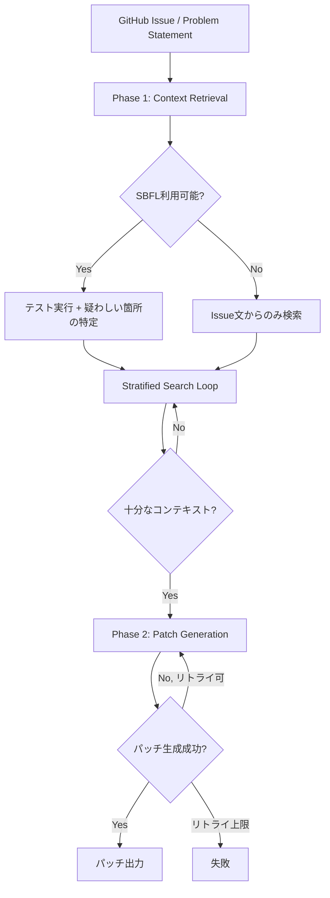
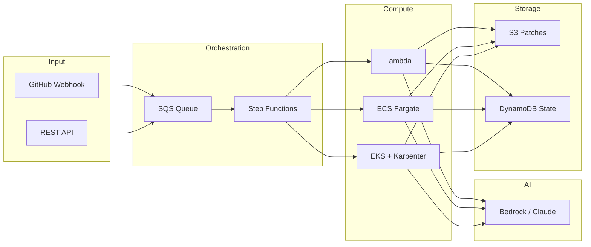

## 論文概要

本記事は [AutoCodeRover: Autonomous Program Improvement](https://arxiv.org/abs/2404.05427)（ISSTA 2024採択、arXiv:2404.05427）の解説記事です。AutoCodeRoverは、大規模言語モデル（LLM）と抽象構文木（AST）ベースのコード検索を組み合わせ、GitHubのIssueを自律的に解決するエージェントです。ソフトウェアプロジェクトをファイルの集合ではなくプログラム構造として扱い、クラスやメソッドの粒度でコンテキストを取得します。SWE-bench-liteで19%（初期版）、SWE-bench Verifiedで46.2%（v20240620）の解決率を達成し、1タスクあたり約0.43〜0.70 USDという低コストで動作します。

## 情報源

| 項目 | 内容 |
|------|------|
| **タイトル** | AutoCodeRover: Autonomous Program Improvement |
| **著者** | Yuntong Zhang, Haifeng Ruan, Zhiyu Fan, Abhik Roychoudhury |
| **所属** | National University of Singapore |
| **発表** | ISSTA 2024（ACM SIGSOFT International Symposium on Software Testing and Analysis） |
| **arXiv** | [2404.05427](https://arxiv.org/abs/2404.05427) |
| **分野** | cs.SE, cs.AI |
| **リポジトリ** | [AutoCodeRoverSG/auto-code-rover](https://github.com/AutoCodeRoverSG/auto-code-rover) |

## 背景と動機

GitHub Copilotに代表されるAIコーディング支援ツールは、コード補完やスニペット生成において高い実用性を示してきました。しかし、これらのツールは「ファイル内の局所的なコンテキスト」に依存しており、プロジェクト全体の構造を理解した上でのバグ修正や機能追加を自律的に行うことは困難でした。

従来の自律コーディングエージェント（SWE-agentなど）は、ソフトウェアプロジェクトをファイルの集合として扱い、シェルコマンド（`grep`、`find`等）でコードを検索していました。この手法には2つの問題があります。第一に、文字列マッチングでは意味的に関連するコードを見逃す可能性があること。第二に、検索結果が大量になりLLMのコンテキストウィンドウを圧迫することです。

AutoCodeRoverは「ソフトウェア工学的な視点」からこの課題にアプローチし、プログラムの構造的表現（AST）を活用することで、効率的かつ精度の高いコンテキスト取得を実現しました。

## 主要な貢献

著者らが報告している本論文の貢献は以下のとおりです。

- **AST構造を活用したコード検索API群の設計**: クラス・メソッド粒度でコードベースをナビゲートする7つの検索APIを提供し、LLMが人間のエンジニアと同様にコードを探索可能にした
- **階層的コンテキスト検索（Stratified Context Retrieval）**: 検索結果を段階的に蓄積し、各ステップで得られた情報を次の検索に活用する反復的アプローチにより、コンテキストウィンドウの効率的な利用を実現
- **スペクトルベース障害局所化（SBFL）の統合**: テストスイートが利用可能な場合、テスト実行のカバレッジ情報から障害箇所を統計的に推定し、LLMの検索を補強
- **低コストでの高い解決率**: SWE-bench-liteで当時のSWE-agentを上回る19%の解決率を、1タスクあたり約0.43 USDで達成（SWE-agentの約2.51 USDと比較して約83%のコスト削減）

## 技術的詳細

### 2フェーズアーキテクチャ

AutoCodeRoverは「コンテキスト検索」と「パッチ生成」の2フェーズで構成されています。



### AST解析による構造的コンテキスト抽出

AutoCodeRoverはコードベースをAST（抽象構文木）としてパースし、以下の7つの検索APIをLLMに提供します。

| API | 機能 |
|-----|------|
| `search_class(cls)` | クラスのシグネチャを返す |
| `search_class_in_file(cls, f)` | 特定ファイル内のクラスを検索 |
| `search_method(m)` | メソッドの実装全体を返す |
| `search_method_in_class(m, cls)` | クラス内の特定メソッドを検索 |
| `search_method_in_file(m, f)` | ファイル内の特定メソッドを検索 |
| `search_code(c)` | コードスニペットを前後3行のコンテキスト付きで返す |
| `search_code_in_file(c, f)` | ファイル内でコードスニペットを検索 |

これらのAPIは単純な文字列検索ではなく、ASTノードの構造に基づいてマッチングを行います。例えば`search_method_in_class("save", "Model")`を実行すると、`Model`クラスのASTノード配下にある`save`メソッドの定義ノードを特定し、その実装全体を返します。

### 階層的コンテキスト検索（Stratified Context Retrieval）

全てのAPI呼び出しを一度に実行する「フラット」なアプローチでは、大量の結果がLLMのコンテキストウィンドウを圧迫します。AutoCodeRoverは階層的（stratified）な検索を採用し、以下の手順で反復的にコンテキストを構築します。

1. **Stratum 1**: LLMがIssueの記述のみを手がかりに、最初の検索API群を選択・実行
2. **Stratum 2以降**: 前のstratumの検索結果を踏まえて、追加の検索APIを選択・実行
3. **終了判定**: LLMが「十分なコンテキストが得られた」と判断した時点で検索を終了（最大10イテレーション）

この方式により、典型的なタスクでは2〜10回のイテレーションで必要なコンテキストを収集できると著者らは報告しています。

### スペクトルベース障害局所化（SBFL）

テストスイートが利用可能な場合、AutoCodeRoverはSBFLを追加のコンテキストソースとして活用します。SBFLは、パスするテストとフェイルするテストのカバレッジの差分を分析し、各メソッドに「疑わしさスコア」を付与する手法です。

代表的な疑わしさ指標として、Ochiai指標が以下のように定義されます。

$$
\text{suspiciousness}(s) = \frac{e_f(s)}{\sqrt{(e_f(s) + n_f(s)) \cdot (e_f(s) + e_p(s))}}
$$

ここで、ステートメント $s$ に対して:
- $e_f(s)$: $s$ を実行した失敗テスト数
- $n_f(s)$: $s$ を実行しなかった失敗テスト数
- $e_p(s)$: $s$ を実行した成功テスト数

AutoCodeRoverはSBFLで上位5件の疑わしいメソッドを特定し、LLMへの「ヒント」として提供します。論文中のdjango-13964ケーススタディでは、Issue記述には言及されていない`resolve_related_fields`や`_prepare_related_fields_for_save`といったメソッドがSBFLによって発見され、修正に寄与したと報告されています。

## 実装のポイント

AutoCodeRoverの実装は Python 98%、TypeScript 2% で構成されています（[GitHub リポジトリ](https://github.com/AutoCodeRoverSG/auto-code-rover)で公開）。主要な実装上の設計判断を以下に整理します。

- **LLMモデル**: GPT-4（gpt-4-0125-preview）を使用。Claude 3.5 Sonnet、Llama 3等にも対応
- **温度パラメータ**: 0.2（再現性重視）
- **最大トークン数**: 1,024トークン/応答
- **検索イテレーション上限**: 10回
- **パッチ生成リトライ**: 最大3回（構文・フォーマットの検証付き）
- **実行環境**: Dockerコンテナ内で動作（セキュリティ確保）

3つの動作モードが提供されています。

```python
def run_autocoderover(
    mode: str,  # "github-issue" | "local-issue" | "swe-bench"
    model: str = "gpt-4o-2024-05-13",
    model_temperature: float = 0.2,
    output_dir: str = "output",
    task_id: str = "",
    clone_link: str | None = None,
    commit_hash: str | None = None,
    issue_link: str | None = None,
    local_repo: str | None = None,
    issue_file: str | None = None,
) -> dict[str, str]:
    """AutoCodeRoverの実行エントリポイント.

    Args:
        mode: 動作モード。github-issueはGitHub Issue URLから、
              local-issueはローカルリポジトリのIssueファイルから、
              swe-benchはSWE-benchタスクから実行する。
        model: 使用するLLMモデル識別子。
        model_temperature: LLMの温度パラメータ（0.0-1.0）。
        output_dir: パッチ出力先ディレクトリ。
        task_id: タスクの一意識別子。
        clone_link: GitHub Issue モード時のリポジトリURL。
        commit_hash: 対象コミットハッシュ。
        issue_link: GitHub IssueのURL。
        local_repo: Local Issue モード時のリポジトリパス。
        issue_file: Issue記述ファイルのパス。

    Returns:
        パッチ情報を含むdict。成功時は selected_patch.json に出力。
    """
    ...
```

## Production Deployment Guide

AutoCodeRoverのAST解析+LLMアーキテクチャを本番環境に展開するための実装パターンを、AWSを前提に3つの構成規模で解説します。

### アーキテクチャ概要



### Small構成: Lambda + Bedrock + DynamoDB

月間100タスク以下のチーム向け。サーバレスで運用コストを最小化します。

```hcl
# --- Provider & Variables ---

provider "aws" {
  region = "ap-northeast-1"
}

variable "project" {
  default = "acr-small"
}

# --- DynamoDB: タスク状態管理 ---

resource "aws_dynamodb_table" "task_state" {
  name         = "${var.project}-tasks"
  billing_mode = "PAY_PER_REQUEST"
  hash_key     = "task_id"

  attribute {
    name = "task_id"
    type = "S"
  }

  ttl {
    attribute_name = "expires_at"
    enabled        = true
  }

  tags = {
    Project = var.project
  }
}

# --- S3: パッチ・ログ保存 ---

resource "aws_s3_bucket" "patches" {
  bucket = "${var.project}-patches"

  tags = {
    Project = var.project
  }
}

resource "aws_s3_bucket_lifecycle_configuration" "patches_lifecycle" {
  bucket = aws_s3_bucket.patches.id

  rule {
    id     = "archive-old-patches"
    status = "Enabled"

    transition {
      days          = 30
      storage_class = "INTELLIGENT_TIERING"
    }

    expiration {
      days = 365
    }
  }
}

# --- IAM: Lambda実行ロール ---

resource "aws_iam_role" "lambda_exec" {
  name = "${var.project}-lambda-exec"

  assume_role_policy = jsonencode({
    Version = "2012-10-17"
    Statement = [{
      Action = "sts:AssumeRole"
      Effect = "Allow"
      Principal = {
        Service = "lambda.amazonaws.com"
      }
    }]
  })
}

resource "aws_iam_role_policy" "lambda_policy" {
  name = "${var.project}-lambda-policy"
  role = aws_iam_role.lambda_exec.id

  policy = jsonencode({
    Version = "2012-10-17"
    Statement = [
      {
        Effect = "Allow"
        Action = [
          "dynamodb:GetItem",
          "dynamodb:PutItem",
          "dynamodb:UpdateItem",
          "dynamodb:Query"
        ]
        Resource = aws_dynamodb_table.task_state.arn
      },
      {
        Effect = "Allow"
        Action = [
          "s3:PutObject",
          "s3:GetObject"
        ]
        Resource = "${aws_s3_bucket.patches.arn}/*"
      },
      {
        Effect = "Allow"
        Action = [
          "bedrock:InvokeModel",
          "bedrock:InvokeModelWithResponseStream"
        ]
        Resource = "arn:aws:bedrock:ap-northeast-1::foundation-model/anthropic.claude-3-5-sonnet-*"
      },
      {
        Effect = "Allow"
        Action = [
          "logs:CreateLogGroup",
          "logs:CreateLogStream",
          "logs:PutLogEvents"
        ]
        Resource = "arn:aws:logs:ap-northeast-1:*:*"
      }
    ]
  })
}

# --- SQS: タスクキュー ---

resource "aws_sqs_queue" "task_queue" {
  name                       = "${var.project}-tasks"
  visibility_timeout_seconds = 900
  message_retention_seconds  = 86400

  redrive_policy = jsonencode({
    deadLetterTargetArn = aws_sqs_queue.dlq.arn
    maxReceiveCount     = 3
  })

  tags = {
    Project = var.project
  }
}

resource "aws_sqs_queue" "dlq" {
  name                      = "${var.project}-tasks-dlq"
  message_retention_seconds = 1209600

  tags = {
    Project = var.project
  }
}

# --- Lambda: コンテキスト検索 + パッチ生成 ---

resource "aws_lambda_function" "context_retrieval" {
  function_name = "${var.project}-context-retrieval"
  runtime       = "python3.12"
  handler       = "handler.lambda_handler"
  role          = aws_iam_role.lambda_exec.arn
  timeout       = 900
  memory_size   = 1024

  filename         = "lambda_package.zip"
  source_code_hash = filebase64sha256("lambda_package.zip")

  environment {
    variables = {
      DYNAMODB_TABLE = aws_dynamodb_table.task_state.name
      S3_BUCKET      = aws_s3_bucket.patches.id
      BEDROCK_MODEL  = "anthropic.claude-3-5-sonnet-20241022-v2:0"
      MAX_ITERATIONS = "10"
    }
  }

  tags = {
    Project = var.project
  }
}

resource "aws_lambda_event_source_mapping" "sqs_trigger" {
  event_source_arn = aws_sqs_queue.task_queue.arn
  function_name    = aws_lambda_function.context_retrieval.arn
  batch_size       = 1
}
```

### Medium構成: ECS Fargate + Step Functions

月間100〜1000タスク。Lambdaの15分タイムアウト制約を回避しつつ、サーバレスの利点を維持します。Step Functionsで2フェーズをオーケストレーションします。

```python
"""Step Functions ステートマシン定義の概念コード."""

from __future__ import annotations

from dataclasses import dataclass
from enum import Enum
from typing import Any


class TaskPhase(Enum):
    """AutoCodeRoverの実行フェーズ."""

    CONTEXT_RETRIEVAL = "context_retrieval"
    PATCH_GENERATION = "patch_generation"
    VALIDATION = "validation"


@dataclass(frozen=True)
class StepFunctionConfig:
    """Step Functions構成パラメータ.

    Attributes:
        max_retrieval_iterations: コンテキスト検索の最大イテレーション数。
        max_patch_retries: パッチ生成の最大リトライ数。
        task_timeout_seconds: タスク全体のタイムアウト（秒）。
        bedrock_model_id: 使用するBedrockモデルID。
    """

    max_retrieval_iterations: int = 10
    max_patch_retries: int = 3
    task_timeout_seconds: int = 1800
    bedrock_model_id: str = "anthropic.claude-3-5-sonnet-20241022-v2:0"


def build_state_machine_definition(config: StepFunctionConfig) -> dict[str, Any]:
    """Step Functionsステートマシン定義を構築する.

    Args:
        config: ステートマシンの構成パラメータ。

    Returns:
        ASL (Amazon States Language) 形式のステートマシン定義。
    """
    return {
        "Comment": "AutoCodeRover 2-Phase Pipeline",
        "StartAt": "CloneRepository",
        "States": {
            "CloneRepository": {
                "Type": "Task",
                "Resource": "arn:aws:states:::ecs:runTask.sync",
                "Parameters": {
                    "LaunchType": "FARGATE",
                    "Cluster": "${EcsClusterArn}",
                    "TaskDefinition": "${CloneTaskDef}",
                },
                "Next": "ContextRetrieval",
                "TimeoutSeconds": 300,
            },
            "ContextRetrieval": {
                "Type": "Task",
                "Resource": "arn:aws:states:::ecs:runTask.sync",
                "Parameters": {
                    "LaunchType": "FARGATE",
                    "Cluster": "${EcsClusterArn}",
                    "TaskDefinition": "${RetrievalTaskDef}",
                },
                "Next": "CheckContext",
                "TimeoutSeconds": config.task_timeout_seconds,
            },
            "CheckContext": {
                "Type": "Choice",
                "Choices": [
                    {
                        "Variable": "$.context_sufficient",
                        "BooleanEquals": True,
                        "Next": "PatchGeneration",
                    },
                    {
                        "Variable": "$.iteration_count",
                        "NumericGreaterThanEquals": config.max_retrieval_iterations,
                        "Next": "PatchGeneration",
                    },
                ],
                "Default": "ContextRetrieval",
            },
            "PatchGeneration": {
                "Type": "Task",
                "Resource": "arn:aws:states:::ecs:runTask.sync",
                "Parameters": {
                    "LaunchType": "FARGATE",
                    "Cluster": "${EcsClusterArn}",
                    "TaskDefinition": "${PatchGenTaskDef}",
                },
                "Next": "ValidatePatch",
                "TimeoutSeconds": 600,
                "Retry": [
                    {
                        "ErrorEquals": ["PatchSyntaxError"],
                        "MaxAttempts": config.max_patch_retries,
                        "BackoffRate": 1.5,
                    }
                ],
            },
            "ValidatePatch": {
                "Type": "Task",
                "Resource": "arn:aws:states:::ecs:runTask.sync",
                "Parameters": {
                    "LaunchType": "FARGATE",
                    "Cluster": "${EcsClusterArn}",
                    "TaskDefinition": "${ValidationTaskDef}",
                },
                "Next": "StorePatch",
                "TimeoutSeconds": 600,
            },
            "StorePatch": {
                "Type": "Task",
                "Resource": "arn:aws:states:::dynamodb:putItem",
                "Parameters": {
                    "TableName": "${DynamoDBTable}",
                    "Item": {
                        "task_id": {"S.$": "$.task_id"},
                        "status": {"S": "COMPLETED"},
                        "patch_s3_key": {"S.$": "$.patch_key"},
                    },
                },
                "End": True,
            },
        },
    }
```

### Large構成: EKS + Karpenter + Spot Instances

月間1000タスク超の大規模運用向け。Karpenterによる自動スケーリングとSpot Instancesでコストを最適化します。

```hcl
# --- EKS Cluster ---

module "eks" {
  source  = "terraform-aws-modules/eks/aws"
  version = "~> 20.0"

  cluster_name    = "acr-large"
  cluster_version = "1.31"

  vpc_id     = module.vpc.vpc_id
  subnet_ids = module.vpc.private_subnets

  cluster_addons = {
    karpenter = {
      most_recent = true
    }
  }

  eks_managed_node_groups = {
    system = {
      instance_types = ["m7i.large"]
      min_size       = 2
      max_size       = 4
      desired_size   = 2

      labels = {
        role = "system"
      }
    }
  }

  tags = {
    Project = "acr-large"
  }
}

# --- Karpenter NodePool: Spot最適化 ---

resource "kubectl_manifest" "karpenter_nodepool" {
  yaml_body = yamlencode({
    apiVersion = "karpenter.sh/v1"
    kind       = "NodePool"
    metadata = {
      name = "acr-workers"
    }
    spec = {
      template = {
        metadata = {
          labels = {
            role = "acr-worker"
          }
        }
        spec = {
          requirements = [
            {
              key      = "karpenter.sh/capacity-type"
              operator = "In"
              values   = ["spot", "on-demand"]
            },
            {
              key      = "node.kubernetes.io/instance-type"
              operator = "In"
              values = [
                "m7i.xlarge",
                "m7i.2xlarge",
                "m6i.xlarge",
                "m6i.2xlarge",
                "c7i.xlarge",
                "c7i.2xlarge"
              ]
            }
          ]
          nodeClassRef = {
            group = "karpenter.k8s.aws"
            kind  = "EC2NodeClass"
            name  = "default"
          }
        }
      }
      limits = {
        cpu    = "128"
        memory = "512Gi"
      }
      disruption = {
        consolidationPolicy = "WhenEmptyOrUnderutilized"
        consolidateAfter    = "60s"
      }
      weight = 50
    }
  })
}

# --- EC2NodeClass ---

resource "kubectl_manifest" "karpenter_ec2nodeclass" {
  yaml_body = yamlencode({
    apiVersion = "karpenter.k8s.aws/v1"
    kind       = "EC2NodeClass"
    metadata = {
      name = "default"
    }
    spec = {
      amiSelectorTerms = [{
        alias = "al2023@latest"
      }]
      subnetSelectorTerms = [{
        tags = {
          "karpenter.sh/discovery" = "acr-large"
        }
      }]
      securityGroupSelectorTerms = [{
        tags = {
          "karpenter.sh/discovery" = "acr-large"
        }
      }]
      role = module.eks.node_iam_role_name
    }
  })
}
```

### 運用・監視

本番環境での安定運用に必要な監視設定を以下に示します。

```python
"""CloudWatch メトリクスとアラームの設定ヘルパー."""

from __future__ import annotations

from dataclasses import dataclass, field


@dataclass(frozen=True)
class MonitoringConfig:
    """運用監視の構成定義.

    Attributes:
        namespace: CloudWatch メトリクスの名前空間。
        alarm_sns_topic_arn: アラーム通知先 SNS トピック ARN。
        dashboards: 作成するダッシュボード名のリスト。
    """

    namespace: str = "AutoCodeRover"
    alarm_sns_topic_arn: str = ""
    dashboards: list[str] = field(
        default_factory=lambda: ["operations", "cost", "quality"]
    )


# CloudWatch カスタムメトリクス（Embedded Metric Format）
METRIC_DEFINITIONS: dict[str, dict[str, str]] = {
    # レイテンシ
    "ContextRetrievalDuration": {
        "unit": "Seconds",
        "description": "Phase 1 コンテキスト検索の所要時間",
    },
    "PatchGenerationDuration": {
        "unit": "Seconds",
        "description": "Phase 2 パッチ生成の所要時間",
    },
    "EndToEndDuration": {
        "unit": "Seconds",
        "description": "タスク全体の所要時間",
    },
    # トークン消費
    "InputTokens": {
        "unit": "Count",
        "description": "LLM入力トークン数",
    },
    "OutputTokens": {
        "unit": "Count",
        "description": "LLM出力トークン数",
    },
    # 品質
    "PatchAccepted": {
        "unit": "Count",
        "description": "テスト通過したパッチ数",
    },
    "PatchRejected": {
        "unit": "Count",
        "description": "テスト失敗したパッチ数",
    },
    "RetrievalIterations": {
        "unit": "Count",
        "description": "コンテキスト検索のイテレーション数",
    },
}

# アラーム閾値
ALARM_THRESHOLDS: dict[str, dict[str, float | int | str]] = {
    "HighLatency": {
        "metric": "EndToEndDuration",
        "threshold": 600,
        "period": 300,
        "evaluation_periods": 3,
        "comparison": "GreaterThanThreshold",
        "description": "タスク所要時間が10分を超過",
    },
    "HighTokenUsage": {
        "metric": "InputTokens",
        "threshold": 200000,
        "period": 300,
        "evaluation_periods": 1,
        "comparison": "GreaterThanThreshold",
        "description": "入力トークン数が200kを超過（コスト異常）",
    },
    "LowSuccessRate": {
        "metric": "PatchAccepted",
        "threshold": 0.1,
        "period": 3600,
        "evaluation_periods": 3,
        "comparison": "LessThanThreshold",
        "description": "パッチ成功率が10%を下回る",
    },
    "DLQMessages": {
        "metric": "ApproximateNumberOfMessagesVisible",
        "threshold": 5,
        "period": 300,
        "evaluation_periods": 1,
        "comparison": "GreaterThanThreshold",
        "description": "DLQにメッセージが滞留",
    },
}
```

X-Rayによる分散トレーシングも有効です。Phase 1の各検索APIコール、Phase 2のLLM呼び出し、テスト実行をセグメントとして記録することで、ボトルネックの特定が容易になります。

### コスト最適化チェックリスト

| # | カテゴリ | 項目 | 効果 |
|---|---------|------|------|
| 1 | Compute | Spot Instancesの活用（Karpenter） | 最大70%削減 |
| 2 | Compute | Graviton (ARM) インスタンスの採用 | 約20%削減 |
| 3 | Compute | Lambda予約同時実行数の設定 | 突発コスト防止 |
| 4 | Compute | Fargate Spot タスクの活用 | 最大70%削減 |
| 5 | AI/ML | Bedrock プロビジョンドスループットの契約 | 大量利用時30-50%削減 |
| 6 | AI/ML | プロンプトキャッシュの活用 | トークンコスト削減 |
| 7 | AI/ML | 小規模モデル（Haiku）でのプレフィルタリング | 大規模モデル呼び出し削減 |
| 8 | AI/ML | コンテキスト検索のイテレーション上限を調整 | 不要なAPI呼び出し削減 |
| 9 | AI/ML | 応答の最大トークン数を最適化（1024→必要最小限） | 出力トークン削減 |
| 10 | Storage | S3 Intelligent-Tieringの設定 | 長期保存コスト削減 |
| 11 | Storage | DynamoDB TTLによる古いレコードの自動削除 | 不要データの蓄積防止 |
| 12 | Storage | EBS gp3ボリュームの採用（gp2比） | IOPS/スループット最適化 |
| 13 | Network | VPCエンドポイント（Bedrock, S3, DynamoDB） | NAT Gateway料金削減 |
| 14 | Network | ECRプルスルーキャッシュの設定 | イメージ転送コスト削減 |
| 15 | Ops | Cost Anomaly Detectionの設定 | 異常支出の早期検知 |
| 16 | Ops | AWS Budgets アラートの設定 | 予算超過防止 |
| 17 | Ops | CloudWatch Logs保持期間の短縮（30日） | ログストレージ削減 |
| 18 | Ops | 未使用セキュリティグループ・ENIの定期クリーンアップ | リソース浪費防止 |
| 19 | Queue | SQSメッセージ保持期間の最適化（24h） | 不要メッセージの蓄積防止 |
| 20 | Queue | DLQ監視とリドライブポリシーの最適化 | 再処理コスト最適化 |
| 21 | Cache | リポジトリクローンのEFSキャッシュ | 重複クローン削減 |
| 22 | Cache | ASTパース結果のElastiCacheキャッシュ | 再パース削減 |

### 2026年6月時点 AWS東京リージョン概算

| 構成 | 月間タスク数 | 月額概算（USD） | タスク単価 |
|------|-------------|----------------|-----------|
| Small（Lambda + Bedrock） | 100 | $70-120 | $0.70-1.20 |
| Medium（ECS Fargate + Step Functions） | 500 | $250-450 | $0.50-0.90 |
| Large（EKS + Spot） | 5,000 | $1,200-2,500 | $0.24-0.50 |

上記にはBedrock推論コスト（Claude 3.5 Sonnet: 入力$3/MTok, 出力$15/MTok）を含みます。AutoCodeRoverの平均トークン消費量（約37kトークン/タスク）に基づく推定です。実際のコストはタスクの複雑さやイテレーション回数によって変動します。

## 実験結果

著者らが報告しているベンチマーク結果を以下に整理します。

### SWE-benchスコア

| ベンチマーク | バージョン | Pass@1 | Pass@3 |
|-------------|-----------|--------|--------|
| SWE-bench full (2,294件) | 初期版 | 12.42% | 17.96% |
| SWE-bench full | v20240620 | 24.89% | - |
| SWE-bench-lite (300件) | 初期版 | 19.00% | 26.00% |
| SWE-bench-lite | v20240620 | 30.67% | - |
| SWE-bench Verified | v20240620 | 46.20% | - |
| SWE-bench Devin subset | 初期版 | 12.63% | 18.77% |

### コスト効率の比較

著者らの報告によれば、AutoCodeRoverはSWE-agentと比較して大幅なコスト削減を実現しています。

| 指標 | AutoCodeRover | SWE-agent |
|------|--------------|-----------|
| 平均所要時間 | 195秒 | - |
| 平均トークン消費 | 37kトークン | 240k+トークン |
| 1タスクあたりコスト | $0.43 | $2.51 |

トークン分布の分析では、AutoCodeRoverが解決したタスクの多くが10k〜30kトークンで完了しているのに対し、SWE-agentは解決タスクの66.7%が100kトークン以上を消費していると報告されています。

### パッチ品質の分析

生成されたパッチの内訳（初期版、300件中）:

| 分類 | 割合 |
|------|------|
| 正解パッチ（テスト通過かつ正確） | 26.0% |
| 妥当だが不正確なパッチ（正しい箇所、間違った修正） | 29.3% |
| 間違ったファイル内の正しい箇所 | 20.0% |
| 間違ったファイル | 18.0% |
| パッチ生成失敗 | 6.7% |

テストを通過したパッチのうち65.4%（78件中51件）が人手で確認しても正確だったと著者らは報告しています。

### SBFL効果のアブレーション

SBFLを有効化した場合（ACR-sbfl）の効果:
- 解決タスク数: 57件 → 66件（19% → 22%）
- SBFLでのみ解決された固有タスク: 7件
- Issue記述に手がかりのない複雑なバグに対して特に有効

## 実運用への応用

AutoCodeRoverの手法は、以下のような実運用シナリオに応用可能です。

**CI/CDパイプラインへの統合**: GitHub Webhookで新規Issueを検知し、自動でパッチ候補を生成してPull Requestを作成するワークフローが構築可能です。人間のレビュアーはゼロから修正するのではなく、AIが生成したパッチをレビューするだけで済みます。

**レガシーコードの保守**: AST解析によるコード構造の理解は、ドキュメントが不足しがちなレガシーコードベースで特に有効です。SBFLと組み合わせることで、テストスイートが存在する限り効果的な障害局所化が可能です。

**関連するZenn記事「[Claude Codeで本番プロジェクトにAI拡張開発を組み込む実践ワークフロー](https://zenn.dev/0h_n0/articles/6f90aa53dcc249)」で紹介されているExplore→Plan→Implementワークフローは、AutoCodeRoverの2フェーズアーキテクチャ（コンテキスト検索→パッチ生成）と構造的に類似しており、理論的裏付けとして参照できます。**

## 関連研究

AutoCodeRoverと同時期に発表された自律コーディングエージェントには、SWE-agent（Princeton大学）、Devin（Cognition Labs）、Aider等があります。SWE-agentはシェルコマンドベースのアプローチを採用しており、AutoCodeRoverとは相補的な強みを持つと著者らは分析しています（AutoCodeRoverが解決した26件のタスクはSWE-agentでは未解決、逆にSWE-agentが解決した23件はAutoCodeRoverでは未解決）。SBFLの活用はソフトウェアテスティング分野での長い研究蓄積（TarantulaやOchiaiなど）に基づいています。

## まとめと今後の展望

AutoCodeRoverは、ソフトウェア工学の知見（AST解析、SBFL）をLLMベースのコーディングエージェントに統合することで、効率的かつ低コストな自律プログラム改善を実現しました。v20240620ではSWE-bench Verifiedで46.2%の解決率に達しています。著者らは今後の方向性として、バグ再現テストの自動生成、静的コールグラフや言語サーバとの統合、人間との協調インターフェースの設計を挙げています。プログラムの構造的理解に基づくアプローチは、コーディングエージェントの信頼性向上における重要な基盤技術と位置づけられます。

## 参考文献

1. Zhang, Y., Ruan, H., Fan, Z., & Roychoudhury, A. (2024). AutoCodeRover: Autonomous Program Improvement. *Proceedings of the 33rd ACM SIGSOFT International Symposium on Software Testing and Analysis (ISSTA 2024)*. [arXiv:2404.05427](https://arxiv.org/abs/2404.05427), [ACM DL](https://dl.acm.org/doi/10.1145/3650212.3680384)
2. Yang, J., Jimenez, C. E., Wettig, A., Lieret, K., Yao, S., Narasimhan, K., & Press, O. (2024). SWE-agent: Agent-Computer Interfaces Enable Automated Software Engineering. *arXiv:2405.15793*.
3. Jimenez, C. E., Yang, J., Wettig, A., Yao, S., Pei, K., Press, O., & Narasimhan, K. (2024). SWE-bench: Can Language Models Resolve Real-World GitHub Issues? *ICLR 2024*.
4. Jones, J. A., Harrold, M. J., & Stasko, J. (2002). Visualization of test information to assist fault localization. *ICSE 2002*.
5. Abreu, R., Zoeteweij, P., & van Gemund, A. J. C. (2007). On the Accuracy of Spectrum-based Fault Localization. *Testing: Academic and Industrial Conference*.
