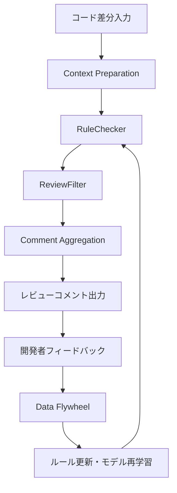
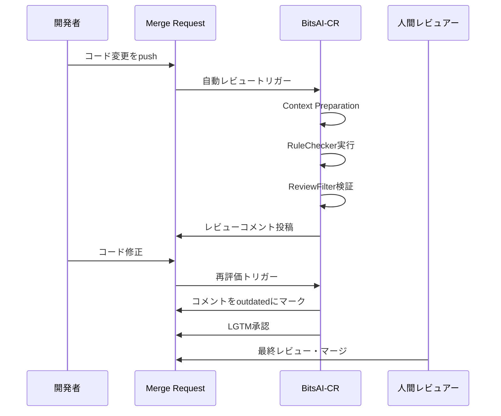

## 論文概要

本記事は [BitsAI-CR: Automated Code Review via LLM in Practice](https://arxiv.org/abs/2501.15134)（arXiv:2501.15134）の解説記事です。

この記事は [Zenn記事: Claude Codeで本番プロジェクトにAI拡張開発を組み込む実践ワークフロー](https://zenn.dev/0h_n0/articles/6f90aa53dcc249) の深掘りです。

BitsAI-CRは、ByteDanceが開発・運用しているLLMベースの自動コードレビューシステムである。著者らは、RuleCheckerとReviewFilterからなる2段階パイプラインにより、レビューコメントの精度（Precision）75.0%を達成したと報告している。さらに、開発者がレビュー指摘を実際に受け入れたかを測定するOutdated Rateという評価指標を提案し、Go言語において26.7%のOutdated Rateを記録している。本システムは12,000人以上の週間アクティブユーザー（WAU）に利用されている。

## 情報源

| 項目 | 内容 |
|------|------|
| **タイトル** | BitsAI-CR: Automated Code Review via LLM in Practice |
| **著者** | Tao Sun, Jian Xu, Yuanpeng Li, Zhao Yan, Ge Zhang, Lintao Xie, Lu Geng, Zheng Wang, Yueyan Chen, Qin Lin, Wenbo Duan, Kaixin Sui |
| **発表年** | 2025年1月 |
| **arXiv ID** | 2501.15134 |
| **分野** | Computer Science > Software Engineering (cs.SE) |
| **所属** | ByteDance |

## 背景と動機

コードレビューはソフトウェア開発における品質保証の要である。しかし、ByteDanceの内部調査によれば、レビュアーの50%以上が1件のレビューに平均15分以上を費やしており、67%のエンジニアがより良いツールの必要性を訴えていたと報告されている（論文Section 1）。

著者らは、既存のLLMベースのコードレビューソリューションには3つの根本的な課題があると指摘している。

1. **精度の不足**: 技術的に正確なコメントを生成する能力が不十分である
2. **実用性の低さ**: 技術的に正しくても冗長・不要なコメントが多い
3. **改善メカニズムの欠如**: 継続的にシステムを改善する体系的な仕組みがない

特に精度の問題は深刻で、著者らは「開発者は大量のコメントに直面すると、注意深く選別する時間を割くことを望まず、レビューコメント全体を無視する傾向がある」と述べている（論文Section 3.4）。このため、再現率（Recall）よりも精度（Precision）を優先する設計判断が採用されている。

## 主要な貢献

著者らは以下の4点を本論文の貢献として挙げている。

- **219のレビュールール体系**: 5つのプログラミング言語にまたがる3階層のレビュールール分類体系（taxonomy）を構築した。これにより、データ収集・モデル学習・評価が体系的に行える
- **2段階レビューパイプライン**: RuleChecker（問題検出）とReviewFilter（検証フィルタリング）の組み合わせにより、精度を大幅に向上させた
- **Outdated Rate評価指標**: 開発者がレビュー指摘後に実際にコードを修正したかを追跡する新しい評価指標を提案した
- **大規模実運用による検証**: 12,000人以上のWAUを持つByteD anceの本番環境でシステムを運用し、実用性を実証した

## 技術的詳細

### システムアーキテクチャ

BitsAI-CRは、レビューコメント生成パイプラインとデータフライホイール（継続的改善機構）の2つの主要コンポーネントで構成される。



### Context Preparation（文脈準備）

コード差分を分析可能な単位に整形する前処理段階である。著者らは3つのステップを記述している。

1. **差分のパーティション分割**: ヘッダーハンクに基づいてコード差分を分割する
2. **コードブロックの拡張**: 関数定義全体を含むようコンテキストを拡張する。拡張サイズは、元の差分サイズの4倍（制御された戦略）または3倍に設定される
3. **変更アノテーション**: tree-sitterを用いて各行の変更ステータスと位置を詳細にマーキングする

### RuleChecker（ルール検査器）

RuleCheckerは、ファインチューニングされたLLMを用いて潜在的な問題を検出するコンポーネントである。ByteDanceの内部コーディング規約と219のレビュールール体系を統合し、検出された問題に対して修正提案を生成する。

重要な設計要素として**ルールカテゴリブロッカー**がある。これは特定のルールをモデルの再学習なしに動的に除外できる機構であり、運用中に精度の低いルールを即座に無効化できる。

### ReviewFilter（レビューフィルタ）

ReviewFilterは、RuleCheckerの出力に含まれるハルシネーションや事実誤認を除去するための検証コンポーネントである。著者らは3つの推論パターンを検討している。

| 推論パターン | 精度 | 推論時間 | 特徴 |
|-------------|------|---------|------|
| Direct Conclusion | 63.27% | 1.7秒 | 推論過程なしで結論のみ出力 |
| Reasoning-First | 65.80% | 31.0秒 | Chain-of-Thought形式で推論後に結論 |
| Conclusion-First | 77.09% | 1.7秒 | 結論を先に出力し、根拠を後述 |

著者らはConclusion-Firstパターンを本番環境で採用している。このパターンはDirect Conclusionと同等の推論時間（1.7秒）でありながら、精度が77.09%と最も高い。Reasoning-Firstパターンは推論時間が31.0秒と約18倍かかるうえ、精度はConclusion-Firstに劣る結果となっている（論文Table 3）。

Conclusion-Firstパターンが高精度を達成する理由について、著者らは結論トークンを先に生成することで後続の推論が結論と整合するよう制約される効果があると考察している。

### レビュールール体系（Taxonomy）

219のレビュールールは4つの次元に分類される。

- **Code Defect**: NullPointerException、エラーハンドリング、ロジック欠陥、リソース管理
- **Security Vulnerability**: インジェクション脆弱性、XSS、安全でないデータ処理
- **Maintainability and Readability**: コードの明瞭性、一貫性、構造
- **Performance Issue**: 実行最適化、効率的なデータ構造、リソース利用

主要なルールの分布とOutdated Rateを以下に示す（論文Table 1より抜粋）。

| ルールカテゴリ | 分布 | Outdated Rate |
|-------------|------|--------------|
| Null Pointer Exception | 22.79% | 27.58% |
| Magic Numbers/Strings | 20.62% | 18.87% |
| Spelling Error | 7.97% | 31.52% |

### 評価指標

#### Precision（精度）

著者らは精度を以下のように定義している。

$$
\text{Precision} = \frac{|C_{\text{correct}}|}{|C_{\text{total}}|} \times 100\%
$$

ここで $C_{\text{correct}}$ は正しいレビューコメントの集合、$C_{\text{total}}$ は生成された全レビューコメントの集合である。

#### Outdated Rate

Outdated Rateは、BitsAI-CRが指摘したコード行が、その後開発者によって実際に修正されたかを追跡する指標である。

$$
\text{Outdated Rate} = \frac{|\{c \in C_{\text{seen}} \wedge \text{isOutdated}(c)\}|}{|C_{\text{seen}}|} \times 100\%
$$

ここで $C_{\text{seen}}$ は1週間の計測期間内にコードコミッターが閲覧したコメントの集合、$\text{isOutdated}(c)$ はコメントが指摘したコード範囲がその後修正された場合にtrueを返す関数である。

この指標は、手動ラベリングの持続可能性問題を解決しつつ、開発者の実際の受容度を反映する点に利点がある。ただし、Outdated Rateが高いことが必ずしもレビューコメントの質と直結するわけではなく、開発者が別の理由でコードを修正した可能性もある点には注意が必要である。

### Comment Aggregation（コメント集約）

類似コメントのコサイン類似度を計算し、重複を排除するモジュールである。コメントとカテゴリはDoubbao-embedding-largeモデル（512次元）でベクトル化される。

## 実装のポイント

### モデル学習

著者らはDoubao-Pro-32K-0828（ByteDance社内のLLM）をベースモデルとし、LoRA（Low-Rank Adaptation）によるファインチューニングを行っている。学習設定は以下のとおりである。

```python
from dataclasses import dataclass


@dataclass
class BitsAICRTrainingConfig:
    """BitsAI-CRのLoRAファインチューニング設定。

    論文Section 4.1に記載された学習パラメータを再現するための設定値。
    シーケンス長8192はレビューサンプルの99%をカバーする。
    """

    sequence_length: int = 8192
    epochs: int = 5
    batch_size: int = 8
    lora_rank: int = 128
    lora_alpha: int = 256
    learning_rate: float = 5e-5
    warmup_rate: float = 0.05
```

### データセット構築

学習データは以下のプロセスで構築されている。

1. **原データ収集**: ByteDance内部のMRコメントから約120,000件を抽出
2. **データ精製**: Doubao-Pro-32K-0828を用いて非本質的コメントのフィルタリング、分類、簡潔なフィードバックの拡張を実施
3. **品質保証**: 決定論的サンプリングルールに基づく手動アノテーション（高精度ルールはサンプリング率を下げ、低精度ルールは上げる）

最終的なデータセットはGoおよびフロントエンド言語で各約18,000サンプル、その他の言語で各約5,000サンプルである。

### データフライホイール（継続的改善）

本番環境では3つのフィードバックチャネルが稼働している。

1. **ユーザーフィードバック**: いいね/わるいねによる評価データの収集
2. **手動精度アノテーション**: 日次で10%以下をサンプリングし、週次で集計
3. **Outdated Rateモニタリング**: 各ルールのOutdated Rateを週次で追跡

ルールの評価基準として、著者らは「14日間でOutdated Rate約25%（正負5%）かつ精度約65%（正負5%）」を設定していると述べている（論文Section 3.5.3）。この基準を下回るルールは無効化され、上回るルールは維持・強化される。

## 実験結果

### オフライン評価

著者らは本番コードベースから1,397件のケースをサンプリングし（ベストプラクティス違反767件、準拠630件）、LLM-as-a-judge方式で評価を行っている。

| モデル構成 | 全体精度 | Security | Code Defect | Maintainability | Performance |
|-----------|---------|----------|-------------|-----------------|-------------|
| BitsAI-CR（ReviewFilter付き） | 65.59% | 61.29% | 68.92% | 63.60% | 72.00% |
| BitsAI-CR（Taxonomy無し + ReviewFilter） | 30.92% | - | - | - | - |
| Qwen2.5-Coder-32b-instruct | 7-20%範囲 | - | - | - | - |
| Deepseek-v2.5 | 7-20%範囲 | - | - | - | - |

Taxonomy（ルール体系）の有無で精度が30.92%から65.59%へと倍増しており、体系的なルール分類がモデルの性能に大きく寄与していることが確認されている（論文Table 2）。

### ReviewFilterのアブレーション

ReviewFilterの追加により、精度は54.50%から67.12%に向上している。著者らは「高度なLLMの出力であっても、大規模なファインチューニングを経た後でも、本番デプロイメントの精度要件を満たすことができない」と述べており、2段階構成の必要性を強調している（論文Section 4.2）。

ReviewFilterが防いだハルシネーションの具体例として、フォーマット問題の誤検出、変数命名規約の誤解釈、関数名をマジックナンバーと誤認するケースが報告されている。

### オンライン評価（18週間の推移）

本番環境での18週間の運用データが示されている。

- **精度の推移**: Taxonomy導入前の最初の3週間は約25%の精度にとどまっていたが、Taxonomy導入後に徐々に改善し、RuleCheckerは27.9%から62.6%へ、ReviewFilter付きでは35.6%から最大75.0%に到達した（論文Figure 6）
- **Outdated Rateの推移**: 1-10週目は約15%で推移。11週目にレビュールールを73に拡張した結果、約20%に上昇。14-18週目に低性能ルールを除去し、26.7%に到達した（論文Figure 7）

参考として、ByteDanceにおける人間レビュアーのOutdated Rateは35-46%の範囲にあると報告されている。

### ユーザー調査

137名を対象としたアンケート調査の結果が示されている。

| 回答カテゴリ | 割合 |
|------------|------|
| BitsAI-CRは効果的である | 74.5% |
| 不正確なコメントがある | 10.9% |
| 正しいが不要なコメントがある | 12.4% |
| 無関係なフィードバック | 1.5% |
| 理解が困難 | 0.7% |

12名のエキスパートインタビューでは、全員がシステムの有用性に同意し、7名がレビュー生成のレイテンシを懸念点として挙げている。11名がカスタマイズ可能なルール設定とワンクリックでの修正適用を要望している。

### 大規模デプロイメント

| 指標 | 数値 |
|-----|------|
| 週間アクティブユーザー（WAU） | 12,000人以上 |
| 週間ページビュー（WPV） | 210,000 |
| 2週目リテンション率 | 61.64% |
| 8週目リテンション率 | 約48% |

著者らは「大規模コードインテリジェンスツールのリテンション率ベンチマークとして、これが初めての文書化された事例である」と述べている（論文Section 4.4）。

## 実運用への応用

### CI/CDパイプラインへの統合

BitsAI-CRの設計は、Merge Request（MR）をトリガーとして自動的にレビューを実行する形式であり、CI/CDパイプラインとの統合を前提としている。開発者は設定インターフェースからBitsAI-CRの機能を有効化でき、コード修正後にはシステムが変更を再評価して元のコメントを「outdated」としてマークし、問題がなければ「LGTM」承認を付与する。



### Claude Code Hooksとの関連

関連Zenn記事で解説されているClaude Code Hooksの品質ゲート構築は、BitsAI-CRと同様の設計思想に基づいている。両者に共通する設計原則を以下に整理する。

1. **自動化されたゲートとしてのレビュー**: BitsAI-CRのReviewFilter、Claude Code HooksのPre-commitフックは、いずれもコード品質のゲートとして機能する。人間レビュアーの負荷を軽減しつつ、一定の品質基準を担保する
2. **段階的なフィルタリング**: BitsAI-CRがRuleChecker + ReviewFilterの2段階でフィルタリングするように、CI/CDパイプラインでもlint、テスト、AIレビューを段階的に適用する設計が有効である
3. **フィードバックループの構築**: BitsAI-CRのデータフライホイールは、ユーザーフィードバックを継続的にモデル改善に反映する仕組みである。Claude Code Hooksにおいても、レビュー結果のログを蓄積し、ルールの追加・削除を行う運用が考えられる

ただし、BitsAI-CRはByteD ance社内の大規模LLM（Doubao-Pro-32K）をベースとしており、外部利用可能なシステムとして公開されているわけではない。Claude Code Hooksのような開発者向けツールで同様のアプローチを再現する場合、利用可能なLLM APIの精度やコスト、レイテンシの制約を考慮する必要がある。

## 関連研究

LLMベースのコードレビューの分野では、Googleが開発したAutoCommenter（Li et al., 2024）が先行する大規模実運用事例として知られている。AutoCommenterはベストプラクティス違反の検出に焦点を当てており、BitsAI-CRの設計にも影響を与えている。

学術的には、CodeReviewer（Li et al., 2022）がコードレビュータスクのための事前学習モデルとして基礎を築き、LLaMA-Reviewer（Lu et al., 2023）がファインチューニングによるアプローチを探求している。Tencentも保守性に焦点を当てたコードレビューシステムを報告している。

評価フレームワークとしては、EvaCRC（Hong et al., 2024）がレビューコメントの品質評価手法を提案しており、BitsAI-CRのOutdated Rate指標とは相補的な関係にある。

## まとめと今後の展望

BitsAI-CRは、219のレビュールール体系、RuleChecker/ReviewFilterの2段階パイプライン、Outdated Rate評価指標、データフライホイールによる継続的改善の4つの柱により、本番環境での実用的なLLMコードレビューを実現した。Go言語において精度75.0%、Outdated Rate 26.7%を達成し、12,000人以上のエンジニアが日常的に利用するシステムとして運用されている。

著者らは今後の方向性として、対応言語の拡大（現在5言語）、ファイル間をまたぐレビュー能力の開発、関数レベルからコードベース全体への分析範囲の拡張を挙げている。特にクロスファイルレビューは、現在の差分単位の分析では捉えきれないアーキテクチャレベルの問題を検出するために重要な課題である。

## 参考文献

1. Tao Sun, Jian Xu, Yuanpeng Li, Zhao Yan, Ge Zhang, Lintao Xie, Lu Geng, Zheng Wang, Yueyan Chen, Qin Lin, Wenbo Duan, Kaixin Sui. "BitsAI-CR: Automated Code Review via LLM in Practice." arXiv:2501.15134, January 2025.
2. Chuanyi Li et al. "AutoCommenter: A Large-Scale Code Review Automation System." arXiv, 2024.
3. Zhiqing Zhong et al. "CodeReviewer: Pre-Training for Automating Code Review Activities." arXiv:2203.09095, 2022.
4. Junyi Lu et al. "LLaMA-Reviewer: Advancing Code Review Automation with Large Language Models." arXiv, 2023.
5. Junyi Hong et al. "EvaCRC: Evaluating Code Review Comments." arXiv, 2024.
