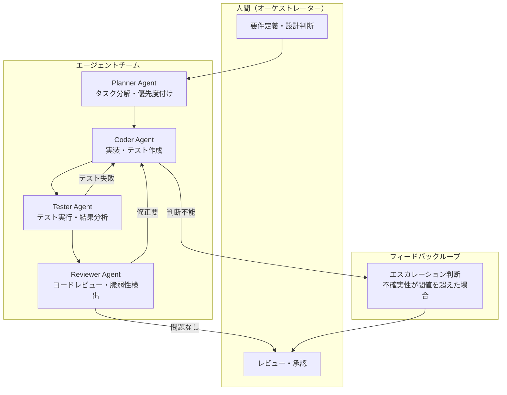

# Anthropic公式レポート解説: 2026 Agentic Coding Trends Report

## ブログ概要（Summary）

本記事は [2026 Agentic Coding Trends Report](https://resources.anthropic.com/hubfs/2026%20Agentic%20Coding%20Trends%20Report.pdf)（Anthropic, 2026年1月発表）の解説記事です。

このレポートは、コーディングエージェントがソフトウェア開発のライフサイクル全体をどのように変えつつあるかを、**Foundation trends（基盤）**、**Capability trends（能力）**、**Impact trends（影響）** の3カテゴリ・8トレンドに整理したものです。エンジニアの役割変化、マルチエージェント協調、長時間稼働エージェント、セキュリティの二面性など、産業界の事例と定量データを交えて分析しています。

この記事は [Zenn記事: Claude Codeで本番プロジェクトにAI拡張開発を組み込む実践ワークフロー](https://zenn.dev/0h_n0/articles/6f90aa53dcc249) の深掘りです。Zenn記事ではClaude Codeを実務に組み込む具体的手法（CLAUDE.md設計、Hooks、CI/CD統合）を紹介していますが、本記事ではその背景にある産業全体のトレンドを俯瞰します。

---

## 情報源

- **種別**: 企業テックブログ（PDFレポート）
- **URL**: [2026 Agentic Coding Trends Report](https://resources.anthropic.com/hubfs/2026%20Agentic%20Coding%20Trends%20Report.pdf)
- **組織**: Anthropic
- **発表日**: 2026年1月

---

## 技術的背景（Technical Background）

2025年から2026年にかけて、LLMベースのコーディングエージェントは「コード補完ツール」から「自律的にタスクを遂行するエージェント」へ転換した。従来のGitHub CopilotやCursorに代表されるインラインサジェスション型ツールは、エンジニアが書いているコードの文脈を読み取り次の数行を提案する、いわば「副操縦士」であった。一方、2025年後半以降に台頭したagentic codingツール（Claude Code、Devin、Augment Code等）は、要件を受け取ると自らファイルを読み、テストを実行し、エラーを修正し、PRを作成するまでを一貫して行う。

Anthropicはこの変化を単なるツールのアップグレードではなく、ソフトウェア開発ライフサイクル（SDLC）全体の構造的変革と位置づけている。レポートでは複数の企業事例を通じて、この変革が生産性・経済性・セキュリティにどのような影響を及ぼしているかを定量的に分析している。

ただし、本レポートはAnthropicが自社製品のエコシステムに属する事例を中心に構成しており、競合製品やオープンソースエージェントとの比較分析は含まれていない点に留意が必要である。

---

## 8つのトレンドの詳細解説

### Trend 1: SDLCが劇的に変化する

**カテゴリ: Foundation trends**

レポートによると、エンジニアの役割は「コードを自ら書く実装者」から「エージェントに指示を出し、成果物をレビューするオーケストレーター」へ変化している。この変化はコーディングだけでなく、オンボーディング、コードレビュー、テスト、ドキュメンテーションといったSDLC全体に波及している。

具体的な事例として、レポートはAugment Codeのケースを紹介している。同社のCTOが当初4-8ヶ月と見積もったプロジェクトを、エージェント型開発の導入により**2週間で完了**したという。また、新しいコードベースへのオンボーディング期間が、従来の**週単位から時間単位**に短縮された事例も報告されている。

この変化の本質は、エンジニアが「How（どう実装するか）」ではなく「What（何を実現すべきか）」と「Why（なぜそれが正しいか）」に注力できるようになる点にある。レポートでは、この役割転換によりエンジニアは設計判断・アーキテクチャ決定・品質保証といった高次の意思決定に集中できるようになると述べている。

ただし、レポートはこの成功事例がすべてのプロジェクトに一般化できるとは主張しておらず、複雑なドメイン知識を要する領域やレガシーシステムの移行などでは異なる結果になる可能性もある。

---

### Trend 2: 単一エージェントから協調チームへ

**カテゴリ: Foundation trends**

レポートでは、agentic codingが単一エージェントによるタスク処理から、複数のエージェントが役割を分担して協調するマルチエージェントワークフローへ移行していると述べている。

Fountainの事例では、マルチエージェントシステムの導入により、採用プロセスのスクリーニングが**50%高速化**、オンボーディングが**40%高速化**、コンバージョン率が**2倍**に改善されたとレポートは報告している。これはコーディングに限定されたものではなく、エージェントが開発以外の業務プロセス全体に適用されている例でもある。

マルチエージェント協調のパターンとしては、タスク分解エージェント（Planner）、実装エージェント（Coder）、レビューエージェント（Reviewer）、テストエージェント（Tester）といった役割分担が想定される。Zenn記事で紹介した4段階ワークフロー（Planning → Implementation → Review → Deploy）は、まさにこのマルチエージェントパターンを実務に落とし込んだ実践例に相当する。

ただし、マルチエージェントシステムには、エージェント間の通信コスト、タスク分割の粒度設計、障害伝播への対処といった課題も存在する。レポートではこれらの課題への具体的な対処法は詳述されていない。

---

### Trend 3: 長時間稼働エージェントが完全なシステムを構築する

**カテゴリ: Capability trends**

従来のAIコーディングツールが数分以内で完了する短時間タスクを対象としていたのに対し、agentic codingではタスクの時間軸が**数日から数週間**へ拡大しているとレポートは述べている。

Rakutenの事例は注目に値する。同社はvLLM（約1250万行のコードベース）上でactivation vector抽出を行うタスクをエージェントに委任し、**7時間で自律的に完了**させた。さらに、出力の数値精度は**99.9%**であったとレポートは報告している。1250万行規模のコードベースに対して、人間の介入なしにエージェントが正確な変更を加えられた点は、エージェントのコード理解能力と長期実行の安定性を示す事例として重要である。

長時間稼働エージェントの技術的課題には、コンテキストウィンドウの制約、中間状態の永続化、障害からの回復、実行コストの管理などがある。レポートではこれらの課題にどう対処しているかの詳細な技術説明は省かれているが、こうした課題が解決可能であることを事例をもって示している。

---

### Trend 4: 人間の監視がインテリジェントな協調を通じてスケールする

**カテゴリ: Capability trends**

レポートでは、エージェントが「いつ人間に支援を求めるべきか」を学習するようになっていると述べている。これは完全自律化とは異なるアプローチであり、人間とエージェントの適切な分業に重点を置いている。

Anthropicの内部調査によると、エンジニアは業務の**約60%**でAIを使用しているが、「完全に委任できる」タスクは**0-20%**にとどまっている。つまり、大部分のタスクは人間とエージェントが何らかの形で協調して遂行されている。この「60%利用・0-20%完全委任」というギャップは、現在のエージェントの能力限界を示すと同時に、人間の監視・判断が依然として不可欠であることを意味している。

CREDの事例では、人間とエージェントの適切な協調により、実行速度が**2倍**に向上したとレポートは報告している。

この結果は、「エージェントが人間を置き換える」という単純な見方を否定するものである。レポートが示しているのは、エージェントの真価は完全自律ではなく、人間の判断力とエージェントの実行力の組み合わせにあるという視点である。Zenn記事で紹介したHooksによる品質ゲートや、CLAUDE.mdによるエージェントの行動制約は、まさにこの「インテリジェントな協調」を実現するための実装パターンといえる。

---

### Trend 5: Agentic codingが新しい領域に拡大する

**カテゴリ: Capability trends**

レポートによると、agentic codingの適用範囲が、モダンなプログラミング言語（Python, TypeScript等）から、COBOLやFortranといったレガシー言語、さらには非開発者ユーザーへと拡大している。

Legoraの事例では、**コーディング経験のない弁護士がエージェントを使ってツールを構築**した例が紹介されている。これは、エージェントが「プログラマーの生産性ツール」から「問題を解決したい人のためのインターフェース」へ進化しつつあることを示唆している。

レガシー言語サポートの意味は大きい。COBOL・Fortranで書かれたシステムは金融・防衛・科学計算の分野で広く稼働しているが、これらの言語に精通したエンジニアは減少している。エージェントがレガシーコードの理解・修正・モダナイゼーションを支援できれば、技術的負債の解消に寄与する可能性がある。

ただし、レポートはこの拡大の制約についても暗に示している。非開発者が構築したツールの品質保証やセキュリティ担保をどう行うかは未解決の課題であり、組織的なガバナンス設計が必要になる。

---

### Trend 6: 生産性向上が経済を再構築する

**カテゴリ: Impact trends**

レポートの中で特に注目すべき知見は、AI支援による作業の**27%が「AIがなければそもそも実行しなかった」タスクである**という点である。これは、AIが既存作業を効率化するだけでなく、新たな作業カテゴリを生み出していることを意味する。たとえば、以前は時間的制約からスキップしていたリファクタリング、テストカバレッジの拡充、ドキュメントの整備などが、AIの支援により実行可能になったと解釈できる。

TELUSの事例では、**13,000以上のAIソリューション**を社内で構築し、コード出荷速度を**30%高速化**、累計で**50万時間以上を削減**したとレポートは報告している。

ただし、「27%の新規タスク」の内訳や測定方法についてはレポートに詳細な説明がなく、この数値の解釈には注意が必要である。また、TELUSの事例は大規模企業の数値であり、中小規模の組織で同等の効果が得られるかは不明である。生産性向上の効果は、組織のエンジニアリング文化、既存のCI/CD成熟度、タスクの性質などに大きく依存すると考えられる。

---

### Trend 7: 非技術領域のユースケースが拡大する

**カテゴリ: Impact trends**

レポートによると、agentic codingの適用は技術領域にとどまらず、法務、人事、カスタマーサポートなどの非技術部門にも広がっている。

法務チームの事例では、契約レビューの所要時間が**2-3日から24時間**に短縮されたとレポートは報告している。Zapierの事例では、社内のAI採用率が**89%**に達し、**800以上の内部エージェント**が稼働しているという。

この動向は、ソフトウェアエンジニアリングツールとしてのagentic codingが、組織全体のワークフロー自動化プラットフォームへと進化しつつあることを示している。Zapierの800以上のエージェントという数字は、エージェントが個人ツールではなく組織インフラとして定着し始めていることを意味する。

一方で、非技術領域への拡大には固有のリスクもある。法務レビューの自動化では、エージェントの判断ミスが法的責任問題に直結する。レポートではこうしたリスクへの具体的な対策については言及が限定的であり、各組織が独自のガバナンスフレームワークを構築する必要がある。

---

### Trend 8: セキュリティの二面性リスク

**カテゴリ: Impact trends**

レポートは、agentic codingがセキュリティにおいて防御と攻撃の両面で活用が進んでいることを指摘している。

**防御面**では、エージェントがコードレビュー時に脆弱性を検出する、セキュリティパッチを自動適用する、コンプライアンスチェックを自動化するといった活用が進んでいる。

**攻撃面**では、エージェントを悪用したマルウェア生成、脆弱性の自動探索、ソーシャルエンジニアリングの効率化といったリスクが存在する。レポートでは、セキュリティ知識の「民主化」が進むことで、攻撃者の参入障壁が低下する可能性を指摘している。

この二面性（dual-use）は、AIセキュリティ研究の中核的課題である。レポートは、セキュリティアーキテクチャをシステム設計の**初期段階から組み込む**ことを推奨している。事後的なセキュリティ対策ではなく、エージェントの権限設計、出力の検証、監査ログの記録といったセキュリティ機能をアーキテクチャレベルで組み込む「Security by Design」の考え方である。

Zenn記事で紹介したHooksによるpre-commitバリデーションやサブエージェントの権限制御は、この「Security by Design」の具体的な実装例として位置づけられる。

---

## 実装アーキテクチャ: マルチエージェントパターン

レポートが示すagentic codingの進化は、単一エージェントから複数エージェントの協調へと向かっている。以下のダイアグラムは、レポートのTrend 2およびTrend 4で述べられているマルチエージェント協調と人間監視のパターンを筆者が構造化したものである。

このアーキテクチャの要点は、エージェント間のフィードバックループと、人間へのエスカレーション機構を組み込んでいる点にある。Trend 4で述べられた「エージェントが支援を求めるタイミングを学習する」という特性は、図中のエスカレーション判断ノードに対応する。

Zenn記事で紹介した4段階ワークフロー（Planning → Implementation → Review → Deploy）は、このパターンの実践的な簡略版といえる。CLAUDE.mdでエージェントの行動範囲を制約し、Hooksで品質ゲートを設けることで、エスカレーション機構を実現している。

---

## パフォーマンス・生産性の定量データ

レポートに掲載されている主要な定量データを以下の表にまとめる。いずれもレポート内で各企業の事例として紹介されている数値であり、独立した第三者検証を経たものではない点に留意が必要である。

| 企業・組織 | 指標 | 数値 | トレンド |
|-----------|------|------|---------|
| Augment Code | プロジェクト完了期間 | 4-8ヶ月 → 2週間 | Trend 1 |
| Fountain | スクリーニング速度 | 50%高速化 | Trend 2 |
| Fountain | オンボーディング速度 | 40%高速化 | Trend 2 |
| Fountain | コンバージョン率 | 2倍 | Trend 2 |
| Rakuten | vLLM activation vector抽出 | 7時間で自律完了 | Trend 3 |
| Rakuten | 数値精度 | 99.9% | Trend 3 |
| Anthropic (内部調査) | エンジニアのAI使用率 | 約60% | Trend 4 |
| Anthropic (内部調査) | 完全委任可能タスク | 0-20% | Trend 4 |
| CRED | 実行速度 | 2倍 | Trend 4 |
| TELUS | AIソリューション数 | 13,000以上 | Trend 6 |
| TELUS | コード出荷速度 | 30%高速化 | Trend 6 |
| TELUS | 時間削減 | 50万時間以上 | Trend 6 |
| Zapier | AI採用率 | 89% | Trend 7 |
| Zapier | 内部エージェント数 | 800以上 | Trend 7 |
| 法務チーム (一般) | 契約レビュー期間 | 2-3日 → 24時間 | Trend 7 |

注目すべきは、「完全委任可能タスク 0-20%」というAnthropicの内部調査データである。AI使用率60%と完全委任率0-20%のギャップは、現時点でのagentic codingが「人間の完全代替」ではなく「人間の能力増幅」であることを定量的に裏付けている。

また、AI支援作業の27%が「AIなしではやらなかった」タスクであるという知見は、ROI計算の枠組みを変える。生産性向上を「同じ作業をより速くこなす」だけでなく、「以前は手が回らなかった作業が実行可能になる」という新規価値創出として評価する必要がある。

---

## 運用での学び（Production Lessons）

レポートが提示する8つのトレンドから、agentic codingを本番環境に導入する際の教訓を整理する。

**段階的導入が現実的である。** Anthropicの内部データが示すように、完全委任できるタスクは0-20%にとどまる。Zenn記事で紹介した「AI拡張型」のアプローチ、すなわちエージェントの行動をCLAUDE.mdで制約し、Hooksで品質ゲートを設け、人間のレビューを最終関門とする方式は、このデータと整合する。

**エスカレーション設計が肝要である。** Trend 4が示すように、エージェントが「いつ人間に聞くべきか」を適切に判断できるかどうかが、システム全体の信頼性を左右する。エスカレーション頻度が高すぎると人間の負荷が増大し、低すぎるとエラーが見過ごされる。このバランスの調整はドメイン固有の知識を必要とし、一律の解は存在しない。

**セキュリティは後付けにしない。** Trend 8が指摘するdual-useリスクに対処するには、エージェントの権限モデル、実行ログの記録、出力の検証をアーキテクチャ設計の段階から組み込む必要がある。CI/CDパイプラインにセキュリティスキャンを統合するのと同様に、エージェントワークフローにもセキュリティチェックポイントを埋め込むことが求められる。

**測定基準を再定義する必要がある。** 従来の「コード行数」や「PR数」といった指標は、agentic coding環境では意味が薄れる。27%の新規タスク創出を含め、エージェントがもたらす価値を適切に測定するための新しいメトリクスの設計が課題となる。

---

## 学術研究との関連（Academic Connection）

レポートの内容は、以下の学術研究領域と関連している。

**マルチエージェントシステム（MAS）** の分野では、エージェント間の協調・交渉・タスク分配に関する研究が長い歴史を持つ。Trend 2が示すマルチエージェントワークフローの標準化は、MAS研究の成果がLLMベースのコーディングエージェントに応用された形といえる。

**Human-AI Collaboration** の研究では、人間とAIの適切な役割分担、信頼のキャリブレーション、自動化バイアス（Automation bias）の問題が議論されている。Trend 4の「完全委任0-20%」というデータは、この分野の知見と一致しており、人間の監視を排除するのではなくスケールさせるというアプローチの妥当性を裏付けている。

**AI Safety・Alignment** の文脈では、Trend 8のdual-useリスクが重要な研究課題に対応する。エージェントに広範な実行権限を与えることのリスクと、その制御手法に関する研究は今後さらに重要になると考えられる。

---

## レポートの4つの優先事項

レポートは最後に、2026年以降に組織が取り組むべき4つの優先事項を提示している。

1. **マルチエージェント協調の推進**: 単一エージェントの能力改善だけでなく、複数エージェントの効果的な連携パターンの確立。
2. **AI自動レビューによる人間-エージェント監視のスケーリング**: エージェントの出力を別のエージェントがレビューし、人間は最終判断に集中する階層的な品質保証体制の構築。
3. **エンジニアリング以外へのagentic codingの拡張**: 法務・人事・営業など非技術部門での活用推進と、それに伴うガバナンス体制の整備。
4. **セキュリティアーキテクチャの初期段階からの組み込み**: エージェントの権限設計・監査・出力検証をシステム設計の初期から統合するSecurity by Designの実践。

---

## まとめと実践への示唆

Anthropicの2026 Agentic Coding Trends Reportは、コーディングエージェントがソフトウェア開発の構造を変えつつある現状を、8つのトレンドと実企業の定量データを通じて整理した資料である。レポート全体を通じて浮かび上がるのは、「完全自律」ではなく「人間との協調」が現実的かつ効果的であるという視点である。完全委任可能なタスクが0-20%にとどまるという内部データは、現時点でのエージェント活用の現実的なスコープを示している。

実践的には、Zenn記事で紹介したCLAUDE.md・Hooks・サブエージェント活用・CI/CD統合の4段階ワークフローは、レポートが示すTrend 1（SDLC変革）、Trend 2（マルチエージェント協調）、Trend 4（人間監視のスケーリング）、Trend 8（Security by Design）に対応した具体的な実装パターンとして位置づけられる。レポートの知見をチームに導入する際の出発点として参照されたい。

---

## 参考文献

- **Report URL**: [2026 Agentic Coding Trends Report](https://resources.anthropic.com/hubfs/2026%20Agentic%20Coding%20Trends%20Report.pdf) (Anthropic, 2026年1月)
- **Related Zenn article**: [Claude Codeで本番プロジェクトにAI拡張開発を組み込む実践ワークフロー](https://zenn.dev/0h_n0/articles/6f90aa53dcc249)
