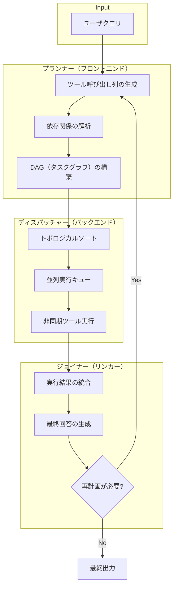

本記事は [https://arxiv.org/abs/2311.12785](https://arxiv.org/abs/2311.12785) の解説記事です。

## 論文概要（Abstract）

LLM Compilerは、LLMエージェントのツール呼び出し（function calling）を「コンパイラ」のメタファーで体系化し、独立した関数呼び出しをDAG（有向非巡回グラフ）として表現・並列実行するフレームワークである。著者らは、従来のReActパターンが逐次的にツールを呼び出す非効率性を指摘し、プランナー・ディスパッチャー・ジョイナーの3段構造を提案した。HotpotQAベンチマークにおいてReAct比で正確性+3.7%向上と実行速度3.6倍の短縮を同時に達成したと報告している。

この記事は [Zenn記事: AIエージェント時代のプロンプト設計パターン10選と構造化手法](https://zenn.dev/0h_n0/articles/f03c9688e5ccbf) の深掘りです。

## 情報源

- **arXiv ID**: 2311.12785
- **URL**: [https://arxiv.org/abs/2311.12785](https://arxiv.org/abs/2311.12785)
- **著者**: Sehoon Kim, Suhong Moon, Ryan Tabrizi, Nicholas Lee, Michael W. Mahoney, Kurt Keutzer（UC Berkeley）
- **発表年**: 2023
- **分野**: cs.CL, cs.AI

## 背景と動機（Background & Motivation）

2023年時点で、LLMエージェントにおけるツール呼び出しの主流パターンはReActであった。ReActは「観察→思考→行動」のループで逐次的にツールを1つずつ呼び出す。このアプローチはシンプルだが、独立した複数のツール呼び出しが存在する場合でも直列に実行するため、レイテンシの無駄が発生する。

たとえば「東京とニューヨークの天気を比較する」というタスクでは、2つの都市の天気取得は互いに独立しているにもかかわらず、ReActでは順番に実行する。さらに、各ステップでLLMの推論が挟まるため、ツール呼び出し回数に比例してLLMの推論コスト（トークン消費）も増加する。

著者らはこの問題を「コンパイラ最適化」の視点で捉え直した。プログラミング言語のコンパイラがソースコードの依存関係を解析し命令を並列化するのと同様に、LLMの出力するツール呼び出し列の依存関係を解析し、独立した呼び出しを並列実行するアプローチを提案した。

## 主要な貢献（Key Contributions）

- **貢献1**: LLMのツール呼び出しを「コンパイラ」メタファーで体系化し、プランナー（フロントエンド）、ディスパッチャー（バックエンド）、ジョイナー（リンカー）の3段アーキテクチャを提案した
- **貢献2**: DAGベースのタスク依存関係表現により、独立したツール呼び出しの並列実行を可能にした。$n$個の独立した呼び出しがある場合、理論的にはレイテンシを$1/n$に削減できる
- **貢献3**: HotpotQAで正確性62.3%→66.0%（+3.7ポイント）、実行速度3.6倍を達成したと報告している（論文Table 1, Table 2より）
- **貢献4**: ゼロショットプロンプティングでも動作し、GPT-4, GPT-3.5, LLaMAの3つのモデルで評価を行っている。オープンモデル（LLaMA）ではファインチューニングによりToolBenchmarkで90%以上の精度を達成した

## 技術的詳細（Technical Details）

### アーキテクチャ概要: 3段コンパイラ構造

LLM Compilerは、従来のコンパイラアーキテクチャからの類推で設計されている。



| コンパイラ用語 | LLM Compiler | 役割 |
|---|---|---|
| フロントエンド | プランナー | ツール呼び出し列を解析し、DAGを生成 |
| バックエンド | ディスパッチャー | DAGに基づき並列実行をスケジューリング |
| リンカー | ジョイナー | 実行結果を統合し、最終回答を生成 |

### プランナー: DAGの生成

プランナーはユーザのクエリを受け取り、必要なツール呼び出しとその依存関係をDAG形式で出力する。著者らはFew-shot promptingでLLMにDAG出力を指示する。

DAGの各ノードは以下の形式で表現される。

```
$TASK_ID = tool_name(arg1="value1", arg2=$PREV_TASK_ID.result)
```

ここで`$PREV_TASK_ID.result`は別のタスクの出力への参照であり、これが依存関係のエッジとなる。

具体例として、「東京とニューヨークの天気を比較し、気温差を計算する」というクエリに対するDAG出力は以下のようになる。

```
$1 = get_weather(city="Tokyo")
$2 = get_weather(city="New York")
$3 = calculate_difference(value1=$1.temperature, value2=$2.temperature)
```

この場合、`$1`と`$2`は独立（相互に依存しない）なので並列実行可能であり、`$3`は`$1`と`$2`の両方に依存するため、両者の完了後に実行される。

依存関係を形式的に表現すると、タスクグラフ$G = (V, E)$において、

$$
V = \{t_1, t_2, \ldots, t_n\}
$$

$$
E = \{(t_i, t_j) \mid t_j \text{ の引数が } t_i \text{ の出力を参照}\}
$$

と定義される。ここで$V$はタスク（ノード）の集合、$E$は依存関係（エッジ）の集合である。

### ディスパッチャー: 並列実行スケジューリング

ディスパッチャーはDAGのトポロジカルソートに基づき、依存関係が満たされたタスクを非同期で並列実行する。

アルゴリズムの核心は以下の通りである。

1. **入次数の計算**: 各ノードの入次数（依存する先行タスク数）を計算
2. **実行可能キューの初期化**: 入次数0のノード（依存なし）を実行可能キューに追加
3. **並列実行ループ**: キューからノードを取り出し非同期実行。完了したノードの後続ノードの入次数をデクリメントし、入次数が0になったノードをキューに追加

$$
\text{ready}(t) = \begin{cases} \text{true} & \text{if } \text{indegree}(t) = 0 \\ \text{false} & \text{otherwise} \end{cases}
$$

ここで$\text{indegree}(t)$はタスク$t$の入次数（未完了の先行タスク数）である。

### ジョイナー: 結果統合と再計画

ジョイナーはすべてのタスクの実行結果を受け取り、最終的な回答を生成する。著者らは2つのバリエーションを提案している。

- **LLM Compiler**: ジョイナーが最終回答のみを生成する（1回の計画で終了）
- **LLM Compiler+**: ジョイナーが「再計画が必要か」を判断し、必要に応じてプランナーに戻るループを形成する。これにより、初回の計画では不十分だった場合の回復が可能になる

## アルゴリズム（Implementation）

以下はLLM Compilerのディスパッチャー部分の概念的な実装である。

```python
import asyncio
from dataclasses import dataclass, field
from collections import defaultdict


@dataclass
class Task:
    """DAG上の1タスク（ツール呼び出し）を表現する。

    Attributes:
        task_id: タスクの一意識別子
        tool_name: 呼び出すツール名
        args: ツールに渡す引数（他タスクの出力参照を含みうる）
        dependencies: 先行タスクのID集合
    """
    task_id: str
    tool_name: str
    args: dict
    dependencies: set[str] = field(default_factory=set)


class DAGDispatcher:
    """DAGに基づくタスクの並列ディスパッチャー。

    トポロジカルソートに基づき、依存関係が解決された
    タスクを非同期で並列実行する。
    """

    def __init__(self, tasks: list[Task], tool_registry: dict):
        self.tasks = {t.task_id: t for t in tasks}
        self.tool_registry = tool_registry
        self.results: dict[str, object] = {}
        self.indegree: dict[str, int] = defaultdict(int)
        self.successors: dict[str, list[str]] = defaultdict(list)

        # DAGの依存関係グラフを構築
        for task in tasks:
            self.indegree[task.task_id] = len(task.dependencies)
            for dep in task.dependencies:
                self.successors[dep].append(task.task_id)

    def _resolve_args(self, task: Task) -> dict:
        """タスクの引数中の他タスク出力参照を実際の値に置換する。"""
        resolved = {}
        for key, value in task.args.items():
            if isinstance(value, str) and value.startswith("$"):
                ref_id, attr = value.split(".", 1)
                ref_id = ref_id.lstrip("$")
                result = self.results[ref_id]
                resolved[key] = getattr(result, attr, result)
            else:
                resolved[key] = value
        return resolved

    async def _execute_task(self, task: Task) -> object:
        """単一タスクを実行し、結果を返す。"""
        resolved_args = self._resolve_args(task)
        tool_fn = self.tool_registry[task.tool_name]
        return await tool_fn(**resolved_args)

    async def run(self) -> dict[str, object]:
        """DAG全体を並列実行し、全タスクの結果を返す。

        Returns:
            タスクID -> 実行結果 のマッピング
        """
        # 入次数0のタスクを初期キューに追加
        queue: asyncio.Queue[str] = asyncio.Queue()
        for task_id, deg in self.indegree.items():
            if deg == 0:
                await queue.put(task_id)

        pending: set[asyncio.Task] = set()
        completed_count = 0
        total = len(self.tasks)

        while completed_count < total:
            # キューからタスクを取り出して非同期実行を開始
            while not queue.empty():
                task_id = await queue.get()
                task = self.tasks[task_id]
                coro = self._execute_task(task)
                async_task = asyncio.create_task(coro)
                async_task.task_id = task_id  # type: ignore[attr-defined]
                pending.add(async_task)

            # 完了したタスクを待機
            done, pending = await asyncio.wait(
                pending, return_when=asyncio.FIRST_COMPLETED
            )

            for async_task in done:
                tid = async_task.task_id  # type: ignore[attr-defined]
                self.results[tid] = async_task.result()
                completed_count += 1

                # 後続タスクの入次数を更新
                for succ_id in self.successors[tid]:
                    self.indegree[succ_id] -= 1
                    if self.indegree[succ_id] == 0:
                        await queue.put(succ_id)

        return self.results
```

このコードのポイントは以下の通りである。

1. **`asyncio.wait`による動的スケジューリング**: タスクが完了するたびに後続タスクの入次数を更新し、実行可能になったタスクを即座にキューに追加する
2. **引数の遅延解決**: `_resolve_args`で先行タスクの実行結果を参照解決することで、DAGの依存関係を実行時に正しく処理する
3. **ツールレジストリパターン**: `tool_registry`でツール関数を管理し、タスク定義とツール実装を分離する

## 実装のポイント（Implementation Notes）

### プランナープロンプトの設計

著者らの実装で重要なのは、プランナーへのFew-shot promptの設計である。LLMにDAG形式の出力を安定して生成させるために、以下の工夫が施されている。

1. **明示的な出力フォーマット指定**: `$TASK_ID = tool_name(args)`の形式を厳密に定義し、パース可能な構造化出力を得る
2. **依存関係の参照記法**: `$PREV_ID.result`という参照記法により、LLMがタスク間の依存関係を自然言語ではなく形式的に表現できる
3. **並列性の明示的指示**: 「独立したタスクは同じ行に書かず、それぞれ別の行に書くが、依存関係がない場合は並列実行される」という指示をプロンプトに含める

### DAG生成の課題

著者らは、LLMがDAGを生成する際の課題として以下を報告している。

- **サイクルの生成**: LLMが誤って循環依存を生成する場合がある。ディスパッチャー側でサイクル検出を行い、検出時はエラーとして再計画を要求する
- **依存関係の見落とし**: 本来依存関係があるべきタスク間で依存が記述されない場合がある。この場合、先行タスクの結果がないまま後続タスクが実行され、不正確な結果となる
- **過剰な逐次化**: 本来並列実行可能なタスクに不要な依存関係を追加してしまい、並列度が低下する場合がある

### ジョイナーの情報損失リスク

ジョイナーは全タスクの結果を1つのコンテキストに統合してLLMに渡すため、タスク数が多い場合にコンテキストウィンドウの制約により情報が失われるリスクがある。著者らは、結果の要約やフィルタリングを行うことでこのリスクを軽減できると述べている。

## Production Deployment Guide

以下では、LLM Compilerアーキテクチャをプロダクション環境に展開する際のAWS構成、インフラコード、運用設定を示す。

> コスト試算は記事生成時点（2026年6月）のAWS ap-northeast-1（東京）リージョン料金に基づく概算値です。実際のコストはトラフィックパターン、リージョン、バースト使用量により変動します。最新料金は[AWS料金計算ツール](https://calculator.aws/)で確認してください。

### AWS実装パターン（コスト最適化重視）

LLM Compilerの特性上、「プランナー（LLM推論）→ディスパッチャー（並列ツール実行）→ジョイナー（LLM推論）」の3段処理が必要であり、LLM推論コストとツール実行の並列度がアーキテクチャ選択の鍵となる。

| 構成 | トラフィック | 主要サービス | 月額概算 |
|------|-------------|-------------|---------|
| Small | ~100 req/日 | Lambda + Bedrock + DynamoDB | $80-180 |
| Medium | ~1,000 req/日 | ECS Fargate + Bedrock + ElastiCache | $400-900 |
| Large | 10,000+ req/日 | EKS + Karpenter + Spot + Bedrock Batch | $2,500-5,500 |

**Small構成の内訳**:
- Lambda（プランナー/ジョイナー）: 100req x 30日 x 30秒 x 1024MB = 約$2.50
- Bedrock Claude Sonnet: 100req x 2回（プランナー+ジョイナー）x ~2,000 input tokens x ~1,000 output tokens = 約$30-60
- DynamoDB On-Demand（タスクグラフ/結果保存）: 約$1-3
- Lambda（ディスパッチャー、ツール実行）: 並列実行分で約$5-10
- CloudWatch Logs: 約$3-5

**Medium構成の追加要素**:
- ECS Fargate（常駐ディスパッチャー）: 0.5 vCPU x 1GB x 730h = 約$25
- ElastiCache（タスク結果キャッシュ）: cache.t4g.micro = 約$12
- ALB: 約$22 + LCU課金

**Large構成のコスト削減**:
- EKS Spot Instances（m5.xlarge）: On-Demand比で最大70%削減
- Bedrock Batch API: 同期API比で50%削減（非リアルタイム処理向け）
- Karpenter自動スケーリング: アイドル時のノード数最小化
- Prompt Caching: プランナーのFew-shotプロンプト部分をキャッシュし30-90%削減

### Terraformインフラコード

#### Small構成（Lambda + Bedrock + DynamoDB）

```hcl
# --- Provider & Variables ---
terraform {
  required_version = ">= 1.9"
  required_providers {
    aws = { source = "hashicorp/aws", version = "~> 5.80" }
  }
}

provider "aws" { region = "ap-northeast-1" }

variable "project" { default = "llm-compiler" }

# --- DynamoDB: タスクグラフと実行結果の永続化 ---
resource "aws_dynamodb_table" "task_graph" {
  name         = "${var.project}-task-graph"
  billing_mode = "PAY_PER_REQUEST" # On-Demand: 低トラフィック時に最適
  hash_key     = "request_id"
  range_key    = "task_id"

  attribute {
    name = "request_id"
    type = "S"
  }
  attribute {
    name = "task_id"
    type = "S"
  }

  ttl {
    attribute_name = "expires_at"
    enabled        = true
  }

  point_in_time_recovery { enabled = true }

  server_side_encryption {
    enabled = true # AWS管理キーによる暗号化
  }

  tags = { Project = var.project, CostCenter = "llm-compiler" }
}

# --- IAM: Lambda実行ロール（最小権限） ---
resource "aws_iam_role" "lambda_exec" {
  name = "${var.project}-lambda-exec"
  assume_role_policy = jsonencode({
    Version = "2012-10-17"
    Statement = [{
      Action = "sts:AssumeRole"
      Effect = "Allow"
      Principal = { Service = "lambda.amazonaws.com" }
    }]
  })
}

resource "aws_iam_role_policy" "lambda_permissions" {
  name = "${var.project}-lambda-perms"
  role = aws_iam_role.lambda_exec.id
  policy = jsonencode({
    Version = "2012-10-17"
    Statement = [
      {
        Effect   = "Allow"
        Action   = ["bedrock:InvokeModel"]
        Resource = "arn:aws:bedrock:ap-northeast-1::foundation-model/anthropic.claude-*"
      },
      {
        Effect = "Allow"
        Action = [
          "dynamodb:PutItem", "dynamodb:GetItem",
          "dynamodb:UpdateItem", "dynamodb:Query"
        ]
        Resource = aws_dynamodb_table.task_graph.arn
      },
      {
        Effect   = "Allow"
        Action   = ["logs:CreateLogGroup", "logs:CreateLogStream", "logs:PutLogEvents"]
        Resource = "arn:aws:logs:ap-northeast-1:*:*"
      },
      {
        Effect   = "Allow"
        Action   = ["xray:PutTraceSegments", "xray:PutTelemetryRecords"]
        Resource = "*"
      }
    ]
  })
}

# --- Lambda: プランナー + ディスパッチャー + ジョイナー ---
resource "aws_lambda_function" "compiler" {
  function_name = "${var.project}-compiler"
  runtime       = "python3.12"
  handler       = "handler.lambda_handler"
  role          = aws_iam_role.lambda_exec.arn
  timeout       = 120 # DAG実行を含むため長めに設定
  memory_size   = 1024

  filename         = "lambda.zip"
  source_code_hash = filebase64sha256("lambda.zip")

  tracing_config { mode = "Active" } # X-Ray有効化

  environment {
    variables = {
      DYNAMODB_TABLE      = aws_dynamodb_table.task_graph.name
      BEDROCK_MODEL_ID    = "anthropic.claude-sonnet-4-20250514"
      MAX_PARALLEL_TASKS  = "10"
      PLANNER_TEMPERATURE = "0.0"
    }
  }

  tags = { Project = var.project }
}

# --- CloudWatch アラーム: コスト異常検知 ---
resource "aws_cloudwatch_metric_alarm" "lambda_duration" {
  alarm_name          = "${var.project}-lambda-duration-high"
  comparison_operator = "GreaterThanThreshold"
  evaluation_periods  = 3
  metric_name         = "Duration"
  namespace           = "AWS/Lambda"
  period              = 300
  statistic           = "Average"
  threshold           = 60000 # 60秒超過でアラーム
  alarm_description   = "Lambda実行時間が60秒を超過"
  dimensions = {
    FunctionName = aws_lambda_function.compiler.function_name
  }
}
```

#### Large構成（EKS + Karpenter + Spot Instances）

```hcl
# --- EKS クラスタ ---
module "eks" {
  source  = "terraform-aws-modules/eks/aws"
  version = "~> 20.31"

  cluster_name    = "${var.project}-cluster"
  cluster_version = "1.31"

  vpc_id     = module.vpc.vpc_id
  subnet_ids = module.vpc.private_subnets

  # コスト最適化: コントロールプレーンのみManaged
  cluster_endpoint_public_access = true

  eks_managed_node_groups = {
    system = {
      instance_types = ["m7i.large"]
      min_size       = 1
      max_size       = 2
      desired_size   = 1
      labels         = { role = "system" }
    }
  }

  tags = { Project = var.project }
}

# --- Karpenter: Spot優先の自動スケーリング ---
resource "kubectl_manifest" "karpenter_node_pool" {
  yaml_body = yamlencode({
    apiVersion = "karpenter.sh/v1"
    kind       = "NodePool"
    metadata   = { name = "${var.project}-spot-pool" }
    spec = {
      template = {
        spec = {
          requirements = [
            { key = "karpenter.sh/capacity-type", operator = "In", values = ["spot", "on-demand"] },
            { key = "node.kubernetes.io/instance-type", operator = "In",
              values = ["m5.xlarge", "m5a.xlarge", "m6i.xlarge", "m7i.xlarge"] },
          ]
          nodeClassRef = {
            group = "karpenter.k8s.aws"
            kind  = "EC2NodeClass"
            name  = "${var.project}-default"
          }
        }
      }
      limits   = { cpu = "64", memory = "256Gi" }
      disruption = {
        consolidationPolicy = "WhenEmptyOrUnderutilized"
        consolidateAfter    = "60s" # アイドルノードを60秒で回収
      }
    }
  })
}

# --- AWS Budgets: 月次コストアラート ---
resource "aws_budgets_budget" "monthly" {
  name         = "${var.project}-monthly"
  budget_type  = "COST"
  limit_amount = "5000"
  limit_unit   = "USD"
  time_unit    = "MONTHLY"

  cost_filter {
    name   = "TagKeyValue"
    values = ["user:Project$${var.project}"]
  }

  notification {
    comparison_operator       = "GREATER_THAN"
    threshold                 = 80
    threshold_type            = "PERCENTAGE"
    notification_type         = "ACTUAL"
    subscriber_email_addresses = ["ops@example.com"]
  }
}
```

### 運用・監視設定

#### CloudWatch Logs Insights クエリ

```
# コスト異常検知: 1時間あたりのBedrock呼び出し回数とトークン使用量
fields @timestamp, request_id, bedrock_model, input_tokens, output_tokens
| filter event = "bedrock_invocation"
| stats sum(input_tokens) as total_input, sum(output_tokens) as total_output,
        count(*) as invocation_count by bin(1h) as hour
| sort hour desc

# DAGディスパッチャーのレイテンシ分析
fields @timestamp, request_id, dag_depth, parallel_tasks, total_duration_ms
| filter event = "dag_execution_complete"
| stats avg(total_duration_ms) as avg_ms, pct(total_duration_ms, 95) as p95_ms,
        pct(total_duration_ms, 99) as p99_ms, avg(parallel_tasks) as avg_parallelism
  by bin(1h)
```

#### CloudWatch アラーム設定

```python
import boto3

cloudwatch = boto3.client("cloudwatch", region_name="ap-northeast-1")

# Bedrockトークン使用量スパイク検知
cloudwatch.put_metric_alarm(
    AlarmName="llm-compiler-bedrock-token-spike",
    MetricName="InputTokenCount",
    Namespace="Custom/LLMCompiler",
    Statistic="Sum",
    Period=3600,
    EvaluationPeriods=1,
    Threshold=500_000,  # 1時間あたり50万トークン超過
    ComparisonOperator="GreaterThanThreshold",
    AlarmActions=["arn:aws:sns:ap-northeast-1:ACCOUNT:ops-alerts"],
    AlarmDescription="Bedrockトークン使用量が閾値を超過",
)
```

#### X-Ray トレーシング設定

```python
from aws_xray_sdk.core import xray_recorder, patch_all

# boto3, requests等を自動計装
patch_all()

@xray_recorder.capture("plan_dag")
def plan_dag(query: str) -> dict:
    """プランナーでDAGを生成する。"""
    subsegment = xray_recorder.current_subsegment()
    subsegment.put_annotation("query_length", len(query))

    # Bedrock呼び出し（X-Rayが自動トレース）
    dag = invoke_planner(query)

    subsegment.put_metadata("dag_node_count", len(dag["tasks"]))
    subsegment.put_metadata("dag_depth", dag["depth"])
    return dag
```

#### Cost Explorer 自動レポート

```python
import boto3
from datetime import date, timedelta

ce = boto3.client("ce", region_name="ap-northeast-1")
sns = boto3.client("sns", region_name="ap-northeast-1")

def daily_cost_report() -> None:
    """日次コストレポートを取得し、閾値超過時にSNS通知する。"""
    today = date.today()
    yesterday = today - timedelta(days=1)

    response = ce.get_cost_and_usage(
        TimePeriod={"Start": str(yesterday), "End": str(today)},
        Granularity="DAILY",
        Metrics=["UnblendedCost"],
        Filter={
            "Tags": {
                "Key": "Project",
                "Values": ["llm-compiler"],
            }
        },
        GroupBy=[{"Type": "DIMENSION", "Key": "SERVICE"}],
    )

    total = sum(
        float(g["Metrics"]["UnblendedCost"]["Amount"])
        for r in response["ResultsByTime"]
        for g in r["Groups"]
    )

    if total > 100.0:  # $100/日超過でアラート
        sns.publish(
            TopicArn="arn:aws:sns:ap-northeast-1:ACCOUNT:cost-alerts",
            Subject=f"LLM Compiler日次コスト超過: ${total:.2f}",
            Message=f"日次コストが$100を超過しました: ${total:.2f}\n詳細はCost Explorerを確認してください。",
        )
```

### コスト最適化チェックリスト

**アーキテクチャ選択**:
- [ ] トラフィック量に応じた構成を選択（~100 req/日: Serverless、~1000: Hybrid、10000+: Container）
- [ ] リアルタイム性要件を確認（非同期処理可能ならBatch APIで50%削減）

**リソース最適化**:
- [ ] EC2/EKS: Spot Instances優先（On-Demand比最大70-90%削減）
- [ ] Reserved Instances: 1年コミットで最大40%削減
- [ ] Savings Plans: Compute Savings Plansで最大37%削減
- [ ] Lambda: メモリサイズをPower Tuningで最適化（過剰割当を回避）
- [ ] ECS/EKS: Karpenterでアイドルノードを60秒で回収
- [ ] NAT Gateway: VPCエンドポイント活用で通信コスト削減

**LLMコスト削減**:
- [ ] Bedrock Batch API: 非リアルタイム処理で50%削減
- [ ] Prompt Caching: プランナーのFew-shotプロンプト（約2,000トークン）をキャッシュし30-90%削減
- [ ] モデル選択ロジック: 単純なDAG（ノード数3以下）はHaiku、複雑なDAGはSonnetを使用
- [ ] トークン数制限: ジョイナーの入力を要約し、不要な詳細を削除
- [ ] プランナーのtemperature=0: 決定論的出力でリトライ削減

**監視・アラート**:
- [ ] AWS Budgets: 月次予算アラート（80%/100%閾値）
- [ ] CloudWatch アラーム: Bedrockトークン使用量、Lambda実行時間
- [ ] Cost Anomaly Detection: ML検知による異常コスト早期発見
- [ ] 日次コストレポート: Cost Explorer APIで自動集計・SNS通知
- [ ] X-Ray: DAG実行のレイテンシ可視化

**リソース管理**:
- [ ] 未使用リソース削除: 定期的にCost Explorerで0使用リソースを確認
- [ ] タグ戦略: `Project`, `Environment`, `CostCenter`タグを全リソースに適用
- [ ] DynamoDB TTL: タスクグラフを7日で自動削除
- [ ] CloudWatch Logs保持期間: 30日に設定（デフォルトの無期限保持を回避）
- [ ] 開発環境: 夜間・週末はEKSノードを0にスケールダウン

## 実験結果（Results）

### ベンチマーク評価

著者らは、2つの主要ベンチマークでLLM Compilerを評価している。

#### HotpotQA（論文Table 1, Table 2より）

| 手法 | 正確性 (%) | 実行速度（相対） |
|---|---|---|
| ReAct（逐次実行） | 62.3 | 1.0x |
| LLM Compiler | 66.0 | 3.6x |
| LLM Compiler+ | 65.8 | 3.4x |

LLM Compilerが正確性でReActを3.7ポイント上回った理由として、著者らは以下を挙げている。

1. **並列実行による情報の同時取得**: 逐次実行では前のステップの結果に引きずられてバイアスが発生する場合がある。並列実行では独立した情報源から偏りなく情報を収集できる
2. **計画段階での全体把握**: プランナーがクエリ全体を見て計画するため、ReActの「1ステップずつ考える」アプローチより全体最適な計画が立てられる

LLM Compiler+（再計画あり）がLLM Compilerとほぼ同等の性能である点について、著者らはHotpotQAでは多くのクエリが1回の計画で解決可能であり、再計画の恩恵が限定的であったと分析している。

#### Tool Benchmark（論文Table 3より）

| 手法 | 設定 | 正確性 (%) |
|---|---|---|
| ReAct | GPT-4 | 64 |
| LLM Compiler | GPT-4（ゼロショット） | 69 |
| LLM Compiler | GPT-3.5（ゼロショット） | 58 |
| LLM Compiler | LLaMA-2-70B（ファインチューニング） | 90+ |

注目すべきは、ファインチューニングしたLLaMA-2-70Bが90%以上の精度を達成した点である。著者らは、ゼロショットではGPT-4が最良だが、ファインチューニングデータが利用可能な場合はオープンモデルでも十分な性能が得られると報告している。

### 速度改善の分析

著者らは速度改善の要因を以下のように分解している（論文Section 5.2より）。

1. **ツール実行の並列化**: 2-4個の独立したツール呼び出しが同時実行されることで、ツール実行時間が約1/3に短縮
2. **LLM推論回数の削減**: ReActは各ステップでLLM推論を行うが、LLM Compilerはプランナーとジョイナーの2回のみ。ツール呼び出しが5回あるケースでは、推論回数が5回→2回に削減される

## 実運用への応用（Practical Applications）

LLM Compilerの知見は、Zenn記事で紹介されたプロンプト設計パターンと以下のように対応する。

### プロンプト設計パターンとの関連

Zenn記事のプロンプト設計パターンのうち、「構造化出力」パターンと「計画→実行」パターンがLLM Compilerの設計と直接関連する。

| Zenn記事のパターン | LLM Compilerでの対応 |
|---|---|
| 構造化出力 | プランナーが`$TASK_ID = tool(args)`形式のDAGを構造化出力する |
| 計画→実行分離 | プランナー（計画）とディスパッチャー（実行）の明示的分離 |
| ステップバイステップ | ジョイナーでの段階的な結果統合 |
| ツール使用指示 | プランナープロンプトでのツール定義と使用例の提示 |

### エージェントフレームワークへの組み込み

LLM Compilerのアーキテクチャは、LangChainやLangGraphなどのエージェントフレームワークに組み込むことで実用化できる。特にLangGraphのDAGベースのワークフロー定義とLLM CompilerのDAGベースのタスク表現は構造的に類似しており、LangGraphの`StateGraph`としてプランナー→ディスパッチャー→ジョイナーのフローを定義することが自然なアプローチとなる。

ただし、プロダクション環境での注意点がある。プランナーが生成するDAGのバリデーション（サイクル検出、未定義ツール参照の検出）を実行前に行う必要がある。また、並列実行するツール呼び出しのタイムアウト設定とリトライポリシーを個別に設定できる設計が望ましい。

## 関連研究（Related Work）

- **ReAct（Yao et al., 2022; arXiv 2210.03629）**: 「推論→行動→観察」のループでツールを逐次呼び出す手法。LLM Compilerはこの逐次性を並列化したものと位置づけられる
- **Toolformer（Schick et al., 2023; arXiv 2302.04761）**: LLMが自律的にAPI呼び出しを学習する手法。LLM Compilerとは異なり、ファインチューニングベースでツール使用を獲得する
- **OpenAI Parallel Function Calling（2023）**: GPT-4 Turboで導入された並列関数呼び出し機能。LLM Compilerはこれをより一般的なDAGフレームワークとして拡張したものと解釈できる
- **TaskWeaver（Qiao et al., 2023; arXiv 2311.17541）**: コード生成ベースのタスク計画フレームワーク。LLM Compilerと同時期の研究で、計画の表現方法（DAG vs コード）が異なる

## まとめと今後の展望

LLM Compilerは、LLMエージェントのツール呼び出しを「コンパイラ最適化」の視点で体系化し、DAGベースの並列実行によりReAct比3.6倍の速度向上と3.7ポイントの精度改善を達成した研究である。プランナー・ディスパッチャー・ジョイナーの3段構造は、エージェントアーキテクチャの設計パターンとして広く参考にできる。

一方で、プランナーが生成するDAGの品質はLLMの能力に依存しており、サイクル生成や依存関係の見落としといった課題が残されている。また、ジョイナーでの情報損失リスクは、タスク数が増えるほど深刻になる可能性がある。今後は、DAG生成の信頼性向上（制約付きデコーディング等）や、動的な再計画機構の改善が研究の方向性として挙げられる。

## 参考文献

- **arXiv**: [https://arxiv.org/abs/2311.12785](https://arxiv.org/abs/2311.12785)
- **Related Zenn article**: [https://zenn.dev/0h_n0/articles/f03c9688e5ccbf](https://zenn.dev/0h_n0/articles/f03c9688e5ccbf)
- **ReAct**: [https://arxiv.org/abs/2210.03629](https://arxiv.org/abs/2210.03629)
- **Toolformer**: [https://arxiv.org/abs/2302.04761](https://arxiv.org/abs/2302.04761)
