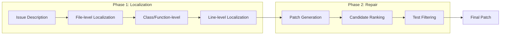

本記事は [Agentless: Demystifying LLM-based Software Engineering Agents](https://arxiv.org/abs/2407.21783) の解説記事です。

## 論文概要（Abstract）

Agentlessは、LLMにツールやシェルアクセスを与えずに、ソフトウェアのバグ修正を自律的に行う2ステップ手法である。著者らは、複雑なエージェントループを使わず「故障箇所の特定（Localization）→パッチ生成（Repair）」の単純なパイプラインでSWE-bench Liteにおいて27.33%を達成し、当時のオープンソース手法で最高性能を記録したと報告している。1タスクあたりの平均コストは$0.34であり、SWE-agent（$4.19/タスク）と比較して約12倍のコスト効率を実現した点が注目される。

この記事は [Zenn記事: Claude Codeで本番プロジェクトにAI拡張開発を組み込む実践ワークフロー](https://zenn.dev/0h_n0/articles/6f90aa53dcc249) の深掘りです。

## 情報源

- **arXiv ID**: 2407.21783
- **URL**: [https://arxiv.org/abs/2407.21783](https://arxiv.org/abs/2407.21783)
- **著者**: Chunqiu Steven Xia, Yinlin Deng, Soren Dunn, Lingming Zhang（University of Illinois Urbana-Champaign）
- **発表年**: 2024
- **分野**: cs.SE, cs.AI, cs.CL
- **コード**: [https://github.com/OpenAutoCoder/Agentless](https://github.com/OpenAutoCoder/Agentless)（MIT License）

## 背景と動機（Background & Motivation）

2024年のAIソフトウェア開発エージェント研究では、SWE-agent、AutoCodeRover、OpenHandsといった「エージェント型」手法が主流であった。これらの手法はLLMにシェルアクセスやツール呼び出しの能力を与え、自律的にコードを探索・修正させるアプローチを採用している。

しかし著者らは、エージェント型手法には以下の本質的な課題があると指摘している。

1. **コスト**: エージェントが試行錯誤を繰り返すため、1タスクあたりのLLM API呼び出し回数が多い。SWE-agentでは平均$4.19/タスクのコストが発生する
2. **制御困難性**: エージェントの行動が非決定的であり、同じタスクでも実行ごとに異なる結果を生む
3. **複雑性**: エージェントのプロンプト設計、ツール定義、状態管理の実装コストが高い

著者らはこれらの課題に対し、「エージェントは本当に必要なのか？」という根本的な問いを提起し、ツールを一切使わない最小限のパイプラインで同等以上の性能を達成できることを実証した。

## 主要な貢献（Key Contributions）

- **貢献1**: ツール不使用の2ステップパイプライン（Localization→Repair）を提案し、SWE-bench Liteで27.33%を達成した（論文Table 1より）
- **貢献2**: 1タスクあたり$0.34という低コストを実現し、エージェント型手法（SWE-agent: $4.19）に対して約12倍のコスト効率を示した（論文Table 2より）
- **貢献3**: SWE-bench Liteの問題分析を行い、既存ベンチマークの課題（不正確なテスト、複数の正解パッチの存在）を指摘した

## 技術的詳細（Technical Details）

### 2ステップパイプライン

Agentlessのアーキテクチャは、以下の2つのフェーズで構成される。



#### Phase 1: 階層的故障箇所特定（Hierarchical Localization）

故障箇所の特定を3段階の粒度で階層的に行う。

**Step 1 — ファイルレベル特定**: Issue記述とリポジトリのディレクトリ構造をLLMに入力し、関連するファイルを特定する。リポジトリ全体のファイルツリーを`tree`コマンドで取得し、プロンプトに含める。著者らは上位5ファイルを候補として選択する。

**Step 2 — クラス・関数レベル特定**: Step 1で特定されたファイルのクラス・関数のシグネチャ一覧をLLMに入力し、関連するクラスや関数を特定する。ファイルの全コードではなく、構造情報（クラス名、メソッド名、行番号）のみを入力する点が重要である。

**Step 3 — 行レベル特定**: Step 2で特定されたクラス・関数の実際のコードをLLMに入力し、修正すべき行の範囲を特定する。

この階層的アプローチにより、LLMのコンテキストウィンドウを効率的に使用できる。リポジトリ全体を一度に入力する代わりに、段階的に範囲を絞り込むことで、大規模リポジトリにも対応可能である。

#### Phase 2: パッチ生成と選択（Repair）

故障箇所が特定された後、以下の手順でパッチを生成・選択する。

**パッチ生成**: 特定された行範囲とIssue記述をLLMに入力し、diff形式でパッチを生成させる。著者らは1つのタスクに対して複数のパッチ候補（論文では最大10個）を生成する。

**候補ランキング**: 生成された複数のパッチ候補から最適なものを選択する。著者らは2つの方法を比較している。

- **多数決（Majority Voting）**: 同一の修正内容を持つパッチが多いほど優先する。直感的には、LLMが複数回独立に同じ修正を生成するなら、その修正は正しい可能性が高い
- **回帰テストフィルタリング**: 既存のテストスイートを実行し、テストを通過するパッチのみを候補として残す

著者らは、回帰テストフィルタリングと多数決の組み合わせが最も効果的であると報告している。

### コスト分析

著者らは、Agentlessと他手法のコストを詳細に比較している（論文Table 2より）。

| 手法 | SWE-bench Lite (%) | 平均コスト/タスク | コスト効率比 |
|---|---|---|---|
| Agentless (GPT-4o) | 27.33 | $0.34 | 1.0x（基準） |
| SWE-agent (GPT-4) | 18.00 | $4.19 | 0.08x |
| AutoCodeRover (GPT-4) | 19.00 | $0.65 | 0.52x |
| Aider (GPT-4 + Opus) | 26.33 | $3.15 | 0.11x |

Agentlessのコストが低い理由は以下の通りである。

1. **固定ステップ数**: エージェント型はループ回数が不定だが、Agentlessは常に3回のLocalization + 1回のRepairで完了する
2. **ツール呼び出しなし**: ツール呼び出しのオーバーヘッド（プロンプト拡張、実行待機）が発生しない
3. **構造情報の圧縮**: ファイル全体ではなくシグネチャのみを入力するため、トークン消費が少ない

### Claude Codeのワークフローとの対応

Agentlessの2ステップアプローチは、Zenn記事で紹介されたClaude Codeの「Explore→Plan→Implement」ワークフローと構造的に類似している。

| Agentless | Claude Code ワークフロー |
|---|---|
| File-level Localization | Explore: 関連ファイルの発見 |
| Class/Function-level Localization | Explore: コード構造の理解 |
| Line-level Localization | Plan: 修正箇所の決定 |
| Patch Generation | Implement: コード修正 |
| Test Filtering | Commit: テスト検証 |

ただし重要な違いがある。Agentlessはフィードバックループを持たない（テスト失敗時に再試行しない）のに対し、Claude Codeは対話的にフィードバックを受けて修正を繰り返す。著者らの結果は、多くのバグ修正タスクではフィードバックループなしでも十分な性能が得られることを示唆している。

## 実験結果（Results）

### SWE-bench評価

著者らは、SWE-bench Lite（300問）でAgentlessを評価している（論文Table 1より）。

| 設定 | 解決率 (%) |
|---|---|
| Agentless (GPT-4o, 回帰テスト+多数決) | 27.33 |
| Agentless (GPT-4o, 多数決のみ) | 24.33 |
| Agentless (GPT-4o, ランダム選択) | 20.33 |

回帰テストフィルタリングの追加により約3ポイントの改善が得られている。また、多数決のみでもランダム選択に対して4ポイントの改善を示しており、複数候補生成の有効性が確認されている。

### Localization精度の分析

著者らは、故障箇所特定の各段階での精度も報告している。

- **ファイルレベル**: 上位5ファイルで対象ファイルを含む確率は79.4%
- **関数レベル**: 正しい関数を含む確率は65.2%

著者らは、Localization精度がパイプライン全体の性能ボトルネックであると分析している。ファイルレベルで正しいファイルを見逃すと、後続のステップで回復できないためである。

### SWE-bench Liteの問題分析

著者らはベンチマーク自体の分析も行い、SWE-bench Liteの300問のうち、不正確なテストや不適切な問題設定を含むケースを特定している。著者らは、4.3%の問題で正解パッチ以外にも有効なパッチが存在し、ベンチマークの評価が過小評価になっている可能性があると指摘している。この分析はSWE-bench Verified（Carlos et al., 2024; arXiv 2411.15114）の開発動機の一つとなっている。

## 実装のポイント（Implementation）

Agentlessの実装は公開されており（MIT License）、以下の手順で利用できる。

```bash
git clone https://github.com/OpenAutoCoder/Agentless.git
cd Agentless
pip install -e .

export OPENAI_API_KEY=your_key_here
```

著者らの実装では、OpenAI APIを直接呼び出すシンプルな構成であり、エージェントフレームワーク（LangChain、OpenHands等）への依存がない。これは再現性の観点で利点であるが、他のLLM（Claude、Gemini等）を使用する場合はAPI呼び出し部分の修正が必要となる。

### Localizationプロンプトの設計

著者らの実装で特筆すべきは、Localizationプロンプトの設計である。ファイルレベル特定では、リポジトリのディレクトリツリーを`tree`コマンドで取得し、Issue記述とともにLLMに入力する。

```python
# 著者らの実装に基づくLocalizationの概念的な流れ
# Step 1: ファイルレベル特定
repo_tree = subprocess.run(
    ["tree", "-I", "__pycache__|.git|node_modules", "--noreport"],
    capture_output=True, text=True
).stdout

prompt = f"""Given the following repository structure:
{repo_tree}

And the following issue:
{issue_description}

Identify the top 5 files most likely to need modification."""
```

この設計の利点は、LLMがリポジトリの全体構造を把握した上でファイルを選択できる点にある。ただし、大規模リポジトリ（10万ファイル以上）では`tree`出力自体がコンテキストウィンドウを超過する可能性があり、著者らは深さ制限やディレクトリフィルタリングで対処している。

### 複数パッチ候補の生成戦略

著者らは、パッチ生成時にtemperatureパラメータを調整して多様性を確保している。temperature=0では常に同じパッチが生成されるため、temperature=0.8程度で複数の異なるパッチ候補を生成し、回帰テストと多数決で最適な候補を選択する。この戦略はLLMの確率的な性質を積極的に活用するものであり、単一の決定論的な出力に依存しないことで堅牢性を高めている。

## 実運用への応用（Practical Applications）

Agentlessの知見は、AIコーディングエージェントの設計に以下の示唆を与えている。

**最小限のアプローチから始める**: 複雑なエージェントループを構築する前に、単純なパイプラインで十分な性能が得られるか検証すべきである。著者らの結果は、多くのバグ修正タスクでは2ステップパイプラインで十分であることを示唆している。

**階層的検索の有効性**: リポジトリ全体を一度にLLMに入力するのではなく、ファイル→クラス→行と段階的に絞り込む戦略が有効である。これは大規模コードベースでのコンテキストウィンドウの制約を効率的に回避する設計パターンである。

**コスト意識の設計**: 自律エージェントのコストは試行回数に比例する。固定ステップ数のパイプラインはコスト予測を容易にし、運用時の予算管理に適している。

## 関連研究（Related Work）

- **SWE-agent（2405.15793）**: Agent-Computer Interfaceを設計し、LLMにシェルアクセスを与えるエージェント型手法。Agentlessとは対照的なアプローチである
- **OpenHands（2408.13149）**: CodeActでアクション空間を統一するオープンプラットフォーム。Agentlessはツール不使用という点で対極に位置する
- **SWE-bench Verified（2411.15114）**: Agentlessの問題分析を受けて、人手による検証を追加した改良版ベンチマーク

## まとめと今後の展望

Agentlessは、「エージェントは本当に必要か？」という問いに対して、多くのバグ修正タスクでは不要であるという回答を実験的に示した研究である。2ステップの単純なパイプラインで当時のオープンソース最高性能を達成し、かつ12倍のコスト効率を実現したことは、AIコーディングツールの設計に重要な示唆を与えている。

一方で、フィードバックループの欠如は複雑なタスクでの性能上限を制約する要因でもある。著者らの実験では、テスト失敗をフィードバックとして受け取れないため、コンパイルエラーや実行時エラーを含むパッチが生成されるケースが一定数存在する。Claude Codeのような対話的ツールがAgentlessの階層的検索を内部に取り入れつつ、必要に応じてフィードバックループを活用するハイブリッドアプローチが、今後の有望な方向性であると考えられる。

## 参考文献

- **arXiv**: [https://arxiv.org/abs/2407.21783](https://arxiv.org/abs/2407.21783)
- **Code**: [https://github.com/OpenAutoCoder/Agentless](https://github.com/OpenAutoCoder/Agentless)
- **Related Zenn article**: [https://zenn.dev/0h_n0/articles/6f90aa53dcc249](https://zenn.dev/0h_n0/articles/6f90aa53dcc249)
