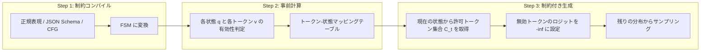

本記事は [Outlines: Structured Text Generation](https://arxiv.org/abs/2407.21787) の解説記事です。

## 論文概要（Abstract）

Outlinesは、大規模言語モデル（LLM）の出力を正規表現、JSON Schema、文脈自由文法（CFG）に100%準拠させる構造化テキスト生成ライブラリである。著者らは、制約仕様を有限状態マシン（FSM）にコンパイルし、トークンごとの許可集合を事前計算することで、生成時のオーバーヘッドを1.5〜6.8%（JSON Schema）に抑えつつ、スキーマ準拠率100%を達成したと報告している。リトライベースの手法が複雑スキーマで78%の準拠率にとどまるのに対し、Outlinesは構造的な正しさを数学的に保証する点が特徴である。

この記事は [Zenn記事: AIエージェント時代のプロンプト設計パターン10選と構造化手法](https://zenn.dev/0h_n0/articles/f03c9688e5ccbf) の深掘りです。

## 情報源

- **arXiv ID**: 2407.21787
- **URL**: [https://arxiv.org/abs/2407.21787](https://arxiv.org/abs/2407.21787)
- **著者**: Remi Louf, Brandon T. Willard
- **発表年**: 2024
- **分野**: cs.CL, cs.AI
- **コード**: [https://github.com/dottxt-ai/outlines](https://github.com/dottxt-ai/outlines)（Apache 2.0 License）

## 背景と動機（Background & Motivation）

LLMの出力をプログラムから利用する場合、JSONやYAMLなどの構造化フォーマットへの準拠が求められる。しかし、LLMは本質的に確率的なテキスト生成器であり、プロンプトで出力形式を指定しても構造的な正しさを保証できない。

著者らは、従来のアプローチに以下の問題があると指摘している。

1. **プロンプトベース**: 出力形式をプロンプトで指示するだけでは、複雑なJSON Schemaで準拠率が31%まで低下する（論文Table 2より）
2. **リトライベース**: 出力が不正な場合に再生成するが、複雑スキーマでは平均2回以上の再試行が必要であり、スループットが約50%低下する
3. **後処理ベース**: 生成済みテキストをパースして修正する方法は、意味的な一貫性を損なう可能性がある

これらの課題に対し、著者らは生成プロセス自体に構造的制約を組み込む「制約デコーディング」を提案した。形式言語理論（正規言語・文脈自由言語）のFSM表現を活用することで、トークン単位で無効な選択肢をマスクし、100%の構造的準拠を理論的に保証する手法である。

## 主要な貢献（Key Contributions）

- **貢献1**: 正規表現・JSON Schema・CFGをFSMにコンパイルし、トークン単位の制約デコーディングを実現する統一フレームワークを提案した
- **貢献2**: (制約, トークナイザー)ペアに対するトークン-状態マッピングの事前計算手法を開発し、生成時のオーバーヘッドを1.5〜6.8%に抑えた（論文Table 1より）
- **貢献3**: Apache 2.0ライセンスのOSSとして公開し、vLLM、llama.cpp、HuggingFace TGI等の主要推論エンジンに採用された

## 技術的詳細（Technical Details）

### コアアルゴリズム: 3ステップの制約デコーディング

Outlinesの制約デコーディングは、以下の3ステップで構成される。



#### Step 1: 制約仕様のFSMへのコンパイル

制約の種類に応じて異なる変換パスを使用する。

**正規表現の場合**: NFA（非決定性有限オートマトン）を構築し、部分集合構成法でDFA（決定性有限オートマトン）に変換した後、最小化アルゴリズムを適用する。著者らは`interegular`ライブラリを使用している。

**JSON Schemaの場合**: スキーマを再帰的にウォークし、各フィールドの型制約を正規表現に変換する。例えば、`{"type": "integer"}`は`-?[0-9]+`に、`{"type": "string", "maxLength": 10}`は`"[^"]{0,10}"`に変換される。スキーマ全体は各フィールドの正規表現を結合した1つの大きな正規表現となり、それをFSMにコンパイルする。

**CFGの場合**: EarleyパーサーまたはLL(1)パーサーを使用する。CFGはFSMでは表現できない（プッシュダウンオートマトンが必要）ため、パーサーの状態を追跡しながらトークンの有効性を判定する。このため、正規表現・JSON Schemaと比較してオーバーヘッドが大きくなる。

#### Step 2: トークン-状態マッピングの事前計算

FSMの各状態$q$と語彙$V$中の各トークン$v$に対して、$v$が状態$q$で受理可能かを事前に計算する。

トークナイザーは文字単位ではなく複数文字のトークン（サブワード）を使用するため、単純な文字レベルのFSM遷移では判定できない。著者らは以下のアルゴリズムを採用している。

```python
def compute_token_state_map(
    fsm: FSM,
    tokenizer: Tokenizer,
) -> dict[int, dict[int, int]]:
    """FSM状態ごとの有効トークンと遷移先状態を事前計算する。

    Args:
        fsm: コンパイル済みの有限状態マシン
        tokenizer: LLMのトークナイザー

    Returns:
        state_token_map: {状態ID: {トークンID: 遷移先状態ID}} の辞書
    """
    state_token_map: dict[int, dict[int, int]] = {}

    for state in fsm.states:
        state_token_map[state] = {}
        for token_id in range(tokenizer.vocab_size):
            # トークンをデコードして文字列に変換
            token_str = tokenizer.decode([token_id])
            # 文字ごとにFSMを遷移させる
            current = state
            valid = True
            for char in token_str:
                next_state = fsm.transition(current, char)
                if next_state is None:  # 遷移不可
                    valid = False
                    break
                current = next_state
            if valid:
                state_token_map[state][token_id] = current

    return state_token_map
```

この事前計算は$(制約, トークナイザー)$ペアごとに1回だけ実行し、結果をキャッシュする。32k語彙のトークナイザーにおける事前計算時間は以下の通りである（論文Section 4より）。

| 制約タイプ | 事前計算時間 |
|-----------|-------------|
| 単純な正規表現 | 0.12秒 |
| 単純なJSON Schema | 0.87秒 |
| 複雑なJSON Schema | 1.94秒 |
| Python文法（CFG） | 8.3秒 |

#### Step 3: 制約付き生成（Constrained Generation）

生成時の各タイムステップ$t$において、現在のFSM状態$q_t$から許可されるトークン集合$C_t$を取得し、制約付き確率分布からサンプリングする。

$$
P_{\text{constrained}}(x_{t+1} \mid x_{1:t}) \propto P(x_{t+1} \mid x_{1:t}) \cdot \mathbf{1}[x_{t+1} \in C_t]
$$

ここで、
- $P(x_{t+1} \mid x_{1:t})$: LLMの元の条件付き確率分布
- $C_t$: タイムステップ$t$における許可トークン集合（FSM状態$q_t$で遷移可能なトークンの集合）
- $\mathbf{1}[\cdot]$: 指示関数（条件を満たすとき1、それ以外は0）

実装上は、$C_t$に含まれないトークンのロジット値を$-\infty$に設定することで実現する。softmax関数を適用すると$e^{-\infty} = 0$となるため、これらのトークンの選択確率は厳密に0になる。

```python
def constrained_generate(
    model: LLM,
    fsm: FSM,
    state_token_map: dict[int, dict[int, int]],
    prompt: str,
    max_tokens: int = 256,
) -> str:
    """FSM制約付きテキスト生成を行う。

    Args:
        model: 言語モデル
        fsm: コンパイル済みFSM
        state_token_map: 事前計算済みトークン-状態マッピング
        prompt: 入力プロンプト
        max_tokens: 最大生成トークン数

    Returns:
        生成されたテキスト
    """
    current_state = fsm.initial_state
    generated_tokens: list[int] = []

    for _ in range(max_tokens):
        # LLMからロジットを取得
        logits = model.get_logits(prompt, generated_tokens)

        # 許可トークン集合を取得
        allowed_tokens = set(state_token_map[current_state].keys())

        # 無効トークンをマスク
        for token_id in range(model.vocab_size):
            if token_id not in allowed_tokens:
                logits[token_id] = float("-inf")

        # サンプリング
        next_token = sample(logits)
        generated_tokens.append(next_token)

        # FSM状態を遷移
        current_state = state_token_map[current_state][next_token]

        # 受理状態に到達したら終了
        if current_state in fsm.accept_states:
            break

    return model.tokenizer.decode(generated_tokens)
```

### トークナイザーアラインメントの詳細

LLMトークナイザーの特性が制約デコーディングを困難にする要因について補足する。BPEベースのトークナイザーでは、同じ文字列が文脈によって異なるトークン列にエンコードされる場合がある。例えば、`"true"`が単一トークンとして扱われる場合と、`"tr"` + `"ue"`の2トークンに分割される場合がある。

著者らのアプローチでは、各トークンをデコードした文字列に対してFSMを文字単位でトレースすることで、この問題を解決している。トークン$v$のデコード文字列が$c_1 c_2 \dots c_n$であるとき、状態$q$から$c_1, c_2, \dots, c_n$を順に遷移させ、すべての遷移が成功する場合にのみ$v$を許可する。

## 実装のポイント（Implementation）

Outlinesを実務で使用する際の注意点を以下にまとめる。

**FSM状態爆発への対処**: 複雑なJSON Schema（ネストされたオブジェクト、再帰的構造、多数のenum値）ではFSMの状態数が指数的に増加し、事前計算に10秒以上かかる場合がある。著者らは、スキーマの分割（各フィールドを独立したFSMとして処理）や正規表現の簡略化を推奨している。

**キャッシュ戦略**: $(制約, トークナイザー)$ペアごとの事前計算結果は、ディスクにシリアライズしてキャッシュすることで、2回目以降のリクエストでは事前計算コストをゼロにできる。プロダクション環境では、想定されるスキーマの事前計算をデプロイ時に実行しておくウォームアップ戦略が有効である。

**意味的品質への影響**: 制約が強すぎる場合、LLMの出力の意味的品質が低下する可能性がある。例えば、enum値が少ない場合や文字数制約が厳しい場合、LLMが本来選択したいトークンがマスクされ、次善のトークンが選択される。著者らは、制約の粒度を適切に設計することを推奨している。

**マルチトークン文字列の処理**: `"true"`や`"null"`のようなJSONキーワードは、トークナイザーによっては1トークンで表現される場合がある。FSMの文字単位のトレースにより正しく処理されるが、語彙サイズが大きいトークナイザー（64k〜128k）では事前計算時間が増加する。

## Production Deployment Guide

Outlines（構造化出力付きLLM推論）をAWS上で本番運用する際の構成パターンとインフラコードを示す。以下のコスト試算は2026年6月時点のAWS ap-northeast-1リージョン料金に基づく概算値であり、実際のコストはトラフィックパターン、リージョン、バースト使用量により変動する。最新料金はAWS料金計算ツールで確認を推奨する。

### AWS実装パターン（コスト最適化重視）

| 構成 | トラフィック | サービス構成 | 月額概算 |
|------|------------|-------------|---------|
| Small | ~100 req/日 | Lambda + Bedrock | $50-150 |
| Medium | ~1,000 req/日 | ECS Fargate + Bedrock | $300-800 |
| Large | 10,000+ req/日 | EKS + vLLM + Outlines (GPU) | $2,000-5,000 |

**Small構成（Serverless）**: Lambda関数からBedrock APIを呼び出し、Bedrockのネイティブ構造化出力機能（Converse API + toolConfig）を利用する。Outlinesのfsm事前計算は不要だが、Bedrockがサポートするスキーマに制約される。DynamoDBでリクエストログとキャッシュを管理する。月額内訳: Lambda($5) + Bedrock($30-120) + DynamoDB($5) + CloudWatch($5)。

**Medium構成（Hybrid）**: ECS Fargateでアプリケーションサーバーを稼働させ、Bedrockを推論バックエンドとする。Outlines互換の構造化出力をアプリケーション層で処理する。ALBで負荷分散し、ElastiCacheでFSM事前計算結果をキャッシュする。月額内訳: ECS Fargate($60-150) + Bedrock($150-500) + ALB($25) + ElastiCache($50) + その他($15-75)。

**Large構成（Container + Self-hosted GPU）**: EKSクラスタ上でvLLM + Outlinesを稼働させ、自前でGPU推論を行う。Karpenterによる自動スケーリングでSpot Instancesを優先使用し、GPU コストを最大90%削減する。g5.xlargeインスタンス（NVIDIA A10G, 24GB VRAM）で7Bモデルを稼働させる。月額内訳: EKS Control Plane($75) + GPU Spot Instances($800-2,500) + Networking($100) + Monitoring($50) + Storage($50-200)。

**コスト削減テクニック**:
- **Spot Instances**: g5.xlargeのSpotは$0.35/hr（On-Demand $1.006/hr比で約65%削減）
- **Reserved Instances**: 1年コミットで最大40%削減（g5.xlarge: $0.60/hr）
- **Bedrock Batch API**: バッチ推論で50%削減（リアルタイム不要のユースケース）
- **Prompt Caching**: Bedrock/Claude Prompt Cachingで入力コスト最大90%削減
- **FSMキャッシュ**: 事前計算結果のキャッシュで2回目以降の初期化コストゼロ

### Terraformインフラコード

#### Small構成（Serverless: Lambda + Bedrock）

```hcl
# --- Small構成: Lambda + Bedrock + DynamoDB ---

terraform {
  required_version = ">= 1.9"
  required_providers {
    aws = { source = "hashicorp/aws", version = "~> 5.80" }
  }
}

provider "aws" {
  region = "ap-northeast-1"
}

# IAMロール（最小権限）
resource "aws_iam_role" "lambda_role" {
  name = "outlines-inference-lambda-role"
  assume_role_policy = jsonencode({
    Version = "2012-10-17"
    Statement = [{
      Action = "sts:AssumeRole"
      Effect = "Allow"
      Principal = { Service = "lambda.amazonaws.com" }
    }]
  })
}

resource "aws_iam_role_policy" "lambda_policy" {
  name = "outlines-inference-policy"
  role = aws_iam_role.lambda_role.id
  policy = jsonencode({
    Version = "2012-10-17"
    Statement = [
      {
        # Bedrock Converse API（構造化出力）
        Effect   = "Allow"
        Action   = ["bedrock:InvokeModel", "bedrock:InvokeModelWithResponseStream"]
        Resource = "arn:aws:bedrock:ap-northeast-1::foundation-model/*"
      },
      {
        # DynamoDB（キャッシュ・ログ）
        Effect   = "Allow"
        Action   = ["dynamodb:PutItem", "dynamodb:GetItem", "dynamodb:Query"]
        Resource = aws_dynamodb_table.cache.arn
      },
      {
        # CloudWatch Logs
        Effect   = "Allow"
        Action   = ["logs:CreateLogGroup", "logs:CreateLogStream", "logs:PutLogEvents"]
        Resource = "arn:aws:logs:ap-northeast-1:*:*"
      }
    ]
  })
}

# Lambda関数
resource "aws_lambda_function" "inference" {
  function_name = "outlines-structured-inference"
  runtime       = "python3.12"
  handler       = "handler.lambda_handler"
  role          = aws_iam_role.lambda_role.arn
  timeout       = 120  # Bedrock応答待ち
  memory_size   = 512  # JSON Schema解析に十分なメモリ

  # デプロイパッケージは別途S3にアップロード
  s3_bucket = "your-deployment-bucket"
  s3_key    = "outlines-inference/lambda.zip"

  environment {
    variables = {
      DYNAMODB_TABLE = aws_dynamodb_table.cache.name
      MODEL_ID       = "anthropic.claude-sonnet-4-20250514"
    }
  }

  tracing_config {
    mode = "Active"  # X-Ray有効化
  }
}

# DynamoDB（On-Demand、コスト最適化）
resource "aws_dynamodb_table" "cache" {
  name         = "outlines-inference-cache"
  billing_mode = "PAY_PER_REQUEST"  # On-Demand（低トラフィックに最適）
  hash_key     = "schema_hash"

  attribute {
    name = "schema_hash"
    type = "S"
  }

  ttl {
    attribute_name = "ttl"
    enabled        = true
  }

  server_side_encryption {
    enabled = true  # KMS暗号化
  }
}

# CloudWatchアラーム（コスト監視）
resource "aws_cloudwatch_metric_alarm" "lambda_errors" {
  alarm_name          = "outlines-lambda-error-rate"
  comparison_operator = "GreaterThanThreshold"
  evaluation_periods  = 2
  metric_name         = "Errors"
  namespace           = "AWS/Lambda"
  period              = 300
  statistic           = "Sum"
  threshold           = 10
  alarm_description   = "Lambda error rate exceeded threshold"

  dimensions = {
    FunctionName = aws_lambda_function.inference.function_name
  }
}
```

#### Large構成（Container: EKS + vLLM + Outlines）

```hcl
# --- Large構成: EKS + Karpenter + Spot GPU Instances ---

module "eks" {
  source  = "terraform-aws-modules/eks/aws"
  version = "~> 20.31"

  cluster_name    = "outlines-vllm-cluster"
  cluster_version = "1.31"

  vpc_id     = module.vpc.vpc_id
  subnet_ids = module.vpc.private_subnets

  # コントロールプレーンのみ（$75/月）
  cluster_endpoint_public_access = true

  # Karpenter用IRSA
  enable_irsa = true
}

# Karpenter Provisioner（Spot優先で最大90%コスト削減）
resource "kubectl_manifest" "karpenter_nodepool" {
  yaml_body = yamlencode({
    apiVersion = "karpenter.sh/v1"
    kind       = "NodePool"
    metadata   = { name = "gpu-spot" }
    spec = {
      template = {
        spec = {
          requirements = [
            { key = "karpenter.sh/capacity-type", operator = "In", values = ["spot", "on-demand"] },
            { key = "node.kubernetes.io/instance-type", operator = "In", values = ["g5.xlarge", "g5.2xlarge"] },
            { key = "topology.kubernetes.io/zone", operator = "In", values = ["ap-northeast-1a", "ap-northeast-1c"] }
          ]
          nodeClassRef = {
            group = "karpenter.k8s.aws"
            kind  = "EC2NodeClass"
            name  = "gpu-nodes"
          }
        }
      }
      limits   = { cpu = "64", memory = "256Gi", "nvidia.com/gpu" = "8" }
      disruption = {
        consolidationPolicy = "WhenEmptyOrUnderutilized"
        consolidateAfter    = "60s"  # アイドルノード早期削除
      }
    }
  })
}

# Secrets Manager（モデル設定）
resource "aws_secretsmanager_secret" "vllm_config" {
  name                    = "outlines-vllm-config"
  recovery_window_in_days = 7
}

resource "aws_secretsmanager_secret_version" "vllm_config" {
  secret_id = aws_secretsmanager_secret.vllm_config.id
  secret_string = jsonencode({
    model_name      = "mistralai/Mistral-7B-v0.1"
    max_model_len   = 4096
    gpu_memory_util = 0.9
  })
}

# AWS Budgets（予算アラート）
resource "aws_budgets_budget" "monthly" {
  name         = "outlines-monthly-budget"
  budget_type  = "COST"
  limit_amount = "5000"
  limit_unit   = "USD"
  time_unit    = "MONTHLY"

  notification {
    comparison_operator       = "GREATER_THAN"
    threshold                 = 80
    threshold_type            = "PERCENTAGE"
    notification_type         = "ACTUAL"
    subscriber_email_addresses = ["ops-team@example.com"]
  }

  notification {
    comparison_operator       = "GREATER_THAN"
    threshold                 = 100
    threshold_type            = "PERCENTAGE"
    notification_type         = "FORECASTED"
    subscriber_email_addresses = ["ops-team@example.com"]
  }
}
```

### 運用・監視設定

**CloudWatch Logs Insights クエリ**（トークン使用量の異常検知）:

```
# 1時間あたりのトークン使用量推移
fields @timestamp, @message
| filter @message like /token_count/
| stats sum(token_count) as total_tokens by bin(1h)
| sort @timestamp desc

# P95/P99レイテンシ分析
fields @timestamp, duration_ms
| filter @message like /inference_complete/
| stats percentile(duration_ms, 95) as p95,
        percentile(duration_ms, 99) as p99,
        avg(duration_ms) as avg_ms
  by bin(5m)
```

**CloudWatch アラーム設定（Python boto3）**:

```python
import boto3

cloudwatch = boto3.client("cloudwatch", region_name="ap-northeast-1")

def create_token_usage_alarm() -> None:
    """Bedrockトークン使用量のスパイク検知アラームを作成する。"""
    cloudwatch.put_metric_alarm(
        AlarmName="outlines-token-spike",
        MetricName="InputTokenCount",
        Namespace="AWS/Bedrock",
        Statistic="Sum",
        Period=3600,
        EvaluationPeriods=1,
        Threshold=100000,
        ComparisonOperator="GreaterThanThreshold",
        AlarmActions=["arn:aws:sns:ap-northeast-1:ACCOUNT:ops-alerts"],
    )
```

**X-Ray トレーシング設定（Python）**:

```python
from aws_xray_sdk.core import xray_recorder, patch_all

# boto3自動計装
patch_all()

@xray_recorder.capture("structured_inference")
def invoke_with_schema(schema: dict, prompt: str) -> dict:
    """構造化出力付きLLM推論をX-Rayでトレースする。"""
    subsegment = xray_recorder.current_subsegment()
    subsegment.put_annotation("schema_type", schema.get("type", "unknown"))
    subsegment.put_metadata("schema", schema, "outlines")

    # Bedrock呼び出し（自動計装済み）
    response = bedrock.converse(
        modelId="anthropic.claude-sonnet-4-20250514",
        messages=[{"role": "user", "content": [{"text": prompt}]}],
        toolConfig={"tools": [{"toolSpec": {"inputSchema": {"json": schema}}}]},
    )

    subsegment.put_metadata("token_count", response["usage"], "outlines")
    return response
```

**Cost Explorer日次レポート（Python）**:

```python
import boto3
from datetime import date, timedelta

ce = boto3.client("ce", region_name="us-east-1")
sns = boto3.client("sns", region_name="ap-northeast-1")

def daily_cost_report() -> None:
    """日次コストレポートを取得し、閾値超過時にSNS通知する。"""
    today = date.today()
    yesterday = today - timedelta(days=1)

    response = ce.get_cost_and_usage(
        TimePeriod={"Start": str(yesterday), "End": str(today)},
        Granularity="DAILY",
        Metrics=["UnblendedCost"],
        Filter={"Tags": {"Key": "Project", "Values": ["outlines-inference"]}},
        GroupBy=[{"Type": "DIMENSION", "Key": "SERVICE"}],
    )

    total = sum(
        float(g["Metrics"]["UnblendedCost"]["Amount"])
        for g in response["ResultsByTime"][0]["Groups"]
    )

    if total > 100:
        sns.publish(
            TopicArn="arn:aws:sns:ap-northeast-1:ACCOUNT:cost-alerts",
            Subject=f"Outlines日次コスト超過: ${total:.2f}",
            Message=f"日次コスト${total:.2f}が閾値$100を超過しました。",
        )
```

### コスト最適化チェックリスト

**アーキテクチャ選択**:
- [ ] トラフィック量に応じた構成を選択（~100 req/日: Serverless、~1,000 req/日: Hybrid、10,000+ req/日: Container）
- [ ] Bedrockネイティブ構造化出力で要件を満たせるか検討（Small構成で十分な場合が多い）

**リソース最適化**:
- [ ] GPU: Spot Instances優先（g5.xlarge Spotで約65%削減）
- [ ] Reserved Instances: 安定負荷部分に1年コミット（最大40%削減）
- [ ] Savings Plans: Compute Savings Plansで柔軟に割引適用
- [ ] Lambda: Power Tuningでメモリサイズ最適化（512MB〜1024MB）
- [ ] EKS: Karpenterで未使用ノード自動削除（consolidateAfter: 60s）
- [ ] ECS: 夜間・週末のタスク数削減（Scheduled Scaling）

**LLMコスト削減**:
- [ ] Bedrock Batch API: 非リアルタイム処理で50%削減
- [ ] Prompt Caching: 繰り返しの制約説明文を入力キャッシュ（最大90%削減）
- [ ] モデル選択ロジック: 単純スキーマはHaiku、複雑スキーマはSonnetで使い分け
- [ ] トークン数制限: max_tokensを制約から逆算して最小値に設定
- [ ] FSM事前計算キャッシュ: ElastiCache/DynamoDBでキャッシュし再計算回避

**監視・アラート**:
- [ ] AWS Budgets: 月額予算アラート（80%/100%閾値）
- [ ] CloudWatch Alarms: トークン使用量、エラー率、レイテンシP99
- [ ] Cost Anomaly Detection: ML検知で異常コスト自動アラート
- [ ] 日次コストレポート: Cost Explorer APIでサービス別コスト通知

**リソース管理**:
- [ ] 未使用リソース削除: 孤立EBS、未使用ENI、空のロードバランサー
- [ ] タグ戦略: `Project=outlines-inference`タグで全リソース追跡
- [ ] ライフサイクルポリシー: S3/ECRの古いアーティファクト自動削除
- [ ] 開発環境夜間停止: EventBridge Schedulerでdev環境の20:00停止/08:00起動
- [ ] NAT Gateway削除: Serverless構成ではVPCエンドポイントに切り替え

## 実験結果（Results）

### スループットベンチマーク

著者らはA100 80GB GPU上でMistral-7B-v0.1を使用し、各手法のスループットを比較している（論文Section 4, Table 1より）。

| 手法 | スループット (tok/s) | オーバーヘッド |
|------|---------------------|---------------|
| 制約なし（ベースライン） | 187 | --- |
| Outlines (正規表現) | 184 | ~1.5% |
| Outlines (JSON Schema, 単純) | 181 | ~3.2% |
| Outlines (JSON Schema, 複雑) | 175 | ~6.8% |
| Outlines (CFG) | 143 | ~23.5% |
| リトライベース | ~94 (平均) | ~50% |

正規表現制約では1.5%のオーバーヘッドにとどまり、JSON Schemaでも3.2〜6.8%と実用的な範囲に収まっている。CFGのオーバーヘッドが23.5%と大きいのは、CFGがFSMでは表現できず、パーサーの状態追跡が必要なためである。リトライベースの手法は再生成のコストにより平均50%のスループット低下が生じている。

### スキーマ準拠率

各手法のJSON Schema準拠率を比較した結果を以下に示す（論文Table 2より）。

| 手法 | 単純スキーマ | 複雑スキーマ |
|------|------------|------------|
| プロンプトのみ | 72% | 31% |
| リトライ（3回） | 94% | 78% |
| Outlines | 100% | 100% |

プロンプトのみの手法では複雑スキーマ（ネストされたオブジェクト、配列、enum制約等）で準拠率が31%まで低下する。リトライ3回でも78%にとどまるのに対し、Outlinesは制約デコーディングにより100%を達成している。これはFSMによる構造的保証の結果であり、確率的な手法とは本質的に異なる。

### トレードオフの分析

著者らは以下のトレードオフも報告している。

**制約の強さと意味的品質**: 制約が強すぎる場合（例: 極端に短いenum値リスト）、LLMが意味的に適切なトークンを選択できず、出力の質が低下する可能性がある。著者らはこの問題に対し、制約設計の段階でLLMの生成自由度を考慮することを推奨している。

**事前計算時間とFSM複雑度**: 複雑なスキーマではFSMの状態数が増加し、事前計算時間が10秒を超える場合がある。ただし、キャッシュ戦略により2回目以降のリクエストでは影響しない。

## 実運用への応用（Practical Applications）

Outlinesの制約デコーディングは、以下のプロダクションユースケースで有効である。

**APIレスポンス生成**: LLMベースのAPIサーバーで、レスポンスがOpenAPI仕様に準拠することを保証する。リトライが不要になるため、P99レイテンシの安定化とエラーハンドリングの簡素化が実現する。

**エージェントのツール呼び出し**: AIエージェントがツールを呼び出す際の引数生成に制約デコーディングを適用することで、パース失敗による再試行ループを排除できる。Zenn記事で紹介されている構造化プロンプト設計との併用が有効である。

**データ抽出パイプライン**: 非構造化テキストからの情報抽出で、出力スキーマ（エンティティ名、関係性、属性）を事前定義し、100%のパース可能性を保証する。バッチ処理では後処理のエラーハンドリングが不要になり、パイプラインの信頼性が向上する。

**エコシステムの広がり**: 著者らのライブラリはvLLM、llama.cpp、HuggingFace TGI、MistralのAPIに内部採用されており、GitHub 10,000+ starsを記録している。これらの推論エンジンを使用する場合、Outlinesの制約デコーディングを追加コードなしで利用可能である。

## 関連研究（Related Work）

- **LMQL (Beurer-Kellner et al., 2023)**: LLMのプロンプトにプログラミング言語風の制約記述を組み込む手法。Outlinesが任意の正規表現・JSON Schema・CFGをサポートするのに対し、LMQLは独自DSLによる制約記述を必要とする
- **Guidance (Microsoft, 2023)**: テンプレートベースの構造化生成ライブラリ。Outlinesと同様にトークンレベルの制約を適用するが、FSMへの統一コンパイルではなくテンプレートインタプリタによるアプローチを採用している
- **JSON Mode (OpenAI, 2023)**: API側で有効なJSON出力を保証する機能。Outlinesの手法を部分的に採用しているが、任意のJSON Schemaへの準拠ではなく、有効なJSON構文への準拠のみを保証する

## まとめと今後の展望

Outlinesは、形式言語理論に基づくFSMコンパイルとトークン-状態マッピングの事前計算により、LLM出力の構造的準拠を100%保証する手法を提案した。正規表現・JSON Schemaでは1.5〜6.8%のオーバーヘッドで実用的なスループットを維持しており、リトライベースの手法と比較してスループット・準拠率の両面で優位性を示している。

今後の課題として、著者らは以下を挙げている。複雑スキーマにおけるFSM状態爆発の緩和、CFGオーバーヘッド（23.5%）の削減、および制約の強さと意味的品質のバランスを自動調整する機構の開発である。構造化出力がLLMアプリケーションの標準要件となりつつある現在、制約デコーディングの効率化は実務上の重要な研究方向である。

## 参考文献

- **arXiv**: [https://arxiv.org/abs/2407.21787](https://arxiv.org/abs/2407.21787)
- **Code**: [https://github.com/dottxt-ai/outlines](https://github.com/dottxt-ai/outlines)
- **Related Zenn article**: [https://zenn.dev/0h_n0/articles/f03c9688e5ccbf](https://zenn.dev/0h_n0/articles/f03c9688e5ccbf)
