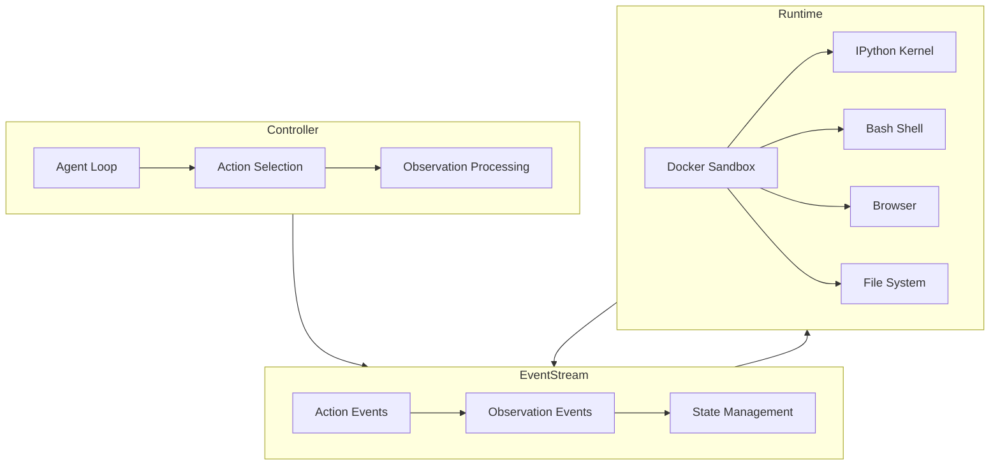

本記事は [OpenHands: An Open Platform for AI Software Developers as Generalist Agents](https://arxiv.org/abs/2408.13149) の解説記事です。

## 論文概要（Abstract）

OpenHandsは、LLMエージェントが実際の開発環境（Dockerサンドボックス、ブラウザ、ターミナル、ファイルシステム）を操作してソフトウェア開発タスクを遂行できるオープンソースプラットフォームである。著者らはCodeAct（コード実行でアクション空間を統一する手法）をデフォルトエージェントとして採用し、50以上のLLMに対応するモジュラーな設計を実現した。SWE-bench Verifiedで37.1%（Claude 3.5 Sonnet使用時）を記録し、Devin相当の自律開発を目指すOSSとして注目されている。

この記事は [Zenn記事: Claude Codeで本番プロジェクトにAI拡張開発を組み込む実践ワークフロー](https://zenn.dev/0h_n0/articles/6f90aa53dcc249) の深掘りです。

## 情報源

- **arXiv ID**: 2408.13149
- **URL**: [https://arxiv.org/abs/2408.13149](https://arxiv.org/abs/2408.13149)
- **著者**: Xingyao Wang, Boxuan Li, Yufan Song, Frank F. Xu, et al.（University of Illinois Urbana-Champaign他）
- **発表年**: 2024
- **分野**: cs.SE, cs.AI, cs.CL

## 背景と動機（Background & Motivation）

2024年以降、Devin（Cognition AI）をはじめとするフル自律型AIソフトウェア開発エージェントが注目を集めている。しかし、商用製品は内部アーキテクチャが非公開であり、研究コミュニティがエージェント設計の知見を蓄積・共有する基盤が不足していた。

著者らは、以下の3つの課題を解決するオープンプラットフォームの必要性を主張している。

1. **再現性**: 商用エージェントの性能主張を独立に検証できない
2. **拡張性**: 新しいLLMやエージェント設計を容易に統合・比較できない
3. **安全性**: エージェントが任意のコードを実行する際のサンドボックス環境が標準化されていない

OpenHandsはこれらの課題に対し、モジュラーなアーキテクチャとDockerベースの安全な実行環境を提供するOSSとして開発された。

## 主要な貢献（Key Contributions）

- **貢献1**: Controller + Runtime + EventStreamの3層アーキテクチャにより、エージェント設計とコード実行環境を分離し、50以上のLLMを差し替え可能なモジュラー設計を実現した
- **貢献2**: CodeActエージェント（Pythonコード実行でアクション空間を統一）をデフォルトとして採用し、SWE-bench Verifiedで37.1%を達成した
- **貢献3**: エージェントの微調整実験により、CodeActAgentで74%の性能改善を確認し、エージェント特化のファインチューニングの有効性を実証した

## 技術的詳細（Technical Details）

### 3層アーキテクチャ

OpenHandsのアーキテクチャは以下の3層で構成される。



**Controller層**: エージェントのメインループを管理する。LLMからのアクション選択と、実行結果（Observation）の処理を反復する。エージェントの種類（CodeActAgent、BrowsingAgent等）に応じて異なるプロンプト戦略を適用する。

**EventStream層**: Controller と Runtime の間の通信を仲介する。全てのアクションと観測をイベントとして記録し、エージェントの状態管理と履歴追跡を行う。この設計により、エージェントのリプレイやデバッグが容易になる。

**Runtime層**: Dockerコンテナ内でサンドボックス化された実行環境を提供する。IPythonカーネル、Bashシェル、ブラウザ（Playwright）、ファイルシステムへのアクセスを統合する。

### CodeActエージェント

OpenHandsのデフォルトエージェントであるCodeActは、全てのアクションをPythonコードの実行として統一する手法である（Wang et al., 2024; arXiv 2401.14196）。

従来のエージェント設計では、ツール呼び出しを自然言語の関数名+引数として定義していた（例: `search_file(pattern="def main", path="src/")`）。CodeActはこれをPythonコードの実行に統一する。

```python
# CodeActでのファイル検索の例
import subprocess
result = subprocess.run(
    ["grep", "-rn", "def main", "src/"],
    capture_output=True, text=True
)
print(result.stdout)
```

この設計には以下の利点がある。

- **柔軟性**: 任意のPythonコードを実行できるため、事前定義されたツールセットに制限されない
- **組み合わせ可能性**: 複数のアクションを1つのコードブロックで連鎖的に実行できる
- **デバッグ容易性**: 実行結果がPythonの標準出力として返されるため、中間状態の確認が容易

一方で、任意コード実行のリスクがあるため、Docker sandboxによる隔離が必須となる。

### Claude Codeとの設計比較

OpenHandsとClaude Codeは同じ「AIコーディングエージェント」カテゴリに属するが、設計哲学に興味深い違いがある。

| 設計要素 | OpenHands | Claude Code |
|---|---|---|
| **アクション空間** | CodeAct（Pythonコード統一） | 専用ツール（Read, Edit, Bash等） |
| **実行環境** | Dockerサンドボックス | ユーザーのローカル環境 |
| **安全性モデル** | コンテナ隔離 | パーミッション+Hooks |
| **コンテキスト管理** | EventStream記録 | Compaction+サブエージェント |
| **LLM選択** | 50+モデル対応 | Claudeモデル専用 |
| **主な用途** | 研究・ベンチマーク評価 | 本番開発ワークフロー |

Zenn記事で紹介されたClaude Codeの「Hooks」による品質ゲートは、OpenHandsのController層に相当する機能である。ただし、Claude Codeがユーザーのローカル環境で直接動作するのに対し、OpenHandsはDockerサンドボックスで隔離するという根本的な安全性モデルの違いがある。

## 実験結果（Results）

### SWE-bench評価

著者らは、OpenHandsのCodeActAgentを複数のLLMで評価した。以下は論文で報告された主要な結果である。

| LLM | SWE-bench Verified (%) | SWE-bench Full (%) |
|---|---|---|
| Claude 3.5 Sonnet | 37.1 | — |
| GPT-4o | 23.0 | 14.6 |
| Llama 3.1 405B | 15.4 | — |
| CodeActAgent（微調整版） | — | 微調整前比+74%改善 |

著者らは、モデルサイズとSWE-benchスコアの間に明確な相関があることを報告している。また、CodeActエージェントをSWE-benchタスクで微調整した実験では、74%の性能改善を確認し、エージェント特化のファインチューニングが有効であることを示した。

### エージェント行動の分析

著者らは、成功タスクと失敗タスクでのエージェント行動パターンを分析している。

- **成功パターン**: ファイル構造の探索→関連ファイルの特定→テスト実行による検証→段階的なパッチ生成
- **失敗パターン**: 広範なファイル読み込みによるコンテキスト消費、同じ修正の反復試行、テストなしでの早期終了

これらのパターンは、Zenn記事で紹介された「無限探索」「繰り返し修正」の失敗パターンと一致しており、Explore→Plan→Implement→Commitワークフローがこれらを防ぐための設計であることを裏付けている。

## 実装のポイント（Implementation）

OpenHandsを実際に使用する際の実践的なポイントを以下にまとめる。

**インストールと起動:**

```bash
# DockerイメージでのOpenHands起動
docker pull ghcr.io/all-hands-ai/openhands:latest
docker run -it --rm \
  -p 3000:3000 \
  -v /var/run/docker.sock:/var/run/docker.sock \
  -e LLM_MODEL=claude-3-5-sonnet-20241022 \
  -e LLM_API_KEY=$ANTHROPIC_API_KEY \
  ghcr.io/all-hands-ai/openhands:latest
```

**カスタムエージェントの実装:**

OpenHandsのモジュラー設計により、独自のエージェントを実装して組み込むことが可能である。Controller層のAgentインターフェースを実装すればよい。

```python
from openhands.controller.agent import Agent
from openhands.events.action import Action
from openhands.events.observation import Observation

class CustomAgent(Agent):
    def step(self, state) -> Action:
        # エージェントのアクション選択ロジック
        observations = state.get_observations()
        # ... LLMとの対話でアクションを決定 ...
        return action
```

**コスト管理:**

著者らの実験では、SWE-bench 1タスクあたりのコストは使用LLMとタスク複雑度に依存する。Claude 3.5 Sonnet使用時で約$2〜5/タスク、GPT-4o使用時で約$1〜3/タスクと推定される。大規模な評価では500タスク × $3 = $1,500程度の予算が必要となる。

## 実運用への応用（Practical Applications）

OpenHandsはClaude Codeの代替というよりも、AIコーディングエージェントの研究・評価基盤として位置づけられる。実運用では以下の観点で活用できる。

**エージェント設計のベンチマーク**: 自社のAIコーディングエージェントの性能をSWE-bench上で評価し、OpenHandsの結果と比較することで、設計改善の方向性を把握できる。

**サンドボックス実行のリファレンス実装**: OpenHandsのDockerサンドボックス設計は、AIエージェントに任意コード実行を許可する際の安全性モデルのリファレンスとして有用である。Claude CodeのHooksによるパーミッション管理とは異なるアプローチだが、いずれもエージェントの行動範囲を制限する設計思想を共有している。

**エージェント微調整の知見**: CodeActAgentの微調整で74%の改善が得られたという結果は、汎用LLMをコーディングタスクに特化させることの価値を示している。独自のコーディングエージェントを構築する際の参考になる。

## 関連研究（Related Work）

- **SWE-agent（2405.15793）**: Agent-Computer Interfaceの設計に焦点。OpenHandsはCodeActで全アクションをコード実行に統一するのに対し、SWE-agentは専用のシェルコマンドセットを設計した
- **Agentless（2407.21783）**: ツール不使用の2ステップアプローチ。OpenHandsの複雑なエージェントループとは対照的に、最小限のパイプラインで同等以上のコスト効率を達成
- **Devin（Cognition AI）**: 商用のフル自律開発エージェント。OpenHandsはDevinのOSSカウンターパートとして開発された

## まとめと今後の展望

OpenHandsは、AIコーディングエージェント研究に不可欠なオープン基盤を提供している。3層アーキテクチャによるモジュラー設計、CodeActによるアクション空間の統一、Dockerサンドボックスによる安全な実行環境の3つの柱は、Claude Codeのような商用エージェントの設計を理解するための重要な参照点となっている。

Claude Codeとの比較から見えてくるのは、「安全性モデル」と「ユーザー体験」のトレードオフである。Docker隔離は安全だが起動オーバーヘッドがあり、ローカル実行は即座に操作可能だがHooksによる制御が不可欠になる。今後は両者の長所を組み合わせたハイブリッドアプローチが研究されていくと予想される。

## 参考文献

- **arXiv**: [https://arxiv.org/abs/2408.13149](https://arxiv.org/abs/2408.13149)
- **Code**: [https://github.com/All-Hands-AI/OpenHands](https://github.com/All-Hands-AI/OpenHands)
- **Related Zenn article**: [https://zenn.dev/0h_n0/articles/6f90aa53dcc249](https://zenn.dev/0h_n0/articles/6f90aa53dcc249)
