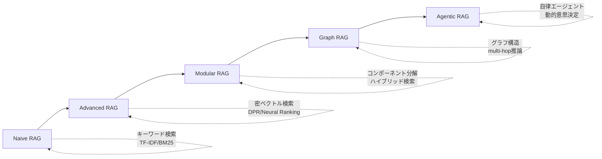
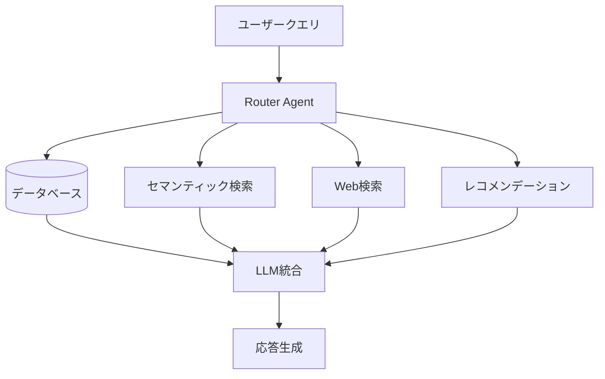
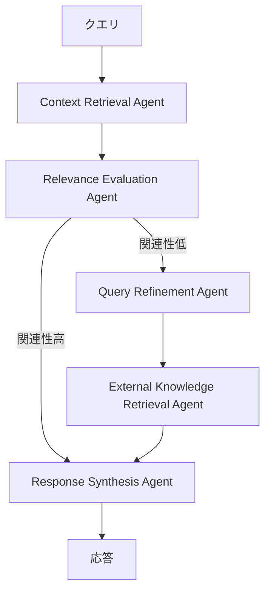

## 論文概要

本記事は [https://arxiv.org/abs/2501.09136](https://arxiv.org/abs/2501.09136) の解説記事です。

Agentic Retrieval-Augmented Generation（Agentic RAG）は、従来のRAGパイプラインに自律的なAIエージェントを組み込み、検索戦略の動的決定・反復的な文脈理解の改善・ワークフローの適応を実現するアーキテクチャである。本サーベイでは、Naive RAGからAdvanced RAG、Modular RAG、Graph RAGを経てAgentic RAGに至る進化を体系的に整理し、エージェントの数（cardinality）・制御構造・自律度・知識表現の4軸に基づく分類体系（taxonomy）を提案している。医療・金融・教育・エンタープライズ文書処理への応用事例と、システム設計者・実務者向けの実践的知見も整理されている。

この記事は [Zenn記事: AIエージェント時代のプロンプト設計パターン10選と構造化手法](https://zenn.dev/0h_n0/articles/f03c9688e5ccbf) の深掘りです。

## 情報源

- **arXiv ID**: 2501.09136
- **URL**: [https://arxiv.org/abs/2501.09136](https://arxiv.org/abs/2501.09136)
- **著者**: Aditi Singh, Abul Ehtesham, Saket Kumar, Tala Talaei Khoei, Athanasios V. Vasilakos
- **発表年**: 2025（初版: 2025年1月、v4: 2026年4月改訂）
- **分野**: cs.AI, cs.CL, cs.IR

## 背景と動機

大規模言語モデル（LLM）は自然言語理解と生成において高い能力を示す一方で、静的な訓練データに依存するため、動的かつリアルタイムなクエリへの応答には限界がある。従来のRAGは「検索してから生成する（Retrieve-then-Generate）」という固定的なパイプラインで情報の鮮度問題を部分的に解決したが、以下の課題が残されていた。

1. **文脈統合の困難**: 取得した複数の文書を整合的に統合できず、複雑なクエリに対して断片的な応答になりやすい
2. **多段推論の欠如**: 中間的な洞察に基づく反復的な検索精度の向上ができない
3. **スケーラビリティとレイテンシ**: 大規模データセットへのクエリで計算コストが増大し、リアルタイム性が損なわれる

Agentic RAGは、これらの制約に対して自律的なエージェントを検索パイプラインに組み込むことで、動的な意思決定・反復的な改善・柔軟なオーケストレーションを可能にするパラダイムシフトとして位置づけられている。

## 主要な貢献

本サーベイの貢献は以下の通りである。

- **体系的分類法の提案**: エージェント数・制御構造・自律度・知識表現の4軸でAgentic RAGアーキテクチャを分類する taxonomy を確立
- **RAG進化の整理**: Naive RAG → Advanced RAG → Modular RAG → Graph RAG → Agentic RAG という5段階の進化を体系的に記述
- **8種以上のアーキテクチャパターンの詳細分析**: Single-Agent Router、Multi-Agent、Hierarchical、Corrective RAG、Adaptive RAG、Graph-Based（Agent-G、GeAR）、Agentic Document Workflows（ADW）を網羅
- **実践的知見の蒸留**: システム設計者向けに7つの教訓を整理

## RAGパラダイムの進化

本サーベイでは、RAGの進化を5段階で整理している。

### Naive RAG

キーワードベースの検索（TF-IDF、BM25）と静的データセットを組み合わせた最も基本的な構成である。実装は容易だが、文脈的な理解が欠如し、小規模データセットを超えるスケーラビリティに課題がある。

### Advanced RAG

Dense Passage Retrieval（DPR）などの密ベクトル検索モデルやニューラルランキングアルゴリズム、multi-hop検索メカニズムを導入した段階である。ベクトルベースの意味的アラインメントにより精度が向上するが、計算コストが増大する。

### Modular RAG

パイプラインを独立した再利用可能なコンポーネントに分解するアプローチである。疎検索と密検索を組み合わせたハイブリッド検索戦略、APIを介したツール統合、ドメイン固有のカスタマイズを可能にするコンポーザブルなアーキテクチャが特徴である。

### Graph RAG

グラフベースのデータ構造を統合し、エンティティ間の関係や階層的な知識管理を通じてmulti-hop推論を強化する。ただし、スケーラビリティの制約と高品質な構造化データへの依存が課題として残る。

### Agentic RAG

動的な意思決定・反復的な改善・ワークフロー最適化が可能な自律エージェントを導入する段階である。静的なシステムから適応的なシステムへの根本的なパラダイムシフトを表す。

## 4つのエージェント設計パターン

Agentic RAGの基盤となるエージェント設計パターンとして、以下の4つが定義されている。

### Reflection（反省）

エージェントが自身の出力を反復的に評価し、自己フィードバックを通じて改善するパターンである。Self-Refine、Reflexion、CRITICといったフレームワークが代表例として挙げられている。正確性・スタイル・効率性の観点から出力を批評し、段階的な品質向上を実現する。

### Planning（計画）

複雑なタスクを小さなサブタスクに自律的に分解するパターンである。動的なシナリオにおけるmulti-hop推論に不可欠だが、決定論的なワークフローと比較して予測可能性が低くなる。

### Tool Use（ツール利用）

外部ツール、API、計算リソースとの相互作用によりエージェントの能力を拡張するパターンである。最新の実装では、先進的なモデルの関数呼び出し機能を活用して大規模なツールインベントリを管理している。

### Multi-Agent Collaboration（マルチエージェント協調）

専門化されたサブタスクを、タスク固有の役割を持つ複数のエージェントに分散させるパターンである。各エージェントが独自のメモリとワークフローを維持し、複雑なドメインにわたる協調的な問題解決を可能にする。

## 5つのワークフローパターン

著者らは、エージェント設計パターンを実装に落とし込む5つのワークフローパターンも整理している。

| ワークフロー | 特徴 | 適用場面 |
|:---|:---|:---|
| **Prompt Chaining** | タスクを逐次ステップに分解し、各ステップが前段の出力を基に構築 | 多言語コンテンツ生成、構造化文書作成 |
| **Routing** | 入力を分類し、専門化されたプロセスに振り分け | カスタマーサービス分類、コスト効率的なモデル選択 |
| **Parallelization** | 独立したタスクを並行処理（セクション分割）または複数出力で検証（投票） | 並列コンテンツモデレーション、マルチモデルコード検証 |
| **Orchestrator-Workers** | 中央のオーケストレーターがタスクを動的に分解し、専門ワーカーに割り当て | 入力複雑度が変動するタスク |
| **Evaluator-Optimizer** | 評価と改善のサイクルを反復し、出力を段階的に改善 | 翻訳の改善、多段研究クエリ |

## Agentic RAGアーキテクチャの分類

本サーベイの中核となる分類体系を以下に詳述する。

### 1. Single-Agent Router

集中型のエージェントが検索・ルーティング・情報統合を一元管理するアーキテクチャである。

**動作フロー**: (1) クエリをRouter Agentが評価 → (2) 適切な知識ソースを選択（データベース、セマンティック検索、Web検索等）→ (3) データを統合しLLMで合成 → (4) 引用付きの応答を生成

**利点**: 集中管理のシンプルさ、効率的なリソース利用、動的なルーティング、明確に定義されたタスクへの適合性

**適用例**: カスタマーサポートで、配送状況のクエリに対して注文データベース、配送業者API、天候データを組み合わせて応答を生成するケース

### 2. Multi-Agent RAG

責務を専門化されたエージェントに分散し、各エージェントが特定のデータソースやタスクに最適化されるアーキテクチャである。

**動作フロー**: (1) コーディネーターがクエリを受け取り、専門検索エージェントに委任 → (2) 複数エージェントが並列動作（SQLデータベース、セマンティック検索、Web検索等）→ (3) 集中型LLMが多様な検索結果を合成 → (4) 包括的な応答を生成

**利点**: モジュール性、並列処理によるスケーラビリティ、タスク特化による精度向上

**課題**: コーディネーションの複雑さ、計算オーバーヘッド、データ統合の困難さ

### 3. Hierarchical Agentic RAG

エージェントを多層構造に組織し、上位レベルのエージェントが下位レベルのエージェントを監督するアーキテクチャである。クエリの複雑さとソースの信頼性に基づく戦略的な優先順位付けを可能にする。

**動作フロー**: (1) トップ層のエージェントが複雑度を評価し、リソースを優先順位付け → (2) 中間層のエージェントが専門データを検索 → (3) 下位層のエージェントが補足検索を実施 → (4) トップ層のエージェントが結果を集約・統合

**適用例**: 金融投資分析で、信頼性の高い市場データベースを優先しつつ、政策分析も組み込む階層的な情報収集

### 4. Agentic Corrective RAG

検索結果を検証・改善するインテリジェントな補正メカニズムを組み込んだアーキテクチャである。著者らは5つの専門エージェントを定義している。

1. **Context Retrieval Agent**: ベクトルデータベースから初期文書を取得
2. **Relevance Evaluation Agent**: 文書のアラインメントを評価し、無関係なコンテンツにフラグを付与
3. **Query Refinement Agent**: 特異度を改善するためにクエリを書き換え
4. **External Knowledge Retrieval Agent**: 補足情報のためにWeb検索を実行
5. **Response Synthesis Agent**: 検証済みの情報を統合して一貫した応答を生成

**利点**: 反復的な補正による事実性の保証、動的な適応性、幻覚の最小化

### 5. Adaptive Agentic RAG

クエリの複雑度に基づいて検索戦略を動的に切り替えるアーキテクチャである。より小型の言語モデルがクエリの複雑度を分類し、適切な処理パスを選択する。

| クエリ複雑度 | 処理方式 | 例 |
|:---|:---|:---|
| **単純（Straightforward）** | 既存知識から直接生成（検索なし） | 事実に関する質問 |
| **中程度（Simple）** | 単一ステップの検索 | 中程度の複雑さのタスク |
| **複雑（Complex）** | 反復的改善を伴う多段検索 | 多層的な分析を要するクエリ |

**利点**: リソース効率の向上（単純なクエリで不要な検索をスキップ）、反復的改善による精度向上、柔軟な拡張性

**適用例**: カスタマーサポートで、請求状況の単純な確認は検索をバイパスし、配送遅延の複雑な問い合わせには追跡データ・天候情報・物流データを多段検索する

### 6. Graph-Based Agentic RAG

グラフ知識ベースと非構造化文書の検索を統合するアーキテクチャである。本サーベイでは2つの代表的なシステムが紹介されている。

**Agent-G**: モジュール化されたリトリーバーバンクとCriticモジュールにより、グラフデータと文書データの品質を検証しながら動的に検索する。医療診断（例: 2型糖尿病の症状と心臓病の関連をグラフ関係と医学文献から特定）などへの応用が報告されている。

**GeAR（Graph-Enhanced Agent for RAG）**: グラフ展開モジュールにより構造化データを検索に統合し、エージェントベースの自律的な検索判断でmulti-hop推論を実現する。

### 7. Agentic Document Workflows（ADW）

RAGをエンドツーエンドの知識ワーク自動化に拡張するアーキテクチャである。文書パーシング（フィールド抽出）→ 状態管理（処理段階の追跡）→ 知識検索 → エージェントオーケストレーション → アクション可能な出力という一連のワークフローを統合する。

**適用例**: 請求書の支払いワークフローで、文書を解析し、ベンダー契約を検索し、割引を計算し、予算影響分析付きの支払い推奨を生成する

## 従来RAGとAgentic RAGの比較

| 特徴 | Traditional RAG | Agentic RAG | ADW |
|:---|:---|:---|:---|
| **焦点** | 個別タスク | マルチエージェント協調 | 文書中心ワークフロー |
| **文脈維持** | 限定的 | メモリモジュール | 多段状態追跡 |
| **適応性** | 最小限 | 高い | 文書に特化 |
| **オーケストレーション** | なし | マルチエージェント | 統合処理 |
| **スケーラビリティ** | 小規模データセット | マルチエージェントシステム | エンタープライズワークフロー |
| **推論** | 基本的なQ&A | 多段推論 | 文書推論 |

## コンテキスト管理の課題と対策

Agentic RAGにおける主要な技術的課題として、著者らは以下を指摘している。

### コンテキスト爆発問題

反復的な検索により、コンテキストウィンドウに蓄積される情報が急速に膨大化する現象である。何を保持し何を破棄するかの判断が最も重要な設計上の意思決定となる。マルチエージェント構成では、エージェント間の情報共有によりこの問題がさらに悪化する。

### 対策アプローチ

1. **エージェント固有のコンテキストウィンドウ**: マルチエージェント構成で各エージェントが独立したコンテキストを持つことで、単一エージェントでのコンテキスト膨張を緩和
2. **反省メカニズム**: Self-RAGのように取得文書の関連性を自律的に判定し、不要な情報をフィルタリング
3. **クエリ改善**: Corrective RAGのように、検索結果の品質が低い場合にクエリ自体を書き換えて精度を向上
4. **複雑度ベースのルーティング**: Adaptive RAGのように、クエリの複雑度に応じて検索の深度を動的に調整し、不必要な反復を回避

## ベンチマーク比較

以下は、ユーザー提示情報および関連研究から横断的に報告されている代表的なベンチマーク結果である。個々の数値はそれぞれの原論文における評価条件に依存する点に注意が必要である。

| 手法 | HotpotQA | MultiHop-RAG |
|:---|:---|:---|
| 標準RAG | 42.3% | 38.7% |
| Self-RAG | 54.1% | 48.2% |
| CRAG | 56.8% | 51.4% |
| Adaptive RAG | 58.2% | 53.1% |

これらの数値から、エージェント型RAGが特にmulti-hop推論を要するタスクで標準RAGに対して大幅な改善を示していることが読み取れる。Adaptive RAGが最も高い精度を達成しており、クエリの複雑度に応じた動的な戦略切り替えの有効性を示唆している。

## 応用ドメイン

本サーベイでは、以下のドメインでのAgentic RAGの応用が整理されている。

- **カスタマーサポート**: TwitchのAmazon Bedrock実装では、広告主データ・キャンペーン履歴・デモグラフィクスを動的に検索し、広告提案を生成することで業務効率を大幅に改善したと報告されている
- **医療**: 臨床ガイドライン・医学文献・患者履歴を同時に検索し、診断・治療に関する意思決定を支援
- **金融**: リアルタイム市場データと政策分析・専門家コンサルテーションを組み合わせた投資分析
- **法務・契約分析**: 複雑な文書の処理、先例検索、ドメイン固有ルールの適用
- **教育**: 学生のニーズに適応し、カリキュラムリソースの検索と知識ギャップの特定を行うパーソナライズド学習

## 課題と今後の展望

### 現在の制限事項

1. **レイテンシの増大**: 反復的な検索とエージェント間の通信により、応答時間が増加する。リアルタイムアプリケーションでのトレードオフ設計が重要となる
2. **検索ループの終了条件設計**: エージェントがいつ「十分な情報を得た」と判断すべきかの基準設計が困難である。過度な反復はコスト増、不十分な反復は品質低下を招く
3. **幻覚の軽減と完全排除の困難**: エージェント型アプローチにより幻覚は減少するが、完全な排除は依然として達成されていない
4. **評価手法の未成熟**: 出力品質だけでなく、推論プロセスの透明性や意思決定パスを含むプロセスレベルの評価が必要だが、十分に発展していない

### 今後の研究方向

著者らは以下の方向性を示している。

- **エージェント協調の改善**: マルチエージェントシステムにおける創発的な振る舞いの管理と複雑な相互作用の制御
- **メモリ管理**: 対話をまたいだ長期的な適応と知識保持の改善
- **計算効率**: リソース制約のある環境での最適化
- **安全性とガバナンス**: 高リスクドメインにおける自律エージェントの信頼性確保、悪用防止、透明性の維持
- **ドメイン汎化**: パフォーマンスを維持しながらドメイン間でAgentic RAGシステムを転用するためのアーキテクチャ革新

## 7つの実践的教訓

著者らはシステム設計者向けに以下の教訓を蒸留している。

1. **Agentic RAGは万能ではない**: すべてのタスクにエージェントの複雑さが必要なわけではなく、単純なクエリにはシンプルなシステムで十分な場合が多い
2. **アーキテクチャ選択が振る舞いを決定する**: 設計上の選択がシステム性能に根本的な影響を与えるため、ユースケースとの慎重なアラインメントが必要
3. **検索品質が依然として最重要**: エージェントの洗練度にかかわらず、検索精度がパフォーマンスのボトルネックであり続ける
4. **エージェントの自律性には制約が必要**: 明示的な運用上の境界がないと、制御不能な振る舞いが生じうる
5. **評価は結果だけでなくプロセスも**: 推論の透明性や意思決定パスの検証が出力品質と同様に重要
6. **ドメイン知識が効果を増幅する**: ドメイン固有のルールやガイドラインを組み込んだシステムはパフォーマンスが大幅に向上する
7. **責任あるデプロイにはガバナンスが必要**: 倫理的配慮、透明性、安全性メカニズムが本番システムに不可欠

## 関連研究

- **ReAct（Yao et al., 2022）**: Thought → Action → Observationサイクルで推論と行動を統合するフレームワーク。Agentic RAGの基盤となる設計パターンの一つ
- **Self-RAG（Asai et al., 2023）**: 反省トークンを用いて検索の必要性・取得文書の関連性・回答の根拠性を自律的に判定するアプローチ
- **CRAG（Yan et al., 2024）**: 検索結果の品質を軽量評価器で判定し、品質が低い場合にWeb検索にフォールバックする補正型RAG
- **Adaptive RAG（Jeong et al., 2024）**: クエリの複雑度に応じて no retrieval / single-step / multi-step を動的に切り替える手法
- **PlanRAG**: 複雑なクエリを計画的に分解してから段階的に検索するアプローチ
- **Graph RAG（Microsoft, 2024）**: グラフ構造を活用したコミュニティサマリによる質問応答

## まとめ

本サーベイは、RAGの進化を5段階で整理し、Agentic RAGを8種以上のアーキテクチャパターンとして体系的に分類した包括的な文献である。特に、エージェント数・制御構造・自律度・知識表現の4軸による分類体系は、実務者がシステム設計を行う際の判断フレームワークとして有用である。

実務的な示唆として、すべてのクエリにAgentic RAGが必要なわけではなく、クエリの複雑度に応じて適切なアーキテクチャを選択すること（Adaptive RAGの考え方）が最もコスト効率が高いと考えられる。また、検索品質が最終的なパフォーマンスのボトルネックであり続けるという指摘は、エージェントの高度化だけでなく、基盤となる検索システムの改善が不可欠であることを示唆している。

## 参考文献

- **arXiv**: [https://arxiv.org/abs/2501.09136](https://arxiv.org/abs/2501.09136)
- **Related Zenn article**: [https://zenn.dev/0h_n0/articles/f03c9688e5ccbf](https://zenn.dev/0h_n0/articles/f03c9688e5ccbf)
