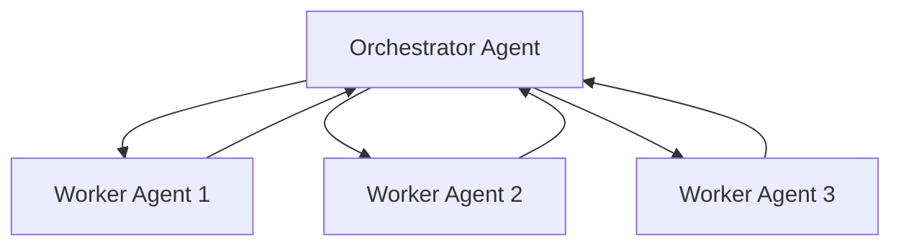
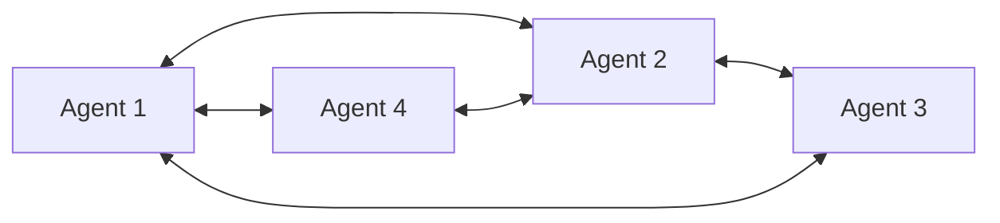
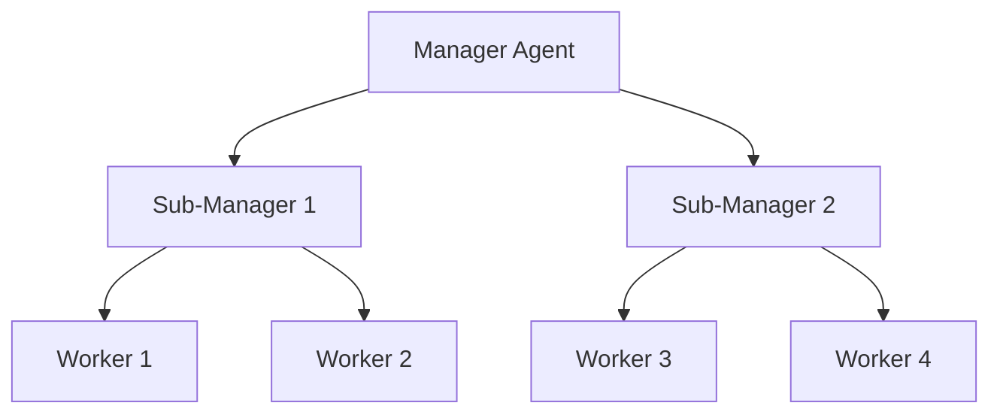

本記事は [A Survey on LLM-based Multi-Agent Systems: Recent Advances and New Frontiers](https://arxiv.org/abs/2505.05635) の解説記事です。

## 論文概要（Abstract）

本サーベイは、LLM（大規模言語モデル）を基盤としたマルチエージェントシステム（LLM-MAS）に関する200本以上の論文を体系的に整理し、「アーキテクチャ」「コミュニケーション」「記憶」「計画」「ツール使用」「評価」の6軸で分類した包括的レビューである。著者らは、LLM-MASの定義を明確にしたうえで、複雑タスクの解決・シナリオシミュレーション・生成エージェント評価という3つの応用領域を概観し、今後の研究方向を提示している。

この記事は [Zenn記事: AIエージェント時代のプロンプト設計パターン10選と構造化手法](https://zenn.dev/0h_n0/articles/f03c9688e5ccbf) の深掘りです。

## 情報源

- **arXiv ID**: 2505.05635
- **URL**: [https://arxiv.org/abs/2505.05635](https://arxiv.org/abs/2505.05635)
- **著者**: Shuaihang Chen, Yuanxing Liu, Wei Han, Weinan Zhang, Ting Liu
- **発表年**: 2025
- **分野**: cs.AI, cs.CL, cs.MA

## 背景と動機（Background & Motivation）

2023年以降、GPT-4やClaude 3などの大規模言語モデルの急速な進化に伴い、単一のLLMエージェントでは対処困難な複雑タスクに対して、複数のLLMエージェントが協調して問題を解決する「マルチエージェントシステム」への関心が急速に高まっている。

著者らは、LLM-MASに関する研究が爆発的に増加する一方で、既存のレビュー論文ではその全体像を十分にカバーできていないと指摘している。特に以下の3点が整理されていなかった。

1. **アーキテクチャパターンの体系化**: 中央集権型・分散型・階層型といったオーケストレーション構造の比較が不十分
2. **エージェント間通信の設計原則**: メッセージフォーマットやプロトコルの標準化が未整備
3. **評価手法の未確立**: マルチエージェントシステム全体の性能を測定するベンチマークが断片的

これらの課題に対し、著者らは200本以上の論文を6つの軸で分類する統一的なフレームワークを提案し、研究者・実務者の双方に向けた見取り図を提供している。

## 主要な貢献（Key Contributions）

- **貢献1**: LLM-MASを6つの軸（アーキテクチャ・コミュニケーション・記憶・計画・ツール使用・評価）で分類する包括的な分類体系（Taxonomy）を提案
- **貢献2**: 200本以上の論文を体系的にカバーし、複雑タスク解決・シナリオシミュレーション・生成エージェント評価の3つの応用領域にマッピング
- **貢献3**: AutoGen、MetaGPT、LangGraph、CrewAI、AgentVerseなどの主要フレームワークを横断的に比較
- **貢献4**: エージェント数増加に伴うスケーラビリティ課題やエラー伝播問題など、未解決の研究課題を整理し、今後の方向性を提示

## 技術的詳細（Technical Details）

### 軸1: アーキテクチャ（Architecture）

LLM-MASのアーキテクチャは、エージェント間の制御関係によって3つのパターンに分類される。

**中央集権型（Centralized）** は、1つのオーケストレーターエージェントが全体のタスク分配と結果統合を担当する。MetaGPTが代表例であり、SOP（Standard Operating Procedure）に従ってプロダクトマネージャー、エンジニア、テスターといった役割をエージェントに割り当てる。利点はタスクフローの予測可能性が高い点であるが、オーケストレーターがボトルネックとなりやすく、エージェント数が増加するとスケーラビリティに制約が生じる。

**分散型（Decentralized / P2P）** は、各エージェントが自律的に協調し、明示的な中央制御を持たない。AgentVerseが代表例であり、エージェントの動的なチーム構成と役割の自己割り当てを実現する。柔軟性は高いが、エージェントの動作予測が困難になり、デバッグコストが増大する課題がある。

**階層型（Hierarchical）** は、中間管理エージェントを介した多層構造を採用する。CrewAIが代表例であり、マネージャーエージェントがサブチームを管理し、サブチーム内のエージェントが具体的タスクを実行する。中央集権型と分散型の利点を組み合わせたアプローチであり、大規模システムでのスケーラビリティが比較的高い。

### 軸2: コミュニケーション（Communication）

エージェント間の通信は、LLM-MASの協調品質を決定する重要な設計要素である。著者らは、メッセージを構造化フォーマット（JSON / Markdown）で交換することが、エージェント間の誤解を減らし協調精度を向上させると報告している。

非構造化な自然言語メッセージでは、LLMの解釈のばらつきによりタスクの意図が失われるリスクがある。一方、構造化メッセージでは `action`、`target`、`parameters` などのフィールドを明示することで、受信エージェントが一意に解釈できる。例として以下のようなJSON形式が挙げられる。

```json
{
  "sender": "planner_agent",
  "receiver": "coder_agent",
  "action": "implement",
  "target": "data_pipeline",
  "parameters": {
    "language": "python",
    "requirements": ["retry logic", "error handling"]
  },
  "priority": "high"
}
```

また、通信トポロジとして、全対全通信（All-to-All）、チェーン型（Sequential）、ブロードキャスト型（Broadcast）の3パターンが整理されている。全対全通信はエージェント数 $n$ に対して通信コストが $O(n^2)$ となるため、大規模システムでは通信トポロジの選択が性能に直結する。

### 軸3: 記憶（Memory）

LLM-MASにおける記憶は、個別エージェントのローカルメモリとエージェント間で共有されるグローバルメモリに大別される。

**ローカルメモリ** は、各エージェントの会話履歴やタスク実行ログを保持する。LLMのコンテキストウィンドウに直接格納する短期メモリと、ベクトルDBに永続化する長期メモリがある。

**共有メモリ（グローバルメモリ）** は、エージェント間で知識を共有するための仕組みである。著者らは、共有メモリの導入がコンテキスト爆発（context explosion）を回避する有効な手段であると指摘している。具体的には、各エージェントが全てのメッセージ履歴を保持するのではなく、共有ベクトルDB + 構造化ログに情報を集約し、必要な情報のみをRetrieval（検索）する設計が推奨される。

コンテキストウィンドウの制約 $L_{\text{max}}$ に対し、$n$ エージェントが $t$ ターン会話すると、全対全通信では各エージェントが保持すべきコンテキスト長は $O(n \times t)$ に膨張する。共有メモリを導入することで、各エージェントのコンテキスト長を $O(k)$（$k$: 検索上位 $k$ 件）に抑制できる。

### 軸4: 計画（Planning）

タスク分解と動的再計画は、LLM-MASが複雑な問題を解決するための核心的な能力である。

著者らは計画を以下の2段階に分類している。

1. **静的計画（Static Planning）**: タスク開始時に全体の実行計画を生成し、各エージェントにサブタスクを割り当てる。MetaGPTのSOP駆動型がこれに該当する
2. **動的再計画（Dynamic Re-planning）**: タスク実行中にエージェントからのフィードバックに基づいて計画を修正する。LangGraphのチェックポイント機構やAutoGen v0.4のActor Modelがこの機能を提供する

動的再計画では、エージェントの実行結果が期待と異なる場合に、オーケストレーターが計画を再生成する。この仕組みにより、予期せぬエラーや環境変化への適応力が向上する一方、再計画のオーバーヘッドが加算されるトレードオフがある。

### 軸5: ツール使用（Tool Use）

LLM-MASにおけるツール使用は、エージェントの能力を外部リソースで拡張する仕組みである。

著者らは、各エージェントに専門化されたツールセットを割り当てることが、マルチエージェントシステムの設計原則として重要であると述べている。例えば、コード実行エージェントにはサンドボックス環境を、情報検索エージェントにはWeb検索APIを、データ分析エージェントにはSQL実行環境を割り当てる。

ツール割り当ての設計パターンとして、以下の2つが挙げられる。

- **静的割り当て**: エージェント定義時にツールセットを固定する。予測可能性が高いが柔軟性に欠ける
- **動的割り当て**: タスクに応じてエージェントが利用可能なツールを実行時に選択する。柔軟性は高いがツール選択の誤りリスクがある

著者らは、ツール使用の成功率がプロンプト設計に強く依存することを指摘しており、ツールのスキーマ定義と使用例をsystem promptに含めることが推奨されている。

### 軸6: 評価（Evaluation）

LLM-MASの評価は、本サーベイが指摘する最大の未解決課題の1つである。

既存の評価手法は、個別タスクの成功率やベンチマークスコアに依存しており、マルチエージェントシステム全体の協調品質やコミュニケーション効率を測定する標準的な指標が確立されていない。著者らは以下の評価次元を提案している。

| 評価次元 | 説明 | 既存指標の例 |
|----------|------|-------------|
| タスク達成度 | 最終出力の正確性・完全性 | SWE-bench, HumanEval |
| 協調効率 | エージェント間の通信回数・冗長性 | メッセージ数、トークン消費量 |
| コスト効率 | API呼び出し回数・トークン消費量 | $/タスク |
| ロバスト性 | エラー発生時の回復能力 | 標準化指標なし |
| スケーラビリティ | エージェント数増加時の性能劣化 | 標準化指標なし |

特に「協調効率」と「スケーラビリティ」については標準化されたベンチマークが存在せず、今後の研究で確立が求められる領域であると著者らは述べている。

## フレームワーク比較

著者らは、代表的なLLM-MASフレームワークを以下のように比較している。

| フレームワーク | 開発元 | オーケストレーション | 特徴 | ユースケース |
|---|---|---|---|---|
| AutoGen (v0.4) | Microsoft | Actor Model | マルチエージェント会話、HITL（Human-in-the-Loop）対応、非同期実行 | 汎用タスク自動化 |
| MetaGPT | DeepWisdom | 中央集権型（SOP駆動） | ロール分離、標準作業手順に基づくワークフロー | ソフトウェア開発 |
| LangGraph | LangChain | グラフベース | ステートフル実行、チェックポイント、条件分岐 | 複雑なワークフロー |
| CrewAI | CrewAI | 階層型 | ロールプレイ型エージェント、マネージャー層 | チーム協調タスク |
| AgentVerse | - | 分散型 | 動的チーム構成、エージェントの自己組織化 | 研究・実験向け |

各フレームワークはオーケストレーションパターンが異なり、ユースケースに応じた選択が求められる。著者らは、単一のフレームワークがすべてのユースケースを最適にカバーするわけではないと述べている。

## オーケストレーションパターン

本サーベイで整理された3つのオーケストレーションパターンの構造を示す。

### 中央集権型（Centralized）



オーケストレーターが全エージェントにタスクを分配し、結果を統合する。タスクフローが予測可能である一方、オーケストレーターがSingle Point of Failureとなる。

### 分散型（Decentralized / P2P）



エージェント間が直接通信し、中央制御なしに協調する。柔軟性が高いが、通信コストが $O(n^2)$ となり、動作の予測が困難である。

### 階層型（Hierarchical）



中間管理エージェントを介した多層構造であり、大規模システムでのスケーラビリティと制御可能性のバランスを実現する。

## プロンプト設計に関する知見

本サーベイから抽出されるプロンプト設計の実践的知見は、関連するZenn記事「AIエージェント時代のプロンプト設計パターン10選と構造化手法」の内容と密接に関連する。

### 1. ロールプロンプトによるエージェント専門化

著者らは、system promptでエージェントの役割を明確に定義する「ロールプロンプト」がエージェント専門化に不可欠であると報告している。MetaGPTでは、プロダクトマネージャー、アーキテクト、エンジニア、QAエンジニアの各ロールをsystem promptで定義し、それぞれが専門領域のタスクのみを担当する設計を採用している。

```
あなたはシニアPythonエンジニアです。
以下の制約に従ってコードを生成してください：
- 型ヒントを必ず付与する
- テストコードを同時に生成する
- セキュリティ上の懸念がある場合は明示的に警告する
あなたの出力は coder_output フィールドにJSON形式で返してください。
```

### 2. 構造化メッセージによる協調精度向上

エージェント間のメッセージをJSON/Markdownで構造化することにより、LLMの解釈のばらつきを抑制し、タスクの意図を正確に伝達できる。これはZenn記事で述べられている「出力フォーマット指定パターン」に対応する設計原則である。

### 3. 終了条件の明示によるループ防止

マルチエージェントシステムにおいて、エージェント間の会話が無限ループに陥るリスクがある。著者らは、以下の3つの終了条件をプロンプトに明示することを推奨している。

- **最大ターン数**: 会話が指定回数に達したら強制終了
- **達成条件**: 特定の出力パターン（例: `TASK_COMPLETE`）が生成されたら終了
- **品質閾値**: 評価エージェントが出力品質を判定し、基準を満たしたら終了

### 4. 共有メモリによるコンテキスト管理

プロンプトに全ての会話履歴を含めるとコンテキストウィンドウを圧迫し、性能劣化を引き起こす。著者らは、共有ベクトルDBからの関連情報検索（RAG）によりプロンプトを構成し、各エージェントのコンテキスト長を制御する設計を推奨している。

## 実運用への応用

本サーベイの知見は、以下のような実運用シナリオに直接適用可能である。

**ソフトウェア開発自動化**: MetaGPT型の中央集権アーキテクチャにより、要件定義→設計→実装→テストのパイプラインを複数エージェントで分担できる。著者らは、SOP駆動のアプローチがタスクの再現性と品質管理に有効であると報告している。

**カスタマーサポート**: 階層型アーキテクチャにより、一次対応エージェント→専門エージェント→エスカレーションの多層構造を構築できる。構造化メッセージにより、エージェント間の引き継ぎ精度を向上させられる。

**データ分析パイプライン**: LangGraph型のグラフベースオーケストレーションにより、データ取得→前処理→分析→可視化の各ステップを条件分岐付きで実行できる。チェックポイント機構により、障害発生時の部分再実行が可能である。

**注意点**: 著者らはエージェント数の増加に伴い通信コストが $O(n^2)$ でスケールする問題を指摘しており、実運用ではエージェント数を必要最小限に抑え、階層型アーキテクチャで通信経路を制限する設計が推奨される。

## 課題と今後の展望

著者らは以下の未解決課題を指摘している。

### スケーラビリティ

エージェント数が増加すると、エージェント間の通信コストが $O(n^2)$ で増大する。10エージェントでは最大45通信経路、100エージェントでは4,950経路となり、LLMのAPI呼び出しコストとレイテンシが実用的な制約となる。階層型アーキテクチャや通信トポロジの最適化が今後の研究課題である。

### エラー伝播

上流エージェントの誤りが下流エージェントに増幅される「エラー伝播」問題は、マルチエージェントシステム固有のリスクである。例えば、計画エージェントが誤ったサブタスク分解を行うと、全ての実行エージェントが誤った方向に作業を進める。著者らは、エージェント間の出力を検証する「バリデーションエージェント」の導入や、各ステップでのチェックポイント検証を提案している。

### 評価の標準化

マルチエージェントシステム全体の協調品質を測定する標準ベンチマークが欠如している。単一エージェントの評価指標（HumanEval、SWE-benchなど）をそのまま適用することはできず、通信効率、コスト効率、エラー回復能力を含む多次元の評価フレームワークの確立が求められている。

### 安全性とアライメント

複数のLLMエージェントが協調する場合、個々のエージェントがアライメント基準を満たしていても、システム全体としてのアライメントが保証されるわけではない。エージェント間のやり取りにおける有害出力の検出と抑制が今後の課題である。

## 関連研究

- **Generative Agents** (Park et al., 2023): 25体のLLMエージェントが仮想町で自律的に生活するシミュレーション。本サーベイでは分散型アーキテクチャの代表例として位置づけられている
- **CAMEL** (Li et al., 2023): ロールプレイ型の2エージェント会話フレームワーク。構造化されたロールプロンプトによるエージェント専門化の先駆的研究
- **ChatDev** (Qian et al., 2023): ソフトウェア開発プロセスをマルチエージェント会話で自動化。MetaGPTと並ぶ中央集権型アーキテクチャの代表例
- **AutoGen** (Wu et al., 2023): マルチエージェント会話フレームワーク。v0.4でActor Modelを採用し、非同期実行と柔軟なトポロジを実現

## まとめと今後の展望

本サーベイは、LLM-MASの研究を6つの軸で体系的に整理し、研究者と実務者の双方に向けた見取り図を提供している。特にアーキテクチャパターンの選択（中央集権/分散/階層）とプロンプト設計（ロール定義・構造化メッセージ・終了条件）が、マルチエージェントシステムの成否を左右する重要な設計判断であることが明らかにされた。

今後の研究方向として、スケーラビリティ向上のための通信トポロジ最適化、エラー伝播を抑制するバリデーション機構、そして標準的な評価フレームワークの確立が求められている。実務面では、ユースケースに応じたフレームワーク選択と、プロンプト設計パターンの体系的な適用が、LLM-MASの実用化を加速する鍵となる。

## 参考文献

- **arXiv**: [https://arxiv.org/abs/2505.05635](https://arxiv.org/abs/2505.05635)
- **Related Zenn article**: [https://zenn.dev/0h_n0/articles/f03c9688e5ccbf](https://zenn.dev/0h_n0/articles/f03c9688e5ccbf)
- Park, J. S., et al. (2023). "Generative Agents: Interactive Simulacra of Human Behavior." arXiv:2304.03442
- Li, G., et al. (2023). "CAMEL: Communicative Agents for 'Mind' Exploration of Large Language Model Society." arXiv:2303.17760
- Qian, C., et al. (2023). "ChatDev: Communicative Agents for Software Development." arXiv:2307.07924
- Wu, Q., et al. (2023). "AutoGen: Enabling Next-Gen LLM Applications via Multi-Agent Conversation." arXiv:2308.08155
- Hong, S., et al. (2023). "MetaGPT: Meta Programming for Multi-Agent Collaborative Framework." arXiv:2308.00352
