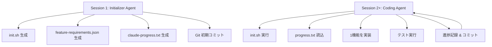

本記事は [Effective Harnesses for Long-Running Agents](https://www.anthropic.com/engineering/effective-harnesses-for-long-running-agents)（Anthropic Engineering Blog、2025年11月26日公開、著者: Justin Young）の解説記事です。

## ブログ概要（Summary）

長時間稼働するAIエージェントが複数のコンテキストウィンドウにまたがって進捗を維持する際の根本的な課題 — 「各新セッションが前回の記憶なしに開始される」問題 — に対し、Anthropicは**Initializer Agent + Coding Agent**の二層ハーネス構造を提案している。この設計により、エージェントは環境初期化、進捗追跡、インクリメンタルな開発という3つの関心事を分離し、長期プロジェクトを着実に前進させることが可能になる。

この記事は [Zenn記事: Claude Codeで本番プロジェクトにAI拡張開発を組み込む実践ワークフロー](https://zenn.dev/0h_n0/articles/6f90aa53dcc249) の深掘りです。

## 情報源

- **種別**: 企業テックブログ
- **URL**: [https://www.anthropic.com/engineering/effective-harnesses-for-long-running-agents](https://www.anthropic.com/engineering/effective-harnesses-for-long-running-agents)
- **組織**: Anthropic Engineering
- **発表日**: 2025年11月26日

## 技術的背景（Technical Background）

AIエージェントがソフトウェア開発タスクに従事する際、コンテキストウィンドウの制約が避けられない壁となる。著者のJustin Youngは、この問題を「エンジニアリングのシフト交代」に例えている。各セッションは前任者の作業内容を知らない新しいエンジニアが到着するようなもので、引き継ぎなしでは進捗が失われる。

Claude Codeの実践ワークフロー（Explore→Plan→Implement→Commit）でも同様の課題が存在する。1回のセッションで完結しない大規模タスクでは、セッション間の継続性をどう確保するかが開発効率を左右する。Zenn記事で紹介されたコンテキストウィンドウ管理の重要性は、このブログ記事が技術的な裏付けを提供している。

本ブログでは、Anthropicが内部で開発・検証した「ハーネス」パターンを、ウェブアプリケーション開発プロジェクト（チャットアプリ）を題材に解説している。

## 実装アーキテクチャ（Architecture）

### 二層エージェント構造

著者らが提案するハーネスは、目的の異なる2つのエージェントで構成される。



**Initializer Agent（初回セッション）:**

最初のセッションでは、後続セッションが参照できる環境とアーティファクトを整備する。具体的には以下を生成する。

- `init.sh`: 開発環境のセットアップスクリプト（依存パッケージのインストール、開発サーバーの起動等）
- `feature-requirements.json`: 実装すべき機能の構造化リスト
- `claude-progress.txt`: エージェントの作業履歴ファイル
- 初期Gitコミット

**Coding Agent（2回目以降のセッション）:**

後続セッションでは、Initializer Agentが残した環境を読み込み、インクリメンタルに開発を進める。

### Feature Requirementsの構造化

著者らが特に重視しているのが、機能要件のJSON構造化である。ブログでは以下のような形式が紹介されている。

```json
{
    "category": "functional",
    "description": "New chat button creates a fresh conversation",
    "steps": [
      "Navigate to main interface",
      "Click the 'New Chat' button",
      "Verify a new conversation is created",
      "Check that chat area shows welcome state",
      "Verify conversation appears in sidebar"
    ],
    "passes": false
}
```

著者らは、JSONを採用した理由として「モデルがMarkdownファイルよりもJSONファイルを不適切に変更・上書きする可能性が低い」と述べている。また、プロンプト指示として「テストを削除・編集することは許容されない」と明記することで、エージェントが合格基準を緩和して「完了」と誤報告することを防いでいる。

### セッション開始時の標準ワークフロー

各Coding Agentセッションは以下の手順で開始される。

1. `pwd`で作業ディレクトリを確認
2. Gitログと`claude-progress.txt`を読み込み、前回の作業内容を把握
3. `feature-requirements.json`から最優先の未完了機能を選択
4. `init.sh`を実行して開発サーバーを起動
5. 基本的なE2Eテストでアプリケーションの動作を確認
6. 選択した1機能の実装を開始

この標準化されたワークフローにより、セッション間のコンテキスト断絶問題を体系的に解決している。

## パフォーマンス最適化（Performance）

### 観察された失敗パターンと対策

著者らは、明示的なプロンプト指示がない場合にClaudeが示す典型的な行動パターンと、ハーネスによる対策を整理している。

| 失敗パターン | 症状 | Initializer Agentでの対策 | Coding Agentでの対策 |
|---|---|---|---|
| 早期完了宣言 | 全機能を一度に実装しようとし、不完全なまま「完了」と報告 | 構造化された機能リストを作成 | 1セッション=1機能に制限 |
| 環境劣化の未記録 | 変更が積み重なり環境が壊れるが記録されない | Gitリポジトリと進捗ノートを初期化 | セッション開始時にファイルを読み込み、ベースラインテストを実行 |
| 未検証の完了マーク | E2Eテストなしで機能を「完了」とマーク | 機能リストにステップバイステップの検証手順を記載 | 自己検証を実施し、テスト通過後のみ完了マーク |
| 開発環境の複雑さ | 環境セットアップに失敗し本来のタスクに着手できない | `init.sh`を作成 | セッション開始時に`init.sh`を実行 |

これらのパターンは、Zenn記事で紹介された「キッチンシンク・セッション」「繰り返し修正」「過剰なCLAUDE.md」「信頼の後の検証ギャップ」といった失敗パターンと直接対応している。ハーネスはこれらの問題に対する構造的な解決策を提供する。

### テスト戦略

ブログでは、Puppeteer MCPを用いたブラウザ自動化テストが検証手段として使用されたと報告されている。エージェントは「人間ユーザーと同様にend-to-endで機能を検証する」よう指示される。ただし、著者らはブラウザネイティブのアラートモーダルをPuppeteer MCPで検出できないという制約も率直に報告している。

これはZenn記事で強調された「検証手段を含めることが重要」という原則の実践例であり、Stopフックによる最終品質ゲートと同等の役割を果たしている。

## 運用での学び（Production Lessons）

### インクリメンタル開発の重要性

著者らの最も重要な知見は、**エージェントに「全体を一度に作る」のではなく「1機能ずつ着実に進める」よう指示する**ことである。明示的な指示がなければ、エージェントは包括的な実装を試み、コンテキストの枯渇により中途半端な状態で終了する。

これはClaude Codeの4段階ワークフロー（Explore→Plan→Implement→Commit）の設計思想と一致する。計画段階でスコープを絞り、1回の実装サイクルで完結可能な粒度にタスクを分割することが、エージェント型開発の成功に不可欠である。

### アーティファクトベースの引き継ぎ

セッション間の引き継ぎは、LLMの内部状態ではなく**ファイルシステム上のアーティファクト**を介して行われる。`claude-progress.txt`、`feature-requirements.json`、Gitコミット履歴が「引き継ぎドキュメント」として機能する。

この設計は、Claude Codeの`/compact`コマンド（コンテキスト要約）やCLAUDE.mdファイルの役割と補完的である。CLAUDE.mdがプロジェクト全体の静的な知識を提供するのに対し、ハーネスのアーティファクトは動的な作業進捗を伝達する。

### 変更のリバートと障害回復

著者らはエージェントにGitコミットを細かく行わせることで、失敗した変更のリバートを容易にしている。各セッションの終了時にはコミットメッセージに作業内容を記述させ、次のセッションが`git log`から前回の作業を把握できるようにしている。

```bash
# Coding Agentの典型的なセッション終了処理
git add -A
git commit -m "feat: implement new chat button - passes 3/5 verification steps
- Navigation to main interface: PASS
- Click New Chat button: PASS
- New conversation created: PASS
- Welcome state display: PENDING
- Sidebar appearance: PENDING"
```

このアプローチにより、あるセッションで導入されたバグが次のセッションで発見された場合も、Gitの差分から問題箇所を特定しやすくなる。

### 進捗ファイルの設計

`claude-progress.txt`は自然言語で記述される進捗レポートであり、以下の情報を含む。

```text
## Session 3 Summary (2025-11-20)
- Implemented: New Chat button, conversation sidebar
- Tested: 5/12 features passing
- Blocked: File upload feature (needs Puppeteer file dialog support)
- Next priority: Welcome state display, message persistence
- Known issues: CSS flickering on sidebar transition
```

この設計により、エージェントは前回のセッションの結果を構造化された形で受け取り、優先度判断と作業計画の立案をスムーズに行える。

### 今後の研究方向

著者らは以下のオープンクエスチョンを提起している。

- 汎用エージェント1つ vs. 専門化された複数エージェント（テスト専門、品質保証専門等）のどちらが効果的か
- ウェブ開発以外の領域（科学研究、金融モデリング等）への適用可能性
- テスト・品質保証・コードクリーンアップに特化したエージェントの有効性

## Zenn記事のワークフローとの対応関係

本ブログの知見はZenn記事で紹介された各コンポーネントと以下のように対応している。

| Zenn記事のコンポーネント | 本ブログの対応概念 | 関係性 |
|---|---|---|
| CLAUDE.md | Feature Requirements JSON | プロジェクト知識の永続化手段。CLAUDE.mdは静的ルール、JSONは動的要件 |
| Hooks（PreToolUse/PostToolUse） | ハーネスの検証ステップ | 品質ゲートの実装手段。Hooksはツール実行レベル、ハーネスはセッションレベル |
| サブエージェント | Initializer/Coding Agent分離 | 関心事の分離。サブエージェントはタスクレベル、ハーネスはライフサイクルレベル |
| Stopフック | セッション終了時のコミット・進捗記録 | 完了条件の強制。Stopフックは1ターン内、ハーネスはセッション跨ぎ |
| `/clear`によるリセット | 新セッション開始（進捗ファイル引き継ぎ） | コンテキスト汚染からの回復。ハーネスは構造化された引き継ぎを追加 |
| Explore→Plan→Implement→Commit | セッション開始ワークフロー（pwd→log→select→init→test→implement） | 段階的アプローチ。4段階はセッション内、ハーネスはセッション間に適用 |

この対応関係から、Zenn記事のワークフローとハーネスは相互に排他的ではなく、異なるスケールで同じ設計原則（段階的進行、検証の強制、コンテキスト管理）を適用していることがわかる。

## 学術研究との関連（Academic Connection）

このブログ記事で提案されたハーネス設計は、以下の学術研究と関連が深い。

- **SWE-agent（2405.15793）**: Agent-Computer Interface（ACI）設計がエージェント性能を左右するという知見は、ハーネス設計の根拠を提供する。SWE-agentのACIは単一セッション内のツール設計に焦点を当てるが、ハーネスはセッション間の継続性まで拡張している
- **OpenHands（2408.13149）**: Controller + Runtime + EventStreamの3層アーキテクチャは、ハーネスの構造化アプローチと同系統の設計思想を共有する
- **Agentless（2407.21783）**: エージェントの複雑さを最小化するアプローチとは対照的に、本ブログは構造化されたハーネスによる品質保証を重視している

## まとめと実践への示唆

Anthropicの「Effective Harnesses for Long-Running Agents」は、AIコーディングエージェントの実運用における最大の課題 — コンテキストウィンドウの断絶 — に対する構造的な解決策を提示している。Initializer Agent + Coding Agentの二層構造、構造化された機能リスト、インクリメンタルな開発アプローチの3つの柱は、Claude Codeの4段階ワークフローを補完し、長期プロジェクトでのエージェント活用を現実的なものにしている。

実務への最も重要な示唆は、「エージェントの能力はモデル性能だけでなく、ハーネスの設計品質に強く依存する」という点である。Zenn記事で紹介されたHooksやCLAUDE.mdの設計原則と合わせて、ハーネス設計は本番環境でのAI拡張開発の成否を左右する決定的要素である。

## 参考文献

- **Blog URL**: [https://www.anthropic.com/engineering/effective-harnesses-for-long-running-agents](https://www.anthropic.com/engineering/effective-harnesses-for-long-running-agents)
- **Related**: [Effective context engineering for AI agents — Anthropic](https://www.anthropic.com/engineering/effective-context-engineering-for-ai-agents)
- **Related Zenn article**: [https://zenn.dev/0h_n0/articles/6f90aa53dcc249](https://zenn.dev/0h_n0/articles/6f90aa53dcc249)
