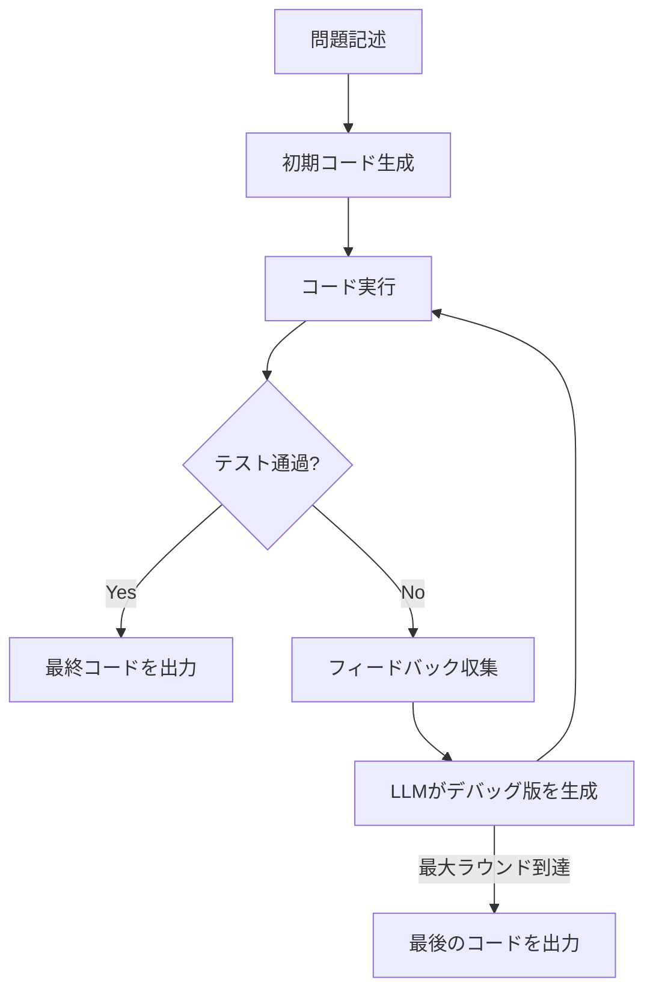

本記事は [Teaching Large Language Models to Self-Debug](https://arxiv.org/abs/2304.09797) の解説記事です。

## 論文概要（Abstract）

Self-Debuggingは、LLMが自身の生成したコードをデバッグする手法である。著者らは、外部のオラクルフィードバック（正解テスト等）なしでも、コードの実行結果の検査やコードの自然言語による説明（ラバーダックデバッグ）によってLLMが自身のミスを発見できることを実証した。MBPP +4.8%（58.6%→65.4%）、HumanEval +2.3%（65.8%→68.1%）、Spider（Text-to-SQL）+10%の改善が報告されている。特にSelf-Debuggingは総サンプル数10回以下で、100回のナイーブリサンプリングを上回るサンプル効率を示した。

この記事は [Zenn記事: Tree of Thoughtsでコード生成の精度を上げる](https://zenn.dev/0h_n0/articles/09571f57fb38c9) の深掘りです。

## 情報源

- **arXiv ID**: 2304.09797
- **URL**: [https://arxiv.org/abs/2304.09797](https://arxiv.org/abs/2304.09797)
- **著者**: Xinyun Chen, Maxwell Lin, Nathanael Scharli, Denny Zhou
- **発表年**: 2023
- **分野**: cs.AI, cs.CL
- **所属**: Google DeepMind

## 背景と動機（Background & Motivation）

LLMによるコード生成は、最初の1回で正確なコードを生成できるとは限らない。従来のアプローチは（1）同じプロンプトで繰り返しサンプリングして最良を選ぶ、（2）外部ツール（テスト、リンター等）のフィードバックで修正する、の2種類に大別される。

しかし、（1）は計算効率が悪く（100回サンプリングしても改善は限定的）、（2）は外部のゴールドスタンダードテストケースに依存する。著者らは、LLM自身がデバッグ能力を持ちうること、さらに実行環境がなくても「コードを言葉で説明する」行為だけでバグを発見できることを示した。

この着想はソフトウェアエンジニアリングの「ラバーダックデバッグ」に由来する。プログラマーがコードをゴム製のアヒルに説明するだけでバグに気づくという現象を、LLMに適用したものである。

## 主要な貢献（Key Contributions）

- **貢献1**: LLMが外部オラクルフィードバックなしで自身のコードをデバッグできることの実証
- **貢献2**: 3つのフィードバック戦略（Simple Feedback / Unit Test / Code Explanation）の体系的比較
- **貢献3**: ラバーダックデバッグ（コード説明）がコード実行なしでもデバッグに有効であることの発見
- **貢献4**: MBPP、HumanEval、Spider（Text-to-SQL）の3ベンチマークでの改善
- **貢献5**: 10回以下のサンプルで100回のナイーブリサンプリングを上回るサンプル効率の実証

## 技術的詳細（Technical Details）

### Self-Debuggingフレームワーク

Self-Debuggingは以下のマルチターンループで動作する。



ループは最大3ラウンドで打ち切られる。著者らの実験では、2ラウンド目以降の改善は急速に逓減することが確認されている。

### 3つのフィードバック戦略

#### 戦略1: Simple Feedback（単純フィードバック）

LLMに提供される情報はテストの合否（pass/fail）のバイナリ信号のみ。エラーメッセージ、トレースバック、具体的な入出力は含まれない。

**利点**: 最小限の実行環境で動作可能
**制約**: 何が間違っているかの情報がないため、修正の方向性が不明確

#### 戦略2: Unit Test Feedback（ユニットテストフィードバック）

LLMが自身でユニットテストを生成し、コードをそのテストに対して実行する。テスト入力、期待出力、実際の出力がLLMに提供される。

**利点**: 具体的な入出力の不一致がデバッグの手がかりとなる。著者らの実験では最も高い定量的改善を達成
**制約**: LLMが生成するテスト自体が誤っている場合、誤った方向に修正される可能性がある

$$
\text{score}(\text{Unit Test}) > \text{score}(\text{Simple}) > \text{score}(\text{no debugging})
$$

#### 戦略3: Code Explanation（コード説明 / ラバーダックデバッグ）

コード実行環境を使用しない。LLMにコードの各行を自然言語で説明させ、その説明の過程でバグに気づかせる。

**利点**: 実行環境が不要。論理エラーの検出に有効
**制約**: ランタイムエラー（型エラー、インデックスエラー等）の検出には不向き

この戦略が本論文の中核的新規性である。人間のラバーダックデバッグと同様に、コードを「言語化」する行為がLLMの注意を実装の細部に向けさせ、意図と実装の不一致を検出させる。

### デバッグラウンドごとの改善推移

MBPPでの著者らの実験結果は以下の通りである。

| ラウンド | pass@1 | 前ラウンドからの改善 |
|---------|--------|-------------------|
| 0（初期生成） | 58.6% | — |
| 1 | ~63-64% | +5ポイント前後 |
| 2 | ~65% | +1ポイント前後 |
| 3 | 65.4% | +0.4ポイント |

2ラウンド目以降の改善は急速に逓減しており、著者らは2-3ラウンドを上限とすることを推奨している。この知見は、後続のCodeTree論文でも修正深さ$d=2$が最適とする結果と一致している。

## 実装のポイント（Implementation）

**ベースモデル**: code-davinci-002（Codex）

**プロンプト設計**: デバッグプロンプトは以下の要素で構成される。
1. 元の問題記述
2. 生成されたコード（バグあり）
3. フィードバック信号（実行結果、テスト結果、またはコード説明）
4. 修正版コードの生成指示

**サンプル効率**: Self-Debuggingは総サンプル数10回以下（初期生成1回 + デバッグ3ラウンド × 3候補等）で、100回のナイーブリサンプリングを上回る。これは実用上のコスト削減に直結する。

```python
def self_debug(problem: str, max_rounds: int = 3) -> str:
    """Self-Debuggingの基本ループ"""
    code = generate_initial_code(problem)

    for round_num in range(max_rounds):
        result = execute_and_test(code)
        if result["passed"]:
            return code

        feedback = collect_feedback(code, result)
        code = generate_fix(problem, code, feedback, round_num)

    return code
```

## Production Deployment Guide

### AWS実装パターン（コスト最適化重視）

Self-Debuggingのコード修正パイプラインをAWSにデプロイする場合の構成を示す。

| 規模 | 月間リクエスト | 推奨構成 | 月額コスト概算 | 主要サービス |
|------|--------------|---------|-------------|------------|
| **Small** | ~3,000 | Serverless | $40-120 | Lambda + Bedrock + S3 |
| **Medium** | ~30,000 | Hybrid | $250-700 | Lambda + ECS Fargate + ElastiCache |
| **Large** | 300,000+ | Container | $1,800-4,500 | EKS + Karpenter + EC2 Spot |

Self-Debuggingは木探索系手法（ToT, LATS）と比較してAPI呼び出し回数が少ない（初期+最大3ラウンド = 最大4回）ため、コスト効率が高い。

**Small構成の詳細**（月額$40-120）:
- **Lambda**: コード生成・デバッグ各ラウンドの実行（$15/月）
- **Bedrock**: Claude 3.5 Haiku、Prompt Caching有効（$60/月）
- **Lambda（サンドボックス）**: コード実行用の隔離環境（$15/月）。セキュリティグループで外部通信を遮断
- **S3**: テストケースと生成コードの一時保存（$5/月）

**コスト削減テクニック**:
- 最大3ラウンドの上限設定（2ラウンド目以降の改善は逓減するため、$d=2$で打ち切る選択肢もある）
- ラバーダックデバッグ（Code Explanation）は実行環境不要のため、Lambda サンドボックスのコストを削減可能
- Prompt Caching有効化（同一問題の反復デバッグで30-90%削減）

**コスト試算の注意事項**: 上記は2026年6月時点のAWS ap-northeast-1リージョン料金に基づく概算値です。

### Terraformインフラコード

```hcl
resource "aws_lambda_function" "self_debug" {
  filename      = "self_debug.zip"
  function_name = "self-debug-handler"
  role          = aws_iam_role.self_debug_lambda.arn
  handler       = "index.handler"
  runtime       = "python3.12"
  timeout       = 120
  memory_size   = 1024

  environment {
    variables = {
      BEDROCK_MODEL_ID    = "anthropic.claude-3-5-haiku-20241022-v1:0"
      MAX_DEBUG_ROUNDS    = "3"
      FEEDBACK_STRATEGY   = "unit_test"
      ENABLE_PROMPT_CACHE = "true"
    }
  }
}

resource "aws_lambda_function" "code_sandbox" {
  filename      = "sandbox.zip"
  function_name = "code-execution-sandbox"
  role          = aws_iam_role.sandbox_lambda.arn
  handler       = "sandbox.handler"
  runtime       = "python3.12"
  timeout       = 30
  memory_size   = 512

  vpc_config {
    subnet_ids         = module.vpc.private_subnets
    security_group_ids = [aws_security_group.sandbox_sg.id]
  }
}

resource "aws_security_group" "sandbox_sg" {
  name_prefix = "code-sandbox-"
  vpc_id      = module.vpc.vpc_id

  egress {
    from_port   = 0
    to_port     = 0
    protocol    = "-1"
    cidr_blocks = []
  }
}
```

### コスト最適化チェックリスト

- [ ] デバッグラウンド数の上限設定（推奨: 2-3ラウンド）
- [ ] ラバーダックデバッグ活用（実行環境不要でコスト削減）
- [ ] Prompt Caching有効化
- [ ] Lambda サンドボックスのVPC隔離設定
- [ ] AWS Budgets予算アラート設定
- [ ] Bedrock Batch API使用（非リアルタイム処理）
- [ ] CloudWatch異常検知アラーム設定
- [ ] Lambda Power Tuning実施
- [ ] S3ライフサイクルポリシー（生成コードの自動削除）
- [ ] 未使用Lambda関数の自動削除

## 実験結果（Results）

### メインベンチマーク結果

| ベンチマーク | ベースライン | Self-Debugging（最良） | 改善幅 |
|------------|------------|---------------------|--------|
| MBPP | 58.6% | 65.4% | **+4.8%** |
| HumanEval | 65.8% | 68.1% | **+2.3%** |
| Spider (Text-to-SQL) | ~67% | ~77% | **+10%** |

Spider（Text-to-SQL）での+10%が最大の改善であり、SQLの決定論的な出力チェックがフィードバック信号として特に有効であったためと著者らは分析している。

### サンプル効率

| 手法 | 総サンプル数 | MBPP pass@1 |
|------|------------|-------------|
| ナイーブリサンプリング | 100 | ~63% |
| Self-Debugging | ≤10 | **65.4%** |

10分の1以下のサンプル数でリサンプリングを上回る結果は、Self-Debuggingの実用的なコスト効率を示している。

### フィードバック戦略別比較

| 戦略 | 実行環境 | MBPP改善 | 強み |
|------|---------|---------|------|
| Simple Feedback | 必要 | 中程度 | 最小限の環境で動作 |
| Unit Test | 必要 | **最大** | 具体的なI/O不一致が手がかり |
| Code Explanation | **不要** | 中程度 | 実行環境なしでデバッグ可能 |

## 実運用への応用（Practical Applications）

- **CI/CDパイプライン**: PRで追加されたコードに対してSelf-Debuggingを適用し、テスト失敗時に自動修正候補を生成する。最大3ラウンドの制限は処理時間の予測可能性を確保する
- **IDE統合**: Code Explanation戦略はローカル実行環境がないWebベースのエディタでも動作するため、コード補完や提案機能に統合しやすい
- **Text-to-SQL**: Spider +10%の結果は、自然言語からSQLへの変換タスクでSelf-Debuggingが特に有効であることを示している。BIツールの自然言語クエリ機能への応用が考えられる

## 関連研究（Related Work）

- **CodeT (Chen et al., 2022)**: コード生成とテスト生成の二重実行スコアリング。HumanEvalで67.0%を達成し、Self-Debuggingの68.1%がこれを上回る
- **Reflexion (Shinn et al., 2023)**: 言語フィードバックによる強化学習。Self-Debuggingの反復修正と類似するが、Reflexionは木探索を含む点で異なる
- **CodeTree (Li et al., NAACL 2025)**: Self-Debuggingの反復修正をDebuggerエージェントとして木探索に組み込んだ後続研究。修正深さ$d=2$が最適という知見はSelf-Debuggingの結果と一致する

## まとめと今後の展望

Self-Debuggingは、LLMの自己修正能力をコード生成に適用した先駆的研究であり、特にラバーダックデバッグ（Code Explanation）が実行環境なしでもデバッグに有効であることを示した重要な知見を提供している。MBPP +4.8%、HumanEval +2.3%、Spider +10%の改善と、10回以下のサンプルでの高いサンプル効率は実用的な価値が高い。一方で、2-3ラウンド以降の改善の逓減、自己生成テストの信頼性、ランタイムエラーに対するCode Explanationの限界が課題として残されている。後続のCodeTree、LATSはSelf-Debuggingの修正ループを木探索に統合することで、さらなる改善を実現している。

## 参考文献

- **arXiv**: [https://arxiv.org/abs/2304.09797](https://arxiv.org/abs/2304.09797)
- **Related Zenn article**: [https://zenn.dev/0h_n0/articles/09571f57fb38c9](https://zenn.dev/0h_n0/articles/09571f57fb38c9)
