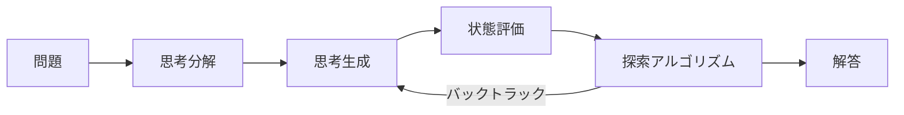

本記事は [Tree of Thoughts: Deliberate Problem Solving with Large Language Models](https://arxiv.org/abs/2305.10601) の解説記事です。

## 論文概要（Abstract）

Tree of Thoughts（ToT）は、LLMの推論を「思考の木探索」として定式化するフレームワークである。Chain-of-Thought（CoT）の線形的な推論を一般化し、複数の推論パスの並行探索、中間ステップの自己評価、必要に応じたバックトラッキングを可能にする。著者らは、GPT-4を用いた実験でGame of 24（4%→74%）、Creative Writing（coherenceスコア6.19→7.56）、Mini Crosswords（単語正解率20%→60%）の大幅な改善を報告している。

この記事は [Zenn記事: Tree of Thoughtsでコード生成の精度を上げる](https://zenn.dev/0h_n0/articles/09571f57fb38c9) の深掘りです。

## 情報源

- **arXiv ID**: 2305.10601
- **URL**: [https://arxiv.org/abs/2305.10601](https://arxiv.org/abs/2305.10601)
- **著者**: Shunyu Yao, Dian Yu, Jeffrey Zhao, Izhak Shafran, Thomas L. Griffiths et al.
- **発表年**: 2023（NeurIPS 2023 採択）
- **分野**: cs.AI, cs.CL

## 背景と動機（Background & Motivation）

LLMは多くのタスクで優れた能力を示すが、推論時の意思決定プロセスはトークンレベルの左から右への逐次生成に限定されている。この制約により、探索・戦略的先読み・初期判断のやり直しが必要なタスクでは性能が低下する。

著者らは認知科学の「System 1（直感的・高速）」と「System 2（意図的・低速・計画的）」の二重過程理論に着想を得ている。CoTはSystem 1的な逐次推論に近く、ToTはSystem 2的な意図的問題解決をLLMに付与することを目指している。

従来のCoT-SC（Self-Consistency）は複数パスを独立にサンプリングして多数決で集約するが、中間ステップの評価や選択は行わない。ToTは中間ステップごとに評価・選択しながら探索を進める点で本質的に異なる。

## 主要な貢献（Key Contributions）

- **貢献1**: Chain-of-Thoughtを一般化し、「コヒーレントなテキスト単位（思考）」を中間ステップとする木探索フレームワークToTの提案
- **貢献2**: 思考の生成（Sample/Propose）と評価（Value/Vote）の2軸×2手法を体系化
- **貢献3**: BFS/DFSの2つの探索アルゴリズムの実装と比較
- **貢献4**: Game of 24、Creative Writing、Mini Crosswordsの3タスクでCoTを大幅に上回る実証結果
- **貢献5**: Pythonベースのモジュール式ライブラリの公開

## 技術的詳細（Technical Details）

### ToTフレームワークの4つの構成要素



#### 1. 思考分解（Thought Decomposition）

「思考（thought）」の粒度はタスクによって異なる。著者らは以下のガイドラインを示している。

- **Game of 24**: 1思考 = 1つの算術演算（例: `5 + 3 = 8 (残り: 8, 8, 14)`）
- **Creative Writing**: 1思考 = 1つのアウトライン文
- **Mini Crosswords**: 1思考 = 1つの単語回答

設計原則として、「思考が小さすぎるとLLMが評価できず、大きすぎると探索空間が爆発する」と著者らは述べている。

#### 2. 思考生成（Thought Generator）

2つの戦略が提案されている。

**Sample（サンプリング）**: 同一コンテキストから独立にi.i.d.サンプリングする。思考空間が広い場合（Creative Writing等）に有効で、temperatureを上げて多様性を確保する。

**Propose（提案）**: 1回のプロンプトで候補を複数列挙する。探索空間が限定的な場合（Game of 24、Crosswords等）に適しており、LLMが構造化された候補リストを生成する。

#### 3. 状態評価（State Evaluator）

**Value（スカラー評価）**: 各状態を独立に評価し、「sure / maybe / impossible」のスコアを付与する。Game of 24では「残った数字と演算でゴールに到達可能か」をLLMに自問させる。

$$
V(s) \in \{\text{sure}, \text{maybe}, \text{impossible}\}
$$

**Vote（投票）**: 複数の状態を比較させ、最も有望なものに投票する。Creative Writingのように主観的評価が必要なタスクに有効である。

#### 4. 探索アルゴリズム

**BFS（幅優先探索）**: Game of 24に使用。各ステップで上位$b$個の状態のみを維持するビームサーチ的アプローチ。パラメータ: $b=5$（ビーム幅）、$T=3$（ステップ数）。

**DFS（深さ優先探索）**: Mini Crosswordsに使用。信頼度スコアが閾値を下回った場合にバックトラックする。最大深さまで探索し、行き詰まったら前の状態に戻る。

### CoTとの構造的比較

| 比較軸 | CoT | ToT |
|--------|-----|-----|
| 探索構造 | 線形（1パス） | 木構造（複数パス） |
| バックトラッキング | 不可 | 可能 |
| 中間評価 | なし | Value/Voteで明示的に評価 |
| Game of 24 | 4.0% | 74.0% |
| Creative Writing | 6.93 | 7.56 |
| Mini Crosswords | 40.6% | 78%（BFS）/ 60%（DFS） |
| コスト | 1x（基準） | ~10x |

## 実装のポイント（Implementation）

著者らのリファレンス実装に基づく実装上の要点を以下に示す。

**プロンプト設計**: propose promptとvalue promptをタスクごとに設計する必要がある。Game of 24のvalue promptでは「この状態から24に到達できるか？」と具体的に質問する形式が採用されている。

**有効性チェック**: Game of 24では各ステップで数式のvalidityをプログラム的に検証する（数字が正確に1回ずつ使用されているか等）。LLMの評価だけに頼らず、ルールベースのフィルタリングを併用している。

**コスト制御**: ToTはCoTの約10倍のトークンを消費する。著者らはb=5を推奨しており、b=1でも45%の成功率を達成することから、コスト制約が厳しい場合は幅を絞ることで対応可能である。

## Production Deployment Guide

### AWS実装パターン（コスト最適化重視）

ToTパイプラインをAWSにデプロイする場合のトラフィック量別推奨構成を示す。

| 規模 | 月間リクエスト | 推奨構成 | 月額コスト概算 | 主要サービス |
|------|--------------|---------|-------------|------------|
| **Small** | ~3,000 | Serverless | $50-150 | Lambda + Bedrock + DynamoDB |
| **Medium** | ~30,000 | Hybrid | $300-800 | Lambda + ECS Fargate + ElastiCache |
| **Large** | 300,000+ | Container | $2,000-5,000 | EKS + Karpenter + EC2 Spot |

**Small構成の詳細**（月額$50-150）:
- **Lambda**: 1GB RAM, 90秒タイムアウト（$20/月）。思考生成・評価を個別関数として実装
- **Bedrock**: Claude 3.5 Haiku（$80/月）。共通システムプロンプトのPrompt Caching有効化
- **DynamoDB**: 探索木の状態管理（$10/月）。TTL設定で古い探索結果を自動削除

**コスト削減テクニック**:
- ビーム幅$b$を動的に調整（容易な問題は$b=1$、困難な問題は$b=5$）
- 状態評価にHaikuクラスの軽量モデルを使用（評価コスト85%削減）
- Prompt Caching有効化（同一問題に対する反復呼び出しで30-90%削減）

**コスト試算の注意事項**: 上記は2026年6月時点のAWS ap-northeast-1リージョン料金に基づく概算値です。最新料金は[AWS料金計算ツール](https://calculator.aws/)で確認してください。

### Terraformインフラコード

```hcl
resource "aws_lambda_function" "tot_generator" {
  filename      = "tot_generator.zip"
  function_name = "tot-thought-generator"
  role          = aws_iam_role.tot_lambda.arn
  handler       = "index.handler"
  runtime       = "python3.12"
  timeout       = 120
  memory_size   = 1024

  environment {
    variables = {
      BEDROCK_MODEL_ID    = "anthropic.claude-3-5-haiku-20241022-v1:0"
      DYNAMODB_TABLE      = aws_dynamodb_table.tot_state.name
      BEAM_WIDTH          = "5"
      ENABLE_PROMPT_CACHE = "true"
    }
  }
}

resource "aws_dynamodb_table" "tot_state" {
  name         = "tot-search-state"
  billing_mode = "PAY_PER_REQUEST"
  hash_key     = "session_id"
  range_key    = "node_path"

  attribute {
    name = "session_id"
    type = "S"
  }
  attribute {
    name = "node_path"
    type = "S"
  }

  ttl {
    attribute_name = "expire_at"
    enabled        = true
  }
}
```

### コスト最適化チェックリスト

- [ ] ビーム幅$b$の動的調整（容易: $b=1$、困難: $b=5$）
- [ ] 状態評価にHaikuクラスモデル使用
- [ ] Prompt Caching有効化
- [ ] DynamoDB TTL設定（探索結果自動クリーンアップ）
- [ ] Lambda Power Tuning実施
- [ ] AWS Budgets予算アラート設定
- [ ] Bedrock Batch API使用（非リアルタイム処理）
- [ ] CloudWatch異常検知アラーム設定
- [ ] Step Functions Express Workflows活用
- [ ] 未使用Lambda関数の自動削除

## 実験結果（Results）

### Game of 24（論文Table 2より）

| 手法 | 成功率 |
|------|--------|
| IO prompting | 7.3% |
| CoT prompting | 4.0% |
| CoT-SC (b=100) | 9.0% |
| ToT (BFS, b=1) | 45.0% |
| ToT (BFS, b=5) | 74.0% |

CoTが4.0%とIOの7.3%を下回っている点は注目に値する。著者らはCoTの長い推論テキストが逆に精度を低下させるケースがあると分析している。

### Creative Writing（論文Table 3より）

| 手法 | Coherenceスコア（GPT-4評価） | Coherenceスコア（人間評価） |
|------|---------------------------|-------------------------|
| IO | 6.19 | 4.75 |
| CoT | 6.93 | 5.08 |
| ToT (best of 5) | 7.56 | 6.63 |

GPT-4評価と人間評価の相関係数は$r = 0.68$であり、中程度の相関を示している。

### Mini Crosswords（論文Table 4より）

| 手法 | 単語正解率 | 文字正解率 | 全問正解率 |
|------|-----------|-----------|-----------|
| IO | 38.7% | 55.6% | 0% |
| CoT | 40.6% | 57.5% | 0% |
| ToT (BFS, b=5) | 78.0% | 80.0% | 20% |

IO/CoT/CoT-SCでは20ゲーム中1ゲームも完全正解がなかった（0%）のに対し、ToTは20%の完全正解率を達成している。

## 実運用への応用（Practical Applications）

ToTフレームワークはコード生成に限らず、以下の応用が考えられる。

- **コード生成**: Zenn記事で解説されているように、CodeTreeやLATSの基盤としてToTの探索構造が活用されている
- **数学的推論**: Game of 24の結果（4%→74%）は、数学的問題解決での木探索の有効性を示している
- **創作支援**: Creative Writingでの改善は、構造化されたアウトラインからの執筆支援に応用可能

ただし、タスクごとにpropose prompt/value promptの設計が必要であり、汎用的なプラグアンドプレイは困難である。

## 関連研究（Related Work）

- **Chain-of-Thought (Wei et al., 2022)**: ToTが一般化する元となった線形推論手法
- **Self-Consistency (Wang et al., 2023)**: 複数パスをサンプリングして多数決で集約。ToTとの違いは中間評価の有無
- **Reasoning via Planning (RAP, Hao et al., 2023)**: MCTSをLLM推論に適用した並行研究。ToTはMCTSに限定せずBFS/DFSを柔軟に選択可能

## まとめと今後の展望

Tree of Thoughtsは、LLMの推論をCoTの線形パスから木構造の探索に拡張した基盤的フレームワークである。Game of 24での4%→74%という劇的な改善は、単純な問題でも探索が推論品質を大幅に向上させることを示している。一方で、トークンコストの約10倍増加と、タスクごとのプロンプト設計の手間が実用上の課題として残る。CodeTree、LATS等の後続研究はToTの枠組みを発展させ、コード生成や実環境でのエージェント動作に応用している。

## 参考文献

- **arXiv**: [https://arxiv.org/abs/2305.10601](https://arxiv.org/abs/2305.10601)
- **Code**: [https://github.com/princeton-nlp/tree-of-thought-llm](https://github.com/princeton-nlp/tree-of-thought-llm)
- **Related Zenn article**: [https://zenn.dev/0h_n0/articles/09571f57fb38c9](https://zenn.dev/0h_n0/articles/09571f57fb38c9)
