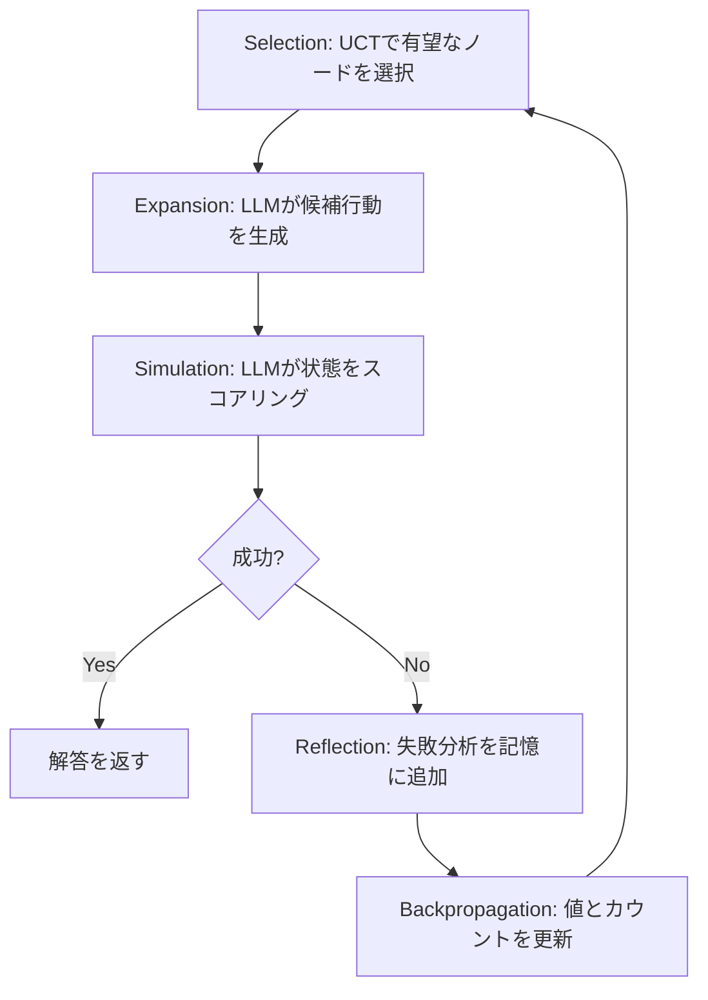

本記事は [Language Agent Tree Search Unifies Reasoning, Acting, and Planning in Language Models](https://arxiv.org/abs/2310.04406) の解説記事です。

## 論文概要（Abstract）

Language Agent Tree Search（LATS）は、Monte Carlo Tree Search（MCTS）を基盤としてLLMの推論・行動・計画を統合する汎用フレームワークである。LLMを「エージェント」「価値関数」「最適化器」の3つの役割で同時に活用し、失敗軌道からの自己反省メカニズムを備える。著者らは、HumanEvalで94.4% pass@1（GPT-4ベースライン67.0%、Reflexion 91.0%、ToT 87.0%を上回る）、WebArenaでGPT-3.5使用で28.8%（ReAct + GPT-4の23.8%を上回る）を達成したと報告している。

この記事は [Zenn記事: Tree of Thoughtsでコード生成の精度を上げる](https://zenn.dev/0h_n0/articles/09571f57fb38c9) の深掘りです。

## 情報源

- **arXiv ID**: 2310.04406
- **URL**: [https://arxiv.org/abs/2310.04406](https://arxiv.org/abs/2310.04406)
- **著者**: Andy Zhou, Kai Yan, Michal Shlapentokh-Rothman, Haohan Wang, Yu-Xiong Wang
- **発表年**: 2024（ICML 2024 採択）
- **分野**: cs.AI, cs.CL

## 背景と動機（Background & Motivation）

LLMを用いた複雑な問題解決では、推論（reasoning）、行動（acting）、計画（planning）の3つの能力が求められる。しかし、既存手法はこれらを部分的にしか実現できない。

- **CoT**: 推論のみ。環境との相互作用なし
- **ToT**: 推論＋計画。ただし環境フィードバックなし
- **ReAct**: 推論＋行動。先読み計画やバックトラッキングなし
- **Reflexion**: 推論＋行動＋限定的な計画。広範な木探索なし

著者らは、これら3つの能力を単一のフレームワークで統合することを目指してLATSを設計した。LATSの核心は、MCTSのSelection→Expansion→Simulation→Backpropagationサイクルに「Reflection（自己反省）」を追加した5段階アルゴリズムである。

## 主要な貢献（Key Contributions）

- **貢献1**: 推論・行動・計画を単一のMCTSベースアルゴリズムで統合した初のフレームワーク
- **貢献2**: LLMを3つの役割（エージェント、価値関数、最適化器）で同時活用する設計
- **貢献3**: 失敗軌道からの自然言語自己反省を記憶として蓄積するメカニズム（勾配更新不要）
- **貢献4**: HumanEval 94.4%でReflexion（91.0%）・ToT（87.0%）を上回るSOTA達成
- **貢献5**: WebArenaでGPT-3.5（28.8%）がGPT-4ベースのReAct（23.8%）を上回ることを実証（体系的探索が弱いモデルを補完できることを示唆）

## 技術的詳細（Technical Details）

### LATSの5段階アルゴリズム



#### Selection（選択）

UCT（Upper Confidence Bound for Trees）アルゴリズムを用いて展開するノードを選択する。

$$
\text{UCT}(s) = V(s) + w \cdot \sqrt{\frac{\ln N(\text{parent})}{N(s)}}
$$

ここで、
- $V(s)$: ノード$s$の価値推定値（LLMスコアリングから）
- $N(s)$: ノード$s$の訪問回数
- $N(\text{parent})$: 親ノードの訪問回数
- $w$: 探索重み（ハイパーパラメータ）

第1項は活用（exploitation）、第2項は探索（exploration）に対応し、訪問回数の少ないノードほど探索を優先する。

#### Expansion（展開）

選択されたノードからLLMが$n$個の多様な候補行動/思考を生成する。温度サンプリングにより多様性を確保する。

#### Simulation（シミュレーション/評価）

各子ノードをLLMが価値関数として評価する。

- **LLM価値関数**: 現在の状態がゴールに対してどの程度有望かを0-10でスコアリング（ゼロショット、追加学習不要）
- **終端状態**: 環境フィードバック（成功=1、失敗=0）から報酬を計算
- 価値推定値の更新: $V(s) = \frac{V(s) \cdot N(s) + \text{reward}}{N(s) + 1}$

#### Reflection（自己反省 — LATSの独自要素）

失敗軌道に対してLLMが自然言語で失敗分析を生成する。この反省はエピソード記憶として蓄積され、以降の展開時にコンテキストとして提供される。これにより、同じ失敗を繰り返すことを防ぐ。勾配ベースの学習は不要であり、プロンプトのみで実現される。

#### Backpropagation（逆伝播）

評価値と訪問回数を、評価ノードからルートノードまで遡って更新する。

### LLMの3つの役割

| 役割 | 機能 | ToTとの違い |
|------|------|-----------|
| エージェント | 行動/思考の生成 | ToTと同等 |
| 価値関数 | 状態の0-10スコアリング | ToTのValue/Voteを拡張 |
| 最適化器 | 失敗からの反省と記憶 | ToTにはない独自要素 |

### ToTとの構造的差異

LATSがToTと本質的に異なるのは「環境フィードバック」の組み込みである。ToTはLLMの内部推論のみで状態を評価するが、LATSは実際のコード実行結果やWeb操作の結果を報酬として取り込む。これにより、LLMの自己評価だけでは検出できないエラー（ランタイムエラー、API応答の不一致等）を捕捉できる。

## 実装のポイント（Implementation）

著者らが報告しているデフォルトの構成パラメータは以下の通りである。

| パラメータ | 値 | 備考 |
|-----------|---|------|
| 候補数 $n$ | 5 | 各ノードから生成する子ノード数 |
| MCTSイテレーション $k$ | 5 | 探索ループの繰り返し回数 |
| 探索重み $w$ | タスク依存 | UCT式の探索-活用バランス |
| ベースモデル | GPT-4 | HumanEval実験 |

**実装上の注意点**:

- 反省メカニズムにより、LATSは過去の失敗を記憶するが、記憶が増えるとコンテキスト長が肥大化する。著者らは最新の$k$個の反省のみを保持する制限を推奨している
- 価値関数のスコアリングは0-10のスカラーだが、LLMのスコアリングにはバイアスがある（中間値に寄りやすい）。キャリブレーションが必要になる場合がある
- 探索重み$w$はタスクごとにチューニングが必要であり、汎用的な値は示されていない

## Production Deployment Guide

### AWS実装パターン（コスト最適化重視）

LATSのMCTSパイプラインをAWSにデプロイする場合の構成を示す。

| 規模 | 月間リクエスト | 推奨構成 | 月額コスト概算 | 主要サービス |
|------|--------------|---------|-------------|------------|
| **Small** | ~3,000 | Serverless | $80-200 | Lambda + Bedrock + DynamoDB + S3 |
| **Medium** | ~30,000 | Hybrid | $400-1,000 | ECS Fargate + Bedrock + ElastiCache |
| **Large** | 300,000+ | Container | $2,500-6,000 | EKS + Karpenter + EC2 Spot |

LATSはToTよりもAPI呼び出し回数が多い（約7倍）ため、コスト管理がより重要になる。

**コスト削減テクニック**:
- 反省メモリをElastiCache/DynamoDBに永続化し、類似問題間で再利用
- 価値関数にはHaikuクラスモデルを使用（エージェント/最適化器はSonnet/Opus）
- Prompt Caching有効化（反復的なシステムプロンプトで30-90%削減）
- 容易な問題は$k=1$イテレーション、困難な問題は$k=5$と動的調整

**コスト試算の注意事項**: 上記は2026年6月時点のAWS ap-northeast-1リージョン料金に基づく概算値です。

### Terraformインフラコード

```hcl
resource "aws_lambda_function" "lats_agent" {
  filename      = "lats_agent.zip"
  function_name = "lats-mcts-agent"
  role          = aws_iam_role.lats_lambda.arn
  handler       = "index.handler"
  runtime       = "python3.12"
  timeout       = 300
  memory_size   = 2048

  environment {
    variables = {
      AGENT_MODEL_ID      = "anthropic.claude-3-5-sonnet-20241022-v2:0"
      VALUE_MODEL_ID      = "anthropic.claude-3-5-haiku-20241022-v1:0"
      DYNAMODB_TABLE      = aws_dynamodb_table.lats_state.name
      MCTS_ITERATIONS     = "5"
      EXPANSION_WIDTH     = "5"
      ENABLE_PROMPT_CACHE = "true"
    }
  }
}

resource "aws_dynamodb_table" "lats_state" {
  name         = "lats-mcts-state"
  billing_mode = "PAY_PER_REQUEST"
  hash_key     = "session_id"
  range_key    = "node_id"

  attribute {
    name = "session_id"
    type = "S"
  }
  attribute {
    name = "node_id"
    type = "S"
  }

  ttl {
    attribute_name = "expire_at"
    enabled        = true
  }
}
```

### コスト最適化チェックリスト

- [ ] 価値関数にHaikuクラスモデル使用（コスト85%削減）
- [ ] MCTSイテレーション数の動的調整
- [ ] Prompt Caching有効化
- [ ] 反省メモリの永続化と再利用
- [ ] DynamoDB TTL設定
- [ ] AWS Budgets予算アラート設定
- [ ] Bedrock Batch API使用（非リアルタイム処理）
- [ ] Lambda Power Tuning実施
- [ ] CloudWatch異常検知アラーム設定
- [ ] Step Functions Express Workflows活用

## 実験結果（Results）

### HumanEval（論文Table 1より）

| 手法 | モデル | pass@1 |
|------|--------|--------|
| Standard | GPT-4 | 67.0% |
| CoT | GPT-4 | 69.7% |
| ToT | GPT-4 | 87.0% |
| Reflexion | GPT-4 | 91.0% |
| **LATS** | **GPT-4** | **94.4%** |

ToTの87.0%からLATSの94.4%への+7.4ポイントの改善は、環境フィードバックと自己反省の効果を示している。

### WebArena（論文Table 2より）

| 手法 | モデル | 成功率 |
|------|--------|--------|
| ReAct | GPT-3.5 | 13.0% |
| ReAct | GPT-4 | 23.8% |
| **LATS** | **GPT-3.5** | **28.8%** |

LATS + GPT-3.5（28.8%）がReAct + GPT-4（23.8%）を上回った結果は、体系的探索がモデル性能の差を補完できることを示唆する重要な知見である。

### Ablation実験

| 構成 | HumanEval pass@1 |
|------|-----------------|
| 価値関数なし（ランダム選択） | ~80% |
| 反省なし | ~88% |
| UCTなし（貪欲選択） | ~89% |
| Full LATS | 94.4% |

3つのコンポーネント（価値関数、反省、UCT）すべてが性能に寄与しており、特に価値関数の除去による14ポイントの低下が最も大きい。

## 実運用への応用（Practical Applications）

- **コード生成パイプライン**: HumanEval 94.4%は、CI/CDにおける自動コード修正の実用性を示唆する。テスト実行結果を環境フィードバックとして取り込むLATSの設計は、実際の開発フローに適合しやすい
- **Webエージェント**: WebArenaでの結果は、Webブラウジングタスク（フォーム入力、ナビゲーション等）の自動化にLATSが有効であることを示す
- **弱いモデルの補完**: GPT-3.5 + LATSがGPT-4 + ReActを上回る結果は、コスト効率の観点から重要。安価なモデルに探索を加える方が、高価なモデルを単純に使うよりも費用対効果が高い場合がある

## 関連研究（Related Work）

- **Tree of Thoughts (Yao et al., NeurIPS 2023)**: LATSの探索構造の原型。ToTは環境フィードバックがない点でLATSと異なる
- **Reflexion (Shinn et al., NeurIPS 2023)**: 言語による強化学習。LATSの反省メカニズムの着想元だが、広範な木探索がない
- **RAP (Hao et al., 2023)**: MCTSをLLM推論に適用した並行研究。LATSは行動（acting）と環境相互作用を追加した点で拡張

## まとめと今後の展望

LATSは、MCTSを基盤としてLLMの推論・行動・計画を統合し、自己反省メカニズムを加えたフレームワークである。HumanEval 94.4%、WebArena 28.8%の結果は、環境フィードバックと木探索の組み合わせの有効性を実証している。課題として、API呼び出し回数の約7倍増加、UCTの探索重み$w$のチューニング、長い軌道での探索空間の爆発が挙げられている。後続のCodeTreeはLATSの汎用MCTSをコード生成に特化させることで、CodeContestsで+7.3ポイントの改善を実現している。

## 参考文献

- **arXiv**: [https://arxiv.org/abs/2310.04406](https://arxiv.org/abs/2310.04406)
- **Code**: [https://github.com/andyz245/LanguageAgentTreeSearch](https://github.com/andyz245/LanguageAgentTreeSearch)
- **Related Zenn article**: [https://zenn.dev/0h_n0/articles/09571f57fb38c9](https://zenn.dev/0h_n0/articles/09571f57fb38c9)
