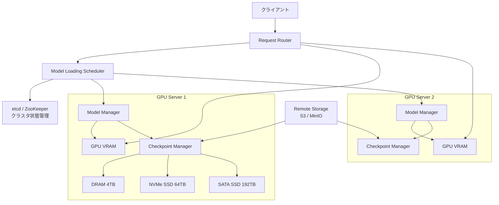
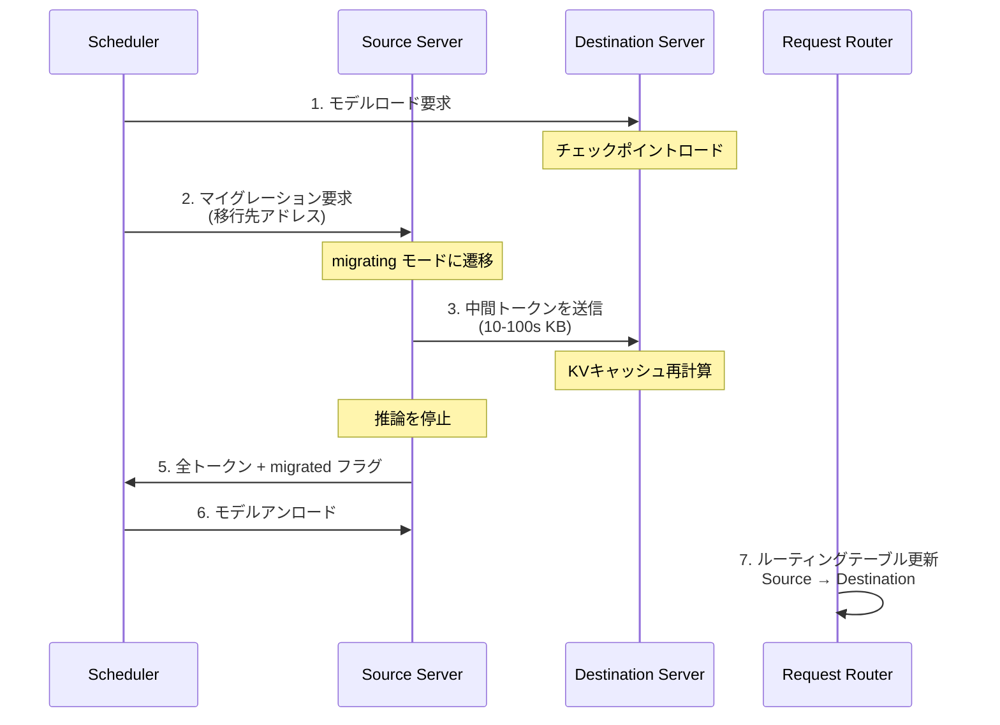

本記事は [https://arxiv.org/abs/2401.14351](https://arxiv.org/abs/2401.14351) の解説記事です。

## 論文概要（Abstract）

ServerlessLLMは、大規模言語モデル（LLM）のサーバーレス推論において低レイテンシを実現する分散システムである。GPUサーバーに搭載された大容量ストレージ（DRAM、NVMe SSD、SATA SSD）を活用してチェックポイントをローカルに保持し、リモートダウンロードの必要性を最小化する。著者らは、ロード最適化チェックポイントフォーマット、ライブマイグレーション、起動時間最適化スケジューリングの3つの技術を組み合わせることで、既存のサーバーレスシステム（Ray Serve等）と比較して10〜200倍のレイテンシ改善を報告している（論文Table 2、Figure 10より）。

この記事は [Zenn記事: Bedrock AgentCore Runtimeで社内ヘルプデスクのセッション管理とコストを最適化する](https://zenn.dev/0h_n0/articles/6e0a4f321e18ab) の深掘りです。

## 情報源

- **会議名**: OSDI 2024（18th USENIX Symposium on Operating Systems Design and Implementation）
- **年**: 2024
- **URL**: [https://arxiv.org/abs/2401.14351](https://arxiv.org/abs/2401.14351)
- **著者**: Yao Fu, Leyang Xue, Yeqi Huang, Andrei-Octavian Brabete, Dmitrii Ustiugov, Yuvraj Patel, Luo Mai
- **分野**: cs.LG, cs.DC
- **GitHub**: [https://github.com/ServerlessLLM/ServerlessLLM](https://github.com/ServerlessLLM/ServerlessLLM)（Stars: 685、最新リリース v0.8.0、2025年11月）

## カンファレンス情報

**OSDI（Operating Systems Design and Implementation）について**: OSDIはUSENIXが主催するオペレーティングシステム・分散システム分野の最高峰国際会議の1つである。システムの設計・実装に関する実践的な研究成果が評価される場であり、採択率は通常15〜20%程度と競争率が高い。ServerlessLLMはOSDI 2024に採択され、LLMサービングにおけるシステムレベルの最適化が学術的に評価された。

## 背景と動機（Background & Motivation）

サーバーレスコンピューティングはリクエスト駆動のスケーリングとコスト効率の面で魅力的だが、LLM推論をサーバーレス環境で提供する際には深刻な**コールドスタート問題**が存在する。LLMのチェックポイントは数十〜数百GBに達し、リモートストレージ（S3等）からのダウンロードに数分を要する。

従来のサーバーレスシステムでは、モデルのロードに要する時間がLLMのサイズに対して線形に増加する。例えば、論文のFigure 1によると、KServeでOPT-30Bをリモートからロードする場合は約128秒（うち114秒がダウンロード時間）を要すると報告されている。この起動レイテンシはインタラクティブなアプリケーション（チャットボット、ヘルプデスク等）では許容しがたい。

一方で、GPUサーバーにはGPU VRAM以外にも大量のストレージリソースが存在する。8-GPUサーバーの場合、ホストDRAMが最大4TB、NVMe SSD（RAID 0）が最大64TB、SATA SSD（RAID 0）が最大192TBの容量を持つ。ServerlessLLMは、この**利用されていないストレージ階層を多段チェックポイントキャッシュとして活用**することで、コールドスタート問題に対処する。

## 主要な貢献（Key Contributions）

- **貢献1: ロード最適化チェックポイントフォーマットとマルチティアローディングシステム** -- チャンク分割・シーケンシャル読み取りに最適化されたフォーマットと、DRAM/NVMe/SATA/リモートの多段ストレージパイプラインにより、PyTorchの6〜8.2倍、Safetensorsの3.6〜4.7倍の高速ロードを実現
- **貢献2: LLM推論のライブマイグレーション** -- KVキャッシュ（1〜10s GB）ではなくトークン列（10〜100s KB）のみを転送し、移行先でKVキャッシュを再計算する方式により、最小限のユーザー中断でサーバー間のモデル移行を実現
- **貢献3: 起動時間最適化スケジューリング** -- チェックポイントの局所性を考慮した推定式に基づき、クラスタ全体で起動レイテンシを最小化するスケジューリングアルゴリズム

## 技術的詳細（Technical Details）

### システムアーキテクチャ

ServerlessLLMは以下のコンポーネントで構成される。



Request Routerがリクエストをモデルがロード済みのサーバーに振り分け、Model Loading Schedulerがチェックポイントの局所性を評価して最適なサーバーを選択する。Checkpoint Managerが多段ストレージのI/Oパイプラインを管理する。

### マルチティアチェックポイントローディング

#### ロード最適化チェックポイントフォーマット

従来のPyTorchフォーマット（`.pt`）はメタデータとテンソルが混在し、逐次的なデシリアライズが必要である。ServerlessLLMは以下の最適化を施したフォーマットを定義している。

1. **GPU別パーティショニング**: 各GPUが必要とするテンソルを1つのパーティションにまとめ、バイナリパラメータデータのみを格納する
2. **テンソルインデックスファイル**: テンソル名から`(GPU_id, offset, size)`へのマッピングを保持し、ダイレクトアクセスを可能にする
3. **メモリワードアラインメント**: テンソルデータをメモリワードサイズに合わせて配置し、`O_DIRECT`によるゼロコピー読み取りを実現する

#### 多段ストレージパイプライン

チェックポイントのロードは以下のパイプラインで処理される。

$$
T_{\text{load}} = \frac{n}{b_{\text{tier}}}
$$

ここで、
- $n$: モデルサイズ（バイト）
- $b_{\text{tier}}$: 使用するストレージティアの帯域幅

各ティアの帯域幅は以下のとおりである（論文Section 3.2より）。

| ストレージティア | 容量 | 帯域幅 | 用途 |
|-----------------|------|--------|------|
| GPU VRAM | 80GB × 8 | - | 推論実行 |
| ホストDRAM | 最大4TB | 512 GB/s（PCIe 5.0） | ホットモデルキャッシュ |
| NVMe SSD（RAID 0） | 最大64TB | 約60 GB/s | ウォームモデルキャッシュ |
| SATA SSD（RAID 0） | 最大192TB | 約6 GB/s | コールドモデルキャッシュ |
| リモート（S3） | 無制限 | 1〜10 Gbps | バックアップストレージ |

実装では固定サイズチャンクによるメモリ管理、ピン留めメモリ（`cudaHostAlloc`）による冗長コピーの排除、複数I/Oスレッドによるティア内並行処理が行われる。

```python
from dataclasses import dataclass

@dataclass
class TensorIndex:
    """ロード最適化フォーマットのテンソルインデックス"""
    name: str
    gpu_id: int
    offset: int  # パーティション内のバイトオフセット
    size: int    # テンソルサイズ（バイト）

def load_checkpoint_multitier(
    model_name: str,
    gpu_ids: list[int],
    tier_order: list[str] = ("dram", "nvme", "sata", "remote"),
) -> dict[int, bytes]:
    """マルチティアチェックポイントローディングの擬似コード

    Args:
        model_name: モデル識別子
        gpu_ids: ロード先GPU IDのリスト
        tier_order: ストレージティアの優先順位

    Returns:
        GPU ID -> パラメータバイナリのマッピング
    """
    index = load_tensor_index(model_name)
    partitions: dict[int, bytes] = {}

    for gpu_id in gpu_ids:
        tensors = [t for t in index if t.gpu_id == gpu_id]
        # 最速のティアから読み取り
        for tier in tier_order:
            if is_cached(model_name, tier):
                # O_DIRECT + ピン留めメモリで読み取り
                data = read_direct(model_name, gpu_id, tier)
                partitions[gpu_id] = data
                break
        # 読み取ったデータをGPU VRAMに非同期転送
        cuda_memcpy_async(partitions[gpu_id], gpu_id)

    return partitions
```

### ライブマイグレーション

ServerlessLLMのライブマイグレーションは、サーバー間でLLM推論を移行する際の効率を最大化する設計である。

#### なぜトークン転送なのか

LLM推論のKVキャッシュは1〜10s GBに達するが、元のトークン列は10〜100s KBである。著者らは、KVキャッシュを移行先で再計算する方が、ネットワーク経由で転送するよりも高速であると報告している（論文Section 4.1より）。具体的には、1,000トークンのKVキャッシュ再計算時間は、約100トークンの新規生成に相当する時間で完了するとされている。

#### マルチラウンドマイグレーションプロトコル



マイグレーション中も移行元サーバーは推論を継続し、停止時間を最小化する。移行先でのKVキャッシュ再計算が完了した時点でルーティングが切り替わるため、ユーザーから見たサービス中断は最小限に抑えられる。

### 起動時間最適化スケジューリング

スケジューラは、新しいモデルリクエストに対して全サーバーの起動時間を推定し、最小レイテンシのサーバーを選択する。

#### モデルロード時間の推定

$$
T_{\text{startup}} = q + \frac{n}{b}
$$

ここで、
- $q$: キューイング時間（先行するモデルロードの待ち時間の累積）
- $n$: モデルサイズ（バイト）
- $b$: 利用可能なストレージティアの帯域幅

サーバーごとにシングルI/Oキューを維持し、Remote→SSD→DRAMのパス上で最も遅いティアの帯域幅がボトルネックとなる。

#### ライブマイグレーション時間の推定

$$
T_{\text{migration}} = a \times (t_{\text{in}} + t_{\text{out}}) + b
$$

ここで、
- $a, b$: モデル固有パラメータ（バッチサイズに依存、vLLMプロファイリングで事前取得）
- $t_{\text{in}}$: 入力プロンプトのトークン数
- $t_{\text{out}}$: これまでに生成した出力トークン数（$t_{\text{out}} = d / t$、$d$は推論経過時間、$t$はトークンあたりの平均生成時間）

スケジューラはロード時間とマイグレーション時間の両方を比較し、より短い方を選択する。チェックポイントがローカルにキャッシュされているサーバーが優先される。

## 実装のポイント

ServerlessLLMの実装（GitHub: [ServerlessLLM/ServerlessLLM](https://github.com/ServerlessLLM/ServerlessLLM)、v0.8.0時点）で注目すべき点を整理する。

**O_DIRECTによるゼロコピーI/O**: Linuxの`O_DIRECT`フラグにより、OSのページキャッシュをバイパスして直接ストレージからピン留めメモリに読み込む。これにより、システムキャッシュの汚染を回避し、DRAMの大部分をチェックポイントキャッシュとして利用可能にしている。

**チャンクベースメモリ管理**: 固定サイズのメモリチャンクを事前確保し、テンソルデータを断片化なく配置する。これにより、メモリアロケーションのオーバーヘッドを排除している。

**非同期PCIe転送**: 複数のPCIeリンクを並列に利用し、DRAMからGPU VRAMへのデータ転送をパイプライン化する。PCIe 5.0環境では理論帯域幅512 GB/sに対し、実効帯域幅を最大化する設計となっている。

**制約と限界**: 現時点ではNVIDIA GPU（Compute Capability 7.0以上）が必須であり、AMD GPU（ROCm 6.2+）はExperimental Supportの段階である。また、ロード最適化フォーマットへの事前変換が必要であり、チェックポイントの変換時間がオフラインで発生する。

## Production Deployment Guide: サーバーレスLLM推論のAWS構成

### AWS実装パターン（コスト最適化重視）

以下はサーバーレスLLM推論をAWS上で構築する際のトラフィック量別推奨構成である。コスト試算は2026年6月時点のap-northeast-1（東京）リージョン料金に基づく概算値であり、実際のコストはトラフィックパターン、バースト使用量、リージョンにより変動する。最新料金は[AWS料金計算ツール](https://calculator.aws/)で確認を推奨する。

| 構成 | トラフィック | サービス構成 | 月額概算 |
|------|-------------|-------------|----------|
| **Small** | ~100 req/日 | Lambda + Bedrock（サーバーレス推論） | $50〜150 |
| **Medium** | ~1,000 req/日 | ECS Fargate + SageMaker Endpoint | $300〜800 |
| **Large** | 10,000+ req/日 | EKS + Karpenter + GPU Spot Instances | $2,000〜5,000 |

**Small構成**: Lambda関数からBedrock APIを呼び出すフルサーバーレス構成。セッション状態はDynamoDBで管理する。コールドスタートはLambda側で数百ms程度だが、Bedrockのマネージド推論基盤がモデルロードを吸収するため、エンドユーザーへの影響は小さい。

**Medium構成**: ECS Fargateでアプリケーションロジックを稼働させ、SageMaker Real-time Endpointで推論を実行する。SageMakerのAuto Scalingによりトラフィック変動に対応する。ただし、SageMakerエンドポイントは最低1インスタンス常駐のため、トラフィックが少ない時間帯のコスト効率はSmall構成に劣る。

**Large構成**: EKSクラスタでKarpenterによるGPU Spot Instancesの自動プロビジョニングを行う。ServerlessLLMの論文で示されたマルチティアチェックポイントローディングの思想を取り入れ、ノードローカルのNVMe SSD（g5インスタンスの場合600GB NVMe）にモデルキャッシュを配置することで、Spot回収時の再起動レイテンシを低減できる。

**コスト削減テクニック**:
- Spot Instances活用でオンデマンド比最大90%削減（g5.xlargeのSpot割引率は60〜70%程度が一般的）
- Reserved Instances（1年コミット）で最大72%削減
- Bedrock Batch API使用でリアルタイム推論比50%削減
- Prompt Caching有効化でキャッシュヒット時の入力トークンコストを最大90%削減

### Terraformインフラコード

#### Small構成（Serverless）: Lambda + Bedrock + DynamoDB

```hcl
# small_serverless/main.tf
# ServerlessLLM推論 Small構成 - Lambda + Bedrock
# 対象: ~100 req/日、月額$50-150

terraform {
  required_version = ">= 1.9"
  required_providers {
    aws = {
      source  = "hashicorp/aws"
      version = "~> 5.80"
    }
  }
}

provider "aws" {
  region = "ap-northeast-1"
}

# --- IAM Role（最小権限） ---
resource "aws_iam_role" "lambda_bedrock" {
  name = "serverless-llm-lambda-role"
  assume_role_policy = jsonencode({
    Version = "2012-10-17"
    Statement = [{
      Action = "sts:AssumeRole"
      Effect = "Allow"
      Principal = { Service = "lambda.amazonaws.com" }
    }]
  })
}

resource "aws_iam_role_policy" "bedrock_invoke" {
  name = "bedrock-invoke"
  role = aws_iam_role.lambda_bedrock.id
  policy = jsonencode({
    Version = "2012-10-17"
    Statement = [
      {
        Effect   = "Allow"
        Action   = ["bedrock:InvokeModel", "bedrock:InvokeModelWithResponseStream"]
        Resource = "arn:aws:bedrock:ap-northeast-1::foundation-model/*"
      },
      {
        Effect   = "Allow"
        Action   = ["dynamodb:GetItem", "dynamodb:PutItem", "dynamodb:UpdateItem", "dynamodb:Query"]
        Resource = aws_dynamodb_table.sessions.arn
      },
      {
        Effect   = "Allow"
        Action   = ["logs:CreateLogGroup", "logs:CreateLogStream", "logs:PutLogEvents"]
        Resource = "arn:aws:logs:ap-northeast-1:*:*"
      }
    ]
  })
}

# --- DynamoDB（On-Demand、セッション管理） ---
resource "aws_dynamodb_table" "sessions" {
  name         = "serverless-llm-sessions"
  billing_mode = "PAY_PER_REQUEST"  # コスト最適化: On-Demandモード
  hash_key     = "session_id"

  attribute {
    name = "session_id"
    type = "S"
  }

  ttl {
    attribute_name = "ttl"
    enabled        = true  # セッション自動クリーンアップ
  }

  server_side_encryption {
    enabled = true  # KMS暗号化
  }
}

# --- Lambda関数 ---
resource "aws_lambda_function" "inference" {
  function_name = "serverless-llm-inference"
  runtime       = "python3.12"
  handler       = "handler.lambda_handler"
  role          = aws_iam_role.lambda_bedrock.arn
  timeout       = 120   # Bedrock応答待ちを考慮
  memory_size   = 512   # コスト最適化: 必要最小限
  filename      = "lambda.zip"

  environment {
    variables = {
      DYNAMODB_TABLE = aws_dynamodb_table.sessions.name
      MODEL_ID       = "us.anthropic.claude-sonnet-4-6"
    }
  }

  tracing_config {
    mode = "Active"  # X-Ray有効化
  }
}

# --- CloudWatchアラーム（コスト監視） ---
resource "aws_cloudwatch_metric_alarm" "lambda_cost" {
  alarm_name          = "serverless-llm-lambda-invocations-high"
  comparison_operator = "GreaterThanThreshold"
  evaluation_periods  = 1
  metric_name         = "Invocations"
  namespace           = "AWS/Lambda"
  period              = 86400  # 日次
  statistic           = "Sum"
  threshold           = 500    # 日次500回超でアラート
  alarm_description   = "Lambda invocations exceeded daily threshold"
  dimensions = {
    FunctionName = aws_lambda_function.inference.function_name
  }
}
```

#### Large構成（Container）: EKS + Karpenter + GPU Spot Instances

```hcl
# large_container/main.tf
# ServerlessLLM推論 Large構成 - EKS + Karpenter + Spot
# 対象: 10,000+ req/日、月額$2,000-5,000

terraform {
  required_version = ">= 1.9"
  required_providers {
    aws = {
      source  = "hashicorp/aws"
      version = "~> 5.80"
    }
  }
}

provider "aws" {
  region = "ap-northeast-1"
}

# --- EKSクラスタ ---
module "eks" {
  source  = "terraform-aws-modules/eks/aws"
  version = "~> 20.31"

  cluster_name    = "serverless-llm-cluster"
  cluster_version = "1.31"

  vpc_id     = var.vpc_id
  subnet_ids = var.private_subnet_ids

  # コントロールプレーンのみ（ノードはKarpenterが管理）
  cluster_endpoint_public_access = false
  enable_irsa                    = true
}

# --- Karpenter Provisioner（Spot優先、GPU自動スケーリング） ---
resource "kubectl_manifest" "karpenter_nodepool" {
  yaml_body = yamlencode({
    apiVersion = "karpenter.sh/v1"
    kind       = "NodePool"
    metadata   = { name = "gpu-spot" }
    spec = {
      template = {
        spec = {
          requirements = [
            { key = "karpenter.sh/capacity-type", operator = "In", values = ["spot", "on-demand"] },
            { key = "node.kubernetes.io/instance-type", operator = "In",
              values = ["g5.xlarge", "g5.2xlarge", "g5.4xlarge"] },
          ]
          nodeClassRef = { name = "gpu-nodes" }
        }
      }
      limits   = { cpu = "128", "nvidia.com/gpu" = "16" }
      disruption = {
        consolidationPolicy = "WhenEmptyOrUnderutilized"
        consolidateAfter    = "30s"  # アイドルノードを30秒後に回収
      }
    }
  })
}

# --- Secrets Manager（モデル設定） ---
resource "aws_secretsmanager_secret" "model_config" {
  name                    = "serverless-llm/model-config"
  recovery_window_in_days = 7
}

resource "aws_secretsmanager_secret_version" "model_config" {
  secret_id = aws_secretsmanager_secret.model_config.id
  secret_string = jsonencode({
    model_name     = "meta-llama/Llama-3.1-8B-Instruct"
    checkpoint_dir = "/mnt/nvme/checkpoints"
    cache_tiers    = ["dram", "nvme"]
  })
}

# --- AWS Budgets（予算アラート） ---
resource "aws_budgets_budget" "monthly" {
  name         = "serverless-llm-monthly"
  budget_type  = "COST"
  limit_amount = "5000"
  limit_unit   = "USD"
  time_unit    = "MONTHLY"

  notification {
    comparison_operator       = "GREATER_THAN"
    threshold                 = 80  # 80%到達で警告
    threshold_type            = "PERCENTAGE"
    notification_type         = "ACTUAL"
    subscriber_email_addresses = [var.alert_email]
  }

  notification {
    comparison_operator       = "GREATER_THAN"
    threshold                 = 100  # 100%超過で緊急通知
    threshold_type            = "PERCENTAGE"
    notification_type         = "ACTUAL"
    subscriber_email_addresses = [var.alert_email]
  }
}
```

### 運用・監視設定

**CloudWatch Logs Insightsクエリ（コスト異常検知）**:

```
# 1時間あたりのBedrock推論呼び出し数とトークン使用量
fields @timestamp, @message
| filter @message like /InvokeModel/
| stats count() as invocations,
        sum(inputTokens) as total_input,
        sum(outputTokens) as total_output
  by bin(1h)
| sort @timestamp desc
```

```
# P95/P99レイテンシ分析
fields @timestamp, duration_ms
| filter event = "inference_complete"
| stats percentile(duration_ms, 95) as p95,
        percentile(duration_ms, 99) as p99,
        avg(duration_ms) as avg_latency
  by bin(1h)
```

**CloudWatchアラーム設定（Python boto3）**:

```python
import boto3

cloudwatch = boto3.client("cloudwatch", region_name="ap-northeast-1")

# Bedrockトークン使用量スパイク検知
cloudwatch.put_metric_alarm(
    AlarmName="bedrock-token-spike",
    MetricName="InputTokenCount",
    Namespace="AWS/Bedrock",
    Statistic="Sum",
    Period=3600,
    EvaluationPeriods=1,
    Threshold=500000,  # 1時間50万トークン超
    ComparisonOperator="GreaterThanThreshold",
    AlarmActions=["arn:aws:sns:ap-northeast-1:123456789012:alerts"],
)
```

**X-Rayトレーシング設定（Python）**:

```python
from aws_xray_sdk.core import xray_recorder, patch_all

# boto3の自動計装
patch_all()

@xray_recorder.capture("bedrock_inference")
def invoke_model(prompt: str, model_id: str) -> dict:
    """Bedrock推論をX-Rayトレース付きで実行"""
    subsegment = xray_recorder.current_subsegment()
    subsegment.put_annotation("model_id", model_id)
    subsegment.put_metadata("prompt_length", len(prompt))

    response = bedrock_client.invoke_model(
        modelId=model_id,
        body=json.dumps({"prompt": prompt}),
    )
    subsegment.put_metadata("status", response["ResponseMetadata"]["HTTPStatusCode"])
    return response
```

**Cost Explorer自動レポート（Python）**:

```python
import boto3
from datetime import date, timedelta

ce = boto3.client("ce", region_name="us-east-1")
sns = boto3.client("sns", region_name="ap-northeast-1")


def daily_cost_report() -> None:
    """日次コストレポート取得、$100/日超過でSNS通知"""
    today = date.today()
    yesterday = today - timedelta(days=1)

    response = ce.get_cost_and_usage(
        TimePeriod={"Start": str(yesterday), "End": str(today)},
        Granularity="DAILY",
        Metrics=["UnblendedCost"],
        Filter={
            "Or": [
                {"Dimensions": {"Key": "SERVICE", "Values": ["Amazon Bedrock"]}},
                {"Dimensions": {"Key": "SERVICE", "Values": ["AWS Lambda"]}},
                {"Dimensions": {"Key": "SERVICE", "Values": ["Amazon Elastic Kubernetes Service"]}},
            ]
        },
    )

    total = float(response["ResultsByTime"][0]["Total"]["UnblendedCost"]["Amount"])
    if total > 100.0:
        sns.publish(
            TopicArn="arn:aws:sns:ap-northeast-1:123456789012:cost-alerts",
            Subject=f"[ALERT] Daily cost exceeded $100: ${total:.2f}",
            Message=f"LLM inference daily cost: ${total:.2f} on {yesterday}",
        )
```

### コスト最適化チェックリスト

**アーキテクチャ選択**:
- [ ] トラフィック量に基づく構成選択（~100/日: Serverless、~1,000/日: Hybrid、10,000+/日: Container）
- [ ] コールドスタート許容度の評価（リアルタイム応答必須 vs バッチ処理可能）

**リソース最適化**:
- [ ] EC2/EKS: Spot Instances優先（g5インスタンスのSpot割引60〜70%）
- [ ] Reserved Instances: 1年コミットで最大72%削減
- [ ] Savings Plans: Compute Savings Plansの検討
- [ ] Lambda: メモリサイズ最適化（Power Tuningツールで実測）
- [ ] ECS/EKS: Karpenter consolidationPolicyでアイドルノード自動回収

**LLMコスト削減**:
- [ ] Bedrock Batch API使用（非リアルタイムワークロード向け、50%削減）
- [ ] Prompt Caching有効化（同一プロンプト繰り返しで最大90%削減）
- [ ] モデル選択ロジック（簡易質問はHaiku、複雑な質問はSonnetに振り分け）
- [ ] トークン数制限（max_tokensを用途に応じて制限）
- [ ] レスポンスストリーミング（体感レイテンシ改善、タイムアウト削減）

**監視・アラート**:
- [ ] AWS Budgets設定（月額予算の80%/100%でアラート）
- [ ] CloudWatch アラーム（トークン使用量スパイク、レイテンシ異常）
- [ ] Cost Anomaly Detection有効化
- [ ] 日次コストレポート（Cost Explorer API + SNS通知）
- [ ] X-Rayサンプリングレート調整（本番は10〜20%）

**リソース管理**:
- [ ] 未使用SageMakerエンドポイント削除
- [ ] コストアロケーションタグ戦略（Environment/Team/Service）
- [ ] S3/ECRライフサイクルポリシー（古いチェックポイント/イメージの自動削除）
- [ ] 開発環境の夜間・休日自動停止（EventBridge Scheduler）
- [ ] NATゲートウェイ使用の最小化（VPCエンドポイント活用）

## 実験結果（Results）

### チェックポイントローディング性能

論文Table 1より、単体サーバー（8x A5000 GPU）でのチェックポイントロード時間を以下に示す。

| モデル | PyTorch | Safetensors | ServerlessLLM | vs PyTorch | vs Safetensors |
|--------|---------|-------------|---------------|------------|----------------|
| OPT-2.7B | - | - | - | 6.0x | 3.6x |
| LLaMA-2-70B | - | - | - | 8.2x | 4.7x |

GitHubリポジトリ（v0.8.0）のベンチマークでは、以下の結果が報告されている。

| モデル | 条件 | vs Safetensors |
|--------|------|----------------|
| Qwen3-32B | Cached | 9.95x |
| DeepSeek-R1-Distill-Qwen-32B | Random | 5.93x |
| Llama-3.1-8B-Instruct | Random | 6.54x |

### エンドツーエンド推論性能

論文Figure 10、Table 2より、4サーバークラスタ（各4x A40 GPU）での結果を示す。

| モデル | データセット | ServerlessLLM | Ray Serve | Ray Serve + Cache | 改善倍率 |
|--------|-------------|---------------|-----------|-------------------|----------|
| OPT-6.7B | GSM8K | ~0.8s | 12.1s | 8.2s | 10〜15x |
| OPT-6.7B | ShareGPT | 1.0〜1.6s | 162〜182s | 162〜182s | 100〜200x |
| OPT-30B | GSM8K | 7.5s | 213s | 199.2s | 28x |
| OPT-30B | ShareGPT (RPS 1.4) | - | - | - | 最大212x |

**リクエスト成功率**: OPT-30Bモデル、GSM8Kデータセット、300秒タイムアウトの条件下で、ServerlessLLMは89%の成功率を達成したのに対し、Ray Serve + Cacheは26%であったと報告されている（論文Section 6.2より）。

**分析**: ShareGPTデータセット（平均推論時間がGSM8Kの3.7倍長い）において特に大きな改善が見られる。これは推論時間が長いほど、モデル切り替え時のライブマイグレーションによるチェックポイント再利用の効果が大きくなるためだと著者らは分析している。

**制約**: 評価はOPTモデルファミリー（2.7B〜175Bパラメータ）とLLaMA-2で実施されており、Mixture of Experts（MoE）モデルやマルチモーダルモデルでの性能は未検証である。また、評価クラスタは4サーバー・10 Gbps Ethernetであり、より大規模なクラスタや異なるネットワーク帯域幅での性能は論文の範囲外である。

## 実運用への応用（Practical Applications）

### AgentCore Runtimeとの関連

[Zenn記事](https://zenn.dev/0h_n0/articles/6e0a4f321e18ab)で解説されているBedrock AgentCore Runtimeは、リクエスト駆動のmicroVM起動・停止による消費ベース課金モデルを採用しており、I/O wait中のCPU課金が発生しない。これはサーバーレスLLM推論のコスト構造そのものであり、ServerlessLLMの論文が解決しようとしているコールドスタート問題と同じ課題領域に位置する。

AgentCore Runtimeのセッションライフサイクル（Active/Idle/Stopped）において、Stopped状態からの再invokeで新microVMが起動する際にコールドスタートが発生する。ServerlessLLMのマルチティアチェックポイントローディングの知見は、このコールドスタート時間を削減するための設計指針として応用可能である。具体的には、ノードローカルストレージにモデルチェックポイントをキャッシュしておくことで、Stopped→Activeへの遷移時間を短縮できる可能性がある。

### セルフホスト推論への応用

Bedrockのマネージド推論ではなく、EKS上でセルフホストのLLM推論基盤を構築する場合、ServerlessLLMの技術は直接的に適用可能である。特にKarpenterによるGPU Spot Instancesの自動プロビジョニング環境では、Spot回収後のノード再起動時にチェックポイントの再ダウンロードが発生するため、ローカルNVMe SSDへの事前キャッシュが有効である。

## 関連研究（Related Work）

- **SpotServe** (Miao et al., ASPLOS 2024): Spotインスタンスの回収に対応したLLMサービングシステム。ServerlessLLMがチェックポイントの局所性に焦点を当てるのに対し、SpotServeはSpot回収への耐障害性に焦点を当てている
- **AlpaServe** (Li et al., OSDI 2023): モデルパラレリズムを活用した統計多重化によるLLMサービング。ServerlessLLMの起動時間最適化スケジューリングと補完的な関係にある
- **INFaaS** (Romero et al., ATC 2021): モデルバリアントの自動選択を行うサーバーレス推論プラットフォーム。LLM固有の最適化（チェックポイントローディング、ライブマイグレーション）は含まれていない
- **vLLM** (Kwon et al., SOSP 2023): PagedAttentionによるKVキャッシュ管理の効率化。ServerlessLLMはvLLMをバックエンドの推論エンジンとして利用しており、両者は補完的な関係にある

## まとめと今後の展望

ServerlessLLMは、GPUサーバーの余剰ストレージ階層を活用したマルチティアチェックポイントローディング、トークン転送ベースのライブマイグレーション、起動時間最適化スケジューリングの3技術により、サーバーレスLLM推論のコールドスタート問題に対する体系的な解決策を提示した。

実務への示唆として、Bedrock AgentCore Runtimeのようなマネージドサーバーレス推論基盤を利用する場合でも、ServerlessLLMの知見（ストレージ階層の活用、コールドスタートの最小化、マイグレーションの効率化）はアーキテクチャ設計の参考になる。特にセルフホスト環境では、ノードローカルストレージへのチェックポイントキャッシュとSpot Instances戦略の組み合わせが、コストとレイテンシの両立に有効である。

今後の研究方向として、MoEモデルへの対応、マルチテナント環境でのチェックポイント共有、より大規模クラスタ（100ノード以上）でのスケーラビリティ検証が挙げられる。

## 参考文献

- **arXiv**: [https://arxiv.org/abs/2401.14351](https://arxiv.org/abs/2401.14351)
- **USENIX OSDI 2024**: [https://www.usenix.org/conference/osdi24/presentation/fu](https://www.usenix.org/conference/osdi24/presentation/fu)
- **GitHub**: [https://github.com/ServerlessLLM/ServerlessLLM](https://github.com/ServerlessLLM/ServerlessLLM)
- **Author Blog**: [https://luomai.github.io/post/24-serverlessllm-osdi/](https://luomai.github.io/post/24-serverlessllm-osdi/)
- **Related Zenn article**: [https://zenn.dev/0h_n0/articles/6e0a4f321e18ab](https://zenn.dev/0h_n0/articles/6e0a4f321e18ab)
