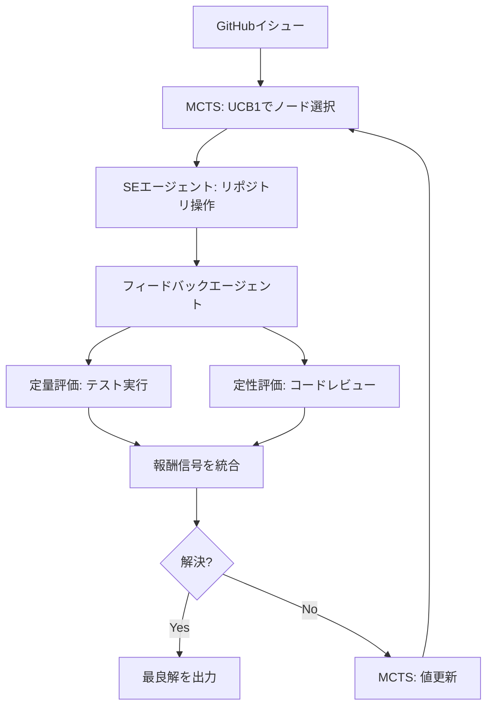

本記事は [SWE-Search: Enhancing Software Engineering Agents with Monte Carlo Tree Search and Iterative Refinement](https://arxiv.org/abs/2405.15793) の解説記事です。

## 論文概要（Abstract）

SWE-Searchは、Monte Carlo Tree Search（MCTS）をソフトウェアエンジニアリング（SE）エージェントに統合するマルチエージェントフレームワークである。専用のフィードバックエージェントが定量的メトリクス（テスト実行結果）と定性的評価（コード品質批評）の両方に基づく報酬信号を提供し、MCTSの探索を誘導する。著者らは、SWE-bench Verified（500件の人間検証済みインスタンス）においてベースラインのSWE-agentに対して23%の相対改善（18.0%→22.2%）を達成し、追加の計算リソースに応じて性能がスケーリングすることを報告している。

この記事は [Zenn記事: Tree of Thoughtsでコード生成の精度を上げる](https://zenn.dev/0h_n0/articles/09571f57fb38c9) の深掘りです。

## 情報源

- **arXiv ID**: 2405.15793
- **URL**: [https://arxiv.org/abs/2405.15793](https://arxiv.org/abs/2405.15793)
- **著者**: Anton Osika（筆頭）, Maja Backman, Axel Theorell, Sehoon Kim, Gustav von Zitzewitz et al.
- **発表年**: 2024
- **分野**: cs.SE, cs.AI

## 背景と動機（Background & Motivation）

LLMを用いたSEエージェントは急速に発展しているが、関数レベルのコード生成（HumanEval等）とリポジトリレベルのSEタスク（SWE-bench等）の間には大きなギャップがある。実世界のGitHubイシュー解決には、リポジトリ構造の理解、複数ファイルにまたがるコード変更、既存テストスイートとの整合性確認が求められ、単一のエージェント試行では成功率が低い。

SWE-benchは2,294件のGitHubイシュー（Python、Django・scikit-learn等の主要OSSリポジトリ）から構成されるベンチマークであり、SWE-bench Verifiedはその中から500件を人間が検証したサブセットである。単一試行のSWE-agentの解決率は18.0%にとどまり、複数回の試行や探索戦略による改善が求められていた。

著者らは、ToT（Tree of Thoughts）やLATS（Language Agent Tree Search）が推論タスクで有効であることに着目し、MCTSの探索-活用バランスをSEタスクに適用した。SWE-Searchの核心的な発見は、MCTS単体ではほぼ効果がなく（+0.4ポイント）、フィードバックエージェントによる報酬信号が探索の成否を決定するという点である。

## 主要な貢献（Key Contributions）

- **貢献1**: MCTS×SEエージェントの統合フレームワークSWE-Searchの提案。MCTSの標準的な4段階（選択・展開・シミュレーション・逆伝播）をSEタスクの長い逐次行動コンテキストに適応
- **貢献2**: 定量（テスト実行結果）と定性（コード品質レビュー）の両面で報酬を提供するフィードバックエージェントの設計。定量のみ、定性のみでは不十分であることを示唆
- **貢献3**: SWE-bench Verifiedで23%の相対改善（18.0%→22.2%）を実証。追加計算リソースでスケーリングする特性も確認
- **貢献4**: フィードバックなしMCTS（18.4%）の結果により、報酬信号の重要性を定量的に明示。MCTSの「探索」は手段であり、「評価」が本質であるという設計指針を提供

## 技術的詳細（Technical Details）

### 3コンポーネントアーキテクチャ



### SEエージェント（SWE-agent）

SWE-agent（Yang et al., 2024）をベースとし、コマンドラインインターフェースを通じてリポジトリと対話する。ファイルの閲覧、編集、テスト実行、Gitコマンドの実行等を行動空間として持つ。行動履歴がコンテキストウィンドウに蓄積されるため、長い操作シーケンスではコンテキスト長の制約が問題になる。

### MCTS（長逐次行動コンテキストへの適応）

SWE-Searchでは、MCTSを以下の点でSEタスクに適応している。

**ノード表現**: 各MCTSノードはSEエージェントのリポジトリ操作の1ステップを表す。囲碁のような離散的な盤面状態ではなく、ファイル変更差分とテスト状態を含む連続的なコンテキストとして管理される。

**UCB1によるノード選択**:

$$
\text{UCB1}(s, a) = Q(s, a) + c \cdot \sqrt{\frac{\ln N(s)}{N(s, a)}}
$$

ここで、$Q(s, a)$は行動$a$の累積報酬の平均、$N(s)$は状態$s$の総訪問回数、$N(s, a)$は行動$a$の訪問回数、$c$は探索定数である。

**段階的展開**: 従来のMCTSでは葉ノードをシミュレーション時に完全展開（rollout）するが、SWE-Searchでは葉ノードをSEエージェントが1ステップずつ段階的に探索する。各ステップでフィードバックエージェントから中間報酬を得るため、完全なrolloutを待つ必要がない。

### フィードバックエージェント

フィードバックエージェントはSWE-Searchの中核コンポーネントであり、以下の2種類の報酬信号を統合する。

**定量的メトリクス**: リポジトリの既存テストスイートを実行し、テスト結果を評価する。テスト合格数の増減、新規テスト失敗の有無、回帰の検出が含まれる。

**定性的評価**: LLMベースのコードレビューエージェントとして機能し、コード変更の品質をSE観点から批評する。可読性、設計パターンへの適合、エッジケースの処理、既存コードとの一貫性等を評価する。

この二重評価により、「テストは通るが品質の低い修正」（例: 特定テストケースのハードコード）を抑制する設計になっている。

**最良解の選択**: 探索終了時に、フィードバックエージェントが全軌道の中から最良の解を選択する。MCTSの探索深度が浅い場合でも、事後的な選択機能が性能に寄与する。

## 実装のポイント（Implementation）

**ベースモデル**: gpt-4o（SEエージェント、フィードバックエージェント共通）

**MCTSの探索定数$c$**: タスクの複雑度に応じたチューニングが必要。探索定数が大きすぎると未探索ノードへの訪問が増え、効率が低下する。小さすぎると局所最適に陥る。

**コンテキスト長の管理**: SEタスクは長い行動シーケンスを伴うため、コンテキストウィンドウの上限に達しやすい。SWE-Searchでは、行動履歴の要約や古い操作ログの圧縮により対処している。

**報酬信号の組み合わせ**: 定量（テスト結果）と定性（コード品質）の報酬の重み付けはハイパーパラメータであり、最適な比率はタスクやリポジトリの特性に依存する。

## Production Deployment Guide

### AWS実装パターン（コスト最適化重視）

SWE-Search型のリポジトリレベル自動修正パイプラインをAWSにデプロイする場合の構成を示す。

| 規模 | 月間リクエスト | 推奨構成 | 月額コスト概算 | 主要サービス |
|------|--------------|---------|-------------|------------|
| **Small** | ~500 (15/日) | Serverless | $100-300 | Lambda + Bedrock + CodeBuild + S3 |
| **Medium** | ~5,000 (150/日) | Hybrid | $500-1,500 | ECS Fargate + Bedrock + ElastiCache |
| **Large** | 50,000+ (1,500/日) | Container | $3,000-8,000 | EKS + Karpenter + EC2 Spot |

SWE-Searchはリポジトリのクローン、テスト実行、ファイル操作を伴うため、関数レベルのコード生成よりも計算コストが高い。

**Small構成の詳細**（月額$100-300）:
- **Lambda**: MCTS制御とフィードバック集約（$20/月）
- **CodeBuild**: リポジトリクローン・テスト実行のサンドボックス（$50/月）
- **Bedrock**: gpt-4oクラスモデル、Prompt Caching有効（$150/月）
- **S3**: リポジトリスナップショットとdiff保存（$10/月）
- **Step Functions**: MCTSイテレーションのオーケストレーション（$5/月）

**コスト削減テクニック**:
- 単純なイシューは単一試行のSWE-agentで処理し、失敗した場合のみSWE-Searchにフォールバック
- フィードバックエージェントの定性評価にHaikuクラスモデルを使用（コスト85%削減）
- CodeBuildのインスタンスタイプ最適化（small → medium → largeの段階的スケーリング）
- MCTSイテレーション数の動的調整（イシューの複雑度に応じて2-10イテレーション）

**コスト試算の注意事項**: 上記は2026年6月時点のAWS ap-northeast-1リージョン料金に基づく概算値です。最新料金は[AWS料金計算ツール](https://calculator.aws/)で確認してください。

### Terraformインフラコード

```hcl
resource "aws_codebuild_project" "swe_sandbox" {
  name         = "swe-search-sandbox"
  service_role = aws_iam_role.codebuild_role.arn

  environment {
    compute_type    = "BUILD_GENERAL1_SMALL"
    image           = "aws/codebuild/standard:7.0"
    type            = "LINUX_CONTAINER"
    privileged_mode = false

    environment_variable {
      name  = "MAX_MCTS_ITERATIONS"
      value = "5"
    }
  }

  source {
    type      = "S3"
    location  = "${aws_s3_bucket.repo_snapshots.bucket}/source.zip"
    buildspec = "buildspec_test.yml"
  }

  artifacts {
    type     = "S3"
    location = aws_s3_bucket.repo_snapshots.bucket
  }
}

resource "aws_lambda_function" "mcts_controller" {
  filename      = "mcts_controller.zip"
  function_name = "swe-search-mcts"
  role          = aws_iam_role.mcts_lambda.arn
  handler       = "index.handler"
  runtime       = "python3.12"
  timeout       = 300
  memory_size   = 2048

  environment {
    variables = {
      BEDROCK_MODEL_ID     = "anthropic.claude-3-5-sonnet-20241022-v2:0"
      FEEDBACK_MODEL_ID    = "anthropic.claude-3-5-haiku-20241022-v1:0"
      CODEBUILD_PROJECT    = aws_codebuild_project.swe_sandbox.name
      S3_BUCKET            = aws_s3_bucket.repo_snapshots.bucket
      MAX_ITERATIONS       = "5"
      EXPLORATION_CONSTANT = "1.414"
    }
  }
}

resource "aws_s3_bucket" "repo_snapshots" {
  bucket = "swe-search-repo-snapshots"
}

resource "aws_s3_bucket_lifecycle_configuration" "cleanup" {
  bucket = aws_s3_bucket.repo_snapshots.id

  rule {
    id     = "cleanup-old-snapshots"
    status = "Enabled"

    expiration {
      days = 7
    }
  }
}
```

### コスト最適化チェックリスト

- [ ] 単純イシューは単一試行→失敗時のみMCTS探索
- [ ] フィードバックの定性評価にHaikuクラスモデル使用
- [ ] MCTSイテレーション数の動的調整
- [ ] CodeBuildインスタンスタイプの段階的スケーリング
- [ ] S3ライフサイクルポリシー（スナップショット自動削除）
- [ ] Prompt Caching有効化
- [ ] AWS Budgets予算アラート設定
- [ ] CloudWatch異常検知アラーム設定
- [ ] Step Functions Express Workflows活用
- [ ] 未使用リソースの自動削除

## 実験結果（Results）

### SWE-bench Verified メイン結果（論文Table 1より）

| 手法 | 解決率 (%) |
|------|-----------|
| SWE-agent（1回試行） | 18.0 |
| SWE-agent（3回並列、最良選択） | 21.0 |
| SWE-agent + MCTS（フィードバックなし） | 18.4 |
| **SWE-Search** | **22.2** |

### 結果の分析

**フィードバックなしMCTSの無効性**: MCTS単体（18.0%→18.4%）のわずか+0.4ポイントの改善は、報酬信号なしでは探索が無方向になることを明確に示している。この結果は、木探索手法の設計において「何を探索するか」よりも「どう評価するか」が本質的に重要であるという設計指針を提供する。

**並列試行との比較**: 3回並列実行＋フィードバック選択（21.0%）は単一試行（18.0%）に対して+3.0ポイントの改善を示すが、SWE-Search（22.2%）はさらに+1.2ポイントを加える。この追加改善はMCTSの反復的改善（探索中にフィードバックを受けて方向を修正する能力）の効果である。

**計算スケーリング**: MCTSイテレーション数の増加に伴い性能が向上するスケーリング特性が確認されている。これは、計算予算に応じて性能と費用のトレードオフを調整できることを意味する。

## 実運用への応用（Practical Applications）

SWE-Searchのアーキテクチャは、以下の実務シナリオで活用が考えられる。

- **自動バグ修正**: GitHubイシューに対する自動修正候補の生成。MCTSにより複数の修正アプローチを探索し、フィードバックエージェントで品質を評価する。単純なイシューは単一試行、複雑なイシューにのみSWE-Searchを適用する階層的アプローチが現実的
- **コードレビュー支援**: フィードバックエージェントの定性評価機能は、PRの自動レビューコメント生成に転用可能。テスト結果だけでなくコード品質の観点も含む包括的なレビューを提供できる
- **リファクタリング**: 複数のリファクタリング戦略を木探索し、テスト結果に基づいて最適な戦略を選択する。回帰テストがフィードバック信号として機能する

ただし、1件のイシュー解決に複数回のリポジトリ操作とテスト実行が必要であるため、計算コストと時間の両面で単一試行の数倍に達する。全イシューに適用するのではなく、複雑度の高いイシューに選択的に適用する運用が現実的である。

## 関連研究（Related Work）

- **Tree of Thoughts (Yao et al., NeurIPS 2023)**: 木構造の推論探索。環境フィードバックがない点でSWE-Searchと異なる
- **LATS (Zhou et al., ICML 2024)**: MCTSをLLMエージェントに適用した先行研究。LATSは汎用タスク向けであり、SWE-SearchはSEタスクの長い逐次行動コンテキストに特化した適応を行っている
- **CodeTree (Li et al., NAACL 2025)**: コード生成に特化した木探索。関数レベルのコード生成が対象であり、SWE-Searchのリポジトリレベルのイシュー解決とは対象範囲が異なる
- **Agentless (Xia et al., 2024)**: エージェントを使わずにSWE-benchを解くアプローチ。SWE-Searchとは探索戦略が対照的

## まとめと今後の展望

SWE-Searchは、MCTSをソフトウェアエンジニアリングエージェントに統合し、フィードバックエージェントの定量・定性報酬信号がMCTS探索の成否を決定することを実証した。SWE-bench Verifiedでの23%相対改善（18.0%→22.2%）と、フィードバックなしMCTSの無効性（+0.4ポイントのみ）は、「探索は手段、評価が本質」という設計原則を明確にしている。今後の課題として、より洗練された報酬関数の設計、他プログラミング言語への展開、計算効率の改善が著者らにより挙げられている。

## 参考文献

- **arXiv**: [https://arxiv.org/abs/2405.15793](https://arxiv.org/abs/2405.15793)
- **Related Zenn article**: [https://zenn.dev/0h_n0/articles/09571f57fb38c9](https://zenn.dev/0h_n0/articles/09571f57fb38c9)
