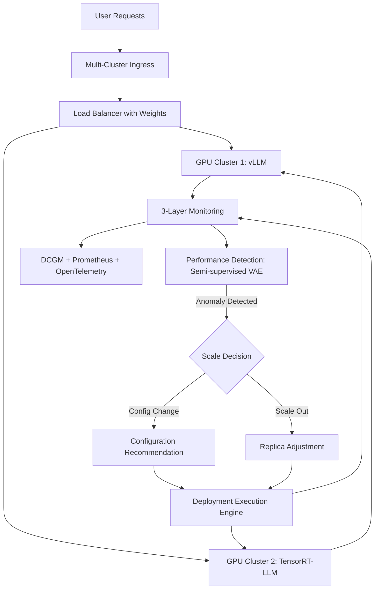

本記事は [https://arxiv.org/abs/2407.09486](https://arxiv.org/abs/2407.09486) の解説記事です。

## 論文概要（Abstract）

ENOVAは、マルチGPUクラスタ上でのサーバーレスLLMサービングにおいて、デプロイ構成の自動推定とオートスケーリングを統合的に解決するシステムである。著者らは、構成推薦モジュール（Configuration Recommendation）、性能検知モジュール（Performance Detection）、デプロイ実行エンジン（Deployment Execution Engine）の3コンポーネントを提案し、デフォルト構成と比較して2倍のスループット、既存手法（COSE, DDPG）と比較して1.3倍のスループット改善を報告している。異常検知ではF1スコア0.873を達成し、既存のVAEベース手法を上回ったと報告されている。

この記事は [Zenn記事: Bedrock AgentCore Runtimeで社内ヘルプデスクのセッション管理とコストを最適化する](https://zenn.dev/0h_n0/articles/6e0a4f321e18ab) の深掘りです。

## 情報源

- **arXiv ID**: 2407.09486
- **URL**: [arXiv:2407.09486](https://arxiv.org/abs/2407.09486)
- **著者**: Tao Huang, Pengfei Chen, Kyoka Gong他（8名）
- **投稿日**: 2024年5月
- **分野**: Distributed, Parallel, and Cluster Computing (cs.DC); Artificial Intelligence (cs.AI)

## 背景と動機（Background & Motivation）

マルチGPUクラスタ上でのLLMサービングには、以下の課題がある。

**構成パラメータの複雑性**: LLM推論サーバー（vLLM, TensorRT-LLM等）は`max_num_seqs`（同時処理バッチサイズ）、`gpu_memory_utilization`、`max_tokens`など多数のパラメータを持つ。これらの最適値はモデルサイズ、GPUハードウェア、ワークロード特性に依存し、手動チューニングはコストが高い。

**KVキャッシュとメモリのトレードオフ**: LLMのAutoregressive推論では、各トークン生成時にKVキャッシュがGPUメモリを消費する。著者らは、KVキャッシュのメモリ使用量がバッチサイズ（`max_num_seqs`）とシーケンス長に線形にスケールすることを指摘している。`max_num_seqs`を大きくしすぎるとOOM（Out of Memory）が発生し、小さくしすぎるとスループットが低下する。

**動的ワークロードへの対応**: 本番環境ではリクエスト量が時間帯やイベントによって変動する。既存のルールベースオートスケーラー（CPU/メモリ閾値ベース）はLLM特有のメトリクス（KVキャッシュ使用率、トークン生成レイテンシ等）を考慮しないため、過剰プロビジョニングまたはサービス品質低下を引き起こしやすい。

従来手法としてCOSE（ベイズ最適化ベースの構成探索）やDDPG（深層強化学習ベースの動的構成）が存在するが、著者らはこれらがLLM固有のKVキャッシュ特性を十分にモデル化できていないと主張している。

## 主要な貢献（Key Contributions）

- **Configuration Recommendation**: OLS回帰、KDE（カーネル密度推定）、コミュニティ検出を組み合わせた6パラメータ（`max_num_seqs`, `parallel_size`, `gpu_memory`, `max_tokens`, `replicas`, `weights`）の自動推定手法
- **Performance Detection**: 半教師ありVAEによる異常検知。少量のラベル付きデータで性能劣化を検知し、設定変更かスケールアウトかを判断
- **Deployment Execution Engine**: マルチクラスタスケジューラとDCGM/Prometheus/OpenTelemetryによる3層監視を統合した実行基盤

## 技術的詳細（Technical Details）

### ENOVAシステムアーキテクチャ



### 1. Configuration Recommendation

ENOVAの構成推薦モジュールは、6つのパラメータを段階的に推定する。

#### max_num_seqs の推定

著者らは、同時実行リクエスト数$n^r$と完了リクエスト数$n^f$の関係をOLS回帰でモデル化している。

$$
n^f = f(n^r) = \beta_0 + \beta_1 n^r + \epsilon
$$

ここで、
- $n^r$: 現在のrunning requests数
- $n^f$: 単位時間あたりのfinished requests数
- $\beta_0, \beta_1$: OLS回帰係数
- $\epsilon$: 誤差項

著者らの手法では、$n^r$を段階的に増加させながら$n^f$を計測し、t検定で$n^f$の増加が統計的に有意でなくなる点を$n_{\text{limit}}$として特定する。この飽和点が`max_num_seqs`の推定値となる。

$$
\text{max\_num\_seqs} \approx n_{\text{limit}} \times t_{\text{limit}}^r
$$

ここで$t_{\text{limit}}^r$はキャパシティ限界時の実行時間である。

#### gpu_memory と parallel_size の推定

GPUメモリ使用率$m^u$と$n^r$の関係も同様にOLS回帰でモデル化される。

$$
m^u = g(n^r) = \alpha_0 + \alpha_1 n^r
$$

メモリ使用量の内訳は以下の通り推定される。

$$
\text{mem} \approx \text{params} \times \text{sizeof(dtype)} + \text{max\_num\_seqs} \times \text{seq\_length} \times \text{token\_mem} + \text{others}
$$

$n^r = \text{max\_num\_seqs}$を代入することで必要な`gpu_memory`が推定され、ハードウェア仕様から`parallel_size`（テンソル並列度）が導出される。

#### max_tokens のタスククラスタリングによる推定

著者らは、ユーザーリクエストの出力トークン長分布がタスク種別によって大きく異なることに着目し、コミュニティ検出アルゴリズムでタスクをクラスタリングしている。

まず、リクエストを`bge-large-en`埋め込みモデルでベクトル化し、類似度グラフを構築する。次に、モジュラリティ$Q$を最大化するコミュニティ検出を行う。

$$
\mathcal{L}_Q = \frac{1}{2m} \sum_{i,j} \left[ A_{i,j} - \frac{k_i k_j}{2m} \right] \delta(c_i, c_j)
$$

ここで、
- $A_{i,j}$: 隣接行列の要素
- $k_i, k_j$: ノード$i, j$の次数
- $m$: 総エッジ数
- $\delta(c_i, c_j)$: ノード$i$と$j$が同一コミュニティに属する場合1、それ以外0

各クラスタごとにKDE（カーネル密度推定）で出力トークン長の分布を推定し、極値分布から`max_tokens`を設定する。これにより、コード生成タスク（長い出力）とQAタスク（短い出力）で異なる`max_tokens`が割り当てられる。

#### replicas と weights の最適化

レプリカ数と重みは線形計画法で決定される。

$$
\min \sum_{i} \text{score}^i \times \text{replicas}^i
$$

$$
\text{s.t.} \quad \sum_{i} n_{\text{limit}}^i \times \text{replicas}^i \geq n^f, \quad \text{parallel\_size}^i \times \text{replicas}^i \leq N^i
$$

ここで、
- $\text{score}^i$: GPU型$i$のメモリ適合度スコア
- $n_{\text{limit}}^i$: GPU型$i$での最大リクエスト処理数/秒
- $N^i$: GPU型$i$の利用可能デバイス数

ルーティングの`weights`は$n_{\text{limit}}^i$の値に比例して設定される。

### 2. Performance Detection（半教師ありVAE）

著者らは異常検知に半教師ありVAEを採用している。通常のVAEと異なり、少量のラベル付きデータ（正常/異常）を損失関数に組み込む。

$$
\mathcal{L}_{\text{vae}} = \frac{1}{|D^M|} \sum_{(m_i, l_i) \in D^M} \left[ l_i \cdot \mathbb{E}_{q_\phi(z|m)} \log p_\theta(m|z) - \frac{1+l_i}{2} \cdot \beta(k) \cdot \text{KL}\left(q_\phi(z|m_i) \| p_\theta(z)\right) \right]
$$

ここで、
- $m_i$: メトリクス入力（GPU使用率、KVキャッシュ使用率、レイテンシ等の時系列データ）
- $l_i \in \{1, -1\}$: ラベル（1=正常、-1=異常）
- $q_\phi(z \mid m)$: エンコーダの事後分布（パラメータ$\phi$）
- $p_\theta(m \mid z)$: デコーダの尤度（パラメータ$\theta$）
- $p_\theta(z)$: 潜在変数の事前分布（標準正規分布）
- $\beta(k)$: PIコントローラによるKLダイバージェンス重み（学習イテレーション$k$に依存）

**損失関数の設計意図**: ラベル$l_i = 1$（正常）の場合、再構成誤差を最小化し、KLダイバージェンスを正則化する標準的なVAE損失となる。$l_i = -1$（異常）の場合、再構成誤差の符号が反転し、異常データの再構成を意図的に困難にする。また、$(1 + l_i)/2$の項により、異常データに対するKL正則化が無効化される。この仕組みにより、正常データのみを高精度で再構成できるエンコーダ/デコーダが学習される。

**異常判定**: 学習済みVAEで推論時に入力メトリクス$m$のKLダイバージェンスを計算し、peaks-over-threshold法で自動設定された閾値と比較する。閾値超過で異常と判定する。

**スケール判断**: 入力$m$と再構成$m'$のMean Difference（MD）を計算し、MDの方向からスケールアップ（構成変更）かスケールアウト（レプリカ追加）かを判断する。

### 3. Deployment Execution Engine

実行エンジンは以下の3層で構成される。

**マルチクラスタスケジューラ**: リージョン横断でGPUリソースを管理し、構成推薦モジュールの出力に基づいてvLLMまたはTensorRT-LLMサーバーをデプロイする。

**3層監視システム**:
1. **ハードウェア層**: DCGM Exporterによるgpu_utilization、memory_used、temperature等のメトリクス収集
2. **ロードバランサ層**: Prometheus Exporterによるリクエスト分散状況の監視
3. **LLM推論層**: カスタムOpenTelemetry Collectorによる推論パイプラインの詳細分解（プリフィル時間、デコード時間、KVキャッシュヒット率等）

**データフロー**: 収集されたメトリクスは時系列データベースに格納され、ストリーム処理フレームワークで消費される。性能検知モジュールはこのストリーム上で動作し、異常検知後に構成推薦モジュールを再実行する。

## 実装のポイント（Implementation）

ENOVAのコードは[GitHub](https://github.com/Emerging-AI/ENOVA)で公開されている。

**推論エンジンの選択**: デフォルトはvLLMバックエンドであり、OpenAI API互換のエンドポイントを提供する。`enova pilot run --model mistralai/Mistral-7B-Instruct-v0.1`のようなワンコマンドで、デプロイ・監視・オートスケーリングを含む全機能が起動する。

**動作要件**: Linux OS + Docker、Python 3.10以上、NVIDIA GPU（Compute Capability 7.0以上）が必要である。

**OLS回帰のウォームアップ**: 構成推薦モジュールは初期のプロファイリングフェーズを必要とする。著者らの実装では、段階的にリクエスト負荷を増加させて$n^r$と$n^f$のデータポイントを収集している。このプロファイリング時間はモデルサイズとGPU種別に依存し、論文中では具体的な所要時間は明記されていない。

**半教師ありVAEのラベル**: 異常検知モジュールの学習には少量のラベル付きデータが必要となる。著者らは4週間分の監視データ（322,560データポイント、うち251件の異常）を使用しており、本番環境への適用には同様のラベル付けプロセスが必要となる点に注意が必要である。

## Production Deployment Guide

ENOVAが提案するLLMオートスケーリングの考え方をAWSで実現するための構成パターンを示す。なお、以下のコスト試算は2026年6月時点のap-northeast-1（東京）リージョンの概算値であり、実際のコストはトラフィックパターン、リージョン、バースト使用量により変動する。最新料金はAWS料金計算ツールで確認を推奨する。

### AWS実装パターン（コスト最適化重視）

| 構成 | トラフィック | 主要サービス | 月額概算 |
|------|-------------|-------------|---------|
| Small | ~100 req/日 | Lambda + Bedrock + CloudWatch Anomaly Detection | $50-150 |
| Medium | ~1,000 req/日 | ECS Fargate + Application Auto Scaling + Bedrock | $300-800 |
| Large | 10,000+ req/日 | EKS + Karpenter + DCGM Exporter + Prometheus | $2,000-5,000 |

**Small構成**: Lambda関数がBedrock APIを呼び出す構成。CloudWatch Anomaly Detectionでレイテンシ・エラー率の異常を検知する。セッション状態はDynamoDBに保持する。Bedrock Cross-Region Inference Profileでスループットを確保する。

**Medium構成**: ECS FargateタスクでLLMゲートウェイを運用し、Application Auto ScalingでCPU/メモリベースのスケーリングを行う。ENOVAの論文が指摘するLLM固有メトリクス（KVキャッシュ使用率等）のカスタムメトリクスをCloudWatchに送信し、ステップスケーリングポリシーに組み込む。

**Large構成**: EKS上でvLLMをGPUノードにデプロイし、KarpenterでGPUインスタンス（p4d.24xlarge等）をJust-in-timeプロビジョニングする。DCGM ExporterでGPUメトリクスをPrometheusに収集し、KEDA（Kubernetes Event-Driven Autoscaler）でカスタムメトリクスベースのスケーリングを実現する。Spot Instancesの活用で最大90%のコスト削減が可能である。

**コスト削減テクニック**:
- Spot Instances活用: GPU インスタンスでは最大90%削減（ただし中断リスクあり）
- Reserved Instances: 1年コミットで最大72%削減
- Bedrock Batch API: 非リアルタイム処理で50%削減
- Prompt Caching: Bedrock対応モデルで30-90%削減
- KEDA + Karpenter: スケールToゼロで夜間コスト削減（40-55%の総GPU コスト削減の報告あり）

### Terraformインフラコード

#### Small構成（Serverless: Lambda + Bedrock + DynamoDB）

```hcl
# --- Small構成: Lambda + Bedrock + CloudWatch Anomaly Detection ---

terraform {
  required_version = ">= 1.5"
  required_providers {
    aws = { source = "hashicorp/aws", version = "~> 5.0" }
  }
}

provider "aws" { region = "ap-northeast-1" }

# IAMロール（最小権限）
resource "aws_iam_role" "llm_lambda" {
  name = "llm-inference-lambda-role"
  assume_role_policy = jsonencode({
    Version = "2012-10-17"
    Statement = [{
      Action = "sts:AssumeRole"
      Effect = "Allow"
      Principal = { Service = "lambda.amazonaws.com" }
    }]
  })
}

resource "aws_iam_role_policy" "llm_lambda" {
  name = "llm-inference-policy"
  role = aws_iam_role.llm_lambda.id
  policy = jsonencode({
    Version = "2012-10-17"
    Statement = [
      {
        Effect   = "Allow"
        Action   = ["bedrock:InvokeModel", "bedrock:InvokeModelWithResponseStream"]
        Resource = "arn:aws:bedrock:*::foundation-model/*"
      },
      {
        Effect   = "Allow"
        Action   = ["dynamodb:GetItem", "dynamodb:PutItem", "dynamodb:UpdateItem", "dynamodb:Query"]
        Resource = aws_dynamodb_table.sessions.arn
      },
      {
        Effect   = "Allow"
        Action   = ["logs:CreateLogGroup", "logs:CreateLogStream", "logs:PutLogEvents"]
        Resource = "arn:aws:logs:*:*:*"
      }
    ]
  })
}

# セッション管理用DynamoDB（On-Demandでコスト最適化）
resource "aws_dynamodb_table" "sessions" {
  name         = "llm-sessions"
  billing_mode = "PAY_PER_REQUEST"
  hash_key     = "session_id"
  range_key    = "timestamp"

  attribute {
    name = "session_id"
    type = "S"
  }
  attribute {
    name = "timestamp"
    type = "N"
  }

  ttl {
    attribute_name = "ttl"
    enabled        = true
  }

  server_side_encryption { enabled = true }
}

# Lambda関数
resource "aws_lambda_function" "inference" {
  function_name = "llm-inference"
  runtime       = "python3.12"
  handler       = "handler.lambda_handler"
  role          = aws_iam_role.llm_lambda.arn
  timeout       = 300
  memory_size   = 512  # Bedrockクライアントのみのため512MBで十分

  filename         = "lambda.zip"
  source_code_hash = filebase64sha256("lambda.zip")

  environment {
    variables = {
      SESSION_TABLE = aws_dynamodb_table.sessions.name
      MODEL_ID      = "anthropic.claude-sonnet-4-20250514"
    }
  }

  tracing_config { mode = "Active" }  # X-Ray有効化
}

# CloudWatch Anomaly Detectionアラーム
resource "aws_cloudwatch_metric_alarm" "latency_anomaly" {
  alarm_name          = "llm-latency-anomaly"
  comparison_operator = "GreaterThanUpperThreshold"
  evaluation_periods  = 3
  threshold_metric_id = "ad1"
  alarm_actions       = [aws_sns_topic.alerts.arn]

  metric_query {
    id          = "m1"
    return_data = false
    metric {
      metric_name = "Duration"
      namespace   = "AWS/Lambda"
      period      = 60
      stat        = "p95"
      dimensions  = { FunctionName = aws_lambda_function.inference.function_name }
    }
  }
  metric_query {
    id          = "ad1"
    expression  = "ANOMALY_DETECTION_BAND(m1, 2)"
    label       = "Latency Anomaly Band"
    return_data = true
  }
}

resource "aws_sns_topic" "alerts" {
  name = "llm-cost-alerts"
}
```

#### Large構成（Container: EKS + Karpenter + Spot Instances）

```hcl
# --- Large構成: EKS + Karpenter + DCGM Exporter ---

module "eks" {
  source          = "terraform-aws-modules/eks/aws"
  version         = "~> 20.0"
  cluster_name    = "llm-serving-cluster"
  cluster_version = "1.31"

  vpc_id     = module.vpc.vpc_id
  subnet_ids = module.vpc.private_subnets

  # Karpenter用IAM
  enable_cluster_creator_admin_permissions = true
}

module "karpenter" {
  source  = "terraform-aws-modules/eks/aws//modules/karpenter"
  version = "~> 20.0"

  cluster_name = module.eks.cluster_name

  # Spot Instance中断ハンドリング
  enable_spot_termination = true

  node_iam_role_additional_policies = {
    AmazonSSMManagedInstanceCore = "arn:aws:iam::aws:policy/AmazonSSMManagedInstanceCore"
  }
}

# Karpenter NodePool（GPU Spot優先）
resource "kubectl_manifest" "gpu_nodepool" {
  yaml_body = yamlencode({
    apiVersion = "karpenter.sh/v1"
    kind       = "NodePool"
    metadata   = { name = "gpu-spot" }
    spec = {
      template = {
        spec = {
          requirements = [
            { key = "karpenter.sh/capacity-type", operator = "In", values = ["spot", "on-demand"] },
            { key = "node.kubernetes.io/instance-type", operator = "In",
              values = ["g5.xlarge", "g5.2xlarge", "p4d.24xlarge"] },
            { key = "kubernetes.io/arch", operator = "In", values = ["amd64"] }
          ]
          nodeClassRef = { group = "karpenter.k8s.aws", kind = "EC2NodeClass", name = "gpu" }
        }
      }
      limits   = { "nvidia.com/gpu" = "32" }
      disruption = {
        consolidationPolicy = "WhenEmptyOrUnderutilized"
        consolidateAfter    = "60s"
      }
    }
  })
}

# Secrets Manager（推論エンジン設定）
resource "aws_secretsmanager_secret" "llm_config" {
  name                    = "llm-serving/config"
  recovery_window_in_days = 7
}

resource "aws_secretsmanager_secret_version" "llm_config" {
  secret_id = aws_secretsmanager_secret.llm_config.id
  secret_string = jsonencode({
    model_name          = "meta-llama/Llama-2-70b-chat-hf"
    max_num_seqs        = 24    # ENOVAの推定値（論文Table 2より）
    gpu_memory_utilization = 0.90
    tensor_parallel_size   = 4
  })
}

# AWS Budgets（月額アラート）
resource "aws_budgets_budget" "gpu_cost" {
  name         = "llm-gpu-monthly"
  budget_type  = "COST"
  limit_amount = "5000"
  limit_unit   = "USD"
  time_unit    = "MONTHLY"

  notification {
    comparison_operator       = "GREATER_THAN"
    threshold                 = 80
    threshold_type            = "PERCENTAGE"
    notification_type         = "ACTUAL"
    subscriber_email_addresses = ["ops-team@example.com"]
  }
}
```

### 運用・監視設定

#### CloudWatch Logs Insights クエリ

```
# コスト異常検知: 1時間あたりのトークン使用量スパイク
fields @timestamp, @message
| filter @message like /token_usage/
| stats sum(input_tokens) as total_input, sum(output_tokens) as total_output,
        sum(input_tokens + output_tokens) as total_tokens by bin(1h)
| sort @timestamp desc
| limit 24
```

```
# レイテンシ分析: P95/P99
fields @timestamp, duration_ms
| filter @message like /inference_complete/
| stats percentile(duration_ms, 95) as p95,
        percentile(duration_ms, 99) as p99,
        avg(duration_ms) as avg_ms by bin(5m)
| sort @timestamp desc
```

#### CloudWatch アラーム設定（Python）

```python
"""CloudWatch alarm configuration for LLM inference monitoring."""

import boto3

cloudwatch = boto3.client("cloudwatch", region_name="ap-northeast-1")


def create_token_usage_alarm(function_name: str, sns_topic_arn: str) -> dict:
    """Bedrockトークン使用量スパイクのアラームを作成する。

    Args:
        function_name: Lambda関数名
        sns_topic_arn: 通知先SNSトピックARN

    Returns:
        CloudWatch API レスポンス
    """
    return cloudwatch.put_metric_alarm(
        AlarmName=f"{function_name}-token-spike",
        ComparisonOperator="GreaterThanThreshold",
        EvaluationPeriods=3,
        MetricName="TokenUsage",
        Namespace="LLMInference",
        Period=300,
        Statistic="Sum",
        Threshold=100000,  # 5分あたり10万トークン
        ActionsEnabled=True,
        AlarmActions=[sns_topic_arn],
        Dimensions=[{"Name": "FunctionName", "Value": function_name}],
    )
```

#### X-Ray トレーシング設定（Python）

```python
"""X-Ray tracing for Bedrock inference calls."""

from aws_xray_sdk.core import xray_recorder, patch_all

patch_all()  # boto3自動計装


@xray_recorder.capture("bedrock_inference")
def invoke_model(model_id: str, prompt: str) -> dict:
    """Bedrockモデル呼び出しをX-Rayトレース付きで実行する。

    Args:
        model_id: Bedrock モデルID
        prompt: 推論プロンプト

    Returns:
        モデルレスポンス
    """
    subsegment = xray_recorder.current_subsegment()
    subsegment.put_annotation("model_id", model_id)
    subsegment.put_metadata("prompt_length", len(prompt))

    # Bedrock呼び出し（boto3は自動計装済み）
    import boto3
    client = boto3.client("bedrock-runtime")
    response = client.invoke_model(
        modelId=model_id,
        body=prompt.encode(),
    )
    subsegment.put_metadata("status", response["ResponseMetadata"]["HTTPStatusCode"])
    return response
```

#### Cost Explorer自動レポート（Python）

```python
"""Daily cost report with SNS notification."""

import boto3
from datetime import datetime, timedelta


def get_daily_cost_report() -> dict[str, float]:
    """直近1日のサービス別コストを取得する。

    Returns:
        サービス名をキー、コスト（USD）を値とする辞書
    """
    ce = boto3.client("ce", region_name="us-east-1")
    today = datetime.utcnow().date()
    yesterday = today - timedelta(days=1)

    response = ce.get_cost_and_usage(
        TimePeriod={"Start": str(yesterday), "End": str(today)},
        Granularity="DAILY",
        Metrics=["UnblendedCost"],
        Filter={
            "Or": [
                {"Dimensions": {"Key": "SERVICE", "Values": ["Amazon Bedrock"]}},
                {"Dimensions": {"Key": "SERVICE", "Values": ["AWS Lambda"]}},
                {"Dimensions": {"Key": "SERVICE", "Values": ["Amazon Elastic Kubernetes Service"]}},
            ]
        },
        GroupBy=[{"Type": "DIMENSION", "Key": "SERVICE"}],
    )
    costs = {}
    for group in response["ResultsByTime"][0]["Groups"]:
        service = group["Keys"][0]
        amount = float(group["Metrics"]["UnblendedCost"]["Amount"])
        costs[service] = amount
    return costs


def notify_if_over_budget(threshold_usd: float = 100.0) -> None:
    """日次コストが閾値を超えた場合にSNS通知する。

    Args:
        threshold_usd: 通知閾値（USD/日）
    """
    costs = get_daily_cost_report()
    total = sum(costs.values())
    if total > threshold_usd:
        sns = boto3.client("sns", region_name="ap-northeast-1")
        message = f"Daily cost alert: ${total:.2f} (threshold: ${threshold_usd})\n"
        for service, cost in sorted(costs.items(), key=lambda x: -x[1]):
            message += f"  {service}: ${cost:.2f}\n"
        sns.publish(
            TopicArn="arn:aws:sns:ap-northeast-1:ACCOUNT_ID:llm-cost-alerts",
            Subject=f"LLM Cost Alert: ${total:.2f}/day",
            Message=message,
        )
```

### コスト最適化チェックリスト

**アーキテクチャ選択**:
- [ ] トラフィック量に応じた構成を選択（~100 req/日: Serverless、~1,000: Hybrid、10,000+: Container）
- [ ] Bedrock vs セルフホストの判断基準を明確化（カスタムモデル不要ならBedrock推奨）

**リソース最適化**:
- [ ] EC2 GPU Instancesは Spot 優先（g5, p4d系列で最大90%削減）
- [ ] Reserved Instances: 安定ベースラインに対して1年コミット（最大72%削減）
- [ ] Savings Plans検討（Compute Savings Plansで柔軟性確保）
- [ ] Lambda: メモリサイズをPower Tuningで最適化（128MB単位で試行）
- [ ] ECS/EKS: Karpenter consolidationPolicyで未使用ノード自動削除

**LLMコスト削減**:
- [ ] Bedrock Batch API使用（非同期処理で50%削減）
- [ ] Prompt Caching有効化（対応モデルで30-90%削減）
- [ ] モデル選択ロジック（簡単なクエリはHaiku、複雑なクエリはSonnet/Opus）
- [ ] max_tokensをタスク別に設定（ENOVAのコミュニティ検出アプローチを参考に）
- [ ] 入力プロンプトのトークン数制限（不要なコンテキスト削除）

**監視・アラート**:
- [ ] AWS Budgets設定（月額予算の80%/100%でアラート）
- [ ] CloudWatch Anomaly Detection（レイテンシ・エラー率）
- [ ] Cost Anomaly Detection有効化（AWS自動検知）
- [ ] 日次コストレポート（Cost Explorer API + SNS通知）
- [ ] GPUメトリクス監視（DCGM ExporterでKVキャッシュ使用率を追跡）

**リソース管理**:
- [ ] 未使用GPUノード自動削除（Karpenter TTL設定）
- [ ] タグ戦略（Environment/Team/Modelでコスト配賦）
- [ ] S3/ECRライフサイクルポリシー（古いモデルアーティファクト自動削除）
- [ ] 開発環境の夜間・週末自動停止（EventBridge Scheduler）
- [ ] NAT Gateway不使用（Small構成ではVPCエンドポイントで代替、コスト削減）

## 実験結果（Results）

### 構成推薦モジュールの評価（RQ1）

著者らは、Llama2（7B/13B/70B）とMistral（7B/8x7B）をA100 80GBおよびRTX 4090 24GBでベンチマークしている。

**構成比較（Llama2-70B on A100、論文Figure 4, Table 2より）**:

| 手法 | max_num_seqs | max_tokens (gsm8k) | max_tokens (mbpp) |
|------|-------------|-------------------|-------------------|
| Default | 8 | 256 | 256 |
| COSE | 42 | 784 | 1,879 |
| DDPG | 34 | 728 | 1,938 |
| **ENOVA** | **24** | **414** | **956** |

著者らは、`max_num_seqs`を大きくしすぎると収穫逓減が発生し、GPUメモリを浪費すると指摘している。ENOVAの保守的な値（24）はピーク性能を維持しつつメモリ効率を最大化する設計である。

**スループット**: 著者らは、ENOVAがデフォルト構成の約2倍、COSE/DDPGの約1.3倍のスループットを達成したと報告している（論文Figure 4）。

**精度への影響**: GSM8K精度およびMBPP pass@1において、ENOVA構成と他の構成の間に有意な差は観測されなかったと報告されている。

### 異常検知モジュールの評価（RQ2）

**データセット**: 8つのLLM、各2レプリカ、4週間の監視データ = 322,560データポイント（うち251件の異常ラベル）

**ベースライン比較（論文Table 3より）**:

| 手法 | Precision | Recall | F1-score |
|------|-----------|--------|----------|
| USAD | 0.767 | 0.586 | 0.664 |
| SDF-VAE | 0.683 | 0.829 | 0.749 |
| Uni-AD | 0.805 | 0.753 | 0.778 |
| **ENOVA** | **0.899** | **0.849** | **0.873** |

ENOVAはPrecision 0.899、Recall 0.849を達成し、ベースライン手法を上回っている。著者らは、半教師ありアプローチにより少量のラベルデータで高いPrecisionが得られることを利点として挙げている。

なお、評価にはpoint-adjusted方式が採用されている。これは、異常セグメント内の1点でも正しく検知できれば、そのセグメント全体を正解とみなす方式であり、実運用での使い勝手を考慮した評価方法である。

**オートスケーリングのケーススタディ（Mistral-7B on RTX 4090）**: 著者らは以下のシナリオを報告している。10:20にリクエスト急増が発生し、KVキャッシュ使用率が100%に到達した。ENOVAは10:22に異常を検知（検知レイテンシ約2分）。gpu_memory_utilizationを90%から95%に引き上げる構成変更を決定し、10:29にサービスが再起動された。結果として、レプリカ追加なしで1.6倍のリクエスト処理能力を確保したと報告されている。

### 制約と限界

著者らは以下の制約を明記している。

- **評価対象の限定**: テスト済みモデルはLlama2（7B/13B/70B）とMistral（7B/8x7B）のみ
- **GPU種別の限定**: A100 80GBとRTX 4090 24GBの2種類のみ
- **プロファイリングコスト**: 構成推薦の初期化にプロファイリングフェーズが必要（所要時間未記載）
- **ラベルデータの必要性**: 半教師ありVAEの学習には正常/異常ラベルが必要

## 実運用への応用（Practical Applications）

### Bedrock AgentCore Runtimeとの関連

Zenn記事で取り上げたBedrock AgentCore Runtimeは、セッション管理とサーバーレスLLMサービングを統合するAWSマネージドサービスである。ENOVAの知見は以下の点でAgentCore Runtimeの設計判断の理解に役立つ。

**セッション分離とリソース効率**: AgentCore Runtimeは各セッションを専用microVMで分離し、最大8時間のライフサイクルを提供する。ENOVAの構成推薦が示す`max_num_seqs`の最適化は、このmicroVM内での同時リクエスト処理数の設計指針として参考になる。

**オートスケーリング戦略**: AgentCore Runtimeのセッション非活動タイムアウト（デフォルト15分）とENOVAの異常検知ベーススケーリングは、補完的なアプローチである。前者はセッション粒度のリソース回収、後者はクラスタ粒度の性能最適化に対応する。

**マネージド vs セルフホストの判断**: AgentCore Runtimeを使う場合、ENOVAの構成推薦や異常検知はAWS側で抽象化される。一方、特定のモデル（ファインチューニング済みモデルやオープンソースモデル）をセルフホストする場合は、ENOVAのアプローチがEKS上での運用に直接適用可能である。

## 関連研究（Related Work）

- **COSE** (Bayesian Configuration Optimization): ベイズ最適化でシステムパラメータを探索する手法。ENOVAの著者らは、COSEがLLM固有のKVキャッシュ特性を考慮しない汎用手法であり、探索空間が大きくなる問題を指摘している。
- **DDPG** (Deep Deterministic Policy Gradient): 深層強化学習ベースの動的構成手法。連続行動空間での最適化に強いが、著者らは学習の不安定性とLLM推論のlong-tail latency特性への対応不足を指摘している。
- **USAD / SDF-VAE / Uni-AD**: 時系列異常検知のベースライン手法。いずれも教師なし学習ベースであり、ENOVAの半教師ありアプローチと比較してPrecisionが低い傾向がある。

## まとめと今後の展望

ENOVAは、LLMサービングの構成推薦と異常検知を統合的に解決するシステムであり、OLS回帰によるパラメータ推定、コミュニティ検出によるタスク別max_tokens設定、半教師ありVAEによる異常検知という3つの技術的貢献を持つ。著者らの実験では、デフォルト構成の2倍のスループットと、F1スコア0.873の異常検知性能が報告されている。

今後の課題として、より多様なモデル（Mixture of Experts、マルチモーダルモデル等）やGPUハードウェア（H100、MI300X等）への対応、初期プロファイリングコストの削減、および異常ラベル自動生成が挙げられる。AWS Bedrock AgentCore Runtimeのようなマネージドサービスの普及に伴い、ENOVAが提案するKVキャッシュ認識型のオートスケーリング手法は、マネージドサービスの内部実装やセルフホスト環境の双方で参考となる知見である。

## 参考文献

- **arXiv**: [https://arxiv.org/abs/2407.09486](https://arxiv.org/abs/2407.09486)
- **Code**: [https://github.com/Emerging-AI/ENOVA](https://github.com/Emerging-AI/ENOVA)
- **Related Zenn article**: [https://zenn.dev/0h_n0/articles/6e0a4f321e18ab](https://zenn.dev/0h_n0/articles/6e0a4f321e18ab)
- **AWS EKS GPU Autoscaling with Karpenter**: [https://aws.amazon.com/blogs/containers/scaling-a-large-language-model-with-nvidia-nim-on-amazon-eks-with-karpenter/](https://aws.amazon.com/blogs/containers/scaling-a-large-language-model-with-nvidia-nim-on-amazon-eks-with-karpenter/)
- **Bedrock AgentCore Runtime Sessions**: [https://docs.aws.amazon.com/bedrock-agentcore/latest/devguide/runtime-sessions.html](https://docs.aws.amazon.com/bedrock-agentcore/latest/devguide/runtime-sessions.html)
