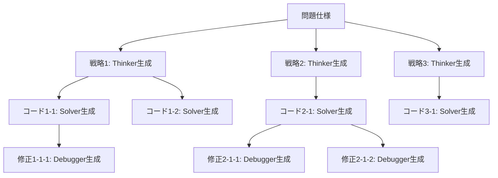

本記事は [CodeTree: Agent-guided Tree Search for Code Generation with Large Language Models](https://arxiv.org/abs/2411.04329) の解説記事です。

## 論文概要（Abstract）

CodeTreeは、LLMベースのエージェントが木構造を用いてコード生成の解空間を効率的に探索するフレームワークである。Thinker・Solver・Debugger・Criticの4つの専門エージェントにより、戦略生成・コード実装・デバッグ・品質評価を分離し、BFS/DFSによる体系的な探索を行う。著者らは、GPT-4oを用いた実験でHumanEval 95.1%、MBPP 98.7%、CodeContests 43.0%を達成し、従来手法を最大7.3ポイント上回ったと報告している。

この記事は [Zenn記事: Tree of Thoughtsでコード生成の精度を上げる](https://zenn.dev/0h_n0/articles/09571f57fb38c9) の深掘りです。

## 情報源

- **arXiv ID**: 2411.04329
- **URL**: [https://arxiv.org/abs/2411.04329](https://arxiv.org/abs/2411.04329)
- **著者**: Li Xue, Yida Lu, Zhengkun Zhang, Xindong He, Xu Han et al.
- **発表年**: 2025（NAACL 2025 採択）
- **分野**: cs.AI, cs.SE

## 背景と動機（Background & Motivation）

LLMによるコード生成は急速に発展しているが、複雑なプログラミング課題（競技プログラミング等）では単一パスの生成では正答率が低い。従来の改善手法は大きく3つに分類される。（1）反復的修正（Reflexion, Self-Debugging）は1本のパスを繰り返し修正するが、初期戦略が悪い場合に回復が困難である。（2）多数サンプリング（AlphaCode）は大量の候補を生成して選択するが、計算コストが高い。（3）木探索（Tree of Thoughts, LATS）は複数の推論パスを探索するが、コード生成に特化した設計がなされていない。

著者らは、コード生成の解空間を「戦略→実装→デバッグ」の3階層に分解し、各階層に専門エージェントを配置する木探索フレームワークCodeTreeを提案している。

## 主要な貢献（Key Contributions）

- **貢献1**: 戦略探索・コード生成・デバッグを統合した木構造フレームワークの提案
- **貢献2**: Thinker/Solver/Debugger/Criticの4エージェントによる役割分離設計
- **貢献3**: Criticエージェントによる自己生成テストケースを用いた評価機構
- **貢献4**: HumanEval 95.1%、CodeContests 43.0%で当時のSOTA達成（CodeContestsではLATSを+7.3ポイント上回る）

## 技術的詳細（Technical Details）

### 木構造のアーキテクチャ

CodeTreeの木構造は3つの階層で構成される。



- **レベル1（戦略ノード）**: 問題に対する高レベルのアルゴリズム的アプローチを自然言語で記述
- **レベル2（実装ノード）**: 各戦略に基づいたコード実装
- **レベル3以降（修正ノード）**: テスト失敗に基づくデバッグ版コード

### 4エージェントの役割

**Thinkerエージェント**: 問題記述を入力として、異なるアルゴリズム的アプローチを生成する。過去に試行して失敗した戦略のフィードバックを受け取り、重複を回避する。

**Solverエージェント**: 指定された戦略に基づいてコードを実装する。入力は問題記述と戦略テキストであり、出力は完全に実行可能なコードである。

**Debuggerエージェント**: テスト失敗したコードを分析し、エラーメッセージと失敗したテストケース（公開テスト＋Critic生成テスト）を基に修正版を生成する。

**Criticエージェント**: 2つの機能を持つ。（1）追加のテストケースを自動生成し、公開テストを補完する。（2）各ソリューションノードの品質をスコアリングし、探索の優先順位を決定する。

### 探索アルゴリズム

CodeTreeはBFS（幅優先探索）とDFS（深さ優先探索）の両方をサポートする。

**BFSモード**: 各深さレベルでノードを幅$w$個だけ展開してから次のレベルに進む。多様な戦略を浅く試すアプローチであり、HumanEvalやMBPPのような比較的平易なベンチマークで安定した性能を示す。

**DFSモード**: 有望な1つの戦略ブランチを深く掘り下げる。戦略→実装→修正を繰り返してから次の戦略に移る。CodeContestsのような高難度のベンチマークでは、深いデバッグが有効であるためDFSが優勢になる場合がある。

**早期終了**: いずれかのソリューションが公開テストおよびCritic生成テストをすべて通過した時点で探索を終了する。

### Criticの評価メカニズム

Criticエージェントの評価は以下の手順で行われる。

1. **テストケース生成**: 問題記述から追加のテストケースを自動生成する。公開テストが少ないCodeContestsのような場合に特に有効である
2. **実行評価**: ソリューションを公開テスト＋自己生成テストの両方で実行する
3. **判定**: accept（全テスト通過、品質十分）/ refine（修正が必要）/ abort（この戦略では解決困難）の3択で判定する

abort判定により不毛な探索ブランチを早期に打ち切ることができ、計算コストの削減に寄与する。

## 実装のポイント（Implementation）

著者らが報告している最良の構成パラメータは以下の通りである。

| パラメータ | 推奨値 | 備考 |
|-----------|--------|------|
| 探索戦略 | BFS | HumanEvalでは最良 |
| 幅 $w$ | 4 | 戦略の多様性と計算コストのバランス |
| 深さ $d$ | 2 | 修正の深さ。$d > 2$では改善が鈍化 |
| ベースモデル | GPT-4o | 全エージェント共通 |

**実装上の注意点**:

- Thinkerプロンプトには過去の失敗戦略を含めることで重複生成を回避する
- Debuggerの修正回数は$d=2$が最適であり、それ以上は同じ修正の繰り返しに陥りやすい
- Criticの自己生成テストは誤りを含む可能性があるため、公開テストとの不整合をチェックする必要がある

## Production Deployment Guide

### AWS実装パターン（コスト最適化重視）

CodeTreeのような多段LLM呼び出しパイプラインをAWSにデプロイする場合、トラフィック量に応じた構成を選択する。

| 規模 | 月間リクエスト | 推奨構成 | 月額コスト概算 | 主要サービス |
|------|--------------|---------|-------------|------------|
| **Small** | ~3,000 (100/日) | Serverless | $50-150 | Lambda + Bedrock + DynamoDB |
| **Medium** | ~30,000 (1,000/日) | Hybrid | $300-800 | Lambda + ECS Fargate + ElastiCache |
| **Large** | 300,000+ (10,000/日) | Container | $2,000-5,000 | EKS + Karpenter + EC2 Spot |

**Small構成の詳細**（月額$50-150）:
- **Lambda**: 1GB RAM, 60秒タイムアウト（$20/月）。各エージェント呼び出しを個別のLambda関数として実装
- **Bedrock**: Claude 3.5 Haiku、Prompt Caching有効（$80/月）。Thinker/Solver/Debuggerの共通システムプロンプトをキャッシュ
- **DynamoDB**: On-Demand、探索木の状態管理（$10/月）
- **Step Functions**: 4エージェント間のオーケストレーション（$5/月）

**コスト削減テクニック**:
- Prompt Caching有効化で入力コスト30-90%削減（同一問題に対する複数エージェント呼び出しで共通部分をキャッシュ）
- CriticにはHaikuクラスの軽量モデルを使用し、評価コストを85%削減
- Bedrock Batch APIで非リアルタイム処理は50%割引

**コスト試算の注意事項**: 上記は2026年6月時点のAWS ap-northeast-1リージョン料金に基づく概算値です。実際のコストはトラフィックパターンやバースト使用量により変動します。最新料金は[AWS料金計算ツール](https://calculator.aws/)で確認してください。

### Terraformインフラコード

**Small構成（Serverless）: Lambda + Bedrock + Step Functions**

```hcl
module "vpc" {
  source  = "terraform-aws-modules/vpc/aws"
  version = "~> 5.0"

  name = "codetree-vpc"
  cidr = "10.0.0.0/16"
  azs  = ["ap-northeast-1a", "ap-northeast-1c"]
  private_subnets = ["10.0.1.0/24", "10.0.2.0/24"]

  enable_nat_gateway   = false
  enable_dns_hostnames = true
}

resource "aws_iam_role" "codetree_lambda" {
  name = "codetree-lambda-role"

  assume_role_policy = jsonencode({
    Version = "2012-10-17"
    Statement = [{
      Action    = "sts:AssumeRole"
      Effect    = "Allow"
      Principal = { Service = "lambda.amazonaws.com" }
    }]
  })
}

resource "aws_iam_role_policy" "bedrock_invoke" {
  role = aws_iam_role.codetree_lambda.id
  policy = jsonencode({
    Version = "2012-10-17"
    Statement = [{
      Effect   = "Allow"
      Action   = ["bedrock:InvokeModel", "bedrock:InvokeModelWithResponseStream"]
      Resource = "arn:aws:bedrock:ap-northeast-1::foundation-model/anthropic.claude-*"
    }]
  })
}

resource "aws_lambda_function" "thinker" {
  filename      = "thinker.zip"
  function_name = "codetree-thinker"
  role          = aws_iam_role.codetree_lambda.arn
  handler       = "index.handler"
  runtime       = "python3.12"
  timeout       = 120
  memory_size   = 1024

  environment {
    variables = {
      BEDROCK_MODEL_ID    = "anthropic.claude-3-5-sonnet-20241022-v2:0"
      DYNAMODB_TABLE      = aws_dynamodb_table.tree_state.name
      ENABLE_PROMPT_CACHE = "true"
    }
  }
}

resource "aws_dynamodb_table" "tree_state" {
  name         = "codetree-tree-state"
  billing_mode = "PAY_PER_REQUEST"
  hash_key     = "problem_id"
  range_key    = "node_id"

  attribute {
    name = "problem_id"
    type = "S"
  }
  attribute {
    name = "node_id"
    type = "S"
  }

  ttl {
    attribute_name = "expire_at"
    enabled        = true
  }
}

resource "aws_cloudwatch_metric_alarm" "token_usage_spike" {
  alarm_name          = "codetree-token-spike"
  comparison_operator = "GreaterThanThreshold"
  evaluation_periods  = 1
  metric_name         = "Duration"
  namespace           = "AWS/Lambda"
  period              = 3600
  statistic           = "Sum"
  threshold           = 300000
  alarm_description   = "CodeTree Lambda実行時間異常"

  dimensions = {
    FunctionName = aws_lambda_function.thinker.function_name
  }
}
```

### 運用・監視設定

```sql
-- CloudWatch Logs Insights: エージェント別レイテンシ分析
fields @timestamp, agent_type, duration_ms, token_count
| stats avg(duration_ms) as avg_latency,
        pct(duration_ms, 95) as p95_latency,
        sum(token_count) as total_tokens
  by agent_type, bin(1h)
| sort avg_latency desc
```

```python
import boto3

cloudwatch = boto3.client('cloudwatch')

cloudwatch.put_metric_alarm(
    AlarmName='codetree-bedrock-token-spike',
    ComparisonOperator='GreaterThanThreshold',
    EvaluationPeriods=1,
    MetricName='TokenUsage',
    Namespace='Custom/CodeTree',
    Period=3600,
    Statistic='Sum',
    Threshold=500000,
    ActionsEnabled=True,
    AlarmActions=['arn:aws:sns:ap-northeast-1:123456789:cost-alerts'],
    AlarmDescription='Bedrockトークン使用量異常（コスト急増）'
)
```

### コスト最適化チェックリスト

- [ ] ~100 req/日 → Lambda + Bedrock (Serverless) - $50-150/月
- [ ] ~1000 req/日 → ECS Fargate + Bedrock (Hybrid) - $300-800/月
- [ ] 10000+ req/日 → EKS + Spot Instances (Container) - $2,000-5,000/月
- [ ] CriticにはHaikuクラスモデル使用（コスト85%削減）
- [ ] Prompt Caching有効化（共通システムプロンプトで30-90%削減）
- [ ] Bedrock Batch API使用（非リアルタイムで50%削減）
- [ ] DynamoDB TTL設定（探索木の自動クリーンアップ）
- [ ] Step Functions Express Workflows（短時間処理のコスト最適化）
- [ ] Lambda メモリサイズ最適化（Power Tuning）
- [ ] AWS Budgets月額予算アラート設定

## 実験結果（Results）

著者らが報告している主要な実験結果を以下に示す。

### メインベンチマーク（論文Table 1より）

| 手法 | HumanEval | MBPP | CodeContests |
|------|-----------|------|-------------|
| GPT-4o (pass@1) | ~90 | ~87 | ~18 |
| CodeChain | 90.0 | — | — |
| Reflexion | 91.0 | — | — |
| MapCoder | 93.9 | 83.1 | — |
| LATS | 94.4 | — | 35.7 |
| **CodeTree** | **95.1** | **98.7** | **43.0** |

CodeContestsでの+7.3ポイント（LATS 35.7% → CodeTree 43.0%）が最大の改善幅であり、論文のヘッドライン数値となっている。

### Ablation実験

著者らのablation実験では、各コンポーネントの除去がCodeContestsスコアの低下をもたらすことが確認されている。特にCriticの自己生成テストケースの除去は、公開テストが少ないCodeContestsで顕著な影響を与えたと報告されている。

### BFS vs DFS比較

著者らの比較実験では、BFSとDFSの差は0.6ポイント前後であり、タスク難度によって優劣が逆転する。HumanEvalではBFSがわずかに優勢（多様な戦略の浅い探索が有効）、CodeContestsではDFSがわずかに優勢（深いデバッグが有効）という結果が報告されている。

## 実運用への応用（Practical Applications）

CodeTreeのアーキテクチャは以下のシナリオで活用が考えられる。

- **CI/CDパイプライン**: PRに含まれるコードの自動テスト生成・修正をCodeTreeの探索で行い、人間レビュー前に品質を向上させる
- **競技プログラミング支援**: CodeContestsでの43.0%は、人間の中級プログラマーに匹敵する水準であり、ヒント生成やアプローチ提案に利用可能
- **レガシーコード移行**: 複数の移行戦略をThinkerで生成し、SolverとDebuggerで検証しながら最適な移行パスを探索する

ただし、1問あたりの推論に最大21回のAPI呼び出しが必要であるため、リアルタイム用途には不向きである。バッチ処理やオフライン評価での利用が現実的である。

## 関連研究（Related Work）

- **Tree of Thoughts (Yao et al., NeurIPS 2023)**: CodeTreeの探索構造の原型。ToTはコード生成に特化していないが、木構造の中間評価という概念を提供した
- **LATS (Zhou et al., ICML 2024)**: MCTSをLLMエージェントに適用した先行研究。CodeTreeはLATSの汎用MCTSを4エージェント構成に特化させることで、CodeContestsで+7.3ポイントの改善を実現した
- **AlphaCode / AlphaCode 2 (DeepMind)**: 大規模サンプリングによる競技プログラミング手法。CodeContestsでAlphaCode 2の26.2%をCodeTreeは43.0%で上回っている

## まとめと今後の展望

CodeTreeは、コード生成の解空間を戦略・実装・デバッグの3階層に分解し、4つの専門エージェントで探索する枠組みを提案した。HumanEval 95.1%、CodeContests 43.0%という結果は、木探索と専門エージェントの組み合わせの有効性を示している。一方で、GPT-4o以外のモデルでの評価が行われていない点、Criticの自己生成テストの信頼性、計算コストの増大（単一パスの5〜10倍）が課題として残されている。

## 参考文献

- **arXiv**: [https://arxiv.org/abs/2411.04329](https://arxiv.org/abs/2411.04329)
- **Related Zenn article**: [https://zenn.dev/0h_n0/articles/09571f57fb38c9](https://zenn.dev/0h_n0/articles/09571f57fb38c9)
