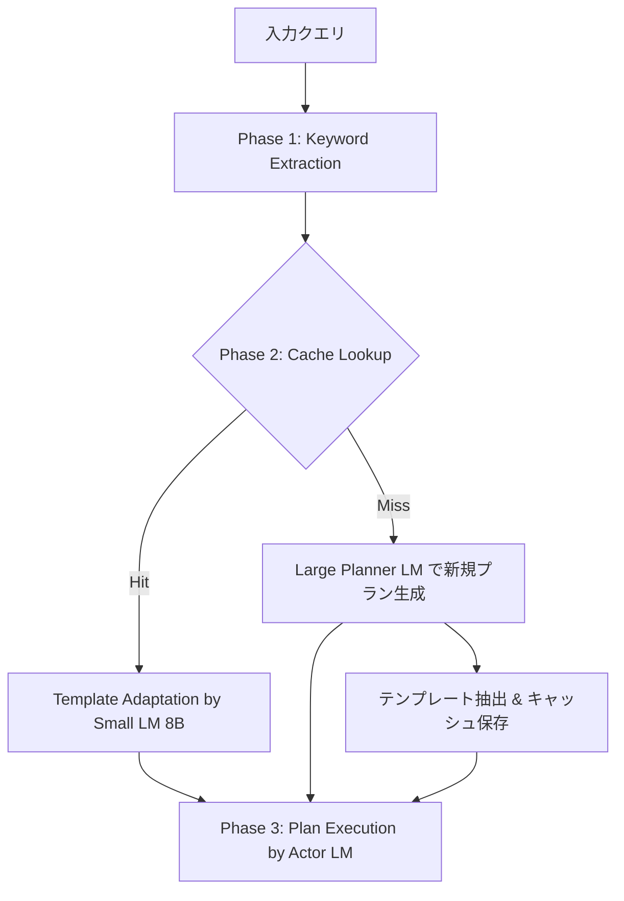

## 論文概要（Abstract）

本記事は [https://arxiv.org/abs/2506.14852](https://arxiv.org/abs/2506.14852) の解説記事です。

Agentic Plan Caching（APC）は、LLMエージェントの計画フェーズで生成された構造化プランテンプレートを抽出・保存・適応・再利用するテスト時メモリシステムである。著者らは、既存のLLMキャッシュ技術（コンテキストキャッシュ、セマンティックキャッシュ）がチャットボット向けに設計されており、外部データや環境コンテキストに依存するエージェントアプリケーションには不十分であると指摘している。APCは平均46.62%のコスト削減と27.28%のレイテンシ削減を達成しつつ、最適性能の96.67%を維持すると報告されている。

この記事は [Zenn記事: Bedrock AgentCore Runtimeで社内ヘルプデスクのセッション管理とコストを最適化する](https://zenn.dev/0h_n0/articles/6e0a4f321e18ab) の深掘りです。

## 情報源

- **arXiv ID**: 2506.14852
- **URL**: [https://arxiv.org/abs/2506.14852](https://arxiv.org/abs/2506.14852)
- **著者**: Qizheng Zhang, Michael Wornow, Gerry Wan, Kunle Olukotun（Stanford University）
- **発表年**: 2025（NeurIPS 2025 Poster）
- **分野**: cs.DC, cs.AI, cs.CL, cs.LG, cs.PF

## 背景と動機（Background & Motivation）

LLMベースのエージェントは、ツール呼び出し・計画生成・環境フィードバックの処理により、単純なチャットボットと比較して推論コストが大幅に増大する。著者らは、エージェントの計画フェーズ（Planner LM呼び出し）が全体コストの90%以上を占めることを明らかにしている（論文Table 2）。

従来のキャッシュ手法には以下の限界がある：

1. **コンテキストキャッシュ**（Anthropic Prompt Caching等）: 入力プレフィックスの完全一致が必要であり、環境コンテキストが変わるたびにキャッシュミスが発生する
2. **セマンティックキャッシュ**（GPTCache等）: クエリレベルの埋め込み類似度に基づくため、コンテキスト固有の詳細を過度に重視し、偽陽性・偽陰性率が高くなる
3. **Full-History Caching**: 実行ログ全体を小規模LMに渡す方式だが、ノイズが多く精度が低下する（FinanceBenchで72%、論文Table 1）

著者らは「タスクの意図（intent）は類似していても、環境コンテキスト（具体的なデータ値、ファイルパス等）は異なる」という観察に基づき、意図レベルでのキャッシュとコンテキスト適応を分離するアプローチを提案している。

## 主要な貢献（Key Contributions）

- **貢献1**: プランテンプレートの自動抽出・保存機構の設計。ルールベースフィルタとLLMベースフィルタの2段階でコンテキスト固有情報を除去し、再利用可能なテンプレートを生成
- **貢献2**: キーワード抽出によるキャッシュルックアップ。埋め込み類似度ではなく高レベル意図キーワードで完全一致検索を行い、偽陽性率を低減
- **貢献3**: 軽量LM（8Bパラメータ）によるテンプレート適応。キャッシュヒット時に大規模LMを呼び出さず、コストを大幅に削減
- **貢献4**: 複数のエージェントベンチマーク（FinanceBench、TabMWP）での包括的評価。コスト・精度・レイテンシのトレードオフを定量的に分析

## 技術的詳細（Technical Details）

### APCの3フェーズアーキテクチャ

APCは以下の3フェーズで動作する。



**Phase 1: Keyword Extraction**

コスト効率の高いLM（GPT-4o-mini）を用いて、入力クエリから高レベルの意図キーワードを抽出する。このとき、コンテキスト固有の詳細（具体的な企業名、数値等）は意図的に除外される。

例えば、「Apple社の2023年度の運転資本比率を計算せよ」というクエリからは「運転資本比率」「財務計算」といった意図キーワードのみが抽出される。

**Phase 2: Cache Lookup & Adaptation**

抽出されたキーワードでキャッシュを完全一致検索する。著者らがセマンティック類似度ではなくキーワード完全一致を採用した理由は、埋め込みベースのマッチングでは「Apple社の運転資本比率」と「Tesla社の運転資本比率」のクエリ間で、企業名の違いが類似度スコアを低下させ、本来同一テンプレートで処理可能なタスクがキャッシュミスになるためである。

キャッシュヒット時は、軽量LM（LLaMA-3.2-8B）がテンプレートを現在のコンテキストに適応させる。キャッシュミス時は、大規模Planner LMが新規プランを生成し、テンプレートを抽出してキャッシュに保存する。

**テンプレート抽出の2段階フィルタ**:

1. **ルールベースフィルタ**: 実行ログからツール出力・環境応答等の冗長情報を除去
2. **LLMベースフィルタ**: コンテキスト固有の値（企業名、日付、ファイルパス等）をプレースホルダに置換

**Phase 3: Plan Execution**

Actor LMが適応済みプランに従ってツールを呼び出し、タスクを実行する。

### キーワード抽出 vs 類似度マッチングの比較

著者らは論文内で、セマンティックキャッシュ（GPTCache方式）との比較を行っている。セマンティックキャッシュはクエリ全体の埋め込みベクトル間の類似度でキャッシュヒットを判定するが、以下の問題がある：

- **偽陽性**: 表面的に類似するが意図が異なるクエリを同一テンプレートにマッチさせる
- **偽陰性**: 意図は同一だがコンテキスト詳細が異なるクエリをミスと判定する

APCのキーワード方式は「意図」のみに基づくため、これらの問題を回避している。

## 実装のポイント（Implementation）

APCを実装する際の要点を、論文の記述に基づいて整理する。

**テンプレート抽出の品質管理**: テンプレートからコンテキスト固有情報を完全に除去できないと、適応時に不正確なプランが生成される。著者らはルールベースフィルタ（正規表現による数値・固有名詞の除去）とLLMベースフィルタ（GPT-4o-miniによるプレースホルダ置換）の2段階を推奨している。

**キャッシュストレージの設計**: キーワードをキーとした完全一致検索が基本となる。著者らの実装ではin-memoryのディクショナリを使用しているが、プロダクション環境ではKey-Valueストアが適する。キャッシュエビクションポリシーはLRU（Least Recently Used）が候補として挙げられているが、論文では詳細な比較は行われていない。

**モデル選択の考慮点**: Small Planner（テンプレート適応用）は8Bクラスで十分な性能が得られると報告されている。Large Plannerの呼び出し頻度がキャッシュヒット率に依存するため、ヒット率のモニタリングが運用上の鍵となる。

**フォールバック機構**: キャッシュヒット率が持続的に低い場合、動的にキャッシュを無効化する機構が望ましい。著者らは最悪ケース（ヒット率0%）でもオーバーヘッドが総コストの1.33%にとどまると報告しており、キャッシュの有効化・無効化の判断コストは低い。

```python
from dataclasses import dataclass, field
from typing import Optional


@dataclass
class PlanTemplate:
    """キャッシュに保存するプランテンプレート。

    Attributes:
        keywords: 意図キーワードのフローズンセット（キャッシュキー）
        template_steps: プレースホルダ付きのステップリスト
        source_query: テンプレート生成元のクエリ（デバッグ用）
        hit_count: キャッシュヒット回数（エビクション判定用）
    """
    keywords: frozenset[str]
    template_steps: list[str]
    source_query: str
    hit_count: int = 0


@dataclass
class PlanCache:
    """キーワード完全一致によるプランキャッシュ。

    Attributes:
        store: キーワードセットからテンプレートへのマッピング
        max_size: キャッシュの最大エントリ数
    """
    store: dict[frozenset[str], PlanTemplate] = field(default_factory=dict)
    max_size: int = 1000

    def lookup(self, keywords: frozenset[str]) -> Optional[PlanTemplate]:
        """キーワード完全一致でキャッシュを検索する。

        Args:
            keywords: 抽出された意図キーワードのセット

        Returns:
            一致するテンプレートが存在すればPlanTemplate、なければNone
        """
        template = self.store.get(keywords)
        if template is not None:
            template.hit_count += 1
        return template

    def insert(self, template: PlanTemplate) -> None:
        """テンプレートをキャッシュに挿入する。

        キャッシュが最大サイズに達している場合、LRUポリシーで
        最もヒット回数の少ないエントリを削除する。

        Args:
            template: 保存するプランテンプレート
        """
        if len(self.store) >= self.max_size:
            evict_key = min(self.store, key=lambda k: self.store[k].hit_count)
            del self.store[evict_key]
        self.store[template.keywords] = template
```

## Production Deployment Guide

APCのプランキャッシュシステムをAWS上で構築するための実装ガイドを示す。コスト試算は2026年6月時点のAWS ap-northeast-1（東京）リージョン料金に基づく概算値であり、実際のコストはトラフィックパターン、バースト使用量、割引プランの適用状況により変動する。最新料金は[AWS料金計算ツール](https://calculator.aws/)で確認を推奨する。

### AWS実装パターン（コスト最適化重視）

| 項目 | Small (~100 req/日) | Medium (~1,000 req/日) | Large (10,000+ req/日) |
|------|---------------------|------------------------|------------------------|
| **計算基盤** | Lambda | ECS Fargate | EKS + Karpenter |
| **キャッシュストア** | DynamoDB On-Demand | ElastiCache Redis (cache.t4g.micro) | Redis Cluster (cache.r7g.large x3) |
| **LLM** | Bedrock (Claude Sonnet) | Bedrock (Claude Sonnet) | Bedrock Batch + On-Demand |
| **Small LM** | Bedrock (Claude Haiku) | Bedrock (Claude Haiku) | SageMaker (LLaMA-3.2-8B on g5.xlarge Spot) |
| **監視** | CloudWatch Logs | CloudWatch + X-Ray | CloudWatch + X-Ray + Grafana |
| **月額概算** | $80-200 | $400-900 | $2,500-6,000 |

**Small構成の内訳概算**（100 req/日 = 3,000 req/月）:
- Lambda: 3,000回 x 30秒 x 512MB = 約$1.5/月（無料枠内の可能性あり）
- DynamoDB On-Demand: 3,000 WCU + 3,000 RCU = 約$1/月
- Bedrock Claude Sonnet 4.6（キャッシュミス時のLarge Planner）: 約$60-150/月（ヒット率依存）
- Bedrock Claude Haiku（Keyword Extraction + Template Adaptation）: 約$10-30/月
- CloudWatch Logs: 約$5/月

**Large構成の内訳概算**（10,000 req/日 = 300,000 req/月）:
- EKS コントロールプレーン: $73/月
- Karpenter管理ノード（Spot c6g.xlarge x2-4）: 約$80-200/月
- Redis Cluster: 約$450/月
- SageMaker g5.xlarge Spot（Small LM）: 約$300-500/月
- Bedrock（Large Planner、キャッシュミス時のみ）: 約$800-3,000/月
- 監視・ログ: 約$50-100/月

**コスト削減テクニック**:
- Spot Instances活用（EKSワーカーノード）で最大90%削減
- Bedrock Batch APIで非リアルタイム処理を50%削減
- Bedrock Prompt Cachingで繰り返しプレフィックスのコストを最大90%削減
- Reserved Instances（ElastiCache、SageMaker）で最大72%削減
- APCのキャッシュヒット自体がLarge Plannerコストを46-54%削減

### Terraformインフラコード

#### Small構成（Lambda + DynamoDB + Bedrock）

```hcl
# ---------------------------------------------------------
# APC Small構成: Lambda + DynamoDB + Bedrock
# 対象: ~100 req/日、月額 $80-200
# ---------------------------------------------------------

terraform {
  required_version = ">= 1.9"
  required_providers {
    aws = {
      source  = "hashicorp/aws"
      version = "~> 5.80"
    }
  }
}

provider "aws" {
  region = "ap-northeast-1"
}

# --- DynamoDB: プランキャッシュストア ---
resource "aws_dynamodb_table" "plan_cache" {
  name         = "apc-plan-cache"
  billing_mode = "PAY_PER_REQUEST" # On-Demand: 低トラフィック時のコスト最適化
  hash_key     = "keywords_hash"

  attribute {
    name = "keywords_hash"
    type = "S"
  }

  ttl {
    attribute_name = "expires_at"
    enabled        = true # 古いテンプレートの自動削除
  }

  point_in_time_recovery {
    enabled = true
  }

  server_side_encryption {
    enabled = true # AWS管理キーによる暗号化
  }

  tags = {
    Project     = "apc"
    Environment = "production"
    CostCenter  = "llm-optimization"
  }
}

# --- IAMロール: Lambda実行用（最小権限） ---
resource "aws_iam_role" "lambda_exec" {
  name = "apc-lambda-exec"

  assume_role_policy = jsonencode({
    Version = "2012-10-17"
    Statement = [{
      Action = "sts:AssumeRole"
      Effect = "Allow"
      Principal = { Service = "lambda.amazonaws.com" }
    }]
  })
}

resource "aws_iam_role_policy" "lambda_policy" {
  name = "apc-lambda-policy"
  role = aws_iam_role.lambda_exec.id

  policy = jsonencode({
    Version = "2012-10-17"
    Statement = [
      {
        Effect = "Allow"
        Action = [
          "dynamodb:GetItem",
          "dynamodb:PutItem",
          "dynamodb:UpdateItem",
          "dynamodb:DeleteItem"
        ]
        Resource = aws_dynamodb_table.plan_cache.arn
      },
      {
        Effect = "Allow"
        Action = [
          "bedrock:InvokeModel"
        ]
        Resource = "arn:aws:bedrock:ap-northeast-1::foundation-model/*"
      },
      {
        Effect = "Allow"
        Action = [
          "logs:CreateLogGroup",
          "logs:CreateLogStream",
          "logs:PutLogEvents"
        ]
        Resource = "arn:aws:logs:ap-northeast-1:*:*"
      },
      {
        # X-Ray トレーシング用
        Effect = "Allow"
        Action = [
          "xray:PutTraceSegments",
          "xray:PutTelemetryRecords"
        ]
        Resource = "*"
      }
    ]
  })
}

# --- Lambda関数: APCメインハンドラ ---
resource "aws_lambda_function" "apc_handler" {
  function_name = "apc-plan-cache-handler"
  role          = aws_iam_role.lambda_exec.arn
  handler       = "handler.lambda_handler"
  runtime       = "python3.13"
  timeout       = 120  # Bedrock呼び出しを考慮
  memory_size   = 512  # テンプレート処理に十分なメモリ

  filename         = "lambda_package.zip"
  source_code_hash = filebase64sha256("lambda_package.zip")

  environment {
    variables = {
      CACHE_TABLE_NAME       = aws_dynamodb_table.plan_cache.name
      LARGE_PLANNER_MODEL_ID = "anthropic.claude-sonnet-4-6-20260514-v1:0"
      SMALL_LM_MODEL_ID      = "anthropic.claude-haiku-4-5-20250520-v1:0"
      CACHE_TTL_HOURS        = "168" # 7日間
    }
  }

  tracing_config {
    mode = "Active" # X-Ray有効化
  }

  tags = {
    Project     = "apc"
    CostCenter  = "llm-optimization"
  }
}

# --- CloudWatch アラーム: コスト異常検知 ---
resource "aws_cloudwatch_metric_alarm" "lambda_duration" {
  alarm_name          = "apc-lambda-high-duration"
  comparison_operator = "GreaterThanThreshold"
  evaluation_periods  = 3
  metric_name         = "Duration"
  namespace           = "AWS/Lambda"
  period              = 300
  statistic           = "Average"
  threshold           = 90000 # 90秒（120秒タイムアウトの75%）
  alarm_description   = "Lambda実行時間がタイムアウトに近づいている"
  alarm_actions       = [] # SNS ARNを設定

  dimensions = {
    FunctionName = aws_lambda_function.apc_handler.function_name
  }
}

resource "aws_cloudwatch_metric_alarm" "lambda_errors" {
  alarm_name          = "apc-lambda-error-rate"
  comparison_operator = "GreaterThanThreshold"
  evaluation_periods  = 2
  metric_name         = "Errors"
  namespace           = "AWS/Lambda"
  period              = 300
  statistic           = "Sum"
  threshold           = 5
  alarm_description   = "Lambda エラーが5分間で5回以上発生"
  alarm_actions       = []

  dimensions = {
    FunctionName = aws_lambda_function.apc_handler.function_name
  }
}
```

#### Large構成（EKS + Karpenter + Redis Cluster）

```hcl
# ---------------------------------------------------------
# APC Large構成: EKS + Karpenter + Redis Cluster + Bedrock
# 対象: 10,000+ req/日、月額 $2,500-6,000
# ---------------------------------------------------------

terraform {
  required_version = ">= 1.9"
  required_providers {
    aws = {
      source  = "hashicorp/aws"
      version = "~> 5.80"
    }
    helm = {
      source  = "hashicorp/helm"
      version = "~> 2.17"
    }
    kubectl = {
      source  = "gavinbunney/kubectl"
      version = "~> 1.19"
    }
  }
}

provider "aws" {
  region = "ap-northeast-1"
}

# --- EKSクラスタ ---
module "eks" {
  source  = "terraform-aws-modules/eks/aws"
  version = "~> 20.31"

  cluster_name    = "apc-cluster"
  cluster_version = "1.31"

  vpc_id     = var.vpc_id
  subnet_ids = var.private_subnet_ids

  # コスト最適化: パブリックアクセスを制限
  cluster_endpoint_public_access  = true
  cluster_endpoint_private_access = true

  # Karpenter用のIAMロール設定
  enable_cluster_creator_admin_permissions = true

  # マネージドノードグループ（Karpenterコントローラ用の最小構成）
  eks_managed_node_groups = {
    system = {
      instance_types = ["c6g.medium"]     # ARM: コスト効率が高い
      capacity_type  = "ON_DEMAND"        # システムノードは安定性優先
      min_size       = 1
      max_size       = 2
      desired_size   = 1

      labels = {
        "node-role" = "system"
      }
    }
  }

  tags = {
    Project     = "apc"
    Environment = "production"
    "karpenter.sh/discovery" = "apc-cluster"
  }
}

# --- Karpenter: Spot優先の自動スケーリング ---
resource "helm_release" "karpenter" {
  name       = "karpenter"
  repository = "oci://public.ecr.aws/karpenter"
  chart      = "karpenter"
  version    = "1.1.1"
  namespace  = "kube-system"

  set {
    name  = "settings.clusterName"
    value = module.eks.cluster_name
  }

  set {
    name  = "settings.interruptionQueue"
    value = aws_sqs_queue.karpenter_interruption.name
  }
}

# Spot中断通知用SQSキュー
resource "aws_sqs_queue" "karpenter_interruption" {
  name                      = "apc-karpenter-interruption"
  message_retention_seconds = 300
  sqs_managed_sse_enabled   = true
}

# Karpenter NodePool: Spot優先でコスト最適化
resource "kubectl_manifest" "karpenter_nodepool" {
  yaml_body = yamlencode({
    apiVersion = "karpenter.sh/v1"
    kind       = "NodePool"
    metadata   = { name = "apc-workers" }
    spec = {
      template = {
        spec = {
          requirements = [
            {
              key      = "karpenter.sh/capacity-type"
              operator = "In"
              values   = ["spot", "on-demand"] # Spot優先
            },
            {
              key      = "kubernetes.io/arch"
              operator = "In"
              values   = ["amd64", "arm64"]
            },
            {
              key      = "node.kubernetes.io/instance-type"
              operator = "In"
              values   = ["c6g.xlarge", "c7g.xlarge", "c6i.xlarge", "m6g.xlarge"]
            }
          ]
          nodeClassRef = {
            group = "karpenter.k8s.aws"
            kind  = "EC2NodeClass"
            name  = "default"
          }
        }
      }
      limits = {
        cpu    = "32"    # 最大32 vCPU
        memory = "64Gi"
      }
      disruption = {
        consolidationPolicy = "WhenEmptyOrUnderutilized"
        consolidateAfter    = "30s"  # アイドルノードを迅速に回収
      }
    }
  })

  depends_on = [helm_release.karpenter]
}

# --- Secrets Manager: Bedrock設定 ---
resource "aws_secretsmanager_secret" "bedrock_config" {
  name        = "apc/bedrock-config"
  description = "APC Bedrock model configuration"

  tags = {
    Project = "apc"
  }
}

resource "aws_secretsmanager_secret_version" "bedrock_config" {
  secret_id = aws_secretsmanager_secret.bedrock_config.id
  secret_string = jsonencode({
    large_planner_model_id = "anthropic.claude-sonnet-4-6-20260514-v1:0"
    small_lm_model_id      = "anthropic.claude-haiku-4-5-20250520-v1:0"
    cache_ttl_hours        = 168
    max_tokens_planner     = 4096
    max_tokens_adapter     = 2048
  })
}

# --- AWS Budgets: 予算アラート ---
resource "aws_budgets_budget" "apc_monthly" {
  name         = "apc-monthly-budget"
  budget_type  = "COST"
  limit_amount = "6000"
  limit_unit   = "USD"
  time_unit    = "MONTHLY"

  cost_filter {
    name   = "TagKeyValue"
    values = ["user:Project$apc"]
  }

  notification {
    comparison_operator       = "GREATER_THAN"
    threshold                 = 80 # 80%到達で通知
    threshold_type            = "PERCENTAGE"
    notification_type         = "ACTUAL"
    subscriber_email_addresses = [var.alert_email]
  }

  notification {
    comparison_operator       = "GREATER_THAN"
    threshold                 = 100
    threshold_type            = "PERCENTAGE"
    notification_type         = "FORECASTED"
    subscriber_email_addresses = [var.alert_email]
  }
}

# --- 変数定義 ---
variable "vpc_id" {
  type        = string
  description = "VPC ID for EKS cluster"
}

variable "private_subnet_ids" {
  type        = list(string)
  description = "Private subnet IDs for EKS"
}

variable "alert_email" {
  type        = string
  description = "Email for budget alerts"
}
```

### 運用・監視設定

**CloudWatch Logs Insights クエリ**: キャッシュヒット率とコスト異常を検知する。

```
# キャッシュヒット率の時系列集計（1時間ごと）
fields @timestamp, cache_hit, model_used, cost_usd
| stats count(*) as total,
        sum(case when cache_hit = true then 1 else 0 end) as hits,
        sum(cost_usd) as total_cost
  by bin(1h)
| sort @timestamp desc

# Large Planner呼び出し頻度の異常検知
fields @timestamp, model_used, input_tokens, output_tokens
| filter model_used = "large_planner"
| stats count(*) as planner_calls, avg(input_tokens) as avg_input
  by bin(15min)
| filter planner_calls > 50
| sort @timestamp desc
```

**CloudWatch アラーム設定**:

```python
import boto3


def create_bedrock_token_alarm(
    alarm_name: str,
    sns_topic_arn: str,
    threshold_tokens: int = 500000,
) -> dict:
    """Bedrockトークン使用量のスパイク検知アラームを作成する。

    Args:
        alarm_name: アラーム名
        sns_topic_arn: 通知先SNSトピックのARN
        threshold_tokens: 5分間のトークン閾値

    Returns:
        CloudWatch put_metric_alarm APIレスポンス
    """
    client = boto3.client("cloudwatch", region_name="ap-northeast-1")
    return client.put_metric_alarm(
        AlarmName=alarm_name,
        MetricName="InputTokenCount",
        Namespace="AWS/Bedrock",
        Statistic="Sum",
        Period=300,
        EvaluationPeriods=2,
        Threshold=threshold_tokens,
        ComparisonOperator="GreaterThanThreshold",
        AlarmActions=[sns_topic_arn],
        Dimensions=[
            {"Name": "ModelId", "Value": "anthropic.claude-sonnet-4-6-20260514-v1:0"}
        ],
    )
```

**X-Ray トレーシング設定**:

```python
from aws_xray_sdk.core import xray_recorder, patch_all
from aws_xray_sdk.core.models.subsegment import Subsegment


# boto3の自動計装
patch_all()


def trace_apc_phase(phase_name: str, metadata: dict) -> Subsegment:
    """APCの各フェーズにX-Rayサブセグメントを付与する。

    Args:
        phase_name: フェーズ名（keyword_extraction / cache_lookup / plan_execution）
        metadata: トレースに付加するメタデータ

    Returns:
        開始されたサブセグメント
    """
    subsegment = xray_recorder.begin_subsegment(f"apc.{phase_name}")
    subsegment.put_annotation("phase", phase_name)
    subsegment.put_annotation("cache_hit", metadata.get("cache_hit", False))
    subsegment.put_metadata("details", metadata, "apc")
    return subsegment
```

**Cost Explorer 日次レポート**:

```python
import boto3
from datetime import date, timedelta


def get_daily_apc_cost(target_date: date | None = None) -> dict:
    """APC関連サービスの日次コストを取得する。

    Args:
        target_date: 集計対象日（デフォルトは前日）

    Returns:
        サービス別コストの辞書。$100/日超過時はSNS通知フラグを含む
    """
    if target_date is None:
        target_date = date.today() - timedelta(days=1)

    ce = boto3.client("ce", region_name="ap-northeast-1")
    start = target_date.isoformat()
    end = (target_date + timedelta(days=1)).isoformat()

    response = ce.get_cost_and_usage(
        TimePeriod={"Start": start, "End": end},
        Granularity="DAILY",
        Metrics=["UnblendedCost"],
        Filter={
            "Tags": {
                "Key": "Project",
                "Values": ["apc"],
            }
        },
        GroupBy=[{"Type": "DIMENSION", "Key": "SERVICE"}],
    )

    costs: dict[str, float] = {}
    for group in response["ResultsByTime"][0]["Groups"]:
        service = group["Keys"][0]
        amount = float(group["Metrics"]["UnblendedCost"]["Amount"])
        costs[service] = amount

    total = sum(costs.values())
    return {
        "date": start,
        "costs_by_service": costs,
        "total_usd": total,
        "alert": total > 100.0,  # $100/日超過で通知フラグ
    }
```

### コスト最適化チェックリスト

**アーキテクチャ選択**:
- [ ] トラフィック量に応じた構成を選択（100 req/日以下ならServerless、1,000以上ならContainer）
- [ ] キャッシュヒット率に基づいてLarge Planner呼び出し頻度を予測し、コストをシミュレーション

**リソース最適化**:
- [ ] EKSワーカーノードはSpot Instances優先（Karpenter `capacity-type: spot`）
- [ ] ElastiCache/Redis: Reserved Instances 1年コミットで最大40%削減
- [ ] Savings Plans: Compute Savings Plansで汎用的にコスト削減
- [ ] Lambda: メモリサイズを512MB-1024MBの範囲でPower Tuningにより最適化
- [ ] ECS/EKS: アイドル時のスケールダウン（Karpenter `consolidateAfter: 30s`）
- [ ] Graviton（ARM）インスタンスの採用でx86対比20%コスト削減

**LLMコスト削減**:
- [ ] Bedrock Batch APIで非同期処理可能なリクエストを50%削減
- [ ] Prompt Cachingを有効化し、システムプロンプトのキャッシュヒットで最大90%削減
- [ ] モデル選択ロジック: キャッシュヒット時はHaiku/8Bモデル、ミス時のみSonnetを使用
- [ ] 最大トークン数の制限: テンプレート適応は2048トークン、新規プラン生成は4096トークン
- [ ] APC自体のキャッシュヒットによりLarge Plannerコストを46-54%削減

**監視・アラート**:
- [ ] AWS Budgets: 月額予算の80%到達で通知、100%予測到達でアラート
- [ ] CloudWatch アラーム: Bedrockトークンスパイク、Lambda実行時間、エラー率
- [ ] Cost Anomaly Detection: AWS Cost Anomaly Detectionでサービス別異常検知を有効化
- [ ] 日次コストレポート: Cost Explorer APIで自動取得、$100/日超過でSNS通知

**リソース管理**:
- [ ] 未使用リソースの定期削除（使われていないDynamoDBテーブル、Lambda関数）
- [ ] タグ戦略: 全リソースに `Project=apc`, `Environment`, `CostCenter` タグを付与
- [ ] DynamoDB TTL: 古いキャッシュエントリの自動削除（デフォルト7日）
- [ ] 開発環境の夜間停止: EKSノードグループのスケジュールドスケーリング
- [ ] CloudWatch Logsの保持期間設定（30日）で長期ログコストを抑制

## 実験結果（Results）

著者らは、FinanceBenchとTabMWPの2つのベンチマークでAPCを評価している。

### 主要結果（論文Table 1より）

| 手法 | FinanceBench Accuracy | FinanceBench Cost | TabMWP Accuracy | TabMWP Cost |
|------|----------------------|-------------------|-----------------|-------------|
| Accuracy-Optimal（キャッシュなし） | 91.00% | $4.03 | 85.00% | $0.80 |
| Cost-Optimal（小規模LMのみ） | 54.00% | $0.21 | 63.00% | $0.08 |
| Semantic Caching | -- | -- | -- | -- |
| Full-History Caching | 72.00% | $1.99 | -- | -- |
| **APC** | **85.50%** | **$1.86** | **82.00%** | **$0.48** |

APCはFinanceBenchでコストを53.77%削減（$4.03 → $1.86）しつつ、精度を85.50%に維持している。TabMWPではコスト39.47%削減（$0.80 → $0.48）、精度82.00%と報告されている。

### コスト構成分析（論文Table 2より）

著者らは、APCなしの場合のコスト内訳を分析している。FinanceBenchではLarge Planner LMが全体コストの94.17%を占め、Actor LMが3.78%、Small Planner LMが0.90%、キャッシュオーバーヘッドが1.15%である。この分析から、計画フェーズのコスト支配構造が明確であり、プランキャッシュによる削減余地が大きいことが示されている。

### セマンティックキャッシュとの比較

著者らは、セマンティックキャッシュ（GPTCache方式）が「高い偽陽性率」を示すと報告している。意図が異なるクエリを同一キャッシュエントリにマッチさせてしまい、精度が低下する。APCのキーワード完全一致方式はこの問題を回避しているが、著者ら自身もキーワード抽出の品質がシステム全体の性能に直結する制約を認識している。

### 最悪ケース分析

キャッシュヒット率が0%（全てミス）の場合でも、APCのオーバーヘッド（Keyword Extraction + Cache Lookup）は総コストの平均1.33%にとどまると報告されている。この低オーバーヘッドにより、キャッシュが有効でないワークロードでも導入リスクは限定的である。

## 実運用への応用（Practical Applications）

### AgentCore Runtimeとの関連

Zenn記事で取り上げているBedrock AgentCore Runtimeは、マネージドなセッション管理とエージェント実行基盤を提供する。APCの設計思想はAgentCore Runtimeの文脈で以下のように応用できる可能性がある：

1. **セッション間プランキャッシュ**: AgentCore Runtimeのセッション管理機能と組み合わせ、異なるユーザーのセッション間で類似タスクのプランテンプレートを共有する。社内ヘルプデスクでは「パスワードリセット手順」「VPN接続方法」等の定型的な問い合わせが多く、キャッシュヒット率が高くなると推測される
2. **コスト按分の可視化**: APCのコスト構成分析（Large Planner 94%、Actor 4%等）を踏まえ、AgentCore Runtimeのコストメトリクスでフェーズ別のコストを監視する
3. **段階的なモデルスケーリング**: キャッシュヒット時はHaikuクラス、ミス時はSonnetクラスを使用するAPCのモデル選択パターンは、AgentCore Runtimeのモデルルーティング機能と親和性がある

ただし、APCは現時点で2段階のPlan-Actアーキテクチャに焦点を当てており、マルチエージェントシステムへの拡張には追加の研究が必要であると著者らは述べている。

## 関連研究（Related Work）

- **GPTCache**（Bang, 2023）: セマンティックキャッシュの先行研究。クエリの埋め込み類似度に基づくキャッシュだが、APCはこの方式の偽陽性率の高さを課題として指摘し、キーワード完全一致に置き換えた
- **ReAct**（Yao et al., 2022）: Thought-Action-Observationの交互生成パターン。APCが対象とするPlan-Actアーキテクチャの基盤の一つ
- **FrugalGPT**（Chen et al., 2023）: LLMカスケードによるコスト最適化。APCのLarge/Small Plannerのモデル切り替えと類似の設計思想だが、FrugalGPTはキャッシュではなくモデル選択に焦点を置いている

## まとめと今後の展望

APCは、LLMエージェントの計画フェーズにテスト時メモリ（プランキャッシュ）を導入することで、コストを平均46.62%削減しつつ精度の96.67%を維持するフレームワークである。キャッシュオーバーヘッドが1%程度と低く、最悪ケースでも導入リスクが限定的である点は実用上の利点と言える。

著者らは今後の方向として、RAGベースのキャッシュルックアップ、ユーザー設定可能なパラメータ（キャッシュサイズ、エビクションポリシー、ファジーマッチング閾値）の導入、プロダクションLLM/エージェントフレームワークへの統合を挙げている。社内ヘルプデスクのような定型タスクが多い環境ではキャッシュヒット率が高くなりやすく、APCの効果が顕著に発揮される可能性がある。

## 参考文献

- **arXiv**: [https://arxiv.org/abs/2506.14852](https://arxiv.org/abs/2506.14852)
- **OpenReview**: [https://openreview.net/forum?id=n4V3MSqK77](https://openreview.net/forum?id=n4V3MSqK77)
- **Related Zenn article**: [https://zenn.dev/0h_n0/articles/6e0a4f321e18ab](https://zenn.dev/0h_n0/articles/6e0a4f321e18ab)

---

本記事はAIによって生成されました。論文の内容を正確に伝えることを目指していますが、解釈の誤りがある可能性があります。正確な情報は原論文を参照してください。
