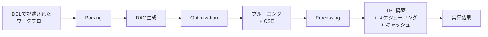
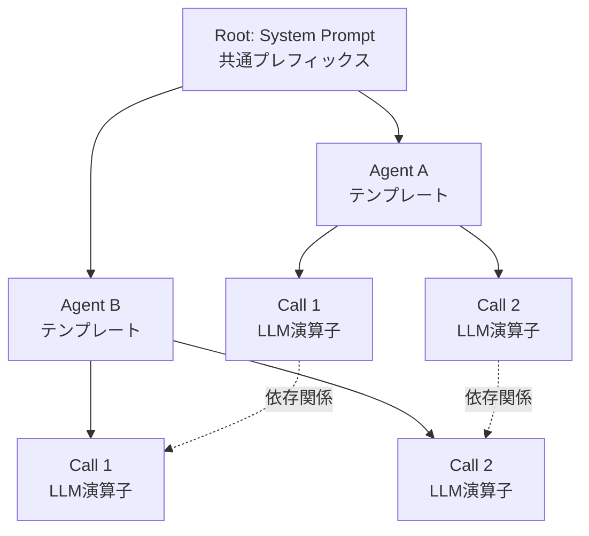

本記事は [https://arxiv.org/abs/2603.16104](https://arxiv.org/abs/2603.16104) の解説記事です。

**本記事はAIによって生成されました。**

## 論文概要（Abstract）

Heliumは、エージェントワークフローにおけるLLM呼び出しの冗長性をデータベースクエリ最適化の手法で排除するフレームワークである。著者らは、相互依存するLLM呼び出しの連鎖をクエリ実行プランとしてモデル化し、Templated Radix Tree（TRT）によるプロアクティブキャッシュとキャッシュ対応スケジューリングを導入した。19エージェント構成のTrading Workflowにおいて、vLLMベースラインに対して最大39.50倍、LangGraphに対して1.56倍のスループット改善が報告されている。

この記事は [Zenn記事: Bedrock AgentCore Runtimeで社内ヘルプデスクのセッション管理とコストを最適化する](https://zenn.dev/0h_n0/articles/6e0a4f321e18ab) の深掘りです。

## 情報源

- **arXiv ID**: 2603.16104
- **URL**: [https://arxiv.org/abs/2603.16104](https://arxiv.org/abs/2603.16104)
- **著者**: Noppanat Wadlom, Junyi Shen, Yao Lu
- **投稿日**: 2026年3月17日
- **分野**: cs.MA, cs.AI, cs.DB

## 背景と動機（Background & Motivation）

LLMベースのエージェントワークフローは、複数のLLM呼び出しが相互に依存する複雑な構造を持つ。従来のLLMサービングシステム（vLLM, SGLang等）は個々の推論リクエストを独立に最適化しており、ワークフロー全体に存在する冗長性を見落としていた。例えば、マルチエージェントディベートでは複数のエージェントが同一のシステムプロンプトやコンテキストを共有するにもかかわらず、毎回プレフィックスの計算が繰り返される。

著者らは、この課題がデータベース分野で長年研究されてきたクエリ最適化と構造的に類似していることに着目した。リレーショナルデータベースではSQL文を解析してクエリプランに変換し、冗長な演算の排除や実行順序の最適化を行う。Heliumはこの知見をLLMエージェントワークフローに適用し、ワークフロー全体を一つのクエリプランとして最適化することで、個別リクエスト最適化では到達できない効率性を実現している。

## 主要な貢献（Key Contributions）

- **貢献1**: エージェントワークフローをデータベースクエリプランとして定式化し、Parsing、Optimization、Processingの3フェーズからなるHeliumフレームワークを設計
- **貢献2**: Templated Radix Tree（TRT）を提案。プレフィックス階層と演算子間の依存関係を統合管理し、SGLangのRadixCacheと比較して26.8分の1のメモリ消費を実現
- **貢献3**: キャッシュ対応スケジューリング問題をNP困難であることを証明し、DFSベースの貪欲法で最適解からの平均乖離0.9%の近似アルゴリズムを提案

## 技術的詳細（Technical Details）

### Heliumの3フェーズアーキテクチャ

Heliumはデータベースの古典的なクエリ処理パイプラインに倣い、以下の3フェーズで構成される。



**Phase 1: Parsing（構文解析）**

ユーザがDSL（Domain-Specific Language）で記述したワークフローを解析し、DAG（有向非巡回グラフ）に変換する。各ノードはプロンプト関連の演算子（LLM呼び出し、テンプレート展開、結果集約等）を表す。

**Phase 2: Optimization（最適化）**

クエリオプティマイザが2つの変換を適用する。

1. **演算子プルーニング（Plan Pruning）**: DAGの後方走査で到達不能な演算子（デッドコード）を除去する。Ablation studyでは、この最適化単体で23.35%のレイテンシ削減に寄与したと報告されている（論文Table 3）。
2. **共通部分グラフ除去（Common Subgraph Elimination, CSE）**: 同一の入力を持つ同一構造の部分グラフを検出・統合する。

さらに、グローバルプロンプトキャッシュと照合し、キャッシュヒットした演算子を軽量なCacheFetch演算子に置換する。

**Phase 3: Execution Planning & Processing（実行計画と処理）**

最適化済みDAGからTRTを構築し、コストベースのキャッシュ対応スケジューリングを適用した後、プロアクティブキャッシュ機構と連携して実行する。

### Templated Radix Tree（TRT）

TRTは本論文の中核となるデータ構造であり、$T = (V, E, E')$ として定義される。

- $V$: ノード集合
- $E$: プレフィックス構造を表す辺（親子関係）
- $E'$: リーフノード間の依存関係を表す有向辺（DAG構造）

各中間ノードはトークン列とプレースホルダの組を保持する。プレースホルダは他の演算子の出力で埋められるトークン列を示す。各リーフノードは一つのLLM演算子に対応し、ルートからリーフまでのパスがそのLLM呼び出しのプロンプト構造を定義する。



**メモリ効率**: TRTはワークフローの構造（演算子数・テンプレート数）に比例してスケールし、リクエスト数には依存しない。論文Figure 11bによると、16ブランチの構成でHeliumは552 KiB、SGLangのRadixCacheは14.8 MiBを消費しており、約26.8倍の差がある。これは、RadixCacheが個々のリクエストのトークン列を保持するのに対し、TRTはテンプレート化された構造のみを保持するためである。

### プロアクティブキャッシュ機構

Heliumは2つの相補的なキャッシュ戦略を採用する。

**1. プロアクティブKVキャッシュ**

TRTの初回実行時に静的プロンプトプレフィックス（変数を含まないテンプレート部分）を特定し、そのKVキャッシュをGPUメモリ上に事前計算・保持する。2回目以降のバッチでは事前計算済みのKVテンソルを再利用し、冗長なprefill計算を回避する。

**2. グローバルプロンプトキャッシュ**

決定的な演算子（非LLM演算子、またはgreedy samplingのLLM呼び出し）の入出力マッピングをキャッシュする。オプティマイザがDAGをボトムアップ走査し、演算子の型と具体化された入力からシグネチャを計算する。キャッシュヒット時は演算子をCacheFetch演算子に置換し、LLM呼び出し自体をスキップする。LRU（Least Recently Used）方式で管理される。

Ablation studyによると、プロンプトキャッシュ単体で13.56%のレイテンシ削減に寄与したと報告されている（論文Table 3）。

### キャッシュ対応スケジューリング

#### コストモデル

ワーカ$i$のスケジュール$\sigma_i$における呼び出し$l_j^i$のトークン使用量は、prefillとdecodeに分解される。

**Prefill使用量**:

$$
u_p(i, j) = \begin{cases}
\sum_{v \in \text{path}(r, l_j^i)} \omega(v) & \text{(初回呼び出し)} \\
\sum_{v \in \text{path}(\text{LCA}, l_j^i)} \omega(v) & \text{(後続呼び出し)}
\end{cases}
$$

ここで、
- $\omega(v)$: ノード$v$のトークン重み
- $\text{path}(r, l_j^i)$: ルート$r$からリーフ$l_j^i$までのパス
- $\text{LCA}$: 直前の呼び出しとの最下位共通祖先（Lowest Common Ancestor）

後続呼び出しでは、LCAまでのプレフィックスが既にKVキャッシュに存在するため、LCAからリーフまでのトークンのみを計算すればよい。この系列依存的なトークン使用量が、スケジューリングによるKVキャッシュ再利用を直接モデル化している。

**Decode使用量**:

$$
u_d(i, j) = \frac{1}{2} \cdot \text{len\_out}(l_j^i) \cdot (\text{len\_out}(l_j^i) + 1)
$$

出力トークン長の二次関数となる。これはauto-regressiveデコーディングにおいて、各ステップでアテンション計算対象のトークンが1つずつ増加することを反映している。

**総トークンステップ数**:

$$
u(i, j) = \alpha_i \cdot (\text{len\_out}(l_j^i) \cdot u_p(i, j) + u_d(i, j))
$$

ここで $\alpha_i = 1 / M_i$（$M_i$はワーカ$i$のKVキャッシュ容量）。

**最適化目標**: 全ワーカの最大完了時刻を最小化する。

$$
\min_{\sigma} T(\sigma) = \min_{\sigma} \max_{i, j} c(i, j)
$$

依存関係制約として、先行演算子の完了後にのみ後続演算子が開始可能:

$$
b(i, j) \geq c(i', j') + d(i', j') \quad \forall (l_{j'}^{i'}, l_j^i) \in E'
$$

ここで $d(i, j) = \alpha_i M_i \cdot \text{len\_out}(l_j^i)$ は先行遅延（バッチング効果のモデル化）。

#### NP困難性と近似アルゴリズム

著者らは、この問題が並列機械スケジューリングのメイクスパン最小化問題（Lenstra et al., 1977）からの帰着によりNP困難であることを証明している。

提案するDFSベースの貪欲法（Algorithm 1）の概要は以下の通りである。

```python
def cache_aware_schedule(trt: TemplatedRadixTree, workers: list[int]) -> Schedule:
    """キャッシュ対応スケジューリングのDFSベース貪欲法

    Args:
        trt: Templated Radix Tree (V, E, E')
        workers: 利用可能なワーカのリスト

    Returns:
        各ワーカへの演算子割当と実行順序
    """
    # Step 1: リーフ集合をワーカに分割
    partitions = partition_leaves(trt.leaves, workers)

    # Step 2: 各ワーカについてスケジューリングツリーを構築
    schedules = []
    for worker_id, leaves in zip(workers, partitions):
        # DFSで部分木を走査
        # クリティカルパスヒューリスティック:
        # 集約依存関係深度が最大の部分木を優先
        subtree = build_scheduling_tree(trt, leaves)
        order = dfs_critical_path(subtree)
        schedules.append((worker_id, order))

    return Schedule(schedules)
```

時間計算量は $O(\lvert V_{\text{int}} \rvert \cdot c_{\max}^3 + \lvert E' \rvert \cdot d_{\max})$ である。ここで $\lvert V_{\text{int}} \rvert$ はTRTの内部ノード数、$c_{\max}$ は最大分岐数、$d_{\max}$ は最大深度である。

論文Table 5によると、理論的最適解からの乖離は平均0.9%、最大でも3.6%にとどまると報告されている。対照的に、SGLangのLSPF方式は平均14.5%、最大30.5%の乖離を示している。

## 実装のポイント（Implementation）

Heliumを実際に実装する際の注意点として、以下が挙げられる。

**DSL設計**: PythonベースのDSLでLLM呼び出しを演算子として抽象化し、依存関係を明示的に記述する。既存のLangGraph/AutoGenからの変換レイヤが必要になるケースが多い。

**TRT管理**: テンプレート変更時にTRT再構築が必要。プレースホルダの粒度（変数部分と固定部分の分離）が性能に直結する。

**GPUメモリ管理**: プロアクティブKVキャッシュはGPUメモリを常時占有するため、ワークフロー増加時のLRUエビクション閾値設計が運用上の鍵となる。

**キャッシュ適用範囲**: temperature > 0のLLM呼び出しはキャッシュ不可。greedy sampling適用可能な箇所を特定し、キャッシュ対象を最大化する設計が重要である。

## Production Deployment Guide

### AWS実装パターン（コスト最適化重視）

Heliumの設計思想をAWS上のエージェントワークフローに応用する場合の構成パターンを示す。コスト試算は2026年6月時点のap-northeast-1概算値であり、最新料金はAWS料金計算ツールで確認を推奨する。

| 項目 | Small (~100 req/日) | Medium (~1,000 req/日) | Large (10,000+ req/日) |
|------|---------------------|------------------------|------------------------|
| コンピュート | Lambda | ECS Fargate | EKS + Karpenter |
| キャッシュ | DynamoDB | ElastiCache Redis | Redis Cluster |
| LLM | Bedrock | Bedrock + Prompt Caching | Bedrock + Batch API |
| 月額概算 | $50-150 | $300-800 | $2,000-5,000 |

コスト削減: Spot Instances（最大90%削減）、Reserved Instances（最大72%削減）、Bedrock Batch API（50%削減）、Prompt Caching（30-90%削減）。

### Terraformインフラコード

#### Small構成（Serverless: Lambda + Bedrock + DynamoDB）

```hcl
# 月額 $50-150（~100 req/日）
terraform {
  required_version = ">= 1.12"
  required_providers { aws = { source = "hashicorp/aws", version = "~> 5.90" } }
}
provider "aws" { region = "ap-northeast-1" }

resource "aws_vpc" "main" {
  cidr_block = "10.0.0.0/16"
  tags       = { Name = "helium-vpc", Project = "helium-agent" }
}
# NAT Gateway不使用: VPCエンドポイント経由でBedrock/DynamoDB接続
resource "aws_vpc_endpoint" "bedrock" {
  vpc_id = aws_vpc.main.id
  service_name = "com.amazonaws.ap-northeast-1.bedrock-runtime"
  vpc_endpoint_type = "Interface"
}

resource "aws_lambda_function" "agent_handler" {
  function_name = "helium-agent-handler"
  runtime       = "python3.13"
  handler       = "handler.lambda_handler"
  role          = aws_iam_role.lambda_exec.arn
  timeout       = 300   # ワークフロー長時間実行対応
  memory_size   = 512   # Power Tuningで最適化推奨
  filename      = "lambda.zip"
  environment {
    variables = { CACHE_TABLE = aws_dynamodb_table.cache.name }
  }
  tracing_config { mode = "Active" }  # X-Ray
}

resource "aws_dynamodb_table" "cache" {
  name = "helium-prompt-cache"
  billing_mode = "PAY_PER_REQUEST"  # On-Demand: 低トラフィック最適
  hash_key = "cache_key"
  attribute { name = "cache_key"; type = "S" }
  ttl { attribute_name = "ttl"; enabled = true }
  server_side_encryption { enabled = true }
}
```

#### Large構成（EKS + Karpenter + Spot + Redis）

```hcl
# 月額 $2,000-5,000（10,000+ req/日）
module "eks" {
  source  = "terraform-aws-modules/eks/aws"
  version = "~> 20.35"
  cluster_name = "helium-production"
  cluster_version = "1.32"
  vpc_id     = aws_vpc.main.id
  subnet_ids = aws_subnet.private[*].id
  cluster_endpoint_public_access = false
}

# Karpenter: Spot優先GPU NodePool
resource "kubectl_manifest" "karpenter_nodepool" {
  yaml_body = yamlencode({
    apiVersion = "karpenter.sh/v1"
    kind = "NodePool"
    metadata = { name = "helium-gpu-spot" }
    spec = {
      template.spec.requirements = [
        { key = "karpenter.sh/capacity-type", operator = "In",
          values = ["spot", "on-demand"] },
        { key = "node.kubernetes.io/instance-type", operator = "In",
          values = ["g5.xlarge", "g5.2xlarge", "g6.xlarge"] },
      ]
      disruption = { consolidationPolicy = "WhenEmptyOrUnderutilized" }
    }
  })
}

resource "aws_elasticache_replication_group" "cache" {
  replication_group_id = "helium-cache"
  node_type = "cache.r7g.large"
  num_cache_clusters = 3
  at_rest_encryption_enabled = true
  automatic_failover_enabled = true
  multi_az_enabled = true
}
```

### 運用・監視設定

**CloudWatch Logs Insights（コスト異常検知）**:

```
fields @timestamp, @message
| filter @message like /token_usage/
| stats sum(input_tokens) as total_input by bin(1h)
| filter total_input > 1000000
```

**Bedrockトークンアラーム + 日次コストレポート（Python）**:

```python
import boto3
from datetime import datetime, timedelta

def create_bedrock_token_alarm(sns_topic_arn: str) -> dict:
    """1時間50万トークン超過でSNS通知"""
    return boto3.client("cloudwatch").put_metric_alarm(
        AlarmName="helium-bedrock-token-spike",
        MetricName="InputTokenCount", Namespace="AWS/Bedrock",
        Statistic="Sum", Period=3600, EvaluationPeriods=2,
        Threshold=500000, ComparisonOperator="GreaterThanThreshold",
        AlarmActions=[sns_topic_arn])

def daily_cost_report(sns_topic_arn: str, threshold: float = 100.0) -> dict:
    """日次コスト取得、閾値超過でSNS通知"""
    today = datetime.utcnow().date()
    result = boto3.client("ce").get_cost_and_usage(
        TimePeriod={"Start": str(today - timedelta(1)), "End": str(today)},
        Granularity="DAILY", Metrics=["UnblendedCost"],
        GroupBy=[{"Type": "DIMENSION", "Key": "SERVICE"}])
    total = sum(float(g["Metrics"]["UnblendedCost"]["Amount"])
                for g in result["ResultsByTime"][0]["Groups"])
    if total > threshold:
        boto3.client("sns").publish(TopicArn=sns_topic_arn,
            Subject=f"Cost Alert: ${total:.2f}/day", Message=f"Exceeded ${threshold}")
    return {"total_usd": total}
```

### コスト最適化チェックリスト

**アーキテクチャ**: トラフィック量で構成選択 / リージョン価格差比較

**リソース最適化**:
- [ ] Spot Instances優先（g5/g6で最大90%削減）
- [ ] ElastiCache Reserved Nodes 1年コミット（最大72%削減）
- [ ] Compute Savings Plans（Lambda + Fargate統合割引）
- [ ] Lambda Power Tuning（512MB開始、最適値探索）
- [ ] Karpenter consolidationPolicyでアイドル時スケールダウン

**LLMコスト削減**:
- [ ] Bedrock Batch API（非リアルタイム処理で50%削減）
- [ ] Prompt Caching有効化（共通プレフィックスで30-90%削減）
- [ ] タスク複雑度別モデル自動切替（Haiku/Sonnet/Opus）
- [ ] max_tokens用途別設定（要約: 1024, 分析: 4096）
- [ ] プロンプトテンプレート最適化（不要指示削除）

**監視・アラート**:
- [ ] AWS Budgets 80%/100%アラート
- [ ] CloudWatch トークン/レイテンシ/エラー率監視
- [ ] Cost Anomaly Detection有効化
- [ ] Cost Explorer日次レポート自動配信

**リソース管理**:
- [ ] DynamoDB TTLで90日間未アクセスエントリ削除
- [ ] Project/Environment/Ownerタグ全リソース付与
- [ ] CloudWatch Logs保持期間30日
- [ ] 開発EKS夜間停止（CronJob 20:00-08:00）
- [ ] S3 Intelligent-Tiering

## 実験結果（Results）

### マイクロベンチマークとEnd-to-End評価

著者らはQwen3-8Bモデルで5種類のワークフローパターンと19エージェント構成のTrading Workflowを評価している。主要結果を以下に示す（論文Table 2, Figure 5, 7より）。

| ベースライン | マイクロベンチ平均 | Trading Workflow (batch=16) |
|-------------|-------------------|---------------------------|
| vLLM | 66.27x遅い | 39.50x遅い |
| LangGraph | 1.28x遅い | 1.49x遅い |
| AgentScope | 2.10x遅い | 1.46x遅い |
| Parrot | 1.44x遅い | 2.51x遅い |
| KVFlow | 1.32x遅い | 1.34x遅い |

※ Heliumを基準（1.0x）とした相対レイテンシ

vLLMとの大幅な差は、ワークフロー内の依存関係やプレフィックス共有を考慮しない個別リクエスト処理に起因すると著者らは説明している。

### Ablation StudyとキャッシュヒットRate

各最適化コンポーネントの寄与度（論文Table 3, Trading Workflow, フルシステム: 130.14秒）:

| 除去コンポーネント | レイテンシ増加 |
|-------------------|---------------|
| Plan Pruning | +23.35% |
| Cache-Aware Scheduling | +17.66% |
| Prompt Caching | +13.56% |
| KV Caching | +3.55% |

キャッシュ対応スケジューリングにより、プレフィックスキャッシュヒット率はSGLangのLSPF方式の37.9%に対して56.5%を達成（+18.6ポイント、論文Table 4）。理論的最適解からの乖離は平均0.9%にとどまるのに対し、LSPFは14.5%の乖離を示したと報告されている（論文Table 5）。

## 実運用への応用（AgentCore Runtime連携）

Heliumの設計思想は、Bedrock AgentCore Runtimeで構築するエージェントワークフローに応用できる。

**プロンプトキャッシュ戦略**: AgentCore Runtimeのセッション間で共通するシステムプロンプトやコンテキストに対し、DynamoDBやElastiCacheに決定的な入出力マッピングを保存することで、重複LLM呼び出しを回避できる。

**ワークフロー最適化**: 社内ヘルプデスクの定型ワークフローでは、問い合わせカテゴリごとに実行パスが分岐するが共通プレフィックス（FAQ検索、ドキュメント参照等）が多い。Plan PruningとCSEの考え方でStep Functionsの分岐構造を最適化し、不要なLLM呼び出しを削減できる。

**制約**: 著者らの感度分析（論文Figure 10）によると、性能向上はプレフィックス共有度に依存し、共有が低いシナリオでは効果が縮小する。temperature > 0のタスクではグローバルプロンプトキャッシュが適用できないため、deterministic/stochasticな処理の分離が重要である。

## 関連研究（Related Work）

- **vLLM (Kwon et al., 2023)**: PagedAttentionによるKVキャッシュメモリ効率化。個別リクエスト最適化に留まり、Heliumはワークフロー構造活用で39.50倍のスループットを報告。
- **SGLang (Zheng et al., 2024)**: RadixTreeベースのプレフィックスキャッシュ。Heliumはテンプレート化と依存関係統合でメモリ消費26.8分の1、キャッシュヒット率+18.6ポイントを報告。
- **Parrot (Lin et al., 2024)**: セマンティック変数によるデータフロー最適化。TRTとNP困難性を考慮したスケジューリングでHeliumが差別化。

## まとめと今後の展望

Heliumは、エージェントワークフローの最適化にデータベースクエリ処理の手法を適用するという新規性の高いアプローチを提示した。TRTによるプレフィックス構造と依存関係の統合管理、プロアクティブキャッシュ、キャッシュ対応スケジューリングの3つの技術を組み合わせ、既存システムに対して有意なスループット改善が報告されている。

一方で、Qwen3-8Bでの評価が中心であり、大規模モデル（70B以上）やマルチGPU環境での検証は今後の課題である。DSLによるワークフロー定義が必要なため既存フレームワークからの移行コストも障壁となりうる。動的にエージェントが変化するケースへの対応も今後の研究方向として挙げられている。

## 参考文献

- [Wadlom et al. (2026). arXiv:2603.16104](https://arxiv.org/abs/2603.16104)
- [Zenn記事: Bedrock AgentCore Runtime](https://zenn.dev/0h_n0/articles/6e0a4f321e18ab)
- Kwon, W. et al. (2023). "PagedAttention." SOSP 2023.
- Zheng, L. et al. (2024). "SGLang." arXiv:2312.07104.
- Lin, C. et al. (2024). "Parrot." OSDI 2024.
